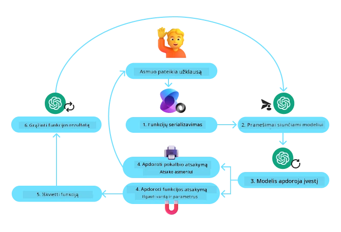
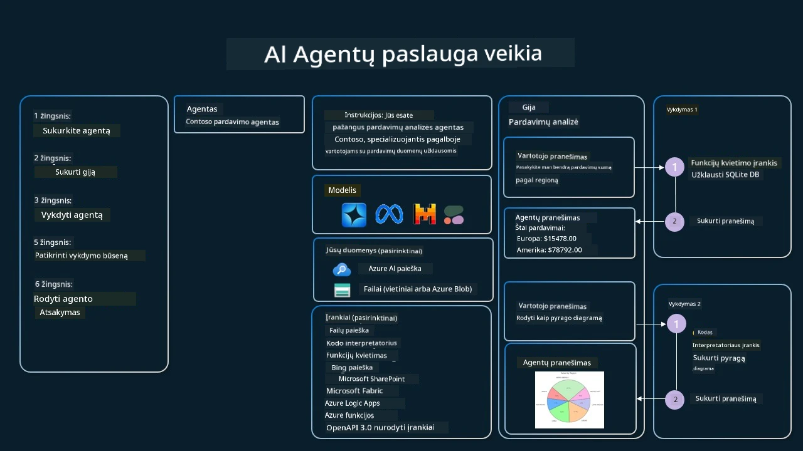

[](https://youtu.be/vieRiPRx-gI?si=cEZ8ApnT6Sus9rhn)

> _(Norėdami peržiūrėti šio pamokos vaizdo įrašą, spustelėkite aukščiau esantį paveikslėlį)_

# Įrankių naudojimo dizaino šablonas

Įrankiai yra įdomūs, nes leidžia AI agentams turėti platesnį galimybių spektrą. Vietoje to, kad agentas turėtų ribotą veiksmų rinkinį, pridėjus įrankį, agentas dabar gali atlikti platų veiksmų spektrą. Šiame skyriuje nagrinėsime Įrankių naudojimo dizaino šabloną, kuris aprašo, kaip AI agentai gali naudoti konkrečius įrankius siekdami savo tikslų.

## Įvadas

Šioje pamokoje siekiame atsakyti į šiuos klausimus:

- Kas yra įrankių naudojimo dizaino šablonas?
- Kokiuose panaudojimo atvejuose jis gali būti taikomas?
- Kokie yra elementai/statybiniai blokai, reikalingi dizaino šablonui įgyvendinti?
- Kokie yra specialūs svarstymai naudojant Įrankių naudojimo dizaino šabloną kuriant patikimus AI agentus?

## Mokymosi tikslai

Baigę šią pamoką galėsite:

- Apibrėžti Įrankių naudojimo dizaino šabloną ir jo paskirtį.
- Nustatyti panaudojimo atvejus, kuriuose tinka Įrankių naudojimo dizaino šablonas.
- Suprasti pagrindinius elementus, reikalingus dizaino šablonui įgyvendinti.
- Atpažinti svarstymus, siekiant užtikrinti patikimumą AI agentams, naudojantiems šį dizaino šabloną.

## Kas yra Įrankių naudojimo dizaino šablonas?

**Įrankių naudojimo dizaino šablonas** orientuojasi į LLM galimybę bendrauti su išoriniais įrankiais, siekiant konkrečių tikslų. Įrankiai yra kodas, kurį agentas gali vykdyti, kad atliktų veiksmus. Įrankis gali būti paprasta funkcija, pavyzdžiui, skaičiuoklė, arba API iškvietimas trečiosios šalies paslaugai, pavyzdžiui, akcijų kainų paieškai arba orų prognozei. AI agentų kontekste įrankiai sukurti taip, kad juos vykdytų agentai kaip atsakymą į **modelio sukurtus funkcijų iškvietimus**.

## Kokiuose panaudojimo atvejuose jis gali būti taikomas?

AI Agentai gali naudotis įrankiais sudėtingoms užduotims užbaigti, informacijai gauti ar sprendimams priimti. Įrankių naudojimo dizaino šablonas dažnai taikomas situacijose, kur reikia dinamiškai bendrauti su išorinėmis sistemomis, tokiomis kaip duomenų bazės, interneto paslaugos ar kodo interpretatoriai. Ši galimybė naudinga įvairiems panaudojimo atvejams, įskaitant:

- **Dinaminė informacijos gavimas:** Agentai gali kreiptis į išorines API arba duomenų bazes, kad gautų atnaujintus duomenis (pvz., užklausos SQLite duomenų bazėje duomenų analizei, akcijų kainų arba orų informacijos gavimas).
- **Kodo vykdymas ir interpretacija:** Agentai gali vykdyti kodą ar scenarijus, spręsti matematikos uždavinius, generuoti ataskaitas arba vykdyti simuliacijas.
- **Darbo srautų automatizavimas:** Pasikartojančių arba daugiapakopių darbo srautų automatizavimas integruojant tokius įrankius kaip užduočių planuotojai, el. pašto paslaugos arba duomenų vamzdynai.
- **Klientų aptarnavimas:** Agentai gali bendrauti su CRM sistemomis, bilietų platformomis ar žinių bazėmis, sprendžiant vartotojų užklausas.
- **Turinio generavimas ir redagavimas:** Agentai gali naudotis tokiais įrankiais kaip gramatikos tikrintuvai, teksto santraukų kūrėjai ar turinio saugos vertintojai, padedant kuriant turinį.

## Kokie yra elementai/statybiniai blokai, reikalingi įrankių naudojimo dizaino šablonui įgyvendinti?

Šie statybiniai blokai leidžia AI agentui atlikti platų užduočių spektrą. Pažvelkime į pagrindinius elementus, reikalingus Įrankių naudojimo dizaino šablonui įgyvendinti:

- **Funkcijų/Įrankių schemos:** Išsamios prieinamų įrankių apibrėžtys, įskaitant funkcijos pavadinimą, paskirtį, reikiamus parametrus ir numatomus išėjimus. Šios schemos leidžia LLM suprasti, kokie įrankiai yra pasiekiami ir kaip sudaryti galiojančius užklausimus.

- **Funkcijų vykdymo logika:** Nustato, kaip ir kada pristatomi įrankiai pagal vartotojo ketinimą ir pokalbio kontekstą. Tai gali apimti planavimo modulius, maršruto nustatymo mechanizmus arba sąlygines sekas, kurios dinamiškai nustato įrankių naudojimą.

- **Pranešimų valdymo sistema:** Komponentai, kurie valdo pokalbio eigą tarp vartotojo įvesties, LLM atsakymų, įrankių iškvietimų ir įrankių rezultatų.

- **Įrankių integracijos pagrindas:** Infrastruktūra, jungiantis agentą su įvairiais įrankiais, nesvarbu, ar tai paprastos funkcijos, ar sudėtingos išorinės paslaugos.

- **Klaidų valdymas ir tikrinimas:** Mechanizmai, skirti tvarkyti įrankių vykdymo gedimus, tikrinti parametrų teisingumą ir valdyti netikėtus atsakymus.

- **Būsenos valdymas:** Sekimas pokalbio kontekstu, ankstesniais įrankių sąveikomis ir nuolatiniais duomenimis, siekiant užtikrinti nuoseklumą daugkartiniuose pokalbių etapuose.

Toliau pažvelkime į funkcijų/įrankių iškvietimą detaliau.
 
### Funkcijų/Įrankių iškvietimas

Funkcijų iškvietimas yra pagrindinis būdas, kuriuo mes suteikiame Didiesiems kalbos modeliams (LLM) galimybę bendrauti su įrankiais. Dažnai matysite, kad žodžiai 'Funkcija' ir 'Įrankis' vartojami keičiamai, nes 'funkcijos' (pernaudojamo kodo blokai) yra tie 'įrankiai', kuriuos agentai naudoja užduotims atlikti. Kad funkcijos kodas būtų iškviestas, LLM turi palyginti vartotojo užklausą su funkcijos aprašymu. Tam siunčiama schema, kurioje yra visų prieinamų funkcijų aprašymai. LLM tada pasirenka tinkamiausią funkciją užduočiai ir grąžina jos pavadinimą bei argumentus. Pasirinkta funkcija yra iškviečiama, jos atsakymas siunčiamas atgal LLM, kuris naudoja gautą informaciją atsakydamas vartotojo užklausai.

Kad vystytojai galėtų įgyvendinti funkcijų iškvietimą agentams, reikia:

1. LLM modelio, palaikančio funkcijų iškvietimą
2. Schemos, kurioje yra funkcijų aprašymai
3. Kodo kiekvienai aprašytai funkcijai

Panaudokime pavyzdį, kaip gauti einamą laiką mieste:

1. **Inicijuoti LLM, palaikantį funkcijų iškvietimą:**

    Ne visi modeliai palaiko funkcijų iškvietimą, todėl svarbu patikrinti, ar LLM, kurį naudojate, tai turi.     <a href="https://learn.microsoft.com/azure/ai-services/openai/how-to/function-calling" target="_blank">Azure OpenAI</a> palaiko funkcijų iškvietimą. Galime pradėti inicijuodami Azure OpenAI klientą.

    ```python
    # Inicializuoti Azure OpenAI klientą
    client = AzureOpenAI(
        azure_endpoint = os.getenv("AZURE_AI_PROJECT_ENDPOINT"), 
        api_key=os.getenv("AZURE_OPENAI_API_KEY"),  
        api_version="2024-05-01-preview"
    )
    ```

1. **Sukurti Funkcijos schemą**:

    Toliau apibrėšime JSON schemą, kurioje yra funkcijos pavadinimas, jos veikimo aprašymas bei funkcijos parametrų pavadinimai ir aprašymai.
    Tada perduosime šią schemą anksčiau sukurtam klientui kartu su vartotojo užklausa, kad sužinotume laiką San Franciske. Svarbu pažymėti, kad grąžinamas yra **įrankio iškvietimas**, **o ne** galutinis atsakymas į klausimą. Kaip minėta anksčiau, LLM grąžina funkcijos, kurią pasirinko užduočiai, pavadinimą ir argumentus, kurie bus perduoti.

    ```python
    # Funkcijos aprašymas modeliui skaityti
    tools = [
        {
            "type": "function",
            "function": {
                "name": "get_current_time",
                "description": "Get the current time in a given location",
                "parameters": {
                    "type": "object",
                    "properties": {
                        "location": {
                            "type": "string",
                            "description": "The city name, e.g. San Francisco",
                        },
                    },
                    "required": ["location"],
                },
            }
        }
    ]
    ```
   
    ```python
  
    # Pradinis vartotojo pranešimas
    messages = [{"role": "user", "content": "What's the current time in San Francisco"}] 
  
    # Pirmas API kvietimas: Paprašykite modelio naudoti funkciją
      response = client.chat.completions.create(
          model=deployment_name,
          messages=messages,
          tools=tools,
          tool_choice="auto",
      )
  
      # Apdoroti modelio atsakymą
      response_message = response.choices[0].message
      messages.append(response_message)
  
      print("Model's response:")  

      print(response_message)
  
    ```

    ```bash
    Model's response:
    ChatCompletionMessage(content=None, role='assistant', function_call=None, tool_calls=[ChatCompletionMessageToolCall(id='call_pOsKdUlqvdyttYB67MOj434b', function=Function(arguments='{"location":"San Francisco"}', name='get_current_time'), type='function')])
    ```
  
1. **Funkcijos kodas, reikalingas užduočiai įvykdyti:**

    Dabar, kai LLM pasirinko, kuri funkcija turi būti vykdoma, reikia įgyvendinti ir vykdyti kodą, kuris atlieka užduotį.
    Galime įgyvendinti kodą, pateiktą laiką gauti Python kalba. Taip pat reikės parašyti kodą, kuris išgautų pavadinimą ir argumentus iš response_message ir gautų galutinį rezultatą.

    ```python
      def get_current_time(location):
        """Get the current time for a given location"""
        print(f"get_current_time called with location: {location}")  
        location_lower = location.lower()
        
        for key, timezone in TIMEZONE_DATA.items():
            if key in location_lower:
                print(f"Timezone found for {key}")  
                current_time = datetime.now(ZoneInfo(timezone)).strftime("%I:%M %p")
                return json.dumps({
                    "location": location,
                    "current_time": current_time
                })
      
        print(f"No timezone data found for {location_lower}")  
        return json.dumps({"location": location, "current_time": "unknown"})
    ```

     ```python
     # Apdoroti funkcijų iškvietimus
      if response_message.tool_calls:
          for tool_call in response_message.tool_calls:
              if tool_call.function.name == "get_current_time":
     
                  function_args = json.loads(tool_call.function.arguments)
     
                  time_response = get_current_time(
                      location=function_args.get("location")
                  )
     
                  messages.append({
                      "tool_call_id": tool_call.id,
                      "role": "tool",
                      "name": "get_current_time",
                      "content": time_response,
                  })
      else:
          print("No tool calls were made by the model.")  
  
      # Antras API kvietimas: Gauti galutinį modelio atsakymą
      final_response = client.chat.completions.create(
          model=deployment_name,
          messages=messages,
      )
  
      return final_response.choices[0].message.content
     ```

     ```bash
      get_current_time called with location: San Francisco
      Timezone found for san francisco
      The current time in San Francisco is 09:24 AM.
     ```

Funkcijų iškvietimas yra pagrindinė daugumos, jei ne visų, agentų įrankių naudojimo dizaino šablono dalis, tačiau jį įgyvendinti nuo nulio kartais gali būti sudėtinga.
Kaip sužinojome [Pamokoje 2](../../../02-explore-agentic-frameworks), agentų pagrindu sukurti karkasai suteikia mums iš anksto paruoštus statybinius blokus įrankių naudojimui įgyvendinti.
 
## Įrankių naudojimo pavyzdžiai naudojant agentų karkasus

Štai keli pavyzdžiai, kaip galite įgyvendinti Įrankių naudojimo dizaino šabloną, naudodami skirtingus agentų karkasus:

### Microsoft agentų karkasas

<a href="https://learn.microsoft.com/azure/ai-services/agents/overview" target="_blank">Microsoft Agent Framework</a> yra atvirojo kodo AI karkasas AI agentams kurti. Jis supaprastina funkcijų iškvietimo naudojimą, leidžiant apibrėžti įrankius kaip Python funkcijas su `@tool` dekoratoriumi. Karkasas tvarko komunikaciją tarp modelio ir jūsų kodo. Taip pat suteikia prieigą prie iš anksto paruoštų įrankių, tokių kaip Failų paieška ir Kodo interpretatorius, per `AzureAIProjectAgentProvider`.

Šis diagrama iliustruoja funkcijų iškvietimo procesą su Microsoft Agent Framework:



Microsoft Agent Framework įrankiai apibrėžiami kaip dekoruotos funkcijos. Galime paversti `get_current_time` funkciją, kurią matėme anksčiau, į įrankį naudodami `@tool` dekoratorių. Karkasas automatiškai serializuos funkciją ir jos parametrus, sukurs schemą, kuri bus siunčiama LLM.

```python
from agent_framework import tool
from agent_framework.azure import AzureAIProjectAgentProvider
from azure.identity import AzureCliCredential

@tool
def get_current_time(location: str) -> str:
    """Get the current time for a given location"""
    ...

# Sukurkite klientą
provider = AzureAIProjectAgentProvider(credential=AzureCliCredential())

# Sukurkite agentą ir vykdykite su įrankiu
agent = await provider.create_agent(name="TimeAgent", instructions="Use available tools to answer questions.", tools=get_current_time)
response = await agent.run("What time is it?")
```
  
### Azure AI Agent Service

<a href="https://learn.microsoft.com/azure/ai-services/agents/overview" target="_blank">Azure AI Agent Service</a> yra naujesnis agentų karkasas, sukurtas taip, kad kūrėjai galėtų saugiai kurti, diegti ir skalauti aukštos kokybės ir praplėčiamus AI agentus, nereikalaujant valdyti žemesnio lygio skaičiavimo ar saugojimo išteklių. Tai ypač naudinga įmonių programoms, nes tai yra pilnai valdoma paslauga su įmoninio lygio saugumu.

Lyginant su tiesioginiu vystymu su LLM API, Azure AI Agent Service suteikia keletą privalumų, įskaitant:

- Automatinį įrankių iškvietimą – nereikia parsinzinti įrankio iškvietimo, vykdyti įrankio ir valdyti atsakymo; visa tai dabar atliekama serverio pusėje
- Saugią duomenų valdymą – vietoje savo pokalbių būsenos valdymo galite remtis siūlais, kurie saugo visą reikiamą informaciją
- Iš anksto paruoštus įrankius – įrankius, kuriais galite bendrauti su savo duomenų šaltiniais, tokiais kaip Bing, Azure AI Search ir Azure Functions.

Azure AI Agent Service įrankiai yra suskirstyti į dvi kategorijas:

1. Žinių įrankiai:
    - <a href="https://learn.microsoft.com/azure/ai-services/agents/how-to/tools/bing-grounding?tabs=python&pivots=overview" target="_blank">Pagrindimas su Bing Search</a>
    - <a href="https://learn.microsoft.com/azure/ai-services/agents/how-to/tools/file-search?tabs=python&pivots=overview" target="_blank">Failų paieška</a>
    - <a href="https://learn.microsoft.com/azure/ai-services/agents/how-to/tools/azure-ai-search?tabs=azurecli%2Cpython&pivots=overview-azure-ai-search" target="_blank">Azure AI Search</a>

2. Veiksmų įrankiai:
    - <a href="https://learn.microsoft.com/azure/ai-services/agents/how-to/tools/function-calling?tabs=python&pivots=overview" target="_blank">Funkcijų iškvietimas</a>
    - <a href="https://learn.microsoft.com/azure/ai-services/agents/how-to/tools/code-interpreter?tabs=python&pivots=overview" target="_blank">Kodo interpretatorius</a>
    - <a href="https://learn.microsoft.com/azure/ai-services/agents/how-to/tools/openapi-spec?tabs=python&pivots=overview" target="_blank">OpenAPI apibrėžti įrankiai</a>
    - <a href="https://learn.microsoft.com/azure/ai-services/agents/how-to/tools/azure-functions?pivots=overview" target="_blank">Azure Functions</a>

Agentų paslauga leidžia naudoti šiuos įrankius kaip `įrankių rinkinį`. Ji taip pat naudoja `siūlus`, kurie seka konkretaus pokalbio žinučių istoriją.

Įsivaizduokite, kad esate pardavimų agentas įmonėje Contoso. Norite sukurti pokalbių agentą, kuris gali atsakyti į klausimus apie jūsų pardavimų duomenis.

Šis paveikslėlis iliustruoja, kaip galite naudoti Azure AI Agent Service, norėdami analizuoti savo pardavimų duomenis:



Norėdami naudoti bet kurį iš šių įrankių su paslauga, galime sukurti klientą ir apibrėžti įrankį arba įrankių rinkinį. Praktiniam įgyvendinimui galime naudoti šį Python kodą. LLM galės pasižiūrėti į įrankių rinkinį ir nuspręsti, ar naudoti vartotojo sukurtą funkciją `fetch_sales_data_using_sqlite_query`, ar iš anksto paruoštą Kodo interpretatorių, priklausomai nuo vartotojo užklausos.

```python 
import os
from azure.ai.projects import AIProjectClient
from azure.identity import DefaultAzureCredential
from fetch_sales_data_functions import fetch_sales_data_using_sqlite_query # fetch_sales_data_using_sqlite_query funkcija, kurią galima rasti fetch_sales_data_functions.py faile.
from azure.ai.projects.models import ToolSet, FunctionTool, CodeInterpreterTool

project_client = AIProjectClient.from_connection_string(
    credential=DefaultAzureCredential(),
    conn_str=os.environ["PROJECT_CONNECTION_STRING"],
)

# Įrankių rinkinio inicializavimas
toolset = ToolSet()

# Funkcijų kvietimo agento inicializavimas su fetch_sales_data_using_sqlite_query funkcija ir jos pridėjimas prie įrankių rinkinio
fetch_data_function = FunctionTool(fetch_sales_data_using_sqlite_query)
toolset.add(fetch_data_function)

# Kodo interpretuotojo įrankio inicializavimas ir jo pridėjimas prie įrankių rinkinio.
code_interpreter = code_interpreter = CodeInterpreterTool()
toolset.add(code_interpreter)

agent = project_client.agents.create_agent(
    model="gpt-4o-mini", name="my-agent", instructions="You are helpful agent", 
    toolset=toolset
)
```

## Kokie yra specialūs svarstymai naudojant Įrankių naudojimo dizaino šabloną kuriant patikimus AI agentus?

Dažna problema su LLM dinamiškai generuojamu SQL yra saugumas, ypač SQL injekcijos ar piktybinių veiksmų, pavyzdžiui, duomenų bazės ištrynimo ar klastojimo, rizika. Nors šie rūpesčiai yra pagrįsti, juos galima veiksmingai suvaldyti tinkamai sukonfigūravus duomenų bazės prieigos teises. Daugumai duomenų bazių tai reiškia, kad duomenų bazė turi būti sukonfigūruota kaip tik skaitymui (read-only). Duomenų bazių paslaugoms, tokioms kaip PostgreSQL ar Azure SQL, programai turi būti priskirta tik skaitymo (SELECT) rolė.

Programos vykdymas saugioje aplinkoje dar labiau pagerina apsaugą. Įmonių scenarijuose duomenys dažniausiai yra išgaunami ir transformuojami iš operacinių sistemų į tik skaitymui skirtą duomenų bazę arba duomenų sandėlį su vartotojui patogia schema. Šis požiūris užtikrina, kad duomenys yra saugūs, optimizuoti našumui ir prieinamumui, o programa turi apribotą, tik skaitymui skirtą prieigą.

## Pavyzdiniai kodai

- Python: [Agentų karkasas](./code_samples/04-python-agent-framework.ipynb)
- .NET: [Agentų karkasas](./code_samples/04-dotnet-agent-framework.md)

## Turite daugiau klausimų apie Įrankių naudojimo dizaino šablonus?

Prisijunkite prie [Microsoft Foundry Discord](https://aka.ms/ai-agents/discord), kad susitiktumėte su kitais besimokančiais, dalyvautumėte konsultacijose ir gautumėte atsakymus į AI agentų klausimus.

## Papildomi ištekliai

- <a href="https://microsoft.github.io/build-your-first-agent-with-azure-ai-agent-service-workshop/" target="_blank">Azure AI agentų paslaugų dirbtuvės</a>
- <a href="https://github.com/Azure-Samples/contoso-creative-writer/tree/main/docs/workshop" target="_blank">Contoso kūrybinio rašytojo daugiagentų dirbtuvės</a>
- <a href="https://learn.microsoft.com/azure/ai-services/agents/overview" target="_blank">Microsoft Agent Framework apžvalga</a>

## Ankstesnė pamoka

[Agentų dizaino šablonų supratimas](../03-agentic-design-patterns/README.md)

## Kita pamoka
[Agentinis RAG](../05-agentic-rag/README.md)

---

<!-- CO-OP TRANSLATOR DISCLAIMER START -->
**Atsakomybės apribojimas**:  
Šis dokumentas buvo išverstas naudojant dirbtinio intelekto vertimo paslaugą [Co-op Translator](https://github.com/Azure/co-op-translator). Nors siekiame tikslumo, prašome atkreipti dėmesį, kad automatiniai vertimai gali turėti klaidų ar netikslumų. Autentišku ir patikimu šaltiniu laikomas dokumentas originalo kalba. Kritinei informacijai rekomenduojamas profesionalus žmogaus atliktas vertimas. Mes neatsakome už jokias nesusipratimus ar neteisingas interpretacijas, kylančias dėl šio vertimo naudojimo.
<!-- CO-OP TRANSLATOR DISCLAIMER END -->