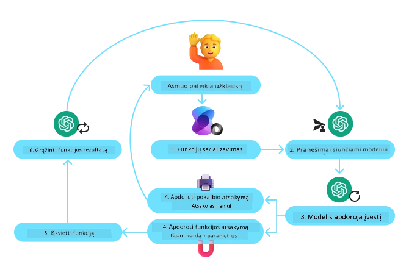
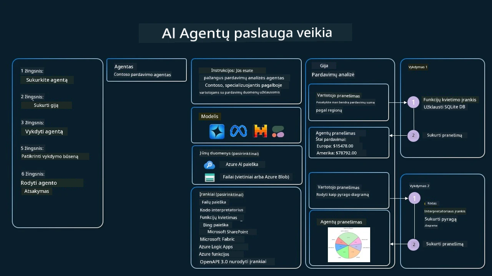

[](https://youtu.be/vieRiPRx-gI?si=cEZ8ApnT6Sus9rhn)

> _(Spustelėkite aukščiau esantį paveikslėlį, kad peržiūrėtumėte šio pamokos vaizdo įrašą)_

# Įrankių naudojimo dizaino šablonas

Įrankiai yra įdomūs, nes jie leidžia DI agentams turėti platesnį galimybių spektrą. Vietoj to, kad agentas turėtų ribotą atliktinų veiksmų rinkinį, pridėjus įrankį, agentas gali atlikti daugybę veiksmų. Šiame skyriuje apžvelgsime Įrankių naudojimo dizaino šabloną, kuris aprašo, kaip DI agentai gali naudoti konkrečius įrankius siekdami savo tikslų.

## Įvadas

Šioje pamokoje siekiame atsakyti į šiuos klausimus:

- Kas yra įrankių naudojimo dizaino šablonas?
- Kokiose situacijose jis gali būti taikomas?
- Kokie elementai / statybiniai blokai reikalingi šablonui įgyvendinti?
- Kokie yra ypatingi aspektai naudojant Įrankių naudojimo dizaino šabloną, kad būtų sukuriami patikimi DI agentai?

## Mokymosi tikslai

Baigę šią pamoką, sugebėsite:

- Apibrėžti Įrankių naudojimo dizaino šabloną ir jo paskirtį.
- Identifikuoti situacijas, kuriose taikomas Įrankių naudojimo dizaino šablonas.
- Suprasti pagrindinius elementus, reikalingus dizaino šablonui įgyvendinti.
- Nustatyti svarbias sąlygas, užtikrinančias patikimumą DI agentams, naudojantiems šį dizaino šabloną.

## Kas yra Įrankių naudojimo dizaino šablonas?

**Įrankių naudojimo dizaino šablonas** orientuotas į suteikimą LLM galimybės sąveikauti su išoriniais įrankiais, siekiant konkrečių tikslų. Įrankiai yra kodas, kurį agentas gali vykdyti norėdamas atlikti veiksmus. Įrankis gali būti paprasta funkcija, tokia kaip skaičiuoklė, arba trečiosios šalies paslaugos API kvietimas, pavyzdžiui, akcijų kainų paieškai ar orų prognozei. DI agentų kontekste įrankiai sukurti taip, kad agentai juos vykdytų atsakydami į **modelio sugeneruotus funkcijų kvietimus**.

## Kokiose situacijose tai galima taikyti?

DI agentai gali naudoti įrankius sudėtingų užduočių atlikimui, informacijos gavimui ar sprendimų priėmimui. Įrankių naudojimo dizaino šablonas dažnai taikomas situacijose, reikalaujančiose dinamiškos sąveikos su išorinėmis sistemomis, tokiomis kaip duomenų bazės, žiniatinklio paslaugos ar kodo interpretuotojai. Šis gebėjimas naudingas įvairiose situacijose, įskaitant:

- **Dinaminis informacijos gavimas:** Agentai gali užklausti išorinių API arba duomenų bazių, kad gautų atnaujintus duomenis (pvz., užklausti SQLite duomenų bazės apie duomenų analizę, gauti akcijų kainas ar oro informaciją).
- **Kodo vykdymas ir interpretacija:** Agentai gali vykdyti kodą arba scenarijus matematikos problemų sprendimui, ataskaitų generavimui ar simuliacijoms.
- **Darbo eigų automatizavimas:** Automatizuojant pasikartojančias ar daugiapakopes darbo eigas, integruojant įrankius, tokius kaip užduočių planavimo programos, el. pašto paslaugos ar duomenų kanalai.
- **Klientų aptarnavimas:** Agentai gali sąveikauti su CRM sistemomis, bilietų platformomis ar žinių bazėmis, siekiant išspręsti naudotojų užklausas.
- **Turinio generavimas ir redagavimas:** Agentai gali naudoti įrankius, tokius kaip gramatikos tikrintuvai, teksto santraukų kūrėjai ar turinio saugos vertintojai, kad padėtų kurti turinį.

## Kokie elementai / statybiniai blokai reikalingi įgyvendinti įrankių naudojimo dizaino šabloną?

Šie statybiniai blokai leidžia DI agentui atlikti daugybę užduočių. Pažvelkime į pagrindinius elementus, reikalingus Įrankių naudojimo dizaino šablonui įgyvendinti:

- **Funkcijų/įrankių schemos**: Išsamūs aprašymai apie turimus įrankius, įskaitant funkcijos pavadinimą, paskirtį, reikalingus parametrus ir numatomus rezultatus. Šios schemos leidžia LLM suprasti, kokie įrankiai yra pasiekiami ir kaip sudaryti galiojančius užklausimus.

- **Funkcijų vykdymo logika**: Nustato, kaip ir kada įrankiai kviečiami, remiantis vartotojo ketinimu ir pokalbio kontekstu. Tai gali apimti planuotojo modulius, maršrutizavimo mechanizmus ar sąlyginius srautus, kurie dinamiškai nustato įrankių naudojimą.

- **Žinučių valdymo sistema**: Komponentai, valdantys pokalbio srautą tarp vartotojo įvedimų, LLM atsakymų, įrankių kvietimų ir jų rezultatų.

- **Įrankių integracijos sistema**: Infrastruktūra, jungianti agentą su įvairiais įrankiais, nesvarbu, ar tai paprastos funkcijos, ar sudėtingos išorinės paslaugos.

- **Klaidų valdymas ir tikrinimas**: Mechanizmai, valdantys nepasisekimus vykdant įrankius, tikrinant parametrus ir tvarkant netikėtas atsakymų situacijas.

- **Būsenos valdymas**: Stebi pokalbio kontekstą, ankstesnius įrankių sąveikos veiksmus ir nuolatinius duomenis, siekiant užtikrinti nuoseklumą per kelis pokalbio turus.

Toliau apžvelgsime funkcijų/įrankių kvietimą detaliau.
 
### Funkcijų / įrankių kvietimas

Funkcijų kvietimas yra pagrindinis būdas, kuriuo Mes leidžiame Didelių kalbinių modelių (LLM) sąveikauti su įrankiais. Dažnai pamatysite, kad terminai 'Funkcija' ir 'Įrankis' naudojami kaip sinonimai, nes 'funkcijos' (pakartotinai naudojamo kodo blokai) yra 'įrankiai', kuriuos agentai naudoja užduotims atlikti. Kad funkcijos kodas būtų iškviestas, LLM turi palyginti vartotojo užklausą su funkcijos aprašymu. Tam siunčiama schema, kurioje yra visų galimų funkcijų aprašymai. LLM tuomet pasirenka tinkamiausią funkciją užduočiai ir grąžina jos pavadinimą ir argumentus. Pasirinkta funkcija vykdoma, jos atsakymas perduodamas LLM, kuris panaudoja informaciją atsakydamas į vartotojo užklausą.

Kūrėjams, norintiems įgyvendinti funkcijų kvietimą agentams, reikės:

1. LLM modelio, palaikančio funkcijų kvietimą
2. Schemos, kurioje aprašytos funkcijos
3. Kodo kiekvienai aprašytai funkcijai

Pavyzdžiui paimkime dabartinio laiko gavimą mieste:

1. **Inicializuokite LLM, palaikantį funkcijų kvietimą:**

    Ne visi modeliai palaiko funkcijų kvietimą, todėl svarbu patikrinti, ar naudojamas LLM tai palaiko. <a href="https://learn.microsoft.com/azure/ai-services/openai/how-to/function-calling" target="_blank">Azure OpenAI</a> palaiko funkcijų kvietimą. Galime pradėti kurdami OpenAI klientą naudodami Azure OpenAI **Responses API** (stabilų `/openai/v1/` endpointą — nereikia `api_version`).

    ```python
    # Inicijuokite OpenAI klientą Azure OpenAI (Atsakymų API, v1 galinis taškas)
    client = OpenAI(
        base_url=f"{os.environ['AZURE_OPENAI_ENDPOINT'].rstrip('/')}/openai/v1/",
        api_key=os.environ["AZURE_OPENAI_API_KEY"],
    )
    deployment_name = os.environ["AZURE_OPENAI_DEPLOYMENT"]
    ```

1. **Sukurkite funkcijos schemą**:

    Toliau aprašysime JSON schemą, kurioje bus funkcijos pavadinimas, aprašymas, ką funkcija daro, bei funkcijos parametrų pavadinimai ir aprašymai.
    Šią schemą perduosime iš anksto sukurtam klientui kartu su vartotojo užklausa rasti laiką San Francisko mieste. Svarbu atkreipti dėmesį, kad grąžinamas rezultatas yra **įrankio kvietimas**, o ne galutinis atsakymas į klausimą. Kaip minėta anksčiau, LLM grąžina pasirinktos funkcijos pavadinimą ir argumentus, kurie bus perduoti funkcijai.

    ```python
    # Funkcijos aprašymas modeliui skaityti (Atsakymų API plokščio įrankio formatas)
    tools = [
        {
            "type": "function",
            "name": "get_current_time",
            "description": "Get the current time in a given location",
            "parameters": {
                "type": "object",
                "properties": {
                    "location": {
                        "type": "string",
                        "description": "The city name, e.g. San Francisco",
                    },
                },
                "required": ["location"],
            },
        }
    ]
    ```
   
    ```python
  
    # Pradinis vartotojo pranešimas
    messages = [{"role": "user", "content": "What's the current time in San Francisco"}]

    # Pirmas API kvietimas: Paprašykite modelio naudoti funkciją
    response = client.responses.create(
        model=deployment_name,
        input=messages,
        tools=tools,
        tool_choice="auto",
        store=False,
    )

    # Atsakymų API grąžina įrankio kvietimus kaip function_call elementus response.output.
    # Pridėkite juos prie pokalbio, kad modelis kitame žingsnyje turėtų visą kontekstą.
    messages += response.output

    print("Model's response:")
    print(response.output)
  
    ```

    ```bash
    Model's response:
    [ResponseFunctionToolCall(arguments='{"location":"San Francisco"}', call_id='call_pOsKdUlqvdyttYB67MOj434b', name='get_current_time', type='function_call')]
    ```
  
1. **Funkcijos kodas, reikalingas užduočiai atlikti:**

    Kai LLM pasirinko, kokia funkcija turi būti vykdoma, reikia įgyvendinti ir vykdyti užduotį atliekančią kodo dalį.
    Įgyvendinsime kodo pavyzdį laikui gauti Python kalba. Taip pat reikės parašyti kodą, kuris ištrauks funkcijos pavadinimą ir argumentus iš atsakymo žinutės, kad gautume galutinį rezultatą.

    ```python
      def get_current_time(location):
        """Get the current time for a given location"""
        print(f"get_current_time called with location: {location}")  
        location_lower = location.lower()
        
        for key, timezone in TIMEZONE_DATA.items():
            if key in location_lower:
                print(f"Timezone found for {key}")  
                current_time = datetime.now(ZoneInfo(timezone)).strftime("%I:%M %p")
                return json.dumps({
                    "location": location,
                    "current_time": current_time
                })
      
        print(f"No timezone data found for {location_lower}")  
        return json.dumps({"location": location, "current_time": "unknown"})
    ```

     ```python
    # Tvarkyti funkcijų kvietimus
    tool_calls = [item for item in response.output if item.type == "function_call"]
    if tool_calls:
        for tool_call in tool_calls:
            if tool_call.name == "get_current_time":

                function_args = json.loads(tool_call.arguments)

                time_response = get_current_time(
                    location=function_args.get("location")
                )

                # Grąžinti įrankio rezultatą kaip function_call_output elementą
                messages.append({
                    "type": "function_call_output",
                    "call_id": tool_call.call_id,
                    "output": time_response,
                })
    else:
        print("No tool calls were made by the model.")

    # Antras API kvietimas: Gauti galutinį modelio atsakymą
    final_response = client.responses.create(
        model=deployment_name,
        input=messages,
        tools=tools,
        store=False,
    )

    return final_response.output_text
     ```

     ```bash
      get_current_time called with location: San Francisco
      Timezone found for san francisco
      The current time in San Francisco is 09:24 AM.
     ```

Funkcijų kvietimas yra pagrindas daugumoje, jei ne visuose agentų įrankių naudojimo dizaino šablonuose, tačiau tai įgyvendinti nuo nulio kartais gali būti sudėtinga.
Kaip sužinojome [2 pamokoje](../../../02-explore-agentic-frameworks), agentų karkasai suteikia paruoštus statybinius blokus įrankių naudojimo įgyvendinimui.
 
## Įrankių naudojimo pavyzdžiai su agentų karkasais

Štai keli pavyzdžiai, kaip galite įgyvendinti Įrankių naudojimo dizaino šabloną, naudodami skirtingus agentų karkasus:

### Microsoft agentų karkasas

<a href="https://learn.microsoft.com/azure/ai-services/agents/overview" target="_blank">Microsoft agentų karkasas</a> yra atviro kodo DI karkasas DI agentams kurti. Jis supaprastina funkcijų kvietimo naudojimą leidžiant apibrėžti įrankius kaip Python funkcijas su `@tool` dekoratoriumi. Karkasas tvarko komunikaciją tarp modelio ir jūsų kodo. Taip pat suteikia prieigą prie paruoštų įrankių, pvz., Failų paieškos ir Kodo interpretuotojo per `FoundryChatClient`.

Toliau pateiktas schema iliustruoja funkcijų kvietimo procesą naudojant Microsoft agentų karkasą:



Microsoft agentų karkase įrankiai apibrėžiami kaip dekoruotos funkcijos. Galime anksčiau matytą `get_current_time` funkciją paversti įrankiu naudodami `@tool` dekoratorių. Karkasas automatiškai serializuos funkciją ir jos parametrus, sukurs schemą, kuri bus nusiųsta LLM.

```python
import os
from agent_framework import tool
from agent_framework.foundry import FoundryChatClient
from azure.identity import AzureCliCredential

@tool(approval_mode="never_require")
def get_current_time(location: str) -> str:
    """Get the current time for a given location"""
    ...

# Sukurkite klientą
provider = FoundryChatClient(
    project_endpoint=os.environ["AZURE_AI_PROJECT_ENDPOINT"],
    model=os.environ["AZURE_AI_MODEL_DEPLOYMENT_NAME"],
    credential=AzureCliCredential(),
)

# Sukurkite agentą ir paleiskite su įrankiu
agent = provider.as_agent(name="TimeAgent", instructions="Use available tools to answer questions.", tools=get_current_time)
response = await agent.run("What time is it?")
```
  
### Microsoft Foundry Agent Service

<a href="https://learn.microsoft.com/azure/ai-services/agents/overview" target="_blank">Microsoft Foundry Agent Service</a> yra naujesnis agentų karkasas, sukurtas padėti kūrėjams saugiai kurti, diegti ir mastyti aukštos kokybės bei išplečiamus DI agentus, nereikalaujant valdyti pagrindinių skaičiavimo ir saugojimo išteklių. Šis sprendimas ypač naudingas įmonių programoms, nes tai pilnai valdomos paslaugos su įmonių lygio saugumu.

Lyginant su tiesioginiu LLM API naudojimu, Microsoft Foundry Agent Service suteikia keletą privalumų, įskaitant:

- Automatinis įrankių kvietimas – nereikia analizuoti įrankio kvietimų, kvieti įrankį ir tvarkyti atsakymus; visa tai vyksta serveryje
- Saugiai valdomi duomenys – vietoj pokalbio būseno valdymo galite pasikliauti tematika, kur saugoma visa reikalinga informacija
- Pakavimo įrankiai – įrankiai, leidžiantys sąveikauti su jūsų duomenų šaltiniais, tokiais kaip Bing, Azure AI Search ir Azure Functions.

Microsoft Foundry Agent Service siūlomus įrankius galime suskirstyti į dvi kategorijas:

1. Žinių įrankiai:
    - <a href="https://learn.microsoft.com/azure/ai-services/agents/how-to/tools/bing-grounding?tabs=python&pivots=overview" target="_blank">Bing paieškos pagrindimas</a>
    - <a href="https://learn.microsoft.com/azure/ai-services/agents/how-to/tools/file-search?tabs=python&pivots=overview" target="_blank">Failų paieška</a>
    - <a href="https://learn.microsoft.com/azure/ai-services/agents/how-to/tools/azure-ai-search?tabs=azurecli%2Cpython&pivots=overview-azure-ai-search" target="_blank">Azure AI Search</a>

2. Veiksmų įrankiai:
    - <a href="https://learn.microsoft.com/azure/ai-services/agents/how-to/tools/function-calling?tabs=python&pivots=overview" target="_blank">Funkcijų kvietimas</a>
    - <a href="https://learn.microsoft.com/azure/ai-services/agents/how-to/tools/code-interpreter?tabs=python&pivots=overview" target="_blank">Kodo interpretuotojas</a>
    - <a href="https://learn.microsoft.com/azure/ai-services/agents/how-to/tools/openapi-spec?tabs=python&pivots=overview" target="_blank">OpenAPI apibrėžti įrankiai</a>
    - <a href="https://learn.microsoft.com/azure/ai-services/agents/how-to/tools/azure-functions?pivots=overview" target="_blank">Azure funkcijos</a>

Agentų paslauga leidžia naudoti šiuos įrankius kartu kaip `įrankių rinkinį`. Ji taip pat naudoja `temas`, kurios seka konkretaus pokalbio žinučių istoriją.

Įsivaizduokite, kad esate pardavimų agentas įmonėje Contoso. Jūs norite sukurti pokalbių agentą, kuris galėtų atsakyti į klausimus apie jūsų pardavimų duomenis.

Toliau pateiktas vaizdas iliustruoja, kaip galėtumėte naudoti Microsoft Foundry Agent Service savo pardavimų duomenų analizei:



Norėdami naudoti bet kurį iš šių įrankių su paslauga, galime sukurti klientą ir apibrėžti įrankį arba įrankių rinkinį. Praktiniam įgyvendinimui galime naudoti šį Python kodą. LLM galės peržiūrėti įrankių rinkinį ir nuspręsti, ar naudoti vartotojo sukurtą funkciją `fetch_sales_data_using_sqlite_query`, ar paruoštą Kodo interpretuotoją, priklausomai nuo vartotojo užklausos.

```python 
import os
from azure.ai.projects import AIProjectClient
from azure.identity import DefaultAzureCredential
from fetch_sales_data_functions import fetch_sales_data_using_sqlite_query # fetch_sales_data_using_sqlite_query funkcija, kurią galima rasti failo fetch_sales_data_functions.py viduje.
from azure.ai.projects.models import ToolSet, FunctionTool, CodeInterpreterTool

project_client = AIProjectClient.from_connection_string(
    credential=DefaultAzureCredential(),
    conn_str=os.environ["PROJECT_CONNECTION_STRING"],
)

# Inicializuoti įrankių rinkinį
toolset = ToolSet()

# Inicializuoti funkcijų kvietimo agentą su fetch_sales_data_using_sqlite_query funkcija ir pridėti ją prie įrankių rinkinio
fetch_data_function = FunctionTool(fetch_sales_data_using_sqlite_query)
toolset.add(fetch_data_function)

# Inicializuoti Kodo interpretatoriaus įrankį ir pridėti jį prie įrankių rinkinio.
code_interpreter = CodeInterpreterTool()toolset.add(code_interpreter)

agent = project_client.agents.create_agent(
    model="gpt-4o-mini", name="my-agent", instructions="You are helpful agent", 
    toolset=toolset
)
```

## Kokie ypač svarbūs aspektai naudojant Įrankių naudojimo dizaino šabloną patikimiems DI agentams kurti?

Dažnas susirūpinimas, susijęs su LLM dinamiškai generuojamu SQL, yra saugumas, ypač rizika dėl SQL injekcijos ar kenkėjiškų veiksmų, tokių kaip duomenų bazės ištrynimas ar klastojimas. Nors šie susirūpinimai yra pagrįsti, juos veiksmingai mažina tinkamas duomenų bazės prieigos leidimų sukonfigūravimas. Daugumai duomenų bazių tai reiškia sukonfigūruoti duomenų bazę kaip tik skaitymui (read-only). Tokiose duomenų bazių paslaugose kaip PostgreSQL ar Azure SQL, programai turėtų būti priskirta tik skaitymo (SELECT) teisė.

Programų vykdymas saugioje aplinkoje dar labiau sustiprina apsaugą. Įmonių scenarijuose duomenys paprastai yra išgaunami ir transformuojami iš operacinių sistemų į tik skaitymui skirtą duomenų bazę ar sandėlį su vartotojui patogia schema. Šis požiūris užtikrina duomenų saugumą, veikimo našumą ir prieinamumą, taip pat apribotą, tik skaitymui skirtą prieigą programai.

## Pavyzdiniai kodai

- Python: [Agentų karkasas](./code_samples/04-python-agent-framework.ipynb)
- .NET: [Agentų karkasas](./code_samples/04-dotnet-agent-framework.md)

## Dar turite klausimų apie Įrankių naudojimo dizaino šablonus?

Prisijunkite prie [Microsoft Foundry Discord](https://discord.com/invite/ATgtXmAS5D), kad susitiktumėte su kitais besimokančiais, dalyvautumėte konsultacijose ir gautumėte atsakymus į savo DI agentų klausimus.

## Papildomi ištekliai

- <a href="https://microsoft.github.io/build-your-first-agent-with-azure-ai-agent-service-workshop/" target="_blank">Azure AI Agentų paslaugos dirbtuvės</a>
- <a href="https://github.com/Azure-Samples/contoso-creative-writer/tree/main/docs/workshop" target="_blank">Contoso kūrybinio rašytojo daugiagentinės dirbtuvės</a>
- <a href="https://learn.microsoft.com/azure/ai-services/agents/overview" target="_blank">Microsoft agentų karkaso apžvalga</a>


## Ankstesnė pamoka

[Agentinio dizaino šablonų supratimas](../03-agentic-design-patterns/README.md)

## Kita pamoka

[Agentinis RAG](../05-agentic-rag/README.md)

---

<!-- CO-OP TRANSLATOR DISCLAIMER START -->
**Atsakomybės apribojimas**:
Šis dokumentas buvo išverstas naudojant dirbtinio intelekto vertimo paslaugą [Co-op Translator](https://github.com/Azure/co-op-translator). Nors siekiame tikslumo, prašome atkreipti dėmesį, kad automatiniai vertimai gali turėti klaidų ar netikslumų. Originalus dokumentas jo gimtąja kalba laikomas autoritetingu šaltiniu. Svarbiai informacijai rekomenduojama naudoti profesionalų žmogiškąjį vertimą. Mes neatsakome už jokius nesusipratimus ar neteisingą interpretaciją, kilusią naudojantis šiuo vertimu.
<!-- CO-OP TRANSLATOR DISCLAIMER END -->