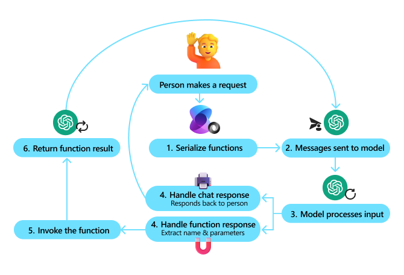
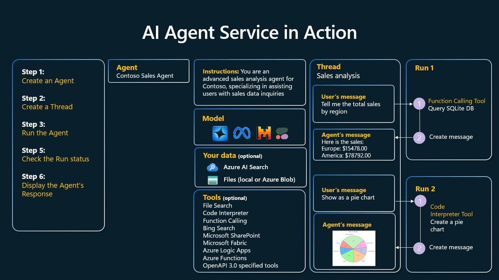

<!--
CO_OP_TRANSLATOR_METADATA:
{
  "original_hash": "4a5ccc4ad1dba85fbc2087cf3b986544",
  "translation_date": "2025-08-30T10:48:15+00:00",
  "source_file": "04-tool-use/README.md",
  "language_code": "lt"
}
-->
[](https://youtu.be/vieRiPRx-gI?si=cEZ8ApnT6Sus9rhn)

> _(Spustelėkite paveikslėlį aukščiau, kad peržiūrėtumėte šios pamokos vaizdo įrašą)_

# Įrankių naudojimo dizaino šablonas

Įrankiai yra įdomūs, nes jie leidžia AI agentams turėti platesnį gebėjimų spektrą. Vietoj to, kad agentas galėtų atlikti ribotą veiksmų rinkinį, pridėjus įrankį, agentas gali atlikti daugybę veiksmų. Šiame skyriuje aptarsime Įrankių naudojimo dizaino šabloną, kuris aprašo, kaip AI agentai gali naudoti specifinius įrankius savo tikslams pasiekti.

## Įvadas

Šioje pamokoje siekiame atsakyti į šiuos klausimus:

- Kas yra įrankių naudojimo dizaino šablonas?
- Kokiais atvejais jis gali būti taikomas?
- Kokie elementai/sudėtinės dalys reikalingos šablonui įgyvendinti?
- Kokie yra ypatingi aspektai, į kuriuos reikia atsižvelgti naudojant Įrankių naudojimo dizaino šabloną, kad būtų sukurti patikimi AI agentai?

## Mokymosi tikslai

Baigę šią pamoką, galėsite:

- Apibrėžti Įrankių naudojimo dizaino šabloną ir jo paskirtį.
- Nustatyti atvejus, kur šis dizaino šablonas yra tinkamas.
- Suprasti pagrindinius elementus, reikalingus šablonui įgyvendinti.
- Atpažinti aspektus, užtikrinančius AI agentų patikimumą naudojant šį dizaino šabloną.

## Kas yra Įrankių naudojimo dizaino šablonas?

**Įrankių naudojimo dizaino šablonas** yra orientuotas į tai, kad LLM galėtų sąveikauti su išoriniais įrankiais, siekdami konkrečių tikslų. Įrankiai yra kodas, kurį agentas gali vykdyti, kad atliktų veiksmus. Įrankis gali būti paprasta funkcija, pvz., skaičiuotuvas, arba API užklausa trečiosios šalies paslaugai, pvz., akcijų kainų paieškai ar orų prognozei. AI agentų kontekste įrankiai yra sukurti taip, kad juos vykdytų agentai, reaguodami į **modelio sugeneruotus funkcijų iškvietimus**.

## Kokiais atvejais jis gali būti taikomas?

AI agentai gali naudoti įrankius sudėtingoms užduotims atlikti, informacijai gauti ar sprendimams priimti. Įrankių naudojimo dizaino šablonas dažnai taikomas scenarijams, kuriems reikalinga dinaminė sąveika su išorinėmis sistemomis, pvz., duomenų bazėmis, interneto paslaugomis ar kodo interpretatoriais. Šis gebėjimas yra naudingas įvairiems atvejams, įskaitant:

- **Dinaminis informacijos gavimas:** Agentai gali užklausti išorinių API ar duomenų bazių, kad gautų naujausius duomenis (pvz., užklausti SQLite duomenų bazės analizei, gauti akcijų kainas ar orų informaciją).
- **Kodo vykdymas ir interpretavimas:** Agentai gali vykdyti kodą ar scenarijus, kad išspręstų matematines problemas, generuotų ataskaitas ar atliktų simuliacijas.
- **Darbo eigos automatizavimas:** Automatizuoti pasikartojančias ar daugiapakopes darbo eigas, integruojant įrankius, pvz., užduočių planuotojus, el. pašto paslaugas ar duomenų srautus.
- **Klientų aptarnavimas:** Agentai gali sąveikauti su CRM sistemomis, bilietų platformomis ar žinių bazėmis, kad išspręstų vartotojų užklausas.
- **Turinio kūrimas ir redagavimas:** Agentai gali naudoti įrankius, pvz., gramatikos tikrintuvus, teksto santraukų generatorius ar turinio saugumo vertintojus, kad padėtų atlikti turinio kūrimo užduotis.

## Kokie elementai/sudėtinės dalys reikalingos įrankių naudojimo dizaino šablonui įgyvendinti?

Šie elementai leidžia AI agentui atlikti daugybę užduočių. Pažvelkime į pagrindinius elementus, reikalingus Įrankių naudojimo dizaino šablonui įgyvendinti:

- **Funkcijų/Įrankių schemos**: Išsamūs apibrėžimai apie turimus įrankius, įskaitant funkcijos pavadinimą, paskirtį, reikalingus parametrus ir tikėtinus rezultatus. Šios schemos leidžia LLM suprasti, kokie įrankiai yra prieinami ir kaip sukurti tinkamas užklausas.

- **Funkcijų vykdymo logika**: Valdo, kaip ir kada įrankiai yra iškviečiami, atsižvelgiant į vartotojo ketinimus ir pokalbio kontekstą. Tai gali apimti planavimo modulius, maršrutizavimo mechanizmus ar sąlyginius srautus, kurie dinamiškai nustato įrankių naudojimą.

- **Žinučių valdymo sistema**: Komponentai, kurie valdo pokalbio srautą tarp vartotojo įvesties, LLM atsakymų, įrankių iškvietimų ir įrankių rezultatų.

- **Įrankių integravimo sistema**: Infrastruktūra, jungianti agentą su įvairiais įrankiais, nesvarbu, ar tai paprastos funkcijos, ar sudėtingos išorinės paslaugos.

- **Klaidų valdymas ir validacija**: Mechanizmai, skirti spręsti įrankių vykdymo nesėkmes, tikrinti parametrus ir valdyti netikėtus atsakymus.

- **Būsenos valdymas**: Sekamas pokalbio kontekstas, ankstesnės sąveikos su įrankiais ir nuolatiniai duomenys, kad būtų užtikrintas nuoseklumas per daugiapakopius pokalbius.

Toliau išsamiau aptarsime funkcijų/įrankių iškvietimą.

### Funkcijų/Įrankių iškvietimas

Funkcijų iškvietimas yra pagrindinis būdas, kaip leidžiame Dideliems Kalbos Modeliams (LLM) sąveikauti su įrankiais. Dažnai matysite, kad „Funkcija“ ir „Įrankis“ naudojami kaip sinonimai, nes „funkcijos“ (pakartotinai naudojamo kodo blokai) yra „įrankiai“, kuriuos agentai naudoja užduotims atlikti. Kad funkcijos kodas būtų iškviestas, LLM turi palyginti vartotojo užklausą su funkcijos aprašymu. Tam schema, kurioje aprašytos visos turimos funkcijos, siunčiama LLM. Tada LLM pasirenka tinkamiausią funkciją užduočiai ir grąžina jos pavadinimą bei argumentus. Pasirinkta funkcija yra iškviečiama, jos atsakymas siunčiamas atgal į LLM, kuris naudoja informaciją atsakydamas į vartotojo užklausą.

Norint, kad kūrėjai galėtų įgyvendinti funkcijų iškvietimą agentams, jums reikės:

1. LLM modelio, kuris palaiko funkcijų iškvietimą
2. Schemos, kurioje aprašytos funkcijos
3. Kodo kiekvienai aprašytai funkcijai

Pavyzdžiui, norint gauti dabartinį laiką mieste:

1. **Inicializuokite LLM, kuris palaiko funkcijų iškvietimą:**

    Ne visi modeliai palaiko funkcijų iškvietimą, todėl svarbu patikrinti, ar naudojamas LLM tai daro. <a href="https://learn.microsoft.com/azure/ai-services/openai/how-to/function-calling" target="_blank">Azure OpenAI</a> palaiko funkcijų iškvietimą. Galime pradėti inicijuodami Azure OpenAI klientą.

    ```python
    # Initialize the Azure OpenAI client
    client = AzureOpenAI(
        azure_endpoint = os.getenv("AZURE_OPENAI_ENDPOINT"), 
        api_key=os.getenv("AZURE_OPENAI_API_KEY"),  
        api_version="2024-05-01-preview"
    )
    ```

1. **Sukurkite funkcijos schemą:**

    Toliau apibrėšime JSON schemą, kurioje yra funkcijos pavadinimas, funkcijos aprašymas ir funkcijos parametrų pavadinimai bei aprašymai. Tada šią schemą perduosime anksčiau sukurtam klientui kartu su vartotojo užklausa, norint rasti laiką San Franciske. Svarbu pažymėti, kad grąžinamas **įrankio iškvietimas**, o ne galutinis atsakymas į klausimą. Kaip minėta anksčiau, LLM grąžina funkcijos, kurią jis pasirinko užduočiai, pavadinimą ir argumentus, kurie bus perduoti jai.

    ```python
    # Function description for the model to read
    tools = [
        {
            "type": "function",
            "function": {
                "name": "get_current_time",
                "description": "Get the current time in a given location",
                "parameters": {
                    "type": "object",
                    "properties": {
                        "location": {
                            "type": "string",
                            "description": "The city name, e.g. San Francisco",
                        },
                    },
                    "required": ["location"],
                },
            }
        }
    ]
    ```
   
    ```python
  
    # Initial user message
    messages = [{"role": "user", "content": "What's the current time in San Francisco"}] 
  
    # First API call: Ask the model to use the function
      response = client.chat.completions.create(
          model=deployment_name,
          messages=messages,
          tools=tools,
          tool_choice="auto",
      )
  
      # Process the model's response
      response_message = response.choices[0].message
      messages.append(response_message)
  
      print("Model's response:")  

      print(response_message)
  
    ```

    ```bash
    Model's response:
    ChatCompletionMessage(content=None, role='assistant', function_call=None, tool_calls=[ChatCompletionMessageToolCall(id='call_pOsKdUlqvdyttYB67MOj434b', function=Function(arguments='{"location":"San Francisco"}', name='get_current_time'), type='function')])
    ```
  
1. **Funkcijos kodas, reikalingas užduočiai atlikti:**

    Dabar, kai LLM pasirinko, kuri funkcija turi būti vykdoma, reikia įgyvendinti ir vykdyti kodą, kuris atliks užduotį. Galime įgyvendinti kodą, kad gautume dabartinį laiką Python kalba. Taip pat turėsime parašyti kodą, kuris ištrauks pavadinimą ir argumentus iš response_message, kad gautume galutinį rezultatą.

    ```python
      def get_current_time(location):
        """Get the current time for a given location"""
        print(f"get_current_time called with location: {location}")  
        location_lower = location.lower()
        
        for key, timezone in TIMEZONE_DATA.items():
            if key in location_lower:
                print(f"Timezone found for {key}")  
                current_time = datetime.now(ZoneInfo(timezone)).strftime("%I:%M %p")
                return json.dumps({
                    "location": location,
                    "current_time": current_time
                })
      
        print(f"No timezone data found for {location_lower}")  
        return json.dumps({"location": location, "current_time": "unknown"})
    ```

     ```python
     # Handle function calls
      if response_message.tool_calls:
          for tool_call in response_message.tool_calls:
              if tool_call.function.name == "get_current_time":
     
                  function_args = json.loads(tool_call.function.arguments)
     
                  time_response = get_current_time(
                      location=function_args.get("location")
                  )
     
                  messages.append({
                      "tool_call_id": tool_call.id,
                      "role": "tool",
                      "name": "get_current_time",
                      "content": time_response,
                  })
      else:
          print("No tool calls were made by the model.")  
  
      # Second API call: Get the final response from the model
      final_response = client.chat.completions.create(
          model=deployment_name,
          messages=messages,
      )
  
      return final_response.choices[0].message.content
     ```

     ```bash
      get_current_time called with location: San Francisco
      Timezone found for san francisco
      The current time in San Francisco is 09:24 AM.
     ```

Funkcijų iškvietimas yra daugelio, jei ne visų, agentų įrankių naudojimo dizaino pagrindas, tačiau jo įgyvendinimas nuo nulio kartais gali būti sudėtingas. Kaip sužinojome [2 pamokoje](../../../02-explore-agentic-frameworks), agentiniai karkasai suteikia mums iš anksto sukurtus elementus įrankių naudojimui įgyvendinti.

## Įrankių naudojimo pavyzdžiai su agentiniais karkasais

Štai keletas pavyzdžių, kaip galite įgyvendinti Įrankių naudojimo dizaino šabloną naudodami skirtingus agentinius karkasus:

### Semantic Kernel

<a href="https://learn.microsoft.com/azure/ai-services/agents/overview" target="_blank">Semantic Kernel</a> yra atvirojo kodo AI karkasas .NET, Python ir Java kūrėjams, dirbantiems su Dideliais Kalbos Modeliais (LLM). Jis supaprastina funkcijų iškvietimo procesą automatiškai aprašydamas jūsų funkcijas ir jų parametrus modeliui per procesą, vadinamą <a href="https://learn.microsoft.com/semantic-kernel/concepts/ai-services/chat-completion/function-calling/?pivots=programming-language-python#1-serializing-the-functions" target="_blank">serializavimu</a>. Jis taip pat valdo komunikaciją tarp modelio ir jūsų kodo. Kitas privalumas naudojant agentinį karkasą, pvz., Semantic Kernel, yra tas, kad jis leidžia jums pasiekti iš anksto sukurtus įrankius, pvz., <a href="https://github.com/microsoft/semantic-kernel/blob/main/python/samples/getting_started_with_agents/openai_assistant/step4_assistant_tool_file_search.py" target="_blank">Failų paiešką</a> ir <a href="https://github.com/microsoft/semantic-kernel/blob/main/python/samples/getting_started_with_agents/openai_assistant/step3_assistant_tool_code_interpreter.py" target="_blank">Kodo interpretatorių</a>.

Šiame diagramoje pavaizduotas funkcijų iškvietimo procesas naudojant Semantic Kernel:



Semantic Kernel funkcijos/įrankiai vadinami <a href="https://learn.microsoft.com/semantic-kernel/concepts/plugins/?pivots=programming-language-python" target="_blank">Priedais</a>. Galime konvertuoti `get_current_time` funkciją, kurią matėme anksčiau, į priedą, paversdami ją klase su funkcija joje. Taip pat galime importuoti `kernel_function` dekoratorių, kuris priima funkcijos aprašymą. Kai sukuriate branduolį su GetCurrentTimePlugin, branduolys automatiškai serializuoja funkciją ir jos parametrus, kurdamas schemą, kuri bus siunčiama LLM.

```python
from semantic_kernel.functions import kernel_function

class GetCurrentTimePlugin:
    async def __init__(self, location):
        self.location = location

    @kernel_function(
        description="Get the current time for a given location"
    )
    def get_current_time(location: str = ""):
        ...

```

```python 
from semantic_kernel import Kernel

# Create the kernel
kernel = Kernel()

# Create the plugin
get_current_time_plugin = GetCurrentTimePlugin(location)

# Add the plugin to the kernel
kernel.add_plugin(get_current_time_plugin)
```
  
### Azure AI Agent Service

<a href="https://learn.microsoft.com/azure/ai-services/agents/overview" target="_blank">Azure AI Agent Service</a> yra naujesnis agentinis karkasas, skirtas padėti kūrėjams saugiai kurti, diegti ir plėsti aukštos kokybės bei išplečiamus AI agentus, nereikalaujant valdyti pagrindinių skaičiavimo ir saugojimo išteklių. Jis ypač naudingas įmonių programoms, nes tai yra visiškai valdomas paslaugų sprendimas su įmonės lygio saugumu.

Palyginti su kūrimu tiesiogiai naudojant LLM API, Azure AI Agent Service suteikia keletą privalumų, įskaitant:

- Automatinis įrankių iškvietimas – nereikia analizuoti įrankio iškvietimo, vykdyti įrankio ir tvarkyti atsakymo; visa tai dabar atliekama serverio pusėje
- Saugiai valdomi duomenys – vietoj to, kad valdytumėte savo pokalbio būseną, galite pasikliauti gijom, kurios saugo visą jums reikalingą informaciją
- Iš anksto paruošti įrankiai – Įrankiai, kuriuos galite naudoti sąveikai su savo duomenų šaltiniais, pvz., Bing, Azure AI Search ir Azure Functions.

Azure AI Agent Service įrankiai gali būti suskirstyti į dvi kategorijas:

1. Žinių įrankiai:
    - <a href="https://learn.microsoft.com/azure/ai-services/agents/how-to/tools/bing-grounding?tabs=python&pivots=overview" target="_blank">Bing paieška</a>
    - <a href="https://learn.microsoft.com/azure/ai-services/agents/how-to/tools/file-search?tabs=python&pivots=overview" target="_blank">Failų paieška</a>
    - <a href="https://learn.microsoft.com/azure/ai-services/agents/how-to/tools/azure-ai-search?tabs=azurecli%2Cpython&pivots=overview-azure-ai-search" target="_blank">Azure AI Search</a>

2. Veiksmų įrankiai:
    - <a href="https://learn.microsoft.com/azure/ai-services/agents/how-to/tools/function-calling?tabs=python&pivots=overview" target="_blank">Funkcijų iškvietimas</a>
    - <a href="https://learn.microsoft.com/azure/ai-services/agents/how-to/tools/code-interpreter?tabs=python&pivots=overview" target="_blank">Kodo interpretatorius</a>
    - <a href="https://learn.microsoft.com/azure/ai-services/agents/how-to/tools/openapi-spec?tabs=python&pivots=overview" target="_blank">OpenAI apibrėžti įrankiai</a>
    - <a href="https://learn.microsoft.com/azure/ai-services/agents/how-to/tools/azure-functions?pivots=overview" target="_blank">Azure Functions</a>

Agent Service leidžia naudoti šiuos įrankius kartu kaip `toolset`. Jis taip pat naudoja `threads`, kurios seka konkretaus pokalbio žinučių istoriją.

Įsivaizduokite, kad esate pardavimų agentas įmonėje Contoso. Norite sukurti pokalbių agentą, kuris galėtų atsakyti į klausimus apie jūsų pardavimų duomenis.

Šiame paveikslėlyje pavaizduota, kaip galite naudoti Azure AI Agent Service analizuoti savo pardavimų duomenis:



Norėdami naudoti bet kurį iš šių įrankių su paslauga, galime sukurti klientą ir apibrėžti įrankį arba įrankių rinkinį. Praktiniam įgyvendinimui galime naudoti šį Python kodą. LLM galės peržiūrėti įrankių rinkinį ir nuspręsti, ar naudoti vartotojo sukurtą funkciją, `fetch_sales_data_using_sqlite_query`, ar iš anksto sukurtą Kodo interpretatorių, priklausomai nuo vartotojo užklausos.

```python 
import os
from azure.ai.projects import AIProjectClient
from azure.identity import DefaultAzureCredential
from fetch_sales_data_functions import fetch_sales_data_using_sqlite_query # fetch_sales_data_using_sqlite_query function which can be found in a fetch_sales_data_functions.py file.
from azure.ai.projects.models import ToolSet, FunctionTool, CodeInterpreterTool

project_client = AIProjectClient.from_connection_string(
    credential=DefaultAzureCredential(),
    conn_str=os.environ["PROJECT_CONNECTION_STRING"],
)

# Initialize function calling agent with the fetch_sales_data_using_sqlite_query function and adding it to the toolset
fetch_data_function = FunctionTool(fetch_sales_data_using_sqlite_query)
toolset = ToolSet()
toolset.add(fetch_data_function)

# Initialize Code Interpreter tool and adding it to the toolset. 
code_interpreter = code_interpreter = CodeInterpreterTool()
toolset = ToolSet()
toolset.add(code_interpreter)

agent = project_client.agents.create_agent(
    model="gpt-4o-mini", name="my-agent", instructions="You are helpful agent", 
    toolset=toolset
)
```

## Kokie yra ypatingi aspektai, į kuriuos reikia atsižvelgti naudojant Įrankių naudojimo dizaino šabloną, kad būtų sukurti patikimi AI agentai?

Dažnas susirūpinimas dėl SQL, dinamiškai generuojamo LLM,
Prisijunkite prie [Azure AI Foundry Discord](https://aka.ms/ai-agents/discord), kad susipažintumėte su kitais besimokančiais, dalyvautumėte konsultacijų valandose ir gautumėte atsakymus į savo klausimus apie AI agentus.

## Papildomi ištekliai

## Ankstesnė pamoka

[Agentinio dizaino modelių supratimas](../03-agentic-design-patterns/README.md)

## Kita pamoka

[Agentinis RAG](../05-agentic-rag/README.md)

---

**Atsakomybės apribojimas**:  
Šis dokumentas buvo išverstas naudojant AI vertimo paslaugą [Co-op Translator](https://github.com/Azure/co-op-translator). Nors siekiame tikslumo, prašome atkreipti dėmesį, kad automatiniai vertimai gali turėti klaidų ar netikslumų. Originalus dokumentas jo gimtąja kalba turėtų būti laikomas autoritetingu šaltiniu. Kritinei informacijai rekomenduojama profesionali žmogaus vertimo paslauga. Mes neprisiimame atsakomybės už nesusipratimus ar klaidingus interpretavimus, atsiradusius naudojant šį vertimą.