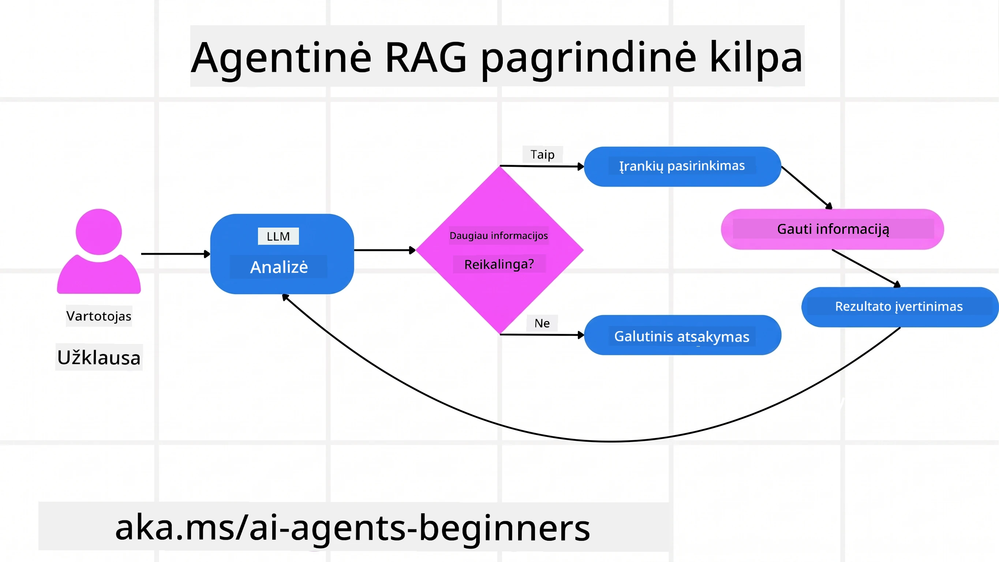
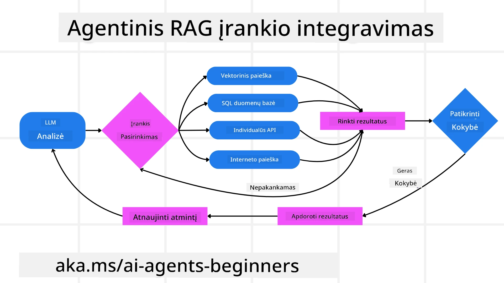
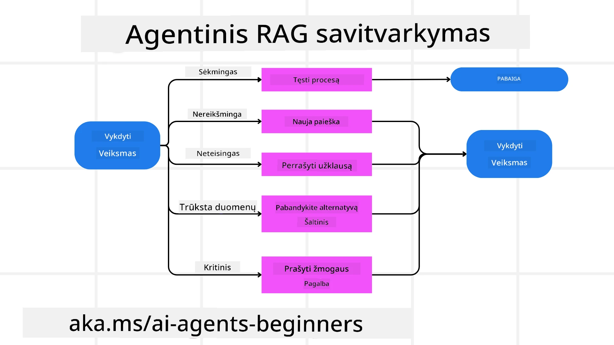
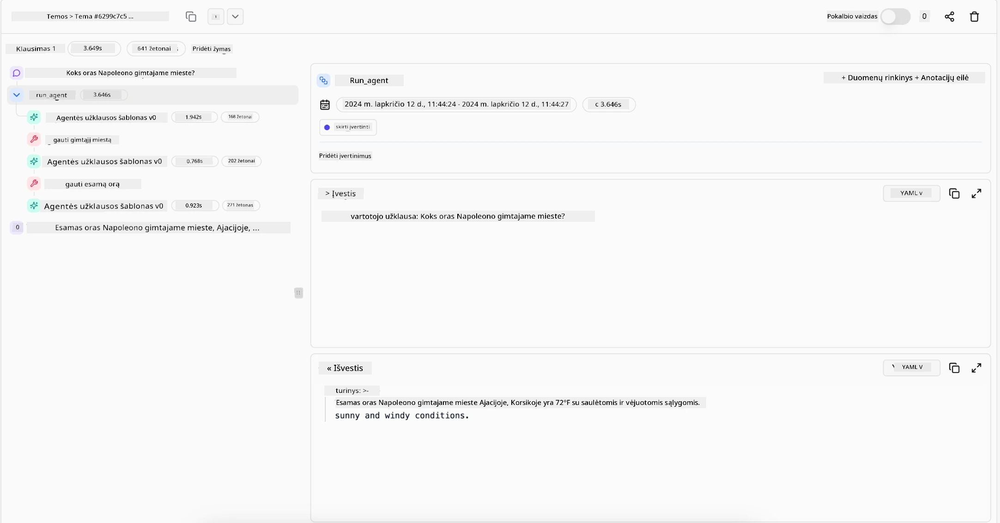

> _(Spustelėkite paveikslėlį aukščiau, kad peržiūrėtumėte šios pamokos vaizdo įrašą)_

# Agentic RAG

Ši pamoka pateikia išsamų Agentic Retrieval-Augmented Generation (Agentic RAG) apžvalgą – naują AI paradigmą, kurioje dideli kalbos modeliai (LLM) savarankiškai planuoja savo tolesnius veiksmus, tuo pačiu gaudami informaciją iš išorinių šaltinių. Skirtingai nuo statinių paieškos-tada-skaitymo modelių, Agentic RAG apima iteracinius kvietimus LLM, pertraukiamus įrankių ar funkcijų kvietimais ir struktūruotais rezultatais. Sistema vertina rezultatus, tobulina užklausas, jei reikia, kviečia papildomus įrankius ir tęsia šį ciklą, kol pasiekia patenkinamą sprendimą.

## Įvadas

Šioje pamokoje bus aptarta:

- **Agentic RAG supratimas:** Sužinokite apie naują AI paradigmos modelį, kuriame dideli kalbos modeliai (LLM) savarankiškai planuoja savo tolesnius veiksmus, naudodamiesi informacija iš išorinių duomenų šaltinių.
- **Iteracinio Maker-Checker stiliaus suvokimas:** Suprasite iteracinių kvietimų LLM ciklą, pertraukiamą įrankių ar funkcijų kvietimais bei struktūruotais rezultatais, skirtą tikslumui pagerinti ir neteisingai suformuluotoms užklausoms apdoroti.
- **Praktinių panaudojimo sričių tyrimas:** Nustatykite situacijas, kur Agentic RAG ypač naudingas, pavyzdžiui, tikslumo prioritetą turinčiose aplinkose, sudėtinguose duomenų bazės užklausose ir išplėstiniuose darbo procesuose.

## Mokymosi tikslai

Baigę šią pamoką, žinosite kaip / suprasite:

- **Agentic RAG supratimas:** Sužinokite apie naują AI paradigmos modelį, kuriame dideli kalbos modeliai (LLM) savarankiškai planuoja savo tolesnius veiksmus, naudodamiesi informacija iš išorinių duomenų šaltinių.
- **Iteracinio Maker-Checker stiliaus suvokimas:** Perpraskite iteracinių kvietimų LLM ciklą, pertraukiamą įrankių ar funkcijų kvietimais ir struktūruotais rezultatais, skirtą tikslumui pagerinti bei neteisingoms užklausoms spręsti.
- **Savarankiškas samprotavimo proceso valdymas:** Supraskite sistemos gebėjimą savarankiškai valdyti samprotavimo procesą, priimant sprendimus, kaip spręsti problemas be iš anksto apibrėžtų kelių.
- **Darbo procesas:** Sužinokite, kaip agentinis modelis savarankiškai nusprendžia gauti rinkos tendencijų ataskaitas, identifikuoti konkurentų duomenis, susieti vidinius pardavimų rodiklius, sintetinti rezultatus ir įvertinti strategiją.
- **Iteraciniai ciklai, įrankių integracija ir atmintis:** Sužinokite apie sistemos pagrindą – ciklinį sąveikos modelį, palaikantį būseną ir atmintį žingsnių metu, kad būtų išvengta pasikartojančių ciklų ir padarytas pagrįstas sprendimas.
- **Nepasisekimų valdymas ir savikorekcija:** Tyrinėkite sistemos stiprias savikorekcijos priemones, įskaitant iteravimą ir pakartotines užklausas, diagnostinius įrankius bei žmonių priežiūrą kaip pagalbą.
- **Agentūros ribos:** Supraskite Agentic RAG ribotumus, ypač sritinė autonomija, infrastruktūros priklausomybė ir saugos atitiktis.
- **Praktiniai naudojimo atvejai ir vertė:** Nustatykite situacijas, kur Agentic RAG yra ypač efektyvus, pavyzdžiui, tikslumo užtikrinimo aplinkos, sudėtingos duomenų bazės užklausos ir ilgesni darbo procesai.
- **Valdymas, skaidrumas ir pasitikėjimas:** Sužinokite apie valdymo ir skaidrumo svarbą, įskaitant aiškų samprotavimą, šališkumo kontrolę ir žmogaus priežiūrą.

## Kas yra Agentic RAG?

Agentic Retrieval-Augmented Generation (Agentic RAG) yra naujas AI modelis, kai dideli kalbos modeliai (LLM) savarankiškai planuoja savo tolesnius veiksmus, gautus iš išorinių šaltinių. Skirtingai nei statiniai paieškos-tada-skaitymo modeliai, Agentic RAG naudoja iteracinius kvietimus LLM, pertraukiamus įrankių ar funkcijų kvietimais ir struktūruotais rezultatais. Sistema vertina gautus rezultatus, tobulina užklausas, jei reikia, kviečia papildomus įrankius ir tęsia ciklą, kol pasiekia patenkinamą sprendimą. Šis iteracinis „maker-checker“ stilius gerina tikslumą, tvarko neteisingas užklausas ir užtikrina aukštos kokybės rezultatus.

Sistema aktyviai valdo savo samprotavimo procesą, perrašo nepavykusias užklausas, pasirenka skirtingus paieškos metodus ir integruoja kelis įrankius – tokius kaip vektorinė paieška Azure AI Search, SQL duomenų bazės ar specializuotos API – prieš pateikdama galutinį atsakymą. Agentinės sistemos savybė yra sugebėjimas valdyti savo samprotavimus. Tradiciniai RAG sprendimai remiasi iš anksto nustatytais keliais, o agentinės sistemos savarankiškai nustato žingsnių seką, atsižvelgdamos į surastų duomenų kokybę.

## Agentic Retrieval-Augmented Generation (Agentic RAG) apibrėžimas

Agentic Retrieval-Augmented Generation (Agentic RAG) yra naujas AI modelis, kai LLM ne tik traukia informaciją iš išorinių duomenų šaltinių, bet ir savarankiškai planuoja savo veiksmus. Skirtingai nuo statinių paieškos-tada-skaitymo modelių ar kruopščiai suprojektuotų užklausų sekų, Agentic RAG naudoja iteracinių LLM kvietimų ciklą, pertraukiamą įrankių ar funkcijų kvietimais ir struktūruotais rezultatais. Kiekviename žingsnyje sistema vertina rezultatus, sprendžia, ar tobulinti užklausas, prireikus naudoja papildomus įrankius ir tęsia šį ciklą, kol pasiekia patenkinamą sprendimą.

Šis iteracinis „maker-checker“ darbo stilius skirtas tikslumui gerinti, neteisingai suformuluotų užklausų į struktūrizuotas duomenų bazes (pvz., NL2SQL) apdorojimui ir aukštos kokybės, subalansuotiems rezultatams užtikrinti. Vietoje vien kruopščiai parengtų užklausų grandinių, sistema aktyviai valdo savo samprotavimo procesą. Ji sugeba perrašyti nesėkmingas užklausas, rinktis skirtingus paieškos metodus ir integruoti kelis įrankius – tokius kaip vektorinė paieška Azure AI Search, SQL duomenų bazės ar specialios API – prieš pateikdama galutinį atsakymą. Tai pašalina poreikį labai sudėtingoms koordinavimo sistemoms. Vietoje to, paprastas ciklas „LLM kvietimas → įrankio naudojimas → LLM kvietimas → ...“ gali duoti sudėtingus ir gerai pagrįstus rezultatus.

## Samprotavimo proceso valdymas

Skiriamasis agentinės sistemos požymis yra jos gebėjimas valdyti savo samprotavimo procesą. Tradiciniai RAG sprendimai dažnai priklauso nuo to, kad žmogus iš anksto nustato modelio darbų eiliškumą: grandinę, kuri nurodo, ką ir kada reikia gauti.
Tačiau tikrai agentinė sistema viduje nusprendžia, kaip spręsti problemą. Ji nevykdo tiesiog scenarijaus; ji savarankiškai nustato žingsnių seką pagal informaciją, kurią suranda.
Pavyzdžiui, jei prašoma sukurti produkto paleidimo strategiją, ji neapsiriboja tik vienu užklausa, kurioje aprašomas visas tyrimo ir sprendimų priėmimo procesas. Vietoje to, agentinė sistema savarankiškai nusprendžia:

1. Gauti dabartines rinkos tendencijų ataskaitas naudodama Bing Web Grounding
2. Identifikuoti svarbius konkurentų duomenis per Azure AI Search.
3. Susieti istorinius vidinius pardavimų rodiklius naudodama Azure SQL Database.
4. Apjungti rezultatus į suderintą strategiją, valdoma per Azure OpenAI Service.
5. Įvertinti strategiją dėl spragų ar neatitikimų ir, jei reikia, inicijuoti papildomą paieškos etapą.
Visi šie žingsniai – užklausų tobulinimas, šaltinių pasirinkimas, iteravimas, kol atsakymas „patenkina“ – yra sprendžiami modelio, o ne iš anksto žmogaus parašyto scenarijaus.

## Iteraciniai ciklai, įrankių integracija ir atmintis

Agentinė sistema remiasi ciklinio sąveikos šablonu:

- **Pradinis kvietimas:** Vartotojo tikslas (t.y. vartotojo užklausa) pateikiama LLM.
- **Įrankio kvietimas:** Jei modelis nustato, kad trūksta informacijos arba instrukcijos yra neaiškios, jis pasirenka įrankį arba paieškos metodą – pvz., vektorinę duomenų bazės užklausą (Azure AI Search Hybrid paieška per privačius duomenis) arba struktūrizuotą SQL užklausą, kad surinktų daugiau konteksto.
- **Vertinimas ir tobulinimas:** Peržiūrėjęs gautus duomenis, modelis sprendžia, ar informacijos pakanka. Jei ne, tobulina užklausą, bando kitą įrankį ar koreguoja metodą.
- **Kartojimas iki patenkinimo:** Šis ciklas tęsiamas tol, kol modelis nustato, kad turi pakankamai aiškumo ir įrodymų pateikti galutinį, gerai pagrįstą atsakymą.
- **Atmintis ir būsena:** Kadangi sistema palaiko būseną ir atmintį žingsnių metu, gali prisiminti ankstesnius bandymus ir jų rezultatus, vengti pasikartojančių ciklų ir priimti pagrįstus sprendimus tęsdama darbą.

Laikui bėgant tai sukuria nuolat besivystančio supratimo pojūtį, leidžiančią modeliui naršyti sudėtingus, daug žingsnių reikalaujančius uždavinius be nuolatinės žmogaus intervencijos ar užklausos perdarymo.

## Nepasisekimų valdymas ir savikorekcija

Agentic RAG autonomija taip pat apima stiprias savikorekcijos priemones. Kai sistema susiduria su akligatviais – pvz., gaudama nereikšmingus dokumentus arba neteisingas užklausas – ji gali:

- **Iteruoti ir pakartotinai klausti:** Vietoje žemos vertės atsakymų modelis bando naujas paieškos strategijas, perrašo duomenų bazės užklausas arba ieško alternatyvių duomenų rinkinių.
- **Naudoti diagnostikos įrankius:** Sistema gali naudoti papildomas funkcijas, skirtas padėti atsekti samprotavimo žingsnius ar patvirtinti surinktų duomenų teisingumą. Tokie įrankiai kaip Azure AI Tracing yra svarbūs patvariam stebėjimui ir priežiūrai.
- **Kreiptis į žmogaus priežiūrą:** Dėl svarbių arba pasikartojančių nesėkmių scenarijų modelis gali nurodyti neaiškumus ir paprašyti žmogaus pagalbos. Kai žmogus pateikia taisomą grįžtamąjį ryšį, modelis gali jį integruoti ateičiai.

Šis iteracinis ir dinamiškas požiūris leidžia modeliui nuolat tobulėti, užtikrinant, kad tai nėra vienkartinė sistema, o tokia, kuri mokosi iš klaidų per vieną sesiją.

## Agentūros ribos

Nepaisant autonomijos vykdant užduotis, Agentic RAG nėra ekvivalentas dirbtiniam bendruoju intelektu. Jo „agentinės“ galimybės apsiriboja įrankiais, duomenų šaltiniais ir taisyklėmis, kurias suteikia žmonės programuotojai. Jis negali išrasti savo įrankių ar išeiti už nustatytų srities ribų. Vietoje to, jis puikiai sugeba dinaminiu būdu valdyti turimus išteklius.
Pagrindiniai skirtumai nuo pažangesnių AI formų yra:

1. **Sritinė autonomija:** Agentic RAG sistemos orientuojasi į vartotojo apibrėžtų tikslų pasiekimą pažįstamoje srityje, naudodamos strategijas, tokias kaip užklausų perrašymas ar įrankių pasirinkimas, kad pagerintų rezultatus.
2. **Infrastruktūros priklausomybė:** Sistemos galimybės priklauso nuo programuotojų integruotų įrankių ir duomenų. Be žmogaus įsikišimo ji negali peržengti šių ribų.
3. **Saugos taisyklių laikymasis:** Etikos gairės, atitikties taisyklės ir verslo politika yra itin svarbios. Agentės laisvė visada yra ribojama saugumo priemonių ir priežiūros mechanizmų (tikėtina?).

## Praktiniai naudojimo atvejai ir vertė

Agentic RAG ypač naudingas situacijose, kur reikalingas iteratyvus tikslinimas ir precizika:

1. **Tikslumo prioritetą turinčios aplinkos:** Atitikties patikrinimuose, reguliavimo analizėse ar teisinėse paieškose agentinė sistema gali daugkartiai tikrinti faktus, konsultuotis su keliais šaltiniais ir perrašyti užklausas, kol sukuriamas visiškai patikrintas atsakymas.
2. **Sudėtingi duomenų bazės užklausų scenarijai:** Dirbant su struktūrizuotais duomenimis, kur užklausos dažnai nepavyksta ar jas reikia koreguoti, sistema savarankiškai tikslina užklausas naudodama Azure SQL arba Microsoft Fabric OneLake, užtikrindama galutinės paieškos pagal naudotojo ketinimą atitikimą.
3. **Išplėsti darbo procesai:** Ilgai trunkančios sesijos gali evoliucionuoti, kai atsiranda naujos informacijos. Agentic RAG gali nuolat įtraukti naujus duomenis ir keisti strategijas, mokydamasis daugiau apie problemos sritį.

## Valdymas, skaidrumas ir pasitikėjimas

Kai šios sistemos tampa labiau autonomiškos samprotavime, valdymas ir skaidrumas yra labai svarbūs:

- **Aiškus samprotavimas:** Modelis gali pateikti audito pėdsaką užklausams, kurias jis atliko, šaltiniams, kuriuos konsultavosi, bei samprotavimo žingsniams, kurie vedė prie galutinės išvados. Įrankiai, tokie kaip Azure AI Content Safety bei Azure AI Tracing / GenAIOps, padeda palaikyti skaidrumą ir mažinti riziką.
- **Šališkumo kontrolė ir subalansuota informacijos paieška:** Programuotojai gali reguliuoti paieškos strategijas, kad būtų įtraukti subalansuoti, reprezentatyvūs duomenų šaltiniai, ir reguliariai atlikti išvesties auditą, siekiant aptikti šališkumą ar iškraipytus modelius naudojant specialius modelius pažengusioms duomenų mokslui skirtoms organizacijoms per Azure Machine Learning.
- **Žmogaus priežiūra ir atitiktis:** Jautriems uždaviniams žmogaus peržiūra išlieka būtina. Agentic RAG nepakeičia žmogaus sprendimų svarbiose situacijose – jis juos papildo, pateikdamas kruopščiai patikrintas galimybes.

Turėti įrankius, kurie teikia aiškų veiksmų įrašą, yra būtina. Be jų išmanyti daugiamazgius procesus gali būti itin sudėtinga. Žr. šį Literal AI (bendrovės, stovinčios už Chainlit) pateiktą agento vykdymo pavyzdį:

## Išvada

Agentic RAG reiškia natūralią evoliuciją AI sistemų, sprendžiančių sudėtingus, daug duomenų reikalaujančius uždavinius, srityje. Priimdama ciklinę sąveikos struktūrą, savarankiškai pasirenkanti įrankius ir tobulinanti užklausas iki aukštos kokybės rezultato, sistema išeina už statinio užklausų vykdymo ribų ir tampa adaptuojančiu, kontekstą suvokiančiu sprendimų priėmėju. Nors ji vis dar ribojama žmogaus nustatytomis infrastruktūromis ir etikos gairėmis, šios agentinės galimybės leidžia kurti turtingesnę, lankstesnę ir naudingo pobūdžio AI sąveiką tiek verslui, tiek galutiniams vartotojams.

### Turite daugiau klausimų apie Agentic RAG?

Prisijunkite prie [Microsoft Foundry Discord](https://discord.com/invite/ATgtXmAS5D), kad susitiktumėte su kitais besimokančiais, dalyvautumėte priėmimo valandose ir gautumėte atsakymus į savo AI Agentų klausimus.

## Papildomi ištekliai

- <a href="https://learn.microsoft.com/training/modules/use-own-data-azure-openai" target="_blank">Įgyvendinkite Retrieval Augmented Generation (RAG) su Azure OpenAI Service: Sužinokite, kaip naudoti savo duomenis Azure OpenAI Service. Šis Microsoft Learn modulis suteikia išsamų RAG įgyvendinimo vadovą</a>
- <a href="https://learn.microsoft.com/azure/ai-studio/concepts/evaluation-approach-gen-ai" target="_blank">Generatyvios AI programų įvertinimas su Microsoft Foundry: Šiame straipsnyje aptariamas modelių vertinimas ir palyginimas viešai prieinamuose duomenų rinkiniuose, įskaitant Agentic AI programas ir RAG architektūras</a>
- <a href="https://weaviate.io/blog/what-is-agentic-rag" target="_blank">Kas yra Agentic RAG | Weaviate</a>
- <a href="https://ragaboutit.com/agentic-rag-a-complete-guide-to-agent-based-retrieval-augmented-generation/" target="_blank">Agentic RAG: Viso vadovo apie agentais pagrįstą Retrieval Augmented Generation – naujienos iš generation RAG</a>

- <a href="https://huggingface.co/learn/cookbook/agent_rag" target="_blank">Agentic RAG: pagreitinkite savo RAG naudodami užklausų pertvarkymą ir savarankišką užklausą! Hugging Face atvirojo kodo DI receptų knyga</a>
- <a href="https://youtu.be/aQ4yQXeB1Ss?si=2HUqBzHoeB5tR04U" target="_blank">Agentinių sluoksnių pridėjimas prie RAG</a>
- <a href="https://www.youtube.com/watch?v=zeAyuLc_f3Q&t=244s" target="_blank">Žinių asistentų ateitis: Jerry Liu</a>
- <a href="https://www.youtube.com/watch?v=AOSjiXP1jmQ" target="_blank">Kaip sukurti agentinius RAG sistemas</a>
- <a href="https://ignite.microsoft.com/sessions/BRK102?source=sessions" target="_blank">Kaip naudoti Microsoft Foundry Agent Service savo DI agentų masteliui</a>

### Akademiniai straipsniai

- <a href="https://arxiv.org/abs/2303.17651" target="_blank">2303.17651 Self-Refine: iteratyvus tobulinimas su savirefleksija</a>
- <a href="https://arxiv.org/abs/2303.11366" target="_blank">2303.11366 Reflexion: kalbos agentai su žodiniu stiprinamuoju mokymu</a>
- <a href="https://arxiv.org/abs/2305.11738" target="_blank">2305.11738 CRITIC: dideli kalbos modeliai gali savarankiškai taisytis naudodami įrankiais pagrįstą kritiką</a>
- <a href="https://arxiv.org/abs/2501.09136" target="_blank">2501.09136 Agentic Retrieval-Augmented Generation: apžvalga apie agentinius RAG metodus</a>

## Ankstesnė pamoka

[Įrankių naudojimo dizaino šablonas](../04-tool-use/README.md)

## Kitoji pamoka

[Patikimų DI agentų kūrimas](../06-building-trustworthy-agents/README.md)

---

<!-- CO-OP TRANSLATOR DISCLAIMER START -->
**Atsakomybės apribojimas**:
Šis dokumentas buvo išverstas naudojant dirbtinio intelekto vertimo paslaugą [Co-op Translator](https://github.com/Azure/co-op-translator). Nors siekiame tikslumo, prašome atkreipti dėmesį, kad automatiniai vertimai gali turėti klaidų ar netikslumų. Originalus dokumentas jo gimtąja kalba laikomas autoritetingu šaltiniu. Svarbiai informacijai rekomenduojama naudoti profesionalų žmogiškąjį vertimą. Mes neatsakome už jokius nesusipratimus ar neteisingą interpretaciją, kilusią naudojantis šiuo vertimu.
<!-- CO-OP TRANSLATOR DISCLAIMER END -->