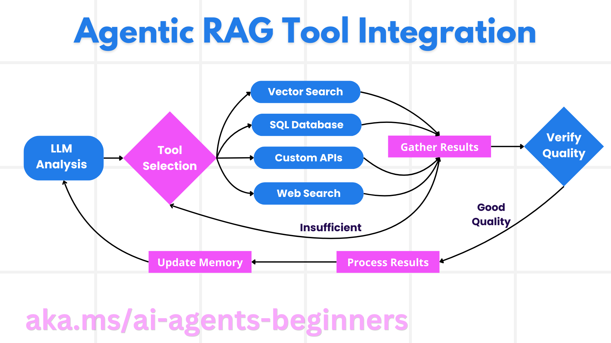
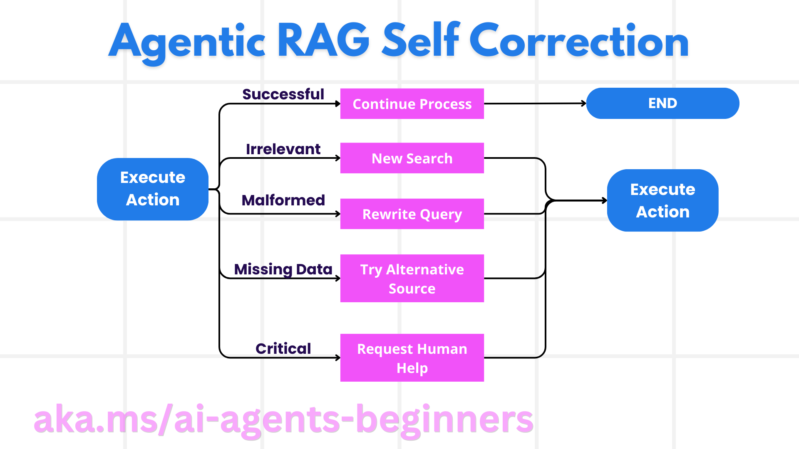

<!--
CO_OP_TRANSLATOR_METADATA:
{
  "original_hash": "d2f04b783b9e1253100329afd698f8ff",
  "translation_date": "2025-08-30T10:48:55+00:00",
  "source_file": "05-agentic-rag/README.md",
  "language_code": "lt"
}
-->

> _(Spustelėkite aukščiau esančią nuotrauką, kad peržiūrėtumėte šios pamokos vaizdo įrašą)_

# Agentic RAG

Šioje pamokoje pateikiama išsami apžvalga apie Agentic Retrieval-Augmented Generation (Agentic RAG) – naują dirbtinio intelekto paradigmą, kurioje dideli kalbos modeliai (LLM) savarankiškai planuoja savo veiksmus, naudodamiesi išoriniais informacijos šaltiniais. Skirtingai nuo statinių „ieškoti-tada-skaityti“ modelių, Agentic RAG apima iteracinius LLM iškvietimus, įterpiant įrankių ar funkcijų naudojimą ir struktūrizuotus rezultatus. Sistema vertina rezultatus, tobulina užklausas, prireikus naudoja papildomus įrankius ir tęsia šį ciklą, kol pasiekiamas tinkamas sprendimas.

## Įvadas

Šioje pamokoje aptarsime:

- **Suprasti Agentic RAG:** Susipažinkite su nauja dirbtinio intelekto paradigma, kurioje dideli kalbos modeliai (LLM) savarankiškai planuoja savo veiksmus, naudodamiesi išoriniais duomenų šaltiniais.
- **Įvaldyti iteracinį „kūrėjo-tikrintojo“ stilių:** Supraskite iteracinių LLM iškvietimų ciklą, įterpiant įrankių ar funkcijų naudojimą ir struktūrizuotus rezultatus, siekiant pagerinti tikslumą ir spręsti netinkamas užklausas.
- **Praktinės taikymo sritys:** Sužinokite, kur Agentic RAG yra ypač naudingas, pavyzdžiui, aplinkose, kuriose svarbiausias tikslumas, sudėtingose duomenų bazių sąveikose ir ilgesniuose darbo procesuose.

## Mokymosi tikslai

Baigę šią pamoką, jūs sužinosite, kaip:

- **Suprasti Agentic RAG:** Susipažinti su nauja dirbtinio intelekto paradigma, kurioje dideli kalbos modeliai (LLM) savarankiškai planuoja savo veiksmus, naudodamiesi išoriniais duomenų šaltiniais.
- **Iteracinis „kūrėjo-tikrintojo“ stilius:** Suprasti iteracinių LLM iškvietimų ciklą, įterpiant įrankių ar funkcijų naudojimą ir struktūrizuotus rezultatus, siekiant pagerinti tikslumą ir spręsti netinkamas užklausas.
- **Savarankiškas sprendimų priėmimas:** Suprasti sistemos gebėjimą savarankiškai priimti sprendimus, kaip spręsti problemas, nesiremiant iš anksto nustatytais keliais.
- **Darbo eiga:** Suprasti, kaip agentinis modelis savarankiškai nusprendžia gauti rinkos tendencijų ataskaitas, nustatyti konkurentų duomenis, susieti vidinius pardavimų rodiklius, sintezuoti išvadas ir įvertinti strategiją.
- **Iteraciniai ciklai, įrankių integracija ir atmintis:** Sužinoti, kaip sistema remiasi cikline sąveika, išlaikydama būseną ir atmintį tarp žingsnių, kad išvengtų pasikartojimų ir priimtų pagrįstus sprendimus.
- **Gedimų valdymas ir savikorekcija:** Išnagrinėti sistemos patikimus savikorekcijos mechanizmus, įskaitant iteraciją ir pakartotinį užklausimą, diagnostinių įrankių naudojimą ir žmogaus priežiūros įtraukimą.
- **Agentūros ribos:** Suprasti Agentic RAG apribojimus, sutelkiant dėmesį į srities specifinę autonomiją, priklausomybę nuo infrastruktūros ir saugumo taisyklių laikymąsi.
- **Praktinės taikymo sritys ir vertė:** Sužinoti, kur Agentic RAG yra ypač naudingas, pavyzdžiui, aplinkose, kuriose svarbiausias tikslumas, sudėtingose duomenų bazių sąveikose ir ilgesniuose darbo procesuose.
- **Valdymas, skaidrumas ir pasitikėjimas:** Suprasti valdymo ir skaidrumo svarbą, įskaitant paaiškinamąją logiką, šališkumo kontrolę ir žmogaus priežiūrą.

## Kas yra Agentic RAG?

Agentic Retrieval-Augmented Generation (Agentic RAG) yra nauja dirbtinio intelekto paradigma, kurioje dideli kalbos modeliai (LLM) savarankiškai planuoja savo veiksmus, naudodamiesi išoriniais informacijos šaltiniais. Skirtingai nuo statinių „ieškoti-tada-skaityti“ modelių, Agentic RAG apima iteracinius LLM iškvietimus, įterpiant įrankių ar funkcijų naudojimą ir struktūrizuotus rezultatus. Sistema vertina rezultatus, tobulina užklausas, prireikus naudoja papildomus įrankius ir tęsia šį ciklą, kol pasiekiamas tinkamas sprendimas. Šis iteracinis „kūrėjo-tikrintojo“ stilius pagerina tikslumą, sprendžia netinkamas užklausas ir užtikrina aukštos kokybės rezultatus.

Sistema aktyviai valdo savo logikos procesą, perrašo nepavykusias užklausas, pasirenka skirtingus paieškos metodus ir integruoja kelis įrankius – tokius kaip vektorinė paieška Azure AI Search, SQL duomenų bazės ar pritaikytos API – prieš pateikdama galutinį atsakymą. Skiriamasis agentinės sistemos bruožas yra jos gebėjimas savarankiškai valdyti savo logikos procesą. Tradicinės RAG implementacijos remiasi iš anksto nustatytais keliais, tačiau agentinė sistema savarankiškai nustato veiksmų seką, remdamasi rasta informacija.

## Agentic Retrieval-Augmented Generation (Agentic RAG) apibrėžimas

Agentic Retrieval-Augmented Generation (Agentic RAG) yra nauja dirbtinio intelekto vystymo paradigma, kurioje LLM ne tik gauna informaciją iš išorinių duomenų šaltinių, bet ir savarankiškai planuoja savo veiksmus. Skirtingai nuo statinių „ieškoti-tada-skaityti“ modelių ar kruopščiai suplanuotų užklausų sekų, Agentic RAG apima iteracinių LLM iškvietimų ciklą, įterpiant įrankių ar funkcijų naudojimą ir struktūrizuotus rezultatus. Kiekviename žingsnyje sistema vertina gautus rezultatus, nusprendžia, ar reikia tobulinti užklausas, prireikus naudoja papildomus įrankius ir tęsia šį ciklą, kol pasiekiamas tinkamas sprendimas.

Šis iteracinis „kūrėjo-tikrintojo“ veikimo stilius skirtas pagerinti tikslumą, spręsti netinkamas užklausas struktūrizuotose duomenų bazėse (pvz., NL2SQL) ir užtikrinti subalansuotus, aukštos kokybės rezultatus. Užuot rėmusis tik kruopščiai sukurtais užklausų grandinėmis, sistema aktyviai valdo savo logikos procesą. Ji gali perrašyti nepavykusias užklausas, pasirinkti skirtingus paieškos metodus ir integruoti kelis įrankius – tokius kaip vektorinė paieška Azure AI Search, SQL duomenų bazės ar pritaikytos API – prieš pateikdama galutinį atsakymą. Tai pašalina poreikį sudėtingoms orkestravimo sistemoms. Vietoj to, santykinai paprastas „LLM iškvietimas → įrankio naudojimas → LLM iškvietimas → …“ ciklas gali duoti sudėtingus ir pagrįstus rezultatus.

## Savarankiškas logikos proceso valdymas

Skiriamasis bruožas, kuris daro sistemą „agentinę“, yra jos gebėjimas savarankiškai valdyti savo logikos procesą. Tradicinės RAG implementacijos dažnai priklauso nuo žmonių, kurie iš anksto nustato modelio kelią: minties grandinę, nurodančią, ką ir kada gauti.
Tačiau tikrai agentinė sistema pati nusprendžia, kaip spręsti problemą. Ji ne tik vykdo scenarijų; ji savarankiškai nustato veiksmų seką, remdamasi rasta informacija.
Pavyzdžiui, jei ji prašoma sukurti produkto paleidimo strategiją, ji nesiremia tik užklausa, kuri išdėsto visą tyrimo ir sprendimų priėmimo procesą. Vietoj to, agentinis modelis savarankiškai nusprendžia:

1. Gauti dabartinių rinkos tendencijų ataskaitas naudodamas Bing Web Grounding.
2. Nustatyti svarbius konkurentų duomenis naudodamas Azure AI Search.
3. Susieti istorinius vidinius pardavimų rodiklius naudodamas Azure SQL Database.
4. Sintezuoti išvadas į nuoseklią strategiją, naudodamas Azure OpenAI Service.
5. Įvertinti strategiją dėl spragų ar nenuoseklumų, prireikus inicijuodamas dar vieną paieškos etapą.
Visi šie žingsniai – užklausų tobulinimas, šaltinių pasirinkimas, iteravimas, kol „patenkintas“ atsakymu – yra modelio sprendimai, o ne iš anksto nustatyti žmogaus.

## Iteraciniai ciklai, įrankių integracija ir atmintis

Agentinė sistema remiasi cikline sąveika:

- **Pradinis iškvietimas:** Vartotojo tikslas (t. y. vartotojo užklausa) pateikiamas LLM.
- **Įrankio naudojimas:** Jei modelis nustato, kad trūksta informacijos arba instrukcijos yra neaiškios, jis pasirenka įrankį ar paieškos metodą – pvz., vektorinės duomenų bazės užklausą (pvz., Azure AI Search hibridinę paiešką privačiuose duomenyse) arba struktūrizuotą SQL užklausą – kad surinktų daugiau konteksto.
- **Vertinimas ir tobulinimas:** Peržiūrėjęs gautus duomenis, modelis nusprendžia, ar informacijos pakanka. Jei ne, jis tobulina užklausą, bando kitą įrankį arba koreguoja savo požiūrį.
- **Kartojimas, kol patenkintas:** Šis ciklas tęsiasi, kol modelis nusprendžia, kad turi pakankamai aiškumo ir įrodymų, kad pateiktų galutinį, gerai pagrįstą atsakymą.
- **Atmintis ir būsena:** Kadangi sistema išlaiko būseną ir atmintį tarp žingsnių, ji gali prisiminti ankstesnius bandymus ir jų rezultatus, išvengdama pasikartojimų ir priimdama labiau pagrįstus sprendimus.

Laikui bėgant tai sukuria besivystančio supratimo jausmą, leidžiantį modeliui atlikti sudėtingas, daugiapakopes užduotis, nereikalaujant, kad žmogus nuolat įsikištų ar keistų užklausą.

## Gedimų valdymas ir savikorekcija

Agentic RAG autonomija taip pat apima patikimus savikorekcijos mechanizmus. Kai sistema susiduria su aklavietėmis – pvz., gauna nesusijusius dokumentus arba susiduria su netinkamomis užklausomis – ji gali:

- **Iteruoti ir pakartotinai užklausti:** Vietoj to, kad pateiktų mažos vertės atsakymus, modelis bando naujas paieškos strategijas, perrašo duomenų bazių užklausas arba ieško alternatyvių duomenų rinkinių.
- **Naudoti diagnostinius įrankius:** Sistema gali naudoti papildomas funkcijas, skirtas padėti jai ištaisyti logikos žingsnius arba patvirtinti gautų duomenų teisingumą. Tokie įrankiai kaip Azure AI Tracing yra svarbūs, siekiant užtikrinti stebimumą ir stebėseną.
- **Pasikliauti žmogaus priežiūra:** Aukštos rizikos arba nuolat nesėkmingais atvejais modelis gali pažymėti neapibrėžtumą ir prašyti žmogaus pagalbos. Kai žmogus pateikia korekcinį atsiliepimą, modelis gali įtraukti tą pamoką ateityje.

Šis iteracinis ir dinamiškas požiūris leidžia modeliui nuolat tobulėti, užtikrinant, kad jis nėra vienkartinė sistema, o tokia, kuri mokosi iš savo klaidų per sesiją.

## Agentūros ribos

Nepaisant autonomijos užduotyje, Agentic RAG nėra lygiavertis dirbtiniam bendram intelektui. Jos „agentinės“ galimybės apsiriboja įrankiais, duomenų šaltiniais ir politikomis, kurias pateikia kūrėjai. Ji negali sukurti savo įrankių ar peržengti nustatytų ribų. Tačiau ji puikiai tinka dinamiškai organizuoti turimus išteklius.
Pagrindiniai skirtumai nuo pažangesnių dirbtinio intelekto formų yra šie:

1. **Srities specifinė autonomija:** Agentic RAG sistemos yra orientuotos į vartotojo apibrėžtų tikslų pasiekimą žinomoje srityje, naudodamos tokias strategijas kaip užklausų perrašymas ar įrankių pasirinkimas, siekiant pagerinti rezultatus.
2. **Priklausomybė nuo infrastruktūros:** Sistemos galimybės priklauso nuo kūrėjų integruotų įrankių ir duomenų. Ji negali peržengti šių ribų be žmogaus įsikišimo.
3. **Saugumo taisyklių laikymasis:** Etikos gairės, atitikties taisyklės ir verslo politikos išlieka labai svarbios. Agentinės sistemos laisvė visada yra apribota saugumo priemonėmis ir priežiūros mechanizmais (tikėkimės?).

## Praktinės taikymo sritys ir vertė

Agentic RAG ypač naudingas scenarijuose, kuriems reikia iteracinio tobulinimo ir tikslumo:

1. **Tikslumo pirmumo aplinkos:** Atitikties patikrinimuose, reguliavimo analizėje ar teisinių tyrimų srityse agentinis modelis gali pakartotinai tikrinti faktus, konsultuotis su keliais šaltiniais ir perrašyti užklausas, kol pateikia kruopščiai patikrintą atsakymą.
2. **Sudėtingos duomenų bazių sąveikos:** Dirbant su struktūrizuotais duomenimis, kur užklausos dažnai gali nepavykti arba reikalauti korekcijų, sistema gali savarankiškai tobulinti užklausas naudodama Azure SQL arba Microsoft Fabric OneLake, užtikrindama, kad galutinis rezultatas atitiktų vartotojo ketinimus.
3. **Išplėstiniai darbo procesai:** Ilgesnės sesijos gali vystytis, kai atsiranda nauja informacija. Agentic RAG gali nuolat įtraukti naujus duomenis, keisti strategijas, kai daugiau sužino apie problemos sritį.

## Valdymas, skaidrumas ir pasitikėjimas

Kadangi šios sistemos tampa savarankiškesnės savo logikoje, valdymas ir skaidrumas yra labai svarbūs:

- **Paaiškinama logika:** Modelis gali pateikti užklausų, konsultuotų šaltinių ir logikos žingsnių, kuriuos atliko, kad pasiektų išvadą, auditą. Tokie įrankiai kaip Azure AI Content Safety ir Azure AI Tracing / GenAIOps gali padėti išlaikyti skaidrumą ir sumažinti riziką.
- **Šališkumo kontrolė ir subalansuota paieška:** Kūrėjai gali reguliuoti paieškos strategijas, kad būtų atsižvelgta į subalansuotus, reprezentatyvius duomenų šaltinius, ir reguliariai tikrinti rezultatus, kad aptiktų šališkumą ar iškraipytus modelius, naudodami pritaikytus modelius pažangioms duomenų mokslo organizacijoms, naudojančioms Azure Machine Learning.
- **Žmogaus priežiūra ir atitikt
<a href="https://learn.microsoft.com/training/modules/use-own-data-azure-openai" target="_blank">
Įgyvendinkite paieška papildytą generavimą (RAG) su Azure OpenAI paslauga: Sužinokite, kaip naudoti savo duomenis su Azure OpenAI paslauga. Šis Microsoft Learn modulis pateikia išsamų vadovą, kaip įgyvendinti RAG  
- <a href="https://learn.microsoft.com/azure/ai-studio/concepts/evaluation-approach-gen-ai" target="_blank">Generatyviosios AI programų vertinimas su Azure AI Foundry: Šiame straipsnyje aptariamas modelių vertinimas ir palyginimas naudojant viešai prieinamus duomenų rinkinius, įskaitant Agentic AI programas ir RAG architektūras</a>  
- <a href="https://weaviate.io/blog/what-is-agentic-rag" target="_blank">Kas yra Agentic RAG | Weaviate</a>  
- <a href="https://ragaboutit.com/agentic-rag-a-complete-guide-to-agent-based-retrieval-augmented-generation/" target="_blank">Agentic RAG: Išsamus vadovas apie agentais pagrįstą paieška papildytą generavimą – Naujienos iš RAG pasaulio</a>  
- <a href="https://huggingface.co/learn/cookbook/agent_rag" target="_blank">Agentic RAG: pagreitinkite savo RAG naudodami užklausų reformulavimą ir savarankišką užklausimą! Hugging Face atvirojo kodo AI vadovas</a>  
- <a href="https://youtu.be/aQ4yQXeB1Ss?si=2HUqBzHoeB5tR04U" target="_blank">Agentinių sluoksnių pridėjimas prie RAG</a>  
- <a href="https://www.youtube.com/watch?v=zeAyuLc_f3Q&t=244s" target="_blank">Žinių asistentų ateitis: Jerry Liu</a>  
- <a href="https://www.youtube.com/watch?v=AOSjiXP1jmQ" target="_blank">Kaip sukurti agentinius RAG sistemas</a>  
- <a href="https://ignite.microsoft.com/sessions/BRK102?source=sessions" target="_blank">Azure AI Foundry Agent Service naudojimas AI agentų mastelio didinimui</a>  

### Akademiniai straipsniai  

- <a href="https://arxiv.org/abs/2303.17651" target="_blank">2303.17651 Self-Refine: Iteratyvus tobulinimas su savarankišku grįžtamuoju ryšiu</a>  
- <a href="https://arxiv.org/abs/2303.11366" target="_blank">2303.11366 Reflexion: Kalbos agentai su žodiniu pastiprinimu</a>  
- <a href="https://arxiv.org/abs/2305.11738" target="_blank">2305.11738 CRITIC: Dideli kalbos modeliai gali savarankiškai taisytis naudodami įrankių interaktyvų kritikavimą</a>  
- <a href="https://arxiv.org/abs/2501.09136" target="_blank">2501.09136 Agentinis paieška papildytas generavimas: Apžvalga apie Agentic RAG</a>  

## Ankstesnė pamoka  

[Įrankių naudojimo dizaino šablonas](../04-tool-use/README.md)  

## Kita pamoka  

[Patikimų AI agentų kūrimas](../06-building-trustworthy-agents/README.md)  

---

**Atsakomybės apribojimas**:  
Šis dokumentas buvo išverstas naudojant AI vertimo paslaugą [Co-op Translator](https://github.com/Azure/co-op-translator). Nors siekiame tikslumo, prašome atkreipti dėmesį, kad automatiniai vertimai gali turėti klaidų ar netikslumų. Originalus dokumentas jo gimtąja kalba turėtų būti laikomas autoritetingu šaltiniu. Kritinei informacijai rekomenduojama naudoti profesionalų žmogaus vertimą. Mes neprisiimame atsakomybės už nesusipratimus ar klaidingus aiškinimus, atsiradusius dėl šio vertimo naudojimo.