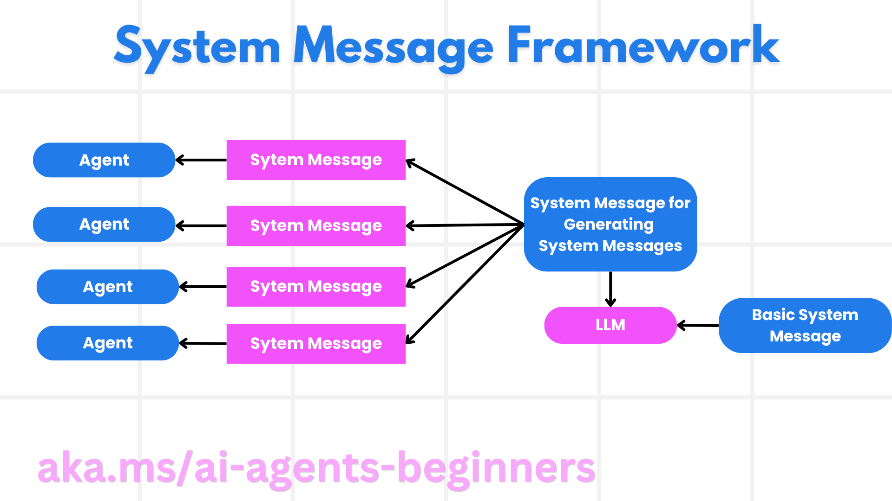
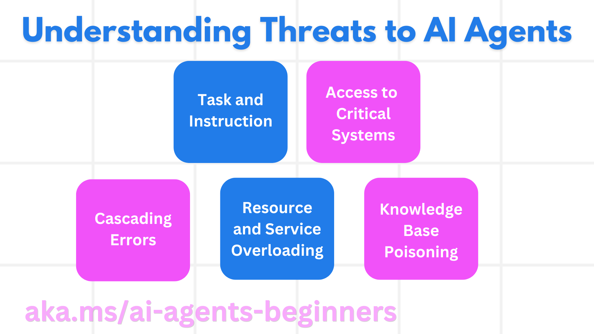
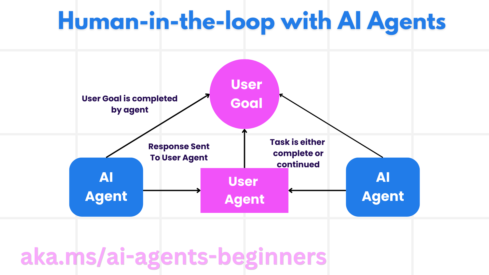

<!--
CO_OP_TRANSLATOR_METADATA:
{
  "original_hash": "498802b4c3c3cc486b86f27a12cebb34",
  "translation_date": "2025-08-30T10:46:47+00:00",
  "source_file": "06-building-trustworthy-agents/README.md",
  "language_code": "lt"
}
-->
[](https://youtu.be/iZKkMEGBCUQ?si=Q-kEbcyHUMPoHp8L)

> _(Spustelėkite paveikslėlį aukščiau, kad peržiūrėtumėte šios pamokos vaizdo įrašą)_

# Patikimų AI agentų kūrimas

## Įvadas

Šioje pamokoje aptarsime:

- Kaip kurti ir diegti saugius bei efektyvius AI agentus.
- Svarbius saugumo aspektus kuriant AI agentus.
- Kaip užtikrinti duomenų ir vartotojų privatumo apsaugą kuriant AI agentus.

## Mokymosi tikslai

Baigę šią pamoką, sužinosite, kaip:

- Atpažinti ir sumažinti rizikas kuriant AI agentus.
- Įgyvendinti saugumo priemones, kad duomenys ir prieiga būtų tinkamai valdomi.
- Kurti AI agentus, kurie užtikrina duomenų privatumą ir teikia kokybišką vartotojo patirtį.

## Saugumas

Pirmiausia pažvelkime į saugių agentinių programų kūrimą. Saugumas reiškia, kad AI agentas veikia taip, kaip numatyta. Kaip agentinių programų kūrėjai, turime metodus ir įrankius, kurie padeda maksimaliai padidinti saugumą:

### Sistemos pranešimų struktūros kūrimas

Jei kada nors kūrėte AI programą naudodami didelius kalbos modelius (LLMs), žinote, kaip svarbu sukurti tvirtą sistemos pranešimą ar sistemos užklausą. Šie pranešimai nustato pagrindines taisykles, instrukcijas ir gaires, kaip LLM sąveikaus su vartotoju ir duomenimis.

AI agentams sistemos pranešimas yra dar svarbesnis, nes AI agentams reikės labai specifinių instrukcijų, kad jie galėtų atlikti užduotis, kurias jiems sukūrėme.

Norėdami sukurti mastelio keičiamus sistemos pranešimus, galime naudoti sistemos pranešimų struktūrą, skirtą vieno ar kelių agentų kūrimui mūsų programoje:



#### 1 žingsnis: Sukurkite meta sistemos pranešimą

Meta pranešimas bus naudojamas LLM generuoti sistemos pranešimus agentams, kuriuos sukuriame. Jį kuriame kaip šabloną, kad prireikus galėtume efektyviai sukurti kelis agentus.

Štai pavyzdys, kaip atrodytų meta sistemos pranešimas, kurį pateiktume LLM:

```plaintext
You are an expert at creating AI agent assistants. 
You will be provided a company name, role, responsibilities and other
information that you will use to provide a system prompt for.
To create the system prompt, be descriptive as possible and provide a structure that a system using an LLM can better understand the role and responsibilities of the AI assistant. 
```

#### 2 žingsnis: Sukurkite pagrindinį pranešimą

Kitas žingsnis – sukurti pagrindinį pranešimą, apibūdinantį AI agentą. Jame turėtumėte nurodyti agento vaidmenį, užduotis, kurias jis atliks, ir kitas agento atsakomybes.

Štai pavyzdys:

```plaintext
You are a travel agent for Contoso Travel that is great at booking flights for customers. To help customers you can perform the following tasks: lookup available flights, book flights, ask for preferences in seating and times for flights, cancel any previously booked flights and alert customers on any delays or cancellations of flights.  
```

#### 3 žingsnis: Pateikite pagrindinį sistemos pranešimą LLM

Dabar galime optimizuoti šį sistemos pranešimą, pateikdami meta sistemos pranešimą kaip sistemos pranešimą ir mūsų pagrindinį sistemos pranešimą.

Tai sukurs geriau suprojektuotą sistemos pranešimą, skirtą AI agentų vadovavimui:

```markdown
**Company Name:** Contoso Travel  
**Role:** Travel Agent Assistant

**Objective:**  
You are an AI-powered travel agent assistant for Contoso Travel, specializing in booking flights and providing exceptional customer service. Your main goal is to assist customers in finding, booking, and managing their flights, all while ensuring that their preferences and needs are met efficiently.

**Key Responsibilities:**

1. **Flight Lookup:**
    
    - Assist customers in searching for available flights based on their specified destination, dates, and any other relevant preferences.
    - Provide a list of options, including flight times, airlines, layovers, and pricing.
2. **Flight Booking:**
    
    - Facilitate the booking of flights for customers, ensuring that all details are correctly entered into the system.
    - Confirm bookings and provide customers with their itinerary, including confirmation numbers and any other pertinent information.
3. **Customer Preference Inquiry:**
    
    - Actively ask customers for their preferences regarding seating (e.g., aisle, window, extra legroom) and preferred times for flights (e.g., morning, afternoon, evening).
    - Record these preferences for future reference and tailor suggestions accordingly.
4. **Flight Cancellation:**
    
    - Assist customers in canceling previously booked flights if needed, following company policies and procedures.
    - Notify customers of any necessary refunds or additional steps that may be required for cancellations.
5. **Flight Monitoring:**
    
    - Monitor the status of booked flights and alert customers in real-time about any delays, cancellations, or changes to their flight schedule.
    - Provide updates through preferred communication channels (e.g., email, SMS) as needed.

**Tone and Style:**

- Maintain a friendly, professional, and approachable demeanor in all interactions with customers.
- Ensure that all communication is clear, informative, and tailored to the customer's specific needs and inquiries.

**User Interaction Instructions:**

- Respond to customer queries promptly and accurately.
- Use a conversational style while ensuring professionalism.
- Prioritize customer satisfaction by being attentive, empathetic, and proactive in all assistance provided.

**Additional Notes:**

- Stay updated on any changes to airline policies, travel restrictions, and other relevant information that could impact flight bookings and customer experience.
- Use clear and concise language to explain options and processes, avoiding jargon where possible for better customer understanding.

This AI assistant is designed to streamline the flight booking process for customers of Contoso Travel, ensuring that all their travel needs are met efficiently and effectively.

```

#### 4 žingsnis: Tobulinkite ir gerinkite

Šios sistemos pranešimų struktūros vertė yra galimybė lengviau kurti sistemos pranešimus keliems agentams, taip pat tobulinti sistemos pranešimus laikui bėgant. Retai pasitaiko, kad sistemos pranešimas veiktų iš karto visam jūsų naudojimo atvejui. Galimybė atlikti nedidelius pakeitimus ir patobulinimus keičiant pagrindinį sistemos pranešimą ir paleidžiant jį per sistemą leis palyginti ir įvertinti rezultatus.

## Grėsmių supratimas

Norint sukurti patikimus AI agentus, svarbu suprasti ir sumažinti rizikas bei grėsmes, susijusias su jūsų AI agentu. Pažvelkime į kai kurias grėsmes AI agentams ir kaip galite geriau planuoti bei pasiruošti joms.



### Užduotys ir instrukcijos

**Aprašymas:** Atakuotojai bando pakeisti AI agento instrukcijas ar tikslus, manipuliuodami užklausomis ar įvestimis.

**Prevencija:** Atlikite patikrinimus ir įveskite filtrus, kad aptiktumėte potencialiai pavojingas užklausas prieš jas apdorojant AI agentui. Kadangi šios atakos paprastai reikalauja dažnos sąveikos su agentu, pokalbio posūkių skaičiaus ribojimas yra dar vienas būdas užkirsti kelią tokioms atakoms.

### Prieiga prie kritinių sistemų

**Aprašymas:** Jei AI agentas turi prieigą prie sistemų ir paslaugų, kuriose saugomi jautrūs duomenys, atakuotojai gali pažeisti komunikaciją tarp agento ir šių paslaugų. Tai gali būti tiesioginės atakos arba netiesioginiai bandymai gauti informaciją apie šias sistemas per agentą.

**Prevencija:** AI agentai turėtų turėti prieigą prie sistemų tik tada, kai tai būtina, kad būtų išvengta tokių atakų. Komunikacija tarp agento ir sistemos taip pat turėtų būti saugi. Autentifikacijos ir prieigos kontrolės įgyvendinimas yra dar vienas būdas apsaugoti šią informaciją.

### Resursų ir paslaugų perkrovimas

**Aprašymas:** AI agentai gali naudotis įvairiais įrankiais ir paslaugomis, kad atliktų užduotis. Atakuotojai gali pasinaudoti šia galimybe, siųsdami didelį užklausų kiekį per AI agentą, dėl ko gali kilti sistemos gedimai ar didelės išlaidos.

**Prevencija:** Įgyvendinkite politiką, ribojančią užklausų, kurias AI agentas gali pateikti paslaugai, skaičių. Pokalbio posūkių ir užklausų skaičiaus ribojimas jūsų AI agentui yra dar vienas būdas užkirsti kelią tokioms atakoms.

### Žinių bazės užteršimas

**Aprašymas:** Šio tipo ataka nėra tiesiogiai nukreipta į AI agentą, bet į žinių bazę ir kitas paslaugas, kurias AI agentas naudos. Tai gali apimti duomenų ar informacijos, kurią AI agentas naudos užduočiai atlikti, sugadinimą, dėl ko vartotojui pateikiami šališki ar netikslūs atsakymai.

**Prevencija:** Reguliariai tikrinkite duomenis, kuriuos AI agentas naudos savo darbo eigoje. Užtikrinkite, kad prieiga prie šių duomenų būtų saugi ir juos keistų tik patikimi asmenys, kad išvengtumėte tokio tipo atakų.

### Klaidos grandinė

**Aprašymas:** AI agentai naudoja įvairius įrankius ir paslaugas užduotims atlikti. Atakuotojų sukeltos klaidos gali sukelti kitų sistemų, su kuriomis AI agentas yra susijęs, gedimus, dėl ko ataka tampa platesnė ir sunkiau išsprendžiama.

**Prevencija:** Vienas būdas to išvengti yra leisti AI agentui veikti ribotoje aplinkoje, pavyzdžiui, atlikti užduotis „Docker“ konteineryje, kad būtų išvengta tiesioginių sistemų atakų. Sukurti atsarginius mechanizmus ir pakartotinio bandymo logiką, kai tam tikros sistemos atsako su klaida, yra dar vienas būdas išvengti didesnių sistemos gedimų.

## Žmogus procese

Dar vienas veiksmingas būdas kurti patikimas AI agentų sistemas yra įtraukti žmogų į procesą. Tai sukuria srautą, kuriame vartotojai gali teikti atsiliepimus agentams vykdymo metu. Vartotojai iš esmės veikia kaip agentai daugiagentėje sistemoje, suteikdami patvirtinimą arba nutraukdami vykdomą procesą.



Štai kodo fragmentas, naudojantis „AutoGen“, kuris parodo, kaip šis konceptas įgyvendinamas:

```python

# Create the agents.
model_client = OpenAIChatCompletionClient(model="gpt-4o-mini")
assistant = AssistantAgent("assistant", model_client=model_client)
user_proxy = UserProxyAgent("user_proxy", input_func=input)  # Use input() to get user input from console.

# Create the termination condition which will end the conversation when the user says "APPROVE".
termination = TextMentionTermination("APPROVE")

# Create the team.
team = RoundRobinGroupChat([assistant, user_proxy], termination_condition=termination)

# Run the conversation and stream to the console.
stream = team.run_stream(task="Write a 4-line poem about the ocean.")
# Use asyncio.run(...) when running in a script.
await Console(stream)

```

## Išvada

Patikimų AI agentų kūrimas reikalauja kruopštaus projektavimo, tvirtų saugumo priemonių ir nuolatinio tobulinimo. Naudodami struktūrizuotus meta užklausų sistemas, suprasdami galimas grėsmes ir taikydami prevencijos strategijas, kūrėjai gali sukurti AI agentus, kurie yra saugūs ir efektyvūs. Be to, įtraukus žmogų į procesą, užtikrinama, kad AI agentai išliktų suderinti su vartotojų poreikiais, tuo pačiu sumažinant rizikas. Kadangi AI toliau vystosi, proaktyvus požiūris į saugumą, privatumą ir etinius aspektus bus pagrindinis veiksnys, skatinantis pasitikėjimą ir patikimumą AI sistemose.

### Turite daugiau klausimų apie patikimų AI agentų kūrimą?

Prisijunkite prie [Azure AI Foundry Discord](https://aka.ms/ai-agents/discord), kad susipažintumėte su kitais besimokančiais, dalyvautumėte konsultacijose ir gautumėte atsakymus į savo AI agentų klausimus.

## Papildomi ištekliai

- <a href="https://learn.microsoft.com/azure/ai-studio/responsible-use-of-ai-overview" target="_blank">Atsakingo AI apžvalga</a>
- <a href="https://learn.microsoft.com/azure/ai-studio/concepts/evaluation-approach-gen-ai" target="_blank">Generatyvinių AI modelių ir AI programų vertinimas</a>
- <a href="https://learn.microsoft.com/azure/ai-services/openai/concepts/system-message?context=%2Fazure%2Fai-studio%2Fcontext%2Fcontext&tabs=top-techniques" target="_blank">Saugumo sistemos pranešimai</a>
- <a href="https://blogs.microsoft.com/wp-content/uploads/prod/sites/5/2022/06/Microsoft-RAI-Impact-Assessment-Template.pdf?culture=en-us&country=us" target="_blank">Rizikos vertinimo šablonas</a>

## Ankstesnė pamoka

[Agentinė RAG](../05-agentic-rag/README.md)

## Kita pamoka

[Planavimo dizaino šablonas](../07-planning-design/README.md)

---

**Atsakomybės apribojimas**:  
Šis dokumentas buvo išverstas naudojant AI vertimo paslaugą [Co-op Translator](https://github.com/Azure/co-op-translator). Nors siekiame tikslumo, prašome atkreipti dėmesį, kad automatiniai vertimai gali turėti klaidų ar netikslumų. Originalus dokumentas jo gimtąja kalba turėtų būti laikomas autoritetingu šaltiniu. Kritinei informacijai rekomenduojama naudoti profesionalų žmogaus vertimą. Mes neprisiimame atsakomybės už nesusipratimus ar klaidingus interpretavimus, atsiradusius dėl šio vertimo naudojimo.