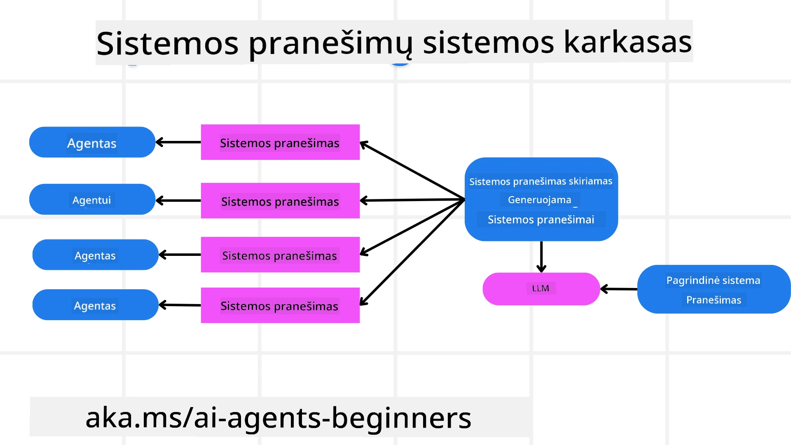
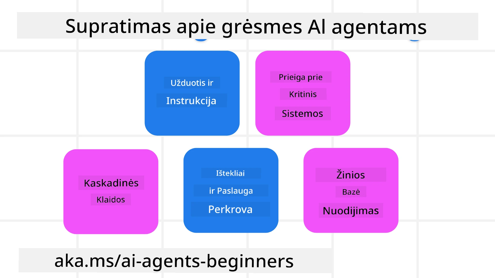
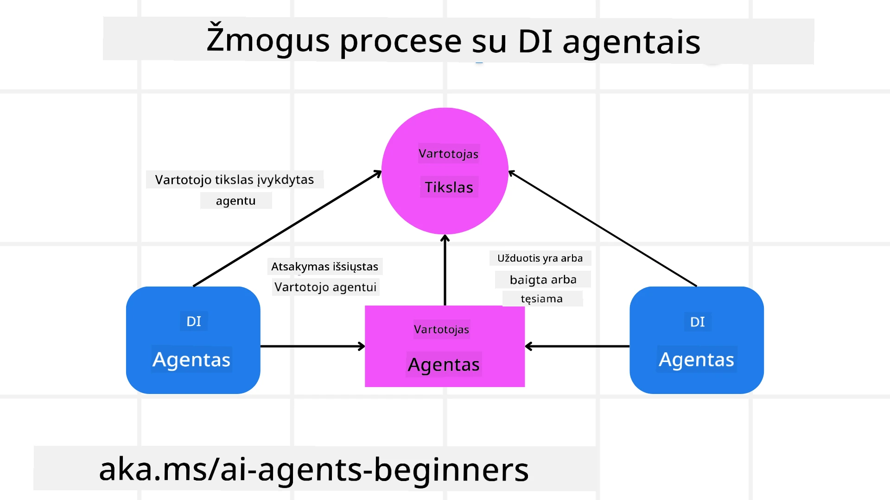

[](https://youtu.be/iZKkMEGBCUQ?si=Q-kEbcyHUMPoHp8L)

> _(Spustelėkite aukščiau esančią nuotrauką, kad peržiūrėtumėte šios pamokos vaizdo įrašą)_

# Patikimų DI agentų kūrimas

## Įvadas

Šioje pamokoje aptarsime:

- Kaip kurti ir diegti saugius ir veiksmingus DI agentus
- Svarbius saugumo aspektus kuriant DI agentus
- Kaip užtikrinti duomenų ir vartotojų privatumo apsaugą kuriant DI agentus

## Mokymosi tikslai

Baigę šią pamoką, žinosite, kaip:

- Identifikuoti ir mažinti rizikas kuriant DI agentus
- Įdiegti saugumo priemones, kad būtų tinkamai valdomi duomenys ir prieiga
- Kurti DI agentus, kurie išlaiko duomenų privatumą ir suteikia kokybišką vartotojo patirtį

## Saugumas

Pirmiausia pažvelkime į saugių agentų programų kūrimą. Saugumas reiškia, kad DI agentas veikia pagal numatytą paskirtį. Kaip agentinių programų kūrėjai, turime metodus ir įrankius, skirtus maksimizuoti saugumą:

### Sistemos žinutės karkaso kūrimas

Jei kada nors esate kūrę DI programą naudodami didelius kalbos modelius (LLM), žinote, kokia svarbi yra tvirto sistemos užklausos ar sistemos žinutės sukūrimas. Šios užklausos nustato metarules, instrukcijas ir gaires, kaip LLM bendraus su vartotoju ir duomenimis.

DI agentams sistemos užklausa yra dar svarbesnė, nes DI agentams reikės ypač konkrečių instrukcijų, kad jie galėtų įvykdyti mums skirtas užduotis.

Norėdami sukurti mastelinius sistemos užklausas, galime naudoti sistemos žinutės karkasą, kad sukurtume vieną ar kelis agentus savo programoje:



#### 1 veiksmas: Sukurkite metosistemos žinutę

Metaužklausa bus naudojama LLM generuoti agentams skirtoms sistemos užklausoms. Ją kuriame kaip šabloną, kad galėtume efektyviai sukurti kelis agentus pagal poreikį.

Čia pateikiamas pavyzdys metosistemos žinutės, kurią pateiktume LLM:

```plaintext
You are an expert at creating AI agent assistants. 
You will be provided a company name, role, responsibilities and other
information that you will use to provide a system prompt for.
To create the system prompt, be descriptive as possible and provide a structure that a system using an LLM can better understand the role and responsibilities of the AI assistant. 
```

#### 2 veiksmas: Sukurkite pagrindinę užklausą

Kitas žingsnis – sukurti pagrindinę užklausą, aprašant DI agentą. Turėtumėte įtraukti agentei priskirtą vaidmenį, užduotis, kurias agentas atliks, bei kitas agento atsakomybes.

Štai pavyzdys:

```plaintext
You are a travel agent for Contoso Travel that is great at booking flights for customers. To help customers you can perform the following tasks: lookup available flights, book flights, ask for preferences in seating and times for flights, cancel any previously booked flights and alert customers on any delays or cancellations of flights.  
```

#### 3 veiksmas: Pateikite pagrindinę sistemos žinutę LLM

Dabar galime optimizuoti šią sistemos žinutę, pateikdami metosistemos žinutę kaip sistemos žinutę kartu su pagrindine sistemos žinute.

Tai sukurs sistemos žinutę, kuri geriau vadovaus mūsų DI agentams:

```markdown
**Company Name:** Contoso Travel  
**Role:** Travel Agent Assistant

**Objective:**  
You are an AI-powered travel agent assistant for Contoso Travel, specializing in booking flights and providing exceptional customer service. Your main goal is to assist customers in finding, booking, and managing their flights, all while ensuring that their preferences and needs are met efficiently.

**Key Responsibilities:**

1. **Flight Lookup:**
    
    - Assist customers in searching for available flights based on their specified destination, dates, and any other relevant preferences.
    - Provide a list of options, including flight times, airlines, layovers, and pricing.
2. **Flight Booking:**
    
    - Facilitate the booking of flights for customers, ensuring that all details are correctly entered into the system.
    - Confirm bookings and provide customers with their itinerary, including confirmation numbers and any other pertinent information.
3. **Customer Preference Inquiry:**
    
    - Actively ask customers for their preferences regarding seating (e.g., aisle, window, extra legroom) and preferred times for flights (e.g., morning, afternoon, evening).
    - Record these preferences for future reference and tailor suggestions accordingly.
4. **Flight Cancellation:**
    
    - Assist customers in canceling previously booked flights if needed, following company policies and procedures.
    - Notify customers of any necessary refunds or additional steps that may be required for cancellations.
5. **Flight Monitoring:**
    
    - Monitor the status of booked flights and alert customers in real-time about any delays, cancellations, or changes to their flight schedule.
    - Provide updates through preferred communication channels (e.g., email, SMS) as needed.

**Tone and Style:**

- Maintain a friendly, professional, and approachable demeanor in all interactions with customers.
- Ensure that all communication is clear, informative, and tailored to the customer's specific needs and inquiries.

**User Interaction Instructions:**

- Respond to customer queries promptly and accurately.
- Use a conversational style while ensuring professionalism.
- Prioritize customer satisfaction by being attentive, empathetic, and proactive in all assistance provided.

**Additional Notes:**

- Stay updated on any changes to airline policies, travel restrictions, and other relevant information that could impact flight bookings and customer experience.
- Use clear and concise language to explain options and processes, avoiding jargon where possible for better customer understanding.

This AI assistant is designed to streamline the flight booking process for customers of Contoso Travel, ensuring that all their travel needs are met efficiently and effectively.

```

#### 4 veiksmas: Kartokite ir tobulinkite

Šio sistemos žinutės karkaso vertė yra galimybė lengviau kurti sistemos žinutes daugeliui agentų bei tobulinti jūsų sistemos žinutes laikui bėgant. Retai kada turėsite sistemos žinutę, kuri pirmą kartą veiktų visam jūsų naudojimo atvejui. Gebėjimas daryti smulkius pakeitimus ir patobulinimus keisdami pagrindinę sistemos žinutę ir paleisdami ją per sistemą leis palyginti ir įvertinti rezultatus.

## Grėsmių supratimas

Norint sukurti patikimus DI agentus, svarbu suprasti ir sumažinti rizikas bei grėsmes jūsų DI agentui. Pažvelkime tik į kai kurias grėsmes DI agentams ir kaip geriau jas planuoti bei pasiruošti.



### Užduotis ir instrukcijos

**Aprašymas:** Užpuolikai bando pakeisti DI agento instrukcijas ar tikslus naudodami užklausas arba manipuliuodami įvestimis.

**Sumažinimas:** Vykdykite patikros patikrinimus ir įvesties filtrus, kad aptiktumėte potencialiai pavojingas užklausas prieš jas apdorojant DI agentui. Kadangi šie išpuoliai dažnai reikalauja dažnos sąveikos su agentu, galite riboti pokalbių sukimų skaičių kaip dar vieną būdą užkirsti kelią šios rūšies išpuoliams.

### Prieiga prie kritinių sistemų

**Aprašymas:** Jei DI agentas turi prieigą prie sistemų ir paslaugų, kuriose saugomi jautrūs duomenys, užpuolikai gali pakenkti agento ir šių paslaugų ryšiui. Tai gali būti tiesioginiai išpuoliai arba netiesioginiai bandymai gauti informacijos apie šias sistemas per agentą.

**Sumažinimas:** DI agentams prieiga prie sistemų turėtų būti suteikta tik pagal poreikį, kad būtų išvengta tokių išpuolių. Ryšys tarp agento ir sistemos taip pat turėtų būti saugus. Autentifikacijos ir prieigos kontrolės įgyvendinimas yra dar vienas būdas apsaugoti šią informaciją.

### Išteklių ir paslaugų perkrova

**Aprašymas:** DI agentai gali naudotis įvairiais įrankiais ir paslaugomis užduotims atlikti. Užpuolikai gali išnaudoti šią galimybę siųsdami daug užklausų per DI agentą, kas gali sukelti sistemos sutrikimus ar dideles išlaidas.

**Sumažinimas:** Įgyvendinkite politiką, ribojančią, kiek užklausų DI agentas gali siųsti paslaugai. Pokalbių sukimų ir užklausų skaičiaus ribojimas jūsų DI agentui yra dar vienas būdas užkirsti kelią tokio pobūdžio išpuoliams.

### Žinių bazės užteršimas

**Aprašymas:** Šios rūšies išpuolis ne tiesiogiai taikomas DI agentui, o žinių bazei ir kitoms paslaugoms, kurias agentas naudos. Tai gali būti duomenų ar informacijos sugadinimas, kuria DI agentas remsis užduočiai atlikti, todėl vartotojui bus pateikti šališki arba neteisingi atsakymai.

**Sumažinimas:** Atlikite reguliarias patikras duomenims, kuriuos DI agentas naudos savo veiklose. Užtikrinkite, kad prieiga prie šių duomenų būtų apsaugota ir juos galėtų keisti tik patikimi asmenys, kad būtų išvengta šios rūšies išpuolių.

### Klaidos grandinėje

**Aprašymas:** DI agentai pasiekia įvairius įrankius ir paslaugas užduotims atlikti. Užpuolikų sukeltos klaidos gali sukelti kitų sistemų, prie kurių prisijungęs agentas, sutrikimus, dėl ko išpuolis išplinta ir tampa sudėtingesnis taisyti.

**Sumažinimas:** Vienas būdas išvengti to – leisti DI agentui veikti ribotoje aplinkoje, pavyzdžiui, vykdant užduotis Docker konteineryje, kad būtų užkirstas tiesioginis patekimas į sistemą. Taip pat svarbu sukurti atsarginio veikimo mechanizmus ir pakartotinį bandymų logiką, kai tam tikros sistemos grąžina klaidą, kad būtų išvengta didesnių sistemos sutrikimų.

## Žmogus procese

Kitas veiksmingas būdas kurti patikimas DI agentų sistemas yra naudoti žmogų proceso valdyme. Tai sukuria srautą, kuriame vartotojai gali teikti atsiliepimus agentams vykdymo metu. Vartotojai iš esmės veikia kaip agentai daugiaagentėje sistemoje, suteikdami patvirtinimą arba nutraukdami vykdymo procesą.



Štai kodo fragmentas, panaudojantis Microsoft Agent Framework, parodyti, kaip įgyvendinama ši koncepcija:

```python
import os
from agent_framework.azure import AzureAIProjectAgentProvider
from azure.identity import AzureCliCredential

# Sukurkite paslaugų teikėją su žmogaus patvirtinimu
provider = AzureAIProjectAgentProvider(
    credential=AzureCliCredential(),
)

# Sukurkite agentą su žmogaus patvirtinimo žingsniu
response = provider.create_response(
    input="Write a 4-line poem about the ocean.",
    instructions="You are a helpful assistant. Ask for user approval before finalizing.",
)

# Vartotojas gali peržiūrėti ir patvirtinti atsakymą
print(response.output_text)
user_input = input("Do you approve? (APPROVE/REJECT): ")
if user_input == "APPROVE":
    print("Response approved.")
else:
    print("Response rejected. Revising...")
```

## Išvada

Patikimų DI agentų kūrimas reikalauja kruopštaus projektavimo, tvirtų saugumo priemonių ir nuolatinio tobulinimo. Įgyvendindami struktūrizuotas metaužklausų sistemas, suprasdami galimas grėsmes ir taikydami jų šalinimo strategijas, kūrėjai gali sukurti DI agentus, kurie yra tiek saugūs, tiek veiksmingi. Be to, įtraukdami žmogaus procesos valdyme metodą užtikrinsite, kad DI agentai liktų suderinti su vartotojų poreikiais, tuo pačiu sumažindami rizikas. Kadangi DI toliau vystosi, proaktyvus požiūris į saugumą, privatumą ir etinius svarstymus bus raktas kuriant pasitikėjimą ir patikimumą DI valdomose sistemose.

### Turite daugiau klausimų apie patikimų DI agentų kūrimą?

Prisijunkite prie [Microsoft Foundry Discord](https://aka.ms/ai-agents/discord), susipažinkite su kitais besimokančiais, dalyvaukite konsultacijose ir gaukite atsakymus į savo DI agentų klausimus.

## Papildomi ištekliai

- <a href="https://learn.microsoft.com/azure/ai-studio/responsible-use-of-ai-overview" target="_blank">Atsakingo DI apžvalga</a>
- <a href="https://learn.microsoft.com/azure/ai-studio/concepts/evaluation-approach-gen-ai" target="_blank">Generatyvių DI modelių ir DI programų vertinimas</a>
- <a href="https://learn.microsoft.com/azure/ai-services/openai/concepts/system-message?context=%2Fazure%2Fai-studio%2Fcontext%2Fcontext&tabs=top-techniques" target="_blank">Saugumo sistemos žinutės</a>
- <a href="https://blogs.microsoft.com/wp-content/uploads/prod/sites/5/2022/06/Microsoft-RAI-Impact-Assessment-Template.pdf?culture=en-us&country=us" target="_blank">Rizikos vertinimo šablonas</a>

## Ankstesnė pamoka

[Agentic RAG](../05-agentic-rag/README.md)

## Kita pamoka

[Planavimo dizaino modelis](../07-planning-design/README.md)

---

<!-- CO-OP TRANSLATOR DISCLAIMER START -->
**Atsakomybės apribojimas**:
Šis dokumentas buvo išverstas naudojant dirbtinio intelekto vertimo paslaugą [Co-op Translator](https://github.com/Azure/co-op-translator). Nors stengiamės užtikrinti tikslumą, atkreipkite dėmesį, kad automatiniai vertimai gali turėti klaidų arba netikslumų. Originalus dokumentas gimtąja kalba turėtų būti laikomas autoritetingu šaltiniu. Esant svarbiai informacijai, rekomenduojama kreiptis į profesionalų žmogaus vertėją. Mes neprisiimame atsakomybės už bet kokius nesusipratimus ar neteisingus interpretavimus, atsiradusius naudojant šį vertimą.
<!-- CO-OP TRANSLATOR DISCLAIMER END -->