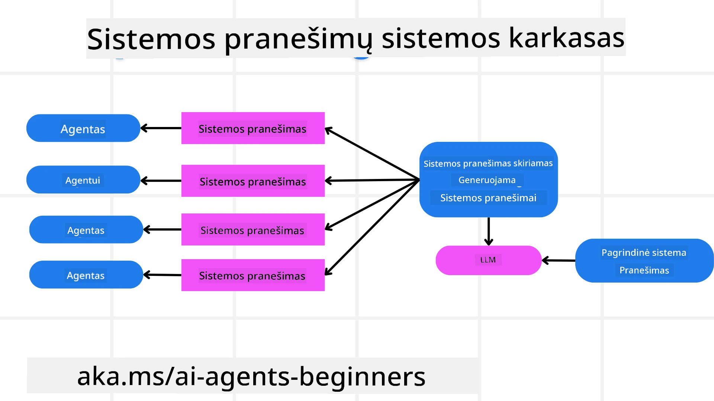
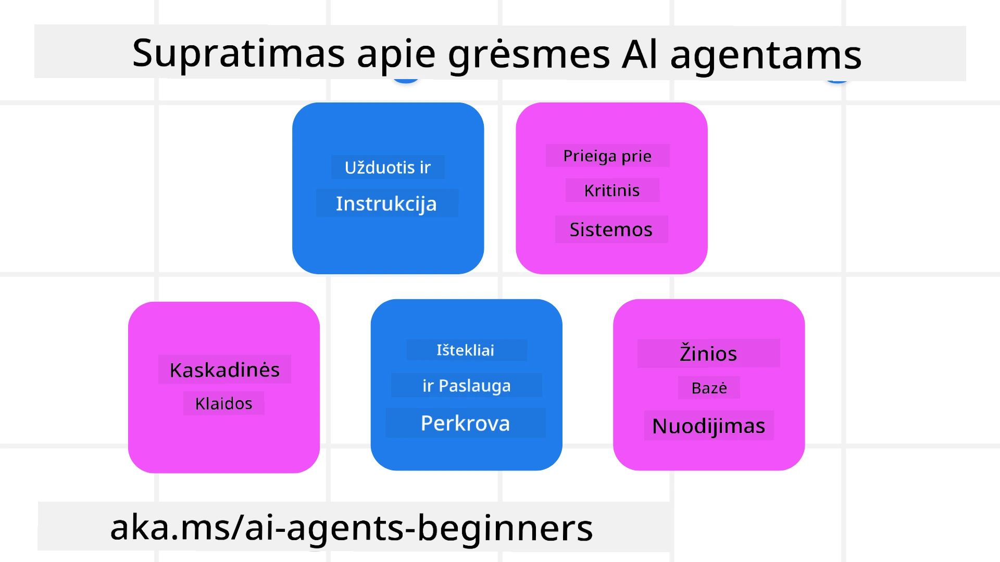
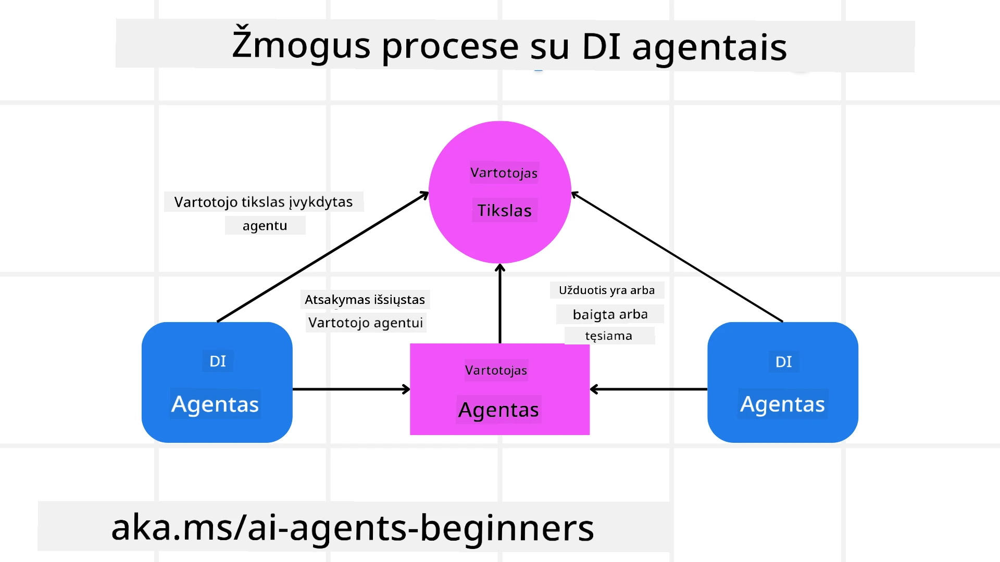

[](https://youtu.be/iZKkMEGBCUQ?si=Q-kEbcyHUMPoHp8L)

> _(Paspauskite paveikslėlį aukščiau, kad peržiūrėtumėte šios pamokos vaizdo įrašą)_

# Patikimų AI agentų kūrimas

## Įvadas

Šioje pamokoje apžvelgsime:

- Kaip sukurti ir diegti saugius bei veiksmingus AI agentus
- Svarbias saugumo aspektus kuriant AI agentus.
- Kaip užtikrinti duomenų ir vartotojų privatumo apsaugą kuriant AI agentus.

## Mokymosi tikslai

Baigę šią pamoką, žinosite kaip:

- Nustatyti ir sumažinti rizikas, kuriant AI agentus.
- Įgyvendinti saugumo priemones, kad duomenys ir prieiga būtų tinkamai valdomi.
- Kurti AI agentus, kurie užtikrina duomenų privatumą ir gerina vartotojo patirtį.

## Saugumas

Pirmiausia pažiūrėkime, kaip sukurti saugias agentines programas. Saugumas reiškia, kad AI agentas veikia pagal numatytą paskirtį. Kaip agentinių programų kūrėjai, turime metodus ir įrankius maksimaliam saugumui užtikrinti:

### Sisteminių žinučių karkaso kūrimas

Jei kada nors kūrėte AI programą naudojant didelius kalbos modelius (LLM), žinote, kaip svarbu sukurti tvirtą sisteminį užklausimą arba sisteminę žinutę. Šie užklausimai nustato metarules, nurodymus ir gaires, kaip LLM bendradarbiaus su vartotoju ir duomenimis.

AI agentams sisteminis užklausa yra dar svarbesnė, nes AI agentams reikės labai specifinių nurodymų, kad atliktų mums skirtas užduotis.

Norėdami sukurti mastelio sisteminius užklausimus, galime naudoti sisteminių žinučių karkasą kuriant vieną ar daugiau agentų mūsų programoje:



#### 1 žingsnis: Sukurkite Meta sisteminę žinutę

Meta užklausa bus naudojama LLM generuoti sistemines žinutes agentams, kuriuos kursime. Mes ją projektuojame kaip šabloną, kad galėtume efektyviai sukurti kelis agentus, jei reikia.

Štai pavyzdys meta sisteminės žinutės, kurią pateiktume LLM:

```plaintext
You are an expert at creating AI agent assistants. 
You will be provided a company name, role, responsibilities and other
information that you will use to provide a system prompt for.
To create the system prompt, be descriptive as possible and provide a structure that a system using an LLM can better understand the role and responsibilities of the AI assistant. 
```

#### 2 žingsnis: Sukurkite pagrindinį užklausimą

Kitas žingsnis – sukurti pagrindinį užklausimą, apibūdinantį AI agentą. Jame turėtų būti nurodyta agentei priskirta rolė, užduotys, kurias agentas atliks, ir kitos agento atsakomybės.

Štai pavyzdys:

```plaintext
You are a travel agent for Contoso Travel that is great at booking flights for customers. To help customers you can perform the following tasks: lookup available flights, book flights, ask for preferences in seating and times for flights, cancel any previously booked flights and alert customers on any delays or cancellations of flights.  
```

#### 3 žingsnis: Pateikite pagrindinę sisteminę žinutę LLM

Dabar galime optimizuoti šią sisteminę žinutę, pateikdami meta sisteminę žinutę kaip sistemos žinutę kartu su pagrindine sistemine žinute.

Tai sukurs geriau sukurtą sisteminę žinutę, skirtą mūsų AI agentų valdymui:

```markdown
**Company Name:** Contoso Travel  
**Role:** Travel Agent Assistant

**Objective:**  
You are an AI-powered travel agent assistant for Contoso Travel, specializing in booking flights and providing exceptional customer service. Your main goal is to assist customers in finding, booking, and managing their flights, all while ensuring that their preferences and needs are met efficiently.

**Key Responsibilities:**

1. **Flight Lookup:**
    
    - Assist customers in searching for available flights based on their specified destination, dates, and any other relevant preferences.
    - Provide a list of options, including flight times, airlines, layovers, and pricing.
2. **Flight Booking:**
    
    - Facilitate the booking of flights for customers, ensuring that all details are correctly entered into the system.
    - Confirm bookings and provide customers with their itinerary, including confirmation numbers and any other pertinent information.
3. **Customer Preference Inquiry:**
    
    - Actively ask customers for their preferences regarding seating (e.g., aisle, window, extra legroom) and preferred times for flights (e.g., morning, afternoon, evening).
    - Record these preferences for future reference and tailor suggestions accordingly.
4. **Flight Cancellation:**
    
    - Assist customers in canceling previously booked flights if needed, following company policies and procedures.
    - Notify customers of any necessary refunds or additional steps that may be required for cancellations.
5. **Flight Monitoring:**
    
    - Monitor the status of booked flights and alert customers in real-time about any delays, cancellations, or changes to their flight schedule.
    - Provide updates through preferred communication channels (e.g., email, SMS) as needed.

**Tone and Style:**

- Maintain a friendly, professional, and approachable demeanor in all interactions with customers.
- Ensure that all communication is clear, informative, and tailored to the customer's specific needs and inquiries.

**User Interaction Instructions:**

- Respond to customer queries promptly and accurately.
- Use a conversational style while ensuring professionalism.
- Prioritize customer satisfaction by being attentive, empathetic, and proactive in all assistance provided.

**Additional Notes:**

- Stay updated on any changes to airline policies, travel restrictions, and other relevant information that could impact flight bookings and customer experience.
- Use clear and concise language to explain options and processes, avoiding jargon where possible for better customer understanding.

This AI assistant is designed to streamline the flight booking process for customers of Contoso Travel, ensuring that all their travel needs are met efficiently and effectively.

```

#### 4 žingsnis: Kartokite ir tobulinkite

Šio sisteminių žinučių karkaso vertė yra ta, kad jis palengvina kelių agentų sisteminių žinučių kūrimą ir leidžia laikui bėgant tobulinti žinutes. Retai pavyks iškart sukurti sisteminę žinutę, tinkančią visam jūsų naudojimo atvejui. Galimybė atlikti nedidelius pakeitimus ir patobulinimus keisdami pagrindinę sisteminę žinutę ir ją paleisdami per sistemą leis palyginti ir įvertinti rezultatus.

## Grėsmių supratimas

Norint sukurti patikimus AI agentus, svarbu suprasti ir sumažinti rizikas bei grėsmes jūsų AI agentui. Pažvelkime į kelias iš skirtingų grėsmių AI agentams ir kaip geriau planuoti bei pasiruošti joms.



### Užduotys ir nurodymai

**Aprašymas:** Užpuolikai bando pakeisti AI agento nurodymus arba tikslus per užklausas ar manipuliuojant įvestimis.

**Mažinimas:** Vykdykite patikros ir įvesties filtrus, kad aptiktumėte potencialiai pavojingas užklausas dar prieš jas apdorojant AI agentui. Kadangi šie išpuoliai dažnai reikalauja dažnos sąveikos su agentu, pokalbio posūkių skaičiaus ribojimas yra dar viena prevencijos priemonė.

### Prieiga prie kritinių sistemų

**Aprašymas:** Jei AI agentas turi prieigą prie sistemų ir paslaugų, kuriose saugomi jautrūs duomenys, užpuolikai gali pažeisti komunikaciją tarp agento ir šių paslaugų. Tai gali būti tiesioginiai išpuoliai arba netiesioginės pastangos gauti informacijos apie šias sistemas per agentą.

**Mažinimas:** AI agentai turėtų turėti prieigą prie sistemų tik pagal poreikį, kad būtų išvengta tokių išpuolių. Bendravimas tarp agento ir sistemos turėtų būti saugus. Įgyvendinant autentifikaciją ir prieigos kontrolę galima dar labiau apsaugoti šią informaciją.

### Ištekliai ir paslaugų perkrova

**Aprašymas:** AI agentai gali naudotis įvairiais įrankiais ir paslaugomis užduotims atlikti. Užpuolikai gali išnaudoti šią galimybę siųsdami daugybę užklausų per AI agentą, kas gali sukelti sistemų gedimus arba dideles išlaidas.

**Mažinimas:** Įgyvendinkite politiką, ribojančią užklausų skaičių, kurį AI agentas gali siųsti paslaugai. Pokalbio posūkių ir užklausų skaičiaus ribojimas taip pat padeda užkirsti kelią tokio tipo atakoms.

### Žinių bazės užteršimas

**Aprašymas:** Šios rūšies ataka nėra nukreipta tiesiogiai į AI agentą, bet į žinių bazę ir kitas paslaugas, kurias AI agentas naudos. Tai gali būti duomenų ar informacijos klastojimas, kuria AI agentas remsis atlikdamas užduotį, todėl gali būti pateikti šališki arba netikslūs atsakymai vartotojui.

**Mažinimas:** Reguliariai tikrinkite duomenis, kuriuos AI agentas naudos savo darbo procesuose. Užtikrinkite, kad prieiga prie šių duomenų būtų saugi ir juos keistų tik patikimi asmenys, kad išvengtumėte tokios atakos.

### Gedimų efektas

**Aprašymas:** AI agentai pasiekia įvairius įrankius ir paslaugas užduotims atlikti. Užpuolikų sukelti klaidos gali paveikti kitas sistemas, prie kurių prijungtas AI agentas, todėl išpuolis išplinta ir jį sunkiau taisyti.

**Mažinimas:** Vienas būdas išvengti to – leisti AI agentui veikti ribotoje aplinkoje, pavyzdžiui, Docker konteineryje, kad būtų užkirstas tiesioginis poveikis sistemai. Taip pat verta sukurti atsarginio veikimo mechanizmus ir pakartojimų logiką, kai tam tikros sistemos grąžina klaidą, kad būtų išvengta didesnių gedimų.

## Žmogiškas įsikišimas

Kita veiksminga priemonė kuriant patikimas AI agentų sistemas yra žmogiškas įsikišimas. Tai sukuria srautą, kuriame vartotojai gali teikti atsiliepimus agentams proceso metu. Vartotojai iš esmės veikia kaip agentai daugiaagentėje sistemoje, patvirtindami ar nutraukdami vykdomą procesą.



Štai kodo fragmentas, naudojantis Microsoft Agent Framework, rodantis, kaip įgyvendinamas šis koncepcijos principas:

```python
import os
from agent_framework.foundry import FoundryChatClient
from azure.identity import AzureCliCredential

# Sukurkite tiekėją su žmogaus patvirtinimu proceso metu
provider = FoundryChatClient(
    project_endpoint=os.environ["AZURE_AI_PROJECT_ENDPOINT"],
    model=os.environ["AZURE_AI_MODEL_DEPLOYMENT_NAME"],
    credential=AzureCliCredential(),
)

# Sukurkite agentą su žmogaus patvirtinimo žingsniu
response = provider.create_response(
    input="Write a 4-line poem about the ocean.",
    instructions="You are a helpful assistant. Ask for user approval before finalizing.",
)

# Vartotojas gali peržiūrėti ir patvirtinti atsakymą
print(response.output_text)
user_input = input("Do you approve? (APPROVE/REJECT): ")
if user_input == "APPROVE":
    print("Response approved.")
else:
    print("Response rejected. Revising...")
```

## Išvados

Patikimų AI agentų kūrimas reikalauja atidžios projektavimo, tvirtų saugumo priemonių ir nuolatinio tobulinimo. Įdiegus struktūrizuotas meta užklausų sistemas, supratus galimas grėsmes ir pritaikius mažinimo strategijas, kūrėjai gali sukurti saugius ir veiksmingus AI agentus. Be to, žmogiško įsikišimo įdiegimas užtikrina, kad AI agentai išliktų suderinti su vartotojų poreikiais, sumažinant rizikas. Kadangi AI toliau vystosi, aktyvus požiūris į saugumą, privatumo ir etikos klausimus bus pagrindas pasitikėjimui ir patikimumui AI pagrinduose sistemose ugdyti.

## Kodo pavyzdžiai

- [`code_samples/06-system-message-framework.ipynb`](code_samples/06-system-message-framework.ipynb): Žingsnis po žingsnio demonstracija apie meta-užklausų sisteminių žinučių karkasą.
- [`code_samples/06-human-in-the-loop.ipynb`](code_samples/06-human-in-the-loop.ipynb): Patvirtinimo vartai prieš veiksmą, rizikų sluoksniavimas ir audito žurnalų saugojimas patikimiems agentams.

### Turite daugiau klausimų apie patikimų AI agentų kūrimą?

Prisijunkite prie [Microsoft Foundry Discord](https://discord.com/invite/ATgtXmAS5D), kad susitiktumėte su kitais besimokančiais, dalyvautumėte konsultacijose ir gautumėte atsakymus į savo AI agentų klausimus.

## Papildomi ištekliai

- <a href="https://learn.microsoft.com/azure/ai-studio/responsible-use-of-ai-overview" target="_blank">Atsakingo AI naudojimo apžvalga</a>
- <a href="https://learn.microsoft.com/azure/ai-studio/concepts/evaluation-approach-gen-ai" target="_blank">Generatyvinių AI modelių ir AI programų vertinimas</a>
- <a href="https://learn.microsoft.com/azure/ai-services/openai/concepts/system-message?context=%2Fazure%2Fai-studio%2Fcontext%2Fcontext&tabs=top-techniques" target="_blank">Saugumo sisteminės žinutės</a>
- <a href="https://blogs.microsoft.com/wp-content/uploads/prod/sites/5/2022/06/Microsoft-RAI-Impact-Assessment-Template.pdf?culture=en-us&country=us" target="_blank">Rizikos vertinimo šablonas</a>

## Ankstesnė pamoka

[Agentinis RAG](../05-agentic-rag/README.md)

## Kita pamoka

[Planavimo dizaino šablonas](../07-planning-design/README.md)

---

<!-- CO-OP TRANSLATOR DISCLAIMER START -->
**Atsakomybės apribojimas**:
Šis dokumentas buvo išverstas naudojant dirbtinio intelekto vertimo paslaugą [Co-op Translator](https://github.com/Azure/co-op-translator). Nors siekiame tikslumo, prašome atkreipti dėmesį, kad automatiniai vertimai gali turėti klaidų ar netikslumų. Originalus dokumentas jo gimtąja kalba laikomas autoritetingu šaltiniu. Svarbiai informacijai rekomenduojama naudoti profesionalų žmogiškąjį vertimą. Mes neatsakome už jokius nesusipratimus ar neteisingą interpretaciją, kilusią naudojantis šiuo vertimu.
<!-- CO-OP TRANSLATOR DISCLAIMER END -->