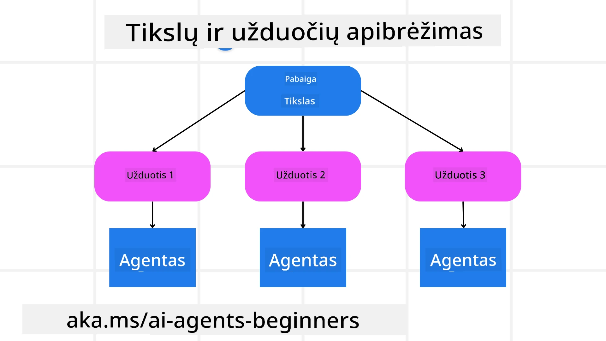

[](https://youtu.be/kPfJ2BrBCMY?si=9pYpPXp0sSbK91Dr)

> _(Spustelėkite aukščiau esantį paveikslėlį norėdami peržiūrėti šios pamokos vaizdo įrašą)_

# Planavimo dizainas

## Įvadas

Šioje pamokoje bus aptariama

* Aiškaus bendro tikslo apibrėžimas ir sudėtingos užduoties suskaidymas į valdomas užduotis.
* Struktūrizuoto išvesties panaudojimas patikimesniems ir mašinai skaitomiems atsakymams.
* Įvykiais pagrįsto požiūrio taikymas dinaminėms užduotims ir netikėtiems įvestims valdyti.

## Mokymosi tikslai

Baigę šią pamoką, suprasite:

* Nustatyti ir apibrėžti bendrą AI agento tikslą, užtikrinant, kad jis aiškiai žinotų, ką reikia pasiekti.
* Suskaidyti sudėtingą užduotį į valdomas pogrupius ir suorganizuoti juos į logišką seką.
* Aprūpinti agentus tinkamais įrankiais (pvz., paieškos ar duomenų analizės įrankiais), nuspręsti kada ir kaip juos naudoti, ir valdyti netikėtas situacijas.
* Įvertinti pogrupių rezultatus, matuoti našumą ir kartoti veiksmus siekiant pagerinti galutinį rezultatą.

## Bendro tikslo apibrėžimas ir užduoties suskaidymas



Dauguma realių užduočių yra per sudėtingos spręsti vienu žingsniu. AI agentui reikalingas aiškus tikslas, kuris vadovautų planavimui ir veiksmams. Pavyzdžiui, tikslas:

    "Sukurti 3 dienų kelionės maršrutą."

Nors jis yra paprastas, reikia jį patikslinti. Kuo aiškesnis tikslas, tuo geriau agentas (ir visi žmonių bendraautoriai) gali sutelkti dėmesį į teisingo rezultato pasiekimą, pvz., parengti išsamų maršrutą su skrydžių parinktimis, viešbučių rekomendacijomis ir veiklų pasiūlymais.

### Užduoties suskaidymas

Didelės ar sudėtingos užduotys tampa valdomesnės, kai jos suskaidomos į mažesnes, tikslingas pogrupes.
Kelionės maršruto pavyzdyje tikslą galima suskaidyti į:

* Skrydžių užsakymas
* Viešbučių užsakymas
* Automobilio nuoma
* Personalizavimas

Kiekviena pogrupo užduotis gali būti atliekama paskirtų agentų ar procesų. Vienas agentas gali specializuotis geriausių skrydžių paieškoje, kitas – viešbučių užsakyme ir t.t. Koordinuojantis arba „tolimesnis“ agentas gali sujungti šiuos rezultatus į vieną nuoseklų kelių planą galutiniam naudotojui.

Šis modulinis požiūris taip pat leidžia palaipsniui tobulinti sistemą. Pavyzdžiui, galima pridėti specializuotus agentus maisto rekomendacijoms ar vietos veiklų pasiūlymams ir laikui bėgant tobulinti maršrutą.

### Struktūrizuota išvestis

Dideli kalbos modeliai (LLM) gali generuoti struktūrizuotą išvestį (pvz., JSON), kurią lengviau apdoroti tolimesniems agentams ar paslaugoms. Tai ypač naudinga daugiaagentinėje aplinkoje, kai užduotys vykdomos gavus planavimo rezultatus.

Šiame Python pavyzdyje parodyta, kaip paprastas planavimo agentas suskaido tikslą į pogrupes ir sukuria struktūrizuotą planą:

```python
from pydantic import BaseModel
from enum import Enum
from typing import List, Optional, Union
import json
import os
from typing import Optional
from pprint import pprint
from agent_framework.azure import AzureAIProjectAgentProvider
from azure.identity import AzureCliCredential

class AgentEnum(str, Enum):
    FlightBooking = "flight_booking"
    HotelBooking = "hotel_booking"
    CarRental = "car_rental"
    ActivitiesBooking = "activities_booking"
    DestinationInfo = "destination_info"
    DefaultAgent = "default_agent"
    GroupChatManager = "group_chat_manager"

# Kelionės PoUžduoties Modelis
class TravelSubTask(BaseModel):
    task_details: str
    assigned_agent: AgentEnum  # norime priskirti užduotį agentui

class TravelPlan(BaseModel):
    main_task: str
    subtasks: List[TravelSubTask]
    is_greeting: bool

provider = AzureAIProjectAgentProvider(credential=AzureCliCredential())

# Apibrėžti vartotojo žinutę
system_prompt = """You are a planner agent.
    Your job is to decide which agents to run based on the user's request.
    Provide your response in JSON format with the following structure:
{'main_task': 'Plan a family trip from Singapore to Melbourne.',
 'subtasks': [{'assigned_agent': 'flight_booking',
               'task_details': 'Book round-trip flights from Singapore to '
                               'Melbourne.'}
    Below are the available agents specialised in different tasks:
    - FlightBooking: For booking flights and providing flight information
    - HotelBooking: For booking hotels and providing hotel information
    - CarRental: For booking cars and providing car rental information
    - ActivitiesBooking: For booking activities and providing activity information
    - DestinationInfo: For providing information about destinations
    - DefaultAgent: For handling general requests"""

user_message = "Create a travel plan for a family of 2 kids from Singapore to Melbourne"

response = client.create_response(input=user_message, instructions=system_prompt)

response_content = response.output_text
pprint(json.loads(response_content))
```

### Planavimo agentas su daugiaagentine orchestracija

Šiame pavyzdyje Semantinis maršrutizatorius (Semantic Router Agent) gauna vartotojo užklausą (pvz., „Man reikia viešbučio plano mano kelionei“).

Planavimo agentas:

* Gauta viešbučio planas: agentas analizuoja vartotojo žinutę ir pagal sistemos užklausą (kuri apima galimų agentų informaciją) generuoja struktūrizuotą kelionės planą.
* Agentų ir jų įrankių sąrašo sudarymas: agentų registras saugo agentų sąrašą (pvz., skrydžių, viešbučių, automobilių nuomos ir veiklų) kartu su jų funkcijomis ar įrankiais.
* Plano nukreipimas atitinkamiems agentams: priklausomai nuo pogrupių skaičiaus, planuotojas arba tiesiogiai siunčia žinutę paskirtam agentui (vienos užduoties atveju), arba koordinuoja per grupinio pokalbio valdytoją daugiaagentinei sąveikai.
* Rezultato apibendrinimas: galiausiai planuotojas apibendrina sukurtą planą aiškumui.
Šis Python kodo pavyzdys iliustruoja šiuos žingsnius:

```python

from pydantic import BaseModel

from enum import Enum
from typing import List, Optional, Union

class AgentEnum(str, Enum):
    FlightBooking = "flight_booking"
    HotelBooking = "hotel_booking"
    CarRental = "car_rental"
    ActivitiesBooking = "activities_booking"
    DestinationInfo = "destination_info"
    DefaultAgent = "default_agent"
    GroupChatManager = "group_chat_manager"

# Kelionės užduoties modelis

class TravelSubTask(BaseModel):
    task_details: str
    assigned_agent: AgentEnum # norime priskirti užduotį agentui

class TravelPlan(BaseModel):
    main_task: str
    subtasks: List[TravelSubTask]
    is_greeting: bool
import json
import os
from typing import Optional

from agent_framework.azure import AzureAIProjectAgentProvider
from azure.identity import AzureCliCredential

# Sukurkite klientą

provider = AzureAIProjectAgentProvider(credential=AzureCliCredential())

from pprint import pprint

# Apibrėžkite vartotojo pranešimą

system_prompt = """You are a planner agent.
    Your job is to decide which agents to run based on the user's request.
    Below are the available agents specialized in different tasks:
    - FlightBooking: For booking flights and providing flight information
    - HotelBooking: For booking hotels and providing hotel information
    - CarRental: For booking cars and providing car rental information
    - ActivitiesBooking: For booking activities and providing activity information
    - DestinationInfo: For providing information about destinations
    - DefaultAgent: For handling general requests"""

user_message = "Create a travel plan for a family of 2 kids from Singapore to Melbourne"

response = client.create_response(input=user_message, instructions=system_prompt)

response_content = response.output_text

# Išspausdinkite atsakymo turinį po jo įkėlimo kaip JSON

pprint(json.loads(response_content))
```

Toliau pateikiama ankstesnio kodo rezultatas. Galite naudoti šią struktūrizuotą išvestį, kad nukreiptumėte ją į `assigned_agent` ir apibendrintumėte kelionės planą galutiniam naudotojui.

```json
{
    "is_greeting": "False",
    "main_task": "Plan a family trip from Singapore to Melbourne.",
    "subtasks": [
        {
            "assigned_agent": "flight_booking",
            "task_details": "Book round-trip flights from Singapore to Melbourne."
        },
        {
            "assigned_agent": "hotel_booking",
            "task_details": "Find family-friendly hotels in Melbourne."
        },
        {
            "assigned_agent": "car_rental",
            "task_details": "Arrange a car rental suitable for a family of four in Melbourne."
        },
        {
            "assigned_agent": "activities_booking",
            "task_details": "List family-friendly activities in Melbourne."
        },
        {
            "assigned_agent": "destination_info",
            "task_details": "Provide information about Melbourne as a travel destination."
        }
    ]
}
```

Pavyzdinę užrašų knygelę su ankstesniu kodo pavyzdžiu žiūrėkite [čia](07-python-agent-framework.ipynb).

### Iteratyvus planavimas

Kai kurios užduotys reikalauja atgalinio ryšio arba planų koregavimo, kai vienos pogrupio rezultatas įtakoja kitą. Pavyzdžiui, jei agentas aptinka netikėtą duomenų formatą užsakant skrydžius, jam gali prireikti pakeisti strategiją prieš pereinant prie viešbučių užsakymo.

Taip pat vartotojo atsiliepimai (pvz. žmogus nusprendžia, kad nori ankstesnį skrydį) gali inicijuoti dalinį plano pakeitimą. Šis dinamiškas, iteratyvus požiūris užtikrina, kad galutinis sprendimas atitiktų realius apribojimus ir besikeičiančius vartotojo pageidavimus.

pvz., kodo pavyzdys

```python
from agent_framework.azure import AzureAIProjectAgentProvider
from azure.identity import AzureCliCredential
#.. tas pats kaip ankstesniame kode ir perduoti naudotojo istoriją, dabartinį planą

system_prompt = """You are a planner agent to optimize the
    Your job is to decide which agents to run based on the user's request.
    Below are the available agents specialized in different tasks:
    - FlightBooking: For booking flights and providing flight information
    - HotelBooking: For booking hotels and providing hotel information
    - CarRental: For booking cars and providing car rental information
    - ActivitiesBooking: For booking activities and providing activity information
    - DestinationInfo: For providing information about destinations
    - DefaultAgent: For handling general requests"""

user_message = "Create a travel plan for a family of 2 kids from Singapore to Melbourne"

response = client.create_response(
    input=user_message,
    instructions=system_prompt,
    context=f"Previous travel plan - {TravelPlan}",
)
# .. pertvarkyti planą ir siųsti užduotis atitinkamiems agentams
```

Daugiau apie išsamų planavimą sužinokite Magnetic One <a href="https://www.microsoft.com/research/articles/magentic-one-a-generalist-multi-agent-system-for-solving-complex-tasks" target="_blank">blogo įraše</a>, skirtame sudėtingų užduočių sprendimui.

## Santrauka

Šiame straipsnyje aptarėme pavyzdį, kaip sukurti planuotoją, kuris dinamiškai parenka apibrėžtus agentus. Planavimo rezultatas suskaido užduotis ir paskiria agentus jų vykdymui. Manoma, kad agentai turi prieigą prie funkcijų/įrankių, reikalingų užduočiai atlikti. Be agentų, galite įtraukti ir kitus modelius, tokius kaip refleksija, santraukų rengėjas ir pasikeitimo pokalbis, kad dar labiau pritaikytumėte sistemą.

## Papildomi ištekliai

Magentic One - universali daugiaagentė sistema sudėtingoms užduotims spręsti, kuri pasiekė įspūdingų rezultatų keliuose sudėtinguose agentų testuose. Nuoroda: <a href="https://www.microsoft.com/research/articles/magentic-one-a-generalist-multi-agent-system-for-solving-complex-tasks" target="_blank">Magentic One</a>. Šioje įgyvendinime orchestratorius kuria uždučiai specifinius planus ir deleguoja juos prieinamiesiems agentams. Be planavimo, orchestratorius taip pat naudoja stebėjimo mechanizmą užduoties pažangai sekti ir prireikus koreguoja planus.

### Turite daugiau klausimų apie planavimo dizaino modelį?

Prisijunkite prie [Microsoft Foundry Discord](https://aka.ms/ai-agents/discord), susitikite su kitais mokiniais, lankykitės aptarimo valandose ir gaukite atsakymus į savo AI agentų klausimus.

## Ankstesnė pamoka

[Patikimų AI agentų kūrimas](../06-building-trustworthy-agents/README.md)

## Kitoji pamoka

[Daugiaagentinis dizaino modelis](../08-multi-agent/README.md)

---

<!-- CO-OP TRANSLATOR DISCLAIMER START -->
**Atsakomybės apribojimas**:
Šis dokumentas buvo išverstas naudojant dirbtinio intelekto vertimo paslaugą [Co-op Translator](https://github.com/Azure/co-op-translator). Nors stengiamės užtikrinti tikslumą, atkreipkite dėmesį, kad automatiniai vertimai gali turėti klaidų ar netikslumų. Originalus dokumentas jo gimtąja kalba turi būti laikomas autoritetingu šaltiniu. Svarbios informacijos atveju rekomenduojamas profesionalus žmogaus atliktas vertimas. Mes neatsakome už jokius nesusipratimus ar klaidingą interpretavimą, kylančius dėl šio vertimo naudojimo.
<!-- CO-OP TRANSLATOR DISCLAIMER END -->