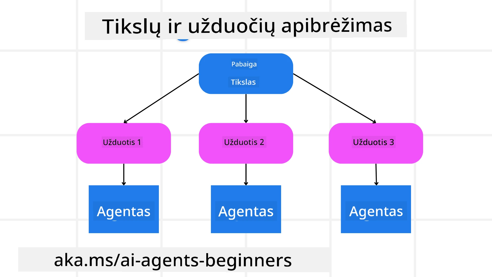

[](https://youtu.be/kPfJ2BrBCMY?si=9pYpPXp0sSbK91Dr)

> _(Spustelėkite aukščiau esantį paveikslėlį, kad peržiūrėtumėte šios pamokos vaizdo įrašą)_

# Plano dizainas

## Įvadas

Ši pamoka apims

* Aiškios bendros tikslinės apibrėžimą ir sudėtingos užduoties suskaidymą į valdomas užduotis.
* Struktūruoto išvesties panaudojimą patikimesniems ir mašinai suprantamiems atsakymams.
* Įvykių valdomo požiūrio taikymą dinamiškoms užduotims ir netikėtiems įvestims valdyti.

## Mokymosi tikslai

Baigę šią pamoką, suprasite:

* Nustatyti ir apibrėžti bendrą tikslą AI agentui, užtikrinant, kad jis aiškiai žinotų, ką reikia pasiekti.
* Sudėtingą užduotį suskaidyti į valdomas pogrupes ir juos organizuoti logine tvarka.
* Aprūpinti agentus tinkamais įrankiais (pvz., paieškos ar duomenų analizės įrankiais), nuspręsti, kada ir kaip juos naudoti, bei tvarkyti netikėtas situacijas.
* Vertinti pogrupių rezultatus, matuoti našumą ir pakartotinai tobulinti veiksmus, kad pagerėtų galutinis rezultatas.

## Bendro tikslo apibrėžimas ir užduoties suskaidymas



Dauguma realaus pasaulio užduočių yra per sudėtingos spręsti vienu žingsniu. AI agentui reikia glausto tikslo, kuris nukreiptų jo planavimą ir veiksmus. Pavyzdžiui, apsvarstykite tikslą:

    "Sukurti 3 dienų kelionės maršrutą."

Nors tai paprasta pareikšti, tikslas vis dar reikalauja patikslinimo. Kuo aiškesnis tikslas, tuo geriau agentas (ir bet kokie žmonių bendradarbiai) gali susitelkti į tinkamo rezultato pasiekimą, pavyzdžiui, sudaryti išsamų maršrutą su skrydžių pasirinkimais, viešbučių rekomendacijomis ir veiklų pasiūlymais.

### Užduočių skaidymas

Didelės arba sudėtingos užduotys tampa valdomesnės, kai jos suskaidomos į mažesnes, tikslui orientuotas pogrupes.
Kelionės maršruto pavyzdyje galėtumėte suskaidyti tikslą į:

* Skrydžių rezervavimas
* Viešbučių rezervavimas
* Automobilio nuoma
* Personalizavimas

Kiekviena po užduotis gali būti vykdoma specializuotų agentų ar procesų. Vienas agentas gali specializuotis geriausių skrydžių paieškoje, kitas - viešbučių rezervavime, ir t. t. Koordinuojantis arba „žemyn srauto“ agentas tada sujungia šiuos rezultatus į vieną vientisą maršrutą galutiniam vartotojui.

Šis modulinis požiūris taip pat leidžia papildomus patobulinimus. Pavyzdžiui, galite pridėti specializuotus agentus maisto rekomendacijoms ar vietos veiklų pasiūlymams ir laikui bėgant tobulinti maršrutą.

### Struktūruota išvestis

Dideli kalbos modeliai (LLM) gali generuoti struktūruotą išvestį (pvz., JSON), kurią lengviau apdoroti kitiems agentams ar paslaugoms. Tai ypač naudinga daugiagentinėje aplinkoje, kur galime vykdyti užduotis gavus planavimo išvestį.

Žemiau pateiktas Python fragmentas demonstruoja paprastą planavimo agentą, kuris suskaido tikslą į pogrupes ir generuoja struktūruotą planą:

```python
from pydantic import BaseModel
from enum import Enum
from typing import List, Optional, Union
import json
import os
from typing import Optional
from pprint import pprint
from agent_framework.foundry import FoundryChatClient
from azure.identity import AzureCliCredential

class AgentEnum(str, Enum):
    FlightBooking = "flight_booking"
    HotelBooking = "hotel_booking"
    CarRental = "car_rental"
    ActivitiesBooking = "activities_booking"
    DestinationInfo = "destination_info"
    DefaultAgent = "default_agent"
    GroupChatManager = "group_chat_manager"

# Kelionės použduoties modelis
class TravelSubTask(BaseModel):
    task_details: str
    assigned_agent: AgentEnum  # norime priskirti užduotį agentui

class TravelPlan(BaseModel):
    main_task: str
    subtasks: List[TravelSubTask]
    is_greeting: bool

provider = FoundryChatClient(
    project_endpoint=os.environ["AZURE_AI_PROJECT_ENDPOINT"],
    model=os.environ["AZURE_AI_MODEL_DEPLOYMENT_NAME"],
    credential=AzureCliCredential(),
)

# Apibrėžkite vartotojo žinutę
system_prompt = """You are a planner agent.
    Your job is to decide which agents to run based on the user's request.
    Provide your response in JSON format with the following structure:
{'main_task': 'Plan a family trip from Singapore to Melbourne.',
 'subtasks': [{'assigned_agent': 'flight_booking',
               'task_details': 'Book round-trip flights from Singapore to '
                               'Melbourne.'}
    Below are the available agents specialised in different tasks:
    - FlightBooking: For booking flights and providing flight information
    - HotelBooking: For booking hotels and providing hotel information
    - CarRental: For booking cars and providing car rental information
    - ActivitiesBooking: For booking activities and providing activity information
    - DestinationInfo: For providing information about destinations
    - DefaultAgent: For handling general requests"""

user_message = "Create a travel plan for a family of 2 kids from Singapore to Melbourne"

response = client.create_response(input=user_message, instructions=system_prompt)

response_content = response.output_text
pprint(json.loads(response_content))
```

### Planavimo agentas su daugiagentine orkestracija

Šiame pavyzdyje Semantinis maršrutizavimo agentas gauna vartotojo užklausą (pvz., "Man reikia viešbučio plano mano kelionei.").

Planavimo agentas tada:

* Gautas viešbučių planas: planavimo agentas paima vartotojo žinutę ir, remdamasis sistemos nurodymu (įskaitant prieinamų agentų aprašymus), sukuria struktūruotą kelionės planą.
* Išvardina agentus ir jų įrankius: agentų registras laiko agentų sąrašą (pvz., skrydžiui, viešbučiams, automobilių nuomai ir veikloms) kartu su funkcijomis ar įrankiais, kuriuos jie siūlo.
* Maršrutizuoja planą atitinkamiems agentams: priklausomai nuo pogrupių skaičiaus, planuotojas arba tiesiogiai siunčia žinutę specializuotam agentui (vieno užduoties scenarijui), arba koordinuoja per grupės pokalbių vadybininką daugiagentinei bendradarbiavimo situacijai.
* Apibendrina rezultatą: galiausiai planuotojas apibendrina sugeneruotą planą, kad būtų aiškiau.
Žemiau esantis Python kodo pavyzdys iliustruoja šiuos veiksmus:

```python

from pydantic import BaseModel

from enum import Enum
from typing import List, Optional, Union

class AgentEnum(str, Enum):
    FlightBooking = "flight_booking"
    HotelBooking = "hotel_booking"
    CarRental = "car_rental"
    ActivitiesBooking = "activities_booking"
    DestinationInfo = "destination_info"
    DefaultAgent = "default_agent"
    GroupChatManager = "group_chat_manager"

# Kelionės použduoties modelis

class TravelSubTask(BaseModel):
    task_details: str
    assigned_agent: AgentEnum # norime priskirti užduotį agentui

class TravelPlan(BaseModel):
    main_task: str
    subtasks: List[TravelSubTask]
    is_greeting: bool
import json
import os
from typing import Optional

from agent_framework.foundry import FoundryChatClient
from azure.identity import AzureCliCredential

# Sukurti klientą

provider = FoundryChatClient(
    project_endpoint=os.environ["AZURE_AI_PROJECT_ENDPOINT"],
    model=os.environ["AZURE_AI_MODEL_DEPLOYMENT_NAME"],
    credential=AzureCliCredential(),
)

from pprint import pprint

# Apibrėžti vartotojo pranešimą

system_prompt = """You are a planner agent.
    Your job is to decide which agents to run based on the user's request.
    Below are the available agents specialized in different tasks:
    - FlightBooking: For booking flights and providing flight information
    - HotelBooking: For booking hotels and providing hotel information
    - CarRental: For booking cars and providing car rental information
    - ActivitiesBooking: For booking activities and providing activity information
    - DestinationInfo: For providing information about destinations
    - DefaultAgent: For handling general requests"""

user_message = "Create a travel plan for a family of 2 kids from Singapore to Melbourne"

response = client.create_response(input=user_message, instructions=system_prompt)

response_content = response.output_text

# Išspausdinti atsakymo turinį po to, kai jis įkeliamas kaip JSON

pprint(json.loads(response_content))
```

Toliau pateikiama ankstesnio kodo išvestis, kurią galite naudoti struktūruotai informacijai maršrutuoti `assigned_agent` ir apibendrinti kelionės planą galutiniam vartotojui.

```json
{
    "is_greeting": "False",
    "main_task": "Plan a family trip from Singapore to Melbourne.",
    "subtasks": [
        {
            "assigned_agent": "flight_booking",
            "task_details": "Book round-trip flights from Singapore to Melbourne."
        },
        {
            "assigned_agent": "hotel_booking",
            "task_details": "Find family-friendly hotels in Melbourne."
        },
        {
            "assigned_agent": "car_rental",
            "task_details": "Arrange a car rental suitable for a family of four in Melbourne."
        },
        {
            "assigned_agent": "activities_booking",
            "task_details": "List family-friendly activities in Melbourne."
        },
        {
            "assigned_agent": "destination_info",
            "task_details": "Provide information about Melbourne as a travel destination."
        }
    ]
}
```

Pavyzdinė užrašų knygelė su ankstesniu kodo pavyzdžiu yra prieinama [čia](./code_samples/07-python-agent-framework.ipynb).

### Iteracinis planavimas

Kai kurios užduotys reikalauja grįžtamųjų ryšių ar pertvarkymo, kai vienos pogrupio rezultatas įtakoja kitą. Pavyzdžiui, jei agentas nustato netikėtą duomenų formatą skrydžių rezervavimo metu, jis gali turėti pritaikyti savo strategiją prieš pereinant prie viešbučių rezervavimo.

Be to, vartotojo atsiliepimai (pvz., kai žmogus pasirenka ankstesnį skrydį) gali inicijuoti dalinį pertvarkymą. Šis dinamiškas, iteracinis požiūris užtikrina, kad galutinis sprendimas atitiktų realaus pasaulio apribojimus ir kintančius vartotojo pageidavimus.

pvz. kodo pavyzdys

```python
import os
from agent_framework.foundry import FoundryChatClient
from azure.identity import AzureCliCredential
#.. tas pats kaip ankstesniame kode ir perduok vartotojo istoriją, dabartinį planą

system_prompt = """You are a planner agent to optimize the
    Your job is to decide which agents to run based on the user's request.
    Below are the available agents specialized in different tasks:
    - FlightBooking: For booking flights and providing flight information
    - HotelBooking: For booking hotels and providing hotel information
    - CarRental: For booking cars and providing car rental information
    - ActivitiesBooking: For booking activities and providing activity information
    - DestinationInfo: For providing information about destinations
    - DefaultAgent: For handling general requests"""

user_message = "Create a travel plan for a family of 2 kids from Singapore to Melbourne"

response = client.create_response(
    input=user_message,
    instructions=system_prompt,
    context=f"Previous travel plan - {TravelPlan}",
)
# .. perdaryk planą ir išsiųsk užduotis atitinkamiems agentams
```

Daugiau išsamiam planavimui peržiūrėkite Magnetic One <a href="https://www.microsoft.com/research/articles/magentic-one-a-generalist-multi-agent-system-for-solving-complex-tasks" target="_blank">Blogpost</a>, skirtą sudėtingų užduočių sprendimui.

## Santrauka

Šiame straipsnyje apžvelgėme pavyzdį, kaip galime sukurti planuotoją, kuris dinamiškai pasirenka aprašytus prieinamus agentus. Planavimo išvestis suskaido užduotis ir priskiria agentus joms įvykdyti. Daroma prielaida, kad agentai turi prieigą prie funkcijų/įrankių, reikalingų užduočiai atlikti. Be agentų, galite įtraukti kitas schemas, tokias kaip refleksija, apibendrinimas ir „round robin“ pokalbių sistema, kad dar labiau pritaikytumėte.

## Papildomi ištekliai

Magnetic One - daugiaagentinė sistema sudėtingoms užduotims spręsti, pasiekusi įspūdingus rezultatus keliuose sudėtinguose agentų testuose. Nuoroda: <a href="https://www.microsoft.com/research/articles/magentic-one-a-generalist-multi-agent-system-for-solving-complex-tasks" target="_blank">Magnetic One</a>. Šioje įgyvendinimo versijoje orkestratorius kuria užduočiai specifinius planus ir deleguoja juos turimiems agentams. Be planavimo, orkestratorius taip pat naudoja sekimo mechanizmą užduoties eigai stebėti bei prireikus planus perkuria.

### Turite daugiau klausimų apie Plano dizaino šabloną?

Prisijunkite prie [Microsoft Foundry Discord](https://discord.com/invite/ATgtXmAS5D), susitikite su kitais besimokančiais, dalyvaukite konsultacijose ir gaukite atsakymus į klausimus apie savo AI agentus.

## Ankstesnė pamoka

[Patikimų AI agentų kūrimas](../06-building-trustworthy-agents/README.md)

## Kitoji pamoka

[Daugiagentinis dizaino šablonas](../08-multi-agent/README.md)

---

<!-- CO-OP TRANSLATOR DISCLAIMER START -->
**Atsakomybės apribojimas**:
Šis dokumentas buvo išverstas naudojant dirbtinio intelekto vertimo paslaugą [Co-op Translator](https://github.com/Azure/co-op-translator). Nors siekiame tikslumo, prašome atkreipti dėmesį, kad automatiniai vertimai gali turėti klaidų ar netikslumų. Originalus dokumentas jo gimtąja kalba laikomas autoritetingu šaltiniu. Svarbiai informacijai rekomenduojama naudoti profesionalų žmogiškąjį vertimą. Mes neatsakome už jokius nesusipratimus ar neteisingą interpretaciją, kilusią naudojantis šiuo vertimu.
<!-- CO-OP TRANSLATOR DISCLAIMER END -->