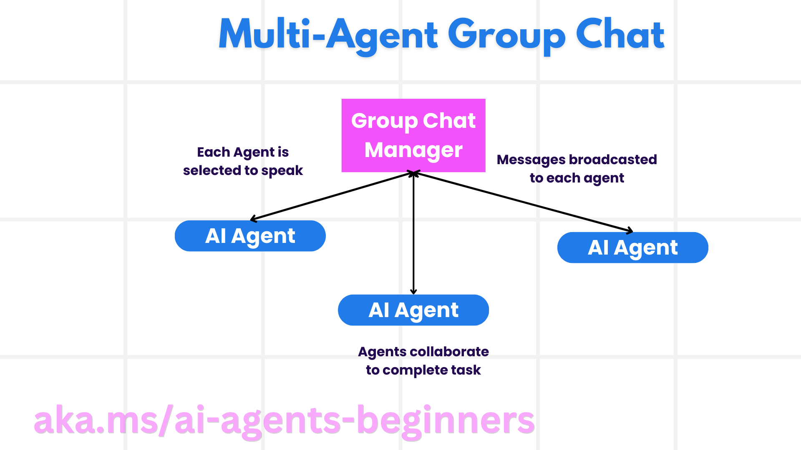
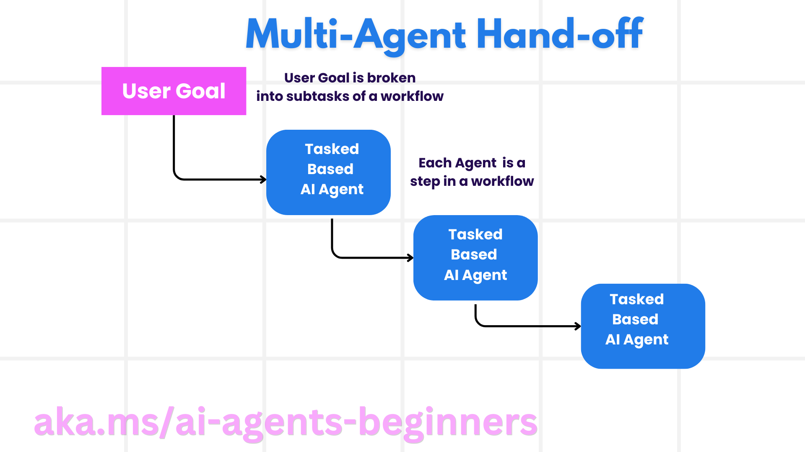
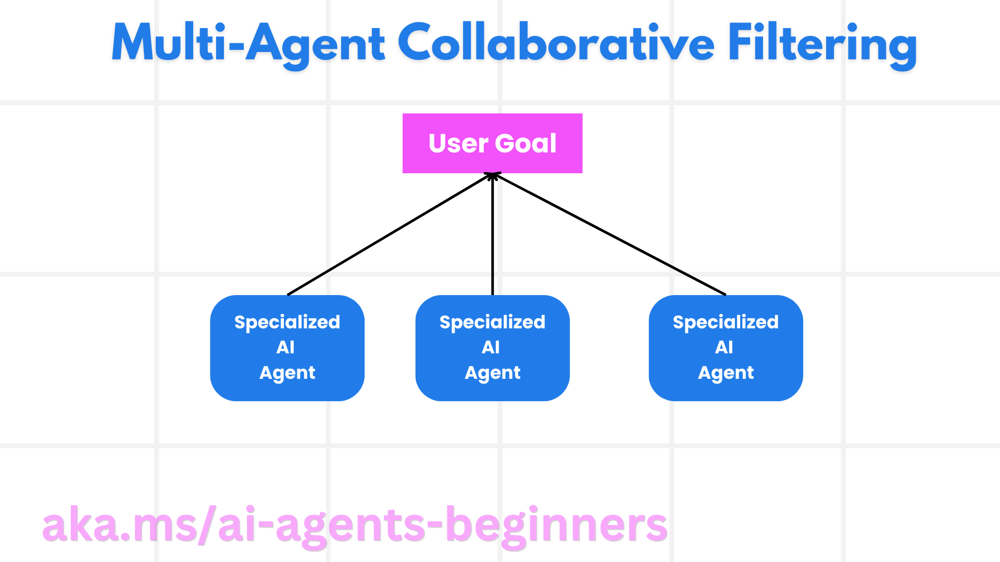

<!--
CO_OP_TRANSLATOR_METADATA:
{
  "original_hash": "1a008c204051cba8d0e253b75f261c41",
  "translation_date": "2025-08-30T10:45:42+00:00",
  "source_file": "08-multi-agent/README.md",
  "language_code": "lt"
}
-->

> _(Spustelėkite paveikslėlį aukščiau, kad peržiūrėtumėte šios pamokos vaizdo įrašą)_

# Daugiaveiksnių sistemų dizaino šablonai

Kai tik pradėsite dirbti su projektu, kuriame dalyvauja keli agentai, turėsite apsvarstyti daugiaveiksnių sistemų dizaino šabloną. Tačiau gali būti ne iš karto aišku, kada pereiti prie daugiaveiksnių sistemų ir kokie yra jų privalumai.

## Įvadas

Šioje pamokoje siekiame atsakyti į šiuos klausimus:

- Kokiose situacijose daugiaveiksnės sistemos yra tinkamos?
- Kokie yra daugiaveiksnių sistemų privalumai, palyginti su vienu agentu, atliekančiu kelias užduotis?
- Kokie yra pagrindiniai daugiaveiksnių sistemų dizaino šablono įgyvendinimo elementai?
- Kaip galime stebėti, kaip keli agentai sąveikauja tarpusavyje?

## Mokymosi tikslai

Po šios pamokos turėtumėte gebėti:

- Atpažinti situacijas, kuriose daugiaveiksnės sistemos yra tinkamos.
- Suprasti daugiaveiksnių sistemų privalumus, palyginti su vienu agentu.
- Suprasti pagrindinius daugiaveiksnių sistemų dizaino šablono įgyvendinimo elementus.

Koks yra platesnis kontekstas?

*Daugiaveiksnės sistemos yra dizaino šablonas, leidžiantis keliems agentams dirbti kartu siekiant bendro tikslo.*

Šis šablonas plačiai naudojamas įvairiose srityse, įskaitant robotiką, autonomines sistemas ir paskirstytąjį skaičiavimą.

## Situacijos, kuriose daugiaveiksnės sistemos yra tinkamos

Taigi, kokios situacijos yra tinkamos daugiaveiksnių sistemų naudojimui? Atsakymas yra tas, kad daugiaveiksnės sistemos yra naudingos daugelyje situacijų, ypač šiais atvejais:

- **Didelės darbo apimtys**: Didelės darbo apimtys gali būti suskirstytos į mažesnes užduotis ir priskirtos skirtingiems agentams, leidžiant vykdyti užduotis lygiagrečiai ir greičiau jas užbaigti. Pavyzdys galėtų būti didelės apimties duomenų apdorojimo užduotis.
- **Sudėtingos užduotys**: Sudėtingos užduotys, kaip ir didelės darbo apimtys, gali būti suskirstytos į mažesnius subtikslus ir priskirtos skirtingiems agentams, kiekvienam specializuojantis tam tikroje užduoties dalyje. Geras pavyzdys galėtų būti autonominiai automobiliai, kur skirtingi agentai valdo navigaciją, kliūčių aptikimą ir komunikaciją su kitais automobiliais.
- **Įvairi ekspertizė**: Skirtingi agentai gali turėti įvairią ekspertizę, leidžiančią jiems efektyviau spręsti skirtingus užduoties aspektus nei vienas agentas. Pavyzdys galėtų būti sveikatos priežiūros srityje, kur agentai valdo diagnostiką, gydymo planus ir pacientų stebėjimą.

## Daugiaveiksnių sistemų privalumai, palyginti su vienu agentu

Vieno agento sistema gali gerai veikti paprastoms užduotims, tačiau sudėtingesnėms užduotims daugiaveiksnės sistemos gali suteikti keletą privalumų:

- **Specializacija**: Kiekvienas agentas gali būti specializuotas tam tikrai užduočiai. Vieno agento sistema, neturinti specializacijos, gali susidurti su sunkumais, kai reikia atlikti sudėtingą užduotį. Pavyzdžiui, agentas gali atlikti užduotį, kuriai jis nėra geriausiai pritaikytas.
- **Skalavimas**: Sistemos skalavimas yra lengvesnis pridedant daugiau agentų, o ne perkraunant vieną agentą.
- **Atsparumas gedimams**: Jei vienas agentas sugenda, kiti gali toliau veikti, užtikrindami sistemos patikimumą.

Pavyzdžiui, tarkime, kad reikia užsakyti kelionę vartotojui. Vieno agento sistema turėtų tvarkyti visus kelionės užsakymo proceso aspektus – nuo skrydžių paieškos iki viešbučių ir automobilių nuomos užsakymo. Norint tai pasiekti su vienu agentu, jis turėtų turėti įrankius visoms šioms užduotims atlikti. Tai galėtų sukurti sudėtingą ir monolitinę sistemą, kurią sunku prižiūrėti ir skalauti. Daugiaveiksnė sistema, kita vertus, galėtų turėti skirtingus agentus, specializuotus skrydžių paieškai, viešbučių užsakymui ir automobilių nuomai. Tai padarytų sistemą moduliarią, lengviau prižiūrimą ir skalaujamą.

Palyginkime tai su kelionių biuru, valdomu kaip šeimos verslas, ir kelionių biuru, valdomu kaip franšizė. Šeimos verslas turėtų vieną agentą, tvarkantį visus kelionės užsakymo proceso aspektus, o franšizė turėtų skirtingus agentus, tvarkančius skirtingus kelionės užsakymo proceso aspektus.

## Daugiaveiksnių sistemų dizaino šablono įgyvendinimo elementai

Prieš įgyvendinant daugiaveiksnių sistemų dizaino šabloną, reikia suprasti pagrindinius elementus, sudarančius šį šabloną.

Grįžkime prie kelionės užsakymo vartotojui pavyzdžio. Šiuo atveju pagrindiniai elementai būtų:

- **Agentų komunikacija**: Agentai, atsakingi už skrydžių paiešką, viešbučių užsakymą ir automobilių nuomą, turi komunikuoti ir dalintis informacija apie vartotojo pageidavimus ir apribojimus. Reikia nuspręsti, kokie bus šios komunikacijos protokolai ir metodai. Pavyzdžiui, skrydžių paieškos agentas turi komunikuoti su viešbučių užsakymo agentu, kad užtikrintų, jog viešbutis būtų užsakytas toms pačioms datoms kaip ir skrydis. Tai reiškia, kad agentai turi dalintis informacija apie vartotojo kelionės datas, o tai reiškia, kad reikia nuspręsti *kurie agentai dalinasi informacija ir kaip jie tai daro*.
- **Koordinavimo mechanizmai**: Agentai turi koordinuoti savo veiksmus, kad užtikrintų, jog vartotojo pageidavimai ir apribojimai būtų įgyvendinti. Pavyzdžiui, vartotojo pageidavimas galėtų būti viešbutis netoli oro uosto, o apribojimas – kad automobilių nuoma būtų prieinama tik oro uoste. Tai reiškia, kad viešbučių užsakymo agentas turi koordinuoti veiksmus su automobilių nuomos agentu, kad užtikrintų vartotojo pageidavimų ir apribojimų įgyvendinimą. Tai reiškia, kad reikia nuspręsti *kaip agentai koordinuoja savo veiksmus*.
- **Agentų architektūra**: Agentai turi turėti vidinę struktūrą, leidžiančią priimti sprendimus ir mokytis iš sąveikos su vartotoju. Pavyzdžiui, skrydžių paieškos agentas turi turėti vidinę struktūrą, leidžiančią priimti sprendimus, kokius skrydžius rekomenduoti vartotojui. Tai reiškia, kad reikia nuspręsti *kaip agentai priima sprendimus ir mokosi iš sąveikos su vartotoju*. Pavyzdžiui, skrydžių paieškos agentas galėtų naudoti mašininio mokymosi modelį, kad rekomenduotų skrydžius vartotojui pagal jo ankstesnius pageidavimus.
- **Matomumas į daugiaveiksnių sistemų sąveiką**: Reikia turėti matomumą, kaip keli agentai sąveikauja tarpusavyje. Tai reiškia, kad reikia turėti įrankius ir technikas agentų veiklos ir sąveikos stebėjimui. Tai galėtų būti žurnalų ir stebėjimo įrankiai, vizualizacijos įrankiai ir našumo metrikos.
- **Daugiaveiksnių sistemų šablonai**: Yra skirtingi šablonai daugiaveiksnių sistemų įgyvendinimui, tokie kaip centralizuotos, decentralizuotos ir hibridinės architektūros. Reikia nuspręsti, kuris šablonas geriausiai tinka jūsų atvejui.
- **Žmogaus įsitraukimas**: Daugeliu atvejų sistemoje dalyvaus žmogus, ir reikia nurodyti agentams, kada prašyti žmogaus įsikišimo. Pavyzdžiui, vartotojas gali paprašyti konkretaus viešbučio ar skrydžio, kurio agentai nerekomendavo, arba prašyti patvirtinimo prieš užsakant skrydį ar viešbutį.

## Matomumas į daugiaveiksnių sistemų sąveiką

Svarbu turėti matomumą, kaip keli agentai sąveikauja tarpusavyje. Šis matomumas yra būtinas derinimui, optimizavimui ir bendram sistemos efektyvumui užtikrinti. Norint tai pasiekti, reikia turėti įrankius ir technikas agentų veiklos ir sąveikos stebėjimui. Tai galėtų būti žurnalų ir stebėjimo įrankiai, vizualizacijos įrankiai ir našumo metrikos.

Pavyzdžiui, kelionės užsakymo vartotojui atveju galėtumėte turėti prietaisų skydelį, kuriame būtų rodomas kiekvieno agento statusas, vartotojo pageidavimai ir apribojimai bei agentų sąveika. Šis prietaisų skydelis galėtų rodyti vartotojo kelionės datas, skrydžius, kuriuos rekomendavo skrydžių agentas, viešbučius, kuriuos rekomendavo viešbučių agentas, ir automobilius, kuriuos rekomendavo automobilių nuomos agentas. Tai suteiktų aiškų vaizdą, kaip agentai sąveikauja tarpusavyje ir ar vartotojo pageidavimai bei apribojimai yra įgyvendinami.

Pažvelkime į kiekvieną iš šių aspektų detaliau.

- **Žurnalų ir stebėjimo įrankiai**: Norite, kad kiekvienas agento veiksmas būtų užregistruotas. Žurnalo įrašas galėtų saugoti informaciją apie agentą, kuris atliko veiksmą, veiksmą, laiką, kada veiksmas buvo atliktas, ir veiksmo rezultatą. Ši informacija gali būti naudojama derinimui, optimizavimui ir kt.
- **Vizualizacijos įrankiai**: Vizualizacijos įrankiai gali padėti matyti agentų sąveiką intuityvesniu būdu. Pavyzdžiui, galėtumėte turėti grafiką, kuris rodo informacijos srautą tarp agentų. Tai galėtų padėti identifikuoti sistemos kliūtis, neefektyvumą ir kitas problemas.
- **Našumo metrikos**: Našumo metrikos gali padėti stebėti daugiaveiksnių sistemų efektyvumą. Pavyzdžiui, galėtumėte stebėti užduoties atlikimo laiką, užduočių skaičių per laiko vienetą ir agentų rekomendacijų tikslumą. Ši informacija gali padėti identifikuoti tobulinimo sritis ir optimizuoti sistemą.

## Daugiaveiksnių sistemų šablonai

Pažvelkime į keletą konkrečių šablonų, kuriuos galime naudoti kuriant daugiaveiksnes programas. Štai keletas įdomių šablonų, kuriuos verta apsvarstyti:

### Grupinis pokalbis

Šis šablonas naudingas, kai norite sukurti grupinio pokalbio programą, kurioje keli agentai gali bendrauti tarpusavyje. Tipiniai šio šablono naudojimo atvejai apima komandinį bendradarbiavimą, klientų aptarnavimą ir socialinius tinklus.

Šiame šablone kiekvienas agentas atstovauja vartotoją grupiniame pokalbyje, o žinutės keičiasi tarp agentų naudojant žinučių protokolą. Agentai gali siųsti žinutes į grupinį pokalbį, gauti žinutes iš grupinio pokalbio ir atsakyti į kitų agentų žinutes.

Šis šablonas gali būti įgyvendintas naudojant centralizuotą architektūrą, kur visos žinutės nukreipiamos per centrinį serverį, arba decentralizuotą architektūrą, kur žinutės keičiasi tiesiogiai.

### Perdavimas

Šis šablonas naudingas, kai norite sukurti programą, kurioje keli agentai gali perduoti užduotis vienas kitam.

Tipiniai šio šablono naudojimo atvejai apima klientų aptarnavimą, užduočių valdymą ir darbo eigos automatizavimą.

Šiame šablone kiekvienas agentas atstovauja užduotį arba darbo eigos žingsnį, o agentai gali perduoti užduotis kitiems agentams pagal iš anksto nustatytas taisykles.

### Bendradarbiavimo filtravimas

Šis šablonas naudingas, kai norite sukurti programą, kurioje keli agentai gali bendradarbiauti, kad pateiktų rekomendacijas vartotojams.

Kodėl norėtumėte, kad keli agentai bendradarbiautų? Todėl, kad kiekvienas agentas gali turėti skirtingą ekspertizę ir prisidėti prie rekomendacijų proceso skirtingais būdais.

Pavyzdžiui, vartotojas nori rekomendacijos dėl geriausios akcijos, kurią pirkti akcijų rinkoje.

- **Pramonės ekspertas**: Vienas agentas galėtų būti pramonės ekspertas.
- **Techninė analizė**: Kitas agentas galėtų būti techninės analizės ekspertas.
- **Fundamentinė analizė**: Dar kitas agentas galėtų būti fundamentinės analizės ekspertas. Bendradarbiaudami šie agentai galėtų pateikti išsamesnę rekomendaciją vartotojui.

## Scenarijus: Grąžinimo procesas

Apsvarstykime scenarijų, kai klientas bando gauti grąžinimą už produktą. Šiame procese gali dalyvauti nemažai agentų, tačiau padalinsime juos į agentus, specifinius šiam procesui, ir bendruosius agentus, kurie gali būti naudojami kituose procesuose.

**Agentai, specifiniai grąžinimo procesui**:

Štai keletas agentų, kurie galėtų dalyvauti grąžinimo procese:

- **Kliento agentas**: Šis agentas atstovauja klientą ir yra atsakingas už grąžinimo proceso inicijavimą.
- **Pardavėjo agentas**: Šis agentas atstovauja pardavėją ir yra atsakingas už grąžinimo apdorojimą.
- **Mokėjimo agentas**: Šis agentas atstovauja mokėjimo procesą ir yra atsakingas už kliento mokėjimo grąžinimą.
- **Sprendimo agentas**: Šis agentas atstovauja sprendimo procesą ir yra atsakingas už bet kokių problemų, kylančių grąžinimo proceso metu, sprendimą.
- **Atitikties agentas**: Šis agentas atstovauja atitikties procesą ir yra atsakingas už tai, kad grąžinimo procesas atitiktų reglamentus ir politiką.

**Bendrieji agentai**:

Šie agentai gali būti naudojami kitose jūsų verslo dalyse.

- **Siuntimo agentas**: Šis agentas atstovauja siuntimo procesą ir yra atsakingas už produkto siuntimą atgal pardavėjui. Šis agentas gali būti naudojamas tiek grąžinimo procese, tiek bendrame
Sukurkite daugiaagentę sistemą klientų aptarnavimo procesui. Nustatykite procese dalyvaujančius agentus, jų vaidmenis ir atsakomybes bei kaip jie sąveikauja tarpusavyje. Apsvarstykite tiek agentus, skirtus konkrečiai klientų aptarnavimo procesui, tiek bendruosius agentus, kuriuos galima naudoti kitose jūsų verslo srityse.

> Pagalvokite prieš skaitydami toliau pateiktą sprendimą, jums gali prireikti daugiau agentų, nei manote.

> PATARIMAS: Pagalvokite apie skirtingus klientų aptarnavimo proceso etapus ir taip pat apsvarstykite agentus, reikalingus bet kuriai sistemai.

## Sprendimas

[Sprendimas](./solution/solution.md)

## Žinių patikrinimas

Klausimas: Kada reikėtų apsvarstyti daugiaagentės sistemos naudojimą?

- [ ] A1: Kai turite mažą darbo krūvį ir paprastą užduotį.
- [ ] A2: Kai turite didelį darbo krūvį.
- [ ] A3: Kai turite paprastą užduotį.

[Sprendimo testas](./solution/solution-quiz.md)

## Santrauka

Šioje pamokoje aptarėme daugiaagentės sistemos dizaino modelį, įskaitant situacijas, kuriose daugiaagentės sistemos yra tinkamos, privalumus, kuriuos daugiaagentės sistemos turi prieš vieną agentą, pagrindinius daugiaagentės sistemos įgyvendinimo elementus ir kaip stebėti, kaip agentai sąveikauja tarpusavyje.

### Turite daugiau klausimų apie daugiaagentės sistemos dizaino modelį?

Prisijunkite prie [Azure AI Foundry Discord](https://aka.ms/ai-agents/discord), kad susitiktumėte su kitais besimokančiaisiais, dalyvautumėte konsultacijų valandose ir gautumėte atsakymus į savo klausimus apie AI agentus.

## Papildomi ištekliai

- ## Ankstesnė pamoka

[Planavimo dizainas](../07-planning-design/README.md)

## Kita pamoka

[Metakognicija AI agentuose](../09-metacognition/README.md)

---

**Atsakomybės apribojimas**:  
Šis dokumentas buvo išverstas naudojant AI vertimo paslaugą [Co-op Translator](https://github.com/Azure/co-op-translator). Nors siekiame tikslumo, prašome atkreipti dėmesį, kad automatiniai vertimai gali turėti klaidų ar netikslumų. Originalus dokumentas jo gimtąja kalba turėtų būti laikomas autoritetingu šaltiniu. Kritinei informacijai rekomenduojama naudoti profesionalų žmogaus vertimą. Mes neprisiimame atsakomybės už nesusipratimus ar klaidingus interpretavimus, atsiradusius dėl šio vertimo naudojimo.