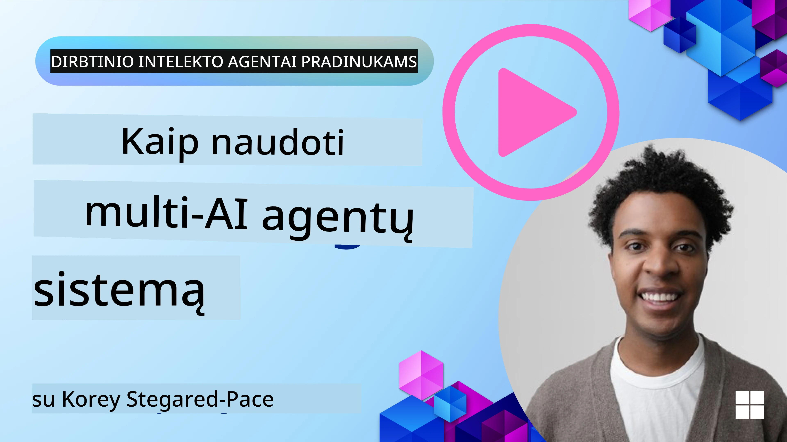
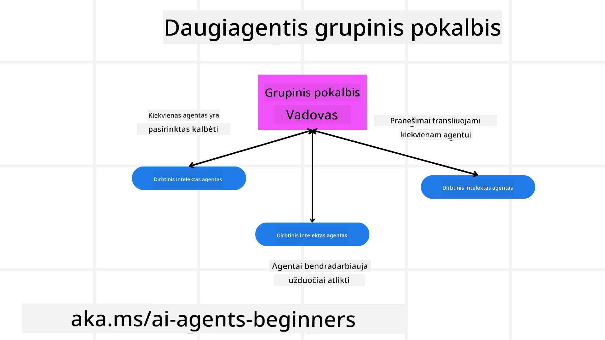
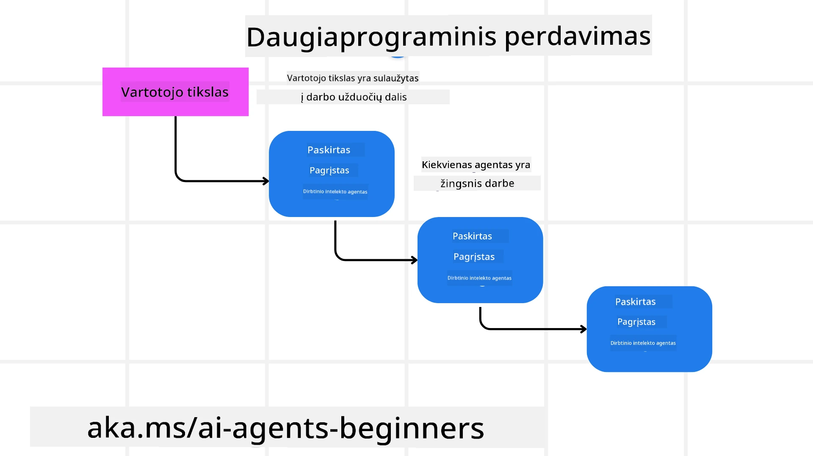
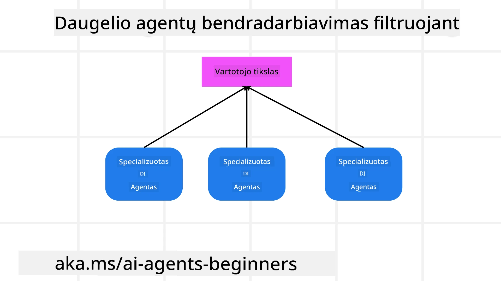

> _(Spustelėkite aukščiau esantį paveikslėlį, kad peržiūrėtumėte šios pamokos vaizdo įrašą)_

# Multi-agentų dizaino modeliai

Kai tik pradedate dirbti su projektu, kuriame dalyvauja keli agentai, turėsite apsvarstyti multi-agentų dizaino modelį. Tačiau gali būti ne iš karto aišku, kada pereiti prie multi-agentų ir kokie yra pranašumai.

## Įvadas

Šioje pamokoje siekiame atsakyti į šiuos klausimus:

- Kokiems scenarijams taikomi multi-agentai?
- Kokie yra naudojimo multi-agentų pranašumai, palyginti su vienu agentu, atliekančiu kelis darbus?
- Kokios yra multi-agentų dizaino modelio įgyvendinimo sudedamosios dalys?
- Kaip galime matyti, kaip keletas agentų tarpusavyje sąveikauja?

## Mokymosi tikslai

Po šios pamokos turėtumėte gebėti:

- Nustatyti scenarijus, kuriuose taikomi multi-agentai.
- Pripažinti pranašumus, kuriuos suteikia multi-agentų naudojimas, palyginti su vienu agentu.
- Suprasti multi-agentų dizaino modelio įgyvendinimo sudedamąsias dalis.

Koks yra platesnis vaizdas?

*Multi-agentai yra dizaino modelis, leidžiantis keliems agentams dirbti kartu siekiant bendro tikslo*.

Šis modelis plačiai naudojamas įvairiose srityse, įskaitant robotiką, autonomines sistemas ir paskirstytą kompiuteriją.

## Scenarijai, kuriuose taikomi multi-agentai

Tad kokie scenarijai yra geras atvejis multi-agentų naudojimui? Atsakymas yra tas, kad yra daug scenarijų, kuriuose kelių agentų naudojimas yra naudingas, ypač šiais atvejais:

- **Didelės darbo apimtys**: Dideles darbo apimtis galima padalyti į mažesnius uždavinius ir paskirti skirtingiems agentams, leidžiant vykdyti užduotis lygiagrečiai ir greičiau jas užbaigti. Pavyzdys – didelės duomenų apdorojimo užduoties atvejis.
- **Sudėtingos užduotys**: Sudėtingas užduotis, kaip ir dideles darbo apimtis, galima suskaidyti į mažesnes dalis ir paskirti skirtingiems agentams, kurie specializuojasi tam tikrose užduoties srityse. Geras pavyzdys – autonominiai automobiliai, kuriuose skirtingi agentai valdo navigaciją, kliūčių aptikimą ir ryšį su kitais automobiliais.
- **Įvairi specializacija**: Skirtingi agentai gali turėti skirtingą patirtį, leidžiant jiems efektyviau tvarkyti skirtingas užduoties dalis nei vienam agentui. Šiuo atveju geras pavyzdys yra sveikatos priežiūra, kur agentai gali valdyti diagnostiką, gydymo planus ir paciento stebėjimą.

## Multi-agentų naudojimo pranašumai prieš vieną agentą

Vienas agentas tiktų paprastoms užduotims, bet sudėtingesnėms užduotims kelių agentų naudojimas suteikia keletą pranašumų:

- **Specializacija**: Kiekvienas agentas gali būti specializuotas konkrečiai užduočiai. Vieno agento atveju be specializacijos turite agentą, kuris gali daryti viską, bet gali susipainioti, susidūręs su sudėtinga užduotimi. Pvz., gali imtis užduoties, kuri jam nėra pati tinkamiausia.
- **Mastelio keitimas**: Lengviau padidinti sistemos mastelį pridėjus daugiau agentų, o ne perpildant vieną agentą.
- **Atsparumas klaidoms**: Jei vienas agentas sugestų, kiti gali tęsti veiklą, užtikrindami sistemos patikimumą.

Paimkime pavyzdį – užsakykime kelionę vartotojui. Vieno agento sistema turėtų tvarkyti visas kelionės užsakymo proceso dalis – nuo skrydžio paieškos iki viešbučių ir automobilio nuomos rezervacijos. Siekiant tai įgyvendinti su vienu agentu, agentui reikėtų turėti priemones, apimančias visas šias užduotis. Tai gali sukurti sudėtingą ir monolitinę sistemą, kurią sunku prižiūrėti ir plečiant. Tuo tarpu multi-agentų sistema galėtų turėti skirtingus agentus, specializuotus skrydžių paieškoje, viešbučių ir automobilių nuomos užsakyme. Tai padarytų sistemą moduline, lengviau prižiūrimą ir mastelį keičiant.

Palyginkite tai su kelionių agentūra, valdomą šeimos verslo, ir kelionių agentūra – franšizę. Šeimos verslo agentūroje vienas agentas tvarkytų visas kelionės užsakymo proceso dalis, o franšizėje skirtingi agentai tvarkytų skirtingas kelionės užsakymo proceso dalis.

## Multi-agentų dizaino modelio įgyvendinimo sudedamosios dalys

Prieš įgyvendindami multi-agentų dizaino modelį, turite suprasti modelio sudedamąsias dalis.

Padarykime tai konkrečiau, vėl pažiūrėję į kelionės užsakymo vartotojui pavyzdį. Šiuo atveju sudedamosios dalys būtų:

- **Agentų komunikacija**: Agentai, ieškantys skrydžių, užsakantys viešbučius ir automobilių nuomą, turi bendrauti ir dalytis informacija apie vartotojo pageidavimus ir apribojimus. Turite apsispręsti dėl protokolų ir metodų šiai komunikacijai. Konkretizuojant tai reiškia, kad skrydžių paieškos agentas turi bendrauti su viešbučių užsakymo agentu, kad viešbutis būtų rezervuotas tą pačią datą kaip ir skrydis. Tai reiškia, kad agentai turi dalytis informacija apie vartotojo kelionės datas, o tai reiškia, kad turite nuspręsti *kurie agentai dalijasi informacija ir kaip jie tai daro*.
- **Koordinavimo mechanizmai**: Agentai turi koordinuoti savo veiksmus, kad būtų atsižvelgta į vartotojo pageidavimus ir apribojimus. Vartotojo pageidavimas gali būti, kad viešbutis būtų netoli oro uosto, o apribojimas – tai, kad automobilių nuoma yra tik oro uoste. Tai reiškia, kad viešbučių užsakymo agentas turi koordinuotis su automobilių nuomos agentu, kad būtų atsižvelgta į vartotojo pageidavimus ir apribojimus. Reiškia, kad turite nuspręsti *kaip agentai koordinuoja savo veiksmus*.
- **Agentų architektūra**: Agentai turi turėti vidinę struktūrą, leidžiančią priimti sprendimus ir mokytis iš sąveikos su vartotoju. Tai reiškia, kad skrydžių paieškos agentas turi turėti vidinę struktūrą, leidžiančią priimti sprendimus, kokius skrydžius rekomenduoti vartotojui. Reiškia, kad turite nuspręsti *kaip agentai priima sprendimus ir mokosi iš sąveikos su vartotoju*. Pavyzdžiai, kaip agentas mokosi ir tobulėja, gali būti, kad skrydžių paieškos agentas naudoja mašininio mokymosi modelį, kad parekomenduotų skrydžius, atsižvelgdamas į ankstesnius vartotojo pageidavimus.
- **Matomumas į multi-agentų sąveikas**: Turite matyti, kaip keli agentai sąveikauja tarpusavyje. Tai reiškia, kad turite turėti įrankius ir metodikas agentų veiksmams ir sąveikoms stebėti. Tai gali būti žurnalo ir monitoringo įrankiai, vizualizavimo įrankiai ir veiklos rodikliai.
- **Multi-agentų modeliai**: Yra skirtingi modeliai multi-agentų sistemų įgyvendinimui, tokie kaip centralizuota, decentralizuota ir mišri architektūra. Turite pasirinkti modelį, geriausiai tinkantį jūsų atvejui.
- **Žmogus procese**: Daugeliu atvejų procese dalyvauja žmogus, tad turite instuktuoti agentus, kada prašyti žmogaus įsikišimo. Tai gali būti, kai vartotojas prašo konkretaus viešbučio ar skrydžio, kurio agentai nepa rekomendavo, arba prašymu patvirtinti prieš užsakant skrydį ar viešbutį.

## Matomumas į multi-agentų sąveikas

Labai svarbu matyti, kaip keli agentai sąveikauja tarpusavyje. Šis matomumas būtinas klaidoms taisyti, tobulinti ir užtikrinti bendrai sistemų efektyvumą. Norint tai pasiekti, turite turėti įrankius ir metodikas, skirtas agentų veiksmams bei sąveikoms sekti. Tai gali būti žurnalo ir monitoringo įrankiai, vizualizavimo įrankiai ir veiklos rodikliai.

Pavyzdžiui, užsakant kelionę vartotojui, galėtumėte turėti informacinę suvestinę, rodančią kiekvieno agente būseną, vartotojo pageidavimus ir apribojimus bei agentų sąveikas. Ši suvestinė galėtų rodyti vartotojo kelionės datas, skrydžių, rekomenduojamų skrydžių agento, viešbučių, rekomenduojamų viešbučių agento, ir automobilių, rekomenduojamų rajono automobilių nuomos agento. Tai suteiktų aiškų vaizdą, kaip agentai sąveikauja tarpusavyje ir ar vartotojo pageidavimai bei apribojimai yra įvykdyti.

Pažvelkime išsamiau į kiekvieną iš šių aspektų.

- **Žurnalo ir monitoringo įrankiai**: Norite, kad būtų fiksuojamas kiekvienas agento veiksmams. Žurnalo įrašas galėtų saugoti informaciją apie agentą, kuris vykdė veiksmą, veiksmą, laiką, kada buvo atliktas veiksmas, ir jo rezultatą. Ši informacija gali būti naudojama klaidoms taisyti, tobulinti ir kt.

- **Vizualizavimo įrankiai**: Vizualizavimo įrankiai gali padėti pamatyti agentų sąveikas intuityvesniu būdu. Pavyzdžiui, galėtumėte turėti grafiką, rodantį informacijos srautą tarp agentų. Tai gali padėti identifikuoti sistemos kliūtis, neefektyvumą ir kitas problemas.

- **Veiklos rodikliai**: Veiklos rodikliai padeda sekti multi-agentų sistemos efektyvumą. Pvz., galėtumėte stebėti laiką, reikalingą užduočiai užbaigti, užduočių skaičių per laiko vienetą ir agentų pateiktų rekomendacijų tikslumą. Ši informacija padeda identifikuoti tobulintinas sritis ir optimizuoti sistemą.

## Multi-agentų modeliai

Pažvelkime į keletą konkrečių modelių, kuriuos galime naudoti kurdami multi-agentų programas. Štai keletas įdomių modelių, kuriuos verta apsvarstyti:

### Grupinis pokalbis

Šis modelis naudingas, kai norite sukurti grupinio pokalbio programą, kur keli agentai gali tarpusavyje bendrauti. Dažni naudojimo atvejai yra komandos bendradarbiavimas, klientų aptarnavimas ir socialiniai tinklai.

Šiame modelyje kiekvienas agentas atstovauja vartotoją grupiniame pokalbyje, o žinutės keičiamos tarp agentų naudojant pranešimų protokolą. Agentai gali siųsti žinutes grupiniam pokalbiui, gauti žinutes iš grupinio pokalbio ir atsakyti į kitų agentų žinutes.

Šį modelį galima įgyvendinti naudojant centralizuotą architektūrą, kur visos žinutės perduodamos per centrinį serverį, arba decentralizuotą architektūrą, kur žinutės keičiasi tiesiogiai.

### Paskirstymas

Šis modelis naudingas, kai norite sukurti programą, kur keli agentai gali perduoti užduotis vienas kitam.

Dažni naudojimo atvejai yra klientų aptarnavimas, užduočių valdymas ir darbo srautų automatizavimas.

Šiame modelyje kiekvienas agentas atstovauja užduotį arba proceso etapą, o agentai gali perduoti užduotis kitiems agentams pagal iš anksto nustatytas taisykles.

### Bendradarbiaujantis filtravimas

Šis modelis naudingas, kai norite sukurti programą, kur keli agentai gali bendradarbiauti, teikdami rekomendacijas vartotojams.

Kodėl jums reikėtų kelių agentų bendradarbiavimo? Nes kiekvienas agentas gali turėti skirtingą ekspertizę ir gali prisidėti prie rekomendacijų proceso skirtingais būdais.

Pažiūrėkime pavyzdį, kai vartotojas nori rekomendacijos dėl geriausios akcijos, kuria pirkti akcijų rinkoje.

- **Pramonės ekspertas**: Vienas agentas gali būti tam tikros pramonės srities ekspertas.
- **Techninė analizė**: Kitas agentas gali būti techninės analizės ekspertas.
- **Fundamentali analizė**: Dar kitas agentas gali būti fundamentalią analizę išmanantis ekspertas. Bendradarbiaudami šie agentai gali pateikti vartotojui išsamesnę rekomendaciją.

## Scenarijus: pinigų grąžinimo procesas

Apsvarstykite scenarijų, kai klientas bando gauti pinigų grąžinimą už produktą. Šiame procese gali dalyvauti nemažai agentų, tačiau suskaidykime juos į agentus, kurie yra skirti šiam procesui, ir bendruosius agentus, kuriuos galima naudoti kituose procesuose.

**Agentai, skirti pinigų grąžinimo procesui**:

Toliau pateikti kai kurie agentai, galintys dalyvauti pinigų grąžinimo procese:

- **Kliento agentas**: šis agentas atstovauja klientui ir atsakingas už pinigų grąžinimo proceso inicijavimą.
- **Pardavėjo agentas**: šis agentas atstovauja pardavėjui ir atsakingas už pinigų grąžinimo apdorojimą.
- **Mokėjimų agentas**: šis agentas atstovauja mokėjimų procesui ir atsakingas už kliento mokėjimo grąžinimą.
- **Sprendimų agentas**: šis agentas atstovauja sprendimų procesui ir atsakingas už bet kokių problemų, kylančių pinigų grąžinimo metu, sprendimą.
- **Atitikties agentas**: šis agentas atstovauja atitikties procesui ir atsakingas už pinigų grąžinimo proceso atitikimą teisės aktams ir taisyklėms.

**Bendrieji agentai**:

Šie agentai gali būti naudojami ir kitose jūsų verslo dalyse.

- **Siuntimo agentas**: šis agentas atstovauja siuntimo procesui ir atsakingas už produkto grąžinimą pardavėjui. Šio agente galima naudoti tiek pinigų grąžinimo procese, tiek bendruoju atveju siunčiant produktą, pavyzdžiui, perkant.
- **Atsiliepimų agentas**: šis agentas atstovauja atsiliepimų procesui ir atsakingas už klientų atsiliepimų rinkimą. Atsiliepimų galima rinkti bet kuriuo metu, ne tik pinigų grąžinimo procese.
- **Eskalacijos agentas**: šis agentas atstovauja eskalacijos procesui ir atsakingas už problemų perkėlimą į aukštesnį aptarnavimo lygį. Tokį agentą galite naudoti bet kuriame procese, kuriame reikia eskaluoti problemą.
- **Pranešimų agentas**: šis agentas atstovauja pranešimų procesui ir atsakingas už pranešimų siuntimą klientui pinigų grąžinimo proceso įvairiais etapais.
- **Analizės agentas**: šis agentas atstovauja analizės procesui ir atsakingas už duomenų, susijusių su pinigų grąžinimo procesu, analizę.
- **Auditavimo agentas**: šis agentas atstovauja auditavimo procesui ir atsakingas už pinigų grąžinimo proceso auditavimą, siekiant užtikrinti, kad jis vykdomas tinkamai.
- **Ataskaitų teikimo agentas**: šis agentas atstovauja ataskaitų teikimo procesui ir atsakingas už ataskaitų apie pinigų grąžinimo procesą generavimą.
- **Žinių agentas**: šis agentas atstovauja žinių procesui ir atsakingas už informacijos apie pinigų grąžinimo procesą žinių bazės palaikymą. Šis agentas gali turėti žinių tiek apie pinigų grąžinimus, tiek apie kitas jūsų verslo sritis.
- **Saugumo agentas**: šis agentas atstovauja saugumo procesui ir atsakingas už pinigų grąžinimo proceso saugumą.
- **Kokybės agentas**: šis agentas atstovauja kokybės procesui ir atsakingas už pinigų grąžinimo proceso kokybės užtikrinimą.

Anksčiau išvardyta nemažai agentų tiek konkrečiam pinigų grąžinimo procesui, tiek bendriesiems agentams, kurie gali būti naudojami kitose verslo dalyse. Tikimės, kad tai suteiks idėjų, kaip galite nuspręsti, kuriuos agentus naudoti savo multi-agentų sistemoje.

## Užduotis

Sukurkite multi-agentų sistemą klientų aptarnavimo procesui. Nustatykite procese dalyvaujančius agentus, jų vaidmenis ir atsakomybes bei kaip jie tarpusavyje sąveikauja. Apsvarstykite tiek klientų aptarnavimo procesui specifinius agentus, tiek bendruosius agentus, kurie gali būti naudojami ir kitose jūsų verslo dalyse.
> Prieš skaitydami toliau pateiktą sprendimą pagalvokite, gal jums reikės daugiau agentų nei manote.

> PATARIMAS: Pagalvokite apie skirtingus klientų aptarnavimo proceso etapus ir taip pat apie agentus, reikalingus bet kuriai sistemai.

## Sprendimas

[Solution](./solution/solution.md)

## Žinių patikrinimai

Klausimas: Kada reikėtų apsvarstyti daugiagentinį naudojimą?

- [ ] A1: Kai turite mažą darbo krūvį ir paprastą užduotį.
- [ ] A2: Kai turite didelį darbo krūvį
- [ ] A3: Kai turite paprastą užduotį.

[Solution quiz](./solution/solution-quiz.md)

## Santrauka

Šioje pamokoje aptarėme daugiagentinį dizaino modelį, įskaitant scenarijus, kur daugiagentinis modelis yra tinkamas, daugiagentinio naudojimo pranašumus lyginant su vienu agentu, daugiagentinio dizaino modelio įgyvendinimo pagrindinius elementus ir kaip stebėti, kaip keli agentai sąveikauja tarpusavyje.

### Turite daugiau klausimų apie daugiagentinį dizaino modelį?

Prisijunkite prie [Microsoft Foundry Discord](https://aka.ms/ai-agents/discord), kad susitikti su kitais besimokančiais, dalyvauti konsultacijų valandomis ir gauti atsakymus į savo klausimus apie AI agentus.

## Papildomi ištekliai

- <a href="https://learn.microsoft.com/azure/ai-services/agents/overview" target="_blank">Microsoft agentų sistemos dokumentacija</a>
- <a href="https://www.analyticsvidhya.com/blog/2024/10/agentic-design-patterns/" target="_blank">Agentinio dizaino modeliai</a>

## Ankstesnė pamoka

[Planning Design](../07-planning-design/README.md)

## Kita pamoka

[Metakognicija AI agentuose](../09-metacognition/README.md)

---

<!-- CO-OP TRANSLATOR DISCLAIMER START -->
**Atsakomybės apribojimas**:  
Šis dokumentas buvo išverstas naudojant dirbtinio intelekto vertimo paslaugą [Co-op Translator](https://github.com/Azure/co-op-translator). Nors siekiame tikslumo, prašome atkreipti dėmesį, kad automatiniai vertimai gali turėti klaidų arba netikslumų. Originalus dokumentas jo gimtąja kalba turėtų būti laikomas autoritetingu šaltiniu. Svarbiai informacijai rekomenduojama naudoti profesionalų žmonių vertimą. Mes neprisiimame atsakomybės už bet kokius nesusipratimus ar neteisingus aiškinimus, kylančius dėl šio vertimo naudojimo.
<!-- CO-OP TRANSLATOR DISCLAIMER END -->