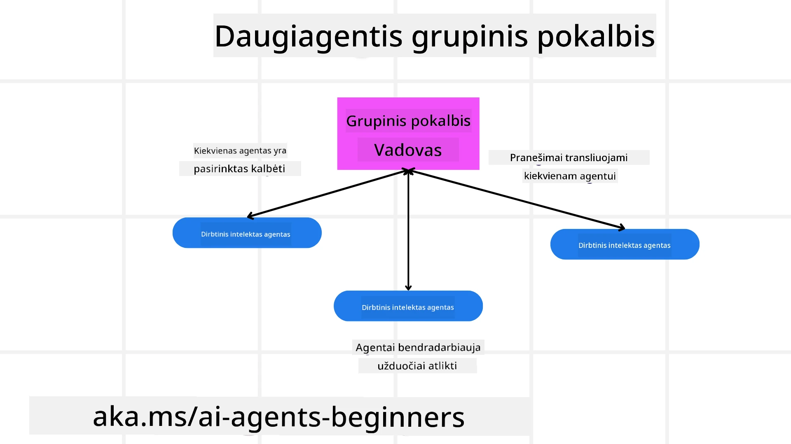
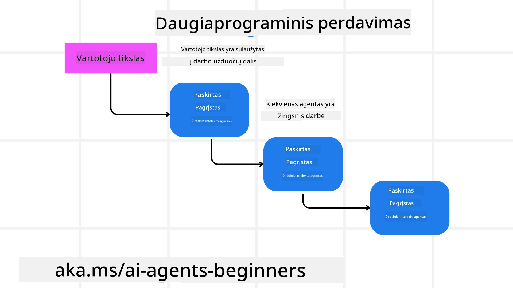
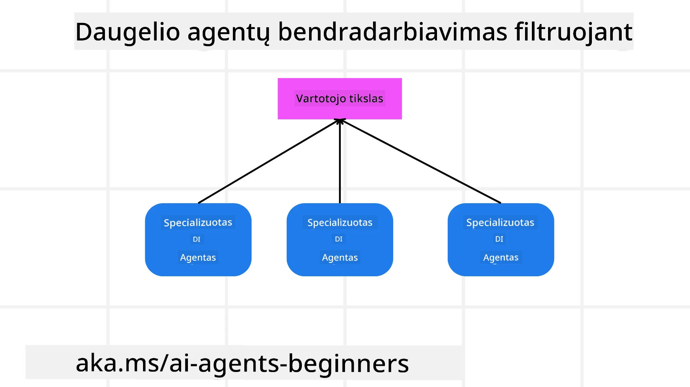

> _(Spustelėkite aukščiau esantį paveikslėlį, norėdami peržiūrėti šios pamokos vaizdo įrašą)_

# Daugelio agentų dizaino šablonai

Kai tik pradedate dirbti prie projekto, kuriame dalyvauja keli agentai, reikės apsvarstyti daugelio agentų dizaino šabloną. Tačiau iš karto gali būti neaišku, kada pereiti prie daugelio agentų ir kokie yra pranašumai.

## Įvadas

Šioje pamokoje siekiame atsakyti į šiuos klausimus:

- Kokiose situacijose tinka naudoti daugelį agentų?
- Kokie yra daugelio agentų pranašumai, palyginti su vienu agentu, kuris atlieka kelias užduotis?
- Kokios yra daugelio agentų dizaino šablono įgyvendinimo sudedamosios dalys?
- Kaip matyti, kaip keli agentai sąveikauja tarpusavyje?

## Mokymosi tikslai

Po šios pamokos turėtumėte gebėti:

- Nustatyti scenarijus, kuriuose tinka naudoti daugelį agentų
- Suprasti daugelio agentų naudojimo pranašumus, palyginti su vienu agentu.
- Suprasti daugelio agentų dizaino šablono įgyvendinimo sudedamąsias dalis.

Kokia yra didesnė prasmė?

*Daugelio agentų sistema yra dizaino šablonas, leidžiantis keliems agentams dirbti kartu siekiant bendro tikslo*.

Šis šablonas plačiai naudojamas įvairiose srityse, įskaitant robotiką, autonomines sistemas ir paskirstytą skaičiavimą.

## Situacijos, kuriose tinka naudoti daugelį agentų

Kokios situacijos yra tinkamos naudoti daugelį agentų? Atsakymas yra tas, kad yra daug atvejų, kai keli agentai yra naudingi, ypač šiais atvejais:

- **Didelės darbo apimtys**: Dideles darbo apimtis galima suskaidyti į mažesnes užduotis ir paskirstyti skirtingiems agentams, leidžiant lygiagrečiai vykdyti darbus ir greičiau juos užbaigti. Pavyzdys – didelės apimties duomenų apdorojimo užduotis.
- **Sudėtingos užduotys**: Sudėtingas užduotis, kaip ir dideles darbo apimtis, galima suskaidyti į mažesnes dalis ir paskirti skirtingiems agentams, išmanantiems tam tikrą užduoties aspektą. Geras pavyzdys yra autonominės transporto priemonės, kur skirtingi agentai tvarko navigaciją, kliūčių aptikimą ir ryšį su kitais automobiliais.
- **Įvairi ekspertizė**: Skirtingi agentai gali turėti skirtingą ekspertizę, leidžiančią jiems efektyviau tvarkyti skirtingus užduoties aspektus nei vienas agentas. Pavyzdžiui, sveikatos priežiūros srityje agentai gali rūpintis diagnostika, gydymo planais ir paciento stebėjimu.

## Daugelio agentų pranašumai prieš vieną agentą

Vieno agento sistema gali veikti gerai paprastoms užduotims, tačiau sudėtingesnėse užduotyse keli agentai gali suteikti keletą pranašumų:

- **Specializacija**: Kiekvienas agentas gali būti specializuotas konkrečioje užduotyje. Vieno agento nespecializavimas reiškia, kad agentas gali daryti viską, bet gali pasimesti susidūręs su sudėtinga užduotimi. Pavyzdžiui, jis gali imtis užduoties, kuriai jis nėra geriausiai pritaikytas.
- **Mastelio keitimas**: Sistemos mastelį lengviau keisti pridedant daugiau agentų nei apkraunant vieną agentą.
- **Atsparumas gedimams**: Jei vienas agentas sugenda, kiti gali tęsti darbą, užtikrindami sistemos patikimumą.

Paimkime pavyzdį – užsakykime kelionę vartotojui. Vieno agento sistema turėtų valdyti visus kelionės užsakymo proceso aspektus, nuo skrydžių paieškos iki viešbučių ir automobilių nuomos rezervavimo. Norint tai įgyvendinti su vienu agentu, agentas turėtų turėti įrankius visoms šių užduočių valdymui. Tai gali sukelti sudėtingą ir monolitinę sistemą, kurią sunku prižiūrėti ir plėsti. Daugelio agentų sistema, priešingai, gali turėti skirtingus agentus, specializuotus skrydžių paieškai, viešbučių ir automobilių nuomai rezervuoti. Tai padarytų sistemą moduline, lengviau prižiūrimą ir plečiamą.

Palyginkite tai su kelionių biuru, valdomu šeimos parduotuvės, ir kelionių biuru, valdomu franšizės. Šeimos parduotuvėje vienas agentas tvarkytų visus kelionės užsakymo proceso aspektus, o franšizėje kiekvienas agentas būtų atsakingas už skirtingus kelionės užsakymo proceso aspektus.

## Daugelio agentų dizaino šablono sudedamosios dalys

Prieš pradedant įgyvendinti daugelio agentų dizaino šabloną, reikia suprasti šio šablono sudedamąsias dalis.

Padarykime tai konkretesnį dar kartą pasitelkdami kelionės užsakymo vartotojui pavyzdį. Šiuo atveju sudedamosios dalys būtų:

- **Agentų komunikacija**: Agentai, atsakingi už skrydžių paiešką, viešbučių ir automobilių nuomą, turi bendrauti ir dalintis informacija apie vartotojo pageidavimus ir apribojimus. Turite nuspręsti dėl šios komunikacijos protokolų ir metodų. Konkrečiai tai reiškia, kad agentas, ieškantis skrydžių, turi bendrauti su viešbučių rezervavimo agentu, užtikrindamas, kad viešbutis būtų rezervuotas tomis pačiomis datomis kaip ir skrydis. Tai reiškia, kad agentai turi dalintis informacija apie vartotojo kelionės datas, t. y., turite nuspręsti, *kokie agentai dalinasi informacija ir kaip jie ją dalinasi*.
- **Koordinavimo mechanizmai**: Agentai turi koordinuoti savo veiksmus, kad būtų atsižvelgta į vartotojo pageidavimus ir apribojimus. Vartotojo pageidavimas gali būti, kad viešbutis būtų netoli oro uosto, o apribojimas - kad automobilių nuoma yra tik oro uoste. Tai reiškia, kad viešbučių rezervavimo agentas turi koordinuotis su automobilių nuomos agentu, kad būtų atsižvelgta į vartotojo pageidavimus ir apribojimus. Tai reiškia, kad turite nuspręsti, *kaip agentai koordinuoja savo veiksmus*.
- **Agentų architektūra**: Agentai turi turėti vidinę struktūrą sprendimams priimti ir mokytis iš savo sąveikos su vartotoju. Tai reiškia, kad agentas, ieškantis skrydžių, turi turėti vidinę struktūrą sprendimams dėl rekomenduojamų skrydžių priimti. Tai reiškia, kad turite nuspręsti, *kaip agentai priima sprendimus ir mokosi iš savo sąveikos su vartotoju*. Pavyzdys, kaip agentas mokosi ir tobulėja, galėtų būti, kad skrydžių paieškos agentas naudotų mašininio mokymosi modelį, kad rekomenduotų skrydžius vartotojui pagal jo ankstesnius pageidavimus.
- **Matomumas daugelio agentų sąveikoje**: Turite matyti, kaip keli agentai sąveikauja. Tai reiškia, kad turite turėti įrankius ir metodikas agentų veiklos ir sąveikos stebėjimui. Tai gali būti žurnalų registravimo ir stebėjimo įrankiai, vizualizavimo priemonės ir našumo metrikos.
- **Daugelio agentų šablonai**: Yra įvairūs daugelio agentų sistemų įgyvendinimo šablonai, tokie kaip centralizuota, decentralizuota ir hibridinė architektūros. Turite pasirinkti, kuris šablonas geriausiai tinka jūsų atvejui.
- **Žmogus cikle**: Daugeliu atvejų sistemoje yra žmogus, ir turite nurodyti agentams, kada prašyti žmogaus įsikišimo. Tai gali būti, kai vartotojas prašo konkretaus viešbučio ar skrydžio, kurio agentai nerekomendavo, arba kai reikia patvirtinimo prieš rezervuojant skrydį ar viešbutį.

## Matomumas daugelio agentų sąveikoje

Svarbu matyti, kaip keli agentai sąveikauja tarpusavyje. Šis matomumas yra būtinas derinimui, optimizavimui ir visos sistemos veiksmingumo užtikrinimui. Norėdami to pasiekti, turite turėti įrankių ir metodikų agentų veiklos ir sąveikos stebėjimui. Tai gali būti žurnalų registravimo ir stebėjimo įrankiai, vizualizavimo priemonės ir našumo metrikos.

Pavyzdžiui, užsakant kelionę vartotojui, galite turėti informacijos skydelį, rodantį kiekvieno agente būseną, vartotojo pageidavimus ir apribojimus bei agentų sąveikas. Šis skydelis galėtų rodyti vartotojo kelionės datas, skrydžių rekomendacijas nuo skrydžių agento, viešbučių rekomendacijas nuo viešbučių agento ir automobilių nuomos rekomendacijas nuo automobilių nuomos agento. Tai suteiktų aiškią apžvalgą apie agentų tarpusavio sąveiką ir ar vartotojo pageidavimai bei apribojimai yra patenkinti.

Pažiūrėkime kiekvieną iš šių aspektų išsamiau.

- **Žurnalų registravimas ir stebėjimo įrankiai**: Norite registruoti kiekvieną agente atliktą veiksmą. Žurnalo įrašas gali saugoti informaciją apie agentą, atlikusį veiksmą, veiksmą, veiksmų atlikimo laiką ir veiksmų rezultatą. Ši informacija gali būti naudojama derinimui, optimizavimui ir kt.

- **Vizualizavimo įrankiai**: Vizualizavimo priemonės gali padėti intuityviau matyti agentų sąveikas. Pavyzdžiui, galite turėti grafiką, rodantį informacijos srautus tarp agentų. Tai gali padėti identifikuoti užstrigimus, neefektyvumą ir kitas problemas sistemoje.

- **Našumo metrikos**: Našumo metrikos gali padėti stebėti daugelio agentų sistemos efektyvumą. Pavyzdžiui, galite sekti laiką, reikalingą užduočiai atlikti, užduočių skaičių vienetu laiko ir agentų pateiktų rekomendacijų tikslumą. Ši informacija padės identifikuoti tobulintinas sritis ir optimizuoti sistemą.

## Daugelio agentų šablonai

Pažiūrėkime kelis konkrečius šablonus, kuriuos galime naudoti kuriant daugelio agentų programas. Čia yra keletas įdomių šablonų, kuriuos verta apsvarstyti:

### Grupinis pokalbis

Šis šablonas naudingas, kai norite sukurti grupinio pokalbio programą, kurioje keli agentai gali bendrauti tarpusavyje. Tipiški naudojimo atvejai yra komandos bendradarbiavimas, klientų aptarnavimas ir socialiniai tinklai.

Šiame šablone kiekvienas agentas atspindi vartotoją grupiniame pokalbyje, o žinutės yra keičiamos naudojant žinučių protokolą. Agentai gali siųsti žinutes į grupinį pokalbį, gauti žinutes ir atsakyti į kitų agentų siunčiamas žinutes.

Šis šablonas gali būti įgyvendintas naudojant centralizuotą architektūrą, kur visos žinutės perduodamos per centrinius serverius, arba decentralizuotą, kur žinutės keičiamės tiesiogiai.

### Užduočių perdavimas

Šis šablonas naudingas, kai norite sukurti programą, kurioje keli agentai gali perduoti užduotis vienas kitam.

Tipiški naudojimo atvejai yra klientų aptarnavimas, užduočių valdymas ir darbo srautų automatizavimas.

Šiame šablone kiekvienas agentas atspindi užduotį arba darbo proceso žingsnį, o agentai gali perduoti užduotis kitiems agentams pagal iš anksto nustatytas taisykles.

### Bendradarbiavimo filtravimas

Šis šablonas naudingas, kai norite sukurti programą, kurioje keli agentai bendradarbiauja vartotojų rekomendacijoms teikti.

Kodėl norėtumėte, kad keli agentai bendradarbiautų, yra todėl, kad kiekvienas agentas gali turėti skirtingą ekspertizę ir gali skirtingai prisidėti prie rekomendacijų proceso.

Paimkime pavyzdį, kai vartotojas nori rekomendacijos, kokią geriausią akciją pirkti akcijų rinkoje.

- **Pramonės ekspertas**: Vienas agentas galėtų būti ekspertas konkrečioje pramonės šakoje.
- **Techninė analizė**: Kitas agentas galėtų būti ekspertas techninėje analizėje.
- **Pagrindinė analizė**: dar kitas agentas galėtų būti ekspertas pagrindinėje analizėje. Bendradarbiaudami šie agentai gali suteikti vartotojui išsamesnę rekomendaciją.

## Scenarijus: Grąžinimų procesas

Apsvarstykite scenarijų, kai klientas bando gauti pinigų grąžinimą už produktą. Šiame procese gali dalyvauti nemažai agentų, tačiau padalinkime juos į konkrečius šiam procesui skirtus agentus ir bendruosius agentus, kurie gali būti naudojami kituose procesuose.

**Konkrečiai grąžinimų procesui skirti agentai**:

Toliau pateikiami kai kurie agentai, kurie galėtų dalyvauti grąžinimų procese:

- **Kliento agentas**: Šis agentas atstovauja klientui ir yra atsakingas už grąžinimo proceso inicijavimą.
- **Pardavėjo agentas**: Šis agentas atstovauja pardavėjui ir yra atsakingas už grąžinimo apdorojimą.
- **Mokėjimo agentas**: Šis agentas atstovauja mokėjimų procesui ir yra atsakingas už kliento pinigų grąžinimą.
- **Sprendimų agentas**: Šis agentas atstovauja sprendimų procesui ir yra atsakingas už bet kokių problemų sprendimą grąžinimo procese.
- **Atitikties agentas**: Šis agentas atstovauja atitikties procesui ir užtikrina, kad grąžinimo procesas atitiktų taisykles ir politiką.

**Bendrieji agentai**:

Šie agentai gali būti naudojami jūsų verslo kitose dalyse.

- **Siuntimo agentas**: Šis agentas atstovauja siuntimo procesui ir yra atsakingas už produkto siuntimą atgal pardavėjui. Šio agento galima naudoti tiek grąžinimo procese, tiek bendrame produktų siuntime, pavyzdžiui, perkant.
- **Atsiliepimų agentas**: Šis agentas atstovauja atsiliepimų procesui ir yra atsakingas už atsiliepimų iš kliento rinkimą. Atsiliepimų galima prašyti bet kuriuo metu, ne tik grąžinimo metu.
- **Iš eskalavimo agentas**: Šis agentas atstovauja eskalavimo procesui ir yra atsakingas už problemų eskalavimą aukštesnio lygio palaikymui. Tokio tipo agentą galima naudoti bet kuriame procese, kai reikia eskaluoti problemą.
- **Pranešimų agentas**: Šis agentas atstovauja pranešimų procesui ir yra atsakingas už pranešimų siuntimą klientui įvairiais grąžinimo proceso etapais.
- **Analitikos agentas**: Šis agentas atstovauja analitikos procesui ir yra atsakingas už su grąžinimu susijusių duomenų analizę.
- **Audito agentas**: Šis agentas atstovauja audito procesui ir yra atsakingas už grąžinimo proceso audito atlikimą, siekiant užtikrinti jo teisingumą.
- **Ataskaitų agentas**: Šis agentas atstovauja ataskaitų procesui ir yra atsakingas už ataskaitų apie grąžinimo procesą rengimą.
- **Žinių agentas**: Šis agentas atstovauja žinių procesui ir yra atsakingas už su grąžinimo procesu susijusios informacijos žinių bazės palaikymą. Šis agentas galėtų turėti žinių tiek apie grąžinimus, tiek apie kitas jūsų verslo sritis.
- **Saugumo agentas**: Šis agentas atstovauja saugumo procesui ir yra atsakingas už grąžinimo proceso saugumą.
- **Kokybės agentas**: Šis agentas atstovauja kokybės procesui ir užtikrina grąžinimo proceso kokybę.

Ankstesniame sąraše yra gana daug agentų tiek konkrečiam grąžinimo procesui, tiek bendriems agentams, kuriuos galima naudoti verslo kituose sektoriuose. Tikimės, kad tai suteiks jums idėją, kaip nuspręsti, kokius agentus naudoti savo daugelio agentų sistemoje.

## Užduotis

Suprojektuokite daugelio agentų sistemą klientų aptarnavimo procesui. Nustatykite proceso agentus, jų vaidmenis ir atsakomybes bei kaip jie sąveikauja tarpusavyje. Apsvarstykite tiek konkrečiai klientų aptarnavimo procesui skirtus agentus, tiek bendrus agentus, kurie gali būti naudojami verslo kituose sektoriuose.

> Pagalvokite prieš skaitydami toliau pateiktą sprendimą, jums gali prireikti daugiau agentų, nei manote.

> PATARIMAS: Pagalvokite apie skirtingus klientų aptarnavimo proceso etapus ir taip pat atsižvelkite į agentus, reikalingus bet kuriai sistemai.

## Sprendimas

[Sprendimas](./solution/solution.md)

## Žinių patikrinimai

### Klausimas 1

Kuri situacija labiausiai tinka daugiagentinei sistemai?

- [ ] A1: Pagalbos botas atsako į dažniausiai užduodamus klausimus, naudodamas vieną žinių bazę ir mažą įrankių rinkinį.
- [ ] A2: Grąžinimo procesui reikalingi atskiri sukčiavimo, mokėjimų ir atitikties vaidmenys, kiekvienas su savo įrankiais, o jų rezultatai turi būti koordinuojami.
- [ ] A3: Tas pats paprastas klasifikavimo užklausimas pasikartoja tūkstančius kartų per valandą.

### Klausimas 2

Kada įprastai geriau pasirinkti vieną agentą?

- [ ] A1: Užduotį galima atlikti naudojant vieną instrukcijų ir įrankių rinkinį, be specialistų perėmimų.
- [ ] A2: Agentas turi prieigą prie daugiau nei vieno įrankio.
- [ ] A3: Darbo eiga reikalauja atskirų vaidmenų su skirtingais leidimais ir nepriklausomais audito takais.

[Sprendimo viktorina](./solution/solution-quiz.md)

## Santrauka

Šioje pamokoje apžvelgėme daugiagentį kūrimo modelį, įskaitant situacijas, kuriose jis taikomas, privalumus, palyginti su vienu agentu, daugiagentio modelio įgyvendinimo sudedamąsias dalis ir kaip stebėti, kaip agentai tarpusavyje sąveikauja.

### Turite daugiau klausimų apie daugiagentį kūrimo modelį?

Prisijunkite prie [Microsoft Foundry Discord](https://discord.com/invite/ATgtXmAS5D) bendruomenės, kur galėsite susitikti su kitais besimokančiais, dalyvauti konsultacijose ir gauti atsakymus į savo AI agentų klausimus.

## Papildomi ištekliai

- <a href="https://learn.microsoft.com/azure/ai-services/agents/overview" target="_blank">Microsoft Agent Framework dokumentacija</a>
- <a href="https://www.analyticsvidhya.com/blog/2024/10/agentic-design-patterns/" target="_blank">Agentiniai kūrimo modeliai</a>

## Ankstesnė pamoka

[Planavimo projektavimas](../07-planning-design/README.md)

## Kita pamoka

[Metakognicija AI agentuose](../09-metacognition/README.md)

---

<!-- CO-OP TRANSLATOR DISCLAIMER START -->
**Atsakomybės apribojimas**:
Šis dokumentas buvo išverstas naudojant dirbtinio intelekto vertimo paslaugą [Co-op Translator](https://github.com/Azure/co-op-translator). Nors siekiame tikslumo, prašome atkreipti dėmesį, kad automatiniai vertimai gali turėti klaidų ar netikslumų. Originalus dokumentas jo gimtąja kalba laikomas autoritetingu šaltiniu. Svarbiai informacijai rekomenduojama naudoti profesionalų žmogiškąjį vertimą. Mes neatsakome už jokius nesusipratimus ar neteisingą interpretaciją, kilusią naudojantis šiuo vertimu.
<!-- CO-OP TRANSLATOR DISCLAIMER END -->