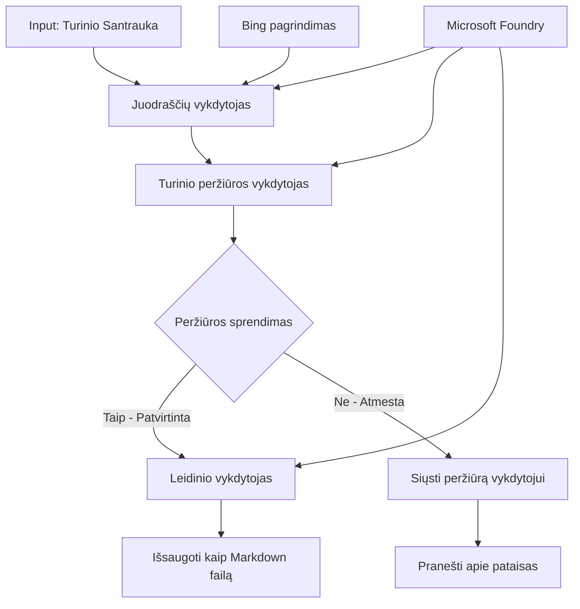

# 🔀 Sąlyginiai agentų darbo srautai su Microsoft Foundry (.NET)

## 📋 Protingo sprendimų pagrindu veikiančio darbo srauto vadovėlis

Šiame užrašų knygelėje demonstruojami **sąlyginiai darbo srautų modeliai** naudojant Microsoft Foundry ir Microsoft Agent Framework .NET. Sužinosite, kaip kurti sudėtingus, sprendimų pagrindu veikiančius darbo srautus, kurie protingai nukreipia procesus pagal DI analizę, verslo taisykles ir dinamiškas sąlygas įmonių klasės automatizavimui.

## 🎯 Mokymosi tikslai

### 🧠 **Protinga sprendimų architektūra**
- **Sąlyginės logikos įgyvendinimas**: Kurkite sudėtingus sprendimų medžius su keliomis šakomis
- **DI pagrįstas maršrutizavimas**: Naudokite Microsoft Foundry modelius protingiems maršrutų sprendimams priimti
- **Dinamiškas darbo srauto pritaikymas**: Koreguokite darbo eigą pagal vykdymo metu atliekamą analizę ir sąlygas
- **Įmonės taisyklių integracija**: Įtraukite verslo logiką ir atitikties reikalavimus į darbo srautus

### 🔀 **Sudėtingi sąlyginiai modeliai**
- **Daugialypiai sprendimų kriterijai**: Įvertinkite kelis veiksnius sprendimų priėmimui dėl maršrutizavimo
- **Konteksto supratimu pagrįstas apdorojimas**: Sprendimus priimkite remdamiesi sukaupta darbo srauto konteksto istorija
- **Adaptuotas darbo srauto keitimas**: Dinamiškai reguliuokite apdorojimo kelius pagal realaus laiko sąlygas
- **Taisyklių variklio integracija**: Įgyvendinkite sudėtingus verslo taisyklių variklius darbo srautuose

### 🏢 **Įmonių taikomosios sąlyginės programos**
- **Dokumentų klasifikavimas ir maršrutizavimas**: Automatiškai klasifikuokite ir nukreipkite dokumentus tinkamiems darbo srautams
- **Klientų aptarnavimo triavimo sprendimai**: Protingas klientų užklausų nukreipimas specializuotoms komandų grupėms
- **Atitikties ir rizikos apdorojimas**: Pritaikykite skirtingus patikros ir peržiūros procesus pagal rizikos vertinimą
- **Kokybės užtikrinimo darbo srautai**: Nukreipkite turinį tinkamais peržiūros procesais pagal kokybės rodiklius

## ⚙️ Reikalavimai ir parengimas

### 📦 **Būtinos NuGet bibliotekos**

Pažangios bibliotekos sąlyginiam darbo srautų apdorojimui:

```xml
<!-- Core AI Framework -->
<PackageReference Include="Microsoft.Extensions.AI" Version="9.9.0" />

<!-- Azure AI Agents with Persistent State -->
<PackageReference Include="Azure.AI.Agents.Persistent" Version="1.2.0-beta.5" />

<!-- Azure Identity and Utilities -->
<PackageReference Include="Azure.Identity" Version="1.15.0" />
<PackageReference Include="System.Linq.Async" Version="6.0.3" />
<PackageReference Include="DotNetEnv" Version="3.1.1" />

<!-- Local Workflow Framework References -->
<!-- Microsoft.Agents.Workflows.dll - Advanced workflow orchestration -->
<!-- Microsoft.Agents.AI.AzureAI.dll - Microsoft Foundry integration -->
<!-- Microsoft.Agents.AI.dll - Core agent abstractions -->
```

### 🔑 **Microsoft Foundry konfigūracija**

**Būtini Azure ištekliai:**
- Microsoft Foundry darbo sritis su sąlyginių modelių apdorojimu
- Azure prenumerata su tinkamomis skaičiavimo kvotomis ir leidimais
- Išdiegti DI modeliai sprendimų priėmimui ir turinio analizei
- (Pasirinktinai) Bing Search API prisijungimas duomenų pagrindimui

**Aplinkos konfigūracija (.env failas):**
```env
# Microsoft Foundry Configuration
AZURE_AI_PROJECT_ENDPOINT=https://your-project.cognitiveservices.azure.com/
BING_CONNECTION_ID=your-bing-connection-id
```

**Autentifikacijos nustatymas:**
```csharp
// Azure CLI or Managed Identity authentication
using Azure.Identity;
var credential = new AzureCliCredential();

// Load environment configuration
DotNetEnv.Env.Load("../../../.env");
```

### 🏗️ **Sąlyginės darbo srauto architektūra**



**Pagrindinės sudedamosios dalys:**
- **Draft Executor**: DI agentas, kuris kuria pradinius turinio juodraščius iš apibendrinimų
- **Content Review Executor**: DI agentas, vertinantis juodraščio kokybę ir atitiktį reikalavimams
- **Sąlyginis maršrutizavimas**: Sprendimų logika, nukreipianti pagal peržiūros rezultatus
- **Publikavimo/Peržiūros keliai**: Atskirti apdorojimo keliai patvirtintam ir atmestam turiniui
- **Būsenos valdymas**: Išlaiko turinio ir peržiūros kontekstą per visą darbo srautą

## 🎨 **Sąlyginio darbo srauto dizaino modeliai**

### 📋 **Turinio gamyba su kokybės kontrolės vartais**
```
Outline → Draft Creation → Quality Review → {Approve: Publish | Reject: Revise}
```

### 🎯 **Rizika pagrįstas dokumentų apdorojimas**
```
Document → Risk Assessment → {Low: Standard | High: Enhanced Review}
```

### 🔍 **Protingas klientų aptarnavimo maršrutizavimas**
```
Customer Query → Analysis → {Simple: FAQ Bot | Complex: Human Agent}
```

### 💼 **Atitiktimi grindžiami darbo srautai**
```
Content → Compliance Check → {Pass: Publish | Fail: Legal Review}
```

## 🏢 **Įmonių sąlyginės naudos**

### 🎯 **Protinga automatizacija**
- **Išmanieji sprendimų priėmimai**: DI pagrindu veikiantys maršrutizavimo sprendimai, paremti turinio analize ir kontekstu
- **Adaptuotas apdorojimas**: Darbo srautai, kurie automatiškai prisitaiko pagal kintančias sąlygas
- **Verslo taisyklių taikymas**: Automatinis sudėtingų verslo logikos ir politikos įgyvendinimas
- **Konteksto suvokimas maršrutizavime**: Sprendimai priimami atsižvelgiant į visą darbo srauto istoriją ir sukauptą kontekstą

### 📈 **Veiklos efektyvumas**
- **Optimizuotas išteklių paskirstymas**: Darbai nukreipiami pas tinkamiausius specialistus ir procesus
- **Sumažinta rankinė intervencija**: Automatinis sprendimų priėmimas mažina poreikį žmonių įsitraukimui
- **Sutrumpėjo sprendimų priėmimo laikas**: Tiesioginis nukreipimas pas tinkamus ekspertus ir apdorojimo galimybes
- **Vienodas taikymas**: Verslo taisyklių ir sprendimų kriterijų vienodas taikymas

### 🛡️ **Rizikų valdymas ir atitiktis**
- **Automatizuotas rizikos vertinimas**: DI pagrindu vertinamas turinio ir situacijos rizikos lygis
- **Atitikties užtikrinimas**: Automatinis nukreipimas per būtinus reguliavimo procesus
- **Saugumo protokolų taikymas**: Sustiprintos saugumo priemonės, pritaikytos pagal rizikos vertinimą
- **Auditinės ataskaitos palaikymas**: Pilnas sprendimų dėl maršrutizavimo dokumentavimas ir pagrindimas

### 📊 **Analitika ir nuolatinis tobulinimas**
- **Sprendimų analizė**: Sekite maršrutizavimo sprendimų efektyvumą ir tikslumą
- **Modelių atpažinimas**: Nustatykite tendencijas ir šablonus maršrutizavimo sprendimuose per laiką
- **Veiklos optimizavimas**: Nuolatinis sprendimų kriterijų ir maršrutizavimo efektyvumo gerinimas
- **Verslo intelektas**: Įžvalgos apie turinio ypatybes ir apdorojimo reikalavimus

### 🔧 **Techninis meistriškumas**
- **Ištisinis būsenos valdymas**: Išlaikykite sudėtingą būseną per visą darbo srauto vykdymą
- **Mastelio keitimo architektūra**: Tvarkykite didelio tūrio sąlyginio apdorojimo reikalavimus
- **Integracijos galimybės**: Sklandžiai integruokite su esamomis verslo sistemomis ir procesais
- **Stebėjimas ir matomumas**: Visapusiškas darbo srauto veiklos ir sprendimų sekimas

Kurkime protingus, sprendimų pagrindu veikiančius įmonių darbo srautus su .NET! 🚀

## 💻 Kodo paleidimas

Pilnas įgyvendinimas pateikiamas faile `04.dotnet-agent-framework-workflow-aifoundry-condition.cs`. Tai demonstruoja **turinio gamybos darbo srautą su kokybės vartais**:

### 🏗️ **Darbo srauto architektūra**

```
Content Outline → Draft Creation → Quality Review → Conditional Routing:
                                                      ├─ Approved (>200 words) → Publish
                                                      └─ Rejected (<200 words) → Review Notification
```

**Agentai darbo sraute:**
1. **Evangelisto agentas**: Kuria mokymo juodraščius iš apibendrinimų su Bing pagrindu
2. **Turinio peržiūros agentas**: Įvertina juodraščio kokybę (žodžių skaičių, išbaigtumą)
3. **Publikavimo agentas**: Išsaugo patvirtintą turinį kaip laiko žyma pažymėtus Markdown failus

**Individualūs vykdytojai:**
1. **DraftExecutor**: Organizuoją juodraščių kūrimą
2. **ContentReviewExecutor**: Atlieka kokybės vertinimą
3. **PublishExecutor**: Tvarko patvirtinto turinio publikavimą
4. **SendReviewExecutor**: Valdo atmesto turinio pranešimus

### 🚀 Pavyzdžio vykdymas

**Reikalavimai:**
- Sukonfigūruota Microsoft Foundry darbo sritis
- Azure CLI autentifikacija (`az login`)
- (Pasirinktinai) Bing Search prisijungimas pagrindimui

```bash
# Padarykite scenarijų vykdomu (Unix/Linux/macOS)
chmod +x 04.dotnet-agent-framework-workflow-aifoundry-condition.cs

# Vykdykite sąlyginį darbo eigą
./04.dotnet-agent-framework-workflow-aifoundry-condition.cs
```

Ar Windows aplinkoje:
```powershell
dotnet run 04.dotnet-agent-framework-workflow-aifoundry-condition.cs
```

### 📝 Tikėtinas rezultatas

Darbo srautas:
1. **Sukurs agentus**: Inicializuos tris specializuotus Microsoft Foundry agentus
2. **Sugeneruos juodraštį**: Evangelisto agentas sukurs mokymo juodraštį iš apibendrinimo
3. **Peržiūrės turinį**: Turinio peržiūros agentas įvertins juodraščio kokybę
4. **Sąlyginis maršrutizavimas**:
   - **Jei patvirtinta (>200 žodžių)**: Publikavimo vykdytojas išsaugos kaip Markdown failą
   - **Jei atmesta (<200 žodžių)**: Siųs peržiūros pranešimą
5. **Parodys rezultatus**: Atskleis galutinį darbo srauto rezultatą

### 🔧 Individualizavimo galimybės

**Keisti peržiūros kriterijus:**
```csharp
const string ContentReviewerInstructions = @"
You are a content reviewer...
1. Check if content is more than 500 words (instead of 200)
2. Verify technical accuracy
3. Ensure proper formatting
...";
```

**Pridėti daugiau sąlyginių kelių:**
```csharp
var workflow = new WorkflowBuilder(draftExecutor)
    .AddEdge(draftExecutor, contentReviewerExecutor)
    .AddEdge(contentReviewerExecutor, publishExecutor, condition: GetCondition("Excellent"))
    .AddEdge(contentReviewerExecutor, editExecutor, condition: GetCondition("Good"))
    .AddEdge(contentReviewerExecutor, sendReviewerExecutor, condition: GetCondition("Poor"))
    .Build();
```

**Pakeisti turinio reikalavimus:**
```csharp
string OUTLINE_Content = @"
# Your Custom Topic
## Section 1
https://your-reference-url
## Section 2
...
";
```

### 🎯 Realūs panaudojimo atvejai

Šis sąlyginis darbo srauto modelis idealus:
- **Turinio valdymo sistemos**: Automatizuoti redakciniai darbo srautai su kokybės vartais
- **Dokumentų apdorojimas**: Maršrutizuoja dokumentus pagal klasifikaciją ir atitikimą
- **Klientų aptarnavimas**: Protingas užklausų maršrutizavimas pagal sudėtingumą ir skubumą
- **Teisinė peržiūra**: Nukreipia sutartis pagal rizikos vertinimą ir vertę
- **Žmogiškųjų išteklių procesai**: Nukreipia paraiškas per tinkamus patikros darbo srautus

### 🔍 Sąlyginės logikos supratimas

**Sąlygos funkcija:**
```csharp
public Func<object?, bool> GetCondition(string expectedResult) =>
    reviewResult => reviewResult is ReviewResult review && review.Result == expectedResult;
```

Ši funkcija sukuria predikatą, kuris:
1. Tikrina, ar rezultatas yra tipo `ReviewResult`
2. Lygina `Result` savybę su laukta verte
3. Grąžina true/false sprendimui dėl maršrutizavimo

**Darbo srauto kraštai su sąlygomis:**
```csharp
.AddEdge(contentReviewerExecutor, publishExecutor, condition: GetCondition("Yes"))
.AddEdge(contentReviewerExecutor, sendReviewerExecutor, condition: GetCondition("No"))
```

### 📊 Pažangios funkcijos

**JSON schemų validacija:**
Darbo srautas naudoja JSON schemas užtikrinti struktūruotoms atsakymo formoms:

```csharp
// Define response structure
public class ReviewResult
{
    [JsonPropertyName("review_result")]
    public string Result { get; set; } = string.Empty;
    
    [JsonPropertyName("reason")]
    public string Reason { get; set; } = string.Empty;
    
    [JsonPropertyName("draft_content")]
    public string DraftContent { get; set; } = string.Empty;
}

// Apply to agent
ResponseFormat = ChatResponseFormat.ForJsonSchema(
    AIJsonUtilities.CreateJsonSchema(typeof(ReviewResult)), 
    "ReviewResult", 
    "Review Result From DraftContent"
)
```

**Bing pagrindimo integracija:**
Evangelisto agentas naudoja Bing pagrindimą prieigai prie realaus laiko informacijos:

```csharp
var bingGroundingConfig = new BingGroundingSearchConfiguration(bing_conn_id);
BingGroundingToolDefinition bingGroundingTool = new(
    new BingGroundingSearchToolParameters([bingGroundingConfig])
);
```

Tai leidžia agentui sekti URL apibendrinimuose ir išgauti einamąją informaciją.

### 🛡️ Klaidų valdymas

Darbo srautas apima tvirtą klaidų valdymą atmetamam turiniui:
- Peržiūros nesėkmės sukelia alternatyvų kelią
- Pranešimai aiškiai nurodo atsisakymo priežastis
- Turinys išsaugomas peržiūrai

### 🔄 Darbo srauto plėtra

**Pridėti peržiūros ciklą:**
Sukurkite atsiliepimų ciklą, kuris automatiškai redaguotų turinį:

```csharp
.AddEdge(contentReviewerExecutor, publishExecutor, condition: GetCondition("Yes"))
.AddEdge(contentReviewerExecutor, draftExecutor, condition: GetCondition("No")) // Loop back
```

**Įdiegti daugialypę peržiūrą:**
Pridėkite kelis peržiūros etapus su skirtingais kriterijais:

```csharp
.AddEdge(draftExecutor, technicalReviewer)
.AddEdge(technicalReviewer, editorialReviewer, condition: GetCondition("TechPass"))
.AddEdge(editorialReviewer, publishExecutor, condition: GetCondition("EditPass"))
```

Šis sąlyginis darbo srauto modelis suteikia pagrindą kurti pažangias, intelektualias įmonių automatizavimo sistemas! 🚀

---

<!-- CO-OP TRANSLATOR DISCLAIMER START -->
**Atsakomybės apribojimas**:
Šis dokumentas buvo išverstas naudojant dirbtinio intelekto vertimo paslaugą [Co-op Translator](https://github.com/Azure/co-op-translator). Nors siekiame tikslumo, prašome atkreipti dėmesį, kad automatiniai vertimai gali turėti klaidų ar netikslumų. Originalus dokumentas jo gimtąja kalba laikomas autoritetingu šaltiniu. Svarbiai informacijai rekomenduojama naudoti profesionalų žmogiškąjį vertimą. Mes neatsakome už jokius nesusipratimus ar neteisingą interpretaciją, kilusią naudojantis šiuo vertimu.
<!-- CO-OP TRANSLATOR DISCLAIMER END -->