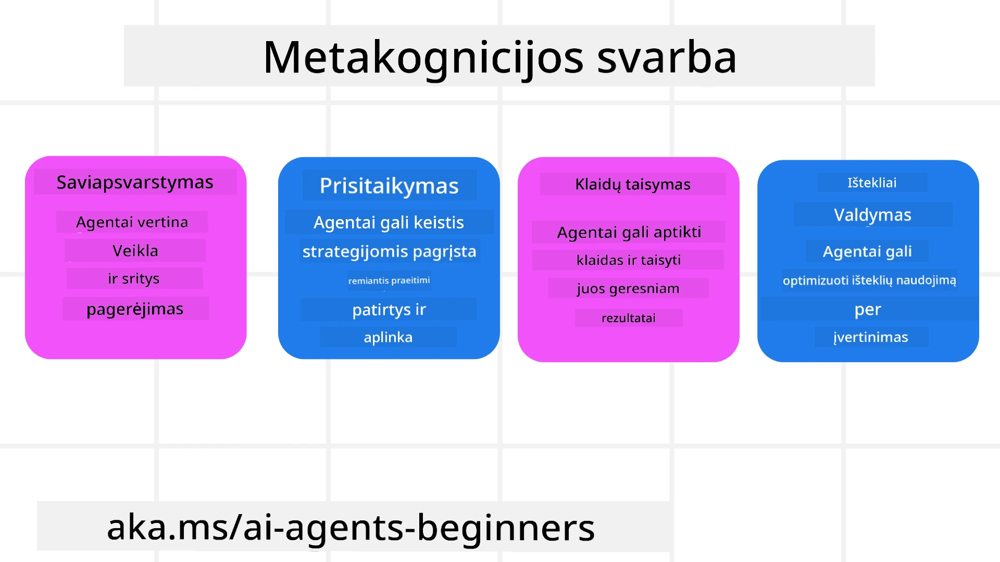
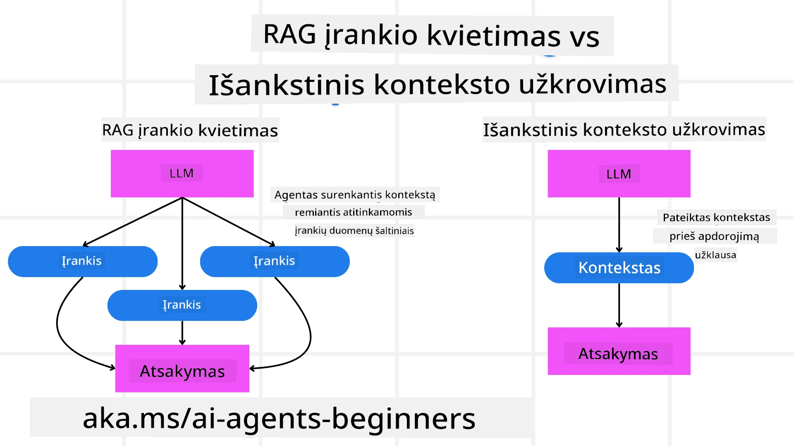

[](https://youtu.be/His9R6gw6Ec?si=3_RMb8VprNvdLRhX)

> _(Paspauskite paveikslėlį aukščiau, kad peržiūrėtumėte šios pamokos vaizdo įrašą)_
# Metakognicija DI agentuose

## Įvadas

Sveiki atvykę į pamoką apie metakogniciją DI agentuose! Šis skyrius skirtas pradedantiesiems, kurie domisi, kaip DI agentai gali mąstyti apie savo mąstymo procesus. Pamokos pabaigoje suprasite pagrindines sąvokas ir turėsite praktinių pavyzdžių, kaip pritaikyti metakogniciją DI agentų kūrime.

## Mokymosi tikslai

Baigę šią pamoką, galėsite:

1. Suprasti samprotavimo ciklų pasekmes agentų apibrėžimuose.
2. Taikyti planavimo ir vertinimo metodikas savikoreguojantiems agentams.
3. Kurti savo agentus, galinčius manipuliuoti kodu užduotims atlikti.

## Įvadas į metakogniciją

Metakognicija reiškia aukštesnio lygio pažinimo procesus, kurie apima mąstymą apie savo mąstymą. DI agentams tai reiškia gebėjimą įvertinti ir prisitaikyti prie savo veiksmų pagal savimonę ir ankstesnę patirtį. Metakognicija, arba "mąstymas apie mąstymą," yra svarbi sąvoka agentų DI sistemų kūrime. Ji apima DI sistemų sąmoningumą apie savo vidinius procesus ir gebėjimą juos stebėti, reguliuoti ir adaptuoti savo elgesį. Kaip kai mes suprantame situaciją arba sprendžiame problemą. Ši savimonė padeda DI sistemoms priimti geresnius sprendimus, nustatyti klaidas ir laikui bėgant tobulinti savo veikimą – tai vėl susiję su Turingo testu ir diskusijomis, ar DI užims mūsų vietą.

Agentinių DI sistemų kontekste metakognicija gali padėti spręsti keletą iššūkių, tokių kaip:
- Skaidrumas: Užtikrinti, kad DI sistemos galėtų paaiškinti savo samprotavimus ir sprendimus.
- Samprotavimas: Pagerinti DI sistemų gebėjimą sintezuoti informaciją ir priimti pagrįstus sprendimus.
- Prisitaikymas: Leisti DI sistemoms prisitaikyti prie naujų aplinkų ir kintančių sąlygų.
- Percepcija: Pagerinti DI sistemų tikslumą atpažįstant ir interpretuojant duomenis iš aplinkos.

### Kas yra metakognicija?

Metakognicija, arba "mąstymas apie mąstymą," yra aukštesnio lygio pažinimo procesas, apimantis savimonę ir savireguliaciją pažinimo procesuose. DI srityje metakognicija suteikia agentams galimybę vertinti ir pritaikyti savo strategijas bei veiksmus, kas leidžia geriau spręsti problemas ir priimti sprendimus. Suprasdami metakogniciją, galite sukurti DI agentus, kurie yra ne tik protingesni, bet ir labiau prisitaikantys bei efektyvūs. Tikroje metakognicijoje DI aiškiai samprotauja apie savo pačio samprotavimus.

Pavyzdys: „Aš pirmenybę teikiau pigesniems skrydžiams, nes... gali būti, kad praleidžiu tiesioginius skrydžius, todėl patikrinsiu dar kartą.“
Sekti, kaip ar kodėl buvo pasirinktas tam tikras maršrutas.
- Pastebėti, jog padaryta klaida dėl pernelyg didelio pasikliaujimo vartotojo pasirinkimais iš ankstesnio karto, todėl koreguoti ne tik galutinę rekomendaciją, bet ir sprendimų priėmimo strategiją.
- Diagnostikuoti modelius, pavyzdžiui: „Kai vartotojas sako ‚per daug žmonių‘, aš turėčiau ne tik pašalinti tam tikras lankytinas vietas, bet ir atsižvelgti į tai, kad mano metodas pasirinkti ‚populiariausias lankytinas vietas‘ yra neteisingas, jei visada vertinu pagal populiarumą.“

### Metakognicijos svarba DI agentuose

Metakognicija yra svarbi DI agentų kūrime dėl kelių priežasčių:



- Savianalizė: Agentai gali įvertinti savo veiklą ir nustatyti tobulintinas sritis.
- Prisitaikomumas: Agentai gali keisti savo strategijas remdamiesi praeitimi ir kintančia aplinka.
- Klaidų taisymas: Agentai gali savarankiškai aptikti ir taisyti klaidas, kas lemia tikslesnius rezultatus.
- Išteklių valdymas: Agentai gali optimizuoti išteklių, tokių kaip laikas ir skaičiavimo galia, naudojimą planuodami ir vertindami savo veiksmus.

## DI agente sudedamosios dalys

Prieš paneriant į metakognicinius procesus, svarbu suprasti pagrindines DI agente sudedamąsias dalis. DI agentas paprastai susideda iš:

- Asmenybės: Agentų asmenybė ir charakteristikos, kurios nurodo, kaip jis sąveikauja su vartotojais.
- Įrankių: Gebėjimai ir funkcijos, kurias agentas gali atlikti.
- Įgūdžių: Žinios ir kompetencijos, kurias agentas turi.

Šios dalys kartu sukuria „ekspertizės vienetą“, galintį atlikti specifines užduotis.

**Pavyzdys**:
Pavyzdžiui, kelionių agentas – agentų paslauga, kuri ne tik planuoja jūsų atostogas, bet ir koreguoja maršrutą pagal realaus laiko duomenis ir ankstesnių klientų patirtis.

### Pavyzdys: Metakognicija kelionių agentų paslaugoje

Įsivaizduokite, kad kuriate kelionių agento paslaugą, paremtą DI. Šis agentas „Travel Agent“ padeda vartotojams planuoti atostogas. Norint įtraukti metakogniciją, Travel Agent turi įvertinti ir prisitaikyti prie savo veiksmų, remdamasis savimonės ir ankstesnės patirties duomenimis. Štai kaip metakognicija galėtų pasitarnauti:

#### Dabartinė užduotis

Dabartinė užduotis – padėti vartotojui suplanuoti kelionę į Paryžių.

#### Užduoties atlikimo žingsniai

1. **Surinkti vartotojo pageidavimus**: Paklausti vartotojo apie kelionės datas, biudžetą, pomėgius (pvz., muziejus, virtuvė, apsipirkimas) ir specifinius reikalavimus.
2. **Gauti informaciją**: Ieškoti skrydžių, apgyvendinimo, lankytinų vietų ir restoranų, atitinkančių vartotojo pageidavimus.
3. **Parengti rekomendacijas**: Pateikti asmeninį maršrutą su skrydžių duomenimis, viešbučių rezervacijomis ir siūlomomis veiklomis.
4. **Koreguoti pagal atsiliepimus**: Paklausti vartotojo apie rekomendacijas ir atlikti reikalingus pakeitimus.

#### Reikalingi ištekliai

- Prieiga prie skrydžių ir viešbučių užsakymų duomenų bazių.
- Informacija apie Paryžiaus lankytinas vietas ir restoranus.
- Vartotojo grįžtamojo ryšio duomenys iš ankstesnių sąveikų.

#### Patirtis ir savianalizė

Travel Agent naudoja metakogniciją, kad įvertintų savo veikimą ir mokytųsi iš praeities patirties. Pavyzdžiui:

1. **Vartotojo atsiliepimų analizė**: Travel Agent peržiūri vartotojo atsiliepimus, kad nustatytų, kurios rekomendacijos buvo gerai įvertintos, o kurios ne. Agentas pritaiko savo būsimus pasiūlymus atsižvelgdamas į tai.
2. **Prisitaikomumas**: Jei vartotojas anksčiau minėjo, kad nemėgsta perpildytų vietų, Travel Agent ateityje vengs rekomenduoti populiarias turistines vietas piko valandomis.
3. **Klaidų taisymas**: Jei Travel Agent padarė klaidą ankstesniame užsakyme, pvz., pasiūlė visiškai užpildytą viešbutį, jis išmoksta atidžiau tikrinti prieinamumą prieš pateikdamas rekomendacijas.

#### Praktinis kūrėjo pavyzdys

Štai supaprastintas Travel Agent kodo pavyzdys, įtraukiantis metakogniciją:

```python
class Travel_Agent:
    def __init__(self):
        self.user_preferences = {}
        self.experience_data = []

    def gather_preferences(self, preferences):
        self.user_preferences = preferences

    def retrieve_information(self):
        # Ieškoti skrydžių, viešbučių ir lankytinų vietų pagal pageidavimus
        flights = search_flights(self.user_preferences)
        hotels = search_hotels(self.user_preferences)
        attractions = search_attractions(self.user_preferences)
        return flights, hotels, attractions

    def generate_recommendations(self):
        flights, hotels, attractions = self.retrieve_information()
        itinerary = create_itinerary(flights, hotels, attractions)
        return itinerary

    def adjust_based_on_feedback(self, feedback):
        self.experience_data.append(feedback)
        # Analizuoti atsiliepimus ir koreguoti būsimus pasiūlymus
        self.user_preferences = adjust_preferences(self.user_preferences, feedback)

# Naudojimo pavyzdys
travel_agent = Travel_Agent()
preferences = {
    "destination": "Paris",
    "dates": "2025-04-01 to 2025-04-10",
    "budget": "moderate",
    "interests": ["museums", "cuisine"]
}
travel_agent.gather_preferences(preferences)
itinerary = travel_agent.generate_recommendations()
print("Suggested Itinerary:", itinerary)
feedback = {"liked": ["Louvre Museum"], "disliked": ["Eiffel Tower (too crowded)"]}
travel_agent.adjust_based_on_feedback(feedback)
```

#### Kodėl metakognicija yra svarbi

- **Savianalizė**: Agentai gali analizuoti savo veiklą ir nustatyti tobulintinas sritis.
- **Prisitaikomumas**: Agentai gali keisti strategijas, remdamiesi atsiliepimais ir kintančiomis sąlygomis.
- **Klaidų taisymas**: Agentai gali savarankiškai aptikti ir taisyti klaidas.
- **Išteklių valdymas**: Agentai gali optimizuoti išteklių naudojimą, pvz., laiką ir skaičiavimo galingumą.

Įtraukus metakogniciją, Travel Agent gali teikti labiau suasmenintas ir tikslias kelionių rekomendacijas, kas gerina vartotojo patirtį.

---

## 2. Planavimas agentuose

Planavimas yra svarbi DI agentų elgesio dalis. Tai apima žingsnių, reikalingų tikslo pasiekimui, išdėstymą, atsižvelgiant į esamą būseną, išteklius ir galimus sunkumus.

### Planavimo elementai

- **Dabartinė užduotis**: Aiškiai apibrėžkite užduotį.
- **Užduoties atlikimo žingsniai**: Suskaidykite užduotį į valdomus žingsnius.
- **Reikalingi ištekliai**: Nustatykite reikalingus išteklius.
- **Patirtis**: Pasinaudokite ankstesne patirtimi planuojant.

**Pavyzdys**:
Štai žingsniai, kuriuos Travel Agent turi atlikti, kad efektyviai padėtų vartotojui suplanuoti kelionę:

### Žingsniai kelionių agentui

1. **Surinkti vartotojo pageidavimus**
   - Paklausti vartotojo apie kelionės datas, biudžetą, pomėgius ir specifinius reikalavimus.
   - Pavyzdžiai: „Kada planuojate keliauti?“ „Koks jūsų biudžeto diapazonas?“ „Kokius užsiėmimus mėgstate atostogų metu?“

2. **Gauti informaciją**
   - Ieškoti tinkamų kelionių variantų pagal vartotojo pageidavimus.
   - **Skrydžiai**: Rasti pasiekiamus skrydžius pagal vartotojo biudžetą ir pageidaujamas kelionės datas.
   - **Apgyvendinimas**: Rasti viešbučius ar nuomos pasiūlymus, atitinkančius vartotojo pageidavimus dėl vietos, kainos ir patogumų.
   - **Lankytinos vietos ir restoranai**: Nustatyti populiarias lankytinas vietas, veiklas ir maitinimo įstaigas, atitinkančias vartotojo pomėgius.

3. **Parengti rekomendacijas**
   - Sudaryti surinktą informaciją į suasmenintą maršrutą.
   - Pateikti detales, pvz., skrydžių pasirinkimus, viešbučių rezervacijas ir pasiūlytas veiklas, pritaikant rekomendacijas prie vartotojo pageidavimų.

4. **Pateikti maršrutą vartotojui**
   - Pasidalinti siūlomu maršrutu su vartotoju peržiūrai.
   - Pavyzdys: „Štai siūlomas jūsų kelionės į Paryžių maršrutas. Į jį įtraukti skrydžių duomenys, viešbučių rezervacijos ir rekomenduojamų veiklų bei restoranų sąrašas. Prašau pasidalinti savo nuomone!“

5. **Surinkti atsiliepimus**
   - Paklausti vartotojo apie pateiktą maršrutą.
   - Pavyzdžiai: „Ar jums patinka skrydžių pasirinkimai?“ „Ar viešbutis tinka jūsų poreikiams?“ „Ar norėtumėte ką nors pridėti ar pašalinti iš veiklų?“

6. **Koreguoti pagal atsiliepimus**
   - Pakeisti maršrutą pagal vartotojo atsiliepimus.
   - Atlikti reikalingus pakeitimus skrydžių, apgyvendinimo ir veiklų rekomendacijose, kad jos geriau atitiktų vartotojo pageidavimus.

7. **Galutinis patvirtinimas**
   - Pateikti atnaujintą maršrutą vartotojui galutiniam patvirtinimui.
   - Pavyzdys: „Atlikau pakeitimus pagal jūsų atsiliepimus. Štai atnaujintas maršrutas. Ar viskas tinka?“

8. **Rezervacijų užsakymas ir patvirtinimas**
   - Kai vartotojas patvirtina maršrutą, tęsti skrydžių, apgyvendinimo ir iš anksto suplanuotų veiklų užsakymą.
   - Siųsti patvirtinimo duomenis vartotojui.

9. **Tęstinė pagalba**
   - Būti prieinamam padėti vartotojui su bet kokiais pakeitimais ar papildomais prašymais kelionės metu ir prieš ją.
   - Pavyzdys: „Jei kelionės metu reikės papildomos pagalbos, drąsiai kreipkitės bet kada!“

### Pavyzdinė sąveika

```python
class Travel_Agent:
    def __init__(self):
        self.user_preferences = {}
        self.experience_data = []

    def gather_preferences(self, preferences):
        self.user_preferences = preferences

    def retrieve_information(self):
        flights = search_flights(self.user_preferences)
        hotels = search_hotels(self.user_preferences)
        attractions = search_attractions(self.user_preferences)
        return flights, hotels, attractions

    def generate_recommendations(self):
        flights, hotels, attractions = self.retrieve_information()
        itinerary = create_itinerary(flights, hotels, attractions)
        return itinerary

    def adjust_based_on_feedback(self, feedback):
        self.experience_data.append(feedback)
        self.user_preferences = adjust_preferences(self.user_preferences, feedback)

# Pavyzdinis naudojimas bilietų užsakymo užklausoje
travel_agent = Travel_Agent()
preferences = {
    "destination": "Paris",
    "dates": "2025-04-01 to 2025-04-10",
    "budget": "moderate",
    "interests": ["museums", "cuisine"]
}
travel_agent.gather_preferences(preferences)
itinerary = travel_agent.generate_recommendations()
print("Suggested Itinerary:", itinerary)
feedback = {"liked": ["Louvre Museum"], "disliked": ["Eiffel Tower (too crowded)"]}
travel_agent.adjust_based_on_feedback(feedback)
```

## 3. Koreguojanti RAG sistema

Pirmiausia pradėkime suprasdami skirtumą tarp RAG įrankio ir išankstinio konteksto įkėlimo



### Atkūrimo papildytas generavimas (RAG)

RAG sujungia atkūrimo sistemą su generatyviniu modeliu. Kai pateikiamas užklausimas, atkūrimo sistema ieško susijusių dokumentų ar duomenų iš išorinio šaltinio, ir ši gauta informacija praturtina įvestį generatyviam modeliui. Tai padeda modeliui generuoti tikslesnius ir kontekstui tinkamus atsakymus.

RAG sistemoje agentas gauna susijusią informaciją iš žinių bazės ir naudoja ją tinkamiems atsakymams ar veiksmams generuoti.

### Koreguojantis RAG požiūris

Koreguojantis RAG požiūris orientuotas į RAG technikų naudojimą klaidoms taisyti ir DI agentų tikslumo gerinimui. Tai apima:

1. **Užklausų technika**: Naudojant specifines užklausas agentui nukreipti svarbios informacijos gavimui.
2. **Įrankį**: Įgyvendinant algoritmus ir mechanizmus, leidžiančius agentui įvertinti atkurtos informacijos tinkamumą ir generuoti tikslius atsakymus.
3. **Vertinimą**: Nuolatinį agento veiklos vertinimą ir reguliavimą, siekiant gerinti tikslumą ir efektyvumą.

#### Pavyzdys: koreguojantis RAG paieškos agentui

Įsivaizduokite paieškos agentą, kuris gauna informaciją iš interneto, kad atsakytų vartotojo užklausoms. Koreguojantis RAG požiūris gali apimti:

1. **Užklausų technika**: Formuluojant paieškos užklausas pagal vartotojo įvestį.
2. **Įrankį**: Naudojant natūralios kalbos apdorojimo ir mašininio mokymosi algoritmus, kad būtų įvertinti ir filtruojami paieškos rezultatai.
3. **Vertinimą**: Analizuojant vartotojo atsiliepimus, siekiant identifikuoti ir taisyti netikslumus atkurtinėje informacijoje.

### Koreguojantis RAG kelionių agentui

Koreguojantis RAG (Atkūrimo papildytas generavimas) padidina DI gebėjimą gauti ir generuoti informaciją bei taisyti bet kokius netikslumus. Pažiūrėkime, kaip Travel Agent gali naudoti koreguojantį RAG požiūrį, kad pateiktų tikslesnes ir labiau aktualias kelionių rekomendacijas.

Tai apima:

- **Užklausų technika:** Naudojant specifines užklausas agento nukreipimui tinkamos informacijos gavimui.
- **Įrankį:** Įgyvendinant algoritmus ir mechanizmus, leidžiančius agentui įvertinti atkurtos informacijos aktualumą ir generuoti tikslius atsakymus.
- **Vertinimą:** Nuolatinį agento veiklos vertinimą ir koregavimą, siekiant pagerinti tikslumą ir efektyvumą.

#### Koreguojančio RAG įgyvendinimo žingsniai Travel Agent

1. **Pradinė vartotojo sąveika**
   - Travel Agent surenka pradinius vartotojo pageidavimus, tokius kaip kelionės tikslas, datos, biudžetas ir pomėgiai.
   - Pavyzdys:

     ```python
     preferences = {
         "destination": "Paris",
         "dates": "2025-04-01 to 2025-04-10",
         "budget": "moderate",
         "interests": ["museums", "cuisine"]
     }
     ```

2. **Informacijos paieška**
   - Travel Agent renka informaciją apie skrydžius, apgyvendinimą, lankytinas vietas ir restoranus pagal vartotojo pageidavimus.
   - Pavyzdys:

     ```python
     flights = search_flights(preferences)
     hotels = search_hotels(preferences)
     attractions = search_attractions(preferences)
     ```

3. **Pirmos rekomendacijos generavimas**
   - Travel Agent naudoja surinktą informaciją suasmenintam maršrutui sukurti.
   - Pavyzdys:

     ```python
     itinerary = create_itinerary(flights, hotels, attractions)
     print("Suggested Itinerary:", itinerary)
     ```

4. **Vartotojo atsiliepimų rinkimas**
   - Travel Agent klausia vartotojo apie pradinius pasiūlymus.
   - Pavyzdys:

     ```python
     feedback = {
         "liked": ["Louvre Museum"],
         "disliked": ["Eiffel Tower (too crowded)"]
     }
     ```

5. **Koreguojantis RAG procesas**
   - **Užklausų technika**: Travel Agent suformuluoja naujas paieškos užklausas pagal vartotojo atsiliepimus.
     - Pavyzdys:

       ```python
       if "disliked" in feedback:
           preferences["avoid"] = feedback["disliked"]
       ```

   - **Įrankis**: Travel Agent naudoja algoritmus naujiems paieškos rezultatams rūšiuoti ir filtruoti, pabrėždamas svarbą pagal vartotojo atsiliepimus.
     - Pavyzdys:

       ```python
       new_attractions = search_attractions(preferences)
       new_itinerary = create_itinerary(flights, hotels, new_attractions)
       print("Updated Itinerary:", new_itinerary)
       ```

   - **Vertinimas**: Travel Agent nuolat vertina rekomendacijų aktualumą ir tikslumą, analizuodamas vartotojo atsiliepimus ir atlikdamas reikalingus pakeitimus.
     - Pavyzdys:

       ```python
       def adjust_preferences(preferences, feedback):
           if "liked" in feedback:
               preferences["favorites"] = feedback["liked"]
           if "disliked" in feedback:
               preferences["avoid"] = feedback["disliked"]
           return preferences

       preferences = adjust_preferences(preferences, feedback)
       ```

#### Praktinis pavyzdys

Štai supaprastintas Python kodo pavyzdys, įtraukiantis koreguojantį RAG požiūrį Travel Agent:

```python
class Travel_Agent:
    def __init__(self):
        self.user_preferences = {}
        self.experience_data = []

    def gather_preferences(self, preferences):
        self.user_preferences = preferences

    def retrieve_information(self):
        flights = search_flights(self.user_preferences)
        hotels = search_hotels(self.user_preferences)
        attractions = search_attractions(self.user_preferences)
        return flights, hotels, attractions

    def generate_recommendations(self):
        flights, hotels, attractions = self.retrieve_information()
        itinerary = create_itinerary(flights, hotels, attractions)
        return itinerary

    def adjust_based_on_feedback(self, feedback):
        self.experience_data.append(feedback)
        self.user_preferences = adjust_preferences(self.user_preferences, feedback)
        new_itinerary = self.generate_recommendations()
        return new_itinerary

# Pavyzdinis naudojimas
travel_agent = Travel_Agent()
preferences = {
    "destination": "Paris",
    "dates": "2025-04-01 to 2025-04-10",
    "budget": "moderate",
    "interests": ["museums", "cuisine"]
}
travel_agent.gather_preferences(preferences)
itinerary = travel_agent.generate_recommendations()
print("Suggested Itinerary:", itinerary)
feedback = {"liked": ["Louvre Museum"], "disliked": ["Eiffel Tower (too crowded)"]}
new_itinerary = travel_agent.adjust_based_on_feedback(feedback)
print("Updated Itinerary:", new_itinerary)
```

### Išankstinis konteksto įkėlimas


Išankstinis konteksto įkėlimas reiškia susijusios konteksto ar foninės informacijos įkėlimą į modelį prieš apdorojant užklausą. Tai reiškia, kad modelis nuo pat pradžių turi prieigą prie šios informacijos, kas gali padėti jam generuoti labiau informuotus atsakymus be papildomų duomenų paieškos proceso metu.

Štai paprastas pavyzdys, kaip išankstinis konteksto įkėlimas galėtų atrodyti kelionių agento programoje Python kalba:

```python
class TravelAgent:
    def __init__(self):
        # Iš anksto įkelkite populiarias paskirties vietas ir jų informaciją
        self.context = {
            "Paris": {"country": "France", "currency": "Euro", "language": "French", "attractions": ["Eiffel Tower", "Louvre Museum"]},
            "Tokyo": {"country": "Japan", "currency": "Yen", "language": "Japanese", "attractions": ["Tokyo Tower", "Shibuya Crossing"]},
            "New York": {"country": "USA", "currency": "Dollar", "language": "English", "attractions": ["Statue of Liberty", "Times Square"]},
            "Sydney": {"country": "Australia", "currency": "Dollar", "language": "English", "attractions": ["Sydney Opera House", "Bondi Beach"]}
        }

    def get_destination_info(self, destination):
        # Gaukite paskirties vietos informaciją iš iš anksto įkelto konteksto
        info = self.context.get(destination)
        if info:
            return f"{destination}:\nCountry: {info['country']}\nCurrency: {info['currency']}\nLanguage: {info['language']}\nAttractions: {', '.join(info['attractions'])}"
        else:
            return f"Sorry, we don't have information on {destination}."

# Pavyzdinis naudojimas
travel_agent = TravelAgent()
print(travel_agent.get_destination_info("Paris"))
print(travel_agent.get_destination_info("Tokyo"))
```

#### Paaiškinimas

1. **Inicializacija (`__init__` metodas)**: `TravelAgent` klasė iš anksto įkelia žodyną, kuriame yra informacija apie populiarias kelionės kryptis, tokias kaip Paryžius, Tokijas, Niujorkas ir Sidnėjus. Šiame žodyne yra duomenys apie šalį, valiutą, kalbą ir pagrindines lankytinas vietas kiekvienai vietovei.

2. **Informacijos gavimas (`get_destination_info` metodas)**: Kai vartotojas klausia apie tam tikrą kelionės vietą, `get_destination_info` metodas paima susijusią informaciją iš iš anksto įkelto konteksto žodyno.

Iš anksto įkėlus kontekstą, kelionių agento programa gali greitai atsakyti į vartotojo klausimus, nereikalaudama realiu laiku išorinės informacijos paieškos. Tai padidina programos efektyvumą ir reagavimą.

### Plano palaikymas su tikslu prieš iteraciją

Plano palaikymas su tikslu reiškia aiškios užduoties ar siektino rezultato nustatymą iš anksto. Apibrėždami šį tikslą, modelis gali naudoti jį kaip vadovą iteracinio proceso metu. Tai padeda užtikrinti, kad kiekviena iteracija priartintų prie norimo rezultato, todėl procesas tampa efektyvesnis ir labiau sutelktas.

Štai pavyzdys, kaip galite palaikyti kelionės planą su tikslu prieš iteruoti, kelionių agento programoje Python kalba:

### Scenarijus

Kelionių agentas nori suplanuoti individualizuotą atostogas klientui. Tikslas yra sukurti kelionės maršrutą, kuris maksimaliai atitiktų kliento pageidavimus ir biudžetą.

### Veiksmai

1. Apibrėžti kliento pageidavimus ir biudžetą.
2. Sukurti pradinį planą remiantis šiais pageidavimais.
3. Iteruoti planą, optimizuojant kliento pasitenkinimą.

#### Python kodas

```python
class TravelAgent:
    def __init__(self, destinations):
        self.destinations = destinations

    def bootstrap_plan(self, preferences, budget):
        plan = []
        total_cost = 0

        for destination in self.destinations:
            if total_cost + destination['cost'] <= budget and self.match_preferences(destination, preferences):
                plan.append(destination)
                total_cost += destination['cost']

        return plan

    def match_preferences(self, destination, preferences):
        for key, value in preferences.items():
            if destination.get(key) != value:
                return False
        return True

    def iterate_plan(self, plan, preferences, budget):
        for i in range(len(plan)):
            for destination in self.destinations:
                if destination not in plan and self.match_preferences(destination, preferences) and self.calculate_cost(plan, destination) <= budget:
                    plan[i] = destination
                    break
        return plan

    def calculate_cost(self, plan, new_destination):
        return sum(destination['cost'] for destination in plan) + new_destination['cost']

# Pavyzdinis naudojimas
destinations = [
    {"name": "Paris", "cost": 1000, "activity": "sightseeing"},
    {"name": "Tokyo", "cost": 1200, "activity": "shopping"},
    {"name": "New York", "cost": 900, "activity": "sightseeing"},
    {"name": "Sydney", "cost": 1100, "activity": "beach"},
]

preferences = {"activity": "sightseeing"}
budget = 2000

travel_agent = TravelAgent(destinations)
initial_plan = travel_agent.bootstrap_plan(preferences, budget)
print("Initial Plan:", initial_plan)

refined_plan = travel_agent.iterate_plan(initial_plan, preferences, budget)
print("Refined Plan:", refined_plan)
```

#### Kodo paaiškinimas

1. **Inicializacija (`__init__` metodas)**: `TravelAgent` klasė inicializuojama su sąrašu potencialių kelionės vietų, kiekviena turi atributus, tokius kaip pavadinimas, kaina ir veiklos tipas.

2. **Plano palaikymas (`bootstrap_plan` metodas)**: Šis metodas sukuria pradinį kelionės planą remiantis kliento pageidavimais ir biudžetu. Jis peržiūri vietų sąrašą ir prideda jas į planą, jei jos atitinka kliento pageidavimus ir telpa į biudžetą.

3. **Pageidavimų atitikimas (`match_preferences` metodas)**: Šis metodas patikrina, ar vieta atitinka kliento pageidavimus.

4. **Plano iteracija (`iterate_plan` metodas)**: Šis metodas tobulina pradinį planą, bandydamas pakeisti kiekvieną vietą geresniu variantu, atsižvelgiant į kliento pageidavimus ir biudžeto apribojimus.

5. **Kainos skaičiavimas (`calculate_cost` metodas)**: Šis metodas apskaičiuoja esamo plano bendrą kainą, įskaitant galimą naują vietą.

#### Naudojimo pavyzdys

- **Pradinis planas**: kelionių agentas sukuria pradinį planą pagal kliento pageidavimus dėl ekskursijų ir biudžetą 2000 USD.
- **Patobulintas planas**: kelionių agentas iteruoja planą, optimizuojant kliento pageidavimus ir biudžetą.

Palaikydamas planą aiškiu tikslu (pvz., maksimalizuojant kliento pasitenkinimą) ir iteruodamas jį tobulindamas, kelionių agentas gali sukurti individualizuotą ir optimizuotą kelionės maršrutą klientui. Šis metodas užtikrina, kad kelionės planas nuo pat pradžių atitiktų kliento pageidavimus ir biudžetą bei gerėtų su kiekviena iteracija.

### Didelių kalbos modelių naudojimas pertvarkymui ir įvertinimui

Didelių kalbos modelių (LLM) galima naudoti pertvarkymui ir įvertinimui, vertinant gautų dokumentų arba sugeneruotų atsakymų aktualumą ir kokybę. Štai kaip tai veikia:

**Atsirinkimas:** Pradinis žingsnis iškelia kandidatuojančių dokumentų ar atsakymų rinkinį pagal užklausą.

**Pertvarkymas:** LLM įvertina šiuos kandidatus ir pertvarko juos pagal aktualumą ir kokybę. Šis žingsnis užtikrina, kad pirmiausia būtų pateikta aktuali ir kokybiška informacija.

**Įvertinimas:** LLM suteikia balus kiekvienam kandidatui, atspindinčius jų aktualumą ir kokybę. Tai padeda pasirinkti geriausią atsakymą arba dokumentą vartotojui.

Naudodamasis LLM pertvarkymui ir įvertinimui, sistema gali pateikti tikslesnę ir kontekstualiai aktualią informaciją, gerindama bendrą vartotojo patirtį.

Štai pavyzdys, kaip kelionių agentas galėtų naudoti didelį kalbos modelį (LLM) kelionių vietų pertvarkymui ir įvertinimui pagal vartotojo pageidavimus Python kalba:

#### Scenarijus – kelionės pagal pageidavimus

Kelionių agentas nori rekomenduoti geriausias kelionių vietas klientui pagal jo pageidavimus. LLM padės pertvarkyti ir įvertinti vietas, kad būtų pateiktos aktualiausios parinktys.

#### Veiksmai:

1. Surinkti vartotojo pageidavimus.
2. Gauti potencialių kelionių vietų sąrašą.
3. Naudoti LLM vietų pertvarkymui ir įvertinimui pagal vartotojo pageidavimus.

Štai kaip galite atnaujinti ankstesnį pavyzdį, kad naudotumėte Azure OpenAI paslaugas:

#### Reikalavimai

1. Turite turėti Azure prenumeratą.
2. Sukurkite Azure OpenAI išteklių ir gaukite API raktą.

#### Pavyzdinis Python kodas

```python
import requests
import json

class TravelAgent:
    def __init__(self, destinations):
        self.destinations = destinations

    def get_recommendations(self, preferences, api_key, endpoint):
        # Sugeneruokite užklausą Azure OpenAI
        prompt = self.generate_prompt(preferences)
        
        # Apibrėžkite užklausos antraštes ir turinį
        headers = {
            'Content-Type': 'application/json',
            'Authorization': f'Bearer {api_key}'
        }
        payload = {
            "prompt": prompt,
            "max_tokens": 150,
            "temperature": 0.7
        }
        
        # Iškvieskite Azure OpenAI API, kad gautumėte perrikiuotas ir įvertintas kryptis
        response = requests.post(endpoint, headers=headers, json=payload)
        response_data = response.json()
        
        # Ištraukite ir grąžinkite rekomendacijas
        recommendations = response_data['choices'][0]['text'].strip().split('\n')
        return recommendations

    def generate_prompt(self, preferences):
        prompt = "Here are the travel destinations ranked and scored based on the following user preferences:\n"
        for key, value in preferences.items():
            prompt += f"{key}: {value}\n"
        prompt += "\nDestinations:\n"
        for destination in self.destinations:
            prompt += f"- {destination['name']}: {destination['description']}\n"
        return prompt

# Naudojimo pavyzdys
destinations = [
    {"name": "Paris", "description": "City of lights, known for its art, fashion, and culture."},
    {"name": "Tokyo", "description": "Vibrant city, famous for its modernity and traditional temples."},
    {"name": "New York", "description": "The city that never sleeps, with iconic landmarks and diverse culture."},
    {"name": "Sydney", "description": "Beautiful harbour city, known for its opera house and stunning beaches."},
]

preferences = {"activity": "sightseeing", "culture": "diverse"}
api_key = 'your_azure_openai_api_key'
endpoint = 'https://your-endpoint.com/openai/deployments/your-deployment-name/completions?api-version=2022-12-01'

travel_agent = TravelAgent(destinations)
recommendations = travel_agent.get_recommendations(preferences, api_key, endpoint)
print("Recommended Destinations:")
for rec in recommendations:
    print(rec)
```

#### Kodo paaiškinimas – pageidavimų rezervatorius

1. **Inicializacija**: `TravelAgent` klasė inicializuojama su potencialių kelionių vietų sąrašu, kuriame yra atributai, tokie kaip pavadinimas ir aprašymas.

2. **Rekomendacijų gavimas (`get_recommendations` metodas)**: Šis metodas generuoja užklausą Azure OpenAI paslaugai remiantis vartotojo pageidavimais ir atlieka HTTP POST užklausą į Azure OpenAI API gauti pertvarkytų ir įvertintų vietų.

3. **Užklausos generavimas (`generate_prompt` metodas)**: Šis metodas suformuoja užklausą Azure OpenAI, įtraukiant vartotojo pageidavimus ir vietų sąrašą. Užklausa nukreipia modelį pertvarkyti ir įvertinti vietas pagal pateiktus pageidavimus.

4. **API užklausa**: `requests` biblioteka naudojama HTTP POST užklausos siuntimui į Azure OpenAI API galinį tašką. Atsakymas apima pertvarkytas ir įvertintas vietas.

5. **Naudojimo pavyzdys**: kelionių agentas surenka vartotojo pageidavimus (pvz., susidomėjimą ekskursijomis ir įvairialype kultūra) ir naudoja Azure OpenAI paslaugą, kad gautų pertvarkytas ir įvertintas rekomendacijas kelionių vietoms.

Nepamirškite pakeisti `your_azure_openai_api_key` su savo tikru Azure OpenAI API raktu ir `https://your-endpoint.com/...` su faktiniu jūsų Azure OpenAI diegimo galiniu URL.

Pasinaudojus LLM pertvarkymui ir įvertinimui, kelionių agentas gali pateikti asmeniškesnes ir labiau aktualias kelionių rekomendacijas klientams, gerindamas jų patirtį.

### RAG: Užklausų technika prieš įrankį

Paieškos papildytas generavimas (RAG) gali būti tiek užklausų technika, tiek įrankis AI agentų kūrime. Skirtumo supratimas padeda efektyviau naudoti RAG savo projektuose.

#### RAG kaip užklausų technika

**Kas tai?**

- Kaip užklausų technika, RAG reiškia konkrečių užklausų ar užklausų formulavimą, kuris nukreipia aktualios informacijos paiešką iš didelės duomenų bazės ar korpuso. Ši informacija tada naudojama atsakymams ar veiksmams generuoti.

**Kaip veikia:**

1. **Formuluoti užklausas**: Kurkite gerai struktūruotas užklausas ar užklausimų eilutes pagal užduotį ar vartotojo įvestį.
2. **Gauti informaciją**: Naudokite užklausas aktualiems duomenims ieškoti iš iš anksto paruoštos žinių bazės ar duomenų rinkinio.
3. **Generuoti atsakymą**: Kombinuokite gautą informaciją su generuojančiais AI modeliais, kad pagamintumėte visapusišką ir rišlų atsakymą.

**Pavyzdys kelionių agentui**:

- Vartotojo įvestis: "Noriu aplankyti muziejus Paryžiuje."
- Užklausa: "Rask geriausius muziejus Paryžiuje."
- Gauta informacija: Duomenys apie Luvrą, Musée d'Orsay ir kt.
- Sugeneruotas atsakymas: "Štai keletas geriausių muziejų Paryžiuje: Luvras, Musée d'Orsay ir Pompidou centras."

#### RAG kaip įrankis

**Kas tai?**

- Kaip įrankis, RAG yra integruota sistema, kuri automatizuoja informacijos gavimo ir generavimo procesą, palengvindama kūrėjams sudėtingų AI funkcijų įgyvendinimą be rankinių užklausų kiekvienam uždaviniui.

**Kaip veikia:**

1. **Integracija**: RAG įterpiamas AI agento architektūroje, leidžiant automatiškai valdyti informacijos gavimo ir generavimo užduotis.
2. **Automatizavimas**: Įrankis valdo visą procesą nuo vartotojo įvesties gavimo iki galutinio atsakymo generavimo, nereikalaujant rankinių užklausų kiekviename žingsnyje.
3. **Efektyvumas**: Gerina agento veikimą supaprastindamas informacijos gavimo ir generavimo procesus, leidžiant greičiau ir tiksliau atsakyti.

**Pavyzdys kelionių agentui**:

- Vartotojo įvestis: "Noriu aplankyti muziejus Paryžiuje."
- RAG įrankis: Automatiškai gauna informaciją apie muziejus ir generuoja atsakymą.
- Sugeneruotas atsakymas: "Štai keletas geriausių muziejų Paryžiuje: Luvras, Musée d'Orsay ir Pompidou centras."

### Palyginimas

| Aspektas               | Užklausų technika                                       | Įrankis                                               |
|------------------------|-------------------------------------------------------------|-------------------------------------------------------|
| **Rankinis ar automatinis**| Rankinis užklausų formulavimas kiekvienai užklausai.          | Automatinis informacijos gavimo ir generavimo procesas.|
| **Valdymas**           | Daugiau kontrolės informacijos gavimo procese.               | Supaprastina ir automatizuoja informacijos gavimą ir generavimą.|
| **Lankstumas**         | Leidžia kurti užklausas pagal konkrečius poreikius.          | Efektyviau didelio masto įgyvendinimams.              |
| **Sudėtingumas**       | Reikalauja kurti ir koreguoti užklausas.                      | Lengviau integruoti į AI agento architektūrą.         |

### Praktiniai pavyzdžiai

**Užklausų technikos pavyzdys:**

```python
def search_museums_in_paris():
    prompt = "Find top museums in Paris"
    search_results = search_web(prompt)
    return search_results

museums = search_museums_in_paris()
print("Top Museums in Paris:", museums)
```

**Įrankio pavyzdys:**

```python
class Travel_Agent:
    def __init__(self):
        self.rag_tool = RAGTool()

    def get_museums_in_paris(self):
        user_input = "I want to visit museums in Paris."
        response = self.rag_tool.retrieve_and_generate(user_input)
        return response

travel_agent = Travel_Agent()
museums = travel_agent.get_museums_in_paris()
print("Top Museums in Paris:", museums)
```

### Aktualumo vertinimas

Aktualumo vertinimas yra svarbus AI agento našumo aspektas. Jis užtikrina, kad agento surinkta ir sugeneruota informacija būtų tinkama, tiksli ir naudinga vartotojui. Pažvelkime, kaip vertinti aktualumą AI agentuose, įskaitant praktinius pavyzdžius ir technikas.

#### Pagrindinės aktualumo vertinimo sąvokos

1. **Konteksto suvokimas**:
   - Agentas turi suprasti vartotojo užklausos kontekstą, kad surinktų ir generuotų aktualią informaciją.
   - Pavyzdys: Jei vartotojas klausia apie "geriausias Paryžiaus restoranus", agentas turi atsižvelgti į vartotojo pageidavimus, pavyzdžiui, virtuvės tipą ir biudžetą.

2. **Tikslumas**:
   - Agentas pateikta informacija turi būti faktinė ir atnaujinta.
   - Pavyzdys: Rekomenduoti atvirus ir gerai įvertintus restoranus vietoje pasenusios ar uždarytos informacijos.

3. **Vartotojo ketinimas**:
   - Agentas turi nuspėti vartotojo ketinimą už užklausos, kad pateiktų aktualiausią informaciją.
   - Pavyzdys: Jei vartotojas klausia "biudžetinių viešbutų", agentas prioritetą teikia pigesnėms galimybėms.

4. **Grįžtamojo ryšio ciklas**:
   - Nuolat rinkti ir analizuoti vartotojo atsiliepimus padeda agentui tobulinti aktualumo vertinimo procesą.
   - Pavyzdys: Įtraukti vartotojų vertinimus ir atsiliepimus apie ankstesnes rekomendacijas, kad pagerinti būsimas.

#### Praktinės aktualumo vertinimo technikos

1. **Aktualumo balų skyrimas**:
   - Kiekvienam surinktiniam elementui priskirkite aktualumo balą, atsižvelgiant į tai, kiek gerai jis atitinka vartotojo užklausą ir pageidavimus.
   - Pavyzdys:

     ```python
     def relevance_score(item, query):
         score = 0
         if item['category'] in query['interests']:
             score += 1
         if item['price'] <= query['budget']:
             score += 1
         if item['location'] == query['destination']:
             score += 1
         return score
     ```

2. **Filtravimas ir rūšiavimas**:
   - Atfiltruokite nereikalingus elementus ir surūšiuokite likusius pagal aktualumo balus.
   - Pavyzdys:

     ```python
     def filter_and_rank(items, query):
         ranked_items = sorted(items, key=lambda item: relevance_score(item, query), reverse=True)
         return ranked_items[:10]  # Grąžinti 10 aktualiausių elementų
     ```

3. **Natūralios kalbos apdorojimas (NLP)**:
   - Naudokite NLP technikas vartotojo užklausai suprasti ir aktualiai informacijai surinkti.
   - Pavyzdys:

     ```python
     def process_query(query):
         # Naudokite NLP, kad išgautumėte pagrindinę informaciją iš vartotojo užklausos
         processed_query = nlp(query)
         return processed_query
     ```

4. **Vartotojo atsiliepimų integracija**:
   - Rinkite vartotojų atsiliepimus apie pateiktas rekomendacijas ir naudokite juos ateities aktualumo vertinimui koreguoti.
   - Pavyzdys:

     ```python
     def adjust_based_on_feedback(feedback, items):
         for item in items:
             if item['name'] in feedback['liked']:
                 item['relevance'] += 1
             if item['name'] in feedback['disliked']:
                 item['relevance'] -= 1
         return items
     ```

#### Pavyzdys: aktualumo vertinimas kelionių agento programoje

Štai praktinis pavyzdys, kaip kelionių agentas gali įvertinti kelionių rekomendacijų aktualumą:

```python
class Travel_Agent:
    def __init__(self):
        self.user_preferences = {}
        self.experience_data = []

    def gather_preferences(self, preferences):
        self.user_preferences = preferences

    def retrieve_information(self):
        flights = search_flights(self.user_preferences)
        hotels = search_hotels(self.user_preferences)
        attractions = search_attractions(self.user_preferences)
        return flights, hotels, attractions

    def generate_recommendations(self):
        flights, hotels, attractions = self.retrieve_information()
        ranked_hotels = self.filter_and_rank(hotels, self.user_preferences)
        itinerary = create_itinerary(flights, ranked_hotels, attractions)
        return itinerary

    def filter_and_rank(self, items, query):
        ranked_items = sorted(items, key=lambda item: self.relevance_score(item, query), reverse=True)
        return ranked_items[:10]  # Gražinti 10 aktualiausių elementų

    def relevance_score(self, item, query):
        score = 0
        if item['category'] in query['interests']:
            score += 1
        if item['price'] <= query['budget']:
            score += 1
        if item['location'] == query['destination']:
            score += 1
        return score

    def adjust_based_on_feedback(self, feedback, items):
        for item in items:
            if item['name'] in feedback['liked']:
                item['relevance'] += 1
            if item['name'] in feedback['disliked']:
                item['relevance'] -= 1
        return items

# Naudojimo pavyzdys
travel_agent = Travel_Agent()
preferences = {
    "destination": "Paris",
    "dates": "2025-04-01 to 2025-04-10",
    "budget": "moderate",
    "interests": ["museums", "cuisine"]
}
travel_agent.gather_preferences(preferences)
itinerary = travel_agent.generate_recommendations()
print("Suggested Itinerary:", itinerary)
feedback = {"liked": ["Louvre Museum"], "disliked": ["Eiffel Tower (too crowded)"]}
updated_items = travel_agent.adjust_based_on_feedback(feedback, itinerary['hotels'])
print("Updated Itinerary with Feedback:", updated_items)
```

### Paieška pagal ketinimą

Paieška pagal ketinimą reiškia naudotojo užklausos pagrindinės priežasties arba tikslo supratimą ir interpretavimą, siekiant gauti ir sugeneruoti aktualiausią ir naudingiausią informaciją. Šis metodas eina toliau už paprasto raktinių žodžių atitikimo ir fokusuoja dėmesį į tikruosius vartotojo poreikius ir kontekstą.

#### Pagrindinės paieškos pagal ketinimą sąvokos

1. **Vartotojo ketinimo supratimas**:
   - Vartotojo ketinimas gali būti suskirstytas į tris pagrindinius tipus: informacinis, navigacinis ir transakcinis.
     - **Informacinis ketinimas**: Vartotojas ieško informacijos apie temą (pvz., "Kokie yra geriausi muziejai Paryžiuje?").
     - **Navigacinis ketinimas**: Vartotojas nori patekti į konkrečią svetainę ar puslapį (pvz., "Luvro muziejaus oficiali svetainė").
     - **Transakcinis ketinimas**: Vartotojas nori atlikti veiksmą, pvz., užsisakyti skrydį ar įsigyti prekę (pvz., "Užsisakyti skrydį į Paryžių").

2. **Konteksto suvokimas**:
   - Vartotojo užklausos konteksto analizė padeda tiksliai nustatyti ketinimą. Tai apima ankstesnių sąveikų, vartotojo pageidavimų ir dabartinės užklausos detalių svarstymą.

3. **Natūralios kalbos apdorojimas (NLP)**:
   - Naudojamos NLP technikos natūralios kalbos užklausoms išskaidyti ir interpretuoti. Tai apima subjektų atpažinimą, nuotaikos analizę ir užklausos analizę.

4. **Personalizavimas**:
   - Personalizuodami paieškos rezultatus pagal vartotojo istoriją, pageidavimus ir atsiliepimus, padidinate surinktos informacijos aktualumą.

#### Praktinis pavyzdys: paieška pagal ketinimą kelionių agento programoje

Pažiūrėkime į kelionių agento pavyzdį, kaip įgyvendinti paiešką pagal ketinimą.

1. **Vartotojo pageidavimų surinkimas**

   ```python
   class Travel_Agent:
       def __init__(self):
           self.user_preferences = {}

       def gather_preferences(self, preferences):
           self.user_preferences = preferences
   ```

2. **Vartotojo ketinimo supratimas**

   ```python
   def identify_intent(query):
       if "book" in query or "purchase" in query:
           return "transactional"
       elif "website" in query or "official" in query:
           return "navigational"
       else:
           return "informational"
   ```

3. **Konteksto suvokimas**


   ```python
   def analyze_context(query, user_history):
       # Sujunkite esamą užklausą su vartotojo istorija, kad suprastumėte kontekstą
       context = {
           "current_query": query,
           "user_history": user_history
       }
       return context
   ```

4. **Paieška ir rezultatai pagal individualius poreikius**

   ```python
   def search_with_intent(query, preferences, user_history):
       intent = identify_intent(query)
       context = analyze_context(query, user_history)
       if intent == "informational":
           search_results = search_information(query, preferences)
       elif intent == "navigational":
           search_results = search_navigation(query)
       elif intent == "transactional":
           search_results = search_transaction(query, preferences)
       personalized_results = personalize_results(search_results, user_history)
       return personalized_results

   def search_information(query, preferences):
       # Pavyzdinė paieškos logika informaciniam ketinimui
       results = search_web(f"best {preferences['interests']} in {preferences['destination']}")
       return results

   def search_navigation(query):
       # Pavyzdinė paieškos logika navigaciniam ketinimui
       results = search_web(query)
       return results

   def search_transaction(query, preferences):
       # Pavyzdinė paieškos logika transakciniam ketinimui
       results = search_web(f"book {query} to {preferences['destination']}")
       return results

   def personalize_results(results, user_history):
       # Pavyzdinė personalizavimo logika
       personalized = [result for result in results if result not in user_history]
       return personalized[:10]  # Grąžinti 10 geriausių suasmenintų rezultatų
   ```

5. **Naudojimo pavyzdys**

   ```python
   travel_agent = Travel_Agent()
   preferences = {
       "destination": "Paris",
       "interests": ["museums", "cuisine"]
   }
   travel_agent.gather_preferences(preferences)
   user_history = ["Louvre Museum website", "Book flight to Paris"]
   query = "best museums in Paris"
   results = search_with_intent(query, preferences, user_history)
   print("Search Results:", results)
   ```

---

## 4. Kodo generavimas kaip įrankis

Kodo generavimo agentai naudoja DI modelius programoms rašyti ir vykdyti, spręsdami sudėtingas problemas ir automatizuodami užduotis.

### Kodo generavimo agentai

Kodo generavimo agentai naudoja generatyviuosius DI modelius kodui rašyti ir vykdyti. Šie agentai gali spręsti sudėtingas problemas, automatizuoti užduotis ir suteikti vertingų įžvalgų generuodami ir vykdydami kodą įvairiomis programavimo kalbomis.

#### Praktinės taikymo sritys

1. **Automatizuotas kodo generavimas**: Kurkite kodo fragmentus specifinėms užduotims, pvz., duomenų analizei, interneto duomenų nuskaitymui ar mašininio mokymosi užduotims.
2. **SQL kaip RAG**: Naudokite SQL užklausas duomenų iš gavimo ir tvarkymo iš duomenų bazių.
3. **Problemų sprendimas**: Kurkite ir vykdykite kodą, kad išspręstumėte konkrečias problemas, pvz., optimizuotumėte algoritmus arba analizuotumėte duomenis.

#### Pavyzdys: Kodo generavimo agentas duomenų analizei

Įsivaizduokite, kad kuriate kodo generavimo agentą. Štai kaip jis galėtų veikti:

1. **Užduotis**: Analizuoti duomenų rinkinį tendencijų ir modelių nustatymui.
2. **Veiksmai**:
   - Įkelti duomenų rinkinį į duomenų analizės įrankį.
   - Generuoti SQL užklausas duomenims filtruoti ir apibendrinti.
   - Vykdyti užklausas ir gauti rezultatus.
   - Naudoti rezultatus vizualizacijoms ir įžvalgoms generuoti.
3. **Reikalingi ištekliai**: Prieiga prie duomenų rinkinio, duomenų analizės įrankiai ir SQL galimybės.
4. **Patirtis**: Naudoti ankstesnių analizės rezultatų duomenis tikslumo ir aktualumo gerinimui ateityje.

### Pavyzdys: Kodo generavimo agentas kelionių agentūrai

Šiame pavyzdyje sukursime kodo generavimo agentą, vadinamą Kelionių agentu, kuris padės vartotojams planuoti keliones generuodamas ir vykdydamas kodą. Šis agentas gali atlikti užduotis, pvz., ieškoti kelionių variantų, filtruoti rezultatus ir sudaryti kelionės planą naudodamas generatyvią DI.

#### Kodo generavimo agento apžvalga

1. **Vartotojo pageidavimų rinkimas**: Renkama vartotojo informacija, pvz., kelionės tikslas, datos, biudžetas ir interesai.
2. **Kodo generavimas duomenų gavimui**: Generuojami kodo fragmentai, kurie leidžia gauti informaciją apie skrydžius, viešbučius ir lankytinas vietas.
3. **Generuoto kodo vykdymas**: Vykdomas sukurtas kodas realaus laiko duomenims gauti.
4. **Kelionės plano sudarymas**: Surinkti duomenys apdorojami ir sudaromas personalizuotas kelionės planas.
5. **Koregavimas pagal atsiliepimus**: Gautas vartotojo atsiliepimas, ir jei reikia, generuojamas naujas kodas rezultatų patobulinimui.

#### Įgyvendinimas žingsnis po žingsnio

1. **Vartotojo pageidavimų rinkimas**

   ```python
   class Travel_Agent:
       def __init__(self):
           self.user_preferences = {}

       def gather_preferences(self, preferences):
           self.user_preferences = preferences
   ```

2. **Kodo generavimas duomenų gavimui**

   ```python
   def generate_code_to_fetch_data(preferences):
       # Pavyzdys: Sugeneruoti kodą skrydžių paieškai pagal vartotojo pageidavimus
       code = f"""
       def search_flights():
           import requests
           response = requests.get('https://api.example.com/flights', params={preferences})
           return response.json()
       """
       return code

   def generate_code_to_fetch_hotels(preferences):
       # Pavyzdys: Sugeneruoti kodą viešbučių paieškai
       code = f"""
       def search_hotels():
           import requests
           response = requests.get('https://api.example.com/hotels', params={preferences})
           return response.json()
       """
       return code
   ```

3. **Generuoto kodo vykdymas**

   ```python
   def execute_code(code):
       # Vykdykite sugeneruotą kodą naudodami exec
       exec(code)
       result = locals()
       return result

   travel_agent = Travel_Agent()
   preferences = {
       "destination": "Paris",
       "dates": "2025-04-01 to 2025-04-10",
       "budget": "moderate",
       "interests": ["museums", "cuisine"]
   }
   travel_agent.gather_preferences(preferences)
   
   flight_code = generate_code_to_fetch_data(preferences)
   hotel_code = generate_code_to_fetch_hotels(preferences)
   
   flights = execute_code(flight_code)
   hotels = execute_code(hotel_code)

   print("Flight Options:", flights)
   print("Hotel Options:", hotels)
   ```

4. **Kelionės plano sudarymas**

   ```python
   def generate_itinerary(flights, hotels, attractions):
       itinerary = {
           "flights": flights,
           "hotels": hotels,
           "attractions": attractions
       }
       return itinerary

   attractions = search_attractions(preferences)
   itinerary = generate_itinerary(flights, hotels, attractions)
   print("Suggested Itinerary:", itinerary)
   ```

5. **Koregavimas pagal atsiliepimus**

   ```python
   def adjust_based_on_feedback(feedback, preferences):
       # Koreguoti nuostatas pagal vartotojo atsiliepimus
       if "liked" in feedback:
           preferences["favorites"] = feedback["liked"]
       if "disliked" in feedback:
           preferences["avoid"] = feedback["disliked"]
       return preferences

   feedback = {"liked": ["Louvre Museum"], "disliked": ["Eiffel Tower (too crowded)"]}
   updated_preferences = adjust_based_on_feedback(feedback, preferences)
   
   # Iš naujo sugeneruoti ir vykdyti kodą su atnaujintomis nuostatomis
   updated_flight_code = generate_code_to_fetch_data(updated_preferences)
   updated_hotel_code = generate_code_to_fetch_hotels(updated_preferences)
   
   updated_flights = execute_code(updated_flight_code)
   updated_hotels = execute_code(updated_hotel_code)
   
   updated_itinerary = generate_itinerary(updated_flights, updated_hotels, attractions)
   print("Updated Itinerary:", updated_itinerary)
   ```

### Aplinkos suvokimo ir samprotavimo panaudojimas

Remiantis lentelės schema iš tiesų galima pagerinti užklausų generavimo procesą, pasitelkiant aplinkos suvokimą ir samprotavimą.

Štai pavyzdys, kaip tai galima atlikti:

1. **Schemos supratimas**: Sistema supras lentelės schemą ir naudos šią informaciją, kad pagrįstų užklausų generavimą.
2. **Koregavimas pagal atsiliepimus**: Sistema koreguos vartotojo pageidavimus pagal gautus atsiliepimus ir spręs, kuriuos laukus schemoje reikia atnaujinti.
3. **Užklausų generavimas ir vykdymas**: Sistema generuos ir vykdys užklausas, kad gautų atnaujintus skrydžių ir viešbučių duomenis pagal naujus pageidavimus.

Čia pateikiamas atnaujintas Python kodo pavyzdys, kuris apima šias koncepcijas:

```python
def adjust_based_on_feedback(feedback, preferences, schema):
    # Pakoreguokite pageidavimus pagal vartotojo atsiliepimus
    if "liked" in feedback:
        preferences["favorites"] = feedback["liked"]
    if "disliked" in feedback:
        preferences["avoid"] = feedback["disliked"]
    # Samprotavimas remiantis schema, siekiant pakoreguoti kitus susijusius pageidavimus
    for field in schema:
        if field in preferences:
            preferences[field] = adjust_based_on_environment(feedback, field, schema)
    return preferences

def adjust_based_on_environment(feedback, field, schema):
    # Individuali logika, skirta koreguoti pageidavimus remiantis schema ir atsiliepimais
    if field in feedback["liked"]:
        return schema[field]["positive_adjustment"]
    elif field in feedback["disliked"]:
        return schema[field]["negative_adjustment"]
    return schema[field]["default"]

def generate_code_to_fetch_data(preferences):
    # Sugeneruoti kodą, kad būtų gauti skrydžių duomenys pagal atnaujintus pageidavimus
    return f"fetch_flights(preferences={preferences})"

def generate_code_to_fetch_hotels(preferences):
    # Sugeneruoti kodą, kad būtų gauti viešbučių duomenys pagal atnaujintus pageidavimus
    return f"fetch_hotels(preferences={preferences})"

def execute_code(code):
    # Simuliuoti kodo vykdymą ir grąžinti imituotus duomenis
    return {"data": f"Executed: {code}"}

def generate_itinerary(flights, hotels, attractions):
    # Sugeneruoti kelionės maršrutą pagal skrydžius, viešbučius ir lankytinas vietas
    return {"flights": flights, "hotels": hotels, "attractions": attractions}

# Šablono pavyzdys
schema = {
    "favorites": {"positive_adjustment": "increase", "negative_adjustment": "decrease", "default": "neutral"},
    "avoid": {"positive_adjustment": "decrease", "negative_adjustment": "increase", "default": "neutral"}
}

# Naudojimo pavyzdys
preferences = {"favorites": "sightseeing", "avoid": "crowded places"}
feedback = {"liked": ["Louvre Museum"], "disliked": ["Eiffel Tower (too crowded)"]}
updated_preferences = adjust_based_on_feedback(feedback, preferences, schema)

# Perkurti ir vykdyti kodą su atnaujintais pageidavimais
updated_flight_code = generate_code_to_fetch_data(updated_preferences)
updated_hotel_code = generate_code_to_fetch_hotels(updated_preferences)

updated_flights = execute_code(updated_flight_code)
updated_hotels = execute_code(updated_hotel_code)

updated_itinerary = generate_itinerary(updated_flights, updated_hotels, feedback["liked"])
print("Updated Itinerary:", updated_itinerary)
```

#### Paaiškinimas – rezervavimas pagal atsiliepimus

1. **Schemos suvokimas**: Žodynas `schema` apibrėžia, kaip reikėtų koreguoti pageidavimus pagal atsiliepimus. Jame yra tokie laukai kaip `favorites` ir `avoid` su atitinkamais koregavimais.
2. **Pageidavimų koregavimas (`adjust_based_on_feedback` metodas)**: Šis metodas koreguoja pageidavimus, atsižvelgdamas į vartotojo atsiliepimus ir schemą.
3. **Aplinkos pagrindu koregavimai (`adjust_based_on_environment` metodas)**: Šis metodas pritaiko koregavimus atsižvelgdamas į schemą ir atsiliepimus.
4. **Užklausų generavimas ir vykdymas**: Sistema generuoja kodą, kuris gaus atnaujintą skrydžių ir viešbučių informaciją pagal koreguotus pageidavimus, ir simuliuoja šių užklausų vykdymą.
5. **Kelionės plano sudarymas**: Sistema sudaro atnaujintą kelionės planą pagal naujus skrydžių, viešbučių ir lankytinų vietų duomenis.

Padarius sistemą aplinkos suvokiančią ir įtraukus samprotavimą pagal schemą, galima sugeneruoti tikslesnes ir aktualias užklausas, kas lemia geresnes kelionių rekomendacijas ir labiau suasmenintą naudotojo patirtį.

### Naudojant SQL kaip gavimą papildančią generavimo (RAG) techniką

SQL (struktūrinė užklausų kalba) yra galingas įrankis darbui su duomenų bazėmis. Naudojant kaip gavimą papildančią generavimo (RAG) metodą, SQL gali išgauti aktualius duomenis iš duomenų bazių, kurie padeda DI agentams generuoti atsakymus ar veiksmus. Pažiūrėkime, kaip SQL gali būti naudojamas kaip RAG technika kontekste su Kelionių agentu.

#### Pagrindinės sąvokos

1. **Duomenų bazės sąveika**:
   - SQL naudojamas užklausoms į duomenų bazes vykdyti, informacijai gauti ir duomenų tvarkymui.
   - Pavyzdys: skrydžių, viešbučių ir lankytinų vietų duomenų gavimas iš kelionių duomenų bazės.

2. **Integracija su RAG**:
   - SQL užklausos generuojamos pagal vartotojo įvestį ir pageidavimus.
   - Gauti duomenys naudojami personalizuotoms rekomendacijoms ar veiksmams generuoti.

3. **Dinaminis užklausų generavimas**:
   - DI agentas generuoja dinamiškas SQL užklausas pagal kontekstą ir vartotojo poreikius.
   - Pavyzdys: SQL užklausų pritaikymas filtruoti pagal biudžetą, datas ir interesus.

#### Taikymo sritys

- **Automatizuotas kodo generavimas**: Kurkite kodo fragmentus specifinėms užduotims.
- **SQL kaip RAG**: Naudokite SQL užklausas duomenų tvarkymui.
- **Problemų sprendimas**: Kurkite ir vykdykite kodą, kad išspręstumėte problemas.

**Pavyzdys**:
Duomenų analizės agentas:

1. **Užduotis**: Analizuoti duomenų rinkinį, kad būtų rastos tendencijos.
2. **Veiksmai**:
   - Įkelti duomenų rinkinį.
   - Generuoti SQL užklausas duomenų filtravimui.
   - Vykdyti užklausas ir gauti rezultatus.
   - Kurti vizualizacijas ir įžvalgas.
3. **Ištekliai**: Prieiga prie duomenų rinkinio, SQL galimybės.
4. **Patirtis**: Naudoti ankstesnius rezultatus ateities analizės tobulinimui.

#### Praktinis pavyzdys: SQL naudojimas Kelionių agentui

1. **Vartotojo pageidavimų rinkimas**

   ```python
   class Travel_Agent:
       def __init__(self):
           self.user_preferences = {}

       def gather_preferences(self, preferences):
           self.user_preferences = preferences
   ```

2. **SQL užklausų generavimas**

   ```python
   def generate_sql_query(table, preferences):
       query = f"SELECT * FROM {table} WHERE "
       conditions = []
       for key, value in preferences.items():
           conditions.append(f"{key}='{value}'")
       query += " AND ".join(conditions)
       return query
   ```

3. **SQL užklausų vykdymas**

   ```python
   import sqlite3

   def execute_sql_query(query, database="travel.db"):
       connection = sqlite3.connect(database)
       cursor = connection.cursor()
       cursor.execute(query)
       results = cursor.fetchall()
       connection.close()
       return results
   ```

4. **Rekomendacijų generavimas**

   ```python
   def generate_recommendations(preferences):
       flight_query = generate_sql_query("flights", preferences)
       hotel_query = generate_sql_query("hotels", preferences)
       attraction_query = generate_sql_query("attractions", preferences)
       
       flights = execute_sql_query(flight_query)
       hotels = execute_sql_query(hotel_query)
       attractions = execute_sql_query(attraction_query)
       
       itinerary = {
           "flights": flights,
           "hotels": hotels,
           "attractions": attractions
       }
       return itinerary

   travel_agent = Travel_Agent()
   preferences = {
       "destination": "Paris",
       "dates": "2025-04-01 to 2025-04-10",
       "budget": "moderate",
       "interests": ["museums", "cuisine"]
   }
   travel_agent.gather_preferences(preferences)
   itinerary = generate_recommendations(preferences)
   print("Suggested Itinerary:", itinerary)
   ```

#### SQL užklausų pavyzdžiai

1. **Skrydžių užklausa**

   ```sql
   SELECT * FROM flights WHERE destination='Paris' AND dates='2025-04-01 to 2025-04-10' AND budget='moderate';
   ```

2. **Viešbučių užklausa**

   ```sql
   SELECT * FROM hotels WHERE destination='Paris' AND budget='moderate';
   ```

3. **Lankytinų vietų užklausa**

   ```sql
   SELECT * FROM attractions WHERE destination='Paris' AND interests='museums, cuisine';
   ```

Naudodami SQL kaip gavimą papildančią generavimo (RAG) techniką, DI agentai, tokie kaip Kelionių agentas, gali dinamiškai gauti ir naudoti aktualius duomenis, kad pateiktų tikslias ir suasmenintas rekomendacijas.

### Metakognicijos pavyzdys

Norėdami parodyti metakognicijos įgyvendinimą, sukurkime paprastą agentą, kuris *atspindi savo sprendimų priėmimo procesą* spręsdamas problemą. Šiame pavyzdyje sukursime sistemą, kurioje agentas bando optimizuoti viešbučio pasirinkimą, bet tada įvertina savo samprotavimą ir pakeičia strategiją, jei daro klaidas ar priima neoptimalų sprendimą.

Tai simuliruosime paprastu pavyzdžiu, kur agentas pasirenka viešbučius remdamasis kaina ir kokybe, tačiau "atsispindi" savo sprendimuose ir atitinkamai koreguoja elgesį.

#### Kaip tai iliustruoja metakogniciją:

1. **Pradinis sprendimas**: Agentas pasirinks pigiausią viešbutį neatsižvelgdamas į kokybės poveikį.
2. **Refleksija ir vertinimas**: Po pradinio pasirinkimo agentas patikrins, ar viešbutis buvo "blogas" pasirinkimas, remdamasis vartotojo atsiliepimais. Jei nustatys, kad kokybė per menka, jis apmąstys savo samprotavimą.
3. **Strategijos koregavimas**: Agentas pakeis strategiją, pereidamas nuo „pigiausio“ prie „aukščiausios kokybės“, taip gerindamas sprendimų priėmimo procesą ateities iteracijose.

Štai pavyzdys:

```python
class HotelRecommendationAgent:
    def __init__(self):
        self.previous_choices = []  # Saugo anksčiau pasirinktus viešbučius
        self.corrected_choices = []  # Saugo pataisytus pasirinkimus
        self.recommendation_strategies = ['cheapest', 'highest_quality']  # Galimos strategijos

    def recommend_hotel(self, hotels, strategy):
        """
        Recommend a hotel based on the chosen strategy.
        The strategy can either be 'cheapest' or 'highest_quality'.
        """
        if strategy == 'cheapest':
            recommended = min(hotels, key=lambda x: x['price'])
        elif strategy == 'highest_quality':
            recommended = max(hotels, key=lambda x: x['quality'])
        else:
            recommended = None
        self.previous_choices.append((strategy, recommended))
        return recommended

    def reflect_on_choice(self):
        """
        Reflect on the last choice made and decide if the agent should adjust its strategy.
        The agent considers if the previous choice led to a poor outcome.
        """
        if not self.previous_choices:
            return "No choices made yet."

        last_choice_strategy, last_choice = self.previous_choices[-1]
        # Tarkime, kad turime vartotojo atsiliepimą, kuris pasako, ar paskutinis pasirinkimas buvo geras, ar ne
        user_feedback = self.get_user_feedback(last_choice)

        if user_feedback == "bad":
            # Koreguoti strategiją, jei ankstesnis pasirinkimas buvo nepatenkinamas
            new_strategy = 'highest_quality' if last_choice_strategy == 'cheapest' else 'cheapest'
            self.corrected_choices.append((new_strategy, last_choice))
            return f"Reflecting on choice. Adjusting strategy to {new_strategy}."
        else:
            return "The choice was good. No need to adjust."

    def get_user_feedback(self, hotel):
        """
        Simulate user feedback based on hotel attributes.
        For simplicity, assume if the hotel is too cheap, the feedback is "bad".
        If the hotel has quality less than 7, feedback is "bad".
        """
        if hotel['price'] < 100 or hotel['quality'] < 7:
            return "bad"
        return "good"

# Simuliuoti viešbučių sąrašą (kaina ir kokybė)
hotels = [
    {'name': 'Budget Inn', 'price': 80, 'quality': 6},
    {'name': 'Comfort Suites', 'price': 120, 'quality': 8},
    {'name': 'Luxury Stay', 'price': 200, 'quality': 9}
]

# Sukurti agentą
agent = HotelRecommendationAgent()

# 1 žingsnis: Agentas rekomenduoja viešbutį naudodamas "pigiausios" strategiją
recommended_hotel = agent.recommend_hotel(hotels, 'cheapest')
print(f"Recommended hotel (cheapest): {recommended_hotel['name']}")

# 2 žingsnis: Agentas apmąsto pasirinkimą ir prireikus koreguoja strategiją
reflection_result = agent.reflect_on_choice()
print(reflection_result)

# 3 žingsnis: Agentas vėl rekomenduoja, šį kartą naudodamas pakoreguotą strategiją
adjusted_recommendation = agent.recommend_hotel(hotels, 'highest_quality')
print(f"Adjusted hotel recommendation (highest_quality): {adjusted_recommendation['name']}")
```

#### Agentų metakognicijos gebėjimai

Pagrindinis dalykas čia – agento gebėjimas:
- Įvertinti savo ankstesnius sprendimus ir sprendimų priėmimo procesą.
- Pritaikyti savo strategiją pagal šią refleksiją, tai yra metakognicija veiksme.

Tai paprasta metakognicijos forma, kai sistema gali koreguoti savo samprotavimo procesą pagal vidinį grįžtamąjį ryšį.

### Išvada

Metakognicija yra galingas įrankis, kuris gali žymiai pagerinti DI agentų galimybes. Įtraukdami metakognityvinius procesus, galite kurti agentus, kurie yra intelektualesni, lankstesni ir efektyvesni. Naudokitės papildomais ištekliais, kad gilintumėtės į įdomų metakognicijos pasaulį DI agentuose.

### Turite daugiau klausimų apie metakognicijos dizaino modelį?

Prisijunkite prie [Microsoft Foundry Discord](https://discord.com/invite/ATgtXmAS5D), susipažinkite su kitais besimokančiais, dalyvaukite konsultacijose ir gaukite atsakymus į klausimus apie DI agentus.

## Ankstesnis pamoka

[Daugiagentis dizaino modelis](../08-multi-agent/README.md)

## Kitas pamoka

[DI agentai gamyboje](../10-ai-agents-production/README.md)

---

<!-- CO-OP TRANSLATOR DISCLAIMER START -->
**Atsakomybės apribojimas**:
Šis dokumentas buvo išverstas naudojant dirbtinio intelekto vertimo paslaugą [Co-op Translator](https://github.com/Azure/co-op-translator). Nors siekiame tikslumo, prašome atkreipti dėmesį, kad automatiniai vertimai gali turėti klaidų ar netikslumų. Originalus dokumentas jo gimtąja kalba laikomas autoritetingu šaltiniu. Svarbiai informacijai rekomenduojama naudoti profesionalų žmogiškąjį vertimą. Mes neatsakome už jokius nesusipratimus ar neteisingą interpretaciją, kilusią naudojantis šiuo vertimu.
<!-- CO-OP TRANSLATOR DISCLAIMER END -->