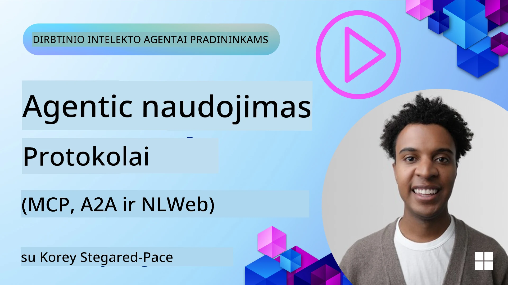
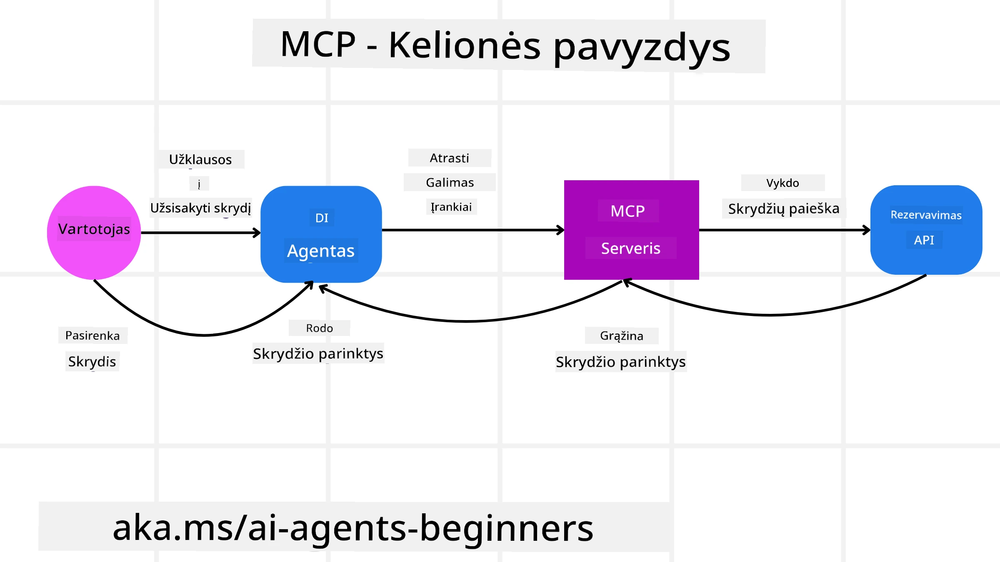
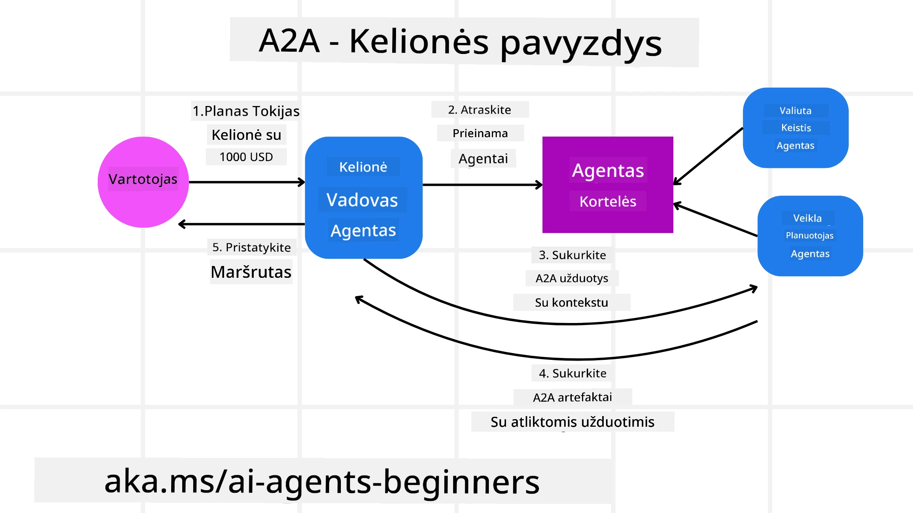
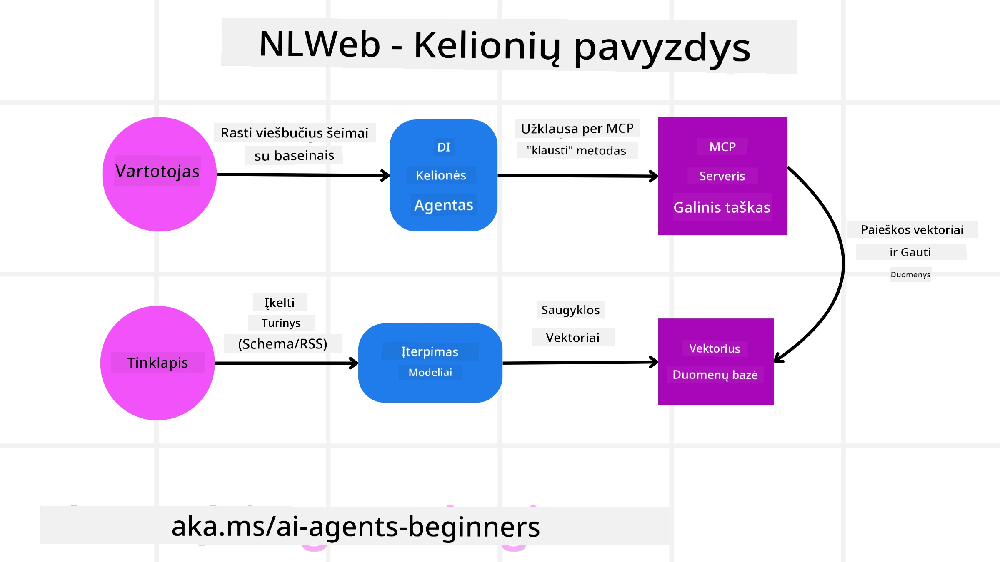

# Agentinių protokolų naudojimas (MCP, A2A ir NLWeb)

> _(Spustelėkite aukščiau esantį vaizdą, kad peržiūrėtumėte šios pamokos vaizdo įrašą)_

Didėjant DI agentų naudojimui, auga ir poreikis protokolams, užtikrinantiems standartizavimą, saugumą ir atvirą inovacijų palaikymą. Šioje pamokoje aptarsime 3 protokolus, siekiančius tenkinti šį poreikį — Modelio konteksto protokolą (MCP), Agentas–agentui (A2A) ir Natūralios kalbos žiniatinklį (NLWeb).

## Įvadas

Šioje pamokoje aptarsime:

• Kaip **MCP** leidžia DI agentams pasiekti išorinius įrankius ir duomenis, kad jie galėtų atlikti vartotojo užduotis.

•  Kaip **A2A** suteikia galimybę bendrauti ir bendradarbiauti tarp skirtingų DI agentų.

• Kaip **NLWeb** prideda natūralios kalbos sąsajas bet kuriai svetainėi, leidžiančias DI agentams atrasti ir sąveikauti su turiniu.

## Mokymosi tikslai

• **Nustatyti** pagrindinį MCP, A2A ir NLWeb tikslą bei naudą DI agentų kontekste.

• **Paaiškinti** kaip kiekvienas protokolas palengvina komunikaciją ir sąveiką tarp LLM, įrankių ir kitų agentų.

• **Atpažinti** skirtingus vaidmenis, kuriuos kiekvienas protokolas atlieka kuriant sudėtingas agentines sistemas.

## Modelio konteksto protokolas

**Modelio konteksto protokolas (MCP)** yra atviras standartas, suteikiantis standartizuotą būdą programoms pateikti kontekstą ir įrankius LLM. Tai leidžia turėti „universalią jungtį“ prie skirtingų duomenų šaltinių ir įrankių, prie kurių DI agentai gali prisijungti nuosekliu būdu.

Pažiūrėkime į MCP komponentus, privalumus, palyginti su tiesioginiu API naudojimu, ir pavyzdį, kaip DI agentai gali naudoti MCP serverį.

### MCP pagrindiniai komponentai

MCP veikia pagal **klientų-serverių architektūrą** ir pagrindiniai komponentai yra:

• **Hosts** yra LLM programos (pavyzdžiui, kodo redaktorius kaip VSCode), kurios inicijuoja ryšius su MCP serveriu.

• **Clients** yra komponentai programos hoste, kurie palaiko vienas prie vieno ryšius su serveriais.

• **Servers** yra lengvos programos, kurios pateikia konkrečias galimybes.

Protokole yra trys pagrindinės primityvos, kurios atspindi MCP serverio galimybes:

• **Tools**: Tai atskiros akcijos ar funkcijos, kurias DI agentas gali iškviesti norėdamas atlikti veiksmą. Pavyzdžiui, orų paslauga gali pateikti "get weather" įrankį, arba e. prekybos serveris gali pateikti "purchase product" įrankį. MCP serveriai savo galimybių sąraše reklamuoja kiekvieno įrankio pavadinimą, aprašymą ir įvesties/išvesties schemą.

• **Resources**: Tai tik skaitymui skirti duomenų elementai ar dokumentai, kuriuos MCP serveris gali suteikti, ir klientai gali juos atsiųsti pagal poreikį. Pavyzdžiai apima failų turinį, duomenų bazės įrašus arba žurnalų failus. Resursai gali būti tekstiniai (pvz., kodas arba JSON) arba dvejetainiai (pvz., vaizdai arba PDF).

• **Prompts**: Tai iš anksto apibrėžti šablonai, kurie pateikia siūlomus užklausimus, leidžiančius sudėtingesnius darbo srautus.

### MCP privalumai

MCP suteikia reikšmingų privalumų DI agentams:

• **Dynamic Tool Discovery**: Agentai gali dinamiškai gauti iš serverio prieinamų įrankių sąrašą kartu su aprašymais, ką jie atlieka. Tai skiriasi nuo tradicinių API, kurios dažnai reikalauja statinio kodavimo integracijoms, o bet koks API pokytis reikalauja kodo atnaujinimų. MCP siūlo „vienkartinės integracijos“ požiūrį, kuris suteikia didesnį prisitaikymą.

• **Interoperability Across LLMs**: MCP veikia su skirtingais LLM, suteikdamas lankstumo keisti pagrindinius modelius, kad būtų įvertinta geresnė veikla.

• **Standardized Security**: MCP apima standartizuotą autentifikavimo metodą, gerinančią mastelį pridėti prieigos prie papildomų MCP serverių. Tai yra paprasčiau nei valdyti skirtingus raktus ir autentifikacijos tipus įvairioms tradicinėms API.

### MCP pavyzdys

Įsivaizduokite, kad vartotojas nori užsisakyti skrydį naudodamas DI asistentą, pagrįstą MCP.

1. **Ryšys**: DI asistentas (MCP klientas) prisijungia prie oro linijų suteikto MCP serverio.

2. **Įrankių atradimas**: Klientas klausia oro linijų MCP serverio: „Kokius įrankius turite?“ Serveris atsako su įrankiais, tokių kaip "search flights" ir "book flights".

3. **Įrankio iškvietimas**: Tuomet prašote DI asistento: „Prašau surasti skrydį iš Portland į Honolulu.“ DI asistentas, naudodamas savo LLM, nustato, kad reikia iškviesti "search flights" įrankį ir perduoda MCP serveriui atitinkamus parametrus (išvykimo vieta, atvykimo vieta).

4. **Vykdymas ir atsakymas**: MCP serveris, veikdamas kaip tarpininkas, atlieka faktinį skambutį į oro linijų vidinį užsakymų API. Tada jis gauna skrydžių informaciją (pvz., JSON duomenis) ir siunčia ją atgal DI asistentui.

5. **Tolimesnė sąveika**: DI asistentas pateikia skrydžių variantus. Kai pasirinksite skrydį, asistentas gali iškviesti "book flight" įrankį tame pačiame MCP serveryje, užbaigdamas rezervaciją.

## Agentas–agentui protokolas (A2A)

Nors MCP orientuojasi į LLM prijungimą prie įrankių, **Agent-to-Agent (A2A) protokolas** žengia žingsnį toliau, leisdamas skirtingiems DI agentams bendrauti ir bendradarbiauti. A2A sujungia DI agentus iš skirtingų organizacijų, aplinkų ir technologinių sričių, kad jie galėtų įgyvendinti bendrą užduotį.

Aptarsime A2A komponentus ir privalumus, taip pat pavyzdį, kaip tai galėtų būti pritaikyta mūsų kelionių aplikacijoje.

### A2A pagrindiniai komponentai

A2A orientuojasi į agentų tarpusavio komunikacijos užtikrinimą ir jų bendrą darbą, kad būtų atlikta vartotojo dalinė užduotis. Kiekvienas protokolo komponentas prisideda prie šio tikslo:

#### Agentų kortelė

Panašiai kaip MCP serveris dalijasi įrankių sąrašu, Agentų kortelėje yra:
- Agento pavadinimas.
- **aprašymas apie bendras užduotis**, kurias jis atlieka.
- **sąrašas konkrečių įgūdžių** su aprašymais, padedančiais kitiems agentams (ar net žmonėms) suprasti, kada ir kodėl jie norėtų iškviesti tą agentą.
- Agento **dabartinis galinio taško URL**.
- Agento **versija** ir **galimybės**, tokios kaip srautiniai atsakymai ir push pranešimai.

#### Agentų vykdytojas

Agentų vykdytojas yra atsakingas už **vartotojo pokalbio konteksto perdavimą nuotoliniam agentui**; nuotoliniam agentui to reikia, kad suprastų, kokia užduotis turi būti atlikta. A2A serveryje agentas naudoja savo didelį kalbos modelį (LLM), kad analizuotų gaunamas užklausas ir vykdytų užduotis, naudodamasis savo vidiniais įrankiais.

#### Artefaktas

Kai nuotolinis agentas užbaigia prašytą užduotį, jo darbo rezultatas sukuriamas kaip artefaktas. Artefaktas **sudėtyje turi agento darbo rezultatą**, **aprašymą, kas buvo atlikta**, ir **teksto kontekstą**, kuris siunčiamas per protokolą. Išsiuntus artefaktą, ryšys su nuotoliniu agentu uždaromas iki tol, kol vėl prireiks.

#### Įvykių eilė

Šis komponentas naudojamas **atnaujinimams tvarkyti ir žinutėms perduoti**. Tai ypač svarbu gamybos sąlygomis agentinėms sistemoms, kad būtų išvengta ryšio tarp agentų uždarymo prieš užduočiai pasibaigiant, ypač kai užduoties atlikimas gali užtrukti ilgiau.

### A2A privalumai

• **Pagerintas bendradarbiavimas**: Leidžia agentams iš skirtingų tiekėjų ir platformų sąveikauti, dalintis kontekstu ir dirbti kartu, palengvindamas sklandžią automatizaciją tarp tradiciškai atskirtų sistemų.

• **Lankstus modelių parinkimas**: Kiekvienas A2A agentas gali pasirinkti, kurį LLM naudoti savo užklausoms aptarnauti, leidžiant optimizuoti ar pritaikyti modelius kiekvienam agentui, skirtingai nuo vieno LLM ryšio kai kuriose MCP scenarijuose.

• **Integruotas autentifikavimas**: Autentifikacija yra integruota tiesiogiai į A2A protokolą, suteikiant stiprią saugumo sistemą agentų sąveikoms.

### A2A pavyzdys

Išplėskime mūsų kelionių rezervavimo scenarijų, bet šįkart naudodami A2A.

1. **Vartotojo užklausa daugiaagentiniam**: Vartotojas bendrauja su „Travel Agent“ A2A klientu/agento, pavyzdžiui, sakydamas: "Prašau užsakyti visą kelionę į Honolulu kitai savaitei, įskaitant skrydžius, viešbutį ir nuomojamą automobilį".

2. **Orkestracija Travel Agent**: Travel Agent gauna šią sudėtingą užklausą. Jis naudoja savo LLM, kad apmąstytų užduotį ir nustatytų, jog reikia sąveikauti su kitais specializuotais agentais.

3. **Komunikacija tarp agentų**: Travel Agent tada naudoja A2A protokolą prisijungti prie tolimesnių agentų, tokių kaip „Avialinijų agentas“, „Viešbučių agentas“ ir „Automobilių nuomos agentas“, kuriuos sukūrė skirtingos įmonės.

4. **Deleguotas užduoties vykdymas**: Travel Agent siunčia konkrečias užduotis šiems specializuotiems agentams (pvz., "Rask skrydžius į Honolulu", "Užsakyti viešbutį", "Išsinuomoti automobilį"). Kiekvienas iš šių specializuotų agentų, naudodami savo LLM ir savo įrankius (kurie patys gali būti MCP serveriai), atlieka savo dalį rezervavimo proceso.

5. **Sujungtas atsakymas**: Kai visi tolimesni agentai užbaigia savo užduotis, Travel Agent sujungia rezultatus (skrydžių duomenis, viešbučio patvirtinimą, automobilio nuomos rezervaciją) ir siunčia vartotojui išsamų, chat formato atsakymą.

## Natūralios kalbos žiniatinklis (NLWeb)

Svetainės jau ilgą laiką buvo pagrindinis būdas, kuriuo vartotojai prieina prie informacijos ir duomenų internete.

Pažiūrėkime į skirtingus NLWeb komponentus, NLWeb privalumus ir pavyzdį, kaip mūsų NLWeb veikia, žvelgiant į mūsų kelionių aplikaciją.

### NLWeb komponentai

- **NLWeb Application (Core Service Code)**: Sistema, apdorojanti natūralios kalbos užklausas. Ji sujungia skirtingas platformos dalis, kad sukurtų atsakymus. Galite galvoti apie ją kaip apie **variklį, kuris varys natūralios kalbos funkcijas** svetainėje.

- **NLWeb Protocol**: Tai **pagrindinių taisyklių rinkinys natūralios kalbos sąveikai** su svetaine. Jis grąžina atsakymus JSON formatu (dažnai naudojant Schema.org). Jo tikslas — sukurti paprastą pagrindą „DI žiniatinkliui“, taip pat, kaip HTML padarė įmanomą dokumentų dalijimąsi internete.

- **MCP Server (Model Context Protocol Endpoint)**: Kiekviena NLWeb konfigūracija taip pat veikia kaip **MCP serveris**. Tai reiškia, kad ji gali **dalintis įrankiais (pvz., „ask“ metodu) ir duomenimis** su kitomis DI sistemomis. Praktikoje tai leidžia svetainės turinį ir galimybes naudoti DI agentams, todėl svetainė tampa didesnės „agentų ekosistemos“ dalimi.

- **Embedding Models**: Šie modeliai naudojami **paversti svetainės turinį skaitmeniniais atvaizdais, vadinamais vektoriais** (embeddings). Šie vektoriai fiksuoja reikšmę taip, kad kompiuteriai galėtų jas palyginti ir ieškoti. Jie saugomi specialioje duomenų bazėje, ir vartotojai gali pasirinkti, kurį embedding modelį jie nori naudoti.

- **Vector Database (Retrieval Mechanism)**: Ši duomenų bazė **saugo svetainės turinio embeddings**. Kai kas nors užduoda klausimą, NLWeb patikrina vektorinę duomenų bazę, kad greitai rastų aktualiausią informaciją. Ji pateikia greitą galimų atsakymų sąrašą, surūšiuotą pagal panašumą. NLWeb veikia su įvairiomis vektorinių duomenų saugyklomis, tokiomis kaip Qdrant, Snowflake, Milvus, Azure AI Search ir Elasticsearch.

### NLWeb pavyzdys

Apsvarstykime vėl mūsų kelionių rezervavimo svetainę, tačiau šįkart ji veikia su NLWeb.

1. **Duomenų įkėlimas**: Kelionių svetainės esami produktų katalogai (pvz., skrydžių sąrašai, viešbučių aprašymai, kelionių paketai) yra suformatuoti naudojant Schema.org arba įkelti per RSS tiekinius. NLWeb įrankiai įtraukia šiuos struktūruotus duomenis, sukuria embeddings ir saugo juos vietinėje arba nuotolinėje vektorinėje duomenų bazėje.

2. **Natūralios kalbos užklausa (žmogus)**: Vartotojas apsilanko svetainėje ir, vietoje naršymo meniu, įrašo pokalbio sąsajoje: "Raskite šeimai tinkamą viešbutį Honolulu su baseinu kitai savaitei".

3. **NLWeb apdorojimas**: NLWeb programa gauna šią užklausą. Ji siunčia užklausą LLM supratimui ir tuo pačiu metu ieško savo vektorinėje duomenų bazėje, kad rastų atitinkamus viešbučių sąrašus.

4. **Tiklūs rezultatai**: LLM padeda interpretuoti paieškos rezultatus iš duomenų bazės, identifikuoti geriausius atitikmenis pagal kriterijus „šeimai tinkamas“, „baseinas“ ir „Honolulu“, ir tuomet suformuoti atsakymą natūralia kalba. Svarbu, kad atsakymas remiasi faktiniais viešbučiais iš svetainės katalogo, vengiant išgalvotos informacijos.

5. **DI agentų sąveika**: Kadangi NLWeb veikia kaip MCP serveris, išorinis DI kelionių agentas taip pat galėtų prisijungti prie šios svetainės NLWeb instancijos. DI agentas tada galėtų naudoti `ask("Are there any vegan-friendly restaurants in the Honolulu area recommended by the hotel?")`. NLWeb instancija apdorotų tai, pasitelkdama savo restoranų informacijos duomenų bazę (jei ji įkelta), ir grąžintų struktūruotą JSON atsakymą.

### Turite daugiau klausimų apie MCP/A2A/NLWeb?

Prisijunkite prie [Microsoft Foundry Discord](https://aka.ms/ai-agents/discord), kad susitiktumėte su kitais besimokančiais, dalyvautumėte konsultacijose ir gautumėte atsakymus į savo DI agentų klausimus.

## Resursai

- [MCP for Beginners](https://aka.ms/mcp-for-beginners)  
- [MCP Documentation](https://learn.microsoft.com/python/api/overview/azure/ai-projects-readme)
- [NLWeb Repo](https://github.com/nlweb-ai/NLWeb)
- [Microsoft Agent Framework](https://aka.ms/ai-agents-beginners/agent-framewrok)

---

<!-- CO-OP TRANSLATOR DISCLAIMER START -->
Atsakomybės apribojimas:
Šis dokumentas buvo išverstas naudojant dirbtinio intelekto vertimo paslaugą [Co-op Translator](https://github.com/Azure/co-op-translator). Nors siekiame tikslumo, atkreipkite dėmesį, kad automatizuoti vertimai gali turėti klaidų arba netikslumų. Originalus dokumentas jo gimtąja kalba turėtų būti laikomas autoritetingu šaltiniu. Dėl svarbios informacijos rekomenduojamas profesionalus, žmogaus atliekamas vertimas. Mes neatsakome už jokius nesusipratimus ar neteisingas interpretacijas, kylančias dėl šio vertimo naudojimo.
<!-- CO-OP TRANSLATOR DISCLAIMER END -->