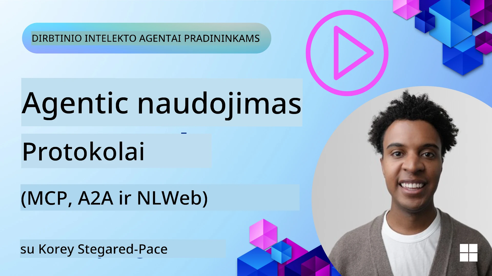
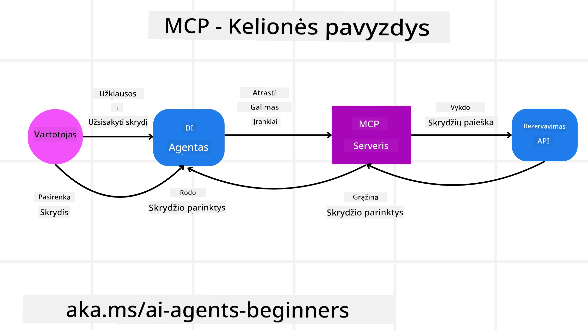
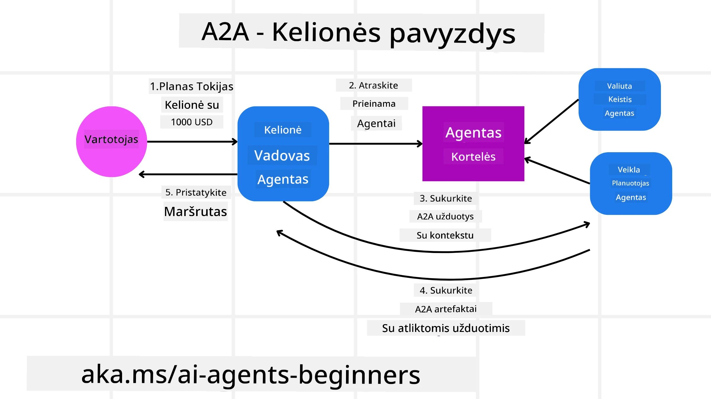
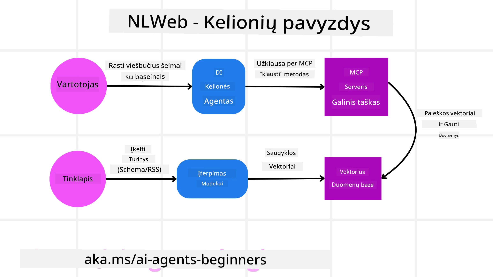

# Agentinių protokolų naudojimas (MCP, A2A ir NLWeb)

> _(Spustelėkite aukščiau esantį paveikslėlį, kad peržiūrėtumėte šios pamokos vaizdo įrašą)_

Kuo labiau auga AI agentų naudojimas, tuo didesnis poreikis protokolams, užtikrinantiems standartizavimą, saugumą ir palaikymą atvirajai inovacijai. Šioje pamokoje aptarsime 3 protokolus, siekiančius patenkinti šį poreikį – Model Context Protocol (MCP), Agent to Agent (A2A) ir Natural Language Web (NLWeb).

## Įvadas

Šioje pamokoje aptarsime:

• Kaip **MCP** leidžia AI agentams pasiekti išorinius įrankius ir duomenis, kad atliktų vartotojo užduotis.

• Kaip **A2A** leidžia skirtingiems AI agentams bendrauti ir bendradarbiauti.

• Kaip **NLWeb** suteikia natūralios kalbos sąsajas bet kurioje svetainėje, leidžiančias AI agentams atrasti ir sąveikauti su turiniu.

## Mokymosi tikslai

• **Nustatyti** pagrindinę MCP, A2A ir NLWeb paskirtį ir naudą AI agentų kontekste.

• **Paaiškinti**, kaip kiekvienas protokolas palengvina komunikaciją ir sąveiką tarp LLM, įrankių ir kitų agentų.

• **Atpažinti** skirtingas kiekvieno protokolo funkcijas sudarant sudėtingas agentines sistemas.

## Model Context Protocol

**Model Context Protocol (MCP)** yra atviras standartas, kuris suteikia standartizuotą būdą programoms pateikti kontekstą ir įrankius LLM. Tai leidžia sukurti „universalų adapterį“ prie skirtingų duomenų šaltinių ir įrankių, prie kurių AI agentai gali prisijungti vienodu būdu.

Pažiūrėkime MCP komponentus, privalumus, palyginus su tiesioginiu API naudojimu, ir pavyzdį, kaip AI agentai gali naudoti MCP serverį.

### MCP pagrindiniai komponentai

MCP veikia pagal **klientų-serverių architektūrą**, o pagrindiniai komponentai yra:

• **Šeimininkai** yra LLM programos (pvz., VSCode kodo redaktorius), kurios pradeda ryšius su MCP serveriu.

• **Klientai** yra komponentai šeimininko programoje, palaikantys vienas prie vieno ryšius su serveriais.

• **Serveriai** yra lengvos programos, atskleidžiančios tam tikras galimybes.

Protokole yra trys pagrindinės prigimtinės savybės – tai MCP serverio galimybės:

• **Įrankiai**: Tai atskiros veiksmų ar funkcijų operacijos, kurias AI agentas gali iškviesti atlikti veiksmui. Pavyzdžiui, orų tarnyba gali pateikti „gauti orą“ įrankį, o elektroninės prekybos serveris gali pasiūlyti „įsigyti produktą“ įrankį. MCP serveriai skelbia kiekvieno įrankio pavadinimą, aprašymą ir įvesties/išvesties schemas savo galimybių sąraše.

• **Ištekliai**: Tai tik skaitymui skiriami duomenų elementai ar dokumentai, kuriuos MCP serveris gali teikti, ir klientai juos gali gauti pagal poreikį. Pavyzdžiai apima failų turinį, duomenų bazės įrašus ar žurnalo failus. Ištekliai gali būti tekstiniai (pvz., kodas ar JSON) arba dvejetainiai (pvz., vaizdai ar PDF).

• **Raginimai**: Tai iš anksto apibrėžti šablonai, siūlantys pasiūlymus, leidžiančius kurti sudėtingesnius darbo eigas.

### MCP privalumai

MCP suteikia reikšmingų pranašumų AI agentams:

• **Dinaminis įrankių atradimas**: Agentai gali dinamiškai gauti sąrašą prieinamų įrankių iš serverio kartu su aprašymais, ką jie daro. Tai skiriasi nuo tradicinių API, kurioms dažnai reikalingas statinis kodo integravimas, o bet koks API pakeitimas reikalauja kodo atnaujinimų. MCP siūlo „integruok vieną kartą“ požiūrį, leidžiantį didesnį lankstumą.

• **Suderinamumas tarp LLM**: MCP veikia per skirtingus LLM, suteikdamas galimybę keisti pagrindinius modelius geresniam veikimui įvertinti.

• **Standartizuotas saugumas**: MCP apima standartinį autentifikavimo metodą, pagerinantį mastelį pridedant prieigą prie papildomų MCP serverių. Tai paprasčiau nei valdyti skirtingus raktus ir autentifikavimo tipus tradiciniams API.

### MCP pavyzdys

Įsivaizduokite vartotoją, norintį rezervuoti skrydį naudodamasis AI asistentu, pagrįstu MCP.

1. **Ryšys**: AI asistentas (MCP klientas) jungiasi prie MCP serverio, kurį teikia oro linijų bendrovė.

2. **Įrankių atradimas**: Klientas paklausia oro linijų MCP serverio: „Kokius įrankius turite?“ Serveris atsako įrankiais, pvz., „ieškoti skrydžių“ ir „rezervuoti skrydžius“.

3. **Įrankio iškvietimas**: Tuomet vartotojas liepia AI asistentui: „Prašau ieškoti skrydžio iš Portlando į Honolulą“. AI asistentas, naudodamas savo LLM, nustato, kad reikia iškviesti „ieškoti skrydžių“ įrankį ir perduoda atitinkamus parametrus (išskridimas, paskirties vieta) MCP serveriui.

4. **Vykdymas ir atsakymas**: MCP serveris, veikiantis kaip apvalkalas, atlieka faktinį kvietimą oro linijų vidiniam užsakymų API. Tada gauna skrydžio informaciją (pvz., JSON duomenis) ir siunčia ją atgal AI asistentui.

5. **Tolimesnė sąveika**: AI asistentas pateikia skrydžio parinktis. Kai vartotojas pasirenka skrydį, asistentas gali iškviesti „rezervuoti skrydį“ įrankį tame pačiame MCP serveryje ir užbaigti rezervaciją.

## Agentas-agentui protokolas (A2A)

Nors MCP koncentruojasi į LLM ryšį su įrankiais, **Agentas-agentui (A2A) protokolas** eina žingsnį toliau, leidžiant komunikaciją ir bendradarbiavimą tarp skirtingų AI agentų. A2A sujungia AI agentus iš skirtingų organizacijų, aplinkų ir technologijų, kad atliktų bendrą užduotį.

Apžvelgsime A2A komponentus ir privalumus bei pavyzdį, kaip tai galėtų būti pritaikyta mūsų kelionių programėlėje.

### A2A pagrindiniai komponentai

A2A leidžia agentams bendrauti ir kartu atlikti vartotojo dalinę užduotį. Kiekvienas protokolo komponentas prie to prisideda:

#### Agentų kortelė

Panašiai kaip MCP serveris pateikia įrankių sąrašą, Agentų kortelė turi:
- Agento pavadinimą.
- **bendrų užduočių aprašymą**, kurias jis atlieka.
- **konkrečių įgūdžių sąrašą** su aprašymais, padedančiais kitiems agentams (ar net žmogiškiems vartotojams) suprasti, kada ir kodėl kreiptis į tą agentą.
- Agento **esamą galinio taško URL**.
- Agento **versiją** ir **galimybes** (pvz., transliacijos atsakymus ir push pranešimus).

#### Agentų vykdytojas

Agentų vykdytojas yra atsakingas už **vartotojo pokalbio konteksto perdavimą nuotoliniam agentui**, nes nuotolinis agentas turi suprasti, kokia užduotis turi būti atlikta. A2A serveryje agentas naudoja savo LLM ateinančių užklausų interpretavimui ir užduotims atlikti su savo vidiniais įrankiais.

#### Artefaktas

Kai nuotolinis agentas atlieka užduotį, sukuriamas darbo produktas – artefaktas. Artefaktas **saugo agento darbo rezultatą**, **aprašo, kas buvo atlikta**, ir tekstinį kontekstą, perduotą protokolu. Po artefakto siuntimo ryšys su nuotoliniu agentu uždaromas iki tol, kol vėl bus reikalingas.

#### Įvykių eilė

Ši dalis naudojama **atnaujinimams valdyti ir pranešimų perdavimui**. Tai ypač svarbu agentinėse sistemose gamyboje, kad ryšys tarp agentų nebūtų uždarytas anksčiau nei užduotis būtų atlikta, ypač kai užduotims atlikti prireikia ilgesnio laiko.

### A2A privalumai

• **Pagerintas bendradarbiavimas**: Leidžia agentams iš skirtingų tiekėjų ir platformų bendrauti, dalintis kontekstu ir dirbti kartu, sklandžiai automatizuojant procesus tarp tradiciškai atskirtų sistemų.

• **Modelių pasirinkimo lankstumas**: Kiekvienas A2A agentas gali pasirinkti, kurį LLM naudoti aptarnauti savo užklausas, leidžiant optimizuotus ar specialiai pritaikytus modelius agentui, skirtingai nei vieno LLM ryšys kai kuriuose MCP scenarijuose.

• **Įmontuota autentifikacija**: Autentifikacija tiesiogiai integruota į A2A protokolą, užtikrinant stiprų saugumo pagrindą agentų sąveikai.

### A2A pavyzdys

Išplėskime mūsų kelionių užsakymo scenarijų, tačiau šįkart naudodami A2A.

1. **Vartotojo užklausa daugiaagentiniam**: Vartotojas bendrauja su „Travel Agent“ A2A klientu/agentu, tarkime, sakydamas: „Prašau užsakyti visą kelionę į Honolulą kitai savaitei, įskaitant skrydžius, viešbutį ir automobilio nuomą“.

2. **Kelionių agento orkestracija**: Kelionių agentas gauna sudėtingą užklausą. Naudoja savo LLM užduoties analizei ir nusprendžia, kad reikia bendrauti su kitais specializuotais agentais.

3. **Agentų komunikacija**: Kelionių agentas tada naudoja A2A protokolą, kad prisijungtų prie žemesnio lygio agentų, tokių kaip „Oro linijų agentas“, „Viešbučio agentas“ ir „Automobilio nuomos agentas“, sukurtų skirtingų įmonių.

4. **Užduočių delegavimas**: Kelionių agentas siunčia konkrečias užduotis šiems specializuotiems agentams (pvz., „Rask skrydžius į Honolulą“, „Užsakyti viešbutį“, „Išsinuomoti automobilį“). Kiekvienas specializuotas agentas, naudodamas savo LLM ir savo įrankius (kurie gali būti patys MCP serveriai), atlieka savo dalį užsakymo.

5. **Sujungtas atsakymas**: Kai visi agentai baigia savo užduotis, Kelionių agentas sujungia rezultatus (skrydžių duomenys, viešbučio patvirtinimas, automobilio nuoma) ir pateikia vartotojui išsamų, pokalbio formato atsakymą.

## Natūralios kalbos internetas (NLWeb)

Svetainės jau ilgą laiką yra pagrindinis būdas vartotojams pasiekti informaciją ir duomenis internete.

Pažiūrėkime skirtingus NLWeb komponentus, NLWeb privalumus ir pavyzdį, kaip mūsų kelionių programa veikia su NLWeb.

### NLWeb komponentai

- **NLWeb programa (pagrindinis servisų kodas)**: Sistema, kuri apdoroja natūralios kalbos klausimus. Ji sujungia platformos dalis, kad sukurtų atsakymus. Galima įsivaizduoti kaip **variklį, kuris varo natūralios kalbos funkcijas** svetainėje.

- **NLWeb protokolas**: Tai **pagrindinių taisyklių rinkinys natūralaus kalbos sąveikai** su svetaine. Atsakymai siunčiami JSON formatu (dažnai naudojant Schema.org). Jo tikslas – sukurti paprastą pagrindą „AI internetui“, panašiai kaip HTML leido dalintis dokumentais internete.

- **MCP serveris (Model Context Protocol galinis taškas)**: Kiekviena NLWeb nustatyta aplinka taip pat veikia kaip **MCP serveris**. Tai reiškia, kad ji gali **dalintis įrankiais (pvz., „ask“ funkcija) ir duomenimis** su kitomis AI sistemomis. Praktikoje tai leidžia svetainės turinį ir galimybes naudoti AI agentams, padarant svetainę dalimi platesnės „agentų ekosistemos“.

- **Embedding modeliai**: Šie modeliai naudojami **paversti svetainės turinį į skaitmeninius atvaizdus, vadinamus vektoriais (embeddingais)**. Šie vektoriai fiksuoja prasmę taip, kad kompiuteriai gali lyginti ir ieškoti. Jie saugomi specialioje duomenų bazėje, ir vartotojai gali rinktis, kurį embedding modelį naudoti.

- **Vektorinė duomenų bazė (paieškos mechanizmas)**: Ši duomenų bazė **saugo svetainės turinio embeddingus**. Kai kas nors užduoda klausimą, NLWeb patikrina vektorinę bazę, kad greitai surastų svarbiausią informaciją. Ji pateikia greitą sąrašą galimų atsakymų, surikiuotų pagal panašumą. NLWeb veikia su skirtingomis vektorinėmis saugyklomis, pvz., Qdrant, Snowflake, Milvus, Azure AI Search ir Elasticsearch.

### NLWeb pavyzdžiu

Vėl apsvarstykime mūsų kelionių užsakymo svetainę, tačiau šįkart ji veikia su NLWeb.

1. **Duomenų įkėlimas**: Kelionių svetainės esami produktų katalogai (pvz., skrydžių sąrašai, viešbučių aprašymai, turų paketai) formatuojami pagal Schema.org arba įkelti per RSS srautus. NLWeb įrankiai surenka šiuos struktūruotus duomenis, sukuria embeddingus ir saugo juos vietinėje ar nuotolinėje vektorinėje duomenų bazėje.

2. **Natūralios kalbos užklausa (žmogus)**: Vartotojas lankosi svetainėje ir vietoje meniu naršymo rašo pokalbio sąsajoje: „Raskite man šeimai draugišką viešbutį Honolule su baseinu kitai savaitei“.

3. **NLWeb apdorojimas**: NLWeb programa gauna šią užklausą. Ji siunčia užklausą LLM supratimui ir vienu metu ieško savo vektorinėje duomenų bazėje atitinkamų viešbučių sąrašų.

4. **Tikslūs rezultatai**: LLM padeda interpretuoti paieškos rezultatus iš duomenų bazės, nustato geriausius atitikmenis pagal kriterijus „šeimai draugiškas“, „baseinas“ ir „Honolulu“, tada suformuoja natūralios kalbos atsakymą. Svarbu, kad atsakymas remiasi tikrais viešbučiais iš svetainės katalogo, vengiant išgalvotos informacijos.

5. **AI agentų sąveika**: Kadangi NLWeb veikia kaip MCP serveris, išorinis AI kelionių agentas taip pat galėtų prisijungti prie šios svetainės NLWeb versijos. AI agentas galėtų naudoti `ask` MCP metodą užklausti svetainę tiesiogiai: `ask("Ar yra viešbučio rekomenduojamų veganiškų restoranų Honolulu rajone?")`. NLWeb apdorotų šią užklausą naudodama savo restoranų informacijos duomenų bazę (jei ji įkelta) ir grąžintų struktūruotą JSON atsakymą.

### Turite daugiau klausimų apie MCP/A2A/NLWeb?

Prisijunkite prie [Microsoft Foundry Discord](https://discord.com/invite/ATgtXmAS5D), kad susitikti su kitais besimokančiais, dalyvauti paskaitų valandose ir gauti atsakymus į savo klausimus apie AI agentus.

## Ištekliai

- [MCP pradedantiesiems](https://aka.ms/mcp-for-beginners)  
- [MCP dokumentacija](https://learn.microsoft.com/python/api/overview/azure/ai-projects-readme)
- [NLWeb saugykla](https://github.com/nlweb-ai/NLWeb)
- [Microsoft Agent Framework](https://learn.microsoft.com/en-us/agent-framework/overview/?wt.mc_id=youtube_26688_organicsocial_reactor&pivots=programming-language-python)

## Ankstesnė pamoka

[AI agentai gamyboje](../10-ai-agents-production/README.md)

## Kitoji pamoka

[Konteksto inžinerija AI agentams](../12-context-engineering/README.md)

---

<!-- CO-OP TRANSLATOR DISCLAIMER START -->
**Atsakomybės apribojimas**:
Šis dokumentas buvo išverstas naudojant dirbtinio intelekto vertimo paslaugą [Co-op Translator](https://github.com/Azure/co-op-translator). Nors siekiame tikslumo, prašome atkreipti dėmesį, kad automatiniai vertimai gali turėti klaidų ar netikslumų. Originalus dokumentas jo gimtąja kalba laikomas autoritetingu šaltiniu. Svarbiai informacijai rekomenduojama naudoti profesionalų žmogiškąjį vertimą. Mes neatsakome už jokius nesusipratimus ar neteisingą interpretaciją, kilusią naudojantis šiuo vertimu.
<!-- CO-OP TRANSLATOR DISCLAIMER END -->