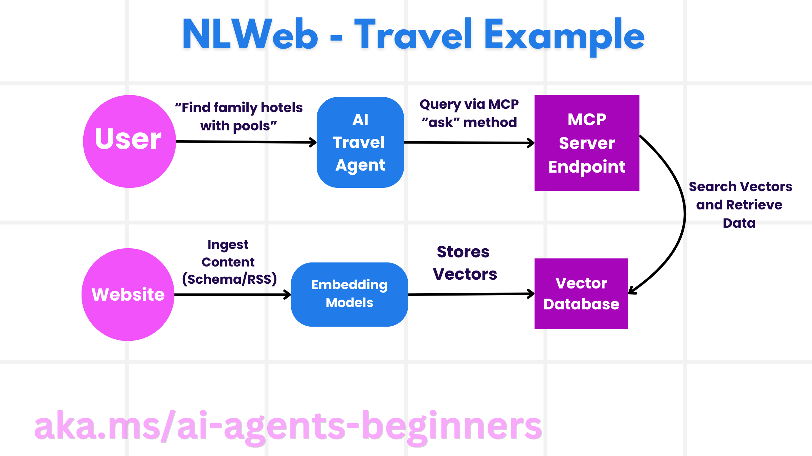

<!--
CO_OP_TRANSLATOR_METADATA:
{
  "original_hash": "f6600bebb86f72f3f62a9163fcce9566",
  "translation_date": "2025-08-30T10:12:34+00:00",
  "source_file": "11-agentic-protocols/README.md",
  "language_code": "lt"
}
-->
# Naudojant Agentinius Protokolus (MCP, A2A ir NLWeb)

Didėjant dirbtinio intelekto agentų naudojimui, auga ir poreikis protokolams, kurie užtikrintų standartizaciją, saugumą ir palaikytų atvirą inovaciją. Šioje pamokoje aptarsime 3 protokolus, siekiančius patenkinti šį poreikį – Modelio Konteksto Protokolą (MCP), Agentas Agentui (A2A) ir Natūralios Kalbos Internetą (NLWeb).

## Įvadas

Šioje pamokoje aptarsime:

• Kaip **MCP** leidžia dirbtinio intelekto agentams pasiekti išorinius įrankius ir duomenis, kad atliktų vartotojo užduotis.

• Kaip **A2A** suteikia galimybę skirtingiems dirbtinio intelekto agentams bendrauti ir bendradarbiauti.

• Kaip **NLWeb** suteikia natūralios kalbos sąsajas bet kuriai svetainei, leidžiant dirbtinio intelekto agentams atrasti ir sąveikauti su turiniu.

## Mokymosi tikslai

• **Identifikuoti** pagrindinę MCP, A2A ir NLWeb paskirtį bei naudą dirbtinio intelekto agentų kontekste.

• **Paaiškinti**, kaip kiekvienas protokolas palengvina komunikaciją ir sąveiką tarp LLM, įrankių ir kitų agentų.

• **Atpažinti** skirtingus vaidmenis, kuriuos kiekvienas protokolas atlieka kuriant sudėtingas agentines sistemas.

## Modelio Konteksto Protokolas

**Modelio Konteksto Protokolas (MCP)** yra atviras standartas, kuris suteikia standartizuotą būdą programoms pateikti kontekstą ir įrankius LLM. Tai leidžia sukurti „universalią jungtį“ skirtingiems duomenų šaltiniams ir įrankiams, prie kurių dirbtinio intelekto agentai gali prisijungti nuosekliai.

Pažvelkime į MCP komponentus, naudą, palyginti su tiesioginiu API naudojimu, ir pavyzdį, kaip dirbtinio intelekto agentai gali naudoti MCP serverį.

### MCP Pagrindiniai Komponentai

MCP veikia pagal **kliento-serverio architektūrą**, o pagrindiniai komponentai yra:

• **Hostai** – tai LLM programos (pvz., kodų redaktorius kaip VSCode), kurios inicijuoja ryšius su MCP serveriu.

• **Klientai** – tai komponentai hosto programoje, kurie palaiko vienas su vienu ryšius su serveriais.

• **Serveriai** – tai lengvos programos, kurios teikia specifines galimybes.

Protokole yra trys pagrindiniai primityvai, kurie apibrėžia MCP serverio galimybes:

• **Įrankiai**: Tai atskiros funkcijos ar veiksmai, kuriuos dirbtinio intelekto agentas gali iškviesti, kad atliktų veiksmą. Pavyzdžiui, orų tarnyba gali pateikti „gauti orus“ įrankį, o e. prekybos serveris – „pirkti produktą“ įrankį. MCP serveriai reklamuoja kiekvieno įrankio pavadinimą, aprašymą ir įvesties/išvesties schemą savo galimybių sąraše.

• **Ištekliai**: Tai tik skaitymui skirti duomenų elementai ar dokumentai, kuriuos MCP serveris gali pateikti, o klientai gali juos gauti pagal poreikį. Pavyzdžiai: failų turinys, duomenų bazės įrašai ar žurnalų failai. Ištekliai gali būti tekstiniai (pvz., kodas ar JSON) arba dvejetainiai (pvz., vaizdai ar PDF).

• **Šablonai**: Tai iš anksto paruošti šablonai, kurie pateikia siūlomus raginimus, leidžiantys sudėtingesnius darbo procesus.

### MCP Nauda

MCP suteikia reikšmingų privalumų dirbtinio intelekto agentams:

• **Dinaminis Įrankių Atradimas**: Agentai gali dinamiškai gauti sąrašą galimų įrankių iš serverio kartu su jų aprašymais. Tai skiriasi nuo tradicinių API, kurios dažnai reikalauja statinio kodavimo integracijoms, o bet kokie API pakeitimai reikalauja kodo atnaujinimų. MCP siūlo „integruoti vieną kartą“ požiūrį, kuris užtikrina didesnį prisitaikymą.

• **Suderinamumas Tarp LLM**: MCP veikia su skirtingais LLM, suteikdamas lankstumą keisti pagrindinius modelius, kad būtų galima įvertinti geresnį našumą.

• **Standartizuotas Saugumas**: MCP apima standartizuotą autentifikavimo metodą, kuris palengvina mastelio didinimą, kai pridedama prieiga prie papildomų MCP serverių. Tai paprasčiau nei valdyti skirtingus raktus ir autentifikavimo tipus įvairiems tradiciniams API.

### MCP Pavyzdys

Įsivaizduokite, kad vartotojas nori užsisakyti skrydį naudodamas dirbtinio intelekto asistentą, kuris naudoja MCP.

1. **Ryšys**: Dirbtinio intelekto asistentas (MCP klientas) prisijungia prie MCP serverio, kurį teikia oro linijos.

2. **Įrankių Atradimas**: Klientas klausia oro linijų MCP serverio: „Kokius įrankius turite?“ Serveris atsako su tokiais įrankiais kaip „ieškoti skrydžių“ ir „užsisakyti skrydžius“.

3. **Įrankio Iškvietimas**: Tada jūs paprašote dirbtinio intelekto asistento: „Prašau surasti skrydį iš Portlando į Honolulu.“ Dirbtinio intelekto asistentas, naudodamas savo LLM, nustato, kad reikia iškviesti „ieškoti skrydžių“ įrankį ir perduoda atitinkamus parametrus (išvykimo vieta, paskirties vieta) MCP serveriui.

4. **Vykdymas ir Atsakymas**: MCP serveris, veikiantis kaip apvalkalas, atlieka faktinį skambutį į oro linijų vidinį rezervavimo API. Tada jis gauna skrydžio informaciją (pvz., JSON duomenis) ir siunčia ją atgal dirbtinio intelekto asistentui.

5. **Tolimesnė Sąveika**: Dirbtinio intelekto asistentas pateikia skrydžio pasirinkimus. Kai pasirenkate skrydį, asistentas gali iškviesti „užsisakyti skrydį“ įrankį tame pačiame MCP serveryje, užbaigdamas rezervaciją.

## Agentas Agentui Protokolas (A2A)

Nors MCP orientuojasi į LLM ryšį su įrankiais, **Agentas Agentui (A2A) protokolas** žengia dar toliau, suteikdamas galimybę skirtingiems dirbtinio intelekto agentams bendrauti ir bendradarbiauti. A2A jungia dirbtinio intelekto agentus iš skirtingų organizacijų, aplinkų ir technologijų, kad atliktų bendrą užduotį.

Aptarsime A2A komponentus ir naudą, kartu su pavyzdžiu, kaip jis galėtų būti pritaikytas mūsų kelionių programoje.

### A2A Pagrindiniai Komponentai

A2A orientuojasi į agentų komunikacijos galimybes ir jų bendradarbiavimą atliekant vartotojo užduoties dalį. Kiekvienas protokolo komponentas prisideda prie šio proceso:

#### Agentų Kortelė

Panašiai kaip MCP serveris dalijasi įrankių sąrašu, Agentų Kortelė turi:
    ◦ Agentų pavadinimą.  
    ◦ **Bendros užduočių aprašymą**, kurias jis atlieka.  
    ◦ **Specifinių įgūdžių sąrašą** su aprašymais, padedančiais kitiems agentams (ar net žmonėms) suprasti, kada ir kodėl jie norėtų iškviesti tą agentą.  
    ◦ **Dabartinį agento URL adresą**.  
    ◦ **Versiją** ir **galimybes**, tokias kaip srautinių atsakymų ir pranešimų siuntimas.

#### Agentų Vykdytojas

Agentų Vykdytojas yra atsakingas už **vartotojo pokalbio konteksto perdavimą nuotoliniam agentui**, kad šis suprastų, kokią užduotį reikia atlikti. A2A serveryje agentas naudoja savo LLM, kad analizuotų gaunamus prašymus ir vykdytų užduotis naudodamas savo vidinius įrankius.

#### Artefaktas

Kai nuotolinis agentas užbaigia prašomą užduotį, jo darbo produktas sukuriamas kaip artefaktas. Artefaktas **turi agento atlikto darbo rezultatą**, **aprašymą, kas buvo atlikta**, ir **tekstinį kontekstą**, kuris perduodamas per protokolą. Po artefakto perdavimo ryšys su nuotoliniu agentu uždaromas, kol jo vėl prireikia.

#### Įvykių Eilė

Šis komponentas naudojamas **atnaujinimų tvarkymui ir pranešimų perdavimui**. Tai ypač svarbu gamyboje agentinėms sistemoms, kad ryšys tarp agentų nebūtų uždaromas prieš užduoties užbaigimą, ypač kai užduoties atlikimo laikas gali būti ilgesnis.

### A2A Nauda

• **Pagerintas Bendradarbiavimas**: Tai leidžia agentams iš skirtingų tiekėjų ir platformų bendrauti, dalintis kontekstu ir dirbti kartu, palengvinant sklandžią automatizaciją tarp tradiciškai nesusijusių sistemų.

• **Modelio Pasirinkimo Lankstumas**: Kiekvienas A2A agentas gali nuspręsti, kurį LLM naudoti savo prašymams aptarnauti, leidžiant optimizuoti ar pritaikyti modelius kiekvienam agentui, skirtingai nei vieno LLM ryšys kai kuriose MCP situacijose.

• **Integruotas Autentifikavimas**: Autentifikavimas tiesiogiai integruotas į A2A protokolą, suteikiant tvirtą saugumo sistemą agentų sąveikai.

### A2A Pavyzdys

Išplėskime mūsų kelionių rezervavimo scenarijų, bet šį kartą naudodami A2A.

1. **Vartotojo Prašymas Multi-Agentui**: Vartotojas bendrauja su „Kelionių Agentu“ A2A klientu/agentu, galbūt sakydamas: „Prašau užsakyti visą kelionę į Honolulu kitai savaitei, įskaitant skrydžius, viešbutį ir automobilio nuomą“.

2. **Kelionių Agentas Orkestruoja**: Kelionių Agentas gauna šį sudėtingą prašymą. Jis naudoja savo LLM, kad suprastų užduotį ir nustatytų, jog reikia bendrauti su kitais specializuotais agentais.

3. **Tarpagentinė Komunikacija**: Kelionių Agentas tada naudoja A2A protokolą, kad prisijungtų prie žemyninių agentų, tokių kaip „Oro Linijų Agentas“, „Viešbučių Agentas“ ir „Automobilių Nuomos Agentas“, kurie sukurti skirtingų kompanijų.

4. **Deleguotas Užduočių Vykdymas**: Kelionių Agentas siunčia specifines užduotis šiems specializuotiems agentams (pvz., „Rasti skrydžius į Honolulu“, „Rezervuoti viešbutį“, „Išsinuomoti automobilį“). Kiekvienas iš šių specializuotų agentų, naudodamas savo LLM ir savo įrankius (kurie gali būti MCP serveriai), atlieka savo specifinę rezervavimo dalį.

5. **Apibendrintas Atsakymas**: Kai visi žemyniniai agentai užbaigia savo užduotis, Kelionių Agentas sudaro rezultatus (skrydžio detales, viešbučio patvirtinimą, automobilio nuomos rezervaciją) ir pateikia išsamų, pokalbio stiliaus atsakymą vartotojui.

## Natūralios Kalbos Internetas (NLWeb)

Svetainės jau seniai yra pagrindinis būdas vartotojams pasiekti informaciją ir duomenis internete.

Pažvelkime į skirtingus NLWeb komponentus, NLWeb naudą ir pavyzdį, kaip NLWeb veikia mūsų kelionių programoje.

### NLWeb Komponentai

- **NLWeb Programėlė (Pagrindinis Paslaugos Kodas)**: Sistema, kuri apdoroja natūralios kalbos klausimus. Ji jungia skirtingas platformos dalis, kad sukurtų atsakymus. Galite ją laikyti **varikliu, kuris maitina natūralios kalbos funkcijas** svetainėje.

- **NLWeb Protokolas**: Tai **pagrindinis taisyklių rinkinys natūralios kalbos sąveikai** su svetaine. Jis grąžina atsakymus JSON formatu (dažnai naudojant Schema.org). Jo tikslas – sukurti paprastą pagrindą „AI Internetui“, taip kaip HTML leido dalintis dokumentais internete.

- **MCP Serveris (Modelio Konteksto Protokolo Galinis Taškas)**: Kiekviena NLWeb konfigūracija taip pat veikia kaip **MCP serveris**. Tai reiškia, kad ji gali **dalintis įrankiais (pvz., „klausti“ metodu) ir duomenimis** su kitomis dirbtinio intelekto sistemomis. Praktikoje tai leidžia svetainės turinį ir galimybes naudoti dirbtinio intelekto agentams, leidžiant svetainei tapti platesnės „agentų ekosistemos“ dalimi.

- **Įterpimo Modeliai**: Šie modeliai naudojami **konvertuoti svetainės turinį į skaitines reprezentacijas, vadinamas vektoriais** (įterpimai). Šie vektoriai užfiksuoja prasmę taip, kad kompiuteriai galėtų palyginti ir ieškoti. Jie saugomi specialioje duomenų bazėje, o vartotojai gali pasirinkti, kurį įterpimo modelį naudoti.

- **Vektorinė Duomenų Bazė (Paieškos Mechanizmas)**: Ši duomenų bazė **saugo svetainės turinio įterpimus**. Kai kas nors užduoda klausimą, NLWeb patikrina vektorinę duomenų bazę, kad greitai rastų tinkamiausią informaciją. Ji pateikia greitą galimų atsakymų sąrašą, surūšiuotą pagal panašumą. NLWeb veikia su skirtingomis vektorinėmis saugojimo sistemomis, tokiomis kaip Qdrant, Snowflake, Milvus, Azure AI Search ir Elasticsearch.

### NLWeb Pavyzdys

Apsvarstykime mūsų kelionių rezervavimo svetainę, bet šį kartą ji veikia su NLWeb.

1. **Duomenų Įkėlimas**: Kelionių svetainės esami produktų katalogai (pvz., skrydžių sąrašai, viešbučių aprašymai, kelionių paketai) formatuojami naudojant Schema.org arba įkeliami per RSS kanalus. NLWeb įrankiai įkelia šiuos struktūrizuotus duomenis, sukuria įterpimus ir saugo juos vietinėje arba nuotolinėje vektorinėje duomenų bazėje.

2. **Natūralios Kalbos Užklausa (Žmogus)**: Vartotojas apsilanko svetainėje ir, užuot naršęs meniu, įveda į pokalbio sąsają: „Suraskite man šeimai draugišką viešbutį Honolulu su baseinu kitai savaitei“.

3. **NLWeb Apdorojimas**: NLWeb programėlė gauna šią užklausą. Ji siunčia užklausą LLM, kad suprastų, ir tuo pačiu metu ieško savo vektorinėje duomenų bazėje tinkamų viešbučių sąrašų.

4. **Tikslūs Rezultatai**: LLM padeda interpretuoti paieškos rezultatus iš duomenų bazės, nustatyti geriausius atitikmenis pagal „šeimai draugišk

---

**Atsakomybės apribojimas**:  
Šis dokumentas buvo išverstas naudojant AI vertimo paslaugą [Co-op Translator](https://github.com/Azure/co-op-translator). Nors siekiame tikslumo, prašome atkreipti dėmesį, kad automatiniai vertimai gali turėti klaidų ar netikslumų. Originalus dokumentas jo gimtąja kalba turėtų būti laikomas autoritetingu šaltiniu. Kritinei informacijai rekomenduojama profesionali žmogaus vertimo paslauga. Mes neprisiimame atsakomybės už nesusipratimus ar klaidingus interpretavimus, atsiradusius naudojant šį vertimą.