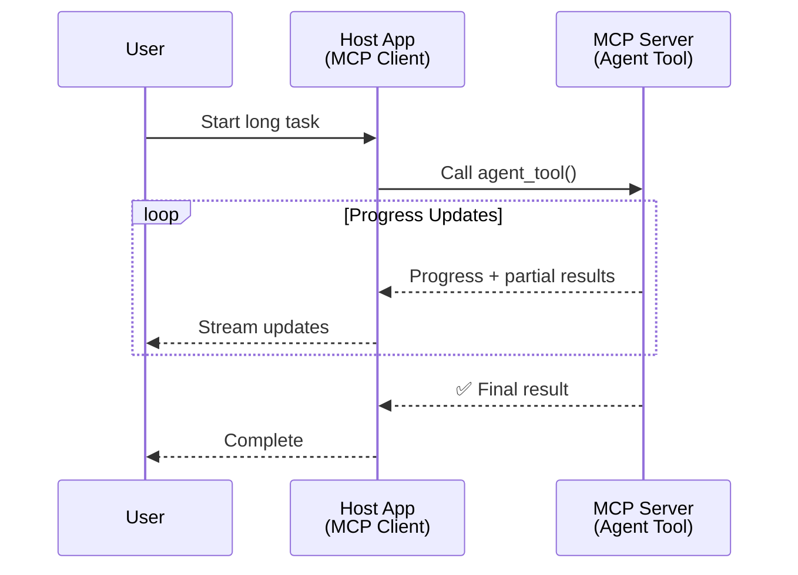
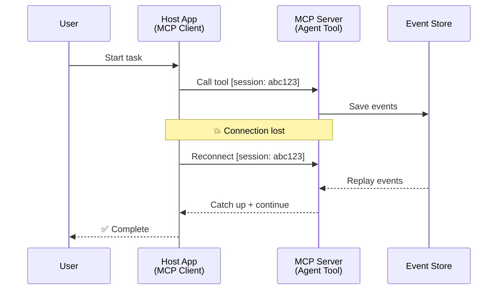
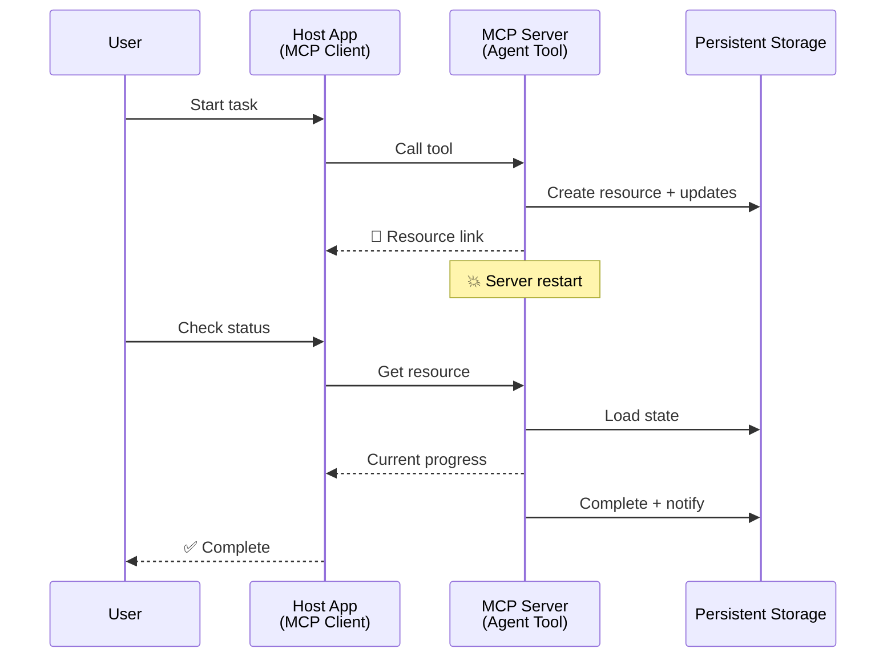
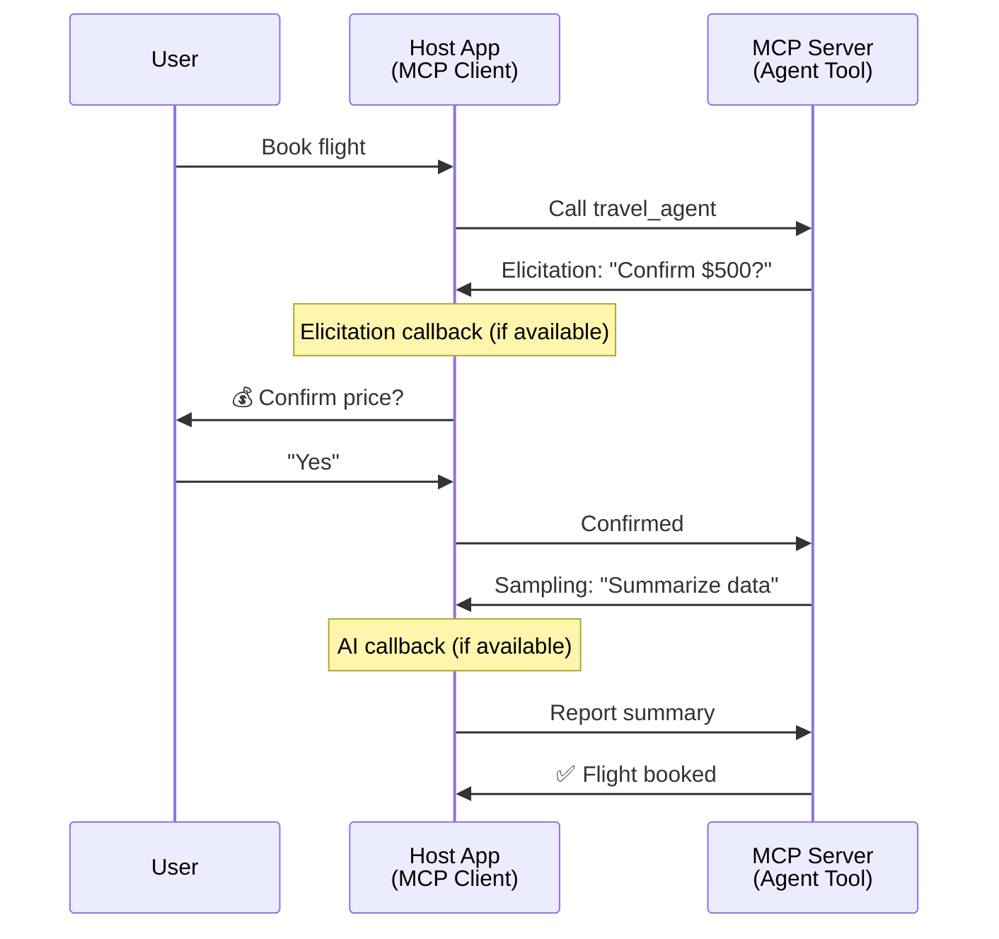
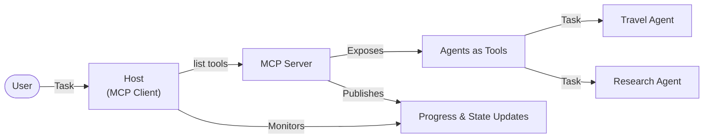

<!--
CO_OP_TRANSLATOR_METADATA:
{
  "original_hash": "5cc6836626047aa055e8960c8484a7d0",
  "translation_date": "2025-08-30T10:27:19+00:00",
  "source_file": "11-agentic-protocols/code_samples/mcp-agents/README.md",
  "language_code": "lt"
}
-->
# Agentų tarpusavio komunikacijos sistemų kūrimas su MCP

> TL;DR - Ar galite sukurti Agent2Agent komunikaciją naudojant MCP? Taip!

MCP gerokai išsivystė nuo savo pradinio tikslo „suteikti kontekstą LLM“. Su naujausiais patobulinimais, tokiais kaip [atnaujinamos srautai](https://modelcontextprotocol.io/docs/concepts/transports#resumability-and-redelivery), [elicitation](https://modelcontextprotocol.io/specification/2025-06-18/client/elicitation), [sampling](https://modelcontextprotocol.io/specification/2025-06-18/client/sampling) ir pranešimai ([progresas](https://modelcontextprotocol.io/specification/2025-06-18/basic/utilities/progress) ir [ištekliai](https://modelcontextprotocol.io/specification/2025-06-18/schema#resourceupdatednotification)), MCP dabar suteikia tvirtą pagrindą sudėtingų agentų tarpusavio komunikacijos sistemų kūrimui.

## Agentas/Įrankis klaidingas supratimas

Kai vis daugiau kūrėjų tyrinėja įrankius su agentiniais elgesiais (veikia ilgą laiką, gali prireikti papildomos informacijos vykdymo metu ir pan.), dažnai klaidingai manoma, kad MCP netinka, nes ankstyvieji pavyzdžiai, susiję su jo įrankių primityvu, buvo orientuoti į paprastus užklausos-atsakymo modelius.

Šis suvokimas yra pasenęs. MCP specifikacija per pastaruosius kelis mėnesius buvo žymiai patobulinta, kad užpildytų spragas, leidžiančias kurti ilgalaikį agentinį elgesį:

- **Srautai ir daliniai rezultatai**: realaus laiko progreso atnaujinimai vykdymo metu
- **Atnaujinamumas**: klientai gali prisijungti iš naujo ir tęsti po atsijungimo
- **Patvarumas**: rezultatai išlieka po serverio perkrovimo (pvz., per išteklių nuorodas)
- **Daugkartiniai posūkiai**: interaktyvus įvestis vykdymo metu per elicitation ir sampling

Šios funkcijos gali būti sudedamos, kad būtų galima kurti sudėtingas agentines ir daugiagentines programas, visas diegiamas MCP protokole.

Dėl nuorodos mes vadinsime agentą „įrankiu“, kuris yra prieinamas MCP serveryje. Tai reiškia, kad egzistuoja pagrindinė programa, kuri įgyvendina MCP klientą, užmezga sesiją su MCP serveriu ir gali iškviesti agentą.

## Kas daro MCP įrankį „agentiniu“?

Prieš pereinant prie įgyvendinimo, nustatykime, kokių infrastruktūros galimybių reikia, kad būtų palaikomi ilgalaikiai agentai.

> Mes apibrėšime agentą kaip subjektą, kuris gali veikti savarankiškai ilgą laiką, gebantį atlikti sudėtingas užduotis, kurioms gali prireikti kelių sąveikų ar koregavimų, remiantis realaus laiko grįžtamuoju ryšiu.

### 1. Srautai ir daliniai rezultatai

Tradiciniai užklausos-atsakymo modeliai neveikia ilgalaikėms užduotims. Agentai turi teikti:

- Realiojo laiko progreso atnaujinimus
- Tarpinius rezultatus

**MCP palaikymas**: Išteklių atnaujinimo pranešimai leidžia srautinius dalinius rezultatus, nors tai reikalauja kruopštaus dizaino, kad būtų išvengta konfliktų su JSON-RPC 1:1 užklausos/atsakymo modeliu.

| Funkcija                   | Naudojimo atvejis                                                                                                                                                                       | MCP palaikymas                                                                             |
| -------------------------- | -------------------------------------------------------------------------------------------------------------------------------------------------------------------------------------- | ------------------------------------------------------------------------------------------ |
| Realiojo laiko progreso atnaujinimai | Vartotojas prašo kodų bazės migracijos užduoties. Agentas srautiniu būdu teikia progresą: „10% - Analizuojamos priklausomybės... 25% - Konvertuojami TypeScript failai... 50% - Atnaujinami importai...“          | ✅ Progreso pranešimai                                                                     |
| Daliniai rezultatai        | „Sukurti knygą“ užduotis srautiniu būdu teikia dalinius rezultatus, pvz., 1) Istorijos arkos kontūras, 2) Skyrių sąrašas, 3) Kiekvienas skyrius, kai jis baigtas. Pagrindinė programa gali patikrinti, atšaukti arba nukreipti bet kuriame etape. | ✅ Pranešimai gali būti „išplėsti“, kad apimtų dalinius rezultatus, žr. pasiūlymus PR 383, 776 |

<div align="center" style="font-style: italic; font-size: 0.95em; margin-bottom: 0.5em;">
<strong>1 pav.:</strong> Ši diagrama iliustruoja, kaip MCP agentas srautiniu būdu teikia realiojo laiko progreso atnaujinimus ir dalinius rezultatus pagrindinei programai vykdant ilgalaikę užduotį, leidžiant vartotojui stebėti vykdymą realiuoju laiku.
</div>



### 2. Atnaujinamumas

Agentai turi tvarkyti tinklo pertraukimus sklandžiai:

- Prisijungti iš naujo po (kliento) atsijungimo
- Tęsti nuo ten, kur buvo sustota (pranešimų pakartotinis pristatymas)

**MCP palaikymas**: MCP StreamableHTTP transportas šiandien palaiko sesijos atnaujinimą ir pranešimų pakartotinį pristatymą naudojant sesijos ID ir paskutinių įvykių ID. Svarbu pažymėti, kad serveris turi įgyvendinti EventStore, kuris leidžia įvykių pakartojimą klientui prisijungus iš naujo.  
Atkreipkite dėmesį, kad yra bendruomenės pasiūlymas (PR #975), kuris tiria transportui nepriklausomus atnaujinamus srautus.

| Funkcija      | Naudojimo atvejis                                                                                                                                                   | MCP palaikymas                                                                |
| ------------ | ---------------------------------------------------------------------------------------------------------------------------------------------------------- | -------------------------------------------------------------------------- |
| Atnaujinamumas | Klientas atsijungia vykdant ilgalaikę užduotį. Prisijungus iš naujo, sesija atnaujinama su praleistų įvykių pakartojimu, tęsiant sklandžiai nuo ten, kur buvo sustota. | ✅ StreamableHTTP transportas su sesijos ID, įvykių pakartojimu ir EventStore |

<div align="center" style="font-style: italic; font-size: 0.95em; margin-bottom: 0.5em;">
<strong>2 pav.:</strong> Ši diagrama rodo, kaip MCP StreamableHTTP transportas ir įvykių saugykla leidžia sklandų sesijos atnaujinimą: jei klientas atsijungia, jis gali prisijungti iš naujo ir pakartoti praleistus įvykius, tęsiant užduotį be progreso praradimo.
</div>



### 3. Patvarumas

Ilgalaikiai agentai turi turėti nuolatinę būseną:

- Rezultatai išlieka po serverio perkrovimo
- Būseną galima gauti neprisijungus
- Progreso stebėjimas tarp sesijų

**MCP palaikymas**: MCP dabar palaiko išteklių nuorodų grąžinimo tipą įrankių iškvietimams. Šiandien galimas modelis yra sukurti įrankį, kuris sukuria išteklių ir iškart grąžina išteklių nuorodą. Įrankis gali toliau spręsti užduotį fone ir atnaujinti išteklių. Savo ruožtu klientas gali pasirinkti tikrinti šio ištekliaus būseną, kad gautų dalinius arba pilnus rezultatus (remiantis tuo, kokius išteklių atnaujinimus serveris teikia) arba prenumeruoti išteklių atnaujinimo pranešimus.

Vienas apribojimas čia yra tas, kad išteklių tikrinimas arba prenumeravimas atnaujinimams gali sunaudoti išteklius, turint pasekmių mastui. Yra atviras bendruomenės pasiūlymas (įskaitant #992), kuris tiria galimybę įtraukti webhook'us arba trigerius, kuriuos serveris gali iškviesti, kad praneštų klientui/pagrindinei programai apie atnaujinimus.

| Funkcija    | Naudojimo atvejis                                                                                                                                        | MCP palaikymas                                                        |
| ---------- | ----------------------------------------------------------------------------------------------------------------------------------------------- | ------------------------------------------------------------------ |
| Patvarumas | Serveris sugenda vykdant duomenų migracijos užduotį. Rezultatai ir progresas išlieka po perkrovimo, klientas gali patikrinti būseną ir tęsti nuo nuolatinio ištekliaus. | ✅ Išteklių nuorodos su nuolatine saugykla ir būsenos pranešimais |

Šiandien dažnas modelis yra sukurti įrankį, kuris sukuria išteklių ir iškart grąžina išteklių nuorodą. Įrankis gali fone spręsti užduotį, išduoti išteklių pranešimus, kurie tarnauja kaip progreso atnaujinimai arba apima dalinius rezultatus, ir atnaujinti turinį ištekliuje, kai reikia.

<div align="center" style="font-style: italic; font-size: 0.95em; margin-bottom: 0.5em;">
<strong>3 pav.:</strong> Ši diagrama demonstruoja, kaip MCP agentai naudoja nuolatinius išteklius ir būsenos pranešimus, kad užtikrintų, jog ilgalaikės užduotys išgyventų serverio perkrovimus, leidžiant klientams patikrinti progresą ir gauti rezultatus net po gedimų.
</div>



### 4. Daugkartinės sąveikos

Agentams dažnai reikia papildomos informacijos vykdymo metu:

- Žmogaus patikslinimo ar patvirtinimo
- AI pagalbos sudėtingiems sprendimams
- Dinaminio parametrų koregavimo

**MCP palaikymas**: Pilnai palaikoma per sampling (AI įvestis) ir elicitation (žmogaus įvestis).

| Funkcija                 | Naudojimo atvejis                                                                                                                                     | MCP palaikymas                                           |
| ----------------------- | -------------------------------------------------------------------------------------------------------------------------------------------- | ----------------------------------------------------- |
| Daugkartinės sąveikos | Kelionių rezervavimo agentas prašo vartotojo kainos patvirtinimo, tada prašo AI apibendrinti kelionių duomenis prieš užbaigiant rezervavimo operaciją. | ✅ Elicitation žmogaus įvesčiai, sampling AI įvesčiai |

<div align="center" style="font-style: italic; font-size: 0.95em; margin-bottom: 0.5em;">
<strong>4 pav.:</strong> Ši diagrama vaizduoja, kaip MCP agentai interaktyviai prašo žmogaus įvesties arba AI pagalbos vykdymo metu, palaikant sudėtingus, daugkartinius darbo procesus, tokius kaip patvirtinimai ir dinaminis sprendimų priėmimas.
</div>



## Ilgalaikių agentų įgyvendinimas MCP - kodo apžvalga

Šio straipsnio dalyje pateikiame [kodo saugyklą](https://github.com/victordibia/ai-tutorials/tree/main/MCP%20Agents), kurioje yra pilnas ilgalaikių agentų įgyvendinimas naudojant MCP Python SDK su StreamableHTTP transportu sesijos atnaujinimui ir pranešimų pakartotiniam pristatymui. Įgyvendinimas demonstruoja, kaip MCP galimybės gali būti sudedamos, kad būtų galima įgyvendinti sudėtingą agentinį elgesį.

Konkrečiai, mes įgyvendiname serverį su dviem pagrindiniais agentų įrankiais:

- **Kelionių agentas** - Simuliuoja kelionių rezervavimo paslaugą su kainos patvirtinimu per elicitation
- **Tyrimų agentas** - Atlieka tyrimų užduotis su AI pagalba per sampling

Abu agentai demonstruoja realaus laiko progreso atnaujinimus, interaktyvius patvirtinimus ir pilnas sesijos atnaujinimo galimybes.

### Pagrindinės įgyvendinimo sąvokos

Toliau pateikiamos serverio pusės agento įgyvendinimo ir kliento pusės pagrindinės programos tvarkymo kiekvienai funkcijai:

#### Srautai ir progreso atnaujinimai - realaus laiko užduoties būsenos

Srautai leidžia agentams teikti realaus laiko progreso atnaujinimus vykdant ilgalaikes užduotis, informuojant vartotojus apie užduoties būseną ir tarpinius rezultatus.

**Serverio įgyvendinimas (agentas siunčia progreso pranešimus):**

```python
# From server/server.py - Travel agent sending progress updates
for i, step in enumerate(steps):
    await ctx.session.send_progress_notification(
        progress_token=ctx.request_id,
        progress=i * 25,
        total=100,
        message=step,
        related_request_id=str(ctx.request_id)
    )
    await anyio.sleep(2)  # Simulate work

# Alternative: Log messages for detailed step-by-step updates
await ctx.session.send_log_message(
    level="info",
    data=f"Processing step {current_step}/{steps} ({progress_percent}%)",
    logger="long_running_agent",
    related_request_id=ctx.request_id,
)
```

**Kliento įgyvendinimas (pagrindinė programa gauna progreso atnaujinimus):**

```python
# From client/client.py - Client handling real-time notifications
async def message_handler(message) -> None:
    if isinstance(message, types.ServerNotification):
        if isinstance(message.root, types.LoggingMessageNotification):
            console.print(f"📡 [dim]{message.root.params.data}[/dim]")
        elif isinstance(message.root, types.ProgressNotification):
            progress = message.root.params
            console.print(f"🔄 [yellow]{progress.message} ({progress.progress}/{progress.total})[/yellow]")

# Register message handler when creating session
async with ClientSession(
    read_stream, write_stream,
    message_handler=message_handler
) as session:
```

#### Elicitation - Žmogaus įvesties prašymas

Elicitation leidžia agentams prašyti žmogaus įvesties vykdymo metu. Tai būtina patvirtinimams, patikslinimams ar patvirtinimams vykdant ilgalaikes užduotis.

**Serverio įgyvendinimas (agentas prašo patvirtinimo):**

```python
# From server/server.py - Travel agent requesting price confirmation
elicit_result = await ctx.session.elicit(
    message=f"Please confirm the estimated price of $1200 for your trip to {destination}",
    requestedSchema=PriceConfirmationSchema.model_json_schema(),
    related_request_id=ctx.request_id,
)

if elicit_result and elicit_result.action == "accept":
    # Continue with booking
    logger.info(f"User confirmed price: {elicit_result.content}")
elif elicit_result and elicit_result.action == "decline":
    # Cancel the booking
    booking_cancelled = True
```

**Kliento įgyvendinimas (pagrindinė programa teikia elicitation atgalinį iškvietimą):**

```python
# From client/client.py - Client handling elicitation requests
async def elicitation_callback(context, params):
    console.print(f"💬 Server is asking for confirmation:")
    console.print(f"   {params.message}")

    response = console.input("Do you accept? (y/n): ").strip().lower()

    if response in ['y', 'yes']:
        return types.ElicitResult(
            action="accept",
            content={"confirm": True, "notes": "Confirmed by user"}
        )
    else:
        return types.ElicitResult(
            action="decline",
            content={"confirm": False, "notes": "Declined by user"}
        )

# Register the callback when creating the session
async with ClientSession(
    read_stream, write_stream,
    elicitation_callback=elicitation_callback
) as session:
```

#### Sampling - AI pagalbos prašymas

Sampling leidžia agentams prašyti LLM pagalbos sudėtingiems sprendimams ar turinio generavimui vykdymo metu. Tai leidžia hibridinius žmogaus-AI darbo procesus.

**Serverio įgyvendinimas (agentas prašo AI pagalbos):**

```python
# From server/server.py - Research agent requesting AI summary
sampling_result = await ctx.session.create_message(
    messages=[
        SamplingMessage(
            role="user",
            content=TextContent(type="text", text=f"Please summarize the key findings for research on: {topic}")
        )
    ],
    max_tokens=100,
    related_request_id=ctx.request_id,
)

if sampling_result and sampling_result.content:
    if sampling_result.content.type == "text":
        sampling_summary = sampling_result.content.text
        logger.info(f"Received sampling summary: {sampling_summary}")
```

**Kliento įgyvendinimas (pagrindinė programa teikia sampling atgalinį iškvietimą):**

```python
# From client/client.py - Client handling sampling requests
async def sampling_callback(context, params):
    message_text = params.messages[0].content.text if params.messages else 'No message'
    console.print(f"🧠 Server requested sampling: {message_text}")

    # In a real application, this could call an LLM API
    # For demo purposes, we provide a mock response
    mock_response = "Based on current research, MCP has evolved significantly..."

    return types.CreateMessageResult(
        role="assistant",
        content=types.TextContent(type="text", text=mock_response),
        model="interactive-client",
        stopReason="endTurn"
    )

# Register the callback when creating the session
async with ClientSession(
    read_stream, write_stream,
    sampling_callback=sampling_callback,
    elicitation_callback=elicitation_callback
) as session:
```

#### Atnaujinamumas - Sesijos tęstinumas per atsijungimus

Atnaujinamumas užtikrina, kad ilgalaikės agentų užduotys galėtų išgyventi kliento atsijungimus ir tęsti sklandžiai prisijungus iš naujo. Tai įgyvendinama per įvykių saugyklas ir atnaujinimo žetonus.

**Įvykių saugyklos įgyvendinimas (serveris saugo sesijos būseną):**

```python
# From server/event_store.py - Simple in-memory event store
class SimpleEventStore(EventStore):
    def __init__(self):
        self._events: list[tuple[StreamId, EventId, JSONRPCMessage]] = []
        self._event_id_counter = 0

    async def store_event(self, stream_id: StreamId, message: JSONRPCMessage) -> EventId:
        """Store an event and return its ID."""
        self._event_id_counter += 1
        event_id = str(self._event_id_counter)
        self._events.append((stream_id, event_id, message))
        return event_id

    async def replay_events_after(self, last_event_id: EventId, send_callback: EventCallback) -> StreamId | None:
        """Replay events after the specified ID for resumption."""
        # Find events after the last known event and replay them
        for _, event_id, message in self._events[start_index:]:
            await send_callback(EventMessage(message, event_id))

# From server/server.py - Passing event store to session manager
def create_server_app(event_store: Optional[EventStore] = None) -> Starlette:
    server = ResumableServer()

    # Create session manager with event store for resumption
    session_manager = StreamableHTTPSessionManager(
        app=server,
        event_store=event_store,  # Event store enables session resumption
        json_response=False,
        security_settings=security_settings,
    )

    return Starlette(routes=[Mount("/mcp", app=session_manager.handle_request)])

# Usage: Initialize with event store
event_store = SimpleEventStore()
app = create_server_app(event_store)
```

**Kliento metaduomenys su atnaujinimo žetonu (klientas prisijungia iš naujo naudodamas saugomą būseną):**

```python
# From client/client.py - Client resumption with metadata
if existing_tokens and existing_tokens.get("resumption_token"):
    # Use existing resumption token to continue where we left off
    metadata = ClientMessageMetadata(
        resumption_token=existing_tokens["resumption_token"],
    )
else:
    # Create callback to save resumption token when received
    def enhanced_callback(token: str):
        protocol_version = getattr(session, 'protocol_version', None)
        token_manager.save_tokens(session_id, token, protocol_version, command, args)

    metadata = ClientMessageMetadata(
        on_resumption_token_update=enhanced_callback,
    )

# Send request with resumption metadata
result = await session.send_request(
    types.ClientRequest(
        types.CallToolRequest(
            method="tools/call",
            params=types.CallToolRequestParams(name=command, arguments=args)
        )
    ),
    types.CallToolResult,
    metadata=metadata,
)
```

Pagrindinė programa vietoje saugo sesijos ID ir atnaujinimo žetonus, leidžiant prisijungti iš naujo prie esamų sesijų neprarandant progreso ar būsenos.

### Kodo organizacija

<div align="center" style="font-style: italic; font-size: 0.95em; margin-bottom: 0.5em;">
<strong>5 pav.:</strong> MCP pagrįstos agentų sistemos architektūra
</div>



**Pagrindiniai failai:**

- **`server/server.py`** - Atnaujinamas MCP serveris su kelionių ir tyrimų agentais, kurie demonstruoja elicitation, sampling ir progreso atnaujinimus
- **`client/client.py`** - Interaktyvi pagrindinė programa su atnaujinimo palaikymu, atgalinių iškvietimų tvarkytuvais ir žetonų valdymu
- **`server/event_store.py`** - Įvykių saugyklos įgyvendinimas, leidžiantis sesijos atnaujinimą ir pranešimų pakartotinį pristatymą

## MCP pagrįstos daugiagentės komunikacijos plėtra

Aukščiau pateiktą įgyvendinimą galima išplėsti daugiagentėms sistemoms, padidinant pagrindinės programos intelektą ir apimtį:

- **Protingas užduočių skaidymas**: Pagrindinė programa analizuoja sudėtingas vartotojo užklausas ir suskaido jas į subtasks skirtingiems specializuotiems agentams
- **Daugiaserverinė koordinacija**: Pagrindinė programa palaiko ryšius su keliais MCP serveriais, kiekvienas teikia skirtingas agentų galimybes
- **Užduočių būsenos valdymas**: Pagrindinė programa stebi progresą per kelias lygiagrečias agentų užduotis, tvarkydama priklausomybes ir seką
- **Atsparumas ir pakartojimai**: Pagrindinė programa tvarko gedimus, įgyvendina pakartojimo logiką ir nukreipia už

---

**Atsakomybės apribojimas**:  
Šis dokumentas buvo išverstas naudojant AI vertimo paslaugą [Co-op Translator](https://github.com/Azure/co-op-translator). Nors siekiame tikslumo, prašome atkreipti dėmesį, kad automatiniai vertimai gali turėti klaidų ar netikslumų. Originalus dokumentas jo gimtąja kalba turėtų būti laikomas autoritetingu šaltiniu. Kritinei informacijai rekomenduojama naudoti profesionalų žmogaus vertimą. Mes neprisiimame atsakomybės už nesusipratimus ar klaidingus interpretavimus, atsiradusius dėl šio vertimo naudojimo.