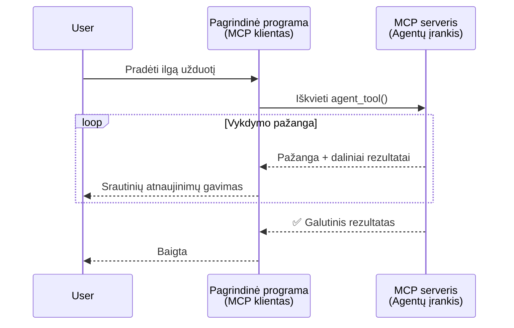
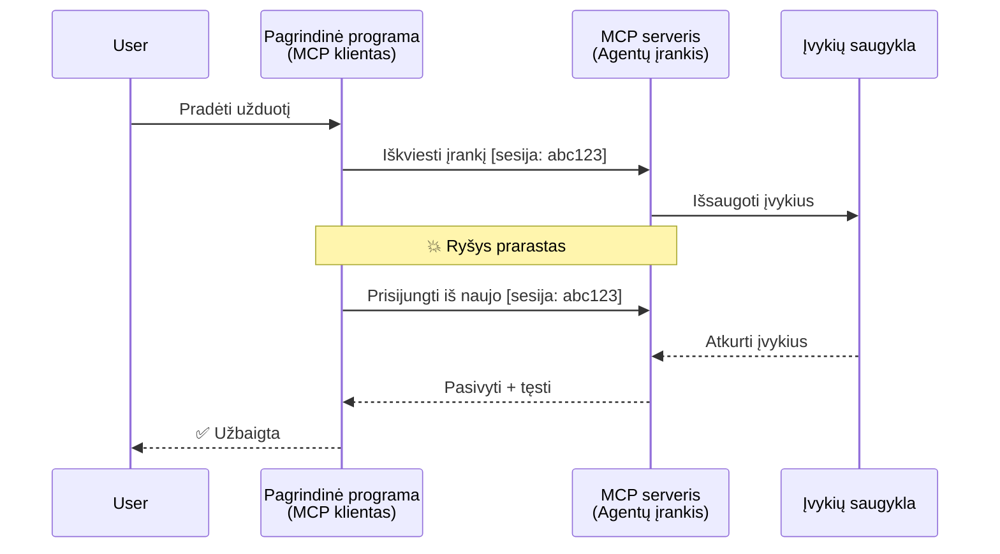
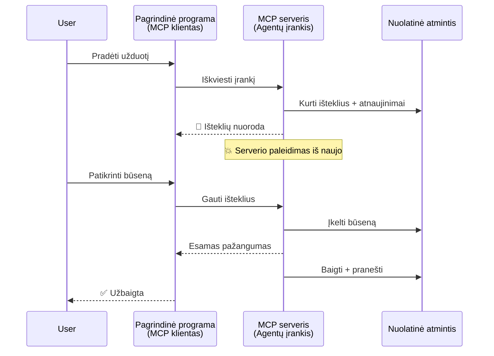
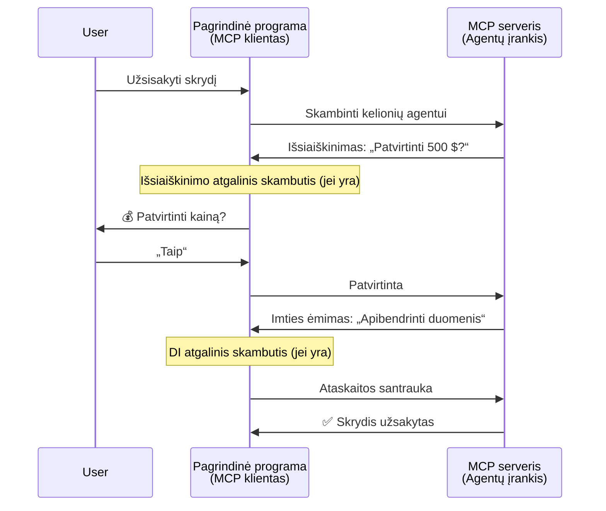
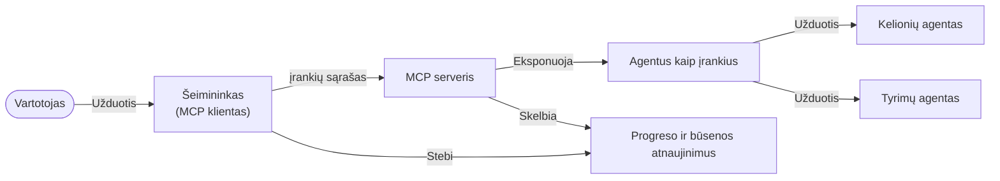

# Agentų tarpusavio komunikacijos sistemų kūrimas su MCP

> TL;DR - Ar galima sukurti Agent2Agent komunikaciją naudojant MCP? Taip!

MCP smarkiai patobulėjo nuo pirminio tikslo „pateikti kontekstą LLM“. Pastarieji patobulinimai, įskaitant [pertraukiamus srautus](https://modelcontextprotocol.io/docs/concepts/transports#resumability-and-redelivery), [išgavimą](https://modelcontextprotocol.io/specification/2025-06-18/client/elicitation), [pavyzdžių ėmimą](https://modelcontextprotocol.io/specification/2025-06-18/client/sampling) ir pranešimus ([progreso](https://modelcontextprotocol.io/specification/2025-06-18/basic/utilities/progress) ir [išteklių](https://modelcontextprotocol.io/specification/2025-06-18/schema#resourceupdatednotification)), MCP dabar suteikia tvirtą pagrindą kurti sudėtingas agentų tarpusavio komunikacijos sistemas.

## Agentų/instrumentų klaidingas supratimas

Daugiau kūrėjų tiria agentinius įrankius (kurie veikia ilgai, gali reikėti papildomo įvesties vykdymo metu ir pan.), dažnai manoma, kad MCP netinka, nes ankstyvieji įrankių pavyzdžiai buvo paprasti užklausos-atsakymo modeliai.

Šis požiūris pasenęs. Per pastaruosius mėnesius MCP specifikacija smarkiai patobulinta funkcijomis, kurios užpildo spragą ilgalaikiams agentiniams veiksmams:

- **Srautinimas ir dalinės rezultatų dalys**: Realiojo laiko pažangos atnaujinimai vykdymo metu
- **Pertraukiamumas**: Klientai gali prisijungti iš naujo ir tęsti po atjungimo
- **Patvarumas**: Rezultatai išlieka po serverio perkrovimo (pvz., naudojant išteklių nuorodas)
- **Daugiapaskutiniai pokalbiai**: Interaktyvi įvestis vykdymo metu per išgavimą ir pavyzdžių ėmimą

Šios funkcijos gali būti derinamos, leidžiant sudėtingas agentų ir daugiagentines programas, visos veikiančios MCP protokole.

Nuorodai, agentas bus vadinamas „įrankiu“, prieinamu MCP serveryje. Tai reiškia, kad yra host aplikacija, kuri įdiegia MCP klientą, užmezga sesiją su MCP serveriu ir gali kviesti agentą.

## Kas daro MCP įrankį „agentiniu“?

Prieš įgyvendinimą, nustatykime kokių infrastruktūros galimybių reikia ilgalaikiams agentams palaikyti.

> Agentą apibrėšime kaip subjekto vienetą, kuris gali autonomiškai veikti ilgesnį laiką, spręsdamas sudėtingas užduotis, kurios gali reikalauti daugelio sąveikų arba koregavimų pagal realiojo laiko grįžtamąjį ryšį.

### 1. Srautinimas ir dalinės rezultatų dalys

Tradiciniai užklausos-atsakymo modeliai netinka ilgalaikėms užduotims. Agentai turi pateikti:

- Realiojo laiko pažangos atnaujinimus
- Tarpinius rezultatus

**MCP palaikymas**: Išteklių atnaujinimų pranešimai leidžia transliuoti dalinius rezultatus, tačiau tai reikalauja atsargaus dizaino, kad nebūtų pažeista JSON-RPC 1:1 užklausa/atsakymo schema.

| Funkcija                  | Naudojimo atvejis                                                                                                                                                             | MCP palaikymas                                                                             |
| ------------------------- | ---------------------------------------------------------------------------------------------------------------------------------------------------------------------------- | ------------------------------------------------------------------------------------------ |
| Realiojo laiko pažanga    | Vartotojas prašo įvykdyti kodo bazės migracijos užduotį. Agentas transliuoja pažangą: „10% - analizuojamos priklausomybės... 25% - konvertuojami TypeScript failai... 50% - atnaujinami importai...“ | ✅ Progreso pranešimai                                                                     |
| Daliniai rezultatai       | Užduotis „Sugeneruoti knygą“ transliuoja dalinius rezultatus, pvz., 1) Siužeto santrauka, 2) skyrių sąrašas, 3) kiekvienas skyrius kaip baigtas. Hostas gali bet kada peržiūrėti, atšaukti ar nukreipti. | ✅ Pranešimus galima „išplėsti“ įtraukiant dalinius rezultatus, žr. pasiūlymus PR 383, 776    |

<div align="center" style="font-style: italic; font-size: 0.95em; margin-bottom: 0.5em;">
<strong>1 pav.: </strong> Šis diagramas iliustruoja, kaip MCP agentas srautu perduoda realiojo laiko pažangos atnaujinimus ir dalinius rezultatus į host aplikaciją vykdant ilgalaikę užduotį, leidžiant vartotojui stebėti vykdymą realiu laiku.
</div>


```mermaid
sequenceDiagram
    participant User
    participant Host as Pagrindinė programa<br/>(MCP klientas)
    participant Server as MCP serveris<br/>(Agentų įrankis)

    User->>Host: Pradėti ilgą užduotį
    Host->>Server: Iškvieti agent_tool()

    loop Vykdymo pažanga
        Server-->>Host: Pažanga + daliniai rezultatai
        Host-->>User: Srautinių atnaujinimų gavimas
    end

    Server-->>Host: ✅ Galutinis rezultatas
    Host-->>User: Baigta
```

### 2. Pertraukiamumas

Agentai privalo tvarkyti tinklo trukdžius sklandžiai:

- Prisijungti iš naujo po (kliento) atjungimo
- Tęsti nuo paskutinio taško (pranešimų perdavimas iš naujo)

**MCP palaikymas**: MCP StreamableHTTP transportas šiuo metu palaiko sesijos atnaujinimą ir pranešimų perdavimą naudojant sesijos ID ir paskutinio įvykio ID. Svarbu, kad serveris turi įgyvendinti EventStore, leidžiantį įvykių atkūrimą prisijungus iš naujo.  
Atkreipkite dėmesį, kad yra bendruomenės pasiūlymas (PR #975), nagrinėjantis transporto nepriklausomų pertraukiamų srautų galimybę.

| Funkcija        | Naudojimo atvejis                                                                                                                                                     | MCP palaikymas                                                             |
| -------------- | -------------------------------------------------------------------------------------------------------------------------------------------------------------------- | ------------------------------------------------------------------------- |
| Pertraukiamumas | Klientas atjungiamas vykdant ilgalaikę užduotį. Prisijungus iš naujo, sesija tęsiasi su prarastų įvykių atkūrimu, toliau vykdoma be prarasto progreso.                  | ✅ StreamableHTTP transportas su sesijos ID, įvykių atkūrimu ir EventStore |

<div align="center" style="font-style: italic; font-size: 0.95em; margin-bottom: 0.5em;">
<strong>2 pav.: </strong> Šis diagramas rodo, kaip MCP StreamableHTTP transportas ir įvykių saugykla leidžia sklandžiai atnaujinti sesiją: kai klientas nutraukia ryšį, jis gali prisijungti iš naujo ir atkurti prarastus įvykius, tęsiant užduotį be praradimų.
</div>


```mermaid
sequenceDiagram
    participant User
    participant Host as Pagrindinė programa<br/>(MCP klientas)
    participant Server as MCP serveris<br/>(Agentų įrankis)
    participant Store as Įvykių saugykla

    User->>Host: Pradėti užduotį
    Host->>Server: Iškviesti įrankį [sesija: abc123]
    Server->>Store: Išsaugoti įvykius

    Note over Host,Server: 💥 Ryšys prarastas

    Host->>Server: Prisijungti iš naujo [sesija: abc123]
    Store-->>Server: Atkurti įvykius
    Server-->>Host: Pasivyti + tęsti
    Host-->>User: ✅ Užbaigta
```

### 3. Patvarumas

Ilgalaikiai agentai reikalauja nuolatinės būsenos:

- Rezultatai išlieka po serverio perkrovimų
- Būsena gali būti patikrinama atskirai
- Pažangos sekimas per kelias sesijas

**MCP palaikymas**: MCP dabar palaiko Išteklių nuorodų grąžinimo tipą įrankių kvietimuose. Šiuo metu įprasta sukurti įrankį, kuris sukuria išteklių ir iškart grąžina nuorodą į jį. Įrankis gali tol toliau dirbti užduotį fone ir atnaujinti išteklių. Klientas gali rinktis apklausti šį išteklių dėl būsenos arba prenumeruoti atnaujinimų pranešimus.

Vienas apribojimas yra tas, kad resursų apklausa arba prenumeravimas gali vartoti išteklius, turinčius pasekmių mastelyje. Yra atviras bendruomenės pasiūlymas (#992), nagrinėjantis galimybę įtraukti webhooks arba trigerius, kuriuos serveris galėtų kviesti informuodamas klientą/hostą apie atnaujinimus.

| Funkcija    | Naudojimo atvejis                                                                                                                              | MCP palaikymas                                                      |
| ---------- | ----------------------------------------------------------------------------------------------------------------------------------------------- | ------------------------------------------------------------------ |
| Patvarumas | Serveris sugenda duomenų migracijos užduoties metu. Rezultatai ir pažanga išlieka perkrovus, klientas gali patikrinti būseną ir tęsti naudodamas išteklių. | ✅ Išteklių nuorodos su nuolatiniu saugojimu ir būsenos pranešimais |

Šiandien įprasta, kad įrankis sukurtų išteklių ir iš karto grąžintų jo nuorodą. Įrankis fone dirba užduotį, siunčia išteklių pranešimus, kurie atlieka pažangos atnaujinimų arba dalinių rezultatų funkcijas, ir atnaujina ištekliaus turinį pagal poreikį.

<div align="center" style="font-style: italic; font-size: 0.95em; margin-bottom: 0.5em;">
<strong>3 pav.: </strong> Šis diagramas demonstruoja, kaip MCP agentai naudoja nuolatinius išteklius ir būsenos pranešimus, kad ilgalaikės užduotys išliktų po serverio perkrovimų, leidžiant klientams patikrinti pažangą ir gauti rezultatus net po nesėkmių.
</div>


```mermaid
sequenceDiagram
    participant User
    participant Host as Pagrindinė programa<br/>(MCP klientas)
    participant Server as MCP serveris<br/>(Agentų įrankis)
    participant DB as Nuolatinė atmintis

    User->>Host: Pradėti užduotį
    Host->>Server: Iškviesti įrankį
    Server->>DB: Kurti išteklius + atnaujinimai
    Server-->>Host: 🔗 Išteklių nuoroda

    Note over Server: 💥 Serverio paleidimas iš naujo

    User->>Host: Patikrinti būseną
    Host->>Server: Gauti išteklius
    Server->>DB: Įkelti būseną
    Server-->>Host: Esamas pažangumas
    Server->>DB: Baigti + pranešti
    Host-->>User: ✅ Užbaigta
```

### 4. Daugiapaskutiniai pokalbiai

Agentai dažnai reikalauja papildomos įvesties vykdymo metu:

- Žmogaus aiškinimas arba patvirtinimas
- Dirbtinio intelekto pagalba sudėtingiems sprendimams
- Dinamiškas kintamųjų parametrai reguliavimas

**MCP palaikymas**: Visiškai palaikoma naudojant pavyzdžių ėmimą (AI įvestyje) ir išgavimą (žmogaus įvestyje).

| Funkcija                | Naudojimo atvejis                                                                                                                                           | MCP palaikymas                                            |
| ---------------------- | ---------------------------------------------------------------------------------------------------------------------------------------------------------- | --------------------------------------------------------- |
| Daugiapaskutiniai pokalbiai | Kelionių agentas prašo vartotojo patvirtinti kainą, tada prašo AI apibendrinti kelionių duomenis prieš užbaigiant užsakymą.                                    | ✅ Išgavimas žmogaus įvesties, pavyzdžių ėmimas AI įvesties|

<div align="center" style="font-style: italic; font-size: 0.95em; margin-bottom: 0.5em;">
<strong>4 pav.: </strong> Ši schema vaizduoja, kaip MCP agentai gali interaktyviai išgauti žmogaus įvestį arba prašyti AI pagalbos vykdymo metu, palaikydami sudėtingus, daugiapaskutinius darbo srautus, tokius kaip patvirtinimai ir dinamiški sprendimai.
</div>


```mermaid
sequenceDiagram
    participant User
    participant Host as Pagrindinė programa<br/>(MCP klientas)
    participant Server as MCP serveris<br/>(Agentų įrankis)

    User->>Host: Užsisakyti skrydį
    Host->>Server: Skambinti kelionių agentui

    Server->>Host: Išsiaiškinimas: „Patvirtinti 500 $?“
    Note over Host: Išsiaiškinimo atgalinis skambutis (jei yra)
    Host->>User: 💰 Patvirtinti kainą?
    User->>Host: „Taip“
    Host->>Server: Patvirtinta

    Server->>Host: Imties ėmimas: „Apibendrinti duomenis“
    Note over Host: DI atgalinis skambutis (jei yra)
    Host->>Server: Ataskaitos santrauka

    Server->>Host: ✅ Skrydis užsakytas
```

## Ilgalaikių agentų įgyvendinimas MCP - kodo apžvalga

Šiame straipsnyje pateikiame [kodo saugyklą](https://github.com/victordibia/ai-tutorials/tree/main/MCP%20Agents), kuriame yra pilnas ilgalaikių agentų įgyvendinimas naudojant MCP Python SDK su StreamableHTTP transportu sesijos atnaujinimui ir pranešimų perdavimui. Įgyvendinimas demonstruoja, kaip MCP galimybes galima sujungti sudėtingiems agentiniams veiksmams.

Konkrečiai, įgyvendiname serverį su dviem pagrindiniais agentų įrankiais:

- **Kelionių agentas** – Simuliuoja kelionių rezervavimo paslaugą su kainos patvirtinimu išgavimu
- **Tyrimų agentas** – Atlieka tyrimų užduotis su AI padedamomis santraukomis per pavyzdžių ėmimą

Abu agentai demonstruoja realiojo laiko pažangos atnaujinimus, interaktyvius patvirtinimus ir pilną sesijos atnaujinimo galimybes.

### Pagrindinės įgyvendinimo koncepcijos

Toliau pateikiamos serverio pusės agento įgyvendinimo ir kliento pusės apdorojimo galimybės:

#### Srautinimas ir pažangos atnaujinimai - realiojo laiko užduoties būsena

Srautinimas leidžia agentams pateikti realiojo laiko pažangos atnaujinimus vykdant ilgalaikes užduotis, informuojant vartotojus apie užduoties būseną ir tarpinius rezultatus.

**Serverio įgyvendinimas (agentas siunčia progreso pranešimus):**

```python
# Iš server/server.py - Kelionių agentas siunčia pažangos atnaujinimus
for i, step in enumerate(steps):
    await ctx.session.send_progress_notification(
        progress_token=ctx.request_id,
        progress=i * 25,
        total=100,
        message=step,
        related_request_id=str(ctx.request_id)
    )
    await anyio.sleep(2)  # Simuliuoti darbą

# Alternatyva: Registruoti pranešimus detaliems žingsnis po žingsnio atnaujinimams
await ctx.session.send_log_message(
    level="info",
    data=f"Processing step {current_step}/{steps} ({progress_percent}%)",
    logger="long_running_agent",
    related_request_id=ctx.request_id,
)
```

**Kliento įgyvendinimas (hostas gauna progreso atnaujinimus):**

```python
# Iš client/client.py - Klientas, tvarkantis realaus laiko pranešimus
async def message_handler(message) -> None:
    if isinstance(message, types.ServerNotification):
        if isinstance(message.root, types.LoggingMessageNotification):
            console.print(f"📡 [dim]{message.root.params.data}[/dim]")
        elif isinstance(message.root, types.ProgressNotification):
            progress = message.root.params
            console.print(f"🔄 [yellow]{progress.message} ({progress.progress}/{progress.total})[/yellow]")

# Užregistruoti pranešimų apdorotoją, kai kuriama sesija
async with ClientSession(
    read_stream, write_stream,
    message_handler=message_handler
) as session:
```

#### Išgavimas - vartotojo įvesties prašymas

Išgavimas leidžia agentams prašyti vartotojo įvesties vykdymo metu. Tai būtina patvirtinimams, paaiškinimams ar patvirtinimams per ilgalaikes užduotis.

**Serverio įgyvendinimas (agentas prašo patvirtinimo):**

```python
# Iš server/server.py - Kelionių agentas prašo kainos patvirtinimo
elicit_result = await ctx.session.elicit(
    message=f"Please confirm the estimated price of $1200 for your trip to {destination}",
    requestedSchema=PriceConfirmationSchema.model_json_schema(),
    related_request_id=ctx.request_id,
)

if elicit_result and elicit_result.action == "accept":
    # Tęsti rezervaciją
    logger.info(f"User confirmed price: {elicit_result.content}")
elif elicit_result and elicit_result.action == "decline":
    # Atšaukti rezervaciją
    booking_cancelled = True
```

**Kliento įgyvendinimas (hostas teikia išgavimų atgalinį kvietimą):**

```python
# Iš client/client.py - Kliento užklausų apdorojimas
async def elicitation_callback(context, params):
    console.print(f"💬 Server is asking for confirmation:")
    console.print(f"   {params.message}")

    response = console.input("Do you accept? (y/n): ").strip().lower()

    if response in ['y', 'yes']:
        return types.ElicitResult(
            action="accept",
            content={"confirm": True, "notes": "Confirmed by user"}
        )
    else:
        return types.ElicitResult(
            action="decline",
            content={"confirm": False, "notes": "Declined by user"}
        )

# Užregistruoti atgalinį kvietimą kuriant sesiją
async with ClientSession(
    read_stream, write_stream,
    elicitation_callback=elicitation_callback
) as session:
```

#### Pavyzdžių ėmimas - AI pagalbos prašymas

Pavyzdžių ėmimas leidžia agentams prašyti LLM pagalbos sudėtingiems sprendimams ar turinio generavimui vykdymo metu. Tai leidžia hibridinius žmogaus ir AI darbo srautus.

**Serverio įgyvendinimas (agentas prašo AI pagalbos):**

```python
# Iš server/server.py - Tyrimų agentas prašo AI santraukos
sampling_result = await ctx.session.create_message(
    messages=[
        SamplingMessage(
            role="user",
            content=TextContent(type="text", text=f"Please summarize the key findings for research on: {topic}")
        )
    ],
    max_tokens=100,
    related_request_id=ctx.request_id,
)

if sampling_result and sampling_result.content:
    if sampling_result.content.type == "text":
        sampling_summary = sampling_result.content.text
        logger.info(f"Received sampling summary: {sampling_summary}")
```

**Kliento įgyvendinimas (hostas teikia pavyzdžių ėmimo atgalinį kvietimą):**

```python
# Iš client/client.py - Kliento užklausų apdorojimas dėl mėginių ėmimo
async def sampling_callback(context, params):
    message_text = params.messages[0].content.text if params.messages else 'No message'
    console.print(f"🧠 Server requested sampling: {message_text}")

    # Tikroje programoje tai galėtų iškviesti LLM API
    # Demonstraciniais tikslais pateikiame imitacinį atsakymą
    mock_response = "Based on current research, MCP has evolved significantly..."

    return types.CreateMessageResult(
        role="assistant",
        content=types.TextContent(type="text", text=mock_response),
        model="interactive-client",
        stopReason="endTurn"
    )

# Užregistruoti atgalinio kvietimo funkciją kuriant sesiją
async with ClientSession(
    read_stream, write_stream,
    sampling_callback=sampling_callback,
    elicitation_callback=elicitation_callback
) as session:
```

#### Pertraukiamumas - sesijos tęstinumas po atjungimų

Pertraukiamumas užtikrina, kad ilgalaikės agentų užduotys gali išlikti net praradus ryšį ir toliau sklandžiai tęstis prisijungus iš naujo. Tai įgyvendinama per įvykių saugyklas ir atnaujinimo žetonus.

**Įvykių saugyklos įgyvendinimas (serveris saugo sesijos būseną):**

```python
# Iš server/event_store.py - Paprasta atmintyje veikianti įvykių saugykla
class SimpleEventStore(EventStore):
    def __init__(self):
        self._events: list[tuple[StreamId, EventId, JSONRPCMessage]] = []
        self._event_id_counter = 0

    async def store_event(self, stream_id: StreamId, message: JSONRPCMessage) -> EventId:
        """Store an event and return its ID."""
        self._event_id_counter += 1
        event_id = str(self._event_id_counter)
        self._events.append((stream_id, event_id, message))
        return event_id

    async def replay_events_after(self, last_event_id: EventId, send_callback: EventCallback) -> StreamId | None:
        """Replay events after the specified ID for resumption."""
        start_index = None
        stream_id = None
        for index, (event_stream_id, event_id, _) in enumerate(self._events):
            if event_id == last_event_id:
                start_index = index + 1
                stream_id = event_stream_id
                break

        if start_index is None:
            return None

        # Peržaiskite tik vėlesnius įvykius iš sesijos pradinio srauto.
        for event_stream_id, event_id, message in self._events[start_index:]:
            if event_stream_id != stream_id:
                continue
            await send_callback(EventMessage(message, event_id))

        return stream_id

# Iš server/server.py - Įvykių saugyklos perdavimas sesijos valdytojui
def create_server_app(event_store: Optional[EventStore] = None) -> Starlette:
    server = ResumableServer()

    # Sukurkite sesijos valdytoją su įvykių saugykla tęsimui
    session_manager = StreamableHTTPSessionManager(
        app=server,
        event_store=event_store,  # Įvykių saugykla leidžia tęsti sesiją
        json_response=False,
        security_settings=security_settings,
    )

    return Starlette(routes=[Mount("/mcp", app=session_manager.handle_request)])

# Naudojimas: Inicijuokite su įvykių saugykla
event_store = SimpleEventStore()
app = create_server_app(event_store)
```

**Kliento meta duomenys su atnaujinimo žetonu (klientas jungiasi iš naujo naudodamas saugomą būseną):**

```python
# Iš client/client.py - Kliento tęsinys su metaduomenimis
if existing_tokens and existing_tokens.get("resumption_token"):
    # Naudokite esamą tęsinio žetoną, kad tęstumėte nuo ten, kur baigėme
    metadata = ClientMessageMetadata(
        resumption_token=existing_tokens["resumption_token"],
    )
else:
    # Sukurkite atgalinį kvietimą, kad išsaugotumėte tęsinio žetoną, kai jis gaunamas
    def enhanced_callback(token: str):
        protocol_version = getattr(session, 'protocol_version', None)
        token_manager.save_tokens(session_id, token, protocol_version, command, args)

    metadata = ClientMessageMetadata(
        on_resumption_token_update=enhanced_callback,
    )

# Siųskite užklausą su tęsinio metaduomenimis
result = await session.send_request(
    types.ClientRequest(
        types.CallToolRequest(
            method="tools/call",
            params=types.CallToolRequestParams(name=command, arguments=args)
        )
    ),
    types.CallToolResult,
    metadata=metadata,
)
```

Host aplikacija vietoje laiko sesijų ID ir atnaujinimo žetonus, leidžiančius prijungti prie esamų sesijų neprarandant progreso ar būsenos.

### Kodo organizacija

<div align="center" style="font-style: italic; font-size: 0.95em; margin-bottom: 0.5em;">
<strong>5 pav.: </strong> MCP pagrindu veikianti agentų sistemos architektūra
</div>


```mermaid
graph LR
    User([Vartotojas]) -->|"Užduotis"| Host["Šeimininkas<br/>(MCP klientas)"]
    Host -->|įrankių sąrašas| Server[MCP serveris]
    Server -->|Eksponuoja| AgentsTools[Agentus kaip įrankius]
    AgentsTools -->|Užduotis| AgentA[Kelionių agentas]
    AgentsTools -->|Užduotis| AgentB[Tyrimų agentas]

    Host -->|Stebi| StateUpdates[Progreso ir būsenos atnaujinimus]
    Server -->|Skelbia| StateUpdates

    class User user;
    class AgentA,AgentB agent;
    class Host,Server,StateUpdates core;
```

**Svarbūs failai:**

- **`server/server.py`** - Pertraukiamas MCP serveris su kelionių ir tyrimų agentais, demonstruojančiais išgavimą, pavyzdžių ėmimą ir pažangos atnaujinimus
- **`client/client.py`** - Interaktyvi host aplikacija su sesijos atnaujinimo palaikymu, atgalinių kvietimų apdorojimu ir žetonų valdymu
- **`server/event_store.py`** - Įvykių saugyklos įgyvendinimas, leidžiantis sesijos atnaujinimą ir pranešimų perdavimą

## Plečiant iki daugiagentinės komunikacijos su MCP

Aukščiau pateiktą įgyvendinimą galima išplėsti į daugiagentines sistemas praplėčiant host aplikacijos intelektą ir aprėptį:

- **Išmanus užduočių skaidymas**: Hostas analizuoja kompleksiškas vartotojo užklausas ir išskaido jas į potaskius skirtingiems specializuotiems agentams
- **Daugių serverių koordinacija**: Hostas palaiko ryšius su keliomis MCP serverių instancijomis, kiekvienas atskleidžia skirtingas agentų galimybes
- **Užduočių būsenos valdymas**: Hostas seka pažangą per kelių agentų užduotis, tvarkydamas priklausomybes ir seką
- **Atsparumas ir pakartotinis bandymas**: Hostas tvarko gedimus, įgyvendina bandymų logiką ir peradresuoja užduotis nepasiekiamiems agentams
- **Rezultatų sintezė**: Hostas apjungia kelių agentų išvestis į nuoseklius galutinius rezultatus

Hostas vystosi nuo paprasto kliento į intelektualų organizatorių, koordinuojantį išskirstytas agentų galimybes, tuo pat metu išlaikant MCP protokolo pagrindą.

## Išvada

MCP patobulintos galimybės – išteklių pranešimai, išgavimas/pavyzdžių ėmimas, pertraukiami srautai ir nuolatiniai ištekliai – leidžia sudėtingas agentų tarpusavio sąveikas išlaikant paprastą protokolą.

## Pradžia

Pasiruošę kurti savo agent2agent sistemą? Vykdykite šiuos veiksmus:

### 1. Paleiskite demonstracinę versiją

```bash
# Paleiskite serverį su įvykių saugykla tęsimui
python -m server.server --port 8006

# Kitame terminale paleiskite interaktyvų klientą
python -m client.client --url http://127.0.0.1:8006/mcp
```

**Galimi komandų pasirinkimai interaktyviame režime:**

- `travel_agent` – Rezervuoti keliones su kainos patvirtinimu per išgavimą
- `research_agent` – Tyrinėti temas su AI pagalba santraukoms per pavyzdžių ėmimą
- `list` – Rodyti visas galimas priemones
- `clean-tokens` – Išvalyti sesijos atnaujinimo žetonus
- `help` – Rodyti detalų komandų pagalbos meniu
- `quit` – Išeiti iš kliento

### 2. Išbandykite sesijos atnaujinimo galimybes

- Pradėkite ilgai veikiančią agento užduotį (pvz., `travel_agent`)
- Nutraukite klientą vykdymo metu (Ctrl+C)
- Paleiskite klientą iš naujo - jis automatiškai atnaujins vykdymą nuo paskutinės būsenos

### 3. Tyrinėkite ir plėtokite

- **Tyrinėkite pavyzdžius**: Peržiūrėkite [mcp-agents](https://github.com/victordibia/ai-tutorials/tree/main/MCP%20Agents)
- **Prisijunkite prie bendruomenės**: Dalyvaukite MCP diskusijose GitHub
- **Eksperimentuokite**: Pradėkite nuo paprastos ilgalaikės užduoties ir palaipsniui pridėkite srautinimą, pertraukiamumą ir daugiagentinę koordinaciją

Tai demonstruoja, kaip MCP leidžia įgyvendinti išmanų agentų elgesį išlaikant įrankių paprastumą.

Apskritai MCP protokolo specifikacija sparčiai vystosi; skaitytojams rekomenduojama peržiūrėti oficialią dokumentacijos svetainę naujausioms naujienoms – https://modelcontextprotocol.io/introduction

---

<!-- CO-OP TRANSLATOR DISCLAIMER START -->
**Atsakomybės apribojimas**:
Šis dokumentas buvo išverstas naudojant dirbtinio intelekto vertimo paslaugą [Co-op Translator](https://github.com/Azure/co-op-translator). Nors siekiame tikslumo, prašome atkreipti dėmesį, kad automatiniai vertimai gali turėti klaidų ar netikslumų. Originalus dokumentas jo gimtąja kalba laikomas autoritetingu šaltiniu. Svarbiai informacijai rekomenduojama naudoti profesionalų žmogiškąjį vertimą. Mes neatsakome už jokius nesusipratimus ar neteisingą interpretaciją, kilusią naudojantis šiuo vertimu.
<!-- CO-OP TRANSLATOR DISCLAIMER END -->