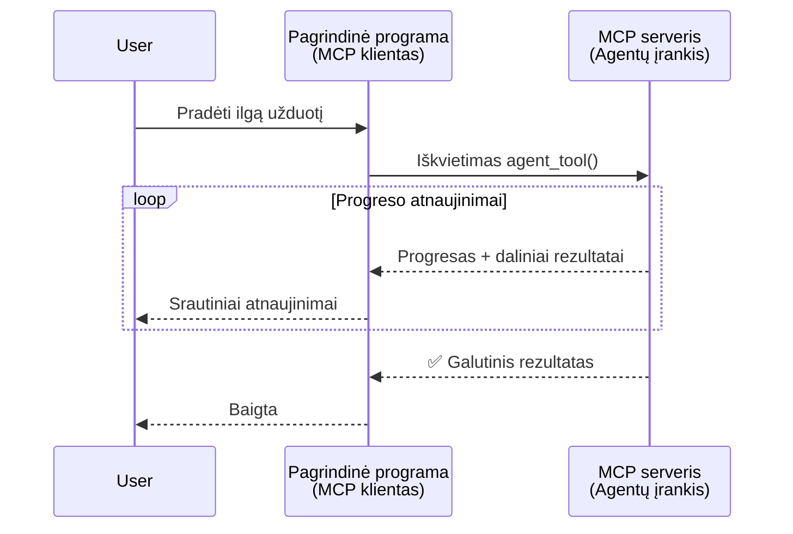
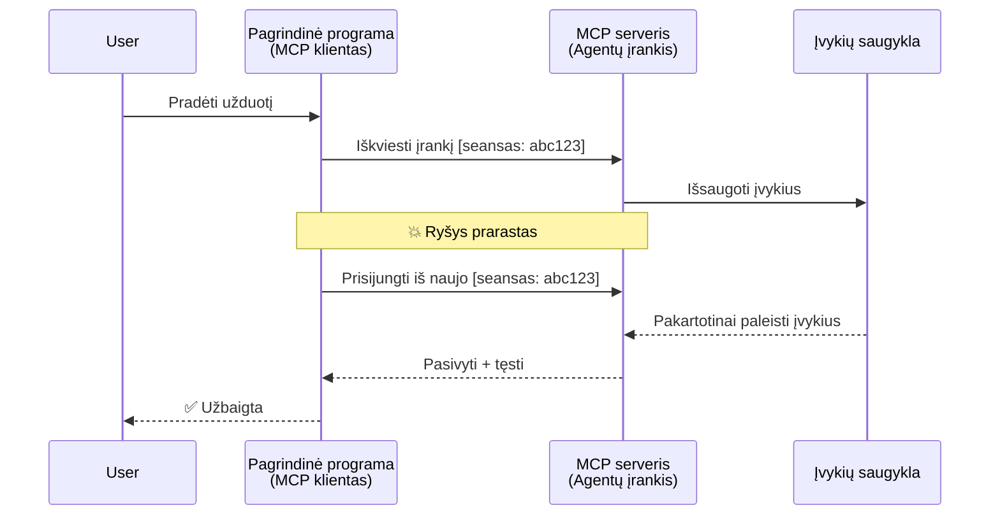
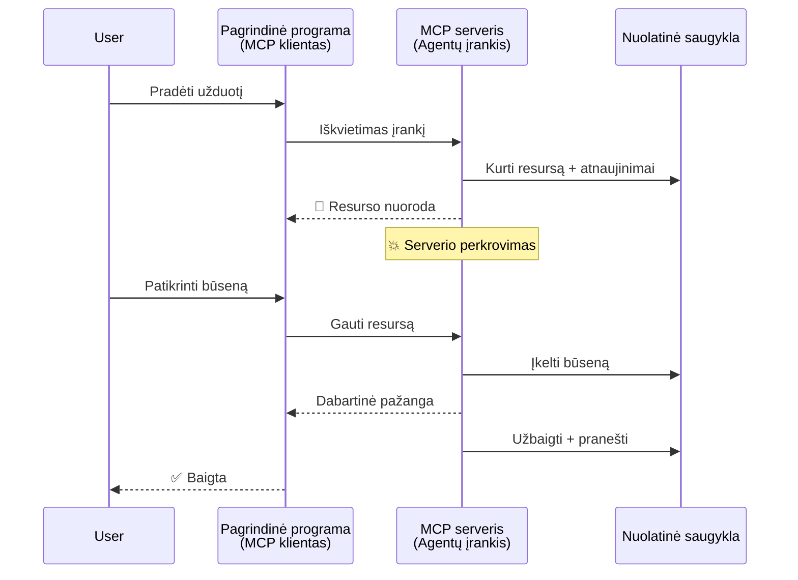
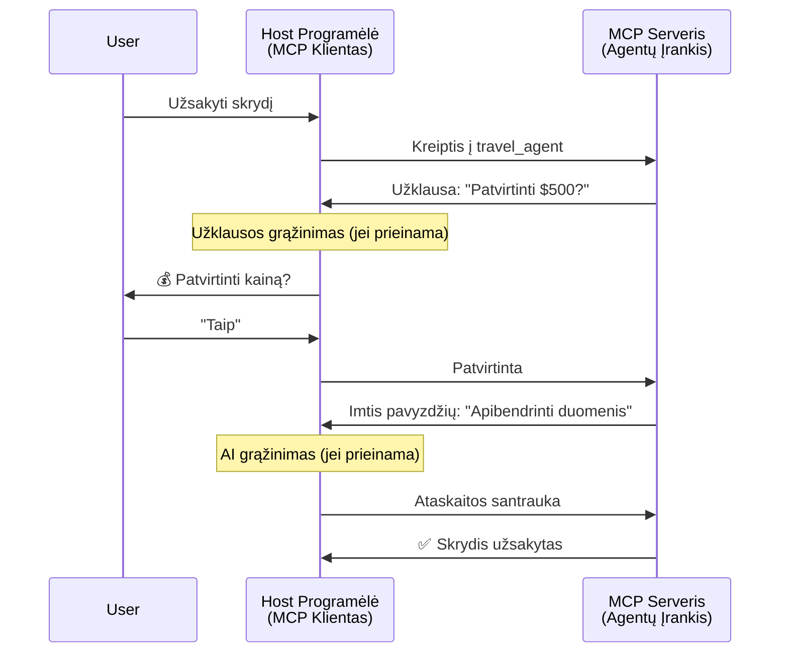
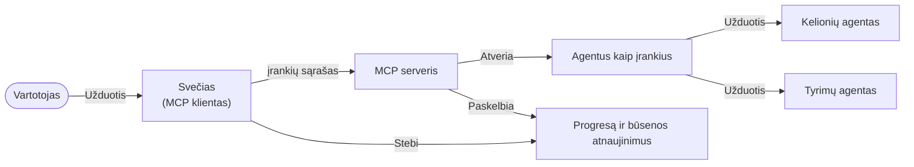

# Agentų tarpusavio komunikacijos sistemų kūrimas naudojant MCP

> TL;DR - Ar galite sukurti Agent2Agent komunikaciją ant MCP? Taip!

MCP stipriai išsivystė nuo pradinių tikslų „pateikti kontekstą LLM“. Naujausi patobulinimai, įskaitant [atnaujinamus srautus](https://modelcontextprotocol.io/docs/concepts/transports#resumability-and-redelivery), [iškėlimą](https://modelcontextprotocol.io/specification/2025-06-18/client/elicitation), [imties mėgimą](https://modelcontextprotocol.io/specification/2025-06-18/client/sampling) ir pranešimus ([progreso](https://modelcontextprotocol.io/specification/2025-06-18/basic/utilities/progress) ir [išteklių](https://modelcontextprotocol.io/specification/2025-06-18/schema#resourceupdatednotification)), MCP dabar suteikia patikimą pagrindą sudėtingoms agentų tarpusavio komunikacijos sistemoms kurti.

## Agentų/Įrankių klaidingas suvokimas

Kai daugiau kūrėjų nagrinėja įrankius su agentiniais elgesiais (veikiantys ilgą laiką, gali prireikti papildomos įvesties vykdymo metu ir pan.), dažna klaidinga nuomonė yra ta, kad MCP netinka, nes ankstyvieji jo įrankių primityvai buvo orientuoti į paprastus užklausų-atsakymų modelius.

Šis požiūris yra pasenęs. MCP specifikacija per pastaruosius kelis mėnesius buvo reikšmingai patobulinta su funkcijomis, kurios užpildo spragą ilgai trunkančių agentinių elgsenų kūrimui:

- **Srautinimas ir daliniai rezultatai**: realaus laiko progreso atnaujinimai vykdymo metu
- **Atnaujinamumas**: klientai gali prisijungti iš naujo ir tęsti po atjungimo
- **Patvarumas**: rezultatai išlieka net po serverio perkrovimo (pvz., per išteklių nuorodas)
- **Daugelio raundų**: interaktyvi įvestis vykdymo metu per iškėlimą ir imties mėgimą

Šias funkcijas galima derinti, siekiant įgalinti sudėtingas agentų ir daugiagentines programas, visos jos yra platinamos ant MCP protokolo.

Nuorodai naudosime agentą kaip „įrankį“, kuris yra prieinamas MCP serveryje. Tai reiškia, kad egzistuoja pagrindinė programa, kuri įgyvendina MCP klientą, užmezga sesiją su MCP serveriu ir gali kviesti agentą.

## Kas daro MCP įrankį „agentiniu“?

Prieš gilindamiesi į implementaciją, nustatykime, kokios infrastruktūros galimybės reikalingos ilgai veikiančių agentų palaikymui.

> Agentą apibrėšime kaip subjektą, kuris gali veikti autonomiškai ilgą laiką, gebantį atlikti sudėtingas užduotis, kurios gali reikalauti kelių sąveikų ar korekcijų pagal realaus laiko atsiliepimus.

### 1. Srautinimas ir daliniai rezultatai

Tradiciniai užklausų-atsakymų modeliai netinka ilgai trunkančioms užduotims. Agentai turi teikti:

- Realio laiko progreso atnaujinimus
- Tarpinius rezultatus

**MCP palaikymas**: Išteklių atnaujinimo pranešimai leidžia srautinį dalinių rezultatų perdavimą, nors tai reikalauja atsargaus dizaino norint išvengti konfliktų su JSON-RPC 1:1 užklausų/atsakymų modeliu.

| Funkcija                   | Naudojimo atvejis                                                                                                                                                              | MCP palaikymas                                                                              |
| -------------------------- | ------------------------------------------------------------------------------------------------------------------------------------------------------------------------------ | ------------------------------------------------------------------------------------------- |
| Realio laikrodžio pažanga   | Vartotojas prašo perkelti kodą. Agentas iš srauto perduoda pažangą: „10% – analizuoja priklausomybes… 25% – konvertuoja TypeScript failus… 50% – atnaujina importus…“         | ✅ Progreso pranešimai                                                                      |
| Daliniai rezultatai        | Užduotis „sukurti knygą“ srautiniu būdu pateikia dalinius rezultatus, pvz., 1) siužeto apžvalgą, 2) skyrių sąrašą, 3) kiekvieną skyrių kaip baigtą. Pagrindinė programa gali tikrinti, atšaukti ar peradresuoti bet kuriuo metu. | ✅ Pranešimus galima „išplėsti“ įtraukiant dalinius rezultatus – žr. pasiūlymus PR 383, 776 |

<div align="center" style="font-style: italic; font-size: 0.95em; margin-bottom: 0.5em;">
<strong>1 pav.:</strong> Ši diagrama iliustruoja, kaip MCP agentas srautu perduoda realaus laiko progreso atnaujinimus ir dalinius rezultatus pagrindinei programai ilgai trunkančios užduoties metu, leidžiant vartotojui stebėti vykdymą realiu laiku.
</div>


```mermaid
sequenceDiagram
    participant User
    participant Host as Pagrindinė programa<br/>(MCP klientas)
    participant Server as MCP serveris<br/>(Agentų įrankis)

    User->>Host: Pradėti ilgą užduotį
    Host->>Server: Iškvietimas agent_tool()

    loop Progreso atnaujinimai
        Server-->>Host: Progresas + daliniai rezultatai
        Host-->>User: Srautiniai atnaujinimai
    end

    Server-->>Host: ✅ Galutinis rezultatas
    Host-->>User: Baigta
```

### 2. Atnaujinamumas

Agentai turi sklandžiai tvarkyti tinklo pertraukas:

- Prisijungti iš naujo po (kliento) atjungimo
- Tęsti nuo ten, kur nutrūko (pranešimų pakartojimas)

**MCP palaikymas**: MCP StreamableHTTP transportas šiandien palaiko sesijos atnaujinimą ir pranešimų pakartojimą su sesijos ID ir paskutinių įvykių ID. Svarbu, kad serveris įgyvendintų EventStore, leidžiantį įvykių perklausą kliento prisijungimo metu.  
Atkreipkite dėmesį, kad bendruomenėje yra pasiūlymas (PR #975), nagrinėjantis transporto-agnostinius atnaujinamus srautus.

| Funkcija       | Naudojimo atvejis                                                                                                                                                     | MCP palaikymas                                                             |
| -------------- | -------------------------------------------------------------------------------------------------------------------------------------------------------------------- | ------------------------------------------------------------------------- |
| Atnaujinamumas | Klientas atjungiamas ilgai trunkančios užduoties metu. Prisijungus iš naujo, sesija atnaujinama su praleistų įvykių perklausa, tęsiant sklandžiai nuo nutrūkimo vietos. | ✅ StreamableHTTP transportas su sesijos ID, įvykių perklausa ir EventStore |

<div align="center" style="font-style: italic; font-size: 0.95em; margin-bottom: 0.5em;">
<strong>2 pav.:</strong> Ši diagrama rodo, kaip MCP StreamableHTTP transportas ir įvykių saugykla leidžia sklandų sesijos atnaujinimą: jei klientas atsijungia, jis gali prisijungti iš naujo ir perklausyti praleistus įvykius, tęsiant užduotį be pažangos praradimo.
</div>


```mermaid
sequenceDiagram
    participant User
    participant Host as Pagrindinė programa<br/>(MCP klientas)
    participant Server as MCP serveris<br/>(Agentų įrankis)
    participant Store as Įvykių saugykla

    User->>Host: Pradėti užduotį
    Host->>Server: Iškviesti įrankį [seansas: abc123]
    Server->>Store: Išsaugoti įvykius

    Note over Host,Server: 💥 Ryšys prarastas

    Host->>Server: Prisijungti iš naujo [seansas: abc123]
    Store-->>Server: Pakartotinai paleisti įvykius
    Server-->>Host: Pasivyti + tęsti
    Host-->>User: ✅ Užbaigta
```

### 3. Patvarumas

Ilgai veikiančiems agentams reikalinga nuolatinė būsena:

- Rezultatai išlieka serveryje perkraunant
- Būsena gali būti gaunama ne iškart
- Progreso stebėjimas per kelias sesijas

**MCP palaikymas**: MCP dabar palaiko Išteklių nuorodų grąžinimo tipą įrankių kvietimuose. Dabartinis modelis - įrankis sukuria išteklių ir iškart grąžina jo nuorodą. Įrankis gali tęsti užduoties vykdymą fone ir atnaujinti išteklių. Klientas gali periodiškai tikrinti išteklių būseną dėl dalinių ar pilnų rezultatų arba užsiprenumeruoti atnaujinimo pranešimus.

Vienas trūkumas yra tas, kad periodinis išteklių tikrinimas arba užsiprenumeravimas gali vartoti daug išteklių, kas tampa aktualu dideliu mastu. Yra atviras bendruomenės pasiūlymas (įskaitant #992), kuris tyrinėja galimybę įtraukti webhook'us ar įjungiklius, kuriuos serveris galėtų kviesti, norėdamas pranešti klientui/pagrindinei programai apie atnaujinimus.

| Funkcija      | Naudojimo atvejis                                                                                                                                         | MCP palaikymas                                                     |
| ------------ | -------------------------------------------------------------------------------------------------------------------------------------------------------- | ----------------------------------------------------------------- |
| Patvarumas   | Serveris sugenda duomenų migracijos užduoties metu. Rezultatai ir progresas išlieka po perkrovimo, klientas gali patikrinti būseną ir tęsti nuo nuolatinio išteklių. | ✅ Išteklių nuorodos su nuolatine saugykla ir būsenos pranešimais |

Įprastas modelis – įrankis sukuria išteklių ir iškart grąžina jo nuorodą. Toliau įrankis fone dirba su užduotimi, siunčia išteklių pranešimus, kurie gali būti progreso atnaujinimai ar daliniai rezultatai, ir atnaujina ištekliaus turinį pagal poreikį.

<div align="center" style="font-style: italic; font-size: 0.95em; margin-bottom: 0.5em;">
<strong>3 pav.:</strong> Ši diagrama parodo, kaip MCP agentai naudoja nuolatinius išteklius ir būsenos pranešimus, siekdami užtikrinti, kad ilgai trunkančios užduotys išgyvena serverio perkrovimus, leidžiant klientams tikrinti progresą ir gauti rezultatus net po gedimų.
</div>


```mermaid
sequenceDiagram
    participant User
    participant Host as Pagrindinė programa<br/>(MCP klientas)
    participant Server as MCP serveris<br/>(Agentų įrankis)
    participant DB as Nuolatinė saugykla

    User->>Host: Pradėti užduotį
    Host->>Server: Iškvietimas įrankį
    Server->>DB: Kurti resursą + atnaujinimai
    Server-->>Host: 🔗 Resurso nuoroda

    Note over Server: 💥 Serverio perkrovimas

    User->>Host: Patikrinti būseną
    Host->>Server: Gauti resursą
    Server->>DB: Įkelti būseną
    Server-->>Host: Dabartinė pažanga
    Server->>DB: Užbaigti + pranešti
    Host-->>User: ✅ Baigta
```

### 4. Daugelio raundų sąveikos

Agentams dažnai reikia papildomos įvesties vykdymo metu:

- Žmogiškos paaiškinimo ar patvirtinimo
- Dirbtinio intelekto pagalbos sudėtingiems sprendimams
- Dinaminio parametru keitimo

**MCP palaikymas**: visiškai palaikoma per imties mėgimą (AI įvestims) ir iškėlimą (žmogaus įvestims).

| Funkcija               | Naudojimo atvejis                                                                                                                                           | MCP palaikymas                                           |
| --------------------- | ---------------------------------------------------------------------------------------------------------------------------------------------------------- | ------------------------------------------------------- |
| Daugelio raundų sąveikos | Kelionių agentas prašo vartotojo patvirtinti kainą, tada prašo AI apibendrinti kelionės duomenis prieš užbaigiant užsakymą.                                  | ✅ Iškėlimas žmogaus įvestims, imties mėgimas AI įvestims |

<div align="center" style="font-style: italic; font-size: 0.95em; margin-bottom: 0.5em;">
<strong>4 pav.:</strong> Ši diagrama iliustruoja, kaip MCP agentai gali interaktyviai iškelti žmogišką įvestį ar prašyti DI pagalbos vykdymo metu, palaikydami sudėtingus daugelio raundų darbo eigas, tokias kaip patvirtinimai ir dinaminiai sprendimai.
</div>


```mermaid
sequenceDiagram
    participant User
    participant Host as Host Programėlė<br/>(MCP Klientas)
    participant Server as MCP Serveris<br/>(Agentų Įrankis)

    User->>Host: Užsakyti skrydį
    Host->>Server: Kreiptis į travel_agent

    Server->>Host: Užklausa: "Patvirtinti $500?"
    Note over Host: Užklausos grąžinimas (jei prieinama)
    Host->>User: 💰 Patvirtinti kainą?
    User->>Host: "Taip"
    Host->>Server: Patvirtinta

    Server->>Host: Imtis pavyzdžių: "Apibendrinti duomenis"
    Note over Host: AI grąžinimas (jei prieinama)
    Host->>Server: Ataskaitos santrauka

    Server->>Host: ✅ Skrydis užsakytas
```

## Ilgai trunkančių agentų įgyvendinimas MCP – kodo apžvalga

Šio straipsnio metu pateikiame [kodo saugyklą](https://github.com/victordibia/ai-tutorials/tree/main/MCP%20Agents), kurią sudaro pilna ilgai trunkančių agentų implementacija, naudojant MCP Python SDK su StreamableHTTP transportu sesijai atnaujinti ir pranešimų pakartojimui. Implementacija demonstruoja, kaip MCP galimybes galima derinti, siekiant sudėtingų agentinių elgsenų.

Konkrečiai įgyvendiname serverį su dviem pagrindiniais agentų įrankiais:

- **Kelionių agentas** – modeliuoja kelionių užsakymo paslaugą su kainos patvirtinimu per iškėlimą
- **Tyrimų agentas** – atlieka tyrimus su DI pagelbėtomis santraukų kūrimo per mėgimą funkcijomis

Abu agentai demonstruoja realaus laiko progreso atnaujinimus, interaktyvius patvirtinimus ir visišką sesijos atnaujinimų palaikymą.

### Pagrindinės įgyvendinimo sąvokos

Toliau pateikti skyriai rodo serverio pusės agentų implementaciją ir kliento/subjekto valdymą kiekvienai funkcijai:

#### Srautinimas ir progreso atnaujinimai – realaus laiko užduoties būsena

Srautinimas leidžia agentams pateikti realaus laiko progresą ilgai trunkančių užduočių metu, informuodamas vartotojus apie užduoties būseną ir tarpinius rezultatus.

**Serverio įgyvendinimas (agentas siunčia progreso pranešimus):**

```python
# Iš server/server.py - Kelionių agentas siunčia pažangos atnaujinimus
for i, step in enumerate(steps):
    await ctx.session.send_progress_notification(
        progress_token=ctx.request_id,
        progress=i * 25,
        total=100,
        message=step,
        related_request_id=str(ctx.request_id)
    )
    await anyio.sleep(2)  # Simuliuoti darbą

# Alternatyva: Žurnalo pranešimai išsamiam žingsnis po žingsnio atnaujinimui
await ctx.session.send_log_message(
    level="info",
    data=f"Processing step {current_step}/{steps} ({progress_percent}%)",
    logger="long_running_agent",
    related_request_id=ctx.request_id,
)
```

**Kliento įgyvendinimas (pagrindinė programa gauna progreso atnaujinimus):**

```python
# Iš klientas/client.py - Klientas, tvarkantis realaus laiko pranešimus
async def message_handler(message) -> None:
    if isinstance(message, types.ServerNotification):
        if isinstance(message.root, types.LoggingMessageNotification):
            console.print(f"📡 [dim]{message.root.params.data}[/dim]")
        elif isinstance(message.root, types.ProgressNotification):
            progress = message.root.params
            console.print(f"🔄 [yellow]{progress.message} ({progress.progress}/{progress.total})[/yellow]")

# Užregistruoti žinutės tvarkyklę kuriant sesiją
async with ClientSession(
    read_stream, write_stream,
    message_handler=message_handler
) as session:
```

#### Iškėlimas – vartotojo įvesties prašymas

Iškėlimas leidžia agentams prašyti vartotojo įvesties vykdymo metu. Tai būtina patvirtinimams, paaiškinimams ar sutikimams ilgai trunkančių užduočių metu.

**Serverio įgyvendinimas (agentas prašo patvirtinimo):**

```python
# Iš server/server.py - Kelionių agentas prašo patvirtinti kainą
elicit_result = await ctx.session.elicit(
    message=f"Please confirm the estimated price of $1200 for your trip to {destination}",
    requestedSchema=PriceConfirmationSchema.model_json_schema(),
    related_request_id=ctx.request_id,
)

if elicit_result and elicit_result.action == "accept":
    # Tęsti rezervaciją
    logger.info(f"User confirmed price: {elicit_result.content}")
elif elicit_result and elicit_result.action == "decline":
    # Atšaukti rezervaciją
    booking_cancelled = True
```

**Kliento įgyvendinimas (pagrindinė programa teikia iškėlimo grąžintinį ryšį):**

```python
# Iš client/client.py - Kliento užklausų tvarkymas
async def elicitation_callback(context, params):
    console.print(f"💬 Server is asking for confirmation:")
    console.print(f"   {params.message}")

    response = console.input("Do you accept? (y/n): ").strip().lower()

    if response in ['y', 'yes']:
        return types.ElicitResult(
            action="accept",
            content={"confirm": True, "notes": "Confirmed by user"}
        )
    else:
        return types.ElicitResult(
            action="decline",
            content={"confirm": False, "notes": "Declined by user"}
        )

# Užregistruoti atgalinį kvietimą kuriant sesiją
async with ClientSession(
    read_stream, write_stream,
    elicitation_callback=elicitation_callback
) as session:
```

#### Mėgimas – DI pagalbos prašymas

Mėgimas leidžia agentams prašyti LLM pagalbos sudėtingiems sprendimams ar turinio generavimui vykdymo metu. Tai leidžia hibridinius žmogaus-DI darbo procesus.

**Serverio įgyvendinimas (agentas prašo DI pagalbos):**

```python
# Iš server/server.py - Tyrimų agentas prašo AI santraukos
sampling_result = await ctx.session.create_message(
    messages=[
        SamplingMessage(
            role="user",
            content=TextContent(type="text", text=f"Please summarize the key findings for research on: {topic}")
        )
    ],
    max_tokens=100,
    related_request_id=ctx.request_id,
)

if sampling_result and sampling_result.content:
    if sampling_result.content.type == "text":
        sampling_summary = sampling_result.content.text
        logger.info(f"Received sampling summary: {sampling_summary}")
```

**Kliento įgyvendinimas (pagrindinė programa teikia mėgimo grąžintinį ryšį):**

```python
# Iš client/client.py - Kliento užklausų apdorojimas dėl mėginių ėmimo
async def sampling_callback(context, params):
    message_text = params.messages[0].content.text if params.messages else 'No message'
    console.print(f"🧠 Server requested sampling: {message_text}")

    # Tikroje programoje tai galėtų iškviesti LLM API
    # Demonstravimo tikslais pateikiame netikrą atsakymą
    mock_response = "Based on current research, MCP has evolved significantly..."

    return types.CreateMessageResult(
        role="assistant",
        content=types.TextContent(type="text", text=mock_response),
        model="interactive-client",
        stopReason="endTurn"
    )

# Užregistruokite atgalinį kvietimą kurdami sesiją
async with ClientSession(
    read_stream, write_stream,
    sampling_callback=sampling_callback,
    elicitation_callback=elicitation_callback
) as session:
```

#### Atnaujinamumas – sesijos tęstinumas per atjungimus

Atnaujinamumas užtikrina, kad ilgai trunkančios agentų užduotys gali išgyventi kliento atjungimą ir tęstis sklandžiai prisijungus iš naujo. Tai įgyvendinama per įvykių saugyklas ir atnaujinimo žetonus.

**Įvykių saugyklos įgyvendinimas (serveris saugo sesijos būseną):**

```python
# Iš server/event_store.py - Paprasta atmintyje veikianti įvykių saugykla
class SimpleEventStore(EventStore):
    def __init__(self):
        self._events: list[tuple[StreamId, EventId, JSONRPCMessage]] = []
        self._event_id_counter = 0

    async def store_event(self, stream_id: StreamId, message: JSONRPCMessage) -> EventId:
        """Store an event and return its ID."""
        self._event_id_counter += 1
        event_id = str(self._event_id_counter)
        self._events.append((stream_id, event_id, message))
        return event_id

    async def replay_events_after(self, last_event_id: EventId, send_callback: EventCallback) -> StreamId | None:
        """Replay events after the specified ID for resumption."""
        # Rasti įvykius po paskutinio žinomo įvykio ir juos atkartojo
        for _, event_id, message in self._events[start_index:]:
            await send_callback(EventMessage(message, event_id))

# Iš server/server.py - Perduoti įvykių saugyklą sesijų tvarkytojui
def create_server_app(event_store: Optional[EventStore] = None) -> Starlette:
    server = ResumableServer()

    # Sukurti sesijų tvarkytoją su įvykių saugykla tęsimui
    session_manager = StreamableHTTPSessionManager(
        app=server,
        event_store=event_store,  # Įvykių saugykla leidžia tęsti sesiją
        json_response=False,
        security_settings=security_settings,
    )

    return Starlette(routes=[Mount("/mcp", app=session_manager.handle_request)])

# Naudojimas: Inicializuoti su įvykių saugykla
event_store = SimpleEventStore()
app = create_server_app(event_store)
```

**Kliento metaduomenys su atnaujinimo žetonu (klientas prisijungia iš naujo naudojant saugomą būseną):**

```python
# Iš client/client.py - Kliento tęsinys su metaduomenimis
if existing_tokens and existing_tokens.get("resumption_token"):
    # Naudokite esamą tęsinio žetoną, kad tęstumėte nuo ten, kur baigėme
    metadata = ClientMessageMetadata(
        resumption_token=existing_tokens["resumption_token"],
    )
else:
    # Sukurkite atgalinio kvietimo funkciją, kad išsaugotumėte tęsinio žetoną, kai jis gaunamas
    def enhanced_callback(token: str):
        protocol_version = getattr(session, 'protocol_version', None)
        token_manager.save_tokens(session_id, token, protocol_version, command, args)

    metadata = ClientMessageMetadata(
        on_resumption_token_update=enhanced_callback,
    )

# Išsiųskite užklausą su tęsinio metaduomenimis
result = await session.send_request(
    types.ClientRequest(
        types.CallToolRequest(
            method="tools/call",
            params=types.CallToolRequestParams(name=command, arguments=args)
        )
    ),
    types.CallToolResult,
    metadata=metadata,
)
```

Pagrindinė programa vietoje palaiko sesijos ID ir atnaujinimo žetonus, leidžiančius prisijungti prie esamų sesijų neprarandant pažangos ar būsenos.

### Kodo organizavimas

<div align="center" style="font-style: italic; font-size: 0.95em; margin-bottom: 0.5em;">
<strong>5 pav.:</strong> MCP pagrindu sukurta agentų sistemos architektūra
</div>


```mermaid
graph LR
    User([Vartotojas]) -->|"Užduotis"| Host["Svečias<br/>(MCP klientas)"]
    Host -->|įrankių sąrašas| Server[MCP serveris]
    Server -->|Atveria| AgentsTools[Agentus kaip įrankius]
    AgentsTools -->|Užduotis| AgentA[Kelionių agentas]
    AgentsTools -->|Užduotis| AgentB[Tyrimų agentas]

    Host -->|Stebi| StateUpdates[Progresą ir būsenos atnaujinimus]
    Server -->|Paskelbia| StateUpdates

    class User user;
    class AgentA,AgentB agent;
    class Host,Server,StateUpdates core;
```

**Svarbūs failai:**

- **`server/server.py`** – atnaujinamas MCP serveris su kelionių ir tyrimų agentais, demonstruojantis iškėlimą, mėgimą ir progreso atnaujinimus
- **`client/client.py`** – interaktyvi pagrindinė programa su sesijos atnaujinimo palaikymu, grąžintinių ryšių tvarkytuvais ir žetonų valdymu
- **`server/event_store.py`** – įvykių saugyklos įgyvendinimas, leidžiantis sesijos atnaujinimą ir pranešimų pakartojimą

## Išplėtimas į daugiagentinę komunikaciją MCP naudotojų tarpe

Aukščiau pateiktą implementaciją galima išplėsti į daugiagentines sistemas, sustiprinant pagrindinės programos intelektą ir aprėptį:

- **Išmani užduočių skaidymas**: Pagrindinė programa analizuoja sudėtingas vartotojo užklausas ir dalina jas į pogrupius skirtingiems specializuotiems agentams
- **Daugelio serverių koordinavimas**: Pagrindinė programa palaiko ryšius su keliais MCP serveriais, kiekvienas ekspozuoja skirtingas agentų galimybes
- **Užduočių būsenos valdymas**: Pagrindinė programa seka pažangą keliuose vienlaikiuose agentų užduotyse, tvarko priklausomybes ir eiliškumą
- **Atsparumas ir pakartojimai**: Pagrindinė programa valdo klaidas, įgyvendina pakartojimo logiką ir nukreipia užduotis, kai agentai tampa nepasiekiami
- **Rezultatų sintezė**: Pagrindinė programa apjungia kelių agentų išvestis į nuoseklius galutinius rezultatus

Pagrindinė programa evoliucionuoja iš paprasto kliento į išmanųjų koordinatorių, valdantį paskirstytas agentų galimybes, išlaikydama tą patį MCP protokolo pagrindą.

## Išvados

MCP patobulintos galimybės – išteklių pranešimai, iškėlimas/mėgimas, atnaujinami srautai ir nuolatiniai ištekliai – leidžia sudėtingą agentų tarpusavio sąveiką, išlaikant protokolo paprastumą.

## Kaip pradėti

Pasiruošę kurti savo agent2agent sistemą? Vadovaukitės šiais žingsniais:

### 1. Paleiskite demonstraciją

```bash
# Paleiskite serverį su įvykių saugykla tęsimui
python -m server.server --port 8006

# Kitame terminale paleiskite interaktyvų klientą
python -m client.client --url http://127.0.0.1:8006/mcp
```

**Interaktyvaus režimo komandų prieinamumas:**

- `travel_agent` – užsakykite kelionę su kainos patvirtinimu per iškėlimą
- `research_agent` – vykdykite tyrimus su dirbtinio intelekto pagalba santraukose per mėgimą
- `list` – rodyti visus prieinamus įrankius
- `clean-tokens` – išvalyti atnaujinimo žetonus
- `help` – rodyti išsamią pagalbą komandoms
- `quit` – išeiti iš kliento

### 2. Išbandykite atnaujinimo galimybes

- Pradėkite ilgai trunkantį agentą (pvz., `travel_agent`)
- Nutraukite kliento veikimą vykdymo metu (Ctrl+C)
- Perkraukite klientą – jis automatiškai tęs nuo ten, kur baigė

### 3. Tyrinėkite ir išplėskite

- **Tyrinėkite pavyzdžius**: Peržiūrėkite šią [mcp-agents](https://github.com/victordibia/ai-tutorials/tree/main/MCP%20Agents)
- **Prisijunkite prie bendruomenės**: Dalyvaukite MCP diskusijose GitHub platformoje
- **Eksperimentuokite**: Pradėkite nuo paprastos ilgai trunkančios užduoties ir palaipsniui pridėkite srautinimą, atnaujinamumą ir daugiagentinę koordinaciją

Tai demonstruoja, kaip MCP leidžia intelektualų agentų elgesį, išlaikant įrankių pagrindu paprastumą.

Apskritai, MCP protokolo specifikacija greitai vystosi; skaitytojui rekomenduojame peržiūrėti oficialią dokumentacijos svetainę, kad gautų naujausius atnaujinimus – https://modelcontextprotocol.io/introduction

---

<!-- CO-OP TRANSLATOR DISCLAIMER START -->
**Atsakomybės apribojimas**:
Šis dokumentas buvo išverstas naudojant dirbtinio intelekto vertimo paslaugą [Co-op Translator](https://github.com/Azure/co-op-translator). Nors siekiame tikslumo, prašome atkreipti dėmesį, kad automatiniai vertimai gali turėti klaidų ar netikslumų. Originalus dokumentas jo gimtąja kalba laikomas autoritetingu šaltiniu. Svarbiai informacijai rekomenduojama naudoti profesionalų žmogiškąjį vertimą. Mes neatsakome už jokius nesusipratimus ar neteisingą interpretaciją, kilusią naudojantis šiuo vertimu.
<!-- CO-OP TRANSLATOR DISCLAIMER END -->