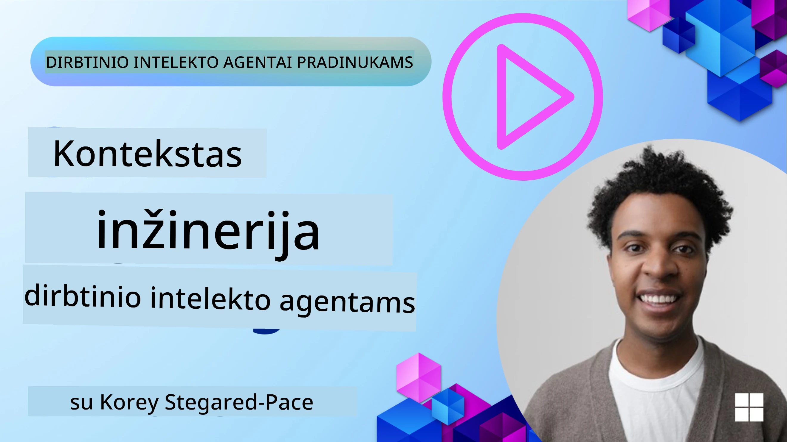
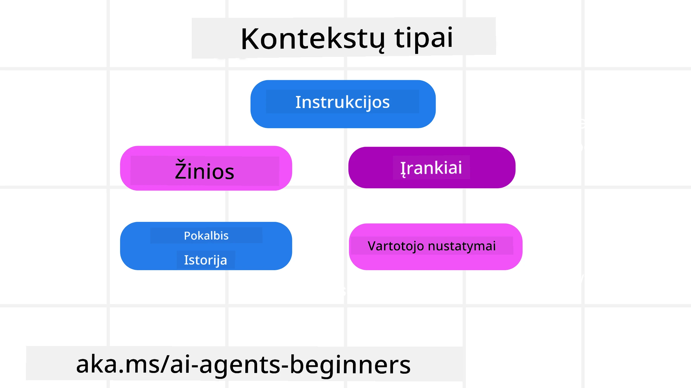
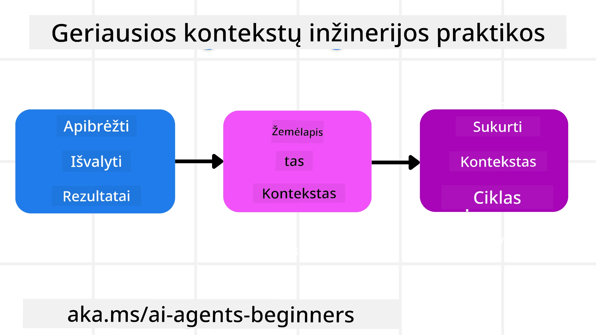

# Konteksto inžinerija AI agentams

> _(Spustelkite aukščiau esančią nuotrauką, norėdami peržiūrėti šios pamokos vaizdo įrašą)_

Suprasti programos sudėtingumą, kurios AI agentą kuriate, yra svarbu norint sukurti patikimą agentą. Turime kurti AI agentus, kurie efektyviai tvarkytų informaciją, kad atitiktų sudėtingus poreikius, kurie viršija užklausų inžineriją.

Šioje pamokoje apžvelgsime, kas yra konteksto inžinerija ir koks jos vaidmuo kuriant AI agentus.

## Įvadas

Šioje pamokoje aptarsime:

• **Kas yra konteksto inžinerija** ir kuo ji skiriasi nuo užklausų inžinerijos.

• **Efektyvios konteksto inžinerijos strategijas**, įskaitant kaip rašyti, rinktis, suspausti ir izoliuoti informaciją.

• **Įprastas konteksto klaidas**, kurios gali sutrikdyti jūsų AI agentą, ir kaip jas ištaisyti.

## Mokymosi tikslai

Baigę šią pamoką, gebėsite:

• **Apibrėžti konteksto inžineriją** ir atskirti ją nuo užklausų inžinerijos.

• **Nustatyti pagrindines konteksto sudedamąsias dalis** didelėse kalbų modelių (LLM) programose.

• **Taikyti konteksto rašymo, atrankos, suspaudimo ir izoliavimo strategijas**, siekiant pagerinti agento veikimą.

• **Atpažinti įprastas konteksto klaidas**, tokias kaip užnuodijimas, išsiblaškymas, painiava ir konfliktas, ir įgyvendinti jų mažinimo metodus.

## Kas yra konteksto inžinerija?

AI agentams kontekstas yra tai, kas lemia, kaip AI agentas planuoja imtis tam tikrų veiksmų. Konteksto inžinerija yra praktika užtikrinti, kad AI agentas turėtų reikiamą informaciją, kad atliktų kitą užduoties žingsnį. Konteksto lango dydis yra ribotas, todėl kūrėjai turi kurti sistemas ir procesus, leidžiančius valdyti informacijos įtraukimo, pašalinimo ir suspaudimo procesus konteksto lange.

### Užklausų inžinerija prieš konteksto inžineriją

Užklausų inžinerija yra orientuota į vieną statinių nurodymų rinkinį, kuris efektyviai nukreipia AI agentus su tam tikromis taisyklėmis. Konteksto inžinerija – tai kaip valdyti dinaminį informacijos rinkinį, įskaitant pradinę užklausą, siekiant užtikrinti, kad AI agentas turėtų reikalingą informaciją bėgant laikui. Pagrindinė konteksto inžinerijos idėja yra padaryti šį procesą kartojamu ir patikimu.

### Konteksto tipai

Svarbu atsiminti, kad kontekstas nėra vienas dalykas. Informacija, kurios AI agentui reikia, gali kilti iš įvairių šaltinių, ir mums tenka užtikrinti, kad agentas turėtų prieigą prie šių šaltinių:

Konteksto tipai, kuriais gali tekti rūpintis AI agentui, yra šie:

• **Nurodymai:** Tai tarsi agento „taisyklių“ rinkinys – užklausos, sistemos pranešimai, kelių pavyzdžių demonstravimas (rodant AI, kaip ką nors daryti) ir įrankių aprašymai. Čia užklausų inžinerijos dėmesys susijungia su konteksto inžinerija.

• **Žinios:** Faktai, informacija, gaunama iš duomenų bazių arba ilgalaikių agento atminties įrašų. Tai apima ir RAG (Retrieval Augmented Generation) sistemų integraciją, jei agentui reikia prieigos prie skirtingų žinių kaupiklių ir duomenų bazių.

• **Įrankiai:** Tai išorinės funkcijos, API ir MCP serveriai, kuriuos agentas gali iškviesti, kartu su grįžtamuoju ryšiu (rezultatais), gautais juos naudojant.

• **Pokalbių istorija:** Vartotojo vykdoma nuolatinė sąveika. Laikui bėgant pokalbiai ilgėja ir komplikuojasi, todėl užima vietą konteksto lange.

• **Vartotojo pageidavimai:** Informacija, sužinoma apie vartotojo pomėgius ar nepatinkamus dalykus per laiką. Ji gali būti saugoma ir naudojama priimant svarbius sprendimus vartotojo naudai.

## Efektyvios konteksto inžinerijos strategijos

### Planavimo strategijos

Gera konteksto inžinerija prasideda nuo gero planavimo. Štai požiūris, kuris padės jums pradėti mąstyti, kaip taikyti konteksto inžinerijos sąvoką:

1. **Apibrėžkite aiškius rezultatus** – užduotys, kurias bus paskirti AI agentai, turėtų turėti aiškiai apibrėžtus rezultatus. Atsakykite į klausimą: „Kaip atrodys pasaulis, kai AI agentas baigs savo užduotį?“ Kitaip tariant, kokį pokytį, informaciją ar atsakymą vartotojas turėtų gauti bendraudamas su AI agentu.
2. **Žemėlapiuokite kontekstą** – kai apibrėžiate AI agento rezultatus, turite atsakyti į klausimą: „Kokia informacija reikalinga AI agentui, kad jis galėtų atlikti šią užduotį?“. Taip galite pradėti žemėlapį, kur ta informacija gali būti randama.
3. **Sukurkite konteksto srautus** – kai žinote, kur yra informacija, turite atsakyti į klausimą: „Kaip agentas gaus šią informaciją?“. Tai gali būti atliekama įvairiais būdais, įskaitant RAG, MCP serverių ir kitų įrankių naudojimą.

### Praktinės strategijos

Planavimas svarbus, tačiau kai informacija pradeda tekėti į agento konteksto langą, reikia turėti praktinių būdų ją valdyti:

#### Konteksto valdymas

Nors tam tikra informacija automatiškai pridedama į konteksto langą, konteksto inžinerija reiškia aktyvesnį informacijos valdymą, kuris gali būti atliekamas keliais būdais:

 1. **Agentų užrašų knygelė**  
 Leidžia AI agentui užsirašyti svarbią informaciją apie einamas užduotis ir vartotojo sąveikas vieno seanso metu. Ji turėtų būti laikoma ne konteksto lange, o faile ar vykdymo objekte, kurį agentas vėliau gali pasiekti toje sesijoje, jei prireiks.

 2. **Atmintys**  
 Užrašų knygelės gerai valdo informaciją už vieno seanso konteksto lango ribų. Atmintys leidžia agentams saugoti ir atkurti svarbią informaciją per kelis seansus. Tai gali būti santraukos, vartotojo pageidavimai ir būsimų patobulinimų atsiliepimai.

 3. **Konteksto suspaudimas**  
 Kai konteksto langas auga ir artėja prie ribos, galima taikyti tokius metodus kaip santraukos sudarymas ir apkarpymas. Tai reiškia, kad laikomas tik pats svarbiausias turinys arba pašalinamos senos žinutės.

 4. **Daugiagentinės sistemos**  
 Kuriant daugiagentines sistemas, kiekvienas agentas turi savo konteksto langą. Kaip šis kontekstas dalijamas ir perduodamas tarp agentų, yra dar vienas planavimo aspektas.

 5. **Smėlio dėžės aplinkos**  
 Jei agentui reikia vykdyti kodą ar apdoroti didelius informacijos kiekius dokumente, tai gali sunaudoti daug žetonų rezultatų apdorojimui. Užuot visa tai laikęs konteksto lange, agentas gali naudoti smėlio dėžės aplinką, galinčią vykdyti kodą ir tik skaityti rezultatus bei kitą svarbią informaciją.

 6. **Vykdymo būsenos objektai**  
 Tai daroma sukuriant informacijos konteinerius, kad būtų galima valdyti situacijas, kai agentui reikia prieigos prie tam tikros informacijos. Sudėtingai užduočiai tai leistų agentui žingsnis po žingsnio saugoti kiekvienos poskyros rezultatus, leidžiant kontekstui būti susietam tik su konkrečia poskyra.

#### Konteksto tikrinimas

Pritaikius vieną iš šių strategijų verta patikrinti, ką tiksliai gavo kitas modelio kvietimas. Naudingas derinimo klausimas:

> Ar agentas įkėlė per daug konteksto, netinkamą kontekstą ar praleido reikalingą kontekstą?

Jums nereikia registruoti žaliųjų užklausų, įrankių išėjimų ar atminties turinio, kad atsakytumėte į šį klausimą. Produkcijoje geriau naudoti mažus konteksto patikrinimo įrašus, kurie fiksuoja skaičius, id, maišinius ir politikos etiketes:

- **Atranka:** Stebėkite, kiek kandidatų fragmentų, įrankių ar atminties buvo svarstyta, kiek iš jų pasirinkta, ir kokia taisyklė ar balas dėl kitų atrinkimo buvo atmestas.
- **Suspaudimas:** Užfiksuokite šaltinio intervalą arba pėdsako id, santraukos id, apytikslį žetonų skaičių prieš ir po suspaudimo, ir ar žali turinys buvo pašalintas iš kito kvietimo.
- **Izoliavimas:** Užfiksuokite, kuri poskyrio užduotis vyko atskirame agente, sesijoje ar smėlio dėžėje, kokia buvo pateikta ribota santrauka ir ar dideli įrankių rezultatai liko už pagrindinio agento konteksto ribų.
- **Atmintis ir RAG:** Laikykite paieškos dokumentų id, atminties id, balus, pasirinktus id ir cenzūros būseną, vietoje viso gauto teksto.
- **Sauga ir privatumas:** Rinkitės maišinius, id, žetonų talpas ir politikos etiketes vietoje jautraus užklausų teksto, įrankių argumentų, rezultatų ar vartotojo atminties turinio.

Tikslas nėra laikyti daugiau konteksto. Tikslas – palikti pakankamai įrodymų, kad kūrėjas galėtų pasakyti, kuri konteksto strategija buvo taikyta ir ar tai paveikė kitą modelio kvietimą numatytu būdu.

### Konteksto inžinerijos pavyzdys

Tarkime, norime, kad AI agentas **„Rezervuotų man kelionę į Paryžių.“**

• Paprastas agentas, naudojantis tik užklausų inžineriją, galėtų tiesiog atsakyti: **„Gerai, kada norėtumėte vykti į Paryžių?“** Jis apdorotų tik jūsų tiesioginį klausimą tuo metu, kai vartotojas jį užduoda.

• Agentas, taikantis aptartas konteksto inžinerijos strategijas, atliktų daug daugiau. Dar prieš atsakydamas jo sistema galėtų:

  ◦ **Patikrinti jūsų kalendorių** dėl laisvų datų (gaunant realaus laiko duomenis).

 ◦ **Prisiminti ankstesnius kelionių pageidavimus** (iš ilgalaikės atminties), pavyzdžiui, pageidaujamą oro liniją, biudžetą ar ar jums labiau patinka tiesioginiai skrydžiai.

 ◦ **Nustatyti prieinamus įrankius** skrydžių ir viešbučių rezervavimui.

- Tada toks atsakymas galėtų būti: „Sveiki, [Jūsų vardas]! Matau, kad esate laisvas pirmąją spalio savaitę. Ar ieškoti tiesioginių skrydžių į Paryžių su [pageidaujama oro linija] jūsų įprastame biudžete [biudžetas]?“. Šis turtingesnis, kontekstui pritaikytas atsakymas demonstruoja konteksto inžinerijos galią.

## Dažniausios konteksto klaidos

### Konteksto užnuodijimas

**Kas tai yra:** Kai LLM generuojama klaidinga informacija (haliucinacija) ar klaida patenka į kontekstą ir yra kartotinai naudojama, dėl ko agentas siekia neįmanomų tikslų arba sukuria beprasmias strategijas.

**Ką daryti:** Įgyvendinti **konteksto patikrinimą** ir **izoliavimą**. Patikrinkite informaciją prieš ją įrašydami į ilgalaikę atmintį. Jei aptinkamas galimas užnuodijimas, pradėkite naujus konteksto sruoginius procesus, kad užkirstumėte kelią blogos informacijos plitimui.

**Kelionių rezervavimo pavyzdys:** Jūsų agentas haliucinuoja tiesioginį skrydį iš mažo vietinio oro uosto į tolimą tarptautinį miestą, kuris iš tikrųjų neturi tarptautinių skrydžių. Ši neegzistuojanti skrydžio informacija įrašoma į kontekstą. Vėliau, kai prašote agento rezervuoti, jis nuolat bando rasti bilietus šiam neįmanomam maršrutui, sukeldamas pasikartojančias klaidas.

**Sprendimas:** Įgyvendinkite žingsnį, kuris **prieš pridėdamas skrydžio detales į agento darbinį kontekstą**, naudoja realaus laiko API, kad patikrintų skrydžio egzistavimą ir maršrutus. Jei patikrinimas nepavyksta, klaidinga informacija yra „izoliuojama“ ir nebevartojama.

### Konteksto išsiblaškymas

**Kas tai yra:** Kai kontekstas tampa toks didelis, kad modelis pernelyg daug dėmesio skiria sukauptai istorijai, o ne tam, ką išmoko apmokymo metu, todėl gali kartoti arba veikti neproduktyviai. Modeliai gali pradėti klysti dar prieš užpildant konteksto langą.

**Ką daryti:** Naudoti **konteksto santrauką**. Periodiškai suspauskite sukauptą informaciją į trumpesnes santraukas, išlaikydami svarbiausias detales ir pašalindami pasikartojančią istoriją. Tai padeda „atstatyti“ dėmesį.

**Kelionių rezervavimo pavyzdys:** Ilgą laiką kalbėjote apie įvairias svajonių kelionių vietas, įskaitant detalią jūsų turistinę kelionę prieš dvejus metus. Kai galiausiai prašote **„rasti man pigius bilietus kitam mėnesiui“**, agentas įstringa senuose, nereikšminguose duomenyse ir nuolat klausinėja apie turizmo inventorių ar ankstesnius maršrutus, nepaisydamas jūsų dabartinio prašymo.

**Sprendimas:** Po tam tikro posūkių skaičiaus arba kai kontekstas per didelis, agentas turėtų **apibendrinti naujausias ir aktualiausias pokalbio dalis** – sutelkti dėmesį į jūsų dabartines kelionės datas ir tikslą – ir naudoti šią sutrumpintą santrauką kitam LLM kvietimui, atsisakydamas mažiau svarbios pokalbių istorijos.

### Konteksto painiava

**Kas tai yra:** Kai nereikalingas kontekstas, dažnai per daug įrankių, verčia modelį generuoti blogus atsakymus arba kviesti neaktualius įrankius. Mažesni modeliai ypač linkę į tai.

**Ką daryti:** Įgyvendinti **įrankių apkrovos valdymą** naudojant RAG metodus. Įrankių aprašymai saugomi vektorinėje duomenų bazėje ir renkami _tik_ patys svarbiausi įrankiai konkrečiai užduočiai. Tyrimai rodo, kad geriausia riboti įrankių pasirinkimą iki mažiau nei 30.

**Kelionių rezervavimo pavyzdys:** Jūsų agentas turi prieigą prie dešimčių įrankių: `book_flight`, `book_hotel`, `rent_car`, `find_tours`, `currency_converter`, `weather_forecast`, `restaurant_reservations` ir pan. Jūs klausiatės: **„Koks geriausias būdas keliauti Paryžiuje?“** Dėl daugybės įrankių agentas painiojasi ir bando iškviesti `book_flight` _Paryžiuje_, arba `rent_car` nors jūs teikiate pirmenybę viešajam transportui, nes įrankių aprašymai gali persidengti arba jis negali pasirinkti geriausio.

**Sprendimas:** Naudokite **RAG įrankių aprašymams**. Kai klausiatės apie susisiekimą Paryžiuje, sistema dinamiškai pateikia _tik_ svarbiausius įrankius, tokius kaip `rent_car` ar `public_transport_info`, remdamasi jūsų užklausa, pristatydama susitelkusį įrankių rinkinį LLM.

### Konteksto konfliktas

**Kas tai yra:** Kai kontekste yra prieštaringos informacijos, tai sukelia nesuderinamą samprotavimą arba blogus galutinius atsakymus. Dažnai tai vyksta, kai informacija pateikiama etapais, o ankstyvos klaidingos prielaidos lieka kontekste.

**Ką daryti:** Naudokite **konteksto genėjimą** ir **perkėlimą**. Genėjimas reiškia pasenusių ar prieštaringų duomenų pašalinimą atvykstant naujoms detalėms. Perkėlimas suteikia modeliui atskirą „užrašų knygelės“ darbo sritį informacijai apdoroti, nekonfiskuojant pagrindinio konteksto.
**Kelionių užsakymo pavyzdys:** Iš pradžių sakote savo agentui: **„Noriu skristi ekonomine klase.“** Vėliau pokalbio metu pakeičiate savo nuomonę ir sakote: **„Iš tikrųjų šiai kelionei pasirinkime verslo klasę.“** Jei abi instrukcijos lieka kontekste, agentas gali gauti prieštaringus paieškos rezultatus arba nesuprasti, kurią nuostatą pirmenybę teikti.

**Sprendimas:** Įgyvendinkite **konteksto apkarpymą**. Kai nauja instrukcija prieštarauja senajai, senoji instrukcija pašalinama arba aiškiai pakeičiama kontekste. Kitu atveju agentas gali naudoti **užrašų lapą**, kad suderintų prieštaraujančias nuostatas prieš priimdamas sprendimą, užtikrinant, kad tik galutinė, nuosekli instrukcija nukreiptų jo veiksmus.

## Turite daugiau klausimų apie konteksto inžineriją?

Prisijunkite prie [Microsoft Foundry Discord](https://aka.ms/ai-agents/discord), susitikite su kitais besimokančiaisiais, dalyvaukite konsultacijose ir gaukite atsakymus į savo AI agentų klausimus.

---

<!-- CO-OP TRANSLATOR DISCLAIMER START -->
**Atsakomybės apribojimas**:
Šis dokumentas buvo išverstas naudojant dirbtinio intelekto vertimo paslaugą [Co-op Translator](https://github.com/Azure/co-op-translator). Nors siekiame tikslumo, prašome atkreipti dėmesį, kad automatiniai vertimai gali turėti klaidų ar netikslumų. Originalus dokumentas jo gimtąja kalba laikomas autoritetingu šaltiniu. Svarbiai informacijai rekomenduojama naudoti profesionalų žmogiškąjį vertimą. Mes neatsakome už jokius nesusipratimus ar neteisingą interpretaciją, kilusią naudojantis šiuo vertimu.
<!-- CO-OP TRANSLATOR DISCLAIMER END -->