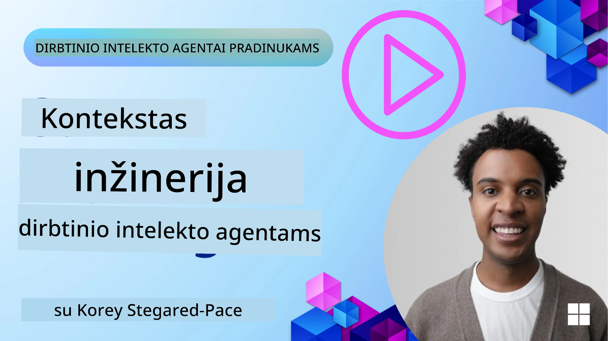
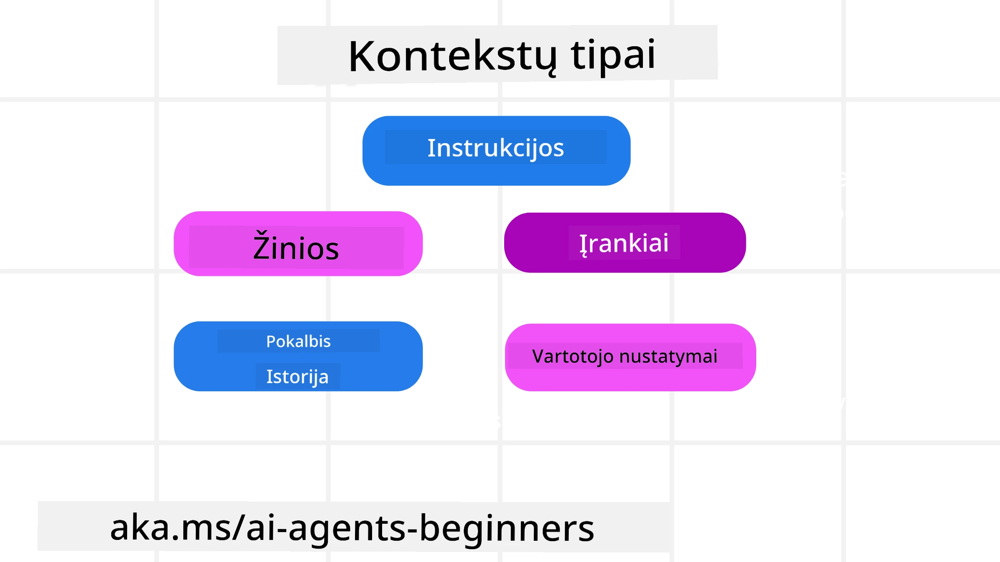
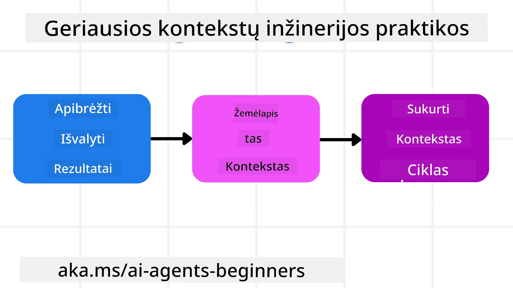

# Konteksto inžinerija dirbtinio intelekto agentams

> _(Spustelėkite aukščiau esantį paveikslėlį, kad peržiūrėtumėte šios pamokos vaizdo įrašą)_

Svarbu suprasti, kokia yra jūsų kuriamos dirbtinio intelekto agento paskirtis, kad sukurtumėte patikimą agentą. Turime kurti dirbtinio intelekto agentus, kurie efektyviai valdo informaciją, kad galėtų spręsti sudėtingus poreikius, neapsiribojant tik užklausų inžinerija.

Šioje pamokoje apžvelgsime, kas yra konteksto inžinerija ir koks yra jos vaidmuo kuriant dirbtinio intelekto agentus.

## Įvadas

Ši pamoka apims:

• **Kas yra konteksto inžinerija** ir kuo ji skiriasi nuo užklausų inžinerijos.

• **Efektyvios konteksto inžinerijos strategijas**, įskaitant kaip rašyti, rinktis, suspausti ir izoliuoti informaciją.

• **Dažniausias konteksto klaidas**, galinčias pakenkti dirbtinio intelekto agentui, ir kaip jas ištaisyti.

## Mokymosi tikslai

Baigę šią pamoką, suprasite kaip:

• **Apibrėžti konteksto inžineriją** ir atskirti ją nuo užklausų inžinerijos.

• **Nustatyti pagrindines konteksto sudedamąsias dalis** didelių kalbos modelių (LLM) taikymuose.

• **Taikyti strategijas rašant, renkant, suspaudžiant ir izoliuojant kontekstą**, siekiant pagerinti agento veikimą.

• **Atpažinti dažniausias konteksto klaidas** kaip apsinuodijimą, blaškymą, painiavą ir konfliktą, įgyvendinant jų mažinimo technikas.

## Kas yra konteksto inžinerija?

Dirbtinio intelekto agentams kontekstas lemia planavimą, kaip agentas imsis tam tikrų veiksmų. Konteksto inžinerija – tai praktika užtikrinti, kad agentas turėtų tinkamą informaciją, kad galėtų atlikti kitą užduoties žingsnį. Kadangi konteksto langas yra riboto dydžio, agentų kūrėjai turi kurti sistemas ir procesus, leidžiančius valdyti informacijos pridėjimą, pašalinimą bei sutraukimą šiame lange.

### Užklausų inžinerija kontra konteksto inžinerija

Užklausų inžinerija orientuota į vienkartinių statinių instrukcijų rinkinį, kuris efektyviai nukreipia agentus pagal taisykles. Konteksto inžinerija valdo dinamišką informacijos rinkinį, įskaitant pradinę užklausą, kad užtikrintų, jog agentas turi reikalingą informaciją laike. Pagrindinė konteksto inžinerijos idėja – padaryti šį procesą pakartojamą ir patikimą.

### Konteksto tipai

Svarbu prisiminti, kad kontekstas nėra vienas dalykas. Informacija, kurios agentui reikia, gali būti iš įvairių šaltinių, ir mums priklauso užtikrinti, kad agentas turėtų prieigą prie šių šaltinių:

Tipai konteksto, kurį dirbtinio intelekto agentas gali turėti valdyti, apima:

• **Instrukcijos:** Tai lyg agento „taisyklių“ rinkinys – užklausos, sistemos žinutės, kelių pavyzdžių demonstravimas (kaip AI daryti tam tikrą veiksmą) ir aprašymai apie įrankius, kuriuos jis gali naudoti. Čia susilieja užklausų ir konteksto inžinerijos dėmesys.

• **Žinios:** Apima faktus, informaciją, gautą iš duomenų bazių, arba ilgalaikę atmintį, kurią agentas sukaupė. Tai gali apimti integravimą su Retrival Augmented Generation (RAG) sistema, jei agentui reikia prieiti prie skirtingų žinių bazių ir duomenų saugyklų.

• **Įrankiai:** Išorinės funkcijos, API ir MCP serverių apibrėžimai, kuriuos agentas gali iškviesti, kartu su grįžtamuoju ryšiu (rezultatais), gautais iš jų naudojimo.

• **Pokyčių istorija:** Vykstanti vartotojo ir agento dialogo eiga. Laikui bėgant pokalbiai tęsiasi ir tampa sudėtingesni, todėl užima vietos konteksto lange.

• **Vartotojo pageidavimai:** Informacija apie vartotojo pomėgius ar nepatinkančius dalykus, sukaupta per laiką. Tai gali būti saugoma ir panaudojama priimant svarbius sprendimus, padedančius vartotojui.

## Strategijos efektyviai konteksto inžinerijai

### Planavimo strategijos

Gerai veikiančiai konteksto inžinerijai reikalingas geras planavimas. Štai požiūris, kuris padės pradėti mąstyti, kaip pritaikyti konteksto inžinerijos koncepciją:

1. **Aiškiai apibrėžkite rezultatus** - užduočių, kurias atlieka dirbtinio intelekto agentai, rezultatai turi būti aiškiai apibrėžti. Atsakykite į klausimą – „Kokios bus pasaulio pokyčiai, kai agentas baigs savo užduotį?“ Kitaip tariant, kokią informaciją, pokytį ar atsakymą vartotojas gaus po sąveikos su agentu.
2. **Nukreipkite kontekstą** - kai apibrėžiate agento rezultatus, atsakykite į klausimą „Kokia informacija agentui reikalinga norint atlikti šią užduotį?“ Tokiu būdu galite pradėti žemėlapiuoti, kur ta informacija yra saugoma.
3. **Sukurkite konteksto srautus** - dabar, kai žinote, kur yra informacija, atsakykite į klausimą „Kaip agentas gaus šią informaciją?“ Tai galima padaryti įvairiais būdais, įskaitant RAG, MCP serverių ir kitų įrankių naudojimą.

### Praktinės strategijos

Planavimas svarbus, bet kai informacija pradeda tekėti į mūsų agento konteksto langą, reikia turėti praktinių strategijų ją valdyti:

#### Konteksto valdymas

Nors dalis informacijos automatiškai pridedama į konteksto langą, konteksto inžinerija – tai aktyvesnis vaidmuo valdyti šią informaciją naudojant keletą strategijų:

 1. **Agentų užrašų bloknotas**
 Leidžia agentui pažymėti svarbią informaciją apie esamas užduotis ir vartotojo sąveikas vienos sesijos metu. Tai turėtų būti saugoma už konteksto lango ribų faile arba vykdymo objekte, kurį agentas gali vėliau pasiekti šios sesijos metu, jei reikia.

 2. **Atmintys**
 Užrašų bloknotai naudingi susidoroti su informacija už vienos sesijos konteksto lango ribų. Atmintys leidžia agentams saugoti ir gauti svarbią informaciją per kelias sesijas. Tai gali apimti santraukas, vartotojo pageidavimus ir atsiliepimus tobulinimui ateityje.

 3. **Konteksto suspaudimas**
  Kai konteksto langas išauga ir artėja prie savo ribos, galima naudoti tokias technikas kaip santrauka ir apkarpymas. Tai gali būti arba išlaikyti tik svarbiausią informaciją, arba pašalinti senesnes žinutes.
  
 4. **Daugiagentės sistemos**
  Kuriant daugiagentę sistemą taikoma konteksto inžinerija, nes kiekvienas agentas turi savo konteksto langą. Kaip šis kontekstas dalijamas ir perduodamas skirtingiems agentams – tai dar vienas aspektas, kurį reikia apgalvoti kūrimo metu.
  
 5. **Smėlio dėžės aplinkos**
  Jei agentui reikia vykdyti tam tikrą kodą arba apdoroti daug informacijos dokumente, tai gali užimti daug ženklų apdorojant rezultatus. Vietoje to, kad visa tai būtų saugoma konteksto lange, agentas gali naudoti smėlio dėžės aplinką, kuri gali vykdyti kodą ir tik skaityti rezultatus bei kitą svarbią informaciją.
  
 6. **Vykdymo būseno objektai**
   Kuriami informacijos konteineriai, leidžiantys valdyti situacijas, kai agentas turi turėti prieigą prie tam tikros informacijos. Sudėtingos užduoties metu tai leidžia agentui saugoti kiekvieno posubtasks rezultatus po vieną žingsnį, neleidžiant kontekstui prisirišti prie visos užduoties.

#### Konteksto tikrinimas

Po vienos iš šių strategijų įgyvendinimo verta patikrinti, ką kitas modelio kvietimas iš tikrųjų gavo. Naudingas derinimo klausimas yra:

> Ar agentas įkėlė per daug konteksto, netinkamą kontekstą ar praleido reikalingą kontekstą?

Norint atsakyti į šį klausimą, nereikia registruoti žalių užklausų, įrankių rezultatų ar atminties turinio. Produkcijoje patartina laikytis mažų konteksto tikrinimo įrašų, kurie fiksuoja kiekius, ID, šifravimus ir politikos etiketes:

- **Pasirinkimas:** Stebėkite, kiek kandidatų blokų, įrankių ar atminties buvo svarstyta, kiek pasirinkta ir kuri taisyklė ar įvertinimas lėmė kitų filtravimą.
- **Suspaudimas:** Registruokite šaltinio intervalą arba sekos ID, santraukos ID, numatomą ženklų skaičių prieš ir po suspaudimo ir ar žali turinys buvo pašalintas iš kito kvietimo.
- **Izoliacija:** Pažymėkite, kuris posubtaskas buvo vykdomas atskirame agente, sesijoje ar smėlio dėžėje, kokia buvo grąžinta apribota santrauka ir ar dideli įrankių rezultatai liko už pagrindinio agento konteksto ribų.
- **Atmintis ir RAG:** Saugo retrieval dokumentų ID, atminties ID, įvertinimus, pasirinktus ID ir redagavimo statusą vietoj pilno gauto teksto.
- **Saugumas ir privatumas:** Rinkitės šifravimus, ID, žetonų rinkinius ir politikos etiketes, o ne jautrų užklausos tekstą, įrankių argumentus, įrankių rezultatus ar vartotojų atminties turinį.

Tikslas nėra laikyti daugiau konteksto. Tikslas – palikti pakankamai įrodymų, kad kūrėjas galėtų nustatyti, kuri konteksto strategija buvo naudota ir ar ji paveikė kitą modelio kvietimą numatytu būdu.

### Konteksto inžinerijos pavyzdys

Tarkime, norime, kad dirbtinio intelekto agentas **„Užuot užsakęs kelionę į Paryžių.“**

• Paprastas agentas, naudojantis tik užklausų inžineriją, galėtų atsakyti: **„Gerai, kada norėtumėte vykti į Paryžių?“** Jis tik apdorotų jūsų tiesioginį klausimą tuo momentu, kai vartotojas uždavė.

• Agentas, naudojantis apžvelgtas konteksto inžinerijos strategijas, darytų daug daugiau. Net neatsakydamas, jo sistema galėtų:

  ◦ **Patikrinti jūsų kalendorių** ieškodama laisvų datų (gaunant realaus laiko duomenis).

 ◦ **Prisiminti ankstesnius kelionių pageidavimus** (iš ilgalaikės atminties), pavyzdžiui, jūsų mėgstamą oro liniją, biudžetą ar ar jums patinka tiesioginiai skrydžiai.

 ◦ **Identifikuoti prieinamus įrankius** skrydžių ir viešbučių užsakymui.

- Tuomet pavyzdinis atsakymas galėtų būti: „Sveikas, [Jūsų vardas]! Mačiau, kad pirmoji spalio savaitė laisva. Ar galiu ieškoti tiesioginių skrydžių į Paryžių su [Mėgstama oro linija], atsižvelgiant į jūsų įprastą biudžetą [Biudžetas]?“. Šis turtingesnis, kontekstą atitinkantis atsakymas demonstruoja konteksto inžinerijos galią.

## Dažnos konteksto klaidos

### Konteksto apsinuodijimas

**Kas tai yra:** Kai į kontekstą patenka netikra informacija (haliucinacija, kurią sugeneravo LLM) arba klaida, kuri vėl ir vėl cituojama, dėl ko agentas siekia neįmanomų tikslų arba kuria nesąmoningas strategijas.

**Ką daryti:** Įgyvendinkite **konteksto validaciją** ir **karantiną**. Patikrinkite informaciją prieš įtraukdami į ilgalaikę atmintį. Jei aptinkamas galimas apsinuodijimas, pradėkite naujus švarius konteksto srautus, kad bloga informacija neišplistų.

**Kelionių užsakymo pavyzdys:** Jūsų agentas haliucinuoja **tiesioginį skrydį iš mažo vietinio oro uosto į tolimą tarptautinį miestą**, kuris iš tiesų neteikia tarptautinių skrydžių. Ši neegzistuojanti skrydžio informacija išsaugoma kontekste. Vėliau, kai prašote agento užsakyti, jis nuolat bando rasti bilietus šioms neįmanomoms maršrutams, sukeldamas pasikartojančias klaidas.

**Sprendimas:** Įveskite žingsnį, kuris **patikrina skrydžio egzistavimą ir maršrutus su realaus laiko API** _prieš_ pridedant skrydžio detales į agento darbo kontekstą. Jei patikra nepavyksta, klaidinga informacija yra „karantinuojama“ ir nebe naudojama.

### Konteksto blaškymasis

**Kas tai yra:** Kai kontekstas tampa toks didelis, kad modelis pernelyg daug dėmesio skiria sukauptai istorijai, o ne mokymosi metu įgytai informacijai, todėl atsiranda pasikartojantys ar nenaudingi veiksmai. Modeliai gali pradėti klysti net prieš konteksto langui užpildytą.

**Ką daryti:** Naudokite **konteksto santrauką**. Periodiškai suspauskite sukauptą informaciją į trumpesnes santraukas, išlaikydami svarbias detales ir šalinant pasikartojančią istoriją. Tai padeda „perkrauti“ dėmesį.

**Kelionių užsakymo pavyzdys:** Jūs ilgai kalbėjotės apie įvairias svajonių kelionių vietas, įskaitant detalią jūsų kuprinės kelionę prieš dvejus metus. Pabaigoje paprašote **„rasti pigius skrydžius kitam mėnesiui“**, bet agentas įstringa senoje, nereikšmingoje informacijoje ir nuolat domisi jūsų kuprinės įranga ar ankstesniais maršrutais, ignoruodamas dabartinį užklausimą.

**Sprendimas:** Po tam tikro pasikeitimų kiekio arba kai kontekstas tampa per didelis, agentas turėtų **suglaudinti naujausias ir aktualiausias pokalbio dalis** – sutelkti dėmesį į dabartines kelionės datas ir tikslą – ir naudoti tą sutrumpintą santrauką kitam LLM kvietimui, atsisakant mažiau svarbių ankstesnių pokalbių.

### Konteksto painiava

**Kas tai yra:** Kai nereikalingas kontekstas, dažnai dėl daugybės prieinamų įrankių, verčia modelį generuoti netinkamus atsakymus arba kviesti netinkamus įrankius. Mažesni modeliai ypač linkę į tai.

**Ką daryti:** Naudokite **įrankių apkrovos valdymą** taikant RAG technikas. Aprašykite įrankius vektorinėje duomenų bazėje ir pasirinkite _tik_ aktualiausius įrankius kiekvienai konkrečiai užduočiai. Tyrimai rodo, kad geriausia pasirinkti mažiau nei 30 įrankių.

**Kelionių užsakymo pavyzdys:** Jūsų agentas turi prieigą prie dešimčių įrankių: `book_flight`, `book_hotel`, `rent_car`, `find_tours`, `currency_converter`, `weather_forecast`, `restaurant_reservations` ir t.t. Jūs klausiate: **„Koks geriausias būdas keliavimui Paryžiuje?“** Dėl didelio įrankių kiekio agentas supainioja ir bando naudoti `book_flight` _Paryžiaus viduje_ arba `rent_car`, nors jūs pageidaujate viešojo transporto, nes įrankių aprašymai gali persidengti arba agentas nesugeba išsirinkti geriausio.

**Sprendimas:** Naudokite **RAG įrankių aprašymams**. Kai klausiama apie keliavimą Paryžiuje, sistema dinamiškai parenka _tik_ aktualiausius įrankius, tokius kaip `rent_car` arba `public_transport_info`, remiantis jūsų klausimu, pateikdama modeliui sutelktą įrankių rinkinį.

### Konteksto konfliktas

**Kas tai yra:** Kai kontekste yra prieštaringa informacija, dėl kurios kyla nelogiškas mąstymas arba blogi galutiniai atsakymai. Dažnai tai nutinka, kai informacija ateina etapais, ir ankstyvos, neteisingos prielaidos lieka kontekste.

**Ką daryti:** Naudokite **konteksto genėjimą** ir **atstūmimą**. Genėjimas reiškia pasenusių ar prieštaringų duomenų pašalinimą, kai atsiranda naujos detalės. Atstūmimas suteikia modeliui atskirą „užrašų bloknotą“, kad apdorotų informaciją neužteršiant pagrindinio konteksto.

**Kelionių užsakymo pavyzdys:** Iš pradžių pasakote savo agentui, **„Noriu skristi ekonomine klase.“** Vėliau pokalbio metu pakeičiate nuomonę ir sakote, **„Iš tiesų šiai kelionei rinkimės verslo klasę.“** Jei abi instrukcijos lieka kontekste, agentas gali gauti prieštaringus paieškos rezultatus arba supainioti, kurią nuostatą prioritetizuoti.

**Sprendimas:** Įgyvendinkite **konteksto apkarpymą**. Kai nauja instrukcija prieštarauja senajai, senoji instrukcija pašalinama arba aiškiai pakeičiama kontekste. Alternatyviai, agentas gali naudoti **užrašų lapelį** (scratchpad), kad suvienodintų prieštaringas nuostatas prieš priimant sprendimą, užtikrindamas, kad tik galutinė, nuosekli instrukcija nurodytų jo veiksmus.

## Turite daugiau klausimų apie konteksto inžineriją?

Prisijunkite prie [Microsoft Foundry Discord](https://discord.com/invite/ATgtXmAS5D), kad susitiktumėte su kitais mokinčiais, dalyvautumėte konsultacijose ir gautumėte atsakymus į savo AI agentų klausimus.

---

<!-- CO-OP TRANSLATOR DISCLAIMER START -->
**Atsakomybės apribojimas**:
Šis dokumentas buvo išverstas naudojant dirbtinio intelekto vertimo paslaugą [Co-op Translator](https://github.com/Azure/co-op-translator). Nors siekiame tikslumo, prašome atkreipti dėmesį, kad automatiniai vertimai gali turėti klaidų ar netikslumų. Originalus dokumentas jo gimtąja kalba laikomas autoritetingu šaltiniu. Svarbiai informacijai rekomenduojama naudoti profesionalų žmogiškąjį vertimą. Mes neatsakome už jokius nesusipratimus ar neteisingą interpretaciją, kilusią naudojantis šiuo vertimu.
<!-- CO-OP TRANSLATOR DISCLAIMER END -->