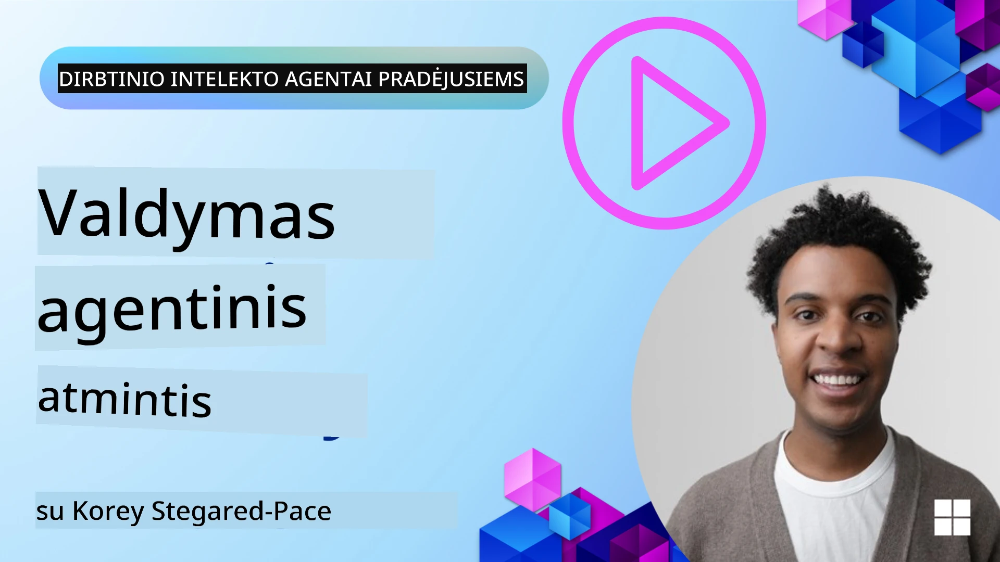

# Atmintis dirbtinio intelekto agentams 

Kalbant apie unikalią DI agentų kūrimo naudą, dažniausiai aptariami du dalykai: gebėjimas kviesti įrankius užduotims atlikti ir gebėjimas tobulėti laikui bėgant. Atmintis yra pamatinis elementas kuriant savarankiškai tobulėjančius agentus, kurie gali kurti geresnę patirtį mūsų vartotojams.

Šioje pamokoje apžvelgsime, kas yra atmintis DI agentams ir kaip ją galime valdyti bei naudoti mūsų programų naudai.

## Įvadas

Ši pamoka apims:

• **Dirbtinio intelekto agentų atminties supratimas**: Kas yra atmintis ir kodėl ji yra būtina agentams.

• **Atminties įdiegimas ir saugojimas**: Praktiniai metodai pridedant atminties galimybes jūsų DI agentams, daugiausia dėmesio skiriant trumpalaikei ir ilgalaikei atminčiai.

• **Kaip agentai gali savarankiškai tobulėti**: Kaip atmintis leidžia agentams mokytis iš ankstesnių sąveikų ir tobulėti laikui bėgant.

## Galimi įgyvendinimai

Ši pamoka apima dvi išsamių Jupyter užrašų knygelių pamokas:

• **[13-agent-memory.ipynb](./13-agent-memory.ipynb)**: Įgyvendina atmintį naudojant Mem0 ir Azure AI Search su Microsoft Agent Framework

• **[13-agent-memory-cognee.ipynb](./13-agent-memory-cognee.ipynb)**: Įgyvendina struktūruotą atmintį naudojant Cognee, automatiškai kuriant žinių grafą paremtą įterpiniais (embeddings), vizualizuojant grafą ir užtikrinant išmanų atgavimą

## Mokymosi tikslai

Baigę šią pamoką, jūs mokėsite:

• **Atskirti įvairius dirbtinio intelekto agentų atminties tipus**, įskaitant darbinę, trumpalaikę ir ilgalaikę atmintį, taip pat specializuotas formas, tokias kaip persona ir epizodinė atmintis.

• **Įdiegti ir valdyti trumpalaikę ir ilgalaikę atmintį DI agentams** naudojant Microsoft Agent Framework, pasinaudojant įrankiais kaip Mem0, Cognee, Whiteboard memory ir integruojant su Azure AI Search.

• **Suprasti principus, lemiančius savarankiškai tobulėjančius DI agentus** ir kaip tvirti atminties valdymo sprendimai prisideda prie nuolatinio mokymosi ir prisitaikymo.

## Dirbtinio intelekto agentų atminties supratimas

Pagrinde, **atmintis DI agentams reiškia mechanizmus, kurie leidžia jiems saugoti ir prisiminti informaciją**. Ši informacija gali būti specifinės detalės apie pokalbį, vartotojo nuostatos, ankstesni veiksmai arba net įgyti modeliai.

Be atminties DI programos dažnai yra bevalstės (stateless), tai reiškia, kad kiekviena sąveika prasideda nuo nulio. Tai sukelia pasikartojančią ir erziančią vartotojo patirtį, kai agentas „pamiršta“ ankstesnį kontekstą ar nuostatas.

### Kodėl atmintis yra svarbi?

Agentų intelektas glaudžiai susijęs su gebėjimu atsiminti ir panaudoti ankstesnę informaciją. Atmintis leidžia agentams būti:

• **Reflektuojantys**: Mokymasis iš ankstesnių veiksmų ir rezultatų.

• **Interaktyvūs**: Išlaikyti kontekstą tęsiant pokalbį.

• **Proaktyvūs ir reaguojantys**: Numatyti poreikius arba tinkamai reaguoti remiantis istoriniais duomenimis.

• **Autonominiai**: Veikti labiau savarankiškai pasinaudojant saugoma informacija.

Įdiegimo tikslas — padaryti agentus labiau **patikimus ir pajėgius**.

### Atminties tipai

#### Darbinė atmintis

Galvokite apie tai kaip užrašų lapelį, kurį agentas naudoja vienos, einamos užduoties ar mąstymo proceso metu. Ji laiko būtiną informaciją, reikalingą kitam žingsniui apskaičiuoti.

DI agentams darbinė atmintis dažnai fiksuoja pačią aktualiausią informaciją iš pokalbio, net jei visas pokalbių istorija yra ilga ar sutrumpinta. Ji orientuojasi į pagrindinių elementų — reikalavimų, pasiūlymų, sprendimų ir veiksmų — išgavimą.

**Darbinės atminties pavyzdys**

Kelionių užsakymo agentui darbinė atmintis gali užfiksuoti vartotojo dabartinį pageidavimą, pavyzdžiui „Noriu užsisakyti kelionę į Paryžių“. Šis konkretus reikalavimas yra saugomas agente esančiame artimiausiame kontekste, kad nukreiptų dabartinę sąveiką.

#### Trumpalaikė atmintis

Šio tipo atmintis išlaiko informaciją vieno pokalbio arba sesijos metu. Tai yra einamojo pokalbio kontekstas, leidžiantis agentui grįžti prie ankstesnių dialogo eilučių.

**Trumpalaikės atminties pavyzdys**

Jei vartotojas paklausia „Kiek kainuotų skrydis į Paryžių?“ ir vėliau priduria „O kaip dėl apgyvendinimo ten?“, trumpalaikė atmintis užtikrina, kad agentas suprastų, jog „ten“ reiškia „Paryžių“ toje pačioje pokalbio sekoje.

#### Ilgalaikė atmintis

Tai informacija, kuri išlieka per kelis pokalbius ar sesijas. Ji leidžia agentams atsiminti vartotojo nuostatas, istorines sąveikas ar bendras žinias ilgą laiką. Tai svarbu personalizacijai.

**Ilgalaikės atminties pavyzdys**

Ilgalaikė atmintis gali saugoti, kad „Ben mėgsta slidinėti ir lauko veiklas, mėgsta kavą su kalnų vaizdu ir nori vengti sudėtingų slidinėjimo trasų dėl ankstesnės traumos“. Ši informacija, išmokta iš ankstesnių sąveikų, įtakoja ateities kelionių planavimo rekomendacijas, jas padarydama labai suasmenintomis.

#### Personos atmintis

Šis specializuotas atminties tipas padeda agentui išvystyti nuoseklią „asmenybę“ ar „personą“. Ji leidžia agentui prisiminti detales apie save ar numatomą vaidmenį, todėl sąveikos tampa sklandesnės ir labiau orientuotos.

**Personos atminties pavyzdys**
Jei kelionių agentas yra sukurtas kaip „ekspertas slidinėjimo planavime“, personos atmintis gali sustiprinti šį vaidmenį, įtakojant atsakymus, kad jie atitiktų eksperto toną ir žinias.

#### Darbo eigos / Epizodinė atmintis

Ši atmintis saugo žingsnių seką, kurią agentas atlieka kompleksiškos užduoties metu, įskaitant sėkmes ir nesėkmes. Tai tarsi prisiminti specifinius „epizodus“ arba patirtis, iš kurių galima mokytis.

**Epizodinės atminties pavyzdys**

Jei agentas bandė užsakyti konkretų skrydį, bet tai nepavyko dėl neprieinamumo, epizodinė atmintis gali įrašyti šią nesėkmę, leisdama agentui vėliau bandyti alternatyvius skrydžius arba labiau informuotai pranešti vartotojui apie problemą.

#### Entitetų atmintis

Tai apima konkrečių entitetų (pvz., žmonių, vietų ar daiktų) ir įvykių išgavimą ir įsiminimą iš pokalbių. Ji leidžia agentui sukurti struktūruotą supratimą apie aptartus pagrindinius elementus.

**Entitetų atminties pavyzdys**

Iš pokalbio apie praeitą kelionę agentas gali išgauti „Paryžių“, „Eifelio bokštą“ ir „vakarienę Le Chat Noir restorane“ kaip entitetus. Ateityje agentas galėtų prisiminti „Le Chat Noir“ ir pasiūlyti padaryti naują rezervaciją ten.

#### Struktūruotas RAG (Retrieval Augmented Generation)

Nors RAG yra platesnė technika, „Struktūruotas RAG“ išskiriamas kaip galinga atminties technologija. Jis ištraukia tankią, struktūruotą informaciją iš įvairių šaltinių (pokalbiai, el. laiškai, vaizdai) ir naudoja ją atsakymų tikslumui, atsimenamumui ir greičiui pagerinti. Skirtingai nei klasikinis RAG, kuris remiasi vien semantiniu panašumu, Struktūruotas RAG dirba su informacijos savąja struktūra.

**Struktūruoto RAG pavyzdys**

Vietoje paprasto raktinių žodžių atitikimo, Struktūruotas RAG galėtų išanalizuoti skrydžio detales (tikslas, data, laikas, oro linijos) iš el. laiško ir saugoti jas struktūruotu formatu. Tai leidžia atlikti tikslius užklausimus, pavyzdžiui „Kokį skrydį užsakiau į Paryžių antradienį?“

## Atminties įdiegimas ir saugojimas

Atminties diegimas DI agentams apima sisteminį procesą — **atminties valdymą**, kuris apima generavimą, saugojimą, gavimą, integravimą, atnaujinimą ir net „pamiršimą“ (arba ištrynimą) informacijos. Gatavimo (retrieval) aspektas yra ypač svarbus.

### Specializuoti atminties įrankiai

#### Mem0

Vienas būdų saugoti ir valdyti agentų atmintį yra naudoti specializuotus įrankius kaip Mem0. Mem0 veikia kaip nuolatinis atminties sluoksnis, leidžiantis agentams prisiminti susijusias sąveikas, saugoti vartotojo nuostatas ir faktinį kontekstą bei mokytis iš sėkmių ir nesėkmių laikui bėgant. Idėja yra tokia, kad bevalstis agentas pavirsta būsenos turinčiu agentu.

Jis veikia per **dviafę atminties vamzdyną: išgavimas ir atnaujinimas**. Pirma, pranešimai, pridėti prie agente vykstančio gijos, siunčiami į Mem0 paslaugą, kuri naudoja didelį kalbos modelį (LLM) apibendrinti pokalbio istoriją ir išgauti naujas atmintis. Vėliau LLM varoma atnaujinimo fazė nusprendžia, ar pridėti, modifikuoti ar ištrinti šias atmintis, saugodama jas mišriame duomenų saugykloje, kuri gali apimti vektorinę, grafinę ir raktinio-reikšmės duomenų bazes. Ši sistema taip pat palaiko įvairius atminties tipus ir gali įtraukti grafinę atmintį valdyti santykius tarp entitetų.

#### Cognee

Kitas galingas požiūris yra naudoti **Cognee**, atviro kodo semantinę atmintį DI agentams, kuri transformuoja struktūrizuotus ir nestruktūrizuotus duomenis į užklausomus žinių grafus, paremtais įterpiniais. Cognee teikia **dvigubos saugyklos architektūrą**, apjungiančią vektorinį panašumo paiešką su grafiniais santykiais, leidžiančią agentams suprasti ne tik, kokia informacija yra panaši, bet ir kaip sąvokos yra susijusios.

Jis puikiai tinka **mišriam gavimui**, kuris jungia vektorinius panašumus, grafo struktūrą ir LLM samprotavimus — nuo žaliavos fragmentų paieškos iki grafo suprantančių klausimų-atsakymų. Sistema palaiko **gyvą atmintį**, kuri evoliucionuoja ir auga, tuo pačiu išlikdama užklausoma kaip vienas susietas grafas, palaikantis tiek trumpalaikį sesijos kontekstą, tiek ilgalaikę nuolatinę atmintį.

Cognee užrašų knygelės pamoka ([13-agent-memory-cognee.ipynb](./13-agent-memory-cognee.ipynb)) demonstruoja, kaip sukurti šį vieningą atminties sluoksnį, su praktiniais pavyzdžiais, kaip įvesti įvairius duomenų šaltinius, vizualizuoti žinių grafą ir vykdyti užklausas su skirtingomis paieškos strategijomis, pritaikytomis konkretiems agentų poreikiams.

### Atminties saugojimas su RAG

Be specializuotų atminties įrankių kaip Mem0, galite pasinaudoti pažangiomis paieškos paslaugomis, tokiomis kaip **Azure AI Search**, kaip pakalbė backend saugoti ir atgauti atmintis, ypač struktūruotam RAG.

Tai leidžia pagrįsti agento atsakymus jūsų duomenimis, užtikrinant tikslesnius ir aktualesnius atsakymus. Azure AI Search galima naudoti saugoti vartotojui specifines kelionių atmintis, produktų katalogus ar bet kokias kitas domeno žinias.

Azure AI Search palaiko galimybes kaip **Struktūruotas RAG**, kuris puikiai išsiskiria išgaunant ir atgaunant tankią, struktūruotą informaciją iš didelių duomenų rinkinių, tokių kaip pokalbių istorijos, el. laiškai ar net vaizdai. Tai suteikia „viršžmogišką tikslumą ir atkūrimą“ palyginti su tradiciniais teksto fragmentavimo ir įterpimų metodais.

## Kaip DI agentai gali savarankiškai tobulėti

Bendras modelis savarankiškai tobulėjantiems agentams apima atskiro “žinių agente” (angl. "knowledge agent") įvedimą. Šis atskiras agentas stebi pagrindinį pokalbį tarp vartotojo ir pirminio agento. Jo vaidmuo yra:

1. **Identifikuoti vertingą informaciją**: Nustatyti, ar bet kuri pokalbio dalis verta saugoti kaip bendros žinios ar specifinė vartotojo nuostata.

2. **Išgauti ir apibendrinti**: Išskirti esminį mokymąsi arba nuostatą iš pokalbio.

3. **Saugoti žinių bazėje**: Išsaugoti šią išgautą informaciją, dažnai vektorinėje duomenų bazėje, kad ją būtų galima vėliau atgauti.

4. **Praturtinti būsimus užklausimus**: Kai vartotojas pradeda naują užklausą, žinių agentas atgauna susijusią saugotą informaciją ir prideda ją prie vartotojo užklausos, suteikdamas pirminiam agentui svarbų kontekstą (panašiai kaip RAG).

### Atminties optimizavimas

• **Vėlinimo valdymas (latencija)**: Norint išvengti vartotojo sąveikų sulėtėjimo, galima iš pradžių naudoti pigesnį, greitesnį modelį greitai patikrinti, ar informacija verta saugoti ar atgauti, ir tik esant reikale įtraukti sudėtingesnį išgavimą/atgavimą.

• **Žinių bazės priežiūra**: Auginant žinių bazę, mažiau dažnai naudojama informacija gali būti perkelta į „cold storage“, kad būtų valdomos sąnaudos.

## Turite daugiau klausimų apie agentų atmintį?

Prisijunkite prie [Microsoft Foundry Discord](https://aka.ms/ai-agents/discord) kad susitiktumėte su kitais besimokančiais, dalyvautumėte konsultacijose ir gautumėte atsakymus į savo klausimus apie DI agentus.

---

<!-- CO-OP TRANSLATOR DISCLAIMER START -->
Atsakomybės apribojimas:
Šis dokumentas buvo išverstas naudojant dirbtinio intelekto vertimo paslaugą Co-op Translator (https://github.com/Azure/co-op-translator). Nors siekiame tikslumo, atkreipkite dėmesį, kad automatizuoti vertimai gali turėti klaidų arba netikslumų. Pirminis dokumentas originalia kalba turėtų būti laikomas autoritetingu šaltiniu. Esant kritinei informacijai, rekomenduojamas profesionalus žmogaus atliktas vertimas. Mes neatsakome už jokius nesusipratimus ar neteisingas interpretacijas, kylančias dėl šio vertimo naudojimo.
<!-- CO-OP TRANSLATOR DISCLAIMER END -->