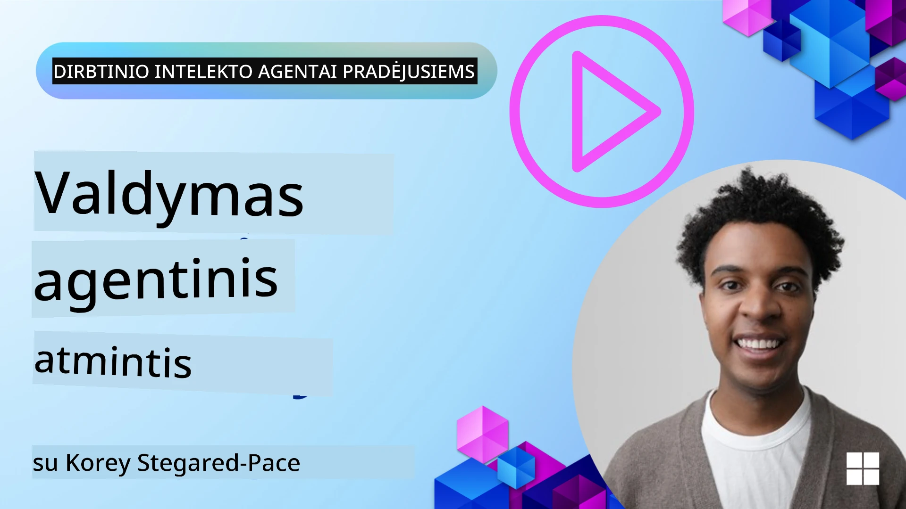

# Atmintis dirbtinio intelekto agentams 

Kalbant apie unikalius dirbtinio intelekto agentų kūrimo privalumus, dažniausiai kalbama apie du dalykus: gebėjimą iškviesti įrankius užduotims atlikti ir gebėjimą tobulėti laikui bėgant. Atmintis yra pagrindas kuriant savarankiškai tobulėjančius agentus, kurie gali kurti geresnę patirtį mūsų vartotojams.

Šiame pamokų metu apžvelgsime, kas yra atmintis dirbtinio intelekto agentams, kaip ją galime valdyti ir naudoti mūsų programų naudai.

## Įvadas

Ši pamoka apims:

• **Dirbtinio intelekto agentų atminties supratimą**: Kas yra atmintis ir kodėl ji yra svarbi agentams.

• **Atminties įgyvendinimą ir saugojimą**: Praktinius metodus, kaip pridėti atminties galimybes jūsų DI agentams, akcentuojant trumpalaikę ir ilgalaikę atmintį.

• **Savęs tobulinančių DI agentų kūrimą**: Kaip atmintis leidžia agentams mokytis iš praeities sąveikų ir tobulėti laikui bėgant.

## Pasiekiami įgyvendinimai

Ši pamoka apima du išsamius užrašų knygelių vadovus:

• **[13-agent-memory.ipynb](./13-agent-memory.ipynb)**: Naudoja Mem0 ir Azure AI Search įgyvendinant atmintį su Microsoft Agent Framework

• **[13-agent-memory-cognee.ipynb](./13-agent-memory-cognee.ipynb)**: Naudoja struktūruotą atmintį per Cognee, automatiškai kuriant žinių grafą, paremta įterpiniais, vizualizuojant grafą ir vykdant išmanų informacijų gavimą

## Mokymosi tikslai

Baigę šią pamoką, žinosite, kaip:

• **Atskiri įvairius DI agento atminties tipus**, įskaitant darbinę, trumpalaikę ir ilgalaikę atmintį, taip pat specializuotas formas, tokias kaip asmenybės ir epizodinė atmintis.

• **Įgyvendinti ir valdyti trumpalaikę bei ilgalaikę atmintį DI agentams** naudojant Microsoft Agent Framework, pasitelkiant įrankius kaip Mem0, Cognee, Whiteboard atmintį ir integraciją su Azure AI Search.

• **Suprasti savęs tobulinančių DI agentų principus** ir kaip patikimos atminties valdymo sistemos prisideda prie nuolatinio mokymosi ir adaptacijos.

## AI agentų atminties supratimas

Iš esmės **atmintis DI agentams reiškia mechanizmus, leidžiančius jiems išlaikyti ir prisiminti informaciją**. Ši informacija gali būti konkrečios detalės apie pokalbį, vartotojo pageidavimus, praeitus veiksmus ar net išmoktus modelius.

Be atminties DI programos dažnai būna bevalstės, tai reiškia, kad kiekviena sąveika prasideda nuo nulio. Tai sukelia pasikartojančią ir varginančią vartotojo patirtį, kai agentas „pamiršta“ ankstesnį kontekstą arba pageidavimus.

### Kodėl atmintis svarbi?

Agentų intelektas glaudžiai susijęs su jų gebėjimu prisiminti ir naudoti praeitą informaciją. Atmintis leidžia agentams būti:

• **Refleksyviais**: Mokytis iš ankstesnių veiksmų ir rezultatų.

• **Interaktyviais**: Išlaikyti kontekstą vykstant pokalbiui.

• **Proaktyviais ir reaguojančiais**: Numatyti poreikius arba tinkamai reaguoti remiantis istoriniais duomenimis.

• **Autonomiškais**: Veikti labiau savarankiškai remiantis saugoma informacija.

Įgyvendinimo tikslas – padaryti agentus labiau **patikimus ir pajėgius**.

### Atminties tipai

#### Darbinė atmintis

Tai tarsi užrašų lapelis, kurį agentas naudoja vienos, einančios užduoties ar minties proceso metu. Laikoma tiesioginė informacija, reikalinga kitam žingsniui apskaičiuoti.

DI agentams darbinė atmintis dažnai sugaudo svarbiausią informaciją iš pokalbio, net jei visas pokalbio istorija yra ilga arba sutrumpinta. Ji orientuojasi į pagrindinių elementų, tokių kaip reikalavimai, pasiūlymai, sprendimai ir veiksmai, išskyrimą.

**Darbinės atminties pavyzdys**

Kelionių užsakymo agentui darbinėje atmintyje gali būti užfiksuotas vartotojo dabartinis prašymas, pavyzdžiui, „Noriu užsakyti kelionę į Paryžių“. Šis konkretus reikalavimas laikomas agento tiesioginiame kontekste, kuris nukreipia dabartinę sąveiką.

#### Trumpalaikė atmintis

Šis atminties tipas saugo informaciją pokalbio ar sesijos trukmę. Tai dabartinio pokalbio kontekstas, leidžiantis agentui prisiminti ankstesnius dialogo etapus.

[Microsoft Agent Framework](https://github.com/microsoft/agent-framework) Python SDK pavyzdžiuose tai atitinka `AgentSession`, sukurtą su `agent.create_session()`. Sesija yra sistemos įmontuota trumpalaikė atmintis: ji palaiko pokalbio kontekstą tol, kol ta pati sesija naudojama, bet šis kontekstas neišsaugomas, kai sesija baigiasi arba programa perkraunama. Norint išsaugoti faktus ir pageidavimus, kurie turi būti išliekami tarp sesijų, reikia naudoti ilgalaikę atmintį, dažniausiai per duomenų bazę, vektorinį indeksą ar kitą nuolatinę saugyklą.

**Trumpalaikės atminties pavyzdys**

Jei vartotojas klausia: „Kiek kainuotų skrydis į Paryžių?“, o po to paprašo: „O kaip dėl apgyvendinimo ten?“, trumpalaikė atmintis užtikrina, kad agentas žinotų, jog „ten“ pokalbyje reiškia „Paryžių“.

#### Ilgalaikė atmintis

Tai informacija, kuri išlieka per kelis pokalbius ar sesijas. Ji leidžia agentams prisiminti vartotojo pageidavimus, istorines sąveikas ar bendras žinias ilgesnį laiką. Tai svarbu personalizavimui.

**Ilgalaikės atminties pavyzdys**

Ilgalaikė atmintis gali saugoti, kad „Benas mėgsta slidinėti ir lauko veiklas, mėgsta kavą su kalnų vaizdu ir nori vengti pažengusių slidinėjimo trasų dėl ankstesnės traumos“. Ši informacija, išmokta iš ankstesnių sąveikų, įtakoja rekomendacijas būsimose kelionių planavimo sesijose, padarydama jas labai personalizuotas.

#### Asmenybės atmintis

Šis specializuotas atminties tipas padeda agentui sukurti nuoseklią „asmenybę“ arba „personą“. Leidžia agentui prisiminti detales apie save ar savo paskirtį, todėl sąveikos tampa sklandesnės ir tikslingesnės.

**Asmenybės atminties pavyzdys**
Jei kelionių agentas sukurtas būti „ekspertu slidinėjimo planavime“, asmenybės atmintis gali sustiprinti šią rolę, paveikdama atsakymus ir suderinant juos su eksperto tonu bei žiniomis.

#### Darbo eiga / epizodinė atmintis

Ši atmintis saugo žingsnių seką, kurią agentas vykdo sudėtingos užduoties metu, įskaitant sėkmes ir nesėkmes. Tai kaip prisiminti konkrečius „epizodus“ ar ankstesnes patirtis, kad iš jų būtų galima mokytis.

**Epizodinės atminties pavyzdys**

Jei agentas bandė užsakyti tam tikrą skrydį, bet tai nepavyko dėl prieinamumo trūkumo, epizodinė atmintis galėtų įrašyti šią nesėkmę, leidžiant agentui siūlyti alternatyvius skrydžius ar geriau informuoti vartotoją apie problemą vėlesniu bandymu.

#### Entitetų atmintis

Tai apima konkrečių subjektų (pvz., žmonių, vietų, daiktų) ir įvykių išgavimą ir įsiminimą iš pokalbių. Leidžia agentui kurti struktūruotą supratimą apie aptartus svarbius elementus.

**Entitetų atminties pavyzdys**

Iš pokalbio apie praeitą kelionę agentas gali išgauti „Paryžių“, „Eifelio bokštą“ ir „vakarienę restorane Le Chat Noir“ kaip entitetus. Ateityje agentas galėtų prisiminti „Le Chat Noir“ ir pasiūlyti rezervaciją ten.

#### Struktūruota RAG (Retrieval Augmented Generation)

Nors RAG yra platesnė technika, „Struktūruota RAG“ išskiriama kaip galinga atminties technologija. Ji ištraukia tankią, struktūruotą informaciją iš įvairių šaltinių (pokalbių, el. laiškų, vaizdų) ir naudoja ją didindama atsakymų tikslumą, ištraukimą ir greitį. Skirtingai nuo klasikinio RAG, kuris remiasi tik semantiniu panašumu, Struktūruota RAG veikia su informacijos natūraliu struktūrizavimu.

**Struktūruotos RAG pavyzdys**

Vietoj vien tik raktinių žodžių atitikimo, Struktūruota RAG galėtų nuskaito skrydžio duomenis (tikslas, data, laikas, oro linijos) iš el. laiško ir struktūrizuotai juos saugo. Tai leidžia atlikti tikslius užklausimus, pvz., „Kokį skrydį į Paryžių aš užsakiau antradienį?“

## Atminties įgyvendinimas ir saugojimas

Atminties įgyvendinimas DI agentams apima sisteminį **atminties valdymo** procesą, kuris apima informacijos generavimą, saugojimą, gavimą, integravimą, atnaujinimą ir netgi „pamiršimą“ (arba ištrynimą). Informacijos gavimas yra ypač svarbi dalis.

### Specializuoti atminties įrankiai

#### Mem0

Vienas iš būdų saugoti ir valdyti agento atmintį yra naudoti specializuotus įrankius, tokius kaip Mem0. Mem0 veikia kaip nuolatinio atminties sluoksnis, leidžiantis agentams prisiminti svarbias sąveikas, saugoti vartotojo pageidavimus ir faktinį kontekstą bei mokytis iš sėkmių ir nesėkmių laikui bėgant. Idėja – bevalstžius agentus paversti būsenos turinčiais.

Veikia per **dviphazių atminties etapų grandinę: išgavimą ir atnaujinimą**. Pirmiausia į agento siužetą pridėti pranešimai siunčiami į Mem0 tarnybą, kuri naudoja didelį kalbos modelį (LLM) pokalbio istorijai apibendrinti ir naujai atminčiai išgauti. Vėliau LLM valdomas atnaujinimo etapas nusprendžia, ar pridėti, modifikuoti ar ištrinti šias atminčias, saugodamas jas mišrioje duomenų bazėje, kuri gali apimti vektorinę, grafinę ir raktų-reikšmių bazes. Ši sistema taip pat palaiko įvairius atminties tipus ir gali įtraukti grafinę atmintį santykiams tarp subjektų valdyti.

#### Cognee

Kitas galingas būdas yra naudoti **Cognee**, atviro kodo semantinę atmintį DI agentams, kuri transformuoja struktūrizuotus ir nestruktūrizuotus duomenis į užklausoms prieinamus žinių grafus, paremtais įterpiniais. Cognee naudoja **dvigubos saugyklos architektūrą**, derinančią vektorinį panašumo paiešką su grafų santykiais, leidžiantiems agentams suprasti ne tik informaciją panašumais, bet ir kaip sąvokos susijusios.

Jis išsiskiria **mišriu gavimu**, jungiančiu vektorinį panašumą, grafinę struktūrą ir LLM samprotavimus – nuo žalių duomenų paieškos iki grafui jautraus klausimų atsakymo. Sistema palaiko **gyvą atmintį**, kuri vystosi ir auga, tuo pačiu išlieka užklausoms prieinama kaip viena susijusi grafų sistema, palaikanti tiek trumpalaikį sesijos kontekstą, tiek ilgalaikę nuolatinę atmintį.

Cognee užrašų knygelės vadovas ([13-agent-memory-cognee.ipynb](./13-agent-memory-cognee.ipynb)) demonstruoja, kaip kurti šį vieningą atminties sluoksnį, su praktiniais pavyzdžiais, kaip įtraukti įvairius duomenų šaltinius, vizualizuoti žinių grafą ir vykdyti užklausas su skirtingomis paieškos strategijomis, pritaikytomis konkretiems agentų poreikiams.

### Atminties saugojimas naudojant RAG

Be specializuotų įrankių kaip Mem0, galite pasinaudoti patikimomis paieškos paslaugomis, kaip **Azure AI Search**, kaip pagrindu saugoti ir gauti atmintis, ypač struktūruotai RAG.

Tai leidžia susieti agento atsakymus su jūsų duomenimis, užtikrinant aktualesnius ir tikslesnius atsakymus. Azure AI Search gali būti naudojama saugoti vartotojo specifines kelionių atmintis, produktų katalogus ar bet kokias kitas sričių specifines žinias.

Azure AI Search palaiko galimybes kaip **Struktūruota RAG**, kuri puikiai ištraukia ir gautų tankią, struktūruotą informaciją iš didelių duomenų rinkinių, kaip pokalbių istorijos, el. laiškai ar net vaizdai. Tai suteikia „žmogišką tikslumą ir ištraukimą“ palyginti su tradiciniais teksto strypų ir įterpinių metodais.

## Savęs tobulinančių DI agentų kūrimas

Dažnas savęs tobulinančių agentų modelis apima **„žinių agento“** įvedimą. Šis atskiras agentas stebi pagrindinį pokalbį tarp vartotojo ir pagrindinio agente. Jo vaidmuo yra:

1. **Nustatyti vertingą informaciją**: Nuspręsti, ar kuria nors pokalbio dalimi verta išsaugoti kaip bendrą žinią ar konkrečią vartotojo nuostatą.

2. **Išgauti ir apibendrinti**: Išgauti esminį mokymąsi ar nuostatą iš pokalbio.

3. **Saugoti žinių bazėje**: Išsaugoti šią informaciją, dažnai vektorinėje duomenų bazėje, kad ją būtų galima vėliau gauti.

4. **Praturtinti būsimus užklausimus**: Kai vartotojas inicijuoja naują užklausą, žinių agentas gauna susijusią saugomą informaciją ir prideda ją prie vartotojo užklausos, suteikdamas pagrindiniam agentui svarbų kontekstą (panašiai kaip RAG).

### Atminties optimizavimas

• **Latentės valdymas**: Norint išvengti sąveikų sulėtėjimo, iš pradžių galima naudoti pigesnį, greitesnį modelį, kuris greitai patikrina, ar verta saugoti ar gauti informaciją, o sudėtingesnis išgavimo/gavimo procesas paleidžiamas tik prireikus.

• **Žinių bazės priežiūra**: Didėjant žinių bazei, rečiau naudojama informacija gali būti perkelta į „šaltą saugyklą“, kad būtų valdomos sąnaudos.

## Norite sužinoti daugiau apie agentų atmintį?

Prisijunkite prie [Microsoft Foundry Discord](https://discord.com/invite/ATgtXmAS5D), kad susitikti su kitais besimokančiais, dalyvauti palaikymo valandose ir gauti atsakymus į savo DI agentų klausimus.

---

<!-- CO-OP TRANSLATOR DISCLAIMER START -->
**Atsakomybės apribojimas**:
Šis dokumentas buvo išverstas naudojant dirbtinio intelekto vertimo paslaugą [Co-op Translator](https://github.com/Azure/co-op-translator). Nors siekiame tikslumo, prašome atkreipti dėmesį, kad automatiniai vertimai gali turėti klaidų ar netikslumų. Originalus dokumentas jo gimtąja kalba laikomas autoritetingu šaltiniu. Svarbiai informacijai rekomenduojama naudoti profesionalų žmogiškąjį vertimą. Mes neatsakome už jokius nesusipratimus ar neteisingą interpretaciją, kilusią naudojantis šiuo vertimu.
<!-- CO-OP TRANSLATOR DISCLAIMER END -->