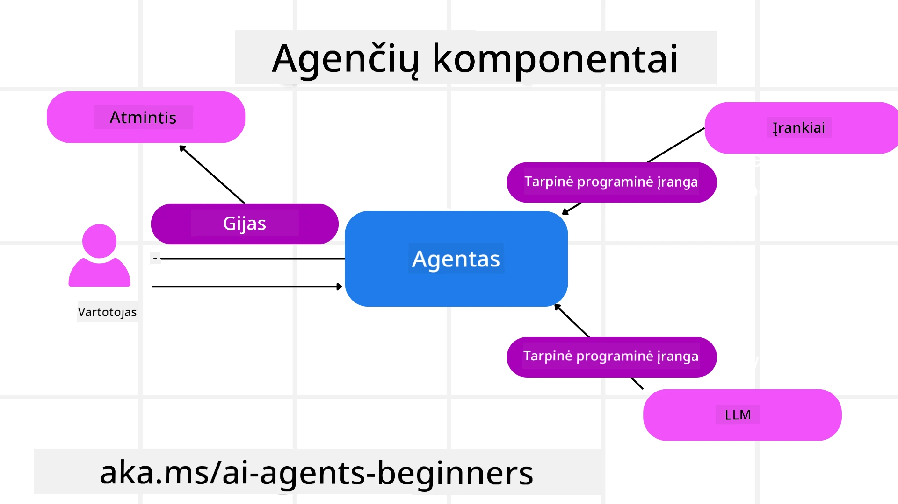

# Microsoft Agent Framework tyrinėjimas


### Įvadas

Šiame pamokoje bus apžvelgiama:

- Microsoft Agent Framework supratimas: pagrindinės savybės ir vertė  
- Microsoft Agent Framework pagrindinių sąvokų tyrimas
- Pažangūs MAF modeliai: darbo eiga, tarpinė programa ir atmintis

## Mokymosi tikslai

Baigę šią pamoką, žinosite, kaip:

- Kurti gamybai paruoštus AI agentus naudojant Microsoft Agent Framework
- Taikyti Microsoft Agent Framework pagrindines savybes savo agentinėms naudojimo situacijoms
- Naudoti pažangius modelius, įskaitant darbo eigas, tarpinę programą ir stebėseną

## Kodo pavyzdžiai

Kodo pavyzdžius Microsoft Agent Framework (MAF) rasite šiame saugykloje po `xx-python-agent-framework` ir `xx-dotnet-agent-framework` failais.

## Microsoft Agent Framework supratimas


[Microsoft Agent Framework (MAF)](https://aka.ms/ai-agents-beginners/agent-framewrok) yra "Microsoft" vieningas AI agentų kūrimo karkasas. Jis siūlo lankstumą spręsti įvairias agentines naudojimo situacijas, matomas tiek gamybos, tiek tyrimų aplinkose, įskaitant:

- **Sekvencinė agentų orkestracija** scenarijuose, kur reikalingi žingsnis po žingsnio darbo srautai.
- **Konkuruojanti orkestracija** scenarijuose, kur agentai turi atlikti užduotis tuo pačiu metu.
- **Grupinių pokalbių orkestracija** scenarijuose, kur agentai gali bendradarbiauti vienoje užduotyje.
- **Perdavimų orkestracija** scenarijuose, kur agentai perduoda užduotis vieni kitiems, kai poskyriai baigiami.
- **Magnetinė orkestracija** scenarijuose, kai vadovaujantis agentas kuria ir modifikuoja užduočių sąrašą ir tvarko subagentų koordinavimą užduoties įvykdymui.

Norint pristatyti AI agentus gamyboje, MAF taip pat turi funkcijas:

- **Stebėjimas** naudojant OpenTelemetry, kur yra fiksuojamas kiekvienas AI agente veiksmų, įskaitant įrankių kvietimą, orkestracijos žingsnius, sprendimų srautus ir veiklos stebėjimą per Microsoft Foundry informacines skydus.
- **Saugumas** natūraliai talpinant agentus Microsoft Foundry, kuris apima saugumo valdymą, pavyzdžiui, vaidmenų pagrindu prieigą, privačių duomenų tvarkymą ir įmontuotą turinio saugumą.
- **Atsparumas** kad agentų procesai ir darbo srautai gali sustoti, tęstis ir atsigauti po klaidų, leidžiant ilgesnės trukmės vykdymą.
- **Valdymas** palaikomi žmogaus ciklo darbo srautai, kuriuose užduotys žymimos kaip reikalaujančios žmogaus patvirtinimo.

Microsoft Agent Framework taip pat orientuotas į sąveiką:

- **Debesų nepriklausomumas** – agentai gali veikti konteineriuose, vietoje arba skirtinguose debesyse.
- **Tiekėjų nepriklausomumas** – agentai gali būti kuriami naudojant jūsų pasirinktą SDK, įskaitant Azure OpenAI ir OpenAI.
- **Atviro standarto integracija** – agentai gali naudoti protokolus, tokius kaip Agent-to-Agent (A2A) ir Model Context Protocol (MCP), kad aptiktų ir naudotų kitus agentus bei įrankius.
- **Priedai ir jungtys** – ryšiai gali būti užmezgami su duomenų ir atminties paslaugomis, tokiais kaip Microsoft Fabric, SharePoint, Pinecone ir Qdrant.

Pažiūrėkime, kaip šios savybės taikomos pagrindinėms Microsoft Agent Framework sąvokoms.

## Pagrindinės Microsoft Agent Framework sąvokos

### Agentai



**Agentų kūrimas**

Agentų kūrimas atliekamas apibrėžiant spėjimo paslaugą (LLM tiekėją), AI agentui skirtų nurodymų rinkinį ir priskiriant `name`:

```python
agent = AzureOpenAIChatClient(credential=AzureCliCredential()).create_agent( instructions="You are good at recommending trips to customers based on their preferences.", name="TripRecommender" )
```

Aukščiau naudojamas `Azure OpenAI`, bet agentai gali būti kuriami naudojant įvairias paslaugas, įskaitant `Microsoft Foundry Agent Service`:

```python
AzureAIAgentClient(async_credential=credential).create_agent( name="HelperAgent", instructions="You are a helpful assistant." ) as agent
```

OpenAI `Responses`, `ChatCompletion` API

```python
agent = OpenAIResponsesClient().create_agent( name="WeatherBot", instructions="You are a helpful weather assistant.", )
```

```python
agent = OpenAIChatClient().create_agent( name="HelpfulAssistant", instructions="You are a helpful assistant.", )
```

arba nuotolinius agentus naudojant A2A protokolą:

```python
agent = A2AAgent( name=agent_card.name, description=agent_card.description, agent_card=agent_card, url="https://your-a2a-agent-host" )
```

**Agentų paleidimas**

Agentai paleidžiami naudojant `.run` arba `.run_stream` metodus, priklausomai ar reikia nepertraukiamo ar srautinio atsako.

```python
result = await agent.run("What are good places to visit in Amsterdam?")
print(result.text)
```

```python
async for update in agent.run_stream("What are the good places to visit in Amsterdam?"):
    if update.text:
        print(update.text, end="", flush=True)

```

Kiekvieno agente paleidimo metu taip pat galima pritaikyti parinktis, tokias kaip agento naudojamų `max_tokens`, agento galimų kvietimų `tools` ir net paties `modelio` pasirinkimas.

Tai naudinga atvejais, kai konkretiems vartotojo užduočiai atlikti reikalingi tam tikri modeliai ar įrankiai.

**Įrankiai**

Įrankiai gali būti nurodomi tiek apibrėžiant agentą:

```python
def get_attractions( location: Annotated[str, Field(description="The location to get the top tourist attractions for")], ) -> str: """Get the top tourist attractions for a given location.""" return f"The top attractions for {location} are." 


# Kai tiesiogiai kuriamas ChatAgent

agent = ChatAgent( chat_client=OpenAIChatClient(), instructions="You are a helpful assistant", tools=[get_attractions]

```

tiek vykdant agentą:

```python

result1 = await agent.run( "What's the best place to visit in Seattle?", tools=[get_attractions] # Įrankis suteiktas tik šiam paleidimui )
```

**Agentų siūlai**

Agentų siūlai naudojami daugiažingsniam pokalbiui valdyti. Siūlai gali būti sukurti:

- Naudojant `get_new_thread()`, kuris leidžia siūlą išsaugoti laikui bėgant
- Automatiškai, paleidžiant agentą, kai siūlas egzistuoja tik esamoje sesijoje.

Siūlo kūrimo kodas atrodo taip:

```python
# Sukurti naują giją.
thread = agent.get_new_thread() # Vykdyti agentą su gija.
response = await agent.run("Hello, I am here to help you book travel. Where would you like to go?", thread=thread)

```

Tada siūlą galima serializuoti ir išsaugoti vėlesniam naudojimui:

```python
# Sukurti naują siūlą.
thread = agent.get_new_thread() 

# Vykdyti agentą su siūlu.

response = await agent.run("Hello, how are you?", thread=thread) 

# Seralizuoti siūlą saugojimui.

serialized_thread = await thread.serialize() 

# Deseralizuoti siūlo būseną po įkėlimo iš saugyklos.

resumed_thread = await agent.deserialize_thread(serialized_thread)
```

**Agentų tarpinė programa**

Agentai sąveikauja su įrankiais ir LLM, kad atliktų vartotojo užduotis. Tam tikrais atvejais norime vykdyti veiksmus ar stebėti šias sąveikas. Agentų tarpinė programa leidžia tai daryti per:

*Funkcijų tarpinė programa*

Ši tarpinė programa leidžia vykdyti veiksmą tarp agento ir funkcijos/įrankio, kurį jis kvies. Pvz., ją galėtumėte naudoti funkcijos kvietimo registravimui.

Žemiau pateiktame kode `next` nusako, ar turi būti iškviečiama kita tarpinė programa ar pati funkcija.

```python
async def logging_function_middleware(
    context: FunctionInvocationContext,
    next: Callable[[FunctionInvocationContext], Awaitable[None]],
) -> None:
    """Function middleware that logs function execution."""
    # Išankstinis apdorojimas: įrašyti žurnalą prieš funkcijos vykdymą
    print(f"[Function] Calling {context.function.name}")

    # Tęsti prie kito tarpinio sluoksnio arba funkcijos vykdymo
    await next(context)

    # Vėlyvas apdorojimas: įrašyti žurnalą po funkcijos vykdymo
    print(f"[Function] {context.function.name} completed")
```

*Pokalbių tarpinė programa*

Ši tarpinė programa leidžia vykdyti ar registruoti veiksmą tarp agento ir užklausų tarp LLM.

Joje yra svarbi informacija, tokia kaip `messages`, kurios siunčiamos AI paslaugai.

```python
async def logging_chat_middleware(
    context: ChatContext,
    next: Callable[[ChatContext], Awaitable[None]],
) -> None:
    """Chat middleware that logs AI interactions."""
    # Išankstinis apdorojimas: Žurnalas prieš kviečiant AI
    print(f"[Chat] Sending {len(context.messages)} messages to AI")

    # Tęsti kitam tarpininkui arba AI paslaugai
    await next(context)

    # Užbaigiamasis apdorojimas: Žurnalas po AI atsakymo
    print("[Chat] AI response received")

```

**Agentų atmintis**

Kaip aprašyta pamokoje `Agentic Memory`, atmintis yra svarbi agento veikimo skirtinguose kontekstuose sudedamoji dalis. MAF siūlo kelis skirtingų tipų atmintis:

*Atmintyje saugoma atmintis*

Atmintis, saugoma siūluose programos vykdymo metu.

```python
# Sukurkite naują giją.
thread = agent.get_new_thread() # Vykdykite agentą su gija.
response = await agent.run("Hello, I am here to help you book travel. Where would you like to go?", thread=thread)
```

*Išliekamieji pranešimai*

Ši atmintis naudojama pokalbio istorijai saugoti per skirtingas sesijas. Apibrėžiama naudojant `chat_message_store_factory`:

```python
from agent_framework import ChatMessageStore

# Sukurkite pasirinktinių žinučių saugyklą
def create_message_store():
    return ChatMessageStore()

agent = ChatAgent(
    chat_client=OpenAIChatClient(),
    instructions="You are a Travel assistant.",
    chat_message_store_factory=create_message_store
)

```

*Dinaminė atmintis*

Ši atmintis pridedama prie konteksto prieš paleidžiant agentus. Ji gali būti saugoma išorinėse paslaugose, tokiose kaip mem0:

```python
from agent_framework.mem0 import Mem0Provider

# Naudojant Mem0 pažangioms atminties galimybėms
memory_provider = Mem0Provider(
    api_key="your-mem0-api-key",
    user_id="user_123",
    application_id="my_app"
)

agent = ChatAgent(
    chat_client=OpenAIChatClient(),
    instructions="You are a helpful assistant with memory.",
    context_providers=memory_provider
)

```

**Agentų stebėjimas**

Stebėjimas yra svarbus kuriant patikimas ir tvarkomas agentines sistemas. MAF integruojasi su OpenTelemetry, kad suteiktų trasavimą ir matuoklius geresniam stebėjimui.

```python
from agent_framework.observability import get_tracer, get_meter

tracer = get_tracer()
meter = get_meter()
with tracer.start_as_current_span("my_custom_span"):
    # padaryti kažką
    pass
counter = meter.create_counter("my_custom_counter")
counter.add(1, {"key": "value"})
```

### Darbo eiga

MAF siūlo darbo eigas, kurios yra iš anksto apibrėžti žingsniai užduočiai atlikti, kuriose AI agentai veikia kaip komponentai.

Darbo eiga susideda iš skirtingų komponentų, leidžiančių geriau valdyti srautą. Darbo eiga taip pat leidžia **daugiaagentinę orkestraciją** ir **kontrolinių taškų kūrimą**, kad būtų galima išsaugoti darbo eigos būsenas.

Pagrindiniai darbo eigos komponentai yra:

**Vykdytojai**

Vykdytojai gauna įvesties pranešimus, atlieka savo paskirtas užduotis ir sukuria išvesties pranešimą. Tai leidžia darbo eigai žengti link didesnės užduoties atlikimo. Vykdytojai gali būti tiek AI agentai, tiek vartotojo logika.

**Kraštai**

Kraštai naudojami apibrėžti pranešimų srautą darbo eigoje. Jie gali būti:

*Tiesioginiai kraštai* – paprasti vienas prie vieno ryšiai tarp vykdytojų:

```python
from agent_framework import WorkflowBuilder

builder = WorkflowBuilder()
builder.add_edge(source_executor, target_executor)
builder.set_start_executor(source_executor)
workflow = builder.build()
```

*Sąlyginiai kraštai* – aktyvuojami, kai įvykdoma tam tikra sąlyga. Pavyzdžiui, kai nėra laisvų viešbučių kambarių, vykdytojas gali pasiūlyti kitas galimybes.

*Perjungimo atvejų kraštai* – nukreipia pranešimus skirtingiems vykdytojams pagal apibrėžtas sąlygas. Pvz., jei kelionės klientas turi prioritetinę prieigą, jo užduotys bus tvarkomos kitoje darbo eigoje.

*Išsiskleidžiančių kraštų schema* – vieną pranešimą siunčia keliems gavėjams.

*Susibūrimo kraštai* – sujungia kelis pranešimus iš skirtingų vykdytojų ir siunčia vienam gavėjui.

**Įvykiai**

Siekiant pagerinti darbo eigų stebėjimą, MAF siūlo įmontuotus vykdymo įvykius:

- `WorkflowStartedEvent` – prasideda darbo eigos vykdymas
- `WorkflowOutputEvent` – darbo eiga generuoja išvestį
- `WorkflowErrorEvent` – darbo eiga susiduria su klaida
- `ExecutorInvokeEvent` – vykdytojas pradeda apdorojimą
- `ExecutorCompleteEvent` – vykdytojas baigia apdorojimą
- `RequestInfoEvent` – pateikiama užklausa

## Pažangūs MAF modeliai

Aukščiau aprašytos pagrindinės Microsoft Agent Framework sąvokos. Kuriant sudėtingesnius agentus, verta apsvarstyti šiuos pažangius modelius:

- **Tarpinės programos sudėtis**: sujunkite kelis tarpinės programos apdorotojus (registravimą, autentifikavimą, ribojimą) naudojant funkcijų ir pokalbių tarpinę programą, siekiant smulkiau valdyti agentų elgseną.
- **Darbo eigos kontrolinių taškų kūrimas**: naudokite darbo eigos įvykius ir serializaciją, kad išsaugotumėte ir atnaujintumėte ilgai veikiančius agentų procesus.
- **Dinaminis įrankių pasirinkimas**: derinkite RAG su įrankių aprašymais ir MAF įrankių registraciją, kad prezentuotumėte tik aktualius įrankius kiekvienam užklausai.
- **Daugiaagentis perdavimas**: naudokite darbo eigos kraštus ir sąlyginius maršrutus agentų perdavimams tarp specializuotų agentų.

## Kodo pavyzdžiai

Microsoft Agent Framework kodo pavyzdžiai saugomi šiame saugykloje po `xx-python-agent-framework` ir `xx-dotnet-agent-framework` failais.

## Turite daugiau klausimų apie Microsoft Agent Framework?

Prisijunkite prie [Microsoft Foundry Discord](https://aka.ms/ai-agents/discord), susitikite su kitais besimokančiaisiais, dalyvaukite konsultacijose ir gaukite atsakymus į savo AI agentų klausimus.

---

<!-- CO-OP TRANSLATOR DISCLAIMER START -->
**Atsakomybės apribojimas**:  
Šis dokumentas buvo išverstas naudojant dirbtinio intelekto vertimo paslaugą [Co-op Translator](https://github.com/Azure/co-op-translator). Nors siekiame tikslumo, atkreipkite dėmesį, kad automatizuoti vertimai gali turėti klaidų ar netikslumų. Originalus dokumentas jo gimtąja kalba turėtų būti laikomas pagrindiniu ir autoritetingu šaltiniu. Kritinei informacijai rekomenduojamas profesionalus žmogaus vertimas. Mes neprisiimame atsakomybės už bet kokius nesusipratimus ar klaidingas interpretacijas, kylančias dėl šio vertimo naudojimo.
<!-- CO-OP TRANSLATOR DISCLAIMER END -->