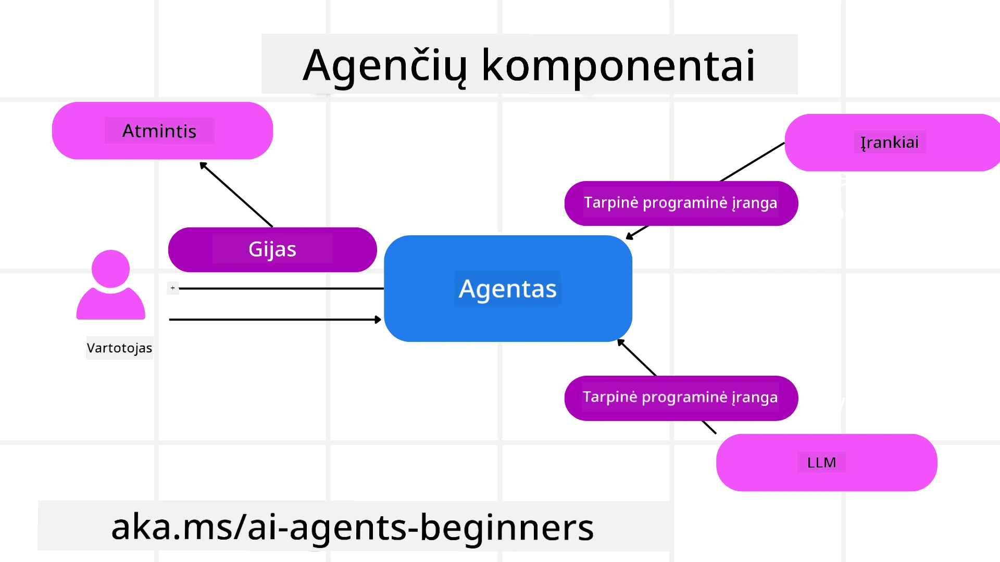

# Microsoft Agent Framework tyrinėjimas


### Įvadas

Šiame pamokoje bus aptarta:

- Microsoft Agent Framework supratimas: pagrindinės savybės ir vertė  
- Microsoft Agent Framework pagrindinių konceptų tyrinėjimas
- Pažangūs MAF modeliai: darbo eigos, tarpinė programinė įranga ir atmintis

## Mokymosi tikslai

Baigę šią pamoką, galėsite:

- Kurti gamybinio lygio AI agentus naudojant Microsoft Agent Framework
- Taikyti pagrindines Microsoft Agent Framework funkcijas savo agentiniams naudojimo atvejams
- Naudoti pažangius modelius, tokius kaip darbo eigos, tarpinė programinė įranga ir stebimumas

## Kodo pavyzdžiai 

[Microsoft Agent Framework (MAF)](https://learn.microsoft.com/en-us/agent-framework/overview/?wt.mc_id=youtube_26688_organicsocial_reactor&pivots=programming-language-python) kodo pavyzdžiai yra šiame repozitorijoje failuose `xx-python-agent-framework` ir `xx-dotnet-agent-framework`.

## Microsoft Agent Framework supratimas


[Microsoft Agent Framework (MAF)](https://learn.microsoft.com/en-us/agent-framework/overview/?wt.mc_id=youtube_26688_organicsocial_reactor&pivots=programming-language-python) yra „Microsoft“ susisteminta aplinka AI agentų kūrimui. Ji suteikia lankstumo spręsti įvairius agentinius naudojimo atvejus, pasitaikančius tiek gamyboje, tiek tyrimų aplinkose, įskaitant:

- **Sequencinę agentų orkestraciją** scenarijuose, kur reikia žingsnis po žingsnio darbo eigų.
- **Kelių agentų lygiagretų orkestravimą** scenarijuose, kai agentai turi atlikti užduotis vienu metu.
- **Grupinių pokalbių orkestraciją** scenarijuose, kur agentai gali bendradarbiauti atliekant vieną užduotį.
- **Užduočių perdavimą** scenarijuose, kai agentai perduoda užduotį vienas kitam atliekant potaskius.
- **Magnetinę orkestraciją** scenarijuose, kur vadovaujantis agentas kuria ir modifikuoja užduočių sąrašą bei koordinuoja subagentus užduočiai atlikti.

Kad būtų galima tiekti AI agentus gamyboje, MAF taip pat apima funkcijas:

- **Stebimumas** naudojant OpenTelemetry, kur matoma kiekviena AI agento veiksmo dalis, įskaitant įrankių kvietimus, orkestravimo žingsnius, argumentavimo srautus ir našumo stebėjimą per Microsoft Foundry prietaisų skydelius.
- **Saugumas** talpinant agentus tiesiogiai Microsoft Foundry, kurioje įdiegtos saugumo kontrolės, tokios kaip vaidmenimis pagrįstas prieigos valdymas, privačių duomenų tvarkymas ir įmontuotas turinio saugumas.
- **Patvarumas** — agentų temų ir darbo eigų gali pristabdyti, atnaujinti ir atsigauti po klaidų, leidžiant vykdyti ilgalaikes operacijas.
- **Valdymas** — palaikomos veiklos su žmogaus įsikišimu darbo eigose, kai užduotys pažymimos reikalaujančiomis žmogaus patvirtinimo.

Microsoft Agent Framework taip pat orientuotas į tarpusavio veikimą:

- **Debesų nepriklausomumas** — agentai gali veikti konteineriuose, vietiniuose serveriuose ir skirtinguose debesyse.
- **Tiekėjų nepriklausomumas** — agentai gali būti kuriami naudojant pasirinktą SDK, įskaitant Azure OpenAI ir OpenAI.
- **Atvirų standartų integracija** — agentai gali naudoti protokolus, tokius kaip Agent-to-Agent(A2A) ir Model Context Protocol (MCP), kad atrastų ir naudotų kitus agentus bei įrankius.
- **Įskiepius ir jungtis** — galima prijungti duomenų ir atminties paslaugas, tokias kaip Microsoft Fabric, SharePoint, Pinecone ir Qdrant.

Pažiūrėkime, kaip šios savybės pritaikomos kai kuriems Microsoft Agent Framework pagrindiniams konceptams.

## Microsoft Agent Framework pagrindiniai konceptai

### Agentai



**Agento kūrimas**

Agentas kuriamas apibrėžiant inferencijos paslaugą (LLM tiekėją),  
AI agento vykdomų instrukcijų rinkinį ir priskirtą `name`:

```python
agent = AzureOpenAIChatClient(credential=AzureCliCredential()).create_agent( instructions="You are good at recommending trips to customers based on their preferences.", name="TripRecommender" )
```

Aukščiau naudojamas `Azure OpenAI`, bet agentai gali būti kuriami naudojant įvairias paslaugas, įskaitant `Microsoft Foundry Agent Service`:

```python
AzureAIAgentClient(async_credential=credential).create_agent( name="HelperAgent", instructions="You are a helpful assistant." ) as agent
```

OpenAI `Responses`, `ChatCompletion` API

```python
agent = OpenAIResponsesClient().create_agent( name="WeatherBot", instructions="You are a helpful weather assistant.", )
```

```python
agent = OpenAIChatClient().create_agent( name="HelpfulAssistant", instructions="You are a helpful assistant.", )
```

arba [MiniMax](https://platform.minimaxi.com/), kuris suteikia su OpenAI suderinamą API su dideliais konteksto langais (iki 204K žetonų):

```python
agent = OpenAIChatClient(base_url="https://api.minimax.io/v1", api_key=os.environ["MINIMAX_API_KEY"], model_id="MiniMax-M3").create_agent( name="HelpfulAssistant", instructions="You are a helpful assistant.", )
```

arba nuotolinius agentus naudojant A2A protokolą:

```python
agent = A2AAgent( name=agent_card.name, description=agent_card.description, agent_card=agent_card, url="https://your-a2a-agent-host" )
```

**Agento paleidimas**

Agentai paleidžiami naudojant `.run` arba `.run_stream` metodus, teikiančius ne srautinį arba srautinį atsakymą.

```python
result = await agent.run("What are good places to visit in Amsterdam?")
print(result.text)
```

```python
async for update in agent.run_stream("What are the good places to visit in Amsterdam?"):
    if update.text:
        print(update.text, end="", flush=True)

```

Kiekvienas agento paleidimas gali turėti parinkčių individualizuoti parametrus, tokius kaip `max_tokens`, kuriuos naudoja agentas, `tools`, kuriuos agentas gali kviesti, ir net `model` pats, naudojamas agentui.

Tai naudinga atvejais, kai konkrečios modeliai ar įrankiai reikalingi vartotojo užduočiai atlikti.

**Įrankiai**

Įrankiai gali būti apibrėžiami tiek kuriant agentą:

```python
def get_attractions( location: Annotated[str, Field(description="The location to get the top tourist attractions for")], ) -> str: """Get the top tourist attractions for a given location.""" return f"The top attractions for {location} are." 


# Kai tiesiogiai kuriamas ChatAgent

agent = ChatAgent( chat_client=OpenAIChatClient(), instructions="You are a helpful assistant", tools=[get_attractions]

```

ir taip pat agentą paleidžiant:

```python

result1 = await agent.run( "What's the best place to visit in Seattle?", tools=[get_attractions] # Įrankis pateiktas tik šiam vykdymui )
```

**Agento temos**

Agentų temos naudojamos tvarkyti daugiakartinius pokalbius. Temos gali būti sukuriamos:

- Naudojant `get_new_thread()`, kuris leidžia temą išsaugoti laikui bėgant
- Automatiškai sukuriant temą paleidžiant agentą ir ši tema galioja tik einamojo paleidimo metu.

Temos kūrimo pavyzdys atrodo taip:

```python
# Sukurkite naują giją.
thread = agent.get_new_thread() # Vykdykite agentą su šia gija.
response = await agent.run("Hello, I am here to help you book travel. Where would you like to go?", thread=thread)

```

Temą galite serializuoti ir išsaugoti ilgesniam naudojimui:

```python
# Sukurkite naują giją.
thread = agent.get_new_thread() 

# Paleiskite agentą su gija.

response = await agent.run("Hello, how are you?", thread=thread) 

# Serijalizuokite giją saugojimui.

serialized_thread = await thread.serialize() 

# Deserijalizuokite gijos būseną po įkėlimo iš saugyklos.

resumed_thread = await agent.deserialize_thread(serialized_thread)
```

**Agentų tarpinė programinė įranga**

Agentai sąveikauja su įrankiais ir LLM, kad įvykdytų vartotojo užduotis. Tam tikrais scenarijais norime vykdyti arba stebėti veiksmus tarp šios sąveikos. Agentų tarpinė programinė įranga leidžia tai daryti per:

*Funkcinę tarpinę programinę įrangą*

Ši tarpinė programinė įranga leidžia vykdyti veiksmą tarp agento ir funkcijos/įrankio kvietimo. Pavyzdys — noras registruoti funkcijos kvietimą.

Žemiau pateiktame kode `next` nurodo, ar kviečiama kitoji middleware arba pati funkcija.

```python
async def logging_function_middleware(
    context: FunctionInvocationContext,
    next: Callable[[FunctionInvocationContext], Awaitable[None]],
) -> None:
    """Function middleware that logs function execution."""
    # Išankstinis apdorojimas: Užfiksuoti įrašą prieš funkcijos vykdymą
    print(f"[Function] Calling {context.function.name}")

    # Tęsti į kitą tarpinį programinį sluoksnį arba funkcijos vykdymą
    await next(context)

    # Po apdorojimo: Užfiksuoti įrašą po funkcijos vykdymo
    print(f"[Function] {context.function.name} completed")
```

*Pokalbių tarpinė programinė įranga*

Ši tarpinė programinė įranga leidžia vykdyti ar registruoti veiksmą tarp agento ir LLM užklausų.

Joje yra svarbi informacija, tokia kaip į AI paslaugą siunčiami `messages`.

```python
async def logging_chat_middleware(
    context: ChatContext,
    next: Callable[[ChatContext], Awaitable[None]],
) -> None:
    """Chat middleware that logs AI interactions."""
    # Išankstinis apdorojimas: Įrašymas prieš AI kvietimą
    print(f"[Chat] Sending {len(context.messages)} messages to AI")

    # Tęsti kitam tarpinio programinės įrangos sluoksnio arba AI paslaugai
    await next(context)

    # Vėlesnis apdorojimas: Įrašymas po AI atsakymo
    print("[Chat] AI response received")

```

**Agento atmintis**

Kaip aptarta pamokoje `Agentic Memory`, atmintis yra svarbus elementas leidžiantis agentui veikti skirtinguose kontekstuose. MAF siūlo keletą atminties tipų:

*Veikimo atmintis*

Tai atmintis, saugoma temose programos vykdymo metu.

```python
# Sukurkite naują giją.
thread = agent.get_new_thread() # Paleiskite agentą su gija.
response = await agent.run("Hello, I am here to help you book travel. Where would you like to go?", thread=thread)
```

*Nuolatinės žinutės*

Ši atmintis naudojama saugoti pokalbių istoriją tarp skirtingų sesijų. Ji apibrėžiama naudojant `chat_message_store_factory`:

```python
from agent_framework import ChatMessageStore

# Sukurkite pasirinktinių pranešimų saugyklą
def create_message_store():
    return ChatMessageStore()

agent = ChatAgent(
    chat_client=OpenAIChatClient(),
    instructions="You are a Travel assistant.",
    chat_message_store_factory=create_message_store
)

```

*Dinaminė atmintis*

Ši atmintis pridedama prie konteksto prieš paleidžiant agentus. Ji gali būti saugoma išorinėse paslaugose, tokiose kaip mem0:

```python
from agent_framework.mem0 import Mem0Provider

# Naudojant Mem0 pažangioms atminties funkcijoms
memory_provider = Mem0Provider(
    api_key="your-mem0-api-key",
    user_id="user_123",
    application_id="my_app"
)

agent = ChatAgent(
    chat_client=OpenAIChatClient(),
    instructions="You are a helpful assistant with memory.",
    context_providers=memory_provider
)

```

**Agentų stebimumas**

Stebimumas svarbus kuriant patikimas ir prižiūrimas agentines sistemas. MAF integruojasi su OpenTelemetry, kad teiktų transliaciją ir matuoklius geresniam stebimumui.

```python
from agent_framework.observability import get_tracer, get_meter

tracer = get_tracer()
meter = get_meter()
with tracer.start_as_current_span("my_custom_span"):
    # padaryti kažką
    pass
counter = meter.create_counter("my_custom_counter")
counter.add(1, {"key": "value"})
```

### Darbo eigos

MAF siūlo darbo eigas - tai iš anksto apibrėžti žingsniai užduočiai įvykdyti, į kuriuos įtraukti AI agentai kaip komponentai.

Darbo eigos susideda iš skirtingų komponentų, leidžiančių geresnę valdymo seką. Darbo eigos taip pat leidžia **multi-agentų orkestraciją** ir **kontrolinių taškų saugojimą**, kad išsaugotų darbo eigos būseną.

Pagrindiniai darbo eigos komponentai yra:

**Vykdytojai**

Vykdytojai gauna įvesties žinutes, atlieka priskirtas užduotis ir tada sukuria išvesties žinutę. Tai stumia darbo eigą į priekį didesnės užduoties atlikimo link. Vykdytojai gali būti AI agentai arba pasirinktinė logika.

**Krypčiai**

Krypčiai nurodo žinučių srautą darbo eigoje. Jie gali būti:

*Tiesioginiai krypčiai* - Paprasti vienas prie vieno ryšiai tarp vykdytojų:

```python
from agent_framework import WorkflowBuilder

builder = WorkflowBuilder()
builder.add_edge(source_executor, target_executor)
builder.set_start_executor(source_executor)
workflow = builder.build()
```

*Sąlyginiai krypčiai* - Aktyvuojami, kai tenkinama tam tikra sąlyga. Pavyzdžiui, kai viešbučių kambariai nepasiekiami, vykdytojas gali pasiūlyti kitas galimybes.

*Perjungimo krypčiai* - Nukreipia žinutes skirtingiems vykdytojams pagal apibrėžtas sąlygas. Pavyzdžiui, jei keliautojas turi prioritetinę prieigą, jo užduotys bus tvarkomos per kitą darbo eigą.

*Išskleidžiamieji krypčiai* - Siunčia vieną žinutę keliems gavėjams.

*Susijungiantys krypčiai* - Surenka kelias žinutes iš skirtingų vykdytojų ir siunčia vienam gavėjui.

**Įvykiai**

Geresniam darbo eigų stebimumui MAF siūlo įdiegtus vykdymo įvykius, įskaitant:

- `WorkflowStartedEvent`  - Darbo eigos vykdymo pradžia
- `WorkflowOutputEvent` - Darbo eiga generuoja išvestį
- `WorkflowErrorEvent` - Darbo eiga užfiksuoja klaidą
- `ExecutorInvokeEvent`  - Vykdytojas pradeda apdorojimą
- `ExecutorCompleteEvent`  - Vykdytojas baigia apdorojimą
- `RequestInfoEvent` - Išsiunčiama užklausa

## Pažangūs MAF modeliai

Aukščiau aptarti pagrindiniai Microsoft Agent Framework konceptai. Kūriant sudėtingesnius agentus svarbu apsvarstyti tokius pažangius modelius:

- **Tarpinės programinės įrangos komponavimas**: grandinės kelių tarpinės įrangos tvarkytojų (registravimas, autentifikacija, greičio ribojimas) naudojimas per funkcijų ir pokalbių tarpinę programinę įrangą, kad būtų tiksliau valdomas agento elgesys.
- **Darbo eigos kontrolinių taškų saugojimas**: naudoti darbo eigos įvykius ir serializaciją ilgai veikiančių agentų procesų išsaugojimui ir atnaujinimui.
- **Dinaminis įrankių pasirinkimas**: derinti RAG su įrankių aprašymais ir MAF įrankių registracija, kad būtų pateikti tik aktualūs įrankiai užklausai.
- **Daugiagentinis užduočių perdavimas**: naudoti darbo eigos krypčius ir sąlyginį maršrutavimą agentų specializuotam užduočių perdavimui.

## LangChain / LangGraph agentų talpinimas Microsoft Foundry

Microsoft Agent Framework yra **framework-suderinamas** — nesi ribojamas agentais, parašytais su MAF. Jei jau turi agentą, sukurtą su **LangChain** arba **LangGraph**, gali jį paleisti kaip **Microsoft Foundry talpinamą agentą**, kad Foundry valdytų vykdymą, sesijas, mastelį, tapatybę ir protokolo galinius taškus, o tavo agento logika liktų LangGraph.

Tai daroma naudojant `langchain_azure_ai.agents.hosting` paketą, kuris pateikia kompiliuotą LangGraph grafą per tas pačias protokolų sąsajas, kurias naudoja Foundry talpinami agentai.

**1. Įdiek hosting papildinį:**

```bash
pip install -U "langchain-azure-ai[hosting]>=1.2.4" azure-identity
```

Papildinys `hosting` įdiegia Foundry protokolo bibliotekas: `azure-ai-agentserver-responses` (OpenAI suderinamas `/responses` galutinis taškas) ir `azure-ai-agentserver-invocations` (bendras `/invocations` galutinis taškas).

**2. Pasirink hosting protokolą:**

| Protokolas | Host klasė | Galinis taškas | Naudok, kai |
|----------|-----------|----------|----------|
| **Responses** | `ResponsesHostServer` | `/responses` | Nori OpenAI suderinamo pokalbių, srautinio transliavimo, atsakymų istorijos ir pokalbių temų — rekomenduojamas numatytasis pokalbių agentams. |
| **Invocations** | `InvocationsHostServer` | `/invocations` | Reikia tinkinto JSON formato, webhook tipo galutinio taško arba ne pokalbių apdorojimo. |

Kadangi **Responses API yra pagrindinis agentų kūrimo Foundry API**, daugumai agentų pradėk nuo `ResponsesHostServer`.

**3. Sukonfigūruok aplinkos kintamuosius** (`az login` iš anksto, kad `DefaultAzureCredential` galėtų autentifikuotis):

```bash
export FOUNDRY_PROJECT_ENDPOINT="https://<resource>.services.ai.azure.com/api/projects/<project>"
export FOUNDRY_MODEL_NAME="gpt-5-mini"
```

Kai agentas vėliau veiks kaip Foundry talpinamas agentas, platforma automatiškai įdiegia `FOUNDRY_PROJECT_ENDPOINT`.

**4. Pateik LangGraph agentą per Responses protokolą:**

```python
import os

from azure.ai.projects import AIProjectClient
from azure.identity import DefaultAzureCredential, get_bearer_token_provider
from langchain.agents import create_agent
from langchain_openai import ChatOpenAI
from langchain_azure_ai.agents.hosting import ResponsesHostServer

_AZURE_AI_SCOPE = "https://ai.azure.com/.default"


def build_chat_model() -> ChatOpenAI:
    project_endpoint = os.environ["FOUNDRY_PROJECT_ENDPOINT"].rstrip("/")
    deployment = os.environ.get("FOUNDRY_MODEL_NAME", "gpt-5-mini")
    credential = DefaultAzureCredential()
    project = AIProjectClient(endpoint=project_endpoint, credential=credential)
    openai_client = project.get_openai_client()
    token_provider = get_bearer_token_provider(credential, _AZURE_AI_SCOPE)

    # Čia ChatOpenAI taikosi į Foundry projekto OpenAI suderinamą (Atsakymai) galinį tašką.
    return ChatOpenAI(
        model=deployment,
        base_url=str(openai_client.base_url),
        api_key=token_provider,
    )


def main() -> None:
    graph = create_agent(build_chat_model(), tools=[])
    port = int(os.environ.get("PORT", "8088"))
    ResponsesHostServer(graph).run(port=port)


if __name__ == "__main__":
    main()
```

Paleisk vietoje su `python main.py`, tada siųsk Responses užklausą į `http://localhost:8088/responses`.

**Pagrindiniai elgesiai:**

- **Pokalbiai**: klientai tęsia pokalbį perduodami `previous_response_id` arba `conversation` ID. Jei grafas yra kompiliuotas su LangGraph kontroliniu tašku, Foundry pririša pokalbio būseną prie kontrolinio taško (produkcijoje naudok patikimą kontrolinį tašką; `MemorySaver` tinka vietiniam testavimui).
- **Žmogus grandinėje**: jei grafas naudoja LangGraph `interrupt()`, `ResponsesHostServer` pateikia laukiančią pertrauką kaip Responses `function_call` / `mcp_approval_request` elementą, o klientai tęsia su atitinkančiu `function_call_output` / `mcp_approval_response`.
- **Diegimas į Foundry**: naudok Azure Developer CLI — `azd ext install azure.ai.agents`, `azd ai agent init -m <manifest>`, `azd ai agent run` (vietinis, reikalauja Docker), tada `azd provision` ir `azd deploy`. Talpinamo agento diegimui reikalinga **Foundry projekto vadovo** rolė.

Šio pavyzdžio paleidžiamas variantas yra [code-samples/14-langchain-hosted-agent.py](../../../14-microsoft-agent-framework/code-samples/14-langchain-hosted-agent.py). Pilnas vadovas (Invocations protokolas, pasirinktinių užklausų schemos, trikčių šalinimas) yra [Host LangGraph agents as Foundry hosted agents](https://learn.microsoft.com/azure/foundry/how-to/develop/langchain-hosted-agents).

## Kodo pavyzdžiai 

Microsoft Agent Framework kodo pavyzdžiai yra šiame repozitorijoje failuose `xx-python-agent-framework` ir `xx-dotnet-agent-framework`.

## Ar turi daugiau klausimų apie Microsoft Agent Framework?

Prisijunk prie [Microsoft Foundry Discord](https://discord.com/invite/ATgtXmAS5D), kad susitikti su kitais besimokančiais, dalyvauti konsultacijose ir gauti atsakymus į savo AI agentų klausimus.
## Ankstesnė pamoka

[AI agentų atmintis](../13-agent-memory/README.md)

## Kita pamoka

[Kompiuterio naudojimo agentų kūrimas (CUA)](../15-browser-use/README.md)

---

<!-- CO-OP TRANSLATOR DISCLAIMER START -->
**Atsakomybės apribojimas**:
Šis dokumentas buvo išverstas naudojant dirbtinio intelekto vertimo paslaugą [Co-op Translator](https://github.com/Azure/co-op-translator). Nors siekiame tikslumo, prašome atkreipti dėmesį, kad automatiniai vertimai gali turėti klaidų ar netikslumų. Originalus dokumentas jo gimtąja kalba laikomas autoritetingu šaltiniu. Svarbiai informacijai rekomenduojama naudoti profesionalų žmogiškąjį vertimą. Mes neatsakome už jokius nesusipratimus ar neteisingą interpretaciją, kilusią naudojantis šiuo vertimu.
<!-- CO-OP TRANSLATOR DISCLAIMER END -->