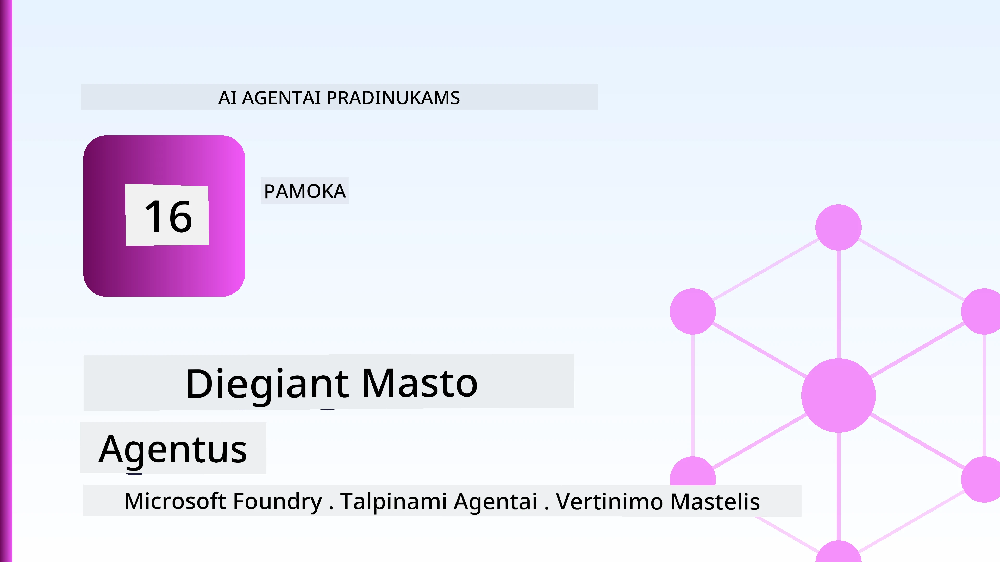
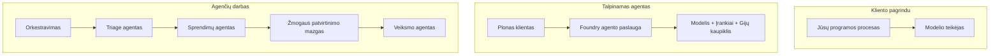
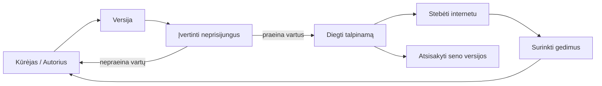
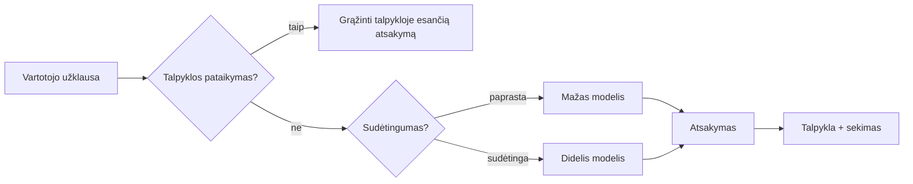
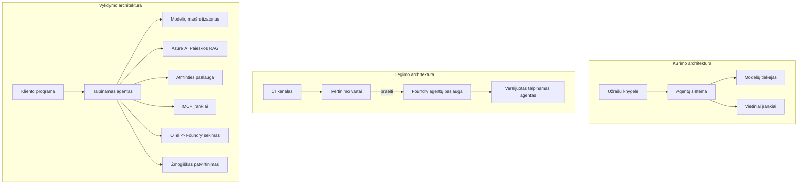

# Mastelio agentų diegimas su Microsoft Foundry



Iki šiol kurse sukūrėte agentus, kurie veikia jūsų nešiojamajame kompiuteryje, užrašų knygelėje, valdoma `az login` ir kelių aplinkos kintamųjų. Tai būtent teisingas būdas mokytis. Tačiau tai nėra tinkamas būdas paleisti agentą, nuo kurio priklauso tūkstančiai klientų 3 val. nakties.

Ši pamoka apie atotrūkį tarp „veikia mano mašinoje“ ir „veikia patikimai ir ekonomiškai gamyboje“. Mes uždarome šį atotrūkį naudodami **Microsoft Foundry** ir **Microsoft Foundry Agent Service**, kurdami tikrą klientų aptarnavimo agentą, turintį įrankius, paiešką, atmintį, vertinimą ir stebėjimą.

## Įvadas

Ši pamoka apims:

- Skirtumą tarp **prototipinio agento** ir **įdiegto agento**, ir kodėl perėjimas daugiausiai susijęs su viskuo, kas *supa* modelį.
- **Diegimo modelius** agentams: klientų valdomas, paslaugos valdomas (Hosted Agents) ir darbo srauto orkestruotas.
- **Agentų gyvavimo ciklą** Microsoft Foundry platformoje — kurti, versijuoti, diegti, vertinti, stebėti, nutraukti.
- **Mastelio didinimo strategijas**: modelių maršrutizavimas, talpinimas, lygiagretumas ir bevalstė architektūra.
- **Stebėjimą** su OpenTelemetry ir Foundry sekimu.
- **Sąnaudų optimizavimą** per modelių pasirinkimą, maršrutizavimą ir vertinimo vartus.
- **Įmonių aspektus**: valdymą, žmonių patvirtinimą ir MCP serverių saugų paleidimą gamyboje.

## Mokymosi tikslai

Užbaigę šią pamoką, mokėsite:

- Pasirinkti tinkamą diegimo modelį konkrečiam agento darbo krūviui.
- Įdiegti agentą į Microsoft Foundry Agent Service, kad jis būtų versijuojamas, valdomas ir stebimas.
- Instrumentuoti agentą sekimui ir sukurti vertinimo vamzdyną, kuris vykdomas prieš kiekvieną leidimą.
- Taikyti modelių maršrutizavimą ir talpinimą, kad mastelis nekeltų delsimų ir kontroliuotų sąnaudas.
- Įtraukti žmogaus patvirtinimą svarbiems veiksmams ir integruoti MCP serverį saugiu gamybos būdu.

## Priešpriešos

Ši pamoka laikoma, kad jūs esate baigę ankstesnes pamokas ir gerai suprantate:

- Agentų kūrimą su [Microsoft Agent Framework](../14-microsoft-agent-framework/README.md) (Pamoka 14).
- [Įrankių naudojimą](../04-tool-use/README.md) (Pamoka 4) ir [Agentic RAG](../05-agentic-rag/README.md) (Pamoka 5).
- [Agentų atmintį](../13-agent-memory/README.md) (Pamoka 13) ir [Agentic protokolus / MCP](../11-agentic-protocols/README.md) (Pamoka 11).
- [Stebėjimą ir vertinimą](../10-ai-agents-production/README.md) (Pamoka 10) — ši pamoka tiesiogiai remiasi ja.

Taip pat reikės:

- **Azure prenumeratą** ir **Microsoft Foundry projektą** su bent vienu įdiegtu pokalbių modeliu.
- Autentifikuotą **Azure CLI** (`az login`).
- Python 3.12+ ir bibliotekas iš saugyklos [`requirements.txt`](../../../requirements.txt).

## Nuo prototipo iki gamybos: kas iš tiesų keičiasi

Prototipinis ir gamybinis agentai dalijasi tuo pačiu pagrindiniu ciklu — mąstymas, įrankių iškvietimas, atsakas. Kas keičiasi, yra viskas aplink tą ciklą. Modelis užima gal apie 20% gamybinio agento; likę 80% – operacinė struktūra.

| Aspektas | Prototipas | Gamyba |
| --- | --- | --- |
| **Talpinimas** | Veikia užrašų knygelėje | Veikia kaip valdomas servisas, versijuojamas ir diegiamas |
| **Tapatybė** | Jūsų `az login` žetonas | Valdoma tapatybė su apibrėžtais RBAC leidimais |
| **Būsena** | Atmintyje, prarandama perkrovus | Išorinė (gijos saugykla, atminties servisas) |
| **Klaidos** | Matote steko pėdsaką | Bandymas iš naujo, atsarginių variantų taikymas, dead-letter, įspėjimai |
| **Kaina** | „Kelios centai“ | Sekama pagal užklausą, maršrutizuojama, talpinama, biudžetuojama |
| **Kokybė** | Patikrinimas akimis | Automatiškai vertinama prieš kiekvieną leidimą |
| **Pasitikėjimas** | Patvirtinate kiekvieną veiksmą | Politika + žmogus procese rizikingiems veiksmams |

Atminkite šią lentelę. Kiekviena iš žemiau esančių skirsnių atitinka vieną iš šių eilučių.

## Agentų diegimo modeliai

Yra trys modeliai, kuriuos dažnai naudosite kartu.

### 1. Kliento valdomi agentai

Agentas gyvena jūsų programos procese. Jūsų kodas tiesiogiai kviečia modelį; mąstymo ciklas vyksta jūsų servise. Tai darė visos ankstesnės pamokos.

- **Naudokite, kai** reikia pilnos kontrolės ciklo, pasirinktinio tarpinio sluoksnio, arba kai agentas įembedded į esamą backend.
- **Sutartis**: pats tvarkote mastelį, būseną ir patikimumą.

### 2. Valdomi agentai (Foundry Agent Service)

Agentas yra *užregistruotas kaip resursas* Microsoft Foundry. Foundry valdo mąstymo ciklą, saugo gijas, taiko turinio saugą ir RBAC, bei daro agentą matomą Foundry portale. Jūsų programa tampa plonu klientu, kuris kuria gijas ir skaito atsakymus.

- **Naudokite, kai** norite ištvermės, įmontuoto stebėjimo, valdymo ir mažesnės operacinės atsakomybės.
- **Sutartis**: mažiau žemo lygio kontrolės už valdomą vykdymo aplinką.

### 3. Agentų darbo srautai

Keli agentai (ir įrankiai) sujungiami į grafą su aiškiu valdymo srautu — sekos žingsniai, šakojimasis, žmogaus patvirtinimo mazgai, ir ištvermingi kontroliniai taškai, kurie gali stabdyti ir tęsti veiklą. Tai Microsoft Agent Framework **Workflows** galimybė, taikoma diegimo mastu.

- **Naudokite, kai** vienam užduoties etapui reikia kelių specializuotų agentų arba reikia patvirtinimo žingsnio viduryje.
- **Sutartis**: daugiau judančių dalių; reikia orkestravimo lygio stebėjimo.



## Agentų gyvavimo ciklas Microsoft Foundry

Agentų diegimas nėra vienkartinis `push`. Tai ciklas, kuris labai panašus į programinės įrangos leidimo ciklą, nes tai ir yra tas pats.



Pagrindinė idėja, perkelta iš [Pamokos 10](../10-ai-agents-production/README.md): **offline vertinimas yra vartai, ne atsitiktinumas.** Nauja agento versija nebus išleista, jei neperžengs jūsų vertinimo ribų. Tada online stebėjimas grąžina tikrų klaidų duomenis į jūsų offline testų rinkinį. Tai visas ciklas.

## Mastelio didinimo strategijos

Agentų mastelio didinimas skiriasi nuo bevalstės web API mastelio, nes kiekviena užklausa gali sukelti daugybę brangių modelio ir įrankių kvietimų. Keturi metodai neša daugumą darbo.

**Bevalstis užklausų apdorojimas.** Neišlaikykite vartotojo būsenos savo proceso atmintyje. Išsaugokite pokalbių gijas Foundry gijų saugykloje arba atminties paslaugoje, kad bet kuris egzempliorius galėtų apdoroti bet kurią užklausą. Tai leidžia horizontaliai masteliuoti — pridėkite egzempliorius, be klijų sesijų.

**Modelių maršrutizavimas.** Ne kiekviena užklausa reikalauja galingiausio (ir brangiausio) modelio. Paprastas užklausas — ketinimo klasifikavimas, trumpi faktiniai atsakymai — nukreipkite į mažą, greitą modelį, o didelį modelį rezervuokite tik rimtam mąstymui. Foundry **Model Router** gali tai padaryti už jus, arba galite sukurti savą lengvą klasifikatorių. Laboratorijoje kursite šį savo versiją.

**Atsakymų talpinimas (caching).** Daugelis pagalbos užklausų yra beveik dublikatai („kaip atstatyti slaptažodį?“). Talpinkite atsakymus į dažnus klausimus ir teikite juos be modelio kadrų. Net ir vidutinis talpinimo efektyvumas ženkliai sumažina sąnaudas ir delsą.

**Lygiagretumas ir atgalinis spaudimas.** Modelių tiekėjai turi užklausų limitus. Ribokite lygiagrečių užklausų skaičių, naudokite bandymus iš naujo su eksponentiniu atidėjimu ir veikiate tvarkingai klaidų atveju (eilėje laukiančio „dirbame“ atsakymas geriau nei 500 klaida).



## Stebėjimas gamyboje

Negalite valdyti to, ko nematote. Kaip aprašyta Pamokoje 10, Microsoft Agent Framework natūraliai išmeta **OpenTelemetry** sekas — kiekvienas modelio kvietimas, įrankio iškvietimas ir orkestracijos žingsnis tampa seka. Gamyboje eksportuojate šias sekas į Microsoft Foundry (ar bet kurią OTel suderinamą sistemą), kad galėtumėte:

- Sekti vieną kliento skundą visame modeliavimo ir įrankių iškvietimų grandyje.
- Stebėti p50/p95 delsą ir sąnaudas užklausai laikui bėgant.
- Apie klaidų dažnio ir sąnaudų anomalijas įspėti anksčiau nei visiškai pastebi vartotojai (ar finansų komanda).

```python
from agent_framework.observability import get_tracer

tracer = get_tracer()

with tracer.start_as_current_span("support_request") as span:
    span.set_attribute("customer.tier", "enterprise")
    span.set_attribute("routed.model", "gpt-5-nano")
    # agento vykdymas automatiškai stebimas šiame intervale
```

Tokie atributai kaip `customer.tier` ir `routed.model` padeda pakeisti daugybę sekų į atsakomas užklausas („ar įmonių klientai per dažnai keliauja į mažą modelį?“).

## Sąnaudų optimizavimas

Sąnaudos gamybiniuose agentuose daugiausia lemia tokenai. Trys svertai, pagal poveikį:

1. **Tinkamai parinkti modelį.** Mažas modelis, kuris praeina jūsų vertinimo vartus, beveik visada pigesnis už didelį, kuris taip pat praeina. Naudokite vertinimą, kad įrodytumėte mažo modelio pakankamumą, vietoj to, kad iš pradžių imtumėte didžiausią atsargumo dėlei.
2. **Maršrutizuoti pagal sudėtingumą.** Kaip aukščiau — mokėkite už didelio modelio kainą tik už užklausas, kur reikia rimto mąstymo.
3. **Agresyviai talpinti.** Pigiausias modelio kvietimas yra tas, kurio jūs niekada neatliekate.

Vertinimo vartai ir sąnaudų kontrolė yra ta pati disciplina iš skirtingų perspektyvų: vertinimas parodo *kokybės minimumą*, maršrutizavimas ir talpinimas palaiko jus kuo arčiau šio *sąnaudų* minimo.

## Įmonių diegimo aspektai

**Valdymas.** Valdomi agentai paveldi Foundry RBAC, turinio saugą ir audito žurnalus. Kiekvienam agentui skirkite valdomą tapatybę su minimaliais reikiamais leidimais — tik skaitymui prie žinių bazės, apibrėžta prieiga prie bilietų API, nieko daugiau.

**Žmogus procese.** Kai kurie veiksmai yra per svarbūs, kad juos visiškai automatizuotumėte — grąžinimo išdavimas, paskyros ištrynimas, eskalavimas teisinei komandai. Microsoft Agent Framework palaiko **priėjimo reikalaujančius** įrankius: agentas siūlo veiksmą, vykdymas sustoja, žmogus patvirtina arba atmeta, darbo srautas tęsiasi. Tai primityvą matėte [Pamokoje 6](../06-building-trustworthy-agents/README.md); čia ją diegiate.

**MCP gamyboje.** [MCP](../11-agentic-protocols/README.md) leidžia agentui naudoti išorinius įrankius per standartinę sąsają. Gamyboje kiekvieną MCP serverį laikykite nepatikima riba: užrakinkite serverio versiją, paleiskite su apibrėžta tapatybe, tikrinkite jo rezultatus ir niekada neatskleiskite jam slaptų duomenų. MCP serveris yra priklausomybė ir priklausomybės bus pataisytos, audituotos ir ribojamos pagal užklausų skaičių.



Šie trys diagramų rinkiniai — vystymas, diegimas, vykdymas — yra tas pats agentas trijose gyvavimo stadijose. Tolimesnė laboratorija praves jus per jo kūrimą.

## Praktinė laboratorija: gamybai paruoštas klientų aptarnavimo agentas

Atidarykite [`code_samples/16-python-agent-framework.ipynb`](./code_samples/16-python-agent-framework.ipynb) ir vykdykite pilnai. Surinksite **Contoso klientų aptarnavimo agentą** su visais gamybos aspektais:

1. **Įrankių kvietimas** — užsakymų statuso tikrinimas ir pagalbos bilietų atidarymas.
2. **RAG** — atsakymai į politikos klausimus iš žinių bazės (Azure AI Search, su atmintyje veikiančia atsargine kopija, kad užrašų knygelė veiktų be Search resurso).
3. **Atmintis** — prisimena klientą pokalbio metu.
4. **Modelių maršrutizavimas** — sudėtingumo klasifikatorius nukreipia kiekvieną užklausą į mažą arba didelį modelį.
5. **Atsakymų talpinimas** — pasikartojantys klausimai tiekiami iš talpyklos.
6. **Žmogaus patvirtinimas** — grąžinimai virš ribos laukia žmogaus patvirtinimo.
7. **Vertinimo vamzdis** — nedidelis offline testų rinkinys vertina agentą ir veikia kaip leidimo vartai.
8. **Stebėjimas** — OpenTelemetry sekimas aplink kiekvieną užklausą.

### Žingsnis po žingsnio

Užrašų knygelė organizuota taip, kad kiekvienas gamybos aspektas būtų savarankiškas, paleidžiamas skyrius. Šerdis yra maršrutizavimo ir talpinimo užklausų apdorotojas:

```python
async def handle_support_request(query: str, customer_id: str) -> str:
    # 1. Tiekti iš talpyklos, kai tik galime.
    cached = response_cache.get(normalize(query))
    if cached:
        return cached

    # 2. Maršrutuoti pagal sudėtingumą, kad kontroliuotume išlaidas.
    model = "gpt-5-nano" if is_simple(query) else "gpt-5-mini"

    # 3. Vykdyti agentą viduje trasos intervalo stebėsenai.
    with tracer.start_as_current_span("support_request") as span:
        span.set_attribute("routed.model", model)
        span.set_attribute("customer.id", customer_id)
        response = await support_agent.run(query, model=model)

    # 4. Talpinti į talpyklą ir grąžinti.
    response_cache.set(normalize(query), response.text)
    return response.text
```

Leidimo vartai, kurie saugo leidimą, atrodo taip:

```python
async def evaluation_gate(agent, test_cases, threshold: float = 0.8) -> bool:
    passed = 0
    for case in test_cases:
        result = await agent.run(case["input"])
        if score_response(result.text, case["expected"]) >= 0.8:
            passed += 1
    pass_rate = passed / len(test_cases)
    print(f"Evaluation pass rate: {pass_rate:.0%} (gate: {threshold:.0%})")
    return pass_rate >= threshold  # diegti tik jei vartai praeina
```

Perskaitykite kiekvieną eilutę — užrašų knygelėje primityvai skirti sąmoningai mažais, kad niekas nebūtų paslėpta po framework iškvietimu.

## Įdiegtų agentų validavimas per dūmų testus

Aukščiau minėti vertinimo vartai veikia *offline*, prieš jūsų agento objektą. Kai agentas įdiegtas kaip Valdomas Agentas, reikia dar vienos, dar pigesnės, patikros: **ar įdiegtas galinis taškas iš tiesų atsako?**

„Sėkmingas“ diegimas įrodo tik, kad valdymo lygmuo priėmė apibrėžimą — neįrodo, kad agentas atsako. Priklausomybės trūkumas, klaidingas modelių maršrutizavimas ar pasibaigęs ryšys gali palikti žalią diegimą, kuris nieko negrąžina. **Dūmų testas** pagaus tai per sekundes, kiekviename diegime, nepatiriant pilno vertinimo sąnaudų.

Ši saugykla tiekia paruoštą naudoti dūmų testo vamzdyną, pagrįstą [AI Smoke Test](https://github.com/marketplace/actions/ai-smoke-test) GitHub veiksmais:

- **Katalogas** — [`tests/lesson-16-smoke-tests.json`](../../../tests/lesson-16-smoke-tests.json) turi užklausas ir patikras Contoso aptarnavimo agentui (pririšti politikos atsakymai, užsakymų tikrinimas, klausyto tematika ir daugiapakopė gijų tęstinumas). Kitų pamokų agentų katalogai gyvena šalia — žr. [`tests/README.md`](../tests/README.md).
- **Darbo srautas** — [`.github/workflows/smoke-test.yml`](../../../.github/workflows/smoke-test.yml) prisijungia su Azure OIDC ir POST siunčia kiekvieną užklausą į agento Responses galinį tašką, nepavykus kokiai nors patikrai, darbas nepavyksta.

```yaml
- name: Smoke-test hosted agent
  uses: JFolberth/ai-smoketest@v1
  with:
    project_endpoint: ${{ inputs.project_endpoint }}
    agent_name: ContosoSupportAgent
    tests_file: tests/lesson-16-smoke-tests.json
```


Paleiskite jį iš **Actions** skirtuko, kai jūsų agentas bus diegiamas, pateikdami savo Foundry projekto galinį tašką ir agento pavadinimą. Federuota tapatybė turi turėti **Azure AI User** vaidmenį Foundry projekto aprėptyje. Įsivaizduokite sluoksnius kaip piramidę: dūmų testai (ar pasiekiamas ir atsako?) vykdomi kiekvieno diegimo metu, neprisijungęs įvertinimas (ar pakankamai geras išleidimui?) vykdomas prieš pakėlimą, o prisijungęs įvertinimas (kaip jis veikia realiame pasaulyje?) vykdomas nuolat.

## Žinių patikrinimas

Patikrinkite savo supratimą prieš pereinant prie užduoties.

**1. Apytiksliai kiek gamybinio agente sudaro "modelis", o kas yra likusi dalis?**

<details>
<summary>Atsakymas</summary>

Modelis sudaro mažumą sistemos — dažnai nurodomą apie 20 %. Likusi dalis yra operacinis karkasas: talpinimas ir versijavimas, tapatybė ir RBAC, išorinė būsena, gedimų valdymas, sąnaudų sekimas, vertinimas ir žmogaus įsitraukimas valdymui. Pereiti į gamybą daugiausia reiškia sukurti viską *aplink* mąstymo ciklą.
</details>

**2. Kada rinktumėtės Hosted Agent prieš kliento talpinamą agentą?**

<details>
<summary>Atsakymas</summary>

Kai norite valdomos vykdymo aplinkos su įmontuotu patvarumu (gijos, kurios išlieka ir gali tęstis), stebimumu, turinio saugumu ir RBAC, ir esate pasiruošę mainyti šiek tiek žemesnio lygio kontrolės mąstymo ciklui už mažesnį operacinį paviršių. Kliento talpinamas agentas yra geriau, kai reikia visiškos kontrolės ciklui arba kai agentas įterpiamas į esamą galinę dalį.
</details>

**3. Kodėl mastelio keičiamas agentas turi būti bevalstis savo proceso atmintyje?**

<details>
<summary>Atsakymas</summary>

Kad bet kuri egzempliorius galėtų tvarkyti bet kurį užklausą, kas leidžia horizontalią skalę be prisirišimo prie sesijų. Vartotojo pokalbio būsena yra išorine gijų saugykla ar atminties paslauga. Jei būsena būtų proceso atmintyje, ją prarastumėte perkrovus ir negalėtumėte laisvai paskirstyti apkrovos.
</details>

**4. Kokią problemą sprendžia modelio maršrutizavimas ir kaip jis susijęs su vertinimu?**

<details>
<summary>Atsakymas</summary>

Maršrutizavimas siunčia paprastas užklausas mažam, pigiam ir greitam modeliui ir rezervuoja didelį modelį tik tikram mąstymui, kontroliuodamas delsą ir sąnaudas. Tai susiję su vertinimu, nes vertinimas įrodo, kad mažas modelis yra pakankamai geras tam užklausų tipui — maršrutizavimas be vertinimo yra spėjimas.
</details>

**5. Kas yra "vertinimo vartai" ir kur jie yra gyvavimo cikle?**

<details>
<summary>Atsakymas</summary>

Vertinimo vartai vykdo neprisijungus testų rinkinį naujai agento versijai ir blokuoja diegimą, jei praeinamumo rodiklis nepasiekia ribos. Jie yra tarp "versijos" ir "diegimo" gyvavimo cikle, paversdami kokybę paleidimo prielaida, o ne kažkuo, ką tikrinama po išleidimo.
</details>

**6. Kodėl MCP serveris gamyboje turi būti traktuojamas kaip nepatikima siena?**

<details>
<summary>Atsakymas</summary>

Nes tai yra išorinis priklausomas resursas, į kurį jūsų agentas kreipiasi. Jūs turėtumėte fiksuoti jo versiją, vykdyti jį su apribota tapatybe, tikrinti jo išvestis, riboti užklausų dažnį ir niekada nesuteikti jam slaptų duomenų — tokia pati disciplina kaip ir su bet kokia trečios šalies priklausomybe. Jo išvestys patenka į jūsų agento mąstymo procesą, tad netikrinta pasitikėjimas yra saugumo rizika.
</details>

**7. Koks vienas pokytis dažniausiai daro didžiausią įtaką gamybinio agente sąnaudoms ir kodėl?**

<details>
<summary>Atsakymas</summary>

Tinkamiausio modelio pasirinkimas — naudoti mažiausią modelį, kuris vis dar praeina jūsų vertinimo vartus. Sąnaudas daugiausia lemia tokenai, o mažesnis modelis, atitinkantis kokybės reikalavimus, beveik visada yra pigesnis už didesnį. Talpyklos ir maršrutizavimas sumažina sąnaudas dar labiau, tačiau pagrindinio modelio pasirinkimas turi didžiausią poveikį.
</details>

**8. Kokią reikšmę observabilumui turi span atributai, tokie kaip `customer.tier` ir `routed.model`?**

<details>
<summary>Atsakymas</summary>

Jie paverčia žalius trasavimus į verslui atsakytinus klausimus. Be atributų turite tik spanų sieną; su jais galite klausti: "ar įmonių klientai pernelyg dažnai maršrutuojami į mažą modelį?" arba "kuri modelis tvarko mūsų lėčiausias užklausas?" Atributai leidžia rūšiuoti telemetriją pagal svarbiausius veiklos matmenis.
</details>

## Užduotis

Paimkite klientų aptarnavimo agentą iš laboratorijos ir pritaikykite jį konkrečiam scenarijui: **abonemento sąskaitų aptarnavimo agentas SaaS įmonei.**

Jūsų pateikimas turėtų:

1. **Pakeisti įrankius** į su sąskaitų mokėjimu susijusius: `get_subscription_status`, `get_invoice` ir `issue_credit` (kredito viršyti $50 reikalauja žmogaus patvirtinimo).
2. **Pridėti tris RAG dokumentus**, apimančius įmonės grąžinimo politiką, sąskaitų ciklą ir atšaukimo politiką.
3. **Išplėsti vertinimo rinkinį** bent iki aštuonių atvejų, įskaitant bent du, kurie *turėtų* sukelti žmogaus patvirtinimo kelią, ir patvirtinkite, kad jūsų vertinimo vartai tinkamai praleidžia arba blokuoja.
4. **Pridėti vieną sąnaudų ataskaitą**: po dešimties mišrių užklausų paleidimo per agentą, atspausdinti, kiek jų atėjo į mažą modelį, kiek į didelį modelį ir kiek buvo aptarnauta iš talpyklos.

Parašykite trumpą pastraipą (markdown ląstelėje), paaiškindami, kurį modelio maršrutizavimo taisyklę pasirinkote ir kaip ją patvirtintumėte su tikru srautu. Vieno teisingo atsakymo nėra — jus vertins pagal tai, ar gamybos klausimai yra sujungti nuosekliai.

## Santrauka

Šiame pamokoje perkėlėte agentą nuo prototipo iki gamybos naudojant Microsoft Foundry:

- Perėjimas į gamybą daugiausia apie **operacinį karkasą** aplink modelį — talpinimą, tapatybę, būseną, gedimų valdymą, sąnaudas, kokybę ir pasitikėjimą.
- Sužinojote tris **diegimo modelius** — kliento talpinamą, Hosted Agents ir Agent Workflows — ir kada kiekvienas tinka.
- Apžvelgėte **agento gyvavimo ciklą**, kur neprisijungęs **vertinimas veikia kaip leidimo vartai** ir prisijungęs stebimumas grąžina gedimus atgal į testų rinkinį.
- Taikėte **masto didinimo strategijas** — bevalstį dizainą, modelio maršrutizavimą, talpyklas ir ribotą daugiagiją veiklą — ir susiejote jas su **sąnaudų optimizavimu**.
- Prijungėte **įmonių valdymą**: RBAC, žmogaus patvirtinimą cikle ir gamybai tinkamą MCP integraciją.
- Sukūrėte **gamybai paruoštą klientų aptarnavimo agentą**, kuris sujungia kiekvieną iš šių aspektų į veikiantį kodą.

Kita pamoka eina priešinga kryptimi: vietoje mastelio didinimo debesyje, jūs perkelsite agentus *žemyn* į vieną kūrėjo mašiną ir paleisite juos visiškai lokaliai.

## Papildomi ištekliai

- <a href="https://learn.microsoft.com/azure/ai-foundry/what-is-azure-ai-foundry" target="_blank">Microsoft Foundry dokumentacija</a>
- <a href="https://learn.microsoft.com/azure/ai-foundry/agents/overview" target="_blank">Microsoft Foundry Agent Service apžvalga</a>
- <a href="https://learn.microsoft.com/en-us/agent-framework/overview/?wt.mc_id=youtube_26688_organicsocial_reactor&pivots=programming-language-python" target="_blank">Microsoft Agent Framework</a>
- <a href="https://learn.microsoft.com/azure/ai-foundry/concepts/model-router" target="_blank">Model Router Microsoft Foundry</a>
- <a href="https://learn.microsoft.com/azure/search/search-what-is-azure-search" target="_blank">Azure AI Search</a>
- <a href="https://opentelemetry.io/" target="_blank">OpenTelemetry</a>
- <a href="https://github.com/marketplace/actions/ai-smoke-test" target="_blank">AI Smoke Test GitHub Action</a>
- <a href="https://modelcontextprotocol.io/" target="_blank">Model Context Protocol (MCP)</a>

## Ankstesnė pamoka

[Kompiuterio naudojimo agentų kūrimas (CUA)](../15-browser-use/README.md)

## Sekanti pamoka

[Vietinių AI agentų kūrimas](../17-creating-local-ai-agents/README.md)

---

<!-- CO-OP TRANSLATOR DISCLAIMER START -->
**Atsakomybės apribojimas**:
Šis dokumentas buvo išverstas naudojant dirbtinio intelekto vertimo paslaugą [Co-op Translator](https://github.com/Azure/co-op-translator). Nors siekiame tikslumo, prašome atkreipti dėmesį, kad automatiniai vertimai gali turėti klaidų ar netikslumų. Originalus dokumentas jo gimtąja kalba laikomas autoritetingu šaltiniu. Svarbiai informacijai rekomenduojama naudoti profesionalų žmogiškąjį vertimą. Mes neatsakome už jokius nesusipratimus ar neteisingą interpretaciją, kilusią naudojantis šiuo vertimu.
<!-- CO-OP TRANSLATOR DISCLAIMER END -->