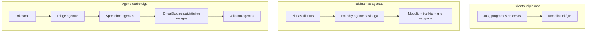
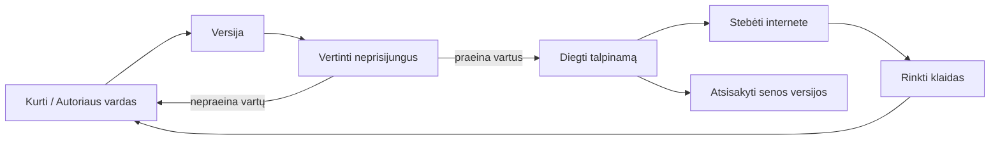
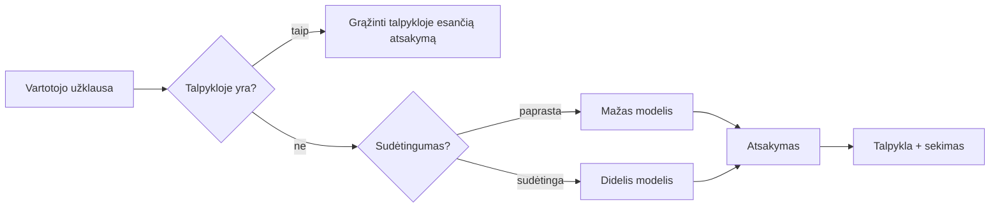
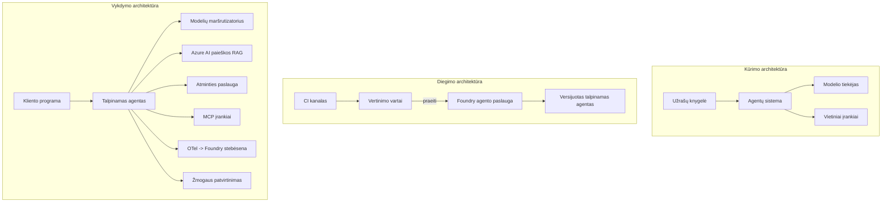

# Skalės agentų diegimas naudojant Microsoft Foundry


Iki šiol kurse jūs kūrėte agentus, kurie veikia jūsų nešiojamame kompiuteryje, užrašų knygelėje, veikiami `az login` ir kelių aplinkos kintamųjų. Tai tikrai tinkamas mokymosi būdas. Tačiau tai nėra tinkamas būdas paleisti agentą, nuo kurio 3 val. nakties priklauso tūkstančiai klientų.

Ši pamoka yra apie spragą tarp „tai veikia mano mašinoje“ ir „tai veikia patikimai ir nebrangiai gamyboje“. Mes užpildome šią spragą naudodami **Microsoft Foundry** ir **Microsoft Foundry Agent Service**, ir darome tai kurdami tikrą klientų aptarnavimo agentą su įrankiais, paieška, atmintimi, vertinimu ir stebėjimu.

## Įvadas

Ši pamoka apims:

- Skirtumą tarp **prototipinio agento** ir **įdiegto agento**, ir kodėl pereinamasis etapas dažniausiai yra viskas *apie* modelio aplinką.
- Agentų **diegimo modelius**: kliento talpinami, paslaugų talpinami (Hosted Agents) ir darbo eigos koordinuojami.
- **Agentų gyvavimo ciklą** Microsoft Foundry — kūrimas, versijavimas, diegimas, vertinimas, stebėjimas, nutraukimas.
- **Skalavimo strategijas**: modelio maršrutizavimas, talpinimas, konkurencija ir bevalstybinis dizainas.
- **Stebimumą** su OpenTelemetry ir Foundry sekimu.
- **Kainos optimizavimą** per modelio pasirinkimą, maršrutizavimą ir vertinimo vartus.
- **Įmonių aspektus**: valdymą, žmogaus patvirtinimą ir MCP serverių saugų paleidimą gamyboje.

## Mokymosi tikslai

Baigę šią pamoką jūs sužinosite, kaip:

- Pasirinkti tinkamą diegimo modelį konkrečiam agento apkrovos atvejui.
- Įdiegti agentą į Microsoft Foundry Agent Service, kad jis būtų versijuojamas, valdomas ir stebimas.
- Instrumentuoti agentą sekimui ir sujungti vertinimo grandinę, kuri veikia prieš kiekvieną leidimą.
- Taikyti modelio maršrutizavimą ir talpinimą, kad užtikrintumėte vėlavimo ir kainos kontrolę skalėje.
- Pridėti žmogaus patvirtinimo vartus didelės rizikos veiksmams ir integruoti MCP serverį saugiu būdu gamybos aplinkoje.

## Išankstiniai reikalavimai

Ši pamoka remiasi ankstesnėmis pamokomis ir tikisi, kad jūs esate susipažinę su:

- Agentų kūrimu su [Microsoft Agent Framework](../14-microsoft-agent-framework/README.md) (Pamoka 14).
- [Įrankių naudojimu](../04-tool-use/README.md) (Pamoka 4) ir [Agentic RAG](../05-agentic-rag/README.md) (Pamoka 5).
- [Agentų atmintimi](../13-agent-memory/README.md) (Pamoka 13) ir [Agentic protokolais / MCP](../11-agentic-protocols/README.md) (Pamoka 11).
- [Stebimu ir vertinimu](../10-ai-agents-production/README.md) (Pamoka 10) — ši pamoka tiesiogiai remiasi juo.

Taip pat jums reikės:

- **Azure prenumeratos** ir **Microsoft Foundry projekto** su bent vienu įdiegtu pokalbių modeliu.
- Autentifikuoto **Azure CLI** (`az login`).
- Python 3.12+ ir paketus, nurodytus saugykloje [`requirements.txt`](../../../requirements.txt).

## Nuo prototipo iki gamybos: kas iš tikrųjų keičiasi

Prototipinis agentas ir gamybinis agentas turi tą patį pagrindinį ciklą — mąstyti, kviesti įrankius, atsakyti. Kinta viskas, kas supa tą ciklą. Modelis sudaro galbūt 20% gamybinio agente; likę 80% yra veiklos karkasas.

| Sritis | Prototipas | Gamyba |
| --- | --- | --- |
| **Talpinimas** | Veikia jūsų užrašų knygelėje | Veikia kaip talpinama paslauga, versijuojama ir diegiama |
| **Tapatybė** | Jūsų `az login` žetonas | Valdoma tapatybė su ribotomis teisėmis (RBAC) |
| **Būsena** | Atmintyje, prarandama perkrovus | Išorinė (temos saugykla, atminties paslauga) |
| **Klaidos** | Matote klaidos seką | Bandymas iš naujo, atsarginiai veiksmai, dead-letter, įspėjimai |
| **Kaina** | „Tai keli centai“ | Stebima pagal užklausą, maršrutizuojama, talpinama, biudžetuojama |
| **Kokybė** | Apžvelgiate rezultatus | Automatiškai vertinama prieš kiekvieną leidimą |
| **Pasitikėjimas** | Patvirtinate kiekvieną veiksmą | Politika + žmogus cikle rizikingiems veiksmams |

Atminkite šią lentelę. Kiekviena žemiau esanti skyrius atitinka vieną iš šių eilučių.

## Agentų diegimo modeliai

Yra trys modeliai, kuriuos naudosite dažnai kartu.

### 1. Kliento talpinami agentai

Agentas egzistuoja *jūsų* programos procese. Jūsų kodas tiesiogiai kviečia modelio tiekėją; mąstymo ciklas veikia jūsų paslaugoje. Tai darė visos ankstesnės pamokos.

- **Naudokite, kai** reikia visiškos kontrolės apie ciklą, pasirinktinių tarpinės programos sprendimų arba įterpiate agentą į esamą backend'ą.
- **Kompromisas**: pats valdote skalavimą, būseną ir atsparumą.

### 2. Talpinami agentai (Foundry Agent Service)

Agentas *registruojamas kaip resursas* Microsoft Foundry. Foundry talpina mąstymo ciklą, saugo temas, taiko turinio saugumą ir RBAC, padaro agentą matomą Foundry portale. Jūsų programa tampa lieknu klientu, kuris kuria temas ir skaito atsakymus.

- **Naudokite, kai** norite patvarumo, integruoto stebėjimo, valdymo ir mažesnės operacinės apkrovos.
- **Kompromisas**: mažiau žemo lygio kontrolės mainais į valdomą vykdymo aplinką.

### 3. Agentų darbo eigos

Keletas agentų (ir įrankių) sudedami į grafą su aiškiu valdymo srautu — nuoseklios užduotys, šakos, žmogaus patvirtinimo mazgai ir patvarūs taškai, kurie gali stabdyti ir tęsti eigą. Tai yra Microsoft Agent Framework **Workflows** galimybė, pritaikyta didelio masto diegimui.

- **Naudokite, kai** viena užduotis apima keletą specializuotų agentų arba reikia patvirtinimo žingsnio viduryje.
- **Kompromisas**: daugiau komponentų; reikia orkestravimo lygmens stebimo.



## Agentų gyvavimo ciklas Microsoft Foundry

Agentų diegimas nėra vienkartinis `push`. Tai ciklas, kuris labai primena programinės įrangos leidimo ciklą, nes jis ir yra toks.



Pagrindinė idėja, perimta iš [10 pamokos](../10-ai-agents-production/README.md): **neprisijungus vertinimas yra vartai, o ne paskutinė mintis.** Nauja agento versija nebus išleista, jei neįveiks jūsų vertinimo ribų. Tada online stebėjimas grąžina realių klaidų duomenis į jūsų neprisijungus testų rinkinį. Tai yra visas ciklas.

## Skalavimo strategijos

Agentų skalavimas skiriasi nuo valstybinės interneto API skalavimo, nes kiekviena užklausa gali iššaukti kelis brangius modelio ir įrankių kvietimus. Keturi metodai atlieka didžiąją apkrovą.

**Bevalstybinių užklausų tvarkymas.** Neišsaugokite jokios vartotojo būsenos savo proceso atmintyje. Išsaugokite pokalbių temas Foundry temų saugykloje arba atminties paslaugoje, kad bet kuri instancija galėtų apdoroti bet kurią užklausą. Tai leidžia horizontaliai skalauti — pridėkite instancijų, nereikia „lipnių“ sesijų.

**Modelio maršrutizavimas.** Ne kiekviena užklausa reikalauja jūsų galingiausio (ir brangiausio) modelio. Nukreipkite paprastas užklausas — temos klasifikavimą, trumpus faktinius atsakymus — į mažą, greitą modelį, o didįjį modelį palikite tikrų svarstymų užklausoms. Foundry **Model Router** tai gali padaryti už jus, arba galite patys įgyvendinti lengvą klasifikatorių. Laboratorijoje sukursite savarankišką versiją.

**Atsakymų talpinimas.** Daugelis palaikymo užklausų yra beveik dublikatai („kaip atstatyti slaptažodį?“). Talpinkite dažnų klausimų atsakymus ir pateikite juos be modelio kvietimo. Net vidutinis talpinimo efektyvumas ženkliai sumažina sąnaudas ir vėlavimą.

**Konkurencija ir atgalinis slėgis.** Modelio tiekėjai turi srauto apribojimus. Apribokite konkurenciją, naudokite pakartotinius bandymus su eksponentiniu laukimu, ir gedimus tvarkykite gražiai (eilėje esantis „dirbame su tuo“ atsakymas geriau nei klaida 500).



## Stebimumas gamyboje

Negalite valdyti to, ko nematote. Kaip aptarta 10 pamokoje, Microsoft Agent Framework natūraliai siunčia **OpenTelemetry** sekos — kiekvienas modelio kvietimas, įrankio iškvietimas ir orkestravimo žingsnis tampa span'u. Gamyboje šiuos span'us eksportuojate į Microsoft Foundry (ar bet kurią OpenTelemetry suderinamą saugyklą), kad galėtumėte:

- Stebėti vienos kliento skundo pabaigos iki pabaigos kelionę per visus modelio ir įrankių kvietimus.
- Stebėti p50/p95 vėlavimus ir kainą už užklausą laikui bėgant.
- Įspėti apie klaidų dažnio šuolius ir kainos anomalijas anksčiau nei vartotojai (arba jūsų finansų komanda) juos pastebi.

```python
from agent_framework.observability import get_tracer

tracer = get_tracer()

with tracer.start_as_current_span("support_request") as span:
    span.set_attribute("customer.tier", "enterprise")
    span.set_attribute("routed.model", "gpt-5-nano")
    # agento vykdymas automatiškai sekamas šioje atkarpoje
```

Tokie atributai kaip `customer.tier` ir `routed.model` paverčia didžiulį sekų srautą į atsakomuosius klausimus („ar verslo klientai per dažnai nukreipiami į mažą modelį?“).

## Kainos optimizavimas

Gamybinių agentų kaina daugiausia priklauso nuo žetonų. Trys svertai, pagal poveikį:

1. **Tinkamai pasirinkite modelį.** Mažas modelis, kuris praeina jūsų vertinimo vartus, beveik visada yra pigesnis nei didelis, kuris taip pat praeina. Naudokite vertinimą, kad *įrodyti* mažo modelio pakankamumą, o ne atsargiai pasirinkite didžiausią modelį.
2. **Maršrutizuokite pagal sudėtingumą.** Kaip minėta — didelės kainos už didelį modelį mokėkite tik už užklausas, kurioms reikia to modelio svarstymų.
3. **Agresyviai talpinkite.** Pigiausias modelio kvietimas yra tas, kurio jūs niekada neatliekate.

Vertinimo vartai ir kainos kontrolė yra ta pati disciplina, žvelgiant iš dviejų kampų: vertinimas nustato *kokybės pagrindą*, maršrutizavimas ir talpinimas laikosi artimiausiai prie tos ribos *kainos*.

## Įmonių diegimo aspektai

**Valdymas.** Talpinami agentai paveldi Foundry RBAC, turinio saugą ir audito registravimą. Suteikite agentui valdomą tapatybę su mažiausiomis reikalingomis teisėmis — tik skaitymas iš žinių bazės, ribotas prieigos prie bilietų API, nieko daugiau.

**Žmogus cikle.** Kai kurie veiksmai yra per svarbūs automatizavimui — grąžinimų išdavimas, paskyros ištrynimas, teisinių klausimų eskalavimas. Microsoft Agent Framework palaiko **patvirtinimų reikalaujančius** įrankius: agentas siūlo veiksmą, vykdymas sustabdomas, žmogus patvirtina arba atmeta, o darbo eiga tęsiama. Tai matėte 6 pamokoje; čia tai įdiegiama.

**MCP gamyboje.** [MCP](../11-agentic-protocols/README.md) leidžia agentui naudoti išorinius įrankius per standartizuotą sąsają. Gamyboje kiekvieną MCP serverį laikykite nepatikima riba: fiksuokite serverio versiją, paleiskite su ribota tapatybe, tikrinkite jo rezultatus ir niekada neatskleiskite jam paslapčių. MCP serveris yra priklausomybė, o priklausomybės yra taisomos, auditavimosi ir ribojamos pagal srautą.



Šie trys diagramų — plėtros, diegimo, vykdymo — vaizduoja tą patį agentą trijuose gyvenimo etapuose. Tolimesnė laboratorija jus perves per jo kūrimą.

## Praktinė laboratorija: gamybos lygio klientų aptarnavimo agentas

Atidarykite [`code_samples/16-python-agent-framework.ipynb`](./code_samples/16-python-agent-framework.ipynb) ir atlikite visą užduotį. Sukursite **Contoso klientų aptarnavimo agentą** su visais gamybos aspektais:

1. **Įrankių kvietimas** — užsakymų patikra ir atvirų palaikymo bilietų paieška.
2. **RAG** — atsakymai į politikos klausimus iš žinių bazės (Azure AI Search, su atminties atsarginiu variantu, kad užrašų knygelė veiktų be Search resurso).
3. **Atmintis** — prisiminti klientą per pokalbio apykaitą.
4. **Modelio maršrutizavimas** — sudėtingumo klasifikatorius nukreipia užklausą į mažą arba didelį modelį.
5. **Atsakymų talpinimas** — pakartotiniai klausimai aptarnaujami iš talpyklos.
6. **Žmogaus patvirtinimas** — grąžinimai virš ribos laukiami žmogaus patvirtinimo.
7. **Vertinimo grandinė** — nedidelis neprisijungus testų rinkinys įvertina agentą ir veikia kaip leidimo vartai.
8. **Stebimumas** — OpenTelemetry sekimas aplink kiekvieną užklausą.

### Žingsnis po žingsnio

Užrašų knygelė organizuota taip, kad kiekvienas gamybos aspektas būtų atskira, paleidžiama dalis. Pagrindas yra maršrutizavimo ir talpinimo užklausų tvarkyklė:

```python
async def handle_support_request(query: str, customer_id: str) -> str:
    # 1. Tiekti iš talpyklos, kai galime.
    cached = response_cache.get(normalize(query))
    if cached:
        return cached

    # 2. Maršrutuoti pagal sudėtingumą, kad kontroliuotume sąnaudas.
    model = "gpt-5-nano" if is_simple(query) else "gpt-5-mini"

    # 3. Vykdyti agentą viduje trasos diapazono dėl stebėjimo galimybių.
    with tracer.start_as_current_span("support_request") as span:
        span.set_attribute("routed.model", model)
        span.set_attribute("customer.id", customer_id)
        response = await support_agent.run(query, model=model)

    # 4. Talpinti į talpyklą ir grąžinti.
    response_cache.set(normalize(query), response.text)
    return response.text
```

Leidimo vartai, saugantys leidimą, atrodo taip:

```python
async def evaluation_gate(agent, test_cases, threshold: float = 0.8) -> bool:
    passed = 0
    for case in test_cases:
        result = await agent.run(case["input"])
        if score_response(result.text, case["expected"]) >= 0.8:
            passed += 1
    pass_rate = passed / len(test_cases)
    print(f"Evaluation pass rate: {pass_rate:.0%} (gate: {threshold:.0%})")
    return pass_rate >= threshold  # diegti tik jei vartai praeina
```

Perskaitykite kiekvieną eilutę — užrašų knygelė laiko primityvus sąmoningai mažais, kad niekas nebūtų paslėpta už Framework kvietimo.

## Diegto agento tikrinimas su dūmų testais

Aukščiau minėti vertinimo vartai veikia *neprisijungus* jūsų agento objekte. Kai agentas įdiegtas kaip talpinamas agentas, jums reikalingas dar vienas, dar pigesnis patikrinimas: **ar įdiegtas galinis taškas tikrai atsako?**

„Sėkmingas“ diegimas tik įrodo, kad kontrolės sistema priėmė aprašą — tai nereiškia, kad agentas atsakys. Trūkstama priklausomybė, netinkamas modelio maršrutizavimas ar pasibaigusi jungtis gali palikti žalią diegimą, kuris nieko negrąžina. **Dūmų testas** užfiksuoja tai per kelias sekundes, kiekvieną kartą diegiant, be pilno vertinimo kainos.

Ši saugykla pateikia paruoštą naudoti dūmų testų grandinę, kuri sukurta naudojant [AI Smoke Test](https://github.com/marketplace/actions/ai-smoke-test) GitHub veiksmą:

- **Katalogas** — [`tests/lesson-16-smoke-tests.json`](../../../tests/lesson-16-smoke-tests.json) yra raginimai ir teiginiai Contoso palaikymo agentui (politiniai atsakymai, užsakymo paieška, laikymasis temos ir daugkartinio pokalbio tęstinumas). Kitų pamokų agentų katalogai yra kartu — žr. [`tests/README.md`](../tests/README.md).
- **Darbo eiga** — [`.github/workflows/smoke-test.yml`](../../../.github/workflows/smoke-test.yml) autentifikuojasi su Azure OIDC ir POST siunčia kiekvieną raginimą į agento Responses endpoint'ą, nutraukiant užduotį kiekvienu teiginio nesėkmingumu.

```yaml
- name: Smoke-test hosted agent
  uses: JFolberth/ai-smoketest@v1
  with:
    project_endpoint: ${{ inputs.project_endpoint }}
    agent_name: ContosoSupportAgent
    tests_file: tests/lesson-16-smoke-tests.json
```


Vykdykite tai iš **Actions** skilties, kai jūsų agentas bus išleistas, pateikdami Foundry projekto pabaigos tašką ir agento pavadinimą. Federuota tapatybė turi turėti **Azure AI User** rolę Foundry projekto aprėptyje. Galvokite apie sluoksnius kaip apie piramidę: dūmų testai (ar pasiekiamas ir atsako?) vykdomi kiekvieno diegimo metu, neprisijungus vykdoma vertinimo dalis (ar pakankamai gera, kad būtų išleista?) vykdoma prieš kilimą, o prisijungus vykdoma vertinimo dalis (kaip agentas dirba realiame pasaulyje?) vykdoma nuolat.

## Žinių patikrinimas

Patikrinkite savo supratimą prieš pradėdami užduotį.

**1. Maždaug kiek gamybos agento sudaro „modelis“, o koks yra likusios dalies vaidmuo?**

<details>
<summary>Atsakymas</summary>

Modelis yra nedidelė sistemos dalis – dažnai nurodoma apie 20%. Likusi dalis yra operacinis karkasas: talpinimas ir versijavimas, tapatybė ir RBAC, išorinė būsena, gedimų valdymas, išlaidų sekimas, vertinimas ir žmogaus įsikišimo valdikliai. Pereiti į gamybą dažniausiai reiškia sukurti viską *aplink* loginį ciklą.
</details>

**2. Kada rinktumėtės Talpinamą Agentą vietoje kliento talpinamo agento?**

<details>
<summary>Atsakymas</summary>

Kai norite valdomos vykdymo terpės su integruotu patvarumu (gijos, kurios išlieka ir gali tęsti darbą), stebimumu, turinio saugumu ir RBAC, ir esate pasirengę aukoti dalį žemo lygio valdymo loginio ciklo naudodami mažesnę operacinę sritį. Kliento talpinimas yra pageidautinas, kai reikia visiškos kontrolės cikle arba kai agentas integruojamas į esamą backendą.
</details>

**3. Kodėl mastelio keičiamas agentas turi būti be būsenos savo proceso atmintyje?**

<details>
<summary>Atsakymas</summary>

Kad bet kuris egzempliorius galėtų apdoroti bet kokį užklausą, o tai leidžia horizontaliai skalauti be prilipimų prie sesijų. Vartotojo pokalbio būsena yra išorinė – saugoma gijų saugykloje arba atminties paslaugoje. Jei būsena gyventų proceso atmintyje, ją prarastumėte perkrovus ir negalėtumėte laisvai paskirstyti apkrovos.
</details>

**4. Kokią problemą sprendžia modelio maršrutizavimas ir kaip jis susijęs su vertinimu?**

<details>
<summary>Atsakymas</summary>

Maršrutizavimas siunčia paprastas užklausas mažam, pigiam ir greitam modeliui, o didelį modelį naudoja tik tikram sprendimui, kontroliuodamas tiek delsą, tiek išlaidas. Tai susiję su vertinimu, nes vertinimas *įrodo*, kad mažas modelis yra pakankamai geras tam tikrai užklausų kategorijai – maršrutizavimas be vertinimo yra spėjimas.
</details>

**5. Kas yra „vertinimo vartai“ ir kur jie patenka gyvenimo cikle?**

<details>
<summary>Atsakymas</summary>

Vertinimo vartai paleidžia neprisijungus testų rinkinį naujai agento versijai ir neleidžia diegti, jei nepraeina nustatytas slenkstis. Jie yra tarp „versijos“ ir „diegimo“ gyvenimo cikle, užtikrindami kokybę kaip reikalavimą išleidimui, o ne tik patikrinimą po išleidimo.
</details>

**6. Kodėl MCP serveris gamybos aplinkoje turi būti laikomas nepatikima riba?**

<details>
<summary>Atsakymas</summary>

Nes tai yra išorinė priklausomybė, į kurią jūsų agentas turi kreiptis. Reikia užfiksuoti jo versiją, paleisti su ribota tapatybe, tikrinti rezultatus, riboti užklausų srautą ir niekada nesidalinti slaptomis informacija – tas pats drausmės lygis, kaip ir su bet kuria trečiosios šalies priklausomybe. Jo rezultatai patenka į agento loginį ciklą, todėl nepatikrintas pasitikėjimas yra saugumo rizika.
</details>

**7. Koks paprastai yra didžiausias vienas pakeitimas, darantis didžiausią poveikį gamybos agento kaštams ir kodėl?**

<details>
<summary>Atsakymas</summary>

Tinkamo dydžio modelio parinkimas – naudoti mažiausią modelį, kuris vis dar praeina vertinimo vartus. Išlaidas daugiausia lemia žetonai, ir mažesnis modelis, atitinkantis kokybės reikalavimą, beveik visuomet yra pigesnis už didesnį. Talpykla ir maršrutizavimas dar labiau mažina kaštus, bet tinkamas pagrindinis modelis turi didžiausią tiesioginį poveikį.
</details>

**8. Kokį vaidmenį turi span atributai kaip `customer.tier` ir `routed.model` stebimumui?**

<details>
<summary>Atsakymas</summary>

Jie paverčia žalius pėdsakus į atsakytinus verslo klausimus. Be atributų turite tik daugybę spanų; su jais galite klausti „ar įmonių klientai per dažnai nukreipiami į mažą modelį?“ arba „kuris modelis tvarko lėčiausias užklausas?“ Atributai leidžia skaidyti telemetriją pagal jūsų veiklą svarbias dimensijas.
</details>

## Užduotis

Paimkite kliento aptarnavimo agentą iš laboratorijos ir sustiprinkite jį konkrečiam scenarijui: **abonemento sąskaitų aptarnavimo agentas SaaS įmonei.**

Jūsų pateikimas turi:

1. **Pakeisti įrankius** į sąskaitų aptarnavimui svarbius: `get_subscription_status`, `get_invoice` ir `issue_credit` (kreditai virš 50 $ reikalauja žmogaus patvirtinimo).
2. **Pridėti tris RAG dokumentus**, apimančius įmonės pinigų grąžinimo politiką, sąskaitų ciklą ir nutraukimo politiką.
3. **Išplėsti vertinimo rinkinį** iki mažiausiai aštuonių atvejų, įskaitant bent du, kurie *turėtų* sukelti žmogaus patvirtinimo kelią, ir patvirtinti, kad vertinimo vartai teisingai praleidžia arba neleidžia.
4. **Pridėti vieną kaštų ataskaitą**: po dešimties mišrių užklausų per agentą, parodyti, kiek jų nukeliavo į mažą modelį, kiek į didelį ir kiek buvo tiekiama iš talpyklos.

Parašykite trumpą pastraipą (markdown lange) paaiškinančią, kokią modelio maršrutizavimo taisyklę pasirinkote ir kaip ją patikrintumėte su tikra srautu. Nėra vieno taisyklingo atsakymo – vertinama, ar gamybos aspektai yra logiškai susieti.

## Apibendrinimas

Šiame pamokoje perkeliate agentą iš prototipo į gamybą su Microsoft Foundry:

- Pereinant į gamybą daugiausia svarbus **operacinis karkasas** aplink modelį – talpinimas, tapatybė, būsena, gedimų valdymas, išlaidos, kokybė ir pasitikėjimas.
- Išmokote tris **diegimo modelius** – kliento talpinami, Talpinami Agentai ir Agentų Darbo Srautiniai – ir kada kiekvienas tinka.
- Ištyrėte **agento gyvenimo ciklą**, kur neprisijungus atliekamas **vertinimas kaip leidimo vartai**, o prisijungus stebimumas grąžina gedimus į testų rinkinį.
- Pritaikėte **skalavimo strategijas** – bevalstę konstrukciją, modelio maršrutizavimą, talpyklą ir ribotą lygiagrečių užduočių vykdymą – ir susiejote jas su **išlaidų optimizavimu**.
- Įdiegėte **įmonės valdiklius**: RBAC, žmogaus įsikišimą patvirtinimui ir saugią MCP integraciją gamyboje.
- Sukūrėte **gamybai parengtą kliento aptarnavimo agentą**, kuris integruoja visus šiuos aspektus veikiantį kode.

Kita pamoka eina priešinga kryptimi: vietoje agentų skalavimo į debesį, juos atnešite *žemyn* ant vieno kūrėjo kompiuterio ir paleisite visiškai lokaliai.

## Papildomi ištekliai

- <a href="https://learn.microsoft.com/azure/ai-foundry/what-is-azure-ai-foundry" target="_blank">Microsoft Foundry dokumentacija</a>
- <a href="https://learn.microsoft.com/azure/ai-foundry/agents/overview" target="_blank">Microsoft Foundry Agent Service apžvalga</a>
- <a href="https://learn.microsoft.com/en-us/agent-framework/overview/?wt.mc_id=youtube_26688_organicsocial_reactor&pivots=programming-language-python" target="_blank">Microsoft Agent Framework</a>
- <a href="https://learn.microsoft.com/azure/ai-foundry/concepts/model-router" target="_blank">Modelio maršrutizatorius Microsoft Foundry</a>
- <a href="https://learn.microsoft.com/azure/search/search-what-is-azure-search" target="_blank">Azure AI Search</a>
- <a href="https://opentelemetry.io/" target="_blank">OpenTelemetry</a>
- <a href="https://github.com/marketplace/actions/ai-smoke-test" target="_blank">AI Smoke Test GitHub veiksmas</a>
- <a href="https://modelcontextprotocol.io/" target="_blank">Model Context Protocol (MCP)</a>

## Ankstesnė pamoka

[Kompiuterinių naudojimo agentų (CUA) kūrimas](../15-browser-use/README.md)

## Kita pamoka

[Vietinių AI agentų kūrimas](../17-creating-local-ai-agents/README.md)

---

<!-- CO-OP TRANSLATOR DISCLAIMER START -->
**Atsakomybės apribojimas**:
Šis dokumentas buvo išverstas naudojant dirbtinio intelekto vertimo paslaugą [Co-op Translator](https://github.com/Azure/co-op-translator). Nors siekiame tikslumo, prašome atkreipti dėmesį, kad automatiniai vertimai gali turėti klaidų ar netikslumų. Originalus dokumentas jo gimtąja kalba laikomas autoritetingu šaltiniu. Svarbiai informacijai rekomenduojama naudoti profesionalų žmogiškąjį vertimą. Mes neatsakome už jokius nesusipratimus ar neteisingą interpretaciją, kilusią naudojantis šiuo vertimu.
<!-- CO-OP TRANSLATOR DISCLAIMER END -->