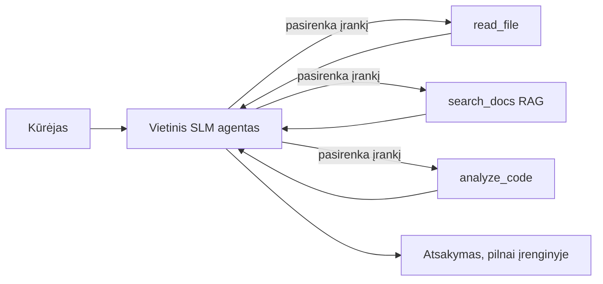
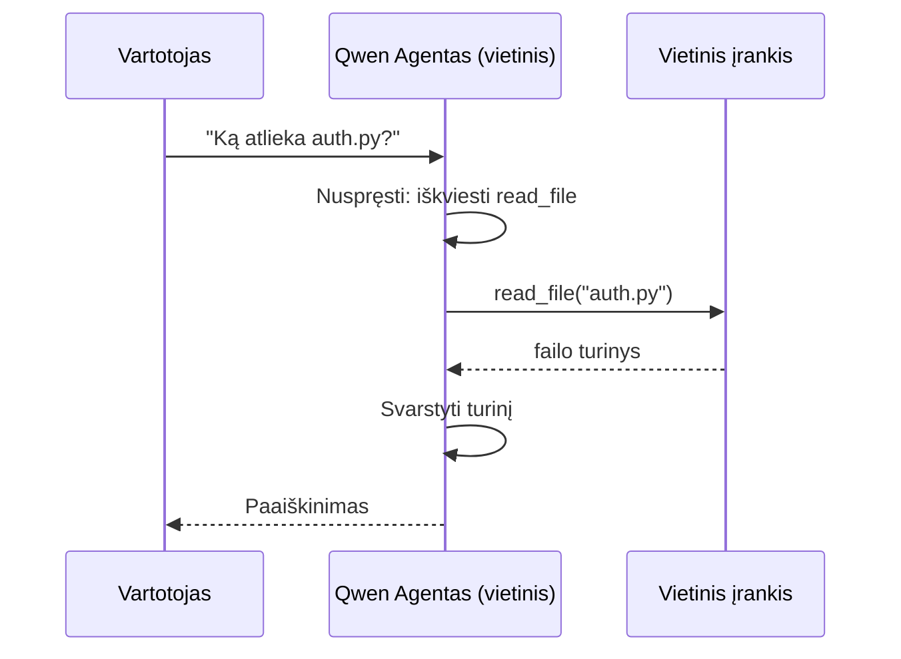
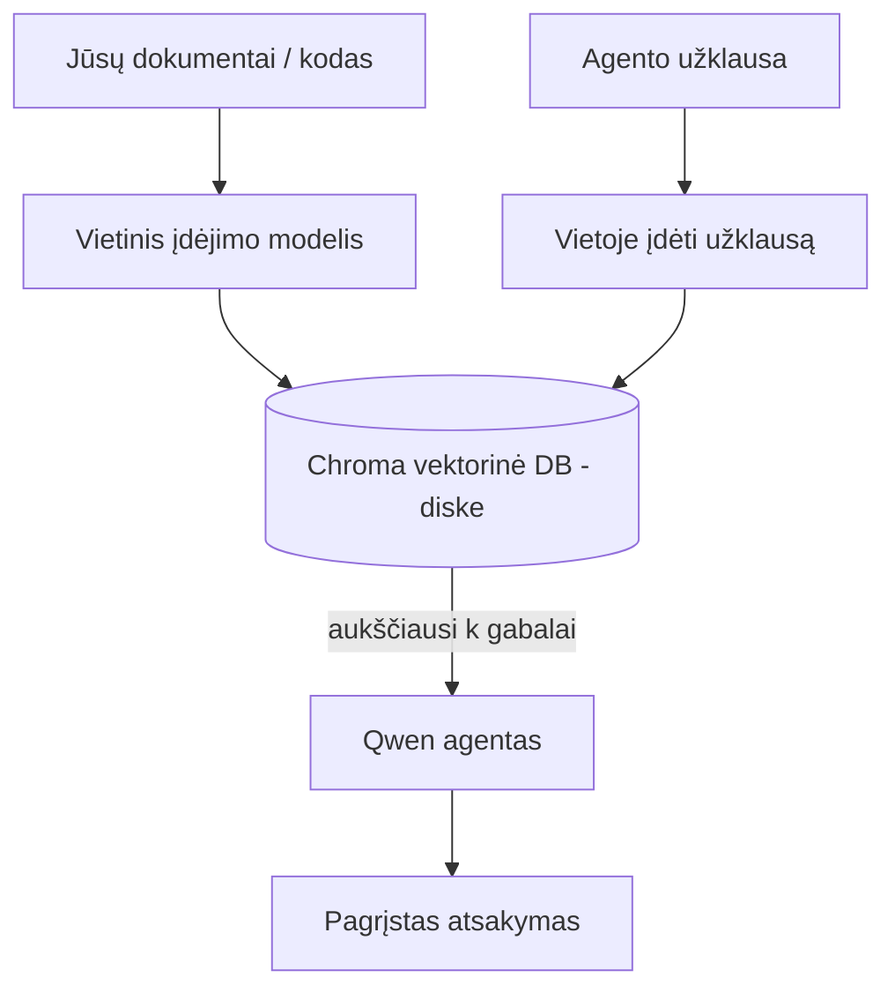
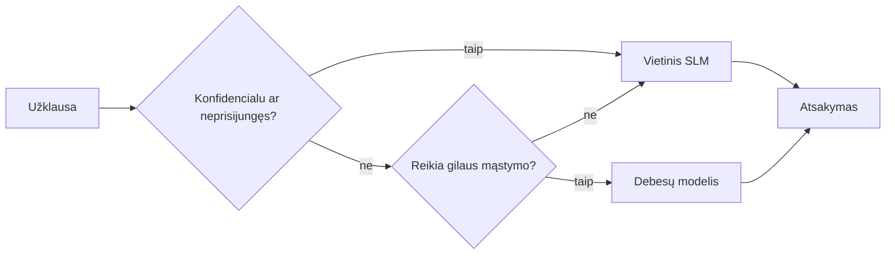

# Vietinių AI agentų kūrimas naudojant Microsoft Foundry Local ir Qwen


Ankstesnėje pamokoje agentai buvo perkeliami *į debesį*. Šioje jie perkeliami *į vieną kompiuterį*. Pamokos pabaigoje turėsite veikiančią inžinerijos asistentę, kuri mąsto, iškviečia įrankius, skaito jūsų failus ir ieško jūsų dokumentacijoje — **be jokio skambučio į debesies inferenciją.**

Kodėl to norėtumėte? Trys priežastys, kurios nuolat kyla realiame inžineriniame darbe:

- **Privatumas.** Kodeksas ir dokumentai niekada neišeina iš mašinos. Nė vienas užklausimas, ištrauka ar kliento duomenys neperžengia tinklo ribos.
- **Kaina.** Vietinė inferencija neturi mokesčio už žodį. Galite tobulinti visą dieną už elektros kainą.
- **Veikimas be ryšio.** Lėktuve, saugioje patalpoje ar gedimo metu agentas vis tiek veikia.

Svarbiausia yra tai, kad jūs keičiate pažangų debesies modelį į **Mažą Kalbos Modelį (SLM)**, veikiančią jūsų CPU, GPU arba NPU. Ši pamoka yra apie agentų kūrimą, kurie yra *geri* pagal šį apribojimą, o ne apie apsimetimą, kad apribojimo nėra.

## Įvadas

Šioje pamokoje aptarsime:

- **Maži kalbos modeliai (SLM)** — kas jie yra, kur yra jų stipriosios pusės ir kur ne.
- **Microsoft Foundry Local** — vykdymo aplinka, kuri atsisiunčia ir aptarnauja modelius įrenginyje per **OpenAI suderinamą API**.
- **Qwen funkcijų iškvietimų modeliai** — SLM, kurie patikimai generuoja įrankių kvietimus, kurie leidžia turėti vietinius *agentus* (ne tik vietinį pokalbį).
- **Vietiniai įrankiai, vietinė RAG ir vietinis MCP** — suteikia agentui galimybes be debesies.
- **Hibridiniai modeliai** — kada laikyti vietoje, o kada kreiptis į debesį.

## Mokymosi tikslai

Užbaigus šią pamoką, jūs žinosite, kaip:

- Paaiškinti SLM trūkumus ir pritaikyti vietinių agentų naudojimo atvejus.
- Vietoje aptarnauti Qwen modelį Foundry Local pagalba ir naudotis OpenAI suderinamu endpoint'u.
- Sukurti visai darbo vietai veikiančią įrankių kvietimų agentę.
- Pridėti vietinę RAG per savo dokumentus naudojant vietinę vektorinę duomenų bazę (Chroma).
- Sujungti agentą su vietiniu MCP serveriu ir svarstyti apie hibridinius vietinius/debesies sprendimus.

## Reikalingos žinios

Ši pamoka prielaida, kad esate įvaldę ankstesnes pamokas ir mokate:

- [Įrankių naudojimą](../04-tool-use/README.md) (pamoka 4) ir [Agentinę RAG](../05-agentic-rag/README.md) (pamoka 5).
- [Agentines protokolus / MCP](../11-agentic-protocols/README.md) (pamoka 11).
- [Microsoft agentų sistemą](../14-microsoft-agent-framework/README.md) (pamoka 14).

Jums taip pat reikės:

- Vystymo darbo vietos. **8 GB RAM yra realus minimumas**; 16 GB ar daugiau yra patogu. GPU arba NPU naudingas, bet nebūtinas.
- Įdiegto **Microsoft Foundry Local** (žr. diegimo skyrių žemiau).
- Python 3.12+ ir paketų iš `requirements.txt` šiame repozitorijoje, taip pat `foundry-local-sdk`, `openai` ir `chromadb` šiai pamokai.

## Maži kalbos modeliai: tinkamas įrankis vietiniam darbui

Pažangus debesies modelis turi šimtus milijardų parametrų ir už jo stovi duomenų centras. Mažas kalbos modelis turi keletą milijardų parametrų ir turi tilpti jūsų nešiojamojo kompiuterio atmintyje. Šis skirtumas nustato aiškius lūkesčius.

**SLM gerai sugeba:**

- Struktūrizuotus, ribotus uždavinius — klasifikavimą, išgavimą, santraukas žinomame dokumente.
- **Įrankių kvietimą** — sprendimą, kurią funkciją iškviesti ir kokiais argumentais.
- Greitą, pigų, privačią iteraciją su savo duomenimis.

**SLM blogiau sugeba:**

- Atvirus, daugybinius sprendimus per didelį kontekstą.
- Pasaulinę žinių apimtį (matė mažiau ir daugiau pamiršta).

Sėkminga vietinių agentų strategija yra: **leiskite SLM orkestruoti, o įrankiams atlikti sunkų darbą.** Modeliui nereikia *žinoti* jūsų kodo bazės — reikia žinoti, kada iškviesti `read_file` ir `search_docs`. Tai tiesiogiai atitinka SLM stipriąsias puses.



## Microsoft Foundry Local

**Microsoft Foundry Local** yra lengvas vykdymo variklis, kuris atsisiunčia, valdo ir aptarnauja modelius visiškai jūsų mašinoje. Svarbiausia mums savybė yra ta, kad jis atveria **OpenAI suderinamą HTTP endpoint'ą** — tai reiškia, kad OpenAI SDK ir Microsoft Agent Framework OpenAI klientas veikia tiesiog pakeitus `base_url`. Viskas, ką išmokote apie agentų kūrimą, išlieka nepakitę; tik endpoint'as perkeltas iš debesies į `localhost`.

Foundry Local taip pat automatiškai parenka geriausią modelio versiją jūsų aparatinei įrangai — CPU versiją, CUDA/GPU versiją ar NPU versiją — tad nereikia optimizuoti rankiniu būdu kiekvienai mašinai.

### Diegimas

Įdiekite Foundry Local (žr. [dokumentaciją](https://learn.microsoft.com/azure/ai-foundry/foundry-local/) jūsų OS), tada patikrinkite, ar veikia:

```bash
# Įdiekite (pavyzdžiui; vadovaukitės savo platformos dokumentacija)
winget install Microsoft.FoundryLocal      # Windows
# brew install microsoft/foundrylocal/foundrylocal   # macOS

# Atsisiųskite ir paleiskite Qwen modelį, tada pradėkite vietinę paslaugą
foundry model run qwen2.5-7b-instruct
foundry service status
```

Kai paslauga veikia, turite vietinį OpenAI suderinamą endpoint'ą (dažniausiai `http://localhost:PORT/v1`). Užrašų knyga naudoja `foundry-local-sdk`, kad automatiškai surastų endpoint'ą, tad jums nereikia rankiniu būdu nurodyti prievado.

## Qwen funkcijų kvietimas: kodėl tai svarbu

Agentas yra tik agentas, jei gali iškviesti įrankius. Daugelis SLM gali bendrauti, bet sukuria nepatikimus, netaisyklingus įrankių kvietimus. **Qwen** modeliai mokyti iškviesti funkcijas ir nuosekliai generuoja gerai suformuotus įrankių kvietimus — tik tai paverčia vietinį pokalbių modelį vietiniu *agentu*.

Srautas yra standartinis įrankių kvietimo ciklas, kurį jau pažįstate, tik vykdomas įrenginyje:



## Vietinė RAG

Dokumentų paieška yra vietinių agentų naudos pagrindas. Užuot tikėjęsi, kad SLM įsiminė jūsų sistemos dokumentus, jūs įkeliat tuos dokumentus į **vietinę vektorinę duomenų bazę** ir leidžiate agentui pagal poreikį gauti atitinkamas dalis.

Naudojame **Chromą**, įterptą vektorinį saugyklą, veikiančią vietoje be jokio serverio administravimo. Srautas yra visiškai vietinis: vietinis embedavimo modelis → vietiniai vektoriai → vietinė paieška → vietinis SLM.



Tai tas pats Agentic RAG šablonas iš 5 pamokos — vienintelis skirtumas, kad kiekviena dalis veikia jūsų mašinoje.

## Vietiniai MCP serveriai

[MCP](../11-agentic-protocols/README.md) yra transportas, ne debesijos paslauga. MCP serverį galite paleisti vietiniu procesu per `stdio`, atverdami įrankius agentui per standartinį protokolą. Tai leidžia pakartotinai naudoti auginančią MCP serverių ekosistemą — failų sistemos prieigą, git operacijas, duomenų bazių užklausas — visiškai neprisijungus.

Saugumo požiūris skiriasi nuo debesies, bet nėra neegzistuojantis: vietinis MCP serveris veikia su jūsų vartotojo leidimais, todėl apribokite, ką jis gali pasiekti (projekto katalogą, ne visą namų aplanką) ir vertinkite jo išvestis kaip įėjimus, kuriuos reikia patikrinti.

## Hibridiniai debesies ir vietiniai modeliai

Vietinis pirmumas nereiškia vien vietiniai veiksmai. Brandžios sistemos nukreipia užklausas pagal jautrumą ir sudėtingumą:

| Situacija | Kur vykdoma |
| --- | --- |
| Jautrus kodas / duomenys arba neveikia tinklas | **Vietinis SLM** |
| Paprastas, ribotas uždavinys | **Vietinis SLM** (pigu, greita) |
| Sunkus daugiapakopis loginis sprendimas su nejautriais duomenimis | **Debesies modelis** |
| Viskas, gedimo metu | **Vietinis SLM** (sklandus taisymas) |

Tai atspindi **modelių nukreipimo** idėją iš 16 pamokos — tik vienas iš "modelių" dabar yra jūsų mašina. Tvirtas dizainas krinta atgal į vietinį sprendimą, kai debesies nėra, tad agentas blogėja kokybe, bet visiškai nesugenda.



## Praktinė laboratorija: vietinis inžinerijos asistentas

Atidarykite [`code_samples/17-local-agent-foundry-local.ipynb`](./code_samples/17-local-agent-foundry-local.ipynb) ir prašykite jį. Kūrsite **vietinį inžinerijos asistentą**, kuris veikia visai jūsų darbo vietai ir gali:

1. **Iškviesti įrankius** — per Qwen funkcijų kvietimą per Foundry Local.
2. **Atlikti vietinius failų veiksmus** — rodyti ir skaityti failus projekto kataloge.
3. **Analizuoti kodą** — pateikti pagrindinę metriką apie šaltinio failą.
4. **Ieškoti dokumentacijoje** — vietinė RAG dokumentų katalogui su Chroma.
5. **Naudoti MCP** — jungtis prie vietinio MCP serverio (su sklandžiu praleidimu, jei nėra konfigūruotas).

Jokios debesies inferencijos nėra naudojama.

### Išsamiai

Asistentė jungiasi prie Foundry Local per OpenAI suderinamą endpoint'ą, todėl agento kodas atrodo beveik identiškas kaip debesies pamokose — tik klientas pasikeičia:

```python
from foundry_local import FoundryLocalManager
from openai import OpenAI

# Foundry Local aptinka/parsisiunčia modelį ir suteikia mums vietinį galinį tašką.
manager = FoundryLocalManager(\"qwen2.5-7b-instruct\")
client = OpenAI(base_url=manager.endpoint, api_key=manager.api_key)  # api_key yra vietinis vietos laikiklis
```

Įrankiai yra įprastos Python funkcijos, apribotos projekto katalogu:

```python
def read_file(path: str) -> str:
    \"\"\"Read a file, but only inside the sandboxed project directory.\"\"\"
    full = (PROJECT_ROOT / path).resolve()
    if PROJECT_ROOT not in full.parents and full != PROJECT_ROOT:
        return \"Access denied: path is outside the project directory.\"
    return full.read_text(encoding=\"utf-8\")
```

Atkreipkite dėmesį į smėlio dėžės patikrą — net vietoje įrankis, skaitantis bet kokius kelius, yra rizika. Užrašų knyga kiekvieną įrankį riboja iki vieno projekto šaknies katalogo.

## Žinių patikrinimas

Ištestuokite savo supratimą prieš pereidami prie užduoties.

**1. Pateikite dvi konkrečias priežastis, kodėl verta vykdyti agentą vietoje, o ne debesyje.**

<details>
<summary>Atsakymas</summary>

Bet kurios dvi iš: **privatumas** (kodeksas ir duomenys niekada neišeina iš mašinos), **kaina** (nėra mokesčio už žodį inferencijoje), ir **galimybė veikti be ryšio** (darbas be tinklo — lėktuve, saugioje patalpoje ar gedimo metu). Privatumo priežastis dažnai lemia reguliavimo / atitikties apribojimai, draudžiantys siųsti duomenis iš įrenginio.
</details>

**2. Koks yra rekomenduojamas darbo pasidalijimas tarp SLM ir jo įrankių vietiniame agente ir kodėl?**

<details>
<summary>Atsakymas</summary>

Leiskite SLM **orkestruoti** (nuspręsti, kurį įrankį iškviesti ir su kokiais argumentais) ir leiskite **įrankiams atlikti sunkų darbą** (skaityti failus, gauti dokumentus, skaičiuoti rezultatus). SLM stiprūs ribotų sprendimų priėmime, kaip įrankių pasirinkimas, bet silpnesni platesniam žinių spektrui ir ilgai daugiapakopinei logikai, todėl pasikliauti įrankiais atitinka jų stipriąsias puses.
</details>

**3. Kas leidžia pakartotinai naudoti debesies agentų kodą su Foundry Local?**

<details>
<summary>Atsakymas</summary>

Foundry Local atveria **OpenAI suderinamą HTTP endpoint'ą**. OpenAI SDK ir Agentų sistemos OpenAI klientas veikia prieš jį pakeitus tik `base_url` (ir naudodami vietinį API rakto šabloną). Viskas kitas kode lieka nepakitę.
</details>

**4. Kodėl būtent naudojame Qwen funkcijų kvietimų modelį, o ne bet kurį SLM?**

<details>
<summary>Atsakymas</summary>

Nes agentas turi generuoti patikimus, gerai suformuotus **įrankių kvietimus**. Daugelis SLM gali kalbėti, bet generuoja netaisyklingas ar nekonsistentiškas įrankių kvietimo struktūras. Qwen modeliai yra apmokyti funkcijų kvietimams ir stabiliai generuoja įrankių kvietimus, tai ir paverčia vietinį pokalbių modelį veikiančiu vietiniu agentu.
</details>

**5. Kuriuose kompiuterio komponentuose vyksta vietinė RAG pipeline?**

<details>
<summary>Atsakymas</summary>

Visi: embedavimo modelis, vektorinė duomenų bazė (Chroma diske), paieškos etapas ir SLM. Dokumentai yra embeduojami vietoje, saugomi vietoje, randami vietoje ir apdorojami vietine modelio — nė viena dalis nekontaktuoja su debesimi.
</details>

**6. Vietinis MCP serveris veikia jūsų mašinoje. Ar tai automatiškai reiškia, kad jis saugus? Kokias atsargumo priemones turite vis dar taikyti?**

<details>
<summary>Atsakymas</summary>

Ne. Vietinis MCP serveris veikia su jūsų vartotojo leidimais, tad gali pasiekti viską, ką galite jūs. Apribokite jį iki reikalingų sričių (pvz., konkretaus projekto katalogo, o ne viso namų aplanko) ir vertinkite jo rezultatus kaip įėjimus, kuriuos reikia patikrinti prieš imantis veiksmų.
</details>

**7. Apibūdinkite prasmingą hibridinį nukreipimo taisyklę, į kurią įtrauktas vietinis modelis.**

<details>
<summary>Atsakymas</summary>

Nukreipkite jautrias arba neprisijungus užklausas į vietinį SLM; paprastus ribotus uždavinius į vietinį SLM dėl greičio ir kainos; sudėtingą daugiapakopį loginį sprendimą su nejautriais duomenimis į debesies modelį; o jei debesies nėra, grįžkite į vietinį SLM, kad agentas blogėtų sklandžiai, o ne sugestų. Tai yra modelių nukreipimas (16 pamoka) su vietine mašina kaip vienu iš modelių.
</details>

**8. Kokia reali RAM minimumo reikšmė vietiniam agentui šioje pamokoje ir ką suteikia daugiau RAM?**

<details>
<summary>Atsakymas</summary>

Apie **8 GB** yra realus minimumas; 16 GB ir daugiau yra patogu. Daugiau RAM leidžia paleisti didesnius, galingesnius modelius ir laikyti daugiau konteksto atmintyje. GPU arba NPU pagreitina inferenciją, bet nėra būtini — Foundry Local pasirenka CPU versiją, jei nėra pagreičių.
</details>

## Užduotis

Išplėskite vietinį inžinerijos asistentą į **vietinį dokumentacijos peržiūros įrankį** mažam pasirinktiniam projektui (jei norite, naudokite vieną iš šio repozitorijos pamokų katalogų).

Jūsų pateikimas turėtų:

1. **Indeksuoti tikrą dokumentų/kodo katalogą** Chroma (bent penki failai).
2. **Pridėti `find_todos` įrankį** kuris suranda projekte komentarus `TODO`/`FIXME` ir pateikia juos su failu ir eilutės numeriu — išlaikant tą pačią smėlio dėžės patikrą kaip ir `read_file`.

3. **Užduokite agentui tris klausimus**, kurie priverstų jį derinti įrankius: vieną grynai RAG klausimą, vieną reikalaujantį perskaityti konkretų failą, ir vieną reikalaujantį rasti TODO.
4. **Išmatuokite**: užfiksuokite kiekvieno iš trijų atsakymų laiką ir užrašykite tai markdown langelyje. Pakomentuokite, ar vėlavimas yra priimtinas jūsų numatytam darbo srautui.

Tada parašykite trumpą pastraipą apie **ką perkelti į debesis ir ką palikti vietoje** šiam vertintojui, ir kodėl. Vertinama, ar vietinės komponentės yra teisingai sujungtos ir ar jūsų hibridinis samprotavimas yra pagrįstas — o ne modelio kokybė.

## Santrauka

Šioje pamokoje sukūrėte agentą, kuris veikia visiškai jūsų pačių mašinoje:

- **SLM** keičia apimtį į naudą dėl privatumo, sąnaudų ir veiksnumo neprisijungus — ir puikiai pasirodo, kai jie **orkestruoja įrankius**, o ne patys saugo visą žinių bazę.
- **Foundry Local** tarnauja modelius įrenginyje per **OpenAI suderinamą galinį tašką**, todėl jūsų debesų agento kodas pereina su vienos eilutės pakeitimu.
- **Qwen funkcijų kvietimo modeliai** leidžia patikimai vietoje kviesti įrankius — o taip pat ir vietinius *agentus*.
- **Vietinis RAG** (Chroma) ir **vietinis MCP** suteikia agentui galimybių nepradėjus atsiversti mašinos.
- **Hibridiniai modeliai** leidžia maršrutuoti pagal jautrumą ir sudėtingumą, o vietinis veikia kaip elegantiškas atsarginis variantas.

Tai užbaigia diegimo ciklą: 16-oji pamoka pakėlė agentus į Microsoft Foundry, o ši pamoka sumažino juos iki vieno darbo stoties. Kita pamoka skirta diegimo agentų saugumui.

## Papildomi ištekliai

- <a href="https://learn.microsoft.com/azure/ai-foundry/foundry-local/" target="_blank">Microsoft Foundry Local dokumentacija</a>
- <a href="https://learn.microsoft.com/azure/ai-foundry/what-is-azure-ai-foundry" target="_blank">Microsoft Foundry dokumentacija</a>
- <a href="https://learn.microsoft.com/en-us/agent-framework/overview/?wt.mc_id=youtube_26688_organicsocial_reactor&pivots=programming-language-python" target="_blank">Microsoft Agent Framework</a>
- <a href="https://qwen.readthedocs.io/en/latest/framework/function_call.html" target="_blank">Qwen funkcijų kvietimo dokumentacija</a>
- <a href="https://modelcontextprotocol.io/" target="_blank">Model Context Protocol (MCP)</a>
- <a href="https://docs.trychroma.com/" target="_blank">Chroma vektorinė duomenų bazė</a>

## Ankstesnė pamoka

[Diegiami mastelį keičiančių agentų](../16-deploying-scalable-agents/README.md)

## Kita pamoka

[Saugūs DI agentai](../18-securing-ai-agents/README.md)

---

<!-- CO-OP TRANSLATOR DISCLAIMER START -->
**Atsakomybės apribojimas**:
Šis dokumentas buvo išverstas naudojant dirbtinio intelekto vertimo paslaugą [Co-op Translator](https://github.com/Azure/co-op-translator). Nors siekiame tikslumo, prašome atkreipti dėmesį, kad automatiniai vertimai gali turėti klaidų ar netikslumų. Originalus dokumentas jo gimtąja kalba laikomas autoritetingu šaltiniu. Svarbiai informacijai rekomenduojama naudoti profesionalų žmogiškąjį vertimą. Mes neatsakome už jokius nesusipratimus ar neteisingą interpretaciją, kilusią naudojantis šiuo vertimu.
<!-- CO-OP TRANSLATOR DISCLAIMER END -->