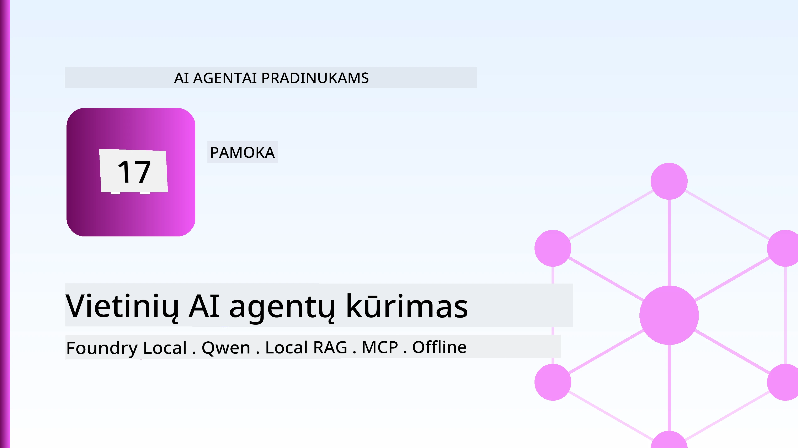
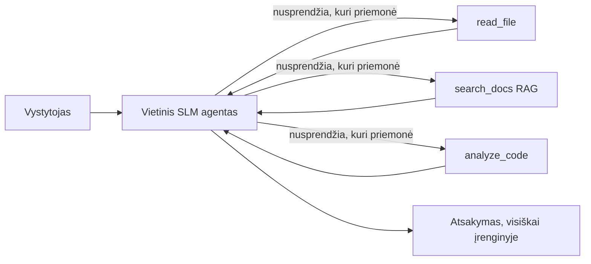
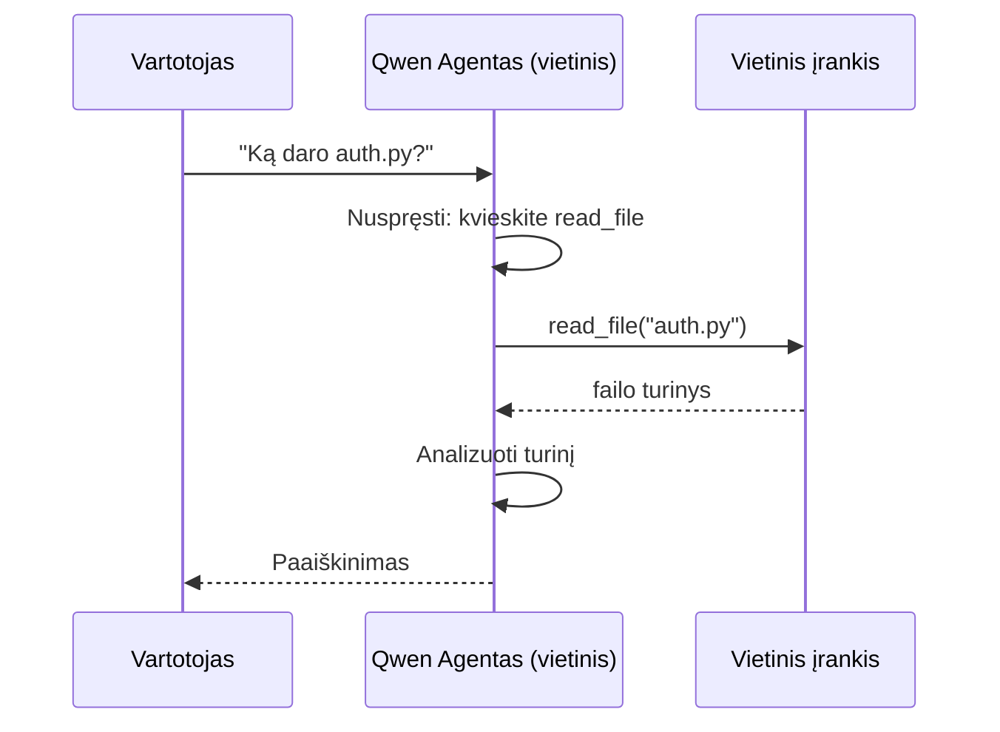
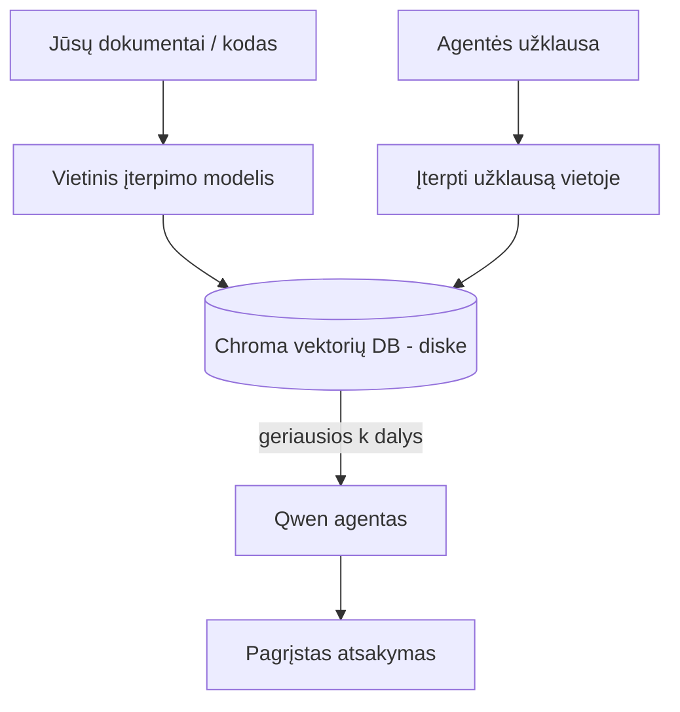
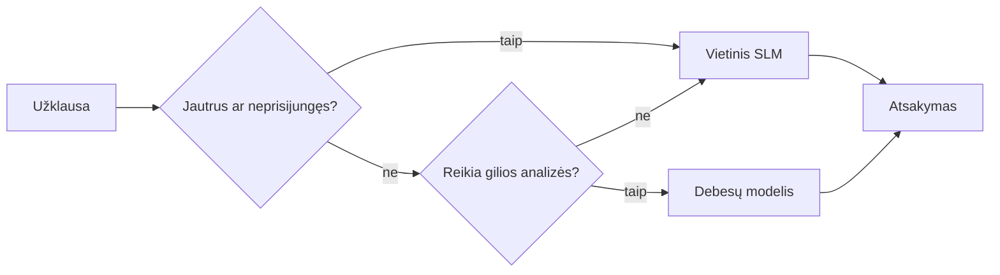

# Vietinių AI agentų kūrimas naudojant Microsoft Foundry Local ir Qwen



Ankstesnėje pamokoje agentai buvo išplėsti *į debesį*. Šioje jie atnešami *ant vieno kompiuterio*. Pamokos pabaigoje turėsite veikiantį inžinerijos asistentą, kuris mąsto, kviečia įrankius, skaito jūsų failus ir ieško dokumentacijoje — **be jokių debesų inferencijos kvietimų.**

Kodėl to norėtumėte? Trys nuolatos pasikartojančios priežastys tikroje inžinerinėje veikloje:

- **Privatumas.** Kodo ir dokumentų niekada neiškelia iš kompiuterio. Jokie užklausos duomenys, fragmentai ar klientų duomenys neperžengia tinklo ribų.
- **Kaina.** Vietinė inferencija neturi mokesčio už žodį. Galite visą dieną iteruoti už elektros kainą.
- **Neprisijungus.** Lėktuve, saugiame objekte ar dingus tinklui, agentas vis tiek veikia.

Tai reiškia, kad keičiame pažangų debesies modelį į **mažą kalbos modelį (Small Language Model, SLM)**, veikiančią jūsų CPU, GPU arba NPU. Ši pamoka skirta kurti agentus, kurie yra *geri* tokiose ribose, o ne apsimesti, kad tų ribų nėra.

## Įvadas

Šioje pamokoje:

- **Maži kalbos modeliai (SLM)** — kas jie yra, kur puikiai veikia, o kur ne.
- **Microsoft Foundry Local** — vykdymo aplinka, kuri parsisiunčia ir talpina modelius į įrenginį per **OpenAI suderinamą API**.
- **Qwen funkcijų kvietimo modeliai** — SLM, kurie patikimai generuoja įrankių kvietimus, o tai leidžia veikia vietinius *agentus* (ne tik vietinius pokalbių modelius).
- **Vietiniai įrankiai, vietinis RAG ir vietinis MCP** — suteikiant agentui galimybes be debesies.
- **Hibridiniai modeliai** — kada laikyti vietinį, o kada kreiptis į debesį.

## Mokymosi tikslai

Baigę šią pamoką, žinosite, kaip:

- Paaiškinti SLM kompromisus ir pasirinkti tinkamiausius vietinių agentų naudojimo atvejus.
- Vietoje talpinti Qwen modelį naudojant Foundry Local ir jungtis prie jo per OpenAI suderinamą galinį tašką.
- Sukurti visiškai jūsų darbo stotyje veikiantį įrankių kvietimų agentą.
- Pridėti vietinį RAG prie savo dokumentų naudodami vietinę vektorų duomenų bazę (Chroma).
- Susieti agentą su vietiniu MCP serveriu ir apmąstyti hibridinio vietinio/debesies dizaino strategijas.

## Priešistorė

Ši pamoka daroma prielaida, kad įvaldėte ankstesnes pamokas ir esate įgudę su:

- [Įrankių naudojimu](../04-tool-use/README.md) (Pamoka 4) ir [Agentiniu RAG](../05-agentic-rag/README.md) (Pamoka 5).
- [Agentinėms protokolais / MCP](../11-agentic-protocols/README.md) (Pamoka 11).
- [Microsoft Agent Framework](../14-microsoft-agent-framework/README.md) (Pamoka 14).

Taip pat reikės:

- Darbo stotis kūrėjui. **8 GB RAM yra realus minimumas**; 16 GB ir daugiau - patogu. GPU arba NPU padeda, bet nėra būtina.
- Įdiegtas **Microsoft Foundry Local** (žr. žemiau skyrių apie diegimą).
- Python 3.12+ ir paketus iš [`requirements.txt`](../../../requirements.txt) kartu su `foundry-local-sdk`, `openai` ir `chromadb` šiai pamokai.

## Maži kalbos modeliai: tinkamas įrankis vietiniam darbui

Pažangus debesies modelis turi šimtus milijardų parametrų ir stovi duomenų centre. SLM turi kelis milijardus parametrų ir turi tilpti jūsų nešiojamojo kompiuterio atmintyje. Šis skirtumas nulemia aiškias lūkesčius.

**SLM gerai atlieka:**

- Struktūruotas, ribotas užduotis — klasifikavimas, išgavimas, santrauka žinomame dokumente.
- **Įrankių kvietimą** — sprendimų priėmimą, kurią funkciją kvieti ir su kokiais argumentais.
- Greitą, pigią, privačią iteraciją su savo duomenimis.

**SLM silpnesni:**

- Atvirame, daugiasluoksniame samprotavime per didelį kontekstą.
- Plačiais pasaulio žiniomis (jie matė mažiau ir daugiau pamiršta).

Todėl laiminti strategija vietiniams agentams yra tokia: **leisk SLM koordinuoti, o sunkų darbą perleisk įrankiams.** Modeliui nereikia *žinoti* jūsų kodo bazės — jam svarbu žinoti, kada kvieti `read_file` ir `search_docs`. Tai tiesiogiai atitinka SLM stiprybes.



## Microsoft Foundry Local

**Microsoft Foundry Local** yra lengvas vykdymo laikas, kuris parsisiunčia, valdo ir aptarnauja modelius išimtinai jūsų įrenginyje. Mūsų svarbiausia funkcija yra ta, kad jis pateikia **OpenAI suderinamą HTTP galinį tašką** — tai reiškia, kad OpenAI SDK ir Microsoft Agent Framework OpenAI klientas veikia pakeitus tik `base_url`. Viskas, ko išmokote kuriant agentus, tiesiogiai persikelia; tik galinis taškas juda iš debesies į `localhost`.

Foundry Local taip pat automatiškai parenka geriausią modelio versiją jūsų aparatūrai — CPU, CUDA/GPU ar NPU versiją — tad jums nereikia rankiniu būdu optimizuoti kiekvienam įrenginiui.

### Diegimas

Įdiekite Foundry Local (žr. [dokumentaciją](https://learn.microsoft.com/azure/ai-foundry/foundry-local/) savo OS), tada patikrinkite, ar veikia:

```bash
# Įdiegti (pavyzdžiui; vadovaukitės dokumentacija pagal savo platformą)
winget install Microsoft.FoundryLocal      # Windows
# brew install microsoft/foundrylocal/foundrylocal   # macOS

# Atsisiųskite ir paleiskite Qwen modelį, tada paleiskite vietinę paslaugą
foundry model run qwen2.5-7b-instruct
foundry service status
```

Paleidus paslaugą turite vietinį, OpenAI suderinamą galinį tašką (paprastai `http://localhost:PORT/v1`). Užrašų knyga naudoja `foundry-local-sdk` galiniam taškui automatiškai atrasti, tad jums nereikia koduoti prievado ranka.

## Qwen funkcijų kvietimas: kodėl tai svarbu

Agentas yra agentas tik tada, kai gali kviesti įrankius. Daugelis SLM gali kalbėtis, bet generuoja nepatikimus, netinkamus įrankių kvietimus. **Qwen** modeliai treniruojami funkcijų kvietimui ir nuosekliai sugeneruoja gerai formuotus kvietimus — būtent tai paverčia vietinį pokalbių modelį *agentu*.

Srautas yra standartinis įrankių kvietimo ciklas, kurį jau pažįstate, tik vykstantis vietoje:



## Vietinis RAG

Dokumentacijos paieška yra ta vieta, kur vietiniai agentai tikrai atsiperka. Vietoje tikėtis, kad SLM įsimins jūsų karkaso dokumentaciją, galite įterpti tuos dokumentus į **vietinę vektorių duomenų bazę** ir leisti agentui gauti aktualias dalis pagal poreikį.

Naudojame **Chroma** — įterptą vektorinį saugyklą, kuri veikia procesų viduje ir nereikalauja serverio administravimo. Procesas yra visiškai vietinis: vietinis įterpimo modelis → vietiniai vektoriai → vietinė paieška → vietinis SLM.



Tai tas pats agentinis RAG modelis iš 5-os pamokos — vienintelis skirtumas, kad visos dalys veikia jūsų įrenginyje.

## Vietiniai MCP serveriai

[MCP](../11-agentic-protocols/README.md) yra transportas, ne debesies paslauga. MCP serveris gali veikti kaip vietinis procesas per `stdio`, teikiantis įrankius agentui pagal standartinį protokolą. Tai leidžia pakartotinai naudoti vis didėjantį MCP serverių ekosistemą — failų sistemos prieigą, git operacijas, duomenų bazės užklausas — visiškai neprisijungus.

Saugumo pozicija yra kitokia nei debesyje, bet jos nėra mažiau: vietinis MCP serveris veikia su jūsų vartotojo leidimais, todėl apribokite, ką jis gali pasiekti (pvz., projektų katalogą, ne visą namų aplanką) ir visada vertinkite jo rezultatus kaip įvestį, kurią reikia patikrinti.

## Hibridiniai debesų ir vietiniai modeliai

Vietinė pirmenybė nereiškia tik vietinę eksploataciją. Brandžios sistemos maršrutuojasi pagal jautrumą ir sudėtingumą:

| Situacija | Kur veikia |
| --- | --- |
| Jautrus kodas / duomenys arba neprisijungus | **Vietinis SLM** |
| Paprasta, ribota užduotis | **Vietinis SLM** (pigus, greitas) |
| Sudėtingas daugiasluoksnis samprotavimas su nejautriais duomenimis | **Debesies modelis** |
| Viskas, kai nutrūksta ryšys | **Vietinis SLM** (sklandus degradavimas) |

Tai atspindi **modelių maršrutizavimo** idėją iš 16-os pamokos — tik vienas iš "modelių" dabar yra jūsų kompiuteris. Tvirtas dizainas numato grįžimą prie vietinio, kai debesis tampa nepasiekiamas, todėl agentas kokybiškai degraduoja, o ne visiškai sugenda.



## Praktinė laboratorija: vietinis inžinerijos asistentas

Atidarykite [`code_samples/17-local-agent-foundry-local.ipynb`](./code_samples/17-local-agent-foundry-local.ipynb) ir atlikite pratimą. Sukursite **vietinį inžinerijos asistentą**, kuris veikia visiškai jūsų darbo stotyje ir gali:

1. **Kviesti įrankius** — per Qwen funkcijų kvietimą per Foundry Local.
2. **Atlikti vietinius failų veiksmus** — peržiūrėti ir skaityti failus projekto kataloge.
3. **Analizuoti kodą** — pateikti pagrindinius šaltinio failo rodiklius.
4. **Ieškoti dokumentacijoje** — vietinis RAG per dokumentų aplanką su Chroma.
5. **Naudoti MCP** — prisijungti prie vietinio MCP serverio (su galimybe nusileisti, jei konfigūracija neegzistuoja).

Debesų inferencijos naudojama nėra nė karto.

### Žingsnis po žingsnio

Asistentas jungiasi prie Foundry Local per OpenAI suderinamą galinį tašką, tad agento kodas atrodo beveik identiškas eigos pamokoms debesyje — tik klientas keičiasi:

```python
from foundry_local import FoundryLocalManager
from openai import OpenAI

# Foundry Local randa/parsisiunčia modelį ir suteikia mums vietinį galinį tašką.
manager = FoundryLocalManager(\"qwen2.5-7b-instruct\")
client = OpenAI(base_url=manager.endpoint, api_key=manager.api_key)  # api_key yra vietinis vietos laikiklis
```

Įrankiai yra įprastos Python funkcijos, sutelktos į projekto katalogą:

```python
def read_file(path: str) -> str:
    \"\"\"Read a file, but only inside the sandboxed project directory.\"\"\"
    full = (PROJECT_ROOT / path).resolve()
    if PROJECT_ROOT not in full.parents and full != PROJECT_ROOT:
        return \"Access denied: path is outside the project directory.\"
    return full.read_text(encoding=\"utf-8\")
```

Atkreipkite dėmesį į smėlio dėžės patikrinimą — net vietoje įrankis, kuris skaito bet kokius kelius, yra rizikingas. Užrašų knyga riboja kiekvieną įrankį vienu projekto šakniu.

## Žinių patikrinimas

Patikrinkite savo supratimą prieš pereidami prie užduoties.

**1. Pateikite dvi konkrečias priežastis, kodėl verta vykdyti agentą vietoje, o ne debesyje.**

<details>
<summary>Atsakymas</summary>

Bet kurios dvi iš: **privatumas** (kodas ir duomenys neišeina iš įrenginio), **kaina** (nėra mokesčio už žodį inferencijai) ir **veikimas neprisijungus** (veikia be tinklo — lėktuve, saugiame objekte ar dingus ryšiui). Reguliavimo/reikalavimų apribojimai dėl duomenų išsiuntimo už įrenginio yra dažnas privatumo priežasčių pagrindas.
</details>

**2. Kokį darbo pasidalinimą tarp SLM ir jo įrankių rekomenduojama naudoti vietiniame agente ir kodėl?**

<details>
<summary>Atsakymas</summary>

Leiskite SLM **koordinuoti** (spręsti, kurį įrankį kviesti ir su kokiais argumentais), o **sunkų darbą perleiskite įrankiams** (skaityti failus, gauti dokumentus, skaičiuoti rezultatus). SLM yra stiprūs ribotais sprendimais kaip įrankių parinkimas, bet silpnesni plačioms žinioms ir ilgai daugiapakopiam samprotavimui, todėl palaikymas įrankiais sustiprina jų galimybes.
</details>

**3. Kas leidžia pakartotinai naudoti debesies agento kodą su Foundry Local?**

<details>
<summary>Atsakymas</summary>

Foundry Local pateikia **OpenAI suderinamą HTTP galinį tašką**. OpenAI SDK ir Agent Framework OpenAI klientas veikia su juo pakeitus tik `base_url` (naudojant vietinį vietos rezervavimo API raktą). Visa kita apie agento kodą lieka nepakitę.
</details>

**4. Kodėl konkrečiai naudojame Qwen funkcijų kvietimo modelį, o ne bet kurį kitą SLM?**

<details>
<summary>Atsakymas</summary>

Nes agentas privalo generuoti patikimus, gerai suformuotus **įrankių kvietimus**. Daugelis SLM gali kalbėtis, bet išleidžia netinkamus ar nenuoseklius įrankių kvietimo struktūras. Qwen modeliai yra treniruojami funkcijų kvietimui ir nuosekliai generuoja kvietimus, kas paverčia vietinį pokalbių modelį veikianciu vietiniu agentu.
</details>

**5. Vietiniame RAG procese, kurios dalys veikia įrenginyje?**

<details>
<summary>Atsakymas</summary>

Visos: įterpimo modelis, vektorių duomenų bazė (Chroma diske), paieškos žingsnis ir SLM. Dokumentai įterpiami vietoje, saugomi vietoje, ieškoma vietoje ir samprotaujama vietiniu modeliu — jokia dalis nesinaudoja debesimi.
</details>

**6. Vietinis MCP serveris veikia jūsų įrenginyje. Ar tai automatiškai reiškia, kad jis saugus? Kokias atsargumo priemones turėtumėte taikyti?**

<details>
<summary>Atsakymas</summary>

Ne. Vietinis MCP serveris veikia su jūsų vartotojo leidimais, taigi gali pasiekti viską, ką galite jūs. Apribokite jį prie to, ko reikia (pvz., vieno projekto katalogo, o ne viso namų aplanko) ir traktuokite jo išvestis kaip įvestį, kurią reikia patikrinti prieš atlikdami veiksmus.
</details>

**7. Apibūdinkite prasmingą hibridinę maršrutizavimo taisyklę, į kurią įtrauktas vietinis modelis.**

<details>
<summary>Atsakymas</summary>

Maršrutuokite jautrius ar neprisijungusius užklausimus vietiniam SLM; paprastas ribotas užduotis siųskite vietiniam SLM dėl greičio ir kainos; sudėtingą daugiasluoksnį samprotavimą su nejautriais duomenimis nukreipkite debesies modeliui; o jei debesies nėra, pereikite prie vietinio SLM, kad agentas kokybiškai degraduotų, o ne sugestų. Tai modelių maršrutizavimas (Pamoka 16), kur vietinis įrenginys yra vienas iš modelių.
</details>

**8. Koks yra realus minimalus RAM kiekis vietiniam agentui paleisti šioje pamokoje, ir ką duoda daugiau RAM?**

<details>
<summary>Atsakymas</summary>

Apie **8 GB** yra realus minimumas; 16 GB ir daugiau – patogu. Daugiau RAM leidžia naudoti didesnius, pajėgesnius modelius ir laikyti daugiau konteksto atmintyje. GPU arba NPU pagreitina inferenciją, bet nėra būtini — Foundry Local pasirenka CPU versiją, jei nėra akceleratoriaus.
</details>

## Užduotis

Išplėskite vietinį inžinerijos asistentą iki **vietinio dokumentacijos peržiūros įrankio** pasirinktame mažame projekte (galite naudoti bet kurį iš šio saugyklos pamokų katalogų).

Jūsų pateikimas turėtų:

1. **Indeksuoti tikrą dokumentų/kodo katalogą** Chroma bazėje (bent penki failai).
2. **Pridėti `find_todos` įrankį**, kuris skenuoja projektą `TODO`/`FIXME` komentarams ir grąžina juos su failo ir eilutės numeriu — naudojant tą patį smėlio dėžės patikrą kaip `read_file`.

3. **Užduokite agentui tris klausimus**, kurie priverstų jį derinti įrankius: vieną gryną RAG klausimą, vieną, kuriam reikia perskaityti konkretų failą, ir vieną, kuriam reikia rasti TODO.
4. **Išmatuokite**: užfiksuokite laiką kiekvienam iš trijų atsakymų ir užrašykite juos markdown ląstelėje. Komentuokite, ar delsos laikas yra priimtinas jūsų numatytam darbo procesui.

Tada parašykite trumpą pastraipą apie tai, **ką perkeltumėte į debesį, o ką laikytumėte vietoje** šiam peržiūrėtojui ir kodėl. Jūsų vertinama, ar vietiniai komponentai tinkamai sujungti ir ar jūsų hibridinis mąstymas yra pagrįstas — ne modelio kokybė.

## Santrauka

Šioje pamokoje sukūrėte agentą, kuris veikia visiškai jūsų pačių mašinoje:

- **SLM** keičia aprėptį į privatumo, kainos ir neprisijungus veikimo naudą — ir ypač sužiba, kai jie **orkestruoja įrankius**, o ne neša visą žinią patys.
- **Foundry Local** aptarnauja modelius įrenginyje už **OpenAI suderinamo galo taško**, todėl jūsų debesies agento kodas persikelia vieno kodo eilutės pakeitimu.
- **Qwen funkcijų kvietimo modeliai** leidžia patikimai kviesti vietinius įrankius — o tai reiškia, kad įmanoma turėti vietinius *agentus*.
- **Vietinis RAG** (Chroma) ir **vietinis MCP** suteikia agentui galimybes neišvykus iš mašinos.
- **Hibridiniai modeliai** leidžia maršrutizuoti pagal jautrumą ir sudėtingumą, su vietiniu kaip gražiu atsarginiu variantu.

Šis žingsnis užbaigia diegimo ciklą: 16 pamoka didino agentų mastą Microsoft Foundry, o ši pamoka juos sumažino iki vienos darbo stoties. Kita pamoka nagrinėja, kaip apsaugoti įdiegtus agentus.

## Papildomi ištekliai

- <a href="https://learn.microsoft.com/azure/ai-foundry/foundry-local/" target="_blank">Microsoft Foundry Local dokumentacija</a>
- <a href="https://learn.microsoft.com/azure/ai-foundry/what-is-azure-ai-foundry" target="_blank">Microsoft Foundry dokumentacija</a>
- <a href="https://learn.microsoft.com/en-us/agent-framework/overview/?wt.mc_id=youtube_26688_organicsocial_reactor&pivots=programming-language-python" target="_blank">Microsoft Agent Framework</a>
- <a href="https://qwen.readthedocs.io/en/latest/framework/function_call.html" target="_blank">Qwen funkcijų kvietimo dokumentacija</a>
- <a href="https://modelcontextprotocol.io/" target="_blank">Model Context Protocol (MCP)</a>
- <a href="https://docs.trychroma.com/" target="_blank">Chroma vektorinė duomenų bazė</a>

## Ankstesnė pamoka

[Scalable agentų diegimas](../16-deploying-scalable-agents/README.md)

## Kita pamoka

[AI agentų apsauga](../18-securing-ai-agents/README.md)

---

<!-- CO-OP TRANSLATOR DISCLAIMER START -->
**Atsakomybės apribojimas**:
Šis dokumentas buvo išverstas naudojant dirbtinio intelekto vertimo paslaugą [Co-op Translator](https://github.com/Azure/co-op-translator). Nors siekiame tikslumo, prašome atkreipti dėmesį, kad automatiniai vertimai gali turėti klaidų ar netikslumų. Originalus dokumentas jo gimtąja kalba laikomas autoritetingu šaltiniu. Svarbiai informacijai rekomenduojama naudoti profesionalų žmogiškąjį vertimą. Mes neatsakome už jokius nesusipratimus ar neteisingą interpretaciją, kilusią naudojantis šiuo vertimu.
<!-- CO-OP TRANSLATOR DISCLAIMER END -->