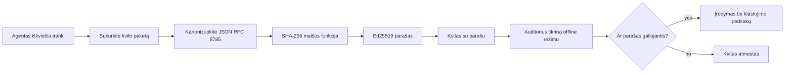
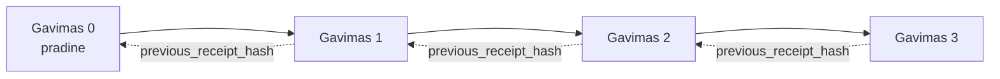

[Žiūrėkite pamokos vaizdo įrašą: AI agentų apsauga su kriptografiniais kvitais](https://youtu.be/PLACEHOLDER_VIDEO_ID)

> _(Pamokos vaizdo įrašą ir miniatiūrą po sujungimo pridės Microsoft turinio komanda, atitinkant pamokų 14 / 15 modelį.)_

# AI agentų apsauga su kriptografiniais kvitais

## Įvadas

Šioje pamokoje aptarsime:

- Kodėl AI agentų audito takelio svarba atitikties, derinimo ir pasitikėjimo prasme.
- Kas yra kriptografinis kvitas ir kuo jis skiriasi nuo nepasirašyto žurnalo įrašo.
- Kaip gauti pasirašytą kvitą už agento įrankio iškvietimą paprastame Python.
- Kaip patikrinti kvitą neprisijungus ir aptikti klastojimą.
- Kaip sujungti kvitus grandine taip, kad ištrinant ar keičiant eiliškumą grandinė būtų sulaužyta.
- Ką kvitai įrodo ir ką aiškiai neįrodo.

## Mokymosi tikslai

Baigę šią pamoką žinosite, kaip:

- Nustatyti gedimų modelius, kurie skatina kriptografinę agento veiksmų kilmės patikrą.
- Sukurti Ed25519 pasirašytą kvitą pagal kanoninį JSON užklausą.
- Nepriklausomai patikrinti kvitą naudodami tik pasirašiusiojo viešą raktą.
- Aptikti klastojimą iš naujo atlikus patikrą modifikuotam kvitui.
- Sukurti hash grandinę iš kvitų ir paaiškinti, kodėl grandinė yra svarbi.
- Atpažinti ribą tarp to, ką kvitai įrodo (priskyrimą, vientisumą, eiliškumą) ir ko neįrodo (veiksmo teisingumo, politikos tvirtumo).

## Problema: Jūsų agento audito takelis

Įsivaizduokite, kad įdiegėte AI agentą Contoso Travel. Agentas skaito kliento užklausas, iškviečia skrydžių API, kad surastų variantus, ir rezervuoja vietas kliento vardu. Praėjusį ketvirtį agentas apdorodavo 50 000 rezervacijų.

Šiandien atvyksta auditorius. Jis užduoda paprastą klausimą: „Parodykite, ką darė jūsų agentas.“

Jūs perduodate žurnalo failus. Auditoriui tikrinant, jis užduoda sunkesnį klausimą: „Kaip žinau, kad šie žurnalai nebuvo redaguoti?“

Tai yra audito takelio problema. Šiandien dauguma agentų diegimų pasikliauja:

- **Programos žurnalais**: juos rašo pats agentas, bet juos gali redaguoti bet kas, turintis prieigą prie failų sistemos.
- **Debesų žurnalų paslaugomis**: platformos lygiu klastojimą aptinkantiems, bet tik jei auditorius pasitiki platformos operatoriumi.
- **Duomenų bazės transakcijų žurnalais**: tinkami duomenų bazės pokyčiams fiksuoti, bet ne atsitiktiniams įrankių iškvietimams.

Joks iš jų negali atsakyti į auditoriaus klausimą be būtinybės pasitikėti kažkuo (jumis, jūsų debesų tiekėju ar duomenų bazės pardavėju). Vidaus naudojimui toks pasitikėjimas dažnai priimtinas. Tačiau reglamentuojamoms veikloms (finansai, sveikatos priežiūra, viskas, kas yra dėl ES AI reglamento) jis nepriimtinas.

Kriptografiniai kvitai išsprendžia šią problemą leisdami nepriklausomai patikrinti kiekvieną agento veiksmą. Auditorius neprivalo jums pasitikėti. Jam reikia tik jūsų viešo rakto ir paties kvito.

## Kas yra kriptografinis kvitas?

Kvitas yra JSON objektas, kuris registruoja, ką agentas padarė, pasirašytas skaitmeniniu parašu.



Minimalus kvitas atrodo taip:

```json
{
  "type": "agent.tool_call.v1",
  "agent_id": "contoso-travel-bot",
  "tool_name": "lookup_flights",
  "tool_args_hash": "sha256:a3f9c1...",
  "result_hash": "sha256:7b2e1d...",
  "policy_id": "contoso-travel-policy-v3",
  "timestamp": "2026-04-25T14:30:00Z",
  "sequence": 47,
  "previous_receipt_hash": "sha256:9d4e6a...",
  "signature": {
    "alg": "EdDSA",
    "sig": "c5af83...",
    "public_key": "8f3b2c..."
  }
}
```

Trys savybės atlieka darbą:

1. **Parašas**. Kvitas pasirašomas agento vartų naudotu Ed25519 privačiu raktu. Bet kas, turintis atitinkamą viešąjį raktą, gali neprisijungęs patikrinti parašą. Bet koks lauko pakeitimas anuliuoja parašą.

2. **Kanoniškas kodavimas**. Prieš pasirašant kvitas seralizuojamas JSON kanoniškumo schemos (JCS, RFC 8785) būdu. Tai užtikrina, kad dvi skirtingos įgyvendinimo versijos, generuojančios tą pačią logišką kvito reikšmę, gaus vienodus baitų rezultatus. Be kanoniškumo, skirtingi JSON seralizatoriai būtų sugeneravę skirtingus parašus tam pačiam turiniui.

3. **Hash grandinimas**. Laukas `previous_receipt_hash` susieja kiekvieną kvitą su ankstesniu. Kvito pašalinimas ar permaina sulaužo visus vėliau einančius kvitus. Klastojimas tampa matomas grandinės lygyje net jei atskiri parašai pralaužiami.

Kartu šios savybės suteikia tris garantijas:

- **Priskyrimą**: šis raktas pasirašė šį turinį.
- **Vientisumą**: turinys nuo pasirašymo nepasikeitė.
- **Eiliškumą**: šis kvitas įvyko po to kvito grandinėje.

## Kvito kūrimas Python kalba

Kvito kūrimui nereikia specialios bibliotekos. Kriptografiniai primityvai plačiai prieinami, o logika – vos keliasdešimt Python eilučių.

Praktinės užduotys faile `code_samples/18-signed-receipts.ipynb` išsamiai paaiškina visą procesą. Santrauka:

```python
import json
import hashlib
import base64
from nacl import signing
from jcs import canonicalize  # RFC 8785 kanoninis JSON

def b64url_nopad(data: bytes) -> str:
    return base64.urlsafe_b64encode(data).decode("ascii").rstrip("=")

def sha256_canonical(obj) -> str:
    """SHA-256 of a Python object's JCS-canonical JSON form."""
    return f"sha256:{hashlib.sha256(canonicalize(obj)).hexdigest()}"

# Generuoti arba įkelti pasirašymo raktą (gamyboje saugoti raktų saugykloje)
signing_key = signing.SigningKey.generate()
verify_key = signing_key.verify_key

# Sudaryti kvito duomenis (dar be parašo)
tool_args = {"origin": "SYD", "destination": "LAX"}
tool_result = [{"flight": "QF11", "price": 1850, "stops": 0}]

payload = {
    "type": "agent.tool_call.v1",
    "agent_id": "contoso-travel-bot",
    "tool_name": "lookup_flights",
    "tool_args_hash": sha256_canonical(tool_args),
    "result_hash": sha256_canonical(tool_result),
    "policy_id": "contoso-travel-policy-v3",
    "timestamp": "2026-04-25T14:30:00Z",
    "sequence": 0,
    "previous_receipt_hash": None,
}

# Kanonizuoti, išmaišyti, pasirašyti.
canonical_bytes = canonicalize(payload)
message_hash = hashlib.sha256(canonical_bytes).digest()
signature_bytes = signing_key.sign(message_hash).signature

# Prisegti struktūrizuotą parašo objektą.
receipt = {
    **payload,
    "signature": {
        "alg": "EdDSA",
        "sig": b64url_nopad(signature_bytes),
        "public_key": b64url_nopad(bytes(verify_key)),
    },
}
```

Tai visas pasirašymo srautas. Užduotys knygoje išsamiai aprašo kiekvieną žingsnį.

## Kvito tikrinimas ir klastojimo aptikimas

Tikrinimas yra priešingas procesas:

```python
import base64
import hashlib
from nacl import signing
from nacl.exceptions import BadSignatureError
from jcs import canonicalize

def b64url_decode(s: str) -> bytes:
    padding = "=" * ((4 - len(s) % 4) % 4)
    return base64.urlsafe_b64decode(s + padding)

def verify_receipt(receipt: dict) -> bool:
    # Parašas yra struktūruotas objektas: {"alg", "sig", "public_key"}.
    sig_obj = receipt.get("signature")
    if not sig_obj or sig_obj.get("alg") != "EdDSA":
        return False

    # Atkurkite naudotą užrašyti krovinių duomenis (viską išskyrus parašą).
    payload = {k: v for k, v in receipt.items() if k != "signature"}

    canonical_bytes = canonicalize(payload)
    message_hash = hashlib.sha256(canonical_bytes).digest()

    try:
        verify_key = signing.VerifyKey(b64url_decode(sig_obj["public_key"]))
        verify_key.verify(message_hash, b64url_decode(sig_obj["sig"]))
        return True
    except BadSignatureError:
        return False
```

Ši funkcija paima kvitą ir grąžina `True`, jei parašas galioja, arba `False` kitu atveju. Nereikia jokių tinklo kvietimų, paslaugų priklausomybių ar trečiųjų šalių pasitikėjimo.

Norint pamatyti klastojimo aptikimą praktikoje, knyga aprašo:

1. Galiojančio kvito kūrimą ir patikrinimą.
2. Vieno baito modifikavimą lauke `tool_args_hash`.
3. Pakartotinį patikrinimą ir nesėkmę.

Tai praktinis įrodymas, kad kvitai rodo klastojimą: bet koks pakeitimas, net mažas, sulaužo parašą.

## Kvito grandinimas daugiasluoksniams agentams

Vienas pasirašytas kvitas saugo vieną veiksmą. Kvito grandinė saugo veiksmų seką.



Kiekvienas kvitas įrašo prieš tai buvusio kvito hash reikšmę. Norint tyliai pašalinti 2 kvitą, užpuolėjas turėtų:

- Pakeisti 3 kvito `previous_receipt_hash` lauką (sulaužytų 3 kvito parašą), ARBA
- Sužymėti naują parašą modifikuotam 3 kvitui (reikalingas agento privatus raktas).

Jei privatus raktas saugomas aparatinėje saugykloje, o viešasis raktas skelbiamas kartu su kiekvienu kvitu, nei viena iš šių atakų negalima nepastebėta.

Knyga parodo, kaip:

1. Sukurti trijų kvitų grandinę.
2. Patikrinti, ar kiekvieno kvito `previous_receipt_hash` atitinka tikrą ankstesnio kvito hash.
3. Modifikuoti vieną kvitą grandinės viduryje ir pažiūrėti, kaip grandinė sulūžta būtent toje vietoje.

Tai leidžia sukurti audito takelį, kurį išorinis auditas gali patikrinti be pasitikėjimo jumis.

## Ką kvitai įrodo (ir ko neįrodo)

Tai svarbiausia pamokos dalis. Kvitas yra galingas, bet jo galia yra ribota.

**Kvitai įrodo tris dalykus:**

1. **Priskyrimą**: konkretus raktas pasirašė konkretų turinį.
2. **Vientisumą**: turinys nuo pasirašymo nepasikeitė.
3. **Eiliškumą**: šis kvitas yra po kito kvito hash grandinėje.

**Kvitai neįrodo:**

1. **Veiksmo teisingumo**: kad agento veiksmas buvo teisingas. Kvitas gali būti pasirašytas tiek už neteisingą, tiek už teisingą atsakymą.
2. **Politikos laikymosi**: kad `policy_id` nurodyta politika buvo tikrai įvertinta arba kad ji būtų leista, jei būtų tikrinta. Kvitas registruoja tai, kas buvo teigiama, ne tai, kas buvo vykdoma.
3. **Tapatybę už rakto ribų**: kvitas sako „šis raktas pasirašė šį turinį“. Ne „šis žmogus tai patvirtino“. Raktą su žmogumi ar organizacija susieti reikia atskiros tapatybės infrastruktūros (adresyno, viešo rakto registro ir pan.).
4. **Įvesties teisingumą**: jei agentas gauna manipuliuotą užklausą ir veikia pagal ją, kvitas ištikimai registruoja veiksmą. Kvitas yra po įvesties patikros ir nėra jos pakaitalas.

Ši riba svarbi dėl dviejų priežasčių:

- Ji parodo, kam kvitai yra naudingi: agento elgesio audito ir klastojimo aptikimui, net per organizacijų ribas.
- Ji parodo, kokių papildomų sluoksnių jums dar reikia: įvesties patikra (Pamoka 6), politikos vykdymas (trumpai aprašyta žemiau) ir tapatybės infrastruktūra (ne ši pamoka).

Dažna klaida yra manyti, kad „turėdami kvitus“ jau „valdome procesą“. Ne. Kvitai yra pamatas. Valdymas – tai sistema, kurią jūs statote ant jų.

## Gamybos nuorodos

Šios pamokos Python kodas sąmoningai minimalus, kad galėtumėte perskaityti kiekvieną eilutę ir suprasti, kas vyksta. Gamyboje turite dvi galimybes:

1. **Dirbti tiesiogiai su kriptografiniais primityvais.** Minėtos 50 eilučių pakanka daugeliui panėkų. PyNaCl (Ed25519) ir `jcs` paketas (kanoninis JSON) yra gerai palaikomos ir patikrintos bibliotekos.

2. **Naudoti gamybos kvitų biblioteką.** Keli atviro kodo projektai įgyvendina tą patį modelį su papildomomis savybėmis (raktų rotacija, masinė patikra, JWK rinkinio platinimas, integracija su politikos varikliais):
   - Šioje pamokoje naudotas kvito formatas atitinka IETF interneto projektą (`draft-farley-acta-signed-receipts`), kuris yra standartų procese.
   - Microsoft Agent Governance Toolkit generuoja kvitus kartu su Cedar pagrindu veikiant politika; žiūrėkite vadovėlį 33 toje saugykloje pilnam pavyzdžiui.
   - Paketiniai sprendimai `protect-mcp` (npm) ir `@veritasacta/verify` (npm) pateikia Node pagrindo kvitų pasirašymo ir neprisijungus vykdomo tikrinimo įgyvendinimą, skirtą bet kokiam MCP serveriui aprišti nepriekaištingu audito takeliu.

Pasirinkimas tarp savo sprendimo ir bibliotekos primena sprendimą tarp savo JWT bibliotekos rašymo ir išbandytos bibliotekos naudojimo: abi prasmingos; biblioteka taupo laiką ir mažina audito paviršių; savarankiškas kūrimas priverčia suprasti kiekvieną primityvą. Ši pamoka moko savarankiško kelio, kad turėtumėte pagrindą bet kuriam pasirinkimui.

## Žinių patikra

Patikrinkite savo supratimą prieš pradedant praktikos užduotį.

**1. Kvitas pasirašytas agento privačiu Ed25519 raktu. Auditorius turi tik viešąjį raktą. Ar auditorius gali neprisijungęs patikrinti kvitą?**

<details>
<summary>Atsakymas</summary>

Taip. Ed25519 patikra reikalauja tik viešojo rakto ir pasirašytų baitų. Nereikia tinklo kvietimų ar paslaugų priklausomybių. Tai savybė, kuri daro kvitus naudingus oro tarpuose, daugiaorganizaciniuose ar mažo pasitikėjimo audituose.
</details>

**2. Užpuolėjas pakeičia kvito `policy_id` lauką, kad tvirtintų, jog buvo taikoma lepesnė politika. Parašas buvo sudarytas originaliam turiniui. Kas nutinka tikrinimo metu?**

<details>
<summary>Atsakymas</summary>

Tikrinimas nepavyksta. Parašas buvo skaičiuotas pagal kanoniškus originalaus turinio baitus; kiekvienas lauko pakeitimas keičia baitus, o tai keičia SHA-256 hash reikšmę, todėl parašas tampa nebegaliojantis. Užpuolėjui reikėtų privataus rakto, kad pagamintų naują galiojantį parašą, kurio jis neturi.
</details>

**3. Kodėl kvitas įrašo `tool_args_hash` ir `result_hash`, o ne žalius argumentus ir rezultatus?**

<details>
<summary>Atsakymas</summary>

Dvi priežastys. Pirma, kvitas gali būti archyvuojamas arba perduodamas aplinkoje, kur nepageidaujama paviešinti žalią turinį (asmens duomenys, verslo informacija). Heshavimas sumažina kvito dydį ir apsaugo turinį; auditorius patikrina, ar hash sutampa su atskirai saugoma tikrąja turinio kopija. Antra, hash turi fiksuotą dydį; kvito su hash dydis yra apribotas nesvarbu, kaip dideli buvo įėjimai ir išėjimai.
</details>

**4. Laukas `previous_receipt_hash` sujungia kiekvieną kvitą su ankstesniu. Jei užpuolėjas tyliai ištrina vieną kvitą grandinės viduryje, kas tampa negaliojančiu?**

<details>
<summary>Atsakymas</summary>

Kiekvienas kvitas, kuris vyko po ištrinto. Jų `previous_receipt_hash` laukai nebebaigtų atitikti tikros grandinės (nes kvitas, į kurį jie nurodė, nebeegzistuoja arba grandinė dabar rodo į kitą pirmtaką). Norėdamas paslėpti ištrynimą, užpuolėjas turėtų iš naujo pasirašyti kiekvieną vėlesnį kvitą, tam reikalingas privatus raktas.
</details>

**5. Kvitas patikrinamas sėkmingai. Ar tai įrodo, kad agento veiksmas buvo teisingas, patikimas ar atitiko politiką?**

<details>
<summary>Atsakymas</summary>

Ne. Galiojantis kvitas įrodo tris dalykus: priskyrimą (šis raktas pasirašė šį turinį), vientisumą (turinys nepasikeitė) ir eiliškumą (šis kvitas buvo po kito). Jis neįrodo, kad veiksmas buvo teisingas, kad politika `policy_id` tikrai buvo įvertinta arba kad agentas laikėsi visų taisyklių. Kvitai padaro agento elgesį auditabiliu, bet ne visada teisingu. Tai svarbiausia pamokos riba.
</details>

## Praktikos užduotis

Atidarykite `code_samples/18-signed-receipts.ipynb` ir atlikite visas keturias dalis:

1. **1 dalis**: pasirašykite pirmąjį kvitą ir patikrinkite jį.
2. **2 dalis**: klastokite kvitą ir stebėkite, kaip patikrinimas nepavyksta.
3. **3 dalis**: sukurkite trijų kvitų grandinę ir patikrinkite jos vientisumą.
4. **4 dalis**: pritaikykite modelį agentui, sukurtam su Microsoft Agent Framework: apvyniokite įrankio iškvietimą kvito pasirašymu, tada patikrinkite kvitą nepriklausomai.

**Iššūkis 1:** išplėskite kvito schemą pridėdami papildomą pasirinktą lauką (pavyzdžiui, užklausos ID sekimui), atnaujinkite kanoninį pasirašymo logiką, kad jį įtrauktumėte ir įsitikinkite, jog kvitas vis dar teisingai patikrinamas. Tada pakeiskite tą lauką po pasirašymo ir patikrinkite, kad patikrinimas nepavyktų. Tai verčia suprasti, kaip kiekvienas kanoninės koduotės baitas prisideda prie parašo.
**Iššūkis 2:** SHA-256 maišos du iš jūsų kvitų kartu (sujunkite jų kanoninę baitų seką nulemtoje tvarkoje) ir įterpkite gautą maišo reikšmę kaip naują lauką trečiajame kvite prieš pasirašant jį. Patikrinkite, ar visi trys kvitai vis dar grįžta į pradinę būseną. Jūs ką tik sukūrėte vieno žingsnio įtraukimo įrodymą: bet kas turintis trečiąjį kvitą gali įrodyti, kad pirmieji du egzistavo tuo metu, kai buvo pasirašytas, nereikalaujant atskleisti jų turinio. Tai yra modelis, kurį naudoja selektyvaus atskleidimo kvitai dideliu mastu (Merkle įsipareigojimai, RFC 6962).

## Išvada

Kryptografiniai kvitai suteikia AI agentams audito takelį, kuris yra:

- **Nepriklausomai patikrinamas**: bet kuri šalis, turinti viešąjį raktą, gali patikrinti, be paslaugos priklausomybės.
- **Nepakitusio atskleidimo**: bet koks pakeitimas anuliuoja parašą.
- **Perkeliamas**: kvitas yra mažas JSON failas; jį galima archyvuoti, perduoti ir patikrinti bet kur.
- **Atitinkantis standartus**: sukurtas pagal Ed25519 (RFC 8032), JCS (RFC 8785) ir SHA-256, visus plačiai naudojamus primityvus.

Jie nėra įvesties validacijos, politikos vykdymo ar tapatybės infrastruktūros pakaitalas. Jie yra pagrindas toms sluoksniams. Kai diegiate agentus reguliuojamose darbo aplinkose, daugiainstituciniuose darbo procesuose arba bet kokioje situacijoje, kuriai būsimam auditorui negalima aklai pasitikėti, kvitai užtikrina sąžiningą audito takelį.

Svarbiausia išvada: kvitai įrodo, kas ką pasakė, kada. Jie neįrodo, kad pasakyta buvo teisinga ar teisinga. Laikykite šią skirtį griežtą. Tai skirtumas tarp sąžiningos kilmės sistemos ir klaidinančios.

## Produkcijos kontrolinis sąrašas

Kai būsite pasiruošę pereiti nuo šios pamokos prie kvitu pasirašytų agentų diegimo tikroje aplinkoje:

- [ ] **Perkelkite parašo raktą iš kūrėjo nešiojamojo kompiuterio.** Naudokite Azure Key Vault, AWS KMS arba aparatinį saugumo modulį. Privatus raktas, pasirašantis jūsų kvitus, niekada neturėtų būti saugomas šaltinio valdymo sistemoje ar atviro teksto pavidalu taikomųjų programų mašinose.
- [ ] **Publikuokite viešąjį patikrinimo raktą.** Auditoriams jo reikia offline patikrinimui. Standartinis modelis yra JWK rinkinys žinomu URL (RFC 7517), pvz., `https://your-org.example.com/.well-known/agent-keys.json`.
- [ ] **Užfiksuokite grandinės galvutę išorėje.** Periodiškai įrašykite naujausios grandinės galvutės maišą į skaidrumo žurnalą (Sigstore Rekor, RFC 3161 laiko žymos tarnybą ar antrą vidinę sistemą), kad išorinė šalis galėtų patvirtinti "ši grandinė egzistavo tuo metu."
- [ ] **Laikykite kvitus nekeičiamos formos.** Tik pridėjimui skirta duomenų saugykla (Azure Storage su nepakeičiamumo politika, AWS S3 Object Lock) neleidžia vidiniam asmeniui keisti istorijos saugyklos sluoksnyje.
- [ ] **Nuspręskite dėl saugojimo termino.** Daugelis atitikties režimų reikalauja daugiamečio saugojimo. Planuokite kvitų augimą (kiekvienas kvitas ~500 baitų; agentas, darantis 10 tūkst. kvietimų per dieną, gamina ~1,8 GB per metus).
- [ ] **Dokumentuokite, ko kvitai neapima.** Kvitai įrodo priskyrimą, vientisumą ir užsakymą. Jūsų veiklos vadove turėtų būti aiškiai išvardyti papildomi kontrolės mechanizmai (įvesties validacija, politikos vykdymas, normų ribojimas, tapatybės infrastruktūra), kurie kartu su kvitais sudaro jūsų valdymo strategiją.

### Turite daugiau klausimų apie AI agentų saugumą?

Prisijunkite prie [Microsoft Foundry Discord](https://aka.ms/ai-agents/discord), susitikite su kitais besimokančiais, dalyvaukite darbo valandose ir gaukite atsakymus į AI agentų klausimus.

## Toliau po šios pamokos

Ši pamoka apima vieno kvito pasirašymą ir maišos grandinės sekas. Tie patys primityvai sudaro keletą pažangesnių modeliavimo būdų, su kuriais galite susidurti stiprinant savo valdymo politiką:

- **Selektinis atskleidimas.** Kai kvito laukai yra nepriklausomai įsipareigojami (RFC 6962 stiliaus Merkle medis), galite atskleisti konkrečius laukus konkretiems auditoriams ir įrodyti, kad likusieji nepasikeitė, jų neatskleidžiant. Tai naudinga, kai tas pats kvitas turi atitikti tiek išsamų auditą (kuris nori pilnumo), tiek duomenų minimalizavimo reglamentus, tokius kaip GDPR (kurie nori, kad auditorius matytų kuo mažiau).
- **Kvitų atšaukimas.** Jei parašo raktas kompromituojamas, reikia būdo pažymėti visus tuo raktu pasirašytus kvitus kaip nepatikimus nuo tam tikro laiko. Standartiniai modeliai: trumpalaikiai parašo raktai kartu su paskelbtu atšaukimo sąrašu arba skaidrumo žurnalas su atšaukimo įrašais.
- **Dvipusiai / suskirstyti parašo kvitai.** Kai kurios įgyvendinimo versijos dalija pasirašytą turinį į priešvykdymo (`authorization_*`) ir povykdymo (`result_*`) puses su nepriklausomais parašais, naudingomis, kai autorizavimo sprendimą ir stebėtą rezultatą kuria skirtingi asmenys ar skirtingu laiku. Tai papildomai suderinama su šios pamokos kvito formatu.
- **Turinio sudėtis.** Kvitas uždaro bet kokius baitus, kuriuos įdedate į `result_hash`. Tikrojo pasaulio turinys dažnai yra turtingesnis nei vienas įrankio kvietimo rezultatas: prieš sprendimą pagrindimas (modelio prognozė, svarstytos galimybės, įrodymai ir jų pilnumas, rizikos padėtis, atsakomybės grandinė, sprendimo rezultatas) gali gyventi viduje, užantspauduotas vienu kvitu. Tai padeda išlaikyti kvito formatą minimalų, leidžiant turinio schemoms evoliucionuoti pagal sritis.
- **Kryžminis įgyvendinimo suderinamumas.** Keli nepriklausomi tos pačios kvito formato įgyvendinimai (Python, TypeScript, Rust, Go) patikrina tarpusavyje pagal bendrus testų vektorius. Jei kuriate savo įgyvendinimą, patikrinimas pagal publikuotus vektorius patvirtina suderinamumą.
- **Po kvantinę migracija.** Ed25519 šiandien plačiai naudojamas, bet nėra atsparus kvantinės eros iššūkiams. Kvito formatas yra algoritmiškai lankstus: `signature.alg` laukas gali turėti `ML-DSA-65` (NIST postkvantinis parašo standartas), kai reikalinga migracija. Planuokite pereinamąjį laikotarpį, kai kvitai yra dvigubai pasirašyti.

## Papildomi ištekliai

- <a href="https://datatracker.ietf.org/doc/draft-farley-acta-signed-receipts/" target="_blank">IETF Internet Draft: Pasirašyti sprendimų kvitai mašininiam prieigos valdymui</a>
- <a href="https://learn.microsoft.com/azure/ai-studio/responsible-use-of-ai-overview" target="_blank">Atsakingas AI apžvalga (Azure AI)</a>
- <a href="https://datatracker.ietf.org/doc/html/rfc8032" target="_blank">RFC 8032: Edwards kreivės skaitmeninio parašo algoritmas (EdDSA)</a>
- <a href="https://datatracker.ietf.org/doc/html/rfc8785" target="_blank">RFC 8785: JSON kanonizavimo schema (JCS)</a>
- <a href="https://datatracker.ietf.org/doc/html/rfc6962" target="_blank">RFC 6962: Sertifikatų skaidrumas</a> (Merkle medžio konstrukcija, naudojama selektyvaus atskleidimo kvituose)
- <a href="https://github.com/microsoft/agent-governance-toolkit/blob/main/docs/tutorials/33-offline-verifiable-receipts.md" target="_blank">Microsoft Agent Governance Toolkit, Pamoka 33: Offline patikrinami sprendimų kvitai</a>
- <a href="https://github.com/ScopeBlind/agent-governance-testvectors" target="_blank">Kryžminio įgyvendinimo testų vektoriai</a> naudojamam kvito formatui (Apache-2.0)
- <a href="https://pynacl.readthedocs.io/" target="_blank">PyNaCl dokumentacija</a> (Ed25519 Python kalboje)

## Ankstesnė pamoka

[Kompiuterio naudojimo agentų kūrimas (CUA)](../15-browser-use/README.md)

## Kita pamoka

_(Nustatys mokymosi programos administracija)_

---

<!-- CO-OP TRANSLATOR DISCLAIMER START -->
**Atsakomybės apribojimas**:
Šis dokumentas buvo išverstas naudojant dirbtinio intelekto vertimo paslaugą [Co-op Translator](https://github.com/Azure/co-op-translator). Nors siekiame tikslumo, prašome atkreipti dėmesį, kad automatiniai vertimai gali turėti klaidų ar netikslumų. Originalus dokumentas jo gimtąja kalba laikomas autoritetingu šaltiniu. Svarbiai informacijai rekomenduojama naudoti profesionalų žmogiškąjį vertimą. Mes neatsakome už jokius nesusipratimus ar neteisingą interpretaciją, kilusią naudojantis šiuo vertimu.
<!-- CO-OP TRANSLATOR DISCLAIMER END -->