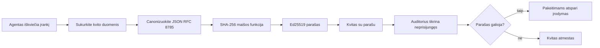
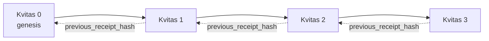

[Žiūrėkite pamokos vaizdo įrašą: AI agentų apsauga su kriptografiniais kvitais](https://youtu.be/PLACEHOLDER_VIDEO_ID)

> _(Pamokos vaizdo įrašas ir miniatiūra bus pridėti Microsoft turinio komandos po susijungimo, pagal pamokų 14 / 15 modelį.)_

# AI agentų apsauga su kriptografiniais kvitais

## Įvadas

Šioje pamokoje aptarsime:

- Kodėl AI agentų audito žurnalai yra svarbūs atitikčiai, klaidų taisymui ir pasitikėjimui.
- Kas yra kriptografinis kvitas ir kuo jis skiriasi nuo pasirašymo neturinčios žurnalo eilutės.
- Kaip sukurti pasirašytą kvitą agento įrankio iškvietimui naudojant paprastą Python.
- Kaip patikrinti kvitą neprisijungus ir aptikti klastojimą.
- Kaip susieti kvitus grandine taip, kad pašalinus ar pakeitus jų tvarką grandinė nutraukta.
- Ką kvitai įrodo ir ką jie aiškiai neįrodo.

## Mokymosi tikslai

Baigę šią pamoką jūs žinosite, kaip:

- Nustatyti gedimo atvejus, dėl kurių reikalinga kriptografinė agento veiksmų kilmės patikra.
- Sukurti Ed25519 pasirašytą kvitą su kanoniniu JSON duomenų formatu.
- Nepriklausomai patikrinti kvitą naudojant tik pasirašiusiojo viešąjį raktą.
- Aptikti klastojimą perkraunant patikrą su pakeistu kvitu.
- Sukurti kvitų grandinę su maišos ryšiu ir paaiškinti, kodėl tai svarbu.
- Atpažinti ribą tarp to, ką kvitai įrodo (priskyrimą, vientisumą, eiliškumą) ir ko jie neįrodo (veiksmo teisingumas, taisyklių laikymasis).

## Problema: jūsų agento audito žurnalas

Įsivaizduokite, kad įdiegėte AI agentą Contoso Travel. Agentas skaito klientų užklausas, kviečia skrydžių API ieškoti variantų ir užsako vietas kliento vardu. Praėjusį ketvirtį agentas apdorodavo 50 000 užsakymų.

Šiandien atvyksta auditas. Paklausia paprasto klausimo: „Parodykite, ką jūsų agentas darė.“

Jūs pateikiate savo žurnalo failus. Auditorius juos peržiūri ir užduoda sunkesnį klausimą: „Kaip žinau, kad šie žurnalai nebuvo redaguoti?“

Tai yra audito žurnalo problema. Dauguma agentų diegimo šiandien remiasi:

- **Programų žurnalais**: rašomais pačio agento, kuriuos gali redaguoti bet kas turintis prieigą prie failų sistemos.
- **Debesų žurnalo paslaugomis**: klastojimą aptinkančiomis platformos lygmeniu, bet auditorius turi pasitikėti platformos operatoriumi.
- **Duomenų bazės transakcijų žurnalais**: tinka duomenų bazės pakeitimams, bet ne bet kokių įrankių iškvietimams.

Nė viena iš šių galimybių neatsako auditoriaus klausimo nepasikliaujant trečiąja šalimi (jumis, jūsų debesų tiekėju ar duomenų bazės tiekėju). Vidiniam naudojimui toks pasitikėjimas dažnai priimtinas, tačiau reglamentuojamoms apkrovoms (finansai, sveikatos priežiūra, bet kas pagal ES AI reglamentą) ne.

Kriptografiniai kvitai išsprendžia šią problemą, nes kiekvienas agento veiksmas yra nepriklausomai patikrinamas. Auditorius jums neturi pasitikėti. Jam reikia tik jūsų viešojo rakto ir paties kvito.

## Kas yra kriptografinis kvitas?

Kvitas yra JSON objektas, kuris įrašo, ką agentas padarė, pasirašytas skaitmeniniu parašu.



Minimalus kvitas atrodo taip:

```json
{
  "type": "agent.tool_call.v1",
  "agent_id": "contoso-travel-bot",
  "tool_name": "lookup_flights",
  "tool_args_hash": "sha256:a3f9c1...",
  "result_hash": "sha256:7b2e1d...",
  "policy_id": "contoso-travel-policy-v3",
  "timestamp": "2026-04-25T14:30:00Z",
  "sequence": 47,
  "previous_receipt_hash": "sha256:9d4e6a...",
  "signature": {
    "alg": "EdDSA",
    "sig": "c5af83...",
    "public_key": "8f3b2c..."
  }
}
```

Trys savybės atlieka pagrindinį darbą:

1. **Parašas**. Kvitas yra pasirašytas agento vartų naudojant Ed25519 privačią raktą. Bet kas su atitinkamu viešuoju raktu gali patvirtinti parašą neprisijungus. Bet koks lauko pakeitimas paneigia parašą.

2. **Kanoninis kodavimas**. Prieš pasirašant kvitas serializuojamas pagal JSON Kanonizavimo Schemos (JCS, RFC 8785) taisykles. Tai užtikrina, kad dvi skirtingos įgyvendinimo versijos, kurios generuoja tą patį loginį kvitą, duoda bitų identišką rezultatą. Be kanonizavimo, skirtingi JSON serializatoriai sukurtų skirtingus parašus tiems patiems duomenims.

3. **Maišos grandinė**. Laukas `previous_receipt_hash` sujungia kiekvieną kvitą su prieš tai buvusiu. Pašalinus ar pakeitus kvitą sugriūva visi sekančių kvitų parašai. Klastojimas tampa matomas pačioje grandinėje net jei atskiri parašai būtų apeinami.

Kartu šios savybės užtikrina tris garantijas:

- **Priskyrimas**: šis raktas pasirašė šį turinį.
- **Vientisumas**: turinys nuo pasirašymo nepasikeitė.
- **Tvarka**: šis kvitas grandinėje yra po to kvito.

## Kvito kūrimas Python'e

Jums nereikia specialios bibliotekos kvito kūrimui. Kriptografiniai primityvai plačiai prieinami, o logika – keliolika eilučių Python kalba.

Praktinės užduotys faile `code_samples/18-signed-receipts.ipynb` žingsnis po žingsnio veda per visą procesą. Santraukos versija:

```python
import json
import hashlib
import base64
from nacl import signing
from jcs import canonicalize  # RFC 8785 kanoninis JSON

def b64url_nopad(data: bytes) -> str:
    return base64.urlsafe_b64encode(data).decode("ascii").rstrip("=")

def sha256_canonical(obj) -> str:
    """SHA-256 of a Python object's JCS-canonical JSON form."""
    return f"sha256:{hashlib.sha256(canonicalize(obj)).hexdigest()}"

# Sugeneruokite arba įkelkite pasirašymo raktą (produktyvioje aplinkoje saugokite rakto saugykloje)
signing_key = signing.SigningKey.generate()
verify_key = signing_key.verify_key

# Sukurkite kvito duomenų paketą (kol kas be parašo)
tool_args = {"origin": "SYD", "destination": "LAX"}
tool_result = [{"flight": "QF11", "price": 1850, "stops": 0}]

payload = {
    "type": "agent.tool_call.v1",
    "agent_id": "contoso-travel-bot",
    "tool_name": "lookup_flights",
    "tool_args_hash": sha256_canonical(tool_args),
    "result_hash": sha256_canonical(tool_result),
    "policy_id": "contoso-travel-policy-v3",
    "timestamp": "2026-04-25T14:30:00Z",
    "sequence": 0,
    "previous_receipt_hash": None,
}

# Kanonizuokite, sukurkite maišą, pasirašykite.
canonical_bytes = canonicalize(payload)
message_hash = hashlib.sha256(canonical_bytes).digest()
signature_bytes = signing_key.sign(message_hash).signature

# Pridėkite struktūrizuotą parašo objektą.
receipt = {
    **payload,
    "signature": {
        "alg": "EdDSA",
        "sig": b64url_nopad(signature_bytes),
        "public_key": b64url_nopad(bytes(verify_key)),
    },
}
```

Tai visas pasirašymo procesas. Užduotys užrašuose aprašo kiekvieną žingsnį.

## Kvito tikrinimas ir klastojimo aptikimas

Patikrinimas yra atvirkštinė operacija:

```python
import base64
import hashlib
from nacl import signing
from nacl.exceptions import BadSignatureError
from jcs import canonicalize

def b64url_decode(s: str) -> bytes:
    padding = "=" * ((4 - len(s) % 4) % 4)
    return base64.urlsafe_b64decode(s + padding)

def verify_receipt(receipt: dict) -> bool:
    # Parašas yra struktūruotas objektas: {"alg", "sig", "public_key"}.
    sig_obj = receipt.get("signature")
    if not sig_obj or sig_obj.get("alg") != "EdDSA":
        return False

    # Atstatykite naudą, kuri iš tikrųjų buvo pasirašyta (viską išskyrus parašą).
    payload = {k: v for k, v in receipt.items() if k != "signature"}

    canonical_bytes = canonicalize(payload)
    message_hash = hashlib.sha256(canonical_bytes).digest()

    try:
        verify_key = signing.VerifyKey(b64url_decode(sig_obj["public_key"]))
        verify_key.verify(message_hash, b64url_decode(sig_obj["sig"]))
        return True
    except BadSignatureError:
        return False
```

Ši funkcija priima kvitą ir grąžina `True`, jei parašas galiojantis, arba `False` kitu atveju. Be jokių tinklo užklausų, be paslaugų priklausomybės, be trečiųjų šalių pasitikėjimo.

Norėdami pamatyti klastojimo aptikimą veiksmo metu, užrašų knyga demonstruoja:

1. Galiojančio kvito kūrimą ir patvirtinimą.
2. Vieno baito pakeitimą lauke `tool_args_hash`.
3. Pakartotinį patikrinimą, kuris jau nepavyksta.

Tai praktinis pavyzdys, kad kvitai yra klastojimui atsparūs: bet koks, net menkiausias pakeitimas paneigia parašo galiojimą.

## Kvitų grandinės sudarymas daugiažingsniams agentams

Viena pasirašyta kvito apsaugo vieną veiksmą. Kvitų grandinė apsaugo veiksmų seką.



Kiekvienas kvitas įrašo prieš tai buvusio kvito hash reikšmę. Norint tyliai pašalinti 2 kvitą, užpuolikas turėtų arba:

- Pakeisti kvito 3 lauką `previous_receipt_hash` (tuo pažeidžiant kvito 3 parašą), ARBA
- Suklastoti naują parašą pakeistam kvitui 3 (reikalingas agento privatus raktas).

Jei privatus raktas laikomas aparatinėje raktų saugykloje ir jūs skelbiate viešąjį raktą kartu su kiekvienu kvitu, nė viena ataka nėra įmanoma nepastebėta.

Užrašų knyga demonstruoja:

1. Tryjų kvitų grandinės kūrimą.
2. Patikrinimą, ar kiekvieno kvito `previous_receipt_hash` atitinka realų ankstesnio kvito hash.
3. Klastojimą viename viduriniame kvite ir matymą, kaip grandinė nutrūksta būtent tą vietą.

Taip sukuriamas audito žurnalas, kurį gali patikrinti išorinis auditas nepasitikėdamas jumis.

## Ką kvitai įrodo (ir ko ne)

Tai svarbiausia pamokos dalis. Kvitei yra galingi, bet jų galia ribota.

**Kvitai įrodo tris dalykus:**

1. **Priskyrimą**: konkretus raktas pasirašė konkretų turinį.
2. **Vientisumą**: turinys nuo pasirašymo nepakito.
3. **Tvarką**: šis kvitas sekė po to kvito hash grandinėje.

**Kvitai neįrodo:**

1. **Teisingumo**: kad agento veiksmas buvo tinkamas. Kvitas gali būti pasirašytas ir už neteisingą atsakymą taip pat aiškiai kaip ir už teisingą.
2. **Politikos laikymosi**: kad `policy_id` nurodyta politika buvo iš tiesų įvertinta arba leisdama šį veiksmą. Kvitas įrašo, kas buvo teigiama, o ne kas buvo vykdyta.
3. **Identiteto už rakto ribų**: kvitas sako „šis raktas pasirašė šį turinį“. Ne „šis asmuo patvirtino“. Raktą susieti su žmogumi ar organizacija reikia kitų tapatybės infrastruktūros įrankių (adresaro, viešųjų raktų registro ir pan.).
4. **Įėjimų tikrumo**: jei agentas gauna pakeistą užklausą ir veikia pagal ją, kvitas tiksliai įrašo veiksmą. Kvitai yra žemiau įėjimų tikrinimo lygyje, o ne jo pakaitalas.

Ši riba svarbi dėl dviejų priežasčių:

- Ji parodo, kam kvitai yra naudingi: darant agento elgseną auditui prieinamą ir klastojimui atsparią, net tarp skirtingų organizacijų.
- Ji rodo, kokius papildomus sluoksnius vis dar reikia: įėjimų tikrinimą (pamoka 6), taisyklių vykdymą (žemiau trumpai apžvelgiama) ir identiteto infrastruktūrą (už šios pamokos ribų).

Dažna klaida manyti, kad „turime kvitus“ reiškia „esame reguliuojami“. Ne. Kvitai yra pamatas. Reguliavimas yra sistema, kurią statote ant šio pamato.

## Gamybiniai šaltiniai

Šios pamokos Python kodas yra sąmoningai minimalus, kad galėtumėte perskaityti kiekvieną eilutę ir suprasti, kas vyksta. Gamyboje turite dvi pasirinkimo galimybes:

1. **Kurti tiesiogiai ant kriptografinių primityvų.** 50 eilučių iš ankstesnių pavyzdžių pakanka daugeliui atvejų. PyNaCl (Ed25519) ir `jcs` paketas (kanoninis JSON) yra gerai prižiūrimos ir patikrintos bibliotekos.

2. **Naudoti gamybines kvitų biblioteka.** Keletas atviro kodo projektų įgyvendina tą patį modelį su papildomomis funkcijomis (raktų rotacija, masinė patikra, JWK rinkinių platinimas, integracija su politikos varikliais):
   - Pamokoje naudojamas kvitų formatas paremtas IETF Internet-Draft (`draft-farley-acta-signed-receipts`), šiuo metu standartų procese.
   - Microsoft Agent Governance Toolkit jungia kvitus su Ceder pagrindu sukurtais politikos sprendimais; žr. 33 pamoką toje saugykloje dėl pilno pavyzdžio.
   - Paketo `protect-mcp` (npm) ir `@veritasacta/verify` (npm) Node implementacijos skirtos kvito pasirašymui ir neprisijungus tikrinimui, skirtos apsaugoti MCP serverį klastojimui atspariu audito taku.
   - **[nobulex](https://github.com/arian-gogani/nobulex)** Python SDK (`pip install nobulex`) siūlo tą patį Ed25519 + JCS pasirašymo modelį su LangChain ir CrewAI integracijomis, įskaitant paskelbtus kryžminius patikros testus ir atitikties žemėlapį, prisidėtą per [OWASP PR #2210](https://github.com/OWASP/CheatSheetSeries/pull/2210).

Sprendimas tarp „pasidaryk pats“ ir bibliotekos panaudojimo panašus kaip rašant savo JWT biblioteką ar naudojant patikrintą: abu galimi; biblioteka taupo laiką ir mažina auditavimo plotą; „nuo nulio“ būdas priverčia geriau suprasti primityvus. Ši pamoka moko nuo nulio, kad turėtum pagrindą abiem pasirinkimams.

## Žinių patikrinimas

Patikrinkite savo supratimą prieš pereidami prie praktikos.

**1. Kvitas pasirašytas agento privatų Ed25519 raktu. Auditorius turi tik viešąjį raktą. Ar auditorius gali patikrinti kvitą neprisijungęs?**

<details>
<summary>Atsakymas</summary>

Taip. Ed25519 patikra reikalauja tik viešojo rakto ir pasirašytų baitų. Be jokių tinklo užklausų ar paslaugų priklausomybės. Tai garantuoja, kad kvitai naudingi „oro tarpine“ (air-gap), tarp kelių organizacijų ar mažo pasitikėjimo audito aplinkose.
</details>

**2. Užpuolikas pakeitė kvito lauką `policy_id` teigdamas, kad jis valdomas lepesnės politikos. Parašas yra virš originalaus duomenų rinkinio. Kas nutinka patikros metu?**

<details>
<summary>Atsakymas</summary>

Patikra nepavyksta. Parašas apskaičiuotas virš kanoninių originalaus turinio baitų; kiekvienas lauko pakeitimas keičia baitus, keičia SHA-256 hash, todėl parašas tampa negaliojantis. Užpuolikas turėtų privatų raktą, kad sukurtų naują galiojantį parašą, kurio neturi.
</details>

**3. Kodėl kvite yra `tool_args_hash` ir `result_hash` vietoje žaliųjų argumentų ir rezultato?**

<details>
<summary>Atsakymas</summary>

Dvi priežastys. Pirma, kvitas gali būti archyvuojamas ar perduodamas aplinkose, kur suoriginalaus turinio (asmens duomenų, verslo informacijos) nutekėjimas yra problema. Maišos laiko kvitą mažą ir turinį privatų; auditorius patikrina, ar maiša atitinka atskirai saugomą kopiją. Antra, maišos dydis fiksuotas; kvito dydis ribotas nepriklausomai nuo įėjimų ir išėjimų dydžio.
</details>

**4. Laukas `previous_receipt_hash` sujungia kvitus su ankstesniais. Jei užpuolikas tyliai pašalina vieną kvitą iš grandinės vidurio, kas tampa negaliojančiu?**

<details>
<summary>Atsakymas</summary>

Kiekvienas kvitas po ištrinto tampa negaliojantis. Jų `previous_receipt_hash` laukai nebeatsako grandinės, nes įrašo, kurį jie nurodė, nebėra arba grandinė dabar rodo kitą pirmtaką. Kad paslėptų ištrynimą, užpuolikas turėtų perpasirašyti visus vėlesnius kvitus, o tam reikalingas privatus raktas.
</details>

**5. Kvitas tikrinasi sėkmingai. Ar tai įrodo, kad agento veiksmas buvo teisingas, pagrįstas ar atitiko politiką?**

<details>
<summary>Atsakymas</summary>

Ne. Galiojantis kvitas įrodo tris dalykus: priskyrimą (šis raktas pasirašė šį turinį), vientisumą (turinys nepakito) ir tvarką (šis kvitas buvo po kito). Jis neįrodo, kad veiksmas buvo teisingas, kad politika iš `policy_id` tikrai buvo įvertinta ar kad agentas vykdė taisykles. Kvitai daro agento elgseną audituojamą, ne būtinai teisingą. Tai svarbiausia pamokos riba.
</details>

## Praktinė užduotis

Atidarykite `code_samples/18-signed-receipts.ipynb` ir atlikite visas keturias dalis:

1. **1 dalis**: Pasirašykite pirmą kvitą ir patikrinkite jį.
2. **2 dalis**: Apklastokite kvitą ir stebėkite patikros nesėkmę.
3. **3 dalis**: Sukurkite trijų kvitų grandinę ir patikrinkite grandinės vientisumą.
4. **4 dalis**: Prie Microsoft Agent Framework sukurto agento pritaikykite modelį: apvyniokite įrankio kvietimą kvito pasirašymu, tada nepriklausomai patikrinkite kvitą.
**Išplėstinis iššūkis 1:** išplėskite kvito schemą papildomu pasirinktiniu lauku (pavyzdžiui, užklausos ID sekimui), atnaujinkite kanoninį pasirašymo logiką, kad jį įtrauktumėte, ir patvirtinkite, kad kvitas vis dar sėkmingai tikrinamas. Tada pakeiskite šį lauką po pasirašymo ir patvirtinkite, kad tikrinimas nepavyksta. Tai priverčia jus suprasti, kaip kiekvienas kanoninio kodavimo baitas prisideda prie parašo.

**Išplėstinis iššūkis 2:** SHA-256 maišykite du savo kvitus kartu (naudodami jų kanoninius baitus sudėdami juos deterministine tvarka) ir įterpkite gautą mišinį kaip naują lauką trečiame kvite prieš jį pasirašydami. Patikrinkite, kad visi trys kvitai vis dar sėkmingai tikrinami. Jūs ką tik sukūrėte vieno žingsnio įtraukimo įrodymą: bet kas, turintis trečiąjį kvitą, gali įrodyti, kad pirmieji du egzistavo tuo metu, kai jis buvo pasirašytas, nesireikalaudamas atskleisti jų turinio. Tai yra modelis, kurį naudoja pažangių duomenų viešinimo kvitai (Merkle įsipareigojimai, RFC 6962).

## Išvada

Kriptografiniai kvitai suteikia DI agentams audito grandinę, kuri yra:

- **Nepriklausomai patikrinama**: bet kas, turintis viešąjį raktą, gali patikrinti, nereikia jokių paslaugų.
- **Sutrikimų atskleidžiama**: bet koks pakeitimas nebegalioja parašo.
- **Nešiojama**: kvitas yra nedidelis JSON failas; jį galima archyvuoti, perduoti ir tikrinti bet kur.
- **Standartų atitinkanti**: paremta Ed25519 (RFC 8032), JCS (RFC 8785) ir SHA-256, visomis plačiai naudojamomis priemonėmis.

Tai nėra pakaitalas įvesties tikrinimui, politikos vykdymui ar tapatybės infrastruktūrai. Tai yra pagrindas tiems sluoksniams. Kai diegiate agentus reglamentuojamose darbo apkrovose, tarporganizaciniuose srautuose ar bet kurioje aplinkoje, kurioje būsimam auditoriams negalima tikėti tiesiog jūsų, kvitai užtikrina, kad audito grandinė bus sąžininga.

Svarbiausia išvada: kvitai įrodo, kas ką sakė ir kada. Jie neįrodo, kad tai, kas pasakyta, buvo teisinga ar tiesa. Laikykite šį skirtumą tvirtai. Tai skirtumas tarp sąžiningos kilmės sistemos ir klaidinančios.

## Produkcijos kontrolinis sąrašas

Kai būsite pasiruošę pereiti nuo šios pamokos prie kvitu pasirašytų agentų diegimo tikroje aplinkoje:

- [ ] **Perkelkite pasirašymo raktą nuo kūrėjo nešiojamojo kompiuterio.** Naudokite Azure Key Vault, AWS KMS arba aparatinį saugumo modulį. Privatus raktas, kurį naudojate kvitų pasirašymui, negali būti laikomas versijų valdyme ar paprasto teksto pavidalu programos mašinose.
- [ ] **Paskelbkite viešąjį tikrinimo raktą.** Auditoriams jo reikia, kad patikrintų neprisijungus. Standartinis modelis – JWK rinkinys žinomame URL (RFC 7517), pvz., `https://your-org.example.com/.well-known/agent-keys.json`.
- [ ] **Išorėje įtvirtinkite grandinę.** Periodiškai įrašykite naujausio grandinės viršūnės maišą į skaidrumo žurnalą (Sigstore Rekor, RFC 3161 laiko žymos institucija ar antra vidinė sistema), kad išorinė šalis galėtų patvirtinti „ši grandinė egzistavo tuo metu“.
- [ ] **Laikykite kvitus nekeičiamai.** Tik pridėjimui skirta blob saugykla (Azure Storage su nekeičiamumo politika, AWS S3 Object Lock) neleidžia vidiniams asmenims pakartotinai redaguoti istorijos saugyklos lygmenyje.
- [ ] **Nustatykite saugojimo trukmę.** Daugelis atitikties sistemų reikalauja daugiamečio saugojimo. Planuokite kvitų augimą (kiekvienas kvitas ~500 baitų; agentas, vykdantis 10 tūkst. užklausų per dieną, sukurs apie 1,8 GB per metus).
- [ ] **Dokumentuokite, ką kvitai neapima.** Kvitai įrodo priskyrimą, vientisumą ir tvarką. Jūsų vykdymo gide aiškiai nurodykite, kokios papildomos kontrolės (įvesties patvirtinimas, politikos vykdymas, dažnio ribojimas, tapatybės infrastruktūra) gyvena šalia kvitų jūsų valdymo požiūryje.

### Norite daugiau sužinoti apie DI agentų saugumą?

Prisijunkite prie [Microsoft Foundry Discord](https://aka.ms/ai-agents/discord), kad susitikti su kitais mokiniais, dalyvauti konsultacijose ir gauti atsakymus į DI agentų klausimus.

## Toliau po šios pamokos

Ši pamoka apima vieno kvito pasirašymą ir maišais susietas sekas. Tos pačios priemonės sudaro kelis pažangesnius modelius, su kuriais galite susidurti tobulėjant valdymo požiūriui:

- **Pasirenkamas atskleidimas.** Kai kvito laukai yra nepriklausomai patvirtinti (RFC 6962 stiliaus Merkle medis), galite atskleisti konkrečius laukus konkretiems auditoriams ir įrodyti, kad likę nepakeisti, neatskleisdami jų turinio. Tai naudinga, kai tas pats kvitas turi atitikti tiek išsamų auditą (reikalaujantį visiškumo), tiek duomenų mažinimo reglamentus kaip GDPR (kuriuose auditorius turi matyti kuo mažiau).
- **Kvito atšaukimas.** Jei pasirašymo raktas kompromituotas, reikia būdo pažymėti visus to rakto pasirašytus kvitus kaip nepatikimus nuo tam tikro laiko taško. Standartiniai modeliai: trumpalaikiai pasirašymo raktai ir paskelbta atšaukimo sąrašas arba skaidrumo žurnalas su atšaukimo įrašais.
- **Dvipusiai / padalyti pasirašymo kvitai.** Kai kurios įgyvendinimo priemonės padalina pasirašytą failą į vykdymo priešį (`authorization_*`) ir vykdymo poį (`result_*`) dalis su nepriklausomais parašais, naudinga, kai autorizacijos sprendimą ir stebimą rezultatą priima skirtingi veiksniai ar skirtingu metu. Tai pridedama papildomai prie šios pamokos mokomo kvito formato.
- **Tarnybinis sudarymas.** Kvitas uždaro bet kokius baitus, kuriuos įdedate į `result_hash`. Tikro gyvenimo užduotys dažnai yra turtingesnės nei vieno įrankio rezultatas: sprendimo priešistorė (modelio numatymas, svarstyti variantai, įrodymai ir jų pilnumas, rizikos lygis, atsakomybės grandinė, vartų rezultatas) gali būti kvito duomenų dalyje, uždarytoje vienu kvitu. Tai leidžia išlaikyti kvito formatą minimalų, kartu leidžiant srities duomenų schemas vystytis atskirai.
- **Tarpinės įgyvendinimų atitikties patikra.** Keli nepriklausomi to paties kvito formato įgyvendinimai (Python, TypeScript, Rust, Go) tikrina vienas kitą su bendrais testų pavyzdžiais. Jei kuriate savo įgyvendinimą, tikrinimas su paskelbtais vektoriais patvirtina suderinamumą tinkle.
- **Postkvantinė migracija.** Ed25519 šiandien yra plačiai naudojamas, bet nėra kvantinį saugumą užtikrinantis. Kvito formatas yra algoritmiškai lankstus: laukas `signature.alg` gali turėti `ML-DSA-65` (NIST postkvantinis parašo standartas), kai reikia pereiti. Planuokite pereinamuoju laikotarpiu, kai kvitai yra dvigubai pasirašomi.

## Papildomi šaltiniai

- <a href="https://datatracker.ietf.org/doc/draft-farley-acta-signed-receipts/" target="_blank">IETF Internet-dokumentas: Pasirašyti sprendimų kvitai mašinų tarpusavio prieigos kontrolei</a>
- <a href="https://learn.microsoft.com/azure/ai-studio/responsible-use-of-ai-overview" target="_blank">Atsakingo DI apžvalga (Azure AI)</a>
- <a href="https://datatracker.ietf.org/doc/html/rfc8032" target="_blank">RFC 8032: Edvardso kreivės skaitmeninio parašo algoritmas (EdDSA)</a>
- <a href="https://datatracker.ietf.org/doc/html/rfc8785" target="_blank">RFC 8785: JSON kanonizavimo schema (JCS)</a>
- <a href="https://datatracker.ietf.org/doc/html/rfc6962" target="_blank">RFC 6962: Sertifikatų skaidrumas</a> (Merkle medžio konstrukcija, naudojama pasirenkamo atskleidimo kvituose)
- <a href="https://github.com/microsoft/agent-governance-toolkit/blob/main/docs/tutorials/33-offline-verifiable-receipts.md" target="_blank">Microsoft Agent Governance Toolkit, pamoka 33: neprisijungus tikrinami sprendimų kvitai</a>
- <a href="https://github.com/ScopeBlind/agent-governance-testvectors" target="_blank">Įgyvendinimų atitikties testų vektoriai</a> kvito formatui, naudotam šioje pamokoje (Apache-2.0)
- <a href="https://pynacl.readthedocs.io/" target="_blank">PyNaCl dokumentacija</a> (Ed25519 Python kalboje)

## Ankstesnė pamoka

[Kompiuterio naudojimo agentų kūrimas (CUA)](../15-browser-use/README.md)

## Kitoji pamoka

_(Nustatys programos sudarytojai)_

---

<!-- CO-OP TRANSLATOR DISCLAIMER START -->
**Atsakomybės apribojimas**:
Šis dokumentas buvo išverstas naudojant dirbtinio intelekto vertimo paslaugą [Co-op Translator](https://github.com/Azure/co-op-translator). Nors siekiame tikslumo, prašome atkreipti dėmesį, kad automatiniai vertimai gali turėti klaidų ar netikslumų. Originalus dokumentas jo gimtąja kalba laikomas autoritetingu šaltiniu. Svarbiai informacijai rekomenduojama naudoti profesionalų žmogiškąjį vertimą. Mes neatsakome už jokius nesusipratimus ar neteisingą interpretaciją, kilusią naudojantis šiuo vertimu.
<!-- CO-OP TRANSLATOR DISCLAIMER END -->