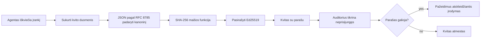
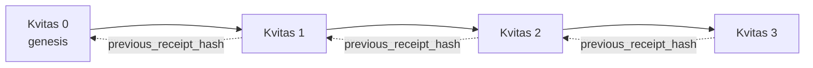

[Žiūrėkite pamokos vaizdo įrašą: AI agentų apsauga naudojant kriptografinius kvitus](https://youtu.be/PLACEHOLDER_VIDEO_ID)

> _(Pamokos vaizdo įrašą ir miniatiūrą po sujungimo pridės „Microsoft“ turinio komanda, atitinkančią pamokų 14 / 15 modelį.)_

# AI agentų apsauga naudojant kriptografinius kvitus

## Įvadas

Šioje pamokoje bus aptarta:

- Kodėl auditavimo įrašai AI agentams svarbūs atitikties, derinimo ir pasitikėjimo tikslais.
- Kas yra kriptografinis kvitas ir kuo jis skiriasi nuo pasirašymo neturinčios žurnalo eilutės.
- Kaip naudodami paprastą Python sukurti pasirašytą kvitą agento įrankio kvietimui.
- Kaip patikrinti kvitą neprisijungus ir aptikti klastojimą.
- Kaip sujungti kvitus į grandinę, kad pašalinus ar pakeitus vietomis vieną, grandinė nutrūktų.
- Ką kvitai įrodo ir ko jie aiškiai neįrodo.

## Mokymosi tikslai

Baigę šią pamoką jūs sužinosite, kaip:

- Identifikuoti gedimų režimus, kurie skatina kriptografinę agento veiksmų kilmės apsaugą.
- Sukurti Ed25519 pasirašytą kvitą kanoniniam JSON duomenų paketui.
- Nepriklausomai patikrinti kvitą naudojant tik viešąjį rakto.
- Aptikti klastojimą pakartotinai paleidžiant kvito patikrinimą pakeistame kvite.
- Sukurti maišinių kvitų grandinę ir paaiškinti, kodėl ši grandinė svarbi.
- Atpažinti ribą, ką kvitai įrodo (priskyrimą, vientisumą, tvarką), o ko neįrodo (veiksmų teisingumą, politikos pagrįstumą).

## Problema: Jūsų agento auditavimo įrašas

Įsivaizduokite, kad diegiate AI agentą „Contoso Travel“. Agentas skaito klientų užklausas, kreipiasi į skrydžių API, kad surastų variantus, ir rezervuoja vietas kliento vardu. Praėjusį ketvirtį agentas apdorojęs 50 000 rezervacijų.

Šiandien atvyksta auditas. Jie užduoda paprastą klausimą: „Parodykite, ką jūsų agentas atliko.“

Pateikiate žurnalų failus. Auditorius juos peržiūri ir užduoda sunkesnį klausimą: „Kaip žinau, kad šie žurnalai nebuvo redaguoti?“

Tai yra auditavimo įrašo problema. Dauguma agentų diegimų šiais laikais remiasi:

- **Programų žurnalais**: rašomi paties agento, juos gali redaguoti visi, turintys prieigą prie failų sistemos.
- **Debesų žurnalų paslaugomis**: netrukdomumo platformos lygmenyje garantija, bet tik jei auditorius pasitiki platformos operatoriumi.
- **Duomenų bazės sandorių žurnalais**: tinkami duomenų bazės pokyčiams, bet ne nepriklausomiems įrankių kvietimams.

Nė vienas iš šių šaltinių negali atsakyti auditoriaus klausimo nepasitikint kažkuo (jumis, jūsų debesijos tiekėju, duomenų bazės pardavėju). Vidiniam naudojimui toks pasitikėjimas dažnai priimtinas. Reguliuojamoms užduotims (finansai, sveikatos apsauga, ES AI įstatymo taikymo sritis) jis nepriimtinas.

Kriptografiniai kvitai išsprendžia šią problemą padarydami kiekvieną agento veiksmą nepriklausomai patikrinamą. Auditorius neturi pasitikėti jumis. Jiems tereikia jūsų viešojo rakto ir paties kvito.

## Kas yra kriptografinis kvitas?

Kvitas yra JSON objektas, įrašantis, ką agentas atliko, pasirašytas skaitmeniniu parašu.


```mermaid
flowchart LR
    A[Agentas iškviečia įrankį] --> B[Sukurti kvito duomenis]
    B --> C[JSON pagal RFC 8785 padaryti kanoninį]
    C --> D[SHA-256 maišos funkcija]
    D --> E[Pasirašyti Ed25519]
    E --> F[Kvitas su parašu]
    F --> G[Auditorius tikrina neprisijungęs]
    G --> H{Parašas galioja?}
    H -- yes --> I[Pažeidimus atskleidžiantis įrodymas]
    H -- no --> J[Kvitas atmestas]
```

Minimalus kvitas atrodo taip:

```json
{
  "type": "agent.tool_call.v1",
  "agent_id": "contoso-travel-bot",
  "tool_name": "lookup_flights",
  "tool_args_hash": "sha256:a3f9c1...",
  "result_hash": "sha256:7b2e1d...",
  "policy_id": "contoso-travel-policy-v3",
  "timestamp": "2026-04-25T14:30:00Z",
  "sequence": 47,
  "previous_receipt_hash": "sha256:9d4e6a...",
  "signature": {
    "alg": "EdDSA",
    "sig": "c5af83...",
    "public_key": "8f3b2c..."
  }
}
```

Trys savybės atlieka darbą:

1. **Parašas**. Kvitas pasirašomas agento vartai naudojant Ed25519 privatų raktą. Bet kas su atitinkamu viešuoju raktu gali patikrinti parašą neprisijungus. Bet koks lauko pakeitimas suardo parašą.

2. **Kanoninis kodavimas**. Prieš pasirašant kvitas serializuojamas naudojant JSON Kanonizavimo Schemos (JCS, RFC 8785). Tai užtikrina, kad dvi skirtingos implementacijos, kurios gamina tą patį loginį kvitą, sugeneruos identišką baitų srautą. Be kanonizavimo, skirtingi JSON seralizatoriai sukurtų skirtingus parašus tam pačiam turiniui.

3. **Maišos grandinimas**. Laukas `previous_receipt_hash` sujungia kiekvieną kvitą su ankstesniu. Išimant ar perrikiuojant kvitus, nutrūksta visi po to sekę kvitai. Klastojimas tampa matomas grandinės lygyje net jei pavieniai parašai apeinami.

Kartu šios savybės teikia tris garantijas:

- **Priskyrimas**: šiuo raktu pasirašytas šis turinys.
- **Vientisumas**: turinys nepasikeitė nuo pasirašymo momento.
- **Eiliškumas**: šis kvitas į grandinę įeina po to kvito.

## Kvito kūrimas Python kalba

Kvito kūrimui nereikia specialios bibliotekos. Kriptografiniai primityvai yra plačiai prieinami, o logika — kelių dešimčių Python eilučių.

Praktiniai užsiėmimai faile `code_samples/18-signed-receipts.ipynb` parodo visą srautą. Santrauka:

```python
import json
import hashlib
import base64
from nacl import signing
from jcs import canonicalize  # RFC 8785 kanoninis JSON

def b64url_nopad(data: bytes) -> str:
    return base64.urlsafe_b64encode(data).decode("ascii").rstrip("=")

def sha256_canonical(obj) -> str:
    """SHA-256 of a Python object's JCS-canonical JSON form."""
    return f"sha256:{hashlib.sha256(canonicalize(obj)).hexdigest()}"

# Generuoti arba įkelti pasirašymo raktą (gamyboje saugoti raktų saugykloje)
signing_key = signing.SigningKey.generate()
verify_key = signing_key.verify_key

# Sukurti kvito turinį (dar nėra parašo)
tool_args = {"origin": "SYD", "destination": "LAX"}
tool_result = [{"flight": "QF11", "price": 1850, "stops": 0}]

payload = {
    "type": "agent.tool_call.v1",
    "agent_id": "contoso-travel-bot",
    "tool_name": "lookup_flights",
    "tool_args_hash": sha256_canonical(tool_args),
    "result_hash": sha256_canonical(tool_result),
    "policy_id": "contoso-travel-policy-v3",
    "timestamp": "2026-04-25T14:30:00Z",
    "sequence": 0,
    "previous_receipt_hash": None,
}

# Kanonizuoti, maišyti, pasirašyti.
canonical_bytes = canonicalize(payload)
message_hash = hashlib.sha256(canonical_bytes).digest()
signature_bytes = signing_key.sign(message_hash).signature

# Pridėti struktūruotą parašo objektą.
receipt = {
    **payload,
    "signature": {
        "alg": "EdDSA",
        "sig": b64url_nopad(signature_bytes),
        "public_key": b64url_nopad(bytes(verify_key)),
    },
}
```

Tai visas pasirašymo vamzdis. Užduotys sąsiuvinyje supažindina su kiekvienu žingsniu.

## Kvito tikrinimas ir klastojimo aptikimas

Tikrinimas – tai atvirkštinis veiksmas:

```python
import base64
import hashlib
from nacl import signing
from nacl.exceptions import BadSignatureError
from jcs import canonicalize

def b64url_decode(s: str) -> bytes:
    padding = "=" * ((4 - len(s) % 4) % 4)
    return base64.urlsafe_b64decode(s + padding)

def verify_receipt(receipt: dict) -> bool:
    # Parašas yra struktūruotas objektas: {"alg", "sig", "public_key"}.
    sig_obj = receipt.get("signature")
    if not sig_obj or sig_obj.get("alg") != "EdDSA":
        return False

    # Atkurkite tikrąją pasirašytą duomenų dalį (visa, išskyrus parašą).
    payload = {k: v for k, v in receipt.items() if k != "signature"}

    canonical_bytes = canonicalize(payload)
    message_hash = hashlib.sha256(canonical_bytes).digest()

    try:
        verify_key = signing.VerifyKey(b64url_decode(sig_obj["public_key"]))
        verify_key.verify(message_hash, b64url_decode(sig_obj["sig"]))
        return True
    except BadSignatureError:
        return False
```

Ši funkcija priima kvitą ir grąžina `True`, jei parašas galiojantis, kitaip `False`. Nereikia jokio tinklo skambučio, jokio aptarnavimo priklausomybės, jokio pasitikėjimo trečiąja šalis.

Kad pamatytumėte klastojimo aptikimą veiksme, sąsiuvinyje atliekama:

1. Galiojančio kvito sukūrimas ir patvirtinimas.
2. Vieno baito lauke `tool_args_hash` pakeitimas.
3. Pakartotinis tikrinimas, kuris nepavyksta.

Tai praktinė demonstracija, kad kvitai yra klastojimui atsparūs: bet koks pakeitimas, net mažas, laužo parašą.

## Kvitų grandinimas kelių veiksmų agentams

Vienas pasirašytas kvitas saugo vieną veiksmą. Kvitų grandinė saugo seką.


```mermaid
flowchart LR
    R0[Kvitas 0<br/>genesis] --> R1[Kvitas 1]
    R1 --> R2[Kvitas 2]
    R2 --> R3[Kvitas 3]
    R1 -. previous_receipt_hash .-> R0
    R2 -. previous_receipt_hash .-> R1
    R3 -. previous_receipt_hash .-> R2
```

Kiekvienas kvitas įrašo ankstesnio kvito maišą. Norint tyliai pašalintį 2 kvitą, užpuolikas turėtų:

- Pakeisti 3 kvito lauką `previous_receipt_hash` (sugriūva 3 kvito parašas), ARBA
- Suklastoti naują parašą pakeistam 3 kvitui (reikia agento privataus rakto).

Jei privatus raktas saugomas aparatinėje raktų saugykloje ir viešasis raktas viešinamas su kiekvienu kvitu, nė vienas iš šių puolimų negalimas be aptikimo.

Sąsiuvinyje atliekama:

1. Trijų kvitų grandinės sudarymas.
2. Patikrinimas, ar kiekvieno kvito `previous_receipt_hash` atitinka tikrą ankstesnio kvito maišą.
3. Vieno kvito vidury pakeitimas ir matyti, kaip grandinė lūžta tik tame taške.

Taip sukuriamas auditavimo įrašas, kurį išorinis auditorius gali patikrinti nepasitikėdamas jumis.

## Ką kvitai įrodo (ir ko ne)

Tai svarbiausia pamokos dalis. Kvitai galingi, bet jų galia ribota.

**Kvitai įrodo tris dalykus:**

1. **Priskyrimą**: konkretus raktas pasirašė konkretų duomenų paketą.
2. **Vientisumą**: duomenys nuo pasirašymo nepasikeitė.
3. **Eilės tvarką**: šis kvitas į grandinę įdėtas po kito.

**Kvitai NEĮRODO:**

1. **Teisingumo**: kad agento veiksmas buvo teisingas. Kvitas gali būti pasirašytas ir už neteisingą atsakymą taip pat tvarkingai, kaip ir už teisingą.
2. **Politikos laikymosi**: kad politika nurodyta `policy_id` buvo tikrai įvertinta, arba kad ji būtų leidusi šį veiksmą, jei būtų tikrinta. Kvitas fiksuoja tai, ką teigiama, o ne tai, kas buvo vykdoma.
3. **Tapatybę už rakto ribų**: kvitas sako „šis raktas pasirašė šį turinį“, bet nesako „šis žmogus patvirtino“. Raktų susiejimas su asmeniu ar organizacija reikalauja papildomos tapatybės infrastruktūros (katalogo, viešųjų raktų registro ir pan.).
4. **Įvesties teisingumą**: jei agentas gauna suklastotą komandą ir veiksmingai pagal ją veikia, kvitas tiksliai fiksuoja veiksmą. Kvitai yra žemiau įvesties tikrinimo lygmens, o ne jo pakaitalas.

Ši riba svarbi dėl dviejų priežasčių:

- Ji nurodo, kam kvitai naudingi: agento elgesio auditui ir klastojimui atsparumui, net ir kylančiam per organizacijų ribas.
- Ji nurodo, kokių papildomų sluoksnių dar reikia: įvesties tikrinimo (Pamoka 6), politikos vykdymo (traukiama toliau trumpai) ir tapatybės infrastruktūros (nepamokos dalis).

Dažna klaida manyti, kad „turime kvitus“ reiškia „turime valdymą“. Ne. Kvitai yra pagrindas. Valdymas – tai sistema, kurią statote ant jų.

## Produkcijos nuorodos

Python kodas šioje pamokoje yra specialiai minimalus, kad galėtumėte kiekvieną eilutę perskaityti ir tiksliai suprasti, kas vyksta. Produkcijoje turite dvi galimybes:

1. **Kurtis tiesiogiai ant kriptografinių primityvų.** 50 eilučių, parodytų aukščiau, užtenka daugumai atvejų. PyNaCl (Ed25519) ir `jcs` paketas (kanoninis JSON) yra gerai palaikomos ir patikrintos bibliotekos.

2. **Naudoti produkcinę kvito biblioteką.** Keletas atviro kodo projektų įgyvendina tą patį modelį su papildomomis ypatybėmis (raktų sukimasis, paketinė patikra, JWK rinkinių platinimas, integracija su politikos varikliais):
   - Šios pamokos kvito formatas seka IETF Internet-Projektą (`draft-farley-acta-signed-receipts`), kuris šiuo metu yra standartizavimo procese.
   - Microsoft Agent Governance Toolkit sujungia kvitus su Cedar pagrindu veikiamais politikos sprendimais; žr. Tutorial 33 toje saugykloje kaip pilną pavyzdį.
   - Paketai `protect-mcp` (npm) ir `@veritasacta/verify` (npm) teikia Node implementaciją kvito pasirašymui ir neprisijungus patikrinimui, skirti bet kokiam MCP serveriui apsukti su klastojimui atspariu auditų įrašu.
   - **[nobulex](https://github.com/arian-gogani/nobulex)** Python SDK (`pip install nobulex`) teikia tą patį Ed25519 + JCS pasirašymo modelį Python kalboje su LangChain ir CrewAI integracijomis, taip pat publikuotais tarpinius patikros vektoriais ir atitikties žemėlapiu prisidėjusiu per [OWASP PR #2210](https://github.com/OWASP/CheatSheetSeries/pull/2210).

Sprendimas tarp savarankiško rašymo ir bibliotekos naudojimo analogiškas sprendimui tarp savos JWT bibliotekos rašymo ar išbandytos naudojimo: abu pagrįsti; biblioteka taupo laiką ir sumažina auditų plotą; nuo nulio rašant, privalote suprasti kiekvieną primityvą. Ši pamoka moko nuo nulio, kad turėtumėte pagrindą bet kuriam pasirinkimui.

## Žinių patikrinimas

Patikrinkite savo supratimą prieš pereinant prie praktinės užduoties.

**1. Kvitas pasirašytas Ed25519 privačiu agento raktu. Auditorius turi tik viešąjį raktą. Ar auditorius gali patikrinti kvitą neprisijungęs?**

<details>
<summary>Atsakymas</summary>

Taip. Ed25519 patikra reikalauja tik viešojo rakto ir pasirašytų baitų. Nėra tinklo skambučio, nėra paslaugų priklausomybės. Tai savybė, dėl kurios kvitai naudingi aplinkose be tinklo, tarp kelių organizacijų ar mažo pasitikėjimo audite.
</details>

**2. Užpuolikas pakeičia kvito lauką `policy_id`, tvirtindamas, kad jį valdė leistinesnė politika. Parašas buvo sudarytas ant originalaus duomenų paketo. Kas vyksta per patikrą?**

<details>
<summary>Atsakymas</summary>

Patikra nepavyksta. Parašas apskaičiuotas ant kanoninių originalaus duomenų baitų; bet koks lauko pakeitimas pakeičia kanoninius baitus, pakeičia SHA-256 maišą, todėl parašas tampa negaliojantis. Užpuolikas turėtų privatų raktą sukurti naują galiojantį parašą, kurio neturi.
</details>

**3. Kodėl kvitas turi `tool_args_hash` ir `result_hash`, o ne tiesioginius argumentus ir rezultatą?**

<details>
<summary>Atsakymas</summary>

Dvi priežastys. Pirmiausia, kvitas gali būti archyvuojamas arba perduodamas aplinkoje, kur žalos atskleidimas (asmens duomenų, verslo informacijos) problema. Maišai mažina kvito dydį ir saugo turinį privačiu; auditorius patikrina maišo sutapimą su atskirai saugomu tikru turiniu. Antra, maišai turi fiksuotą dydį; kvitas su maišais yra dydžio ribose nepriklausomai nuo įvesčių ir išvesčių dydžio.
</details>

**4. Laukas `previous_receipt_hash` susieja kiekvieną kvitą su ankstesniu. Jei užpuolikas tyliai ištrina vieną kvitą viduryje grandinės, kas tampa negaliojinga?**

<details>
<summary>Atsakymas</summary>

Visi kvitai, kurie ėjo po ištrintojo. Jų `previous_receipt_hash` laukai nebeatitinka tikros grandinės (nes nukreipė į neegzistuojantį kvitą arba į kitą ankstesnį kvitą). Norėdamas paslėpti ištrynimą, užpuolikas turėtų pakartotinai pasirašyti visus vėlesnius kvitus, tam reikalingas privatus raktas.
</details>

**5. Kvitas patikrinamas teisingai. Ar tai įrodo, kad agento veiksmas buvo teisingas, patikimas ar atitiko politiką?**

<details>
<summary>Atsakymas</summary>

Ne. Galiojantis kvitas įrodo tris dalykus: priskyrimą (šis raktas pasirašė šį turinį), vientisumą (turinys nepasikeitė) ir eilės tvarką (šis kvitas yra po kito). Jis NEĮRODO, kad veiksmas buvo teisingas, kad politika pagal `policy_id` buvo tikrai įvertinta ar kad agentas laikėsi visų taisyklių. Kvitai padaro agento elgesį auditabilų, bet ne visada teisingą. Tai svarbiausia pamokos riba.
</details>

## Praktinė užduotis

Atidarykite `code_samples/18-signed-receipts.ipynb` ir užbaikite visas keturias dalis:

1. **1 dalis**: Pasirašykite pirmą kvitą ir patikrinkite jį.
2. **2 dalis**: Padarykite pakeitimą kvite ir stebėkite, kaip nepavyksta patikra.
3. **3 dalis**: Sukurkite trijų kvitų grandinę ir patikrinkite jos vientisumą.
4. **4 dalis**: Pritaikykite modelį agentui, sukurto Microsoft Agent Framework: apsukite įrankio kvietimą kvito pasirašymu, tada nepriklausomai patikrinkite kvitą.


**Iššūkis papildomam pratęsimui 1:** išplėskite kvito schemą papildomu jūsų pasirinktu lauku (pavyzdžiui, užklausos ID sekimui), atnaujinkite kanoninį pasirašymo logiką, kad jį įtrauktumėte, ir patvirtinkite, kad kvitas vis dar sėkmingai pereina per patikrinimą. Tada pakeiskite lauką po pasirašymo ir patvirtinkite, kad patikrinimas nepavyksta. Tai verčia jus suprasti, kaip kiekvienas kanoninės koduotės baitas prisideda prie parašo.

**Iššūkis papildomam pratęsimui 2:** SHA-256 maišykite du savo kvitus kartu (sujunkite jų kanoninius baitus deterministine tvarka) ir įdėkite gautą santrauką kaip naują lauką trečiajame kvite prieš jį pasirašydami. Patikrinkite, ar visi trys kvitai vis dar sėkmingai pereina per patikrinimą. Jūs ką tik sukūrėte vieno žingsnio įtraukimo įrodymą: bet kuris turintis trečiąjį kvitą gali įrodyti, kad pirmieji du egzistavo tuo metu, kai jis buvo pasirašytas, nereikalaudamas atskleisti jų turinio. Tai yra modelis, kurį naudoja atrankiniu būdu atskleidžiami kvitai dideliu mastu (Merkle įsipareigojimai, RFC 6962).

## Išvada

Kriptografiniai kvitai suteikia DI agentams auditavimo pėdsaką, kuris yra:

- **Nepriklausomai patikrinamas**: bet kuri šalis, turinti viešąjį raktą, gali patikrinti, be jokios paslaugos priklausomybės.
- **Modifikaciją atpažįstantis**: bet koks pakeitimas neįgalina parašo.
- **Nešiojamas**: kvitas yra mažas JSON failas; jis gali būti archyvuojamas, perduodamas ir tikrinamas bet kur.
- **Atitinka standartus**: sukurtas naudojant Ed25519 (RFC 8032), JCS (RFC 8785) ir SHA-256, visas plačiai taikomas primityvas.

Jie nėra pakaitalas įvesties validacijai, politikos vykdymui ar tapatybės infrastruktūrai. Jie yra šių sluoksnių pagrindas. Kai diegiate agentus reglamentuojamoms darbo apkrovoms, daugiainstituciniams darbo srautams ar bet kokioje aplinkoje, kur būsimo audito asmens pasitikėjimas jumis negali būti laikomas savaime suprantamu, kvitai yra būdas padaryti auditavimo pėdsaką sąžiningą.

Svarbiausia išvada: kvitai įrodo, kas pasakė ką ir kada. Jie neįrodo, kad pasakyta buvo tiesa ar teisinga. Laikykite šį skirtumą griežtai. Tai skirtumas tarp sąžiningos kilmės sistemos ir klaidinančios.

## Produkcijos kontrolinis sąrašas

Kai būsite pasiruošę pereiti nuo šios pamokos prie kvitus pasirašančių agentų diegimo realioje aplinkoje:

- [ ] **Perkelkite pasirašymo raktą nuo kūrėjo nešiojamojo kompiuterio.** Naudokite Azure Key Vault, AWS KMS arba aparatūros saugumo modulį. Privatus raktas, kuris pasirašo jūsų kvitus, niekada neturi būti saugomas šaltinio kontrolėje arba paprastoje teksto formoje programų mašinose.
- [ ] **Paskelbkite viešąjį patikrinimo raktą.** Auditoriams jo reikia, kad patikrintų neprisijungus. Standartinis modelis yra JWK rinkinys gerai žinomoje URL vietoje (RFC 7517), pvz., `https://your-org.example.com/.well-known/agent-keys.json`.
- [ ] **Išorėje įtvirtinkite grandinės galvutės maišą.** Periodiškai įrašykite naujausio grandinės galvutės maišą į skaidrumo žurnalą (Sigstore Rekor, RFC 3161 laiko žyma arba antra vidinė sistema), kad išorinė šalis galėtų patvirtinti „ši grandinė egzistavo šiuo laiku“.
- [ ] **Saugojimas įrašų neištrinamas.** Tik pridėjimui skirtas bloko saugojimas (Azure Storage su nesunaikinamumo politikomis, AWS S3 Object Lock) užkerta kelią vidiniams vartotojams perrašyti istoriją saugyklos lygmenyje.
- [ ] **Nustatykite saugojimo laikotarpį.** Daugelis atitikties reikalavimų reikalauja daugelio metų saugojimo. Planuokite įrašų augimą (kiekvienas kvitas yra apie 500 baitų; agentas, atliekantis 10 tūkst. užklausų per dieną, sugeneruoja apie 1,8 GB per metus).
- [ ] **Dokumentuokite, ko kvitai neapima.** Kvituose įrodyta priskyrimas, vientisumas ir tvarka. Jūsų veiklos vadove turėtų būti aiškiai nurodyta, kokios papildomos kontrolės (įvesties patikrinimas, politikos vykdymas, greičio ribojimas, tapatybės infrastruktūra) yra greta kvitų jūsų valdymo požiūryje.

### Turite daugiau klausimų apie DI agentų užtikrinimą?

Prisijunkite prie [Microsoft Foundry Discord](https://aka.ms/ai-agents/discord), susitikite su kitais besimokančiais, dalyvaukite konsultacijose ir gaukite atsakymus į savo DI agentų klausimus.

## Toliau už šios pamokos ribų

Ši pamoka apima vieno kvito pasirašymą ir maišų grandinės sekas. Tie patys primityvai sudaro kelis pažangesnius modelius, su kuriais galite susidurti, kai jūsų valdymo požiūris brandėja:

- **Atrankinis atskleidimas.** Kai kvito laukai yra nepriklausomai įsipareigoti (RFC 6962 stiliaus Merklės medis), galite atskleisti konkrečius laukus konkretiems auditoriams ir įrodyti, kad likę nepasikeitė, jų neišduodami. Naudinga kai tas pats kvitas turi tenkinti ir išsamų auditą (reikalaujantį pilnumo), ir duomenų minimalizavimo reglamentus kaip GDPR (norint, jog auditorius matytų kuo mažiau).
- **Kvitų atšaukimas.** Jei pasirašymo raktas pažeidžiamas, reikia būdo pažymėti visus to rakto pasirašytus kvitus kaip nepatikimus nuo tam tikro laiko. Standartiniai modeliai: trumpalaikiai pasirašymo raktai kartu su paskelbta atšaukimo lista, arba skaidrumo žurnalas su atšaukimo įrašais.
- **Dvipusiai / dalinti parašo kvitai.** Kai kurios įgyvendinimo versijos padalija pasirašytą turinį į priešvykdymo (`authorization_*`) ir po vykdymo (`result_*`) puses su nepriklausomais parašais, naudinga kai autorizacijos sprendimą ir stebėtą rezultatą generuoja skirtingi asmenys arba skirtingu metu. Tai sudaro papildomą sluoksnį kvito formate, mokomame šioje pamokoje.
- **Turinio sudėtis.** Kvitas užantspauduoją bet kokius baitus, kuriuos dedate į `result_hash`. Realių pasaulio turiniai dažnai yra turtingesni už vieno įrankio rezultato kvitą: priešsprendiminis svarstymas (modelio prognozė, apsvarstyti variantai, įrodymai ir jų pilnumas, rizikos požiūris, atsakomybės grandinė, vartų rezultatas) gali būti įtrauktas į turinį, užantspauduotą vienu kvitu. Tai leidžia kvito formatą laikyti minimalistiniu, leidžiant domenų po domeno vystyti turinio schemas.
- **Tarpinės įgyvendinimo atitikties užtikrinimas.** Keli nepriklausomi tos pačios kvito formato įgyvendinimai (Python, TypeScript, Rust, Go) kryžminiai tikrina su bendrais testų vektoriais. Jei kuriate savo įgyvendinimą, patikrinimas prieš paskelbtus vektorius patvirtina laidų suderinamumą.
- **Post-kvantinė migracija.** Ed25519 šiandien plačiai naudojamas, bet nėra kvantinėms atakoms atsparus. Kvito formatas yra algoritmiškai lankstus: `signature.alg` lauką galima užpildyti `ML-DSA-65` (NIST post-kvantinio parašo standartas), kai reikia pereiti. Planuokite pereinamojo laikotarpio, kai kvitai bus dvikart pasirašyti.

## Papildomi ištekliai

- <a href="https://datatracker.ietf.org/doc/draft-farley-acta-signed-receipts/" target="_blank">IETF Interneto projektas: pasirašyti sprendimų kvitai mašinų tarpusavio prieigos kontrolei</a>
- <a href="https://learn.microsoft.com/azure/ai-studio/responsible-use-of-ai-overview" target="_blank">Atsakingas DI naudojimas (Azure AI)</a>
- <a href="https://datatracker.ietf.org/doc/html/rfc8032" target="_blank">RFC 8032: Edvardo kreivės skaitmeninių parašų algoritmas (EdDSA)</a>
- <a href="https://datatracker.ietf.org/doc/html/rfc8785" target="_blank">RFC 8785: JSON kanonizavimo schema (JCS)</a>
- <a href="https://datatracker.ietf.org/doc/html/rfc6962" target="_blank">RFC 6962: Sertifikatų skaidrumas</a> (Merkle medžio struktūra, naudojama atrankinio atskleidimo kvituose)
- <a href="https://github.com/microsoft/agent-governance-toolkit/blob/main/docs/tutorials/33-offline-verifiable-receipts.md" target="_blank">Microsoft Agent Governance Toolkit, pamoka 33: neprisijungus patikrinami sprendimų kvitai</a>
- <a href="https://github.com/ScopeBlind/agent-governance-testvectors" target="_blank">Tarpgrįžtamo įgyvendinimo atitikties testų vektoriai</a> kvito formatui, naudotam šioje pamokoje (Apache-2.0)
- <a href="https://pynacl.readthedocs.io/" target="_blank">PyNaCl dokumentacija</a> (Ed25519 Python kalboje)

## Ankstesnė pamoka

[Kompiuterio naudojimo agentų kūrimas (CUA)](../15-browser-use/README.md)

---

<!-- CO-OP TRANSLATOR DISCLAIMER START -->
**Atsakomybės apribojimas**:
Šis dokumentas buvo išverstas naudojant dirbtinio intelekto vertimo paslaugą [Co-op Translator](https://github.com/Azure/co-op-translator). Nors siekiame tikslumo, prašome atkreipti dėmesį, kad automatiniai vertimai gali turėti klaidų ar netikslumų. Originalus dokumentas jo gimtąja kalba laikomas autoritetingu šaltiniu. Svarbiai informacijai rekomenduojama naudoti profesionalų žmogiškąjį vertimą. Mes neatsakome už jokius nesusipratimus ar neteisingą interpretaciją, kilusią naudojantis šiuo vertimu.
<!-- CO-OP TRANSLATOR DISCLAIMER END -->