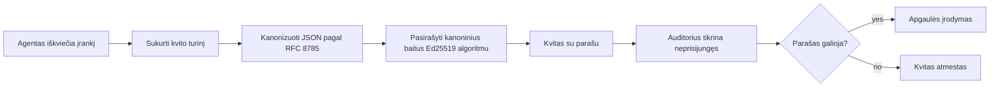
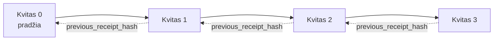

[Peržiūrėkite pamokos vaizdo įrašą: Dirbtinio intelekto agentų apsaugos naudojant kriptografines kvitus](https://youtu.be/PLACEHOLDER_VIDEO_ID)

> _(Pamokos vaizdo įrašas ir miniatiūra bus pridėti „Microsoft“ turinio komandos po merginimo, atitinkant pamokų 14 / 15 modelį.)_

# Dirbtinio intelekto agentų apsauga naudojant kriptografinius kvitus

## Įvadas

Šioje pamokoje sužinosite:

- Kodėl auditų įrašai AI agentams yra svarbūs atitikčiai, derinimui ir pasitikėjimui.
- Kas yra kriptografinis kvitas ir kuo jis skiriasi nuo nesuformatuoto žurnalo įrašo.
- Kaip sukuriamas pasirašytas kvitas už agento įrankio iškvietimą paprastame Python.
- Kaip patikrinti kvitą neprisijungus ir aptikti klastojimą.
- Kaip sujungti kvitus grandinėle, kad pašalinus arba pakeitus jų tvarką grandinė būtų sulaužyta.
- Ką kvitai įrodo ir ką jie aiškiai neįrodo.

## Mokymosi tikslai

Užbaigus šią pamoką, žinosite, kaip:

- Nustatyti gedimo būdus, lemiančius kriptografinį agento veiksmų kilmės patvirtinimą.
- Sukurti Ed25519 pasirašytą kvitą pagal kanoninį JSON paketą.
- Nepriklausomai patikrinti kvitą naudodami tik pasirašiusiojo viešąjį raktą.
- Aptikti klastojimą vėl paleidžiant patikrinimą su pakeistu kvitu.
- Sukurti kvitų seką, grandinėta maišos būdu, ir paaiškinti, kodėl ši grandinė svarbi.
- Atpažinti ribą tarp to, ką kvitai įrodo (priskyrimą, vientisumą, tvarką) ir ko neįrodo (veiksmo tikslumo, politikos pagrįstumo).

## Problema: Jūsų agento audito įrašas

Įsivaizduokite, kad paleidote dirbtinio intelekto agentą Contoso Travel. Agentas skaito klientų užklausas, kreipiasi į aviakompanijų API ieškodamas skrydžių galimybių ir užsako vietas klientų vardu. Praėjusį ketvirtį agentas apdorodavo 50 000 užsakymų.

Šiandien atvyksta auditorius. Jis užduoda paprastą klausimą: „Parodykite, ką jūsų agentas veikė.“

Jūs perduodate žurnalo failus. Auditorius juos peržiūri ir užduoda sunkesnį klausimą: „Kaip žinau, kad šie žurnalai nebuvo redaguoti?“

Tai yra audito įrašo problema. Dauguma šiandieninių agento diegimų remiasi:

- **Programos žurnalais**: rašomais pačio agento ir redaguojamais bet kieno, turinčio prieigą prie failų sistemos.
- **Debesų žurnalų paslaugomis**: sugadinimo aptikimas vyksta platformos lygmeniu, bet tik jei auditorius pasitiki platformos operatoriumi.
- **Duomenų bazės sandorių žurnalais**: gerai tinka duomenų bazės pakeitimams, bet ne bet kokiems įrankių iškvietimams.

Niekas iš šių negali atsakyti auditoriaus klausimo be to, kad auditorius turėtų pasitikėti kažkuo (jumis, jūsų debesijos tiekėju, duomenų bazės tiekėju). Vidiniam naudojimui toks pasitikėjimas dažnai būna priimtinas. Reguliuojamose srityse (finansai, sveikatos apsauga, ką reglamentuoja ES DI įstatymas) tai nepriimtina.

Kriptografiniai kvitai išsprendžia šią problemą – kiekvienas agento veiksmas tampa nepriklausomai patikrintinas. Auditorius neprivalo pasitikėti jumis, jam tereikia jūsų viešojo rakto ir paties kvito.

## Kas yra kriptografinis kvitas?

Kvitas yra JSON objektas, fiksuojantis, ką agentas padarė, ir pasirašytas skaitmeniniu parašu.


```mermaid
flowchart LR
    A[Agentas iškviečia įrankį] --> B[Sukurti kvito turinį]
    B --> C[Kanonizuoti JSON pagal RFC 8785]
    C --> E[Pasirašyti kanoninius baitus Ed25519 algoritmu]
    E --> F[Kvitas su parašu]
    F --> G[Auditorius tikrina neprisijungęs]
    G --> H{Parašas galioja?}
    H -- yes --> I[Apgaulės įrodymas]
    H -- no --> J[Kvitas atmestas]
```

Minimalus kvitas atrodo taip:

```json
{
  "type": "agent.tool_call.v1",
  "agent_id": "contoso-travel-bot",
  "tool_name": "lookup_flights",
  "tool_args_hash": "sha256:a3f9c1...",
  "result_hash": "sha256:7b2e1d...",
  "policy_id": "contoso-travel-policy-v3",
  "timestamp": "2026-04-25T14:30:00Z",
  "sequence": 47,
  "previous_receipt_hash": "sha256:9d4e6a...",
  "signature": {
    "alg": "EdDSA",
    "sig": "c5af83...",
    "public_key": "8f3b2c..."
  }
}
```

Trys ypatybės atlieka darbą:

1. **Parašas**. Kvitas pasirašytas agento vartų naudojant Ed25519 privatų raktą. Bet kas su atitinkamu viešuoju raktu gali neprisijungęs patikrinti parašą. Kiekvienas lauko sukeitimas paneigia parašą.

2. **Kanoniškas kodavimas**. Prieš pasirašant kvitas seralizuojamas naudojant JSON Kanonizavimo schemą (JCS, RFC 8785). Tai užtikrina, kad dvi implementacijos gaminančios tą patį loginį kvitą pasiūlys bitų identišką išvestį. Be kanonizavimo skirtingi JSON seralizatoriai duotų skirtingus parašus tokiam pačiam turiniui.

3. **Maišos grandinėlė**. Laukas `previous_receipt_hash` jungia kiekvieną kvitą su prieš tai buvusiu. Kvito pašalinimas ar tvarkos pakeitimas sulaužo visus po jo einančius kvitus. Klastojimas tampa matomas grandinės lygmeniu, net jei atskirų parašų bus apeita.

Kartu šios ypatybės suteikia tris garantijas:

- **Priskyrimą**: šis raktas pasirašė šį turinį.
- **Vientisumą**: turinys nuo pasirašymo nepasikeitė.
- **Tvarką**: šis kvitas buvo po to kvito grandinėje.

## Kvito kūrimas Python kalba

Kvitui sukurti nereikia specialių bibliotekų. Kriptografiniai primityvai plačiai prieinami, o logika – vos keliolika eilučių Python.

Praktinės užduotys faile `code_samples/18-signed-receipts.ipynb` žingsnis po žingsnio parodo visą srautą. Santraukos versija:

```python
import json
import hashlib
import base64
from nacl import signing
from jcs import canonicalize  # RFC 8785 kanoninis JSON

def b64url_nopad(data: bytes) -> str:
    return base64.urlsafe_b64encode(data).decode("ascii").rstrip("=")

def sha256_canonical(obj) -> str:
    """SHA-256 of a Python object's JCS-canonical JSON form."""
    return f"sha256:{hashlib.sha256(canonicalize(obj)).hexdigest()}"

# Generuoti arba įkelti pasirašymo raktą (gamyboje saugoti rakto saugykloje)
signing_key = signing.SigningKey.generate()
verify_key = signing_key.verify_key

# Sukurti kvito užklausos duomenis (dar be parašo)
tool_args = {"origin": "SYD", "destination": "LAX"}
tool_result = [{"flight": "QF11", "price": 1850, "stops": 0}]

payload = {
    "type": "agent.tool_call.v1",
    "agent_id": "contoso-travel-bot",
    "tool_name": "lookup_flights",
    "tool_args_hash": sha256_canonical(tool_args),
    "result_hash": sha256_canonical(tool_result),
    "policy_id": "contoso-travel-policy-v3",
    "timestamp": "2026-04-25T14:30:00Z",
    "sequence": 0,
    "previous_receipt_hash": None,
}

# Kanonizuoti ir pasirašyti JCS baitus tiesiogiai. PureEdDSA viduje atlieka maišymą.
canonical_bytes = canonicalize(payload)
signature_bytes = signing_key.sign(canonical_bytes).signature

# Pridėti struktūruotą parašo objektą.
receipt = {
    **payload,
    "signature": {
        "alg": "EdDSA",
        "sig": b64url_nopad(signature_bytes),
        "public_key": b64url_nopad(bytes(verify_key)),
    },
}
```

Tai visas pasirašymo procesas. Užduotys sąsiuvinyje paaiškina kiekvieną žingsnį.

## Kvito tikrinimas ir klastojimo aptikimas

Tikrinimas yra atvirkštinis procesas:

```python
import base64
import hashlib
from nacl import signing
from nacl.exceptions import BadSignatureError
from jcs import canonicalize

def b64url_decode(s: str) -> bytes:
    padding = "=" * ((4 - len(s) % 4) % 4)
    return base64.urlsafe_b64decode(s + padding)

def verify_receipt(receipt: dict) -> bool:
    # Parašas yra struktūruotas objektas: {"alg", "sig", "public_key"}.
    sig_obj = receipt.get("signature")
    if not sig_obj or sig_obj.get("alg") != "EdDSA":
        return False

    # Atkurkite faktinį pasirašytą turinį (viską, išskyrus parašą).
    payload = {k: v for k, v in receipt.items() if k != "signature"}

    canonical_bytes = canonicalize(payload)

    try:
        verify_key = signing.VerifyKey(b64url_decode(sig_obj["public_key"]))
        verify_key.verify(canonical_bytes, b64url_decode(sig_obj["sig"]))
        return True
    except BadSignatureError:
        return False
```

Ši funkcija priima kvitą ir grąžina `True`, jei parašas galioja, priešingu atveju – `False`. Nereikia jokių tinklo užklausų, paslaugų priklausomybių ar jokio trečiųjų šalių pasitikėjimo.

Kad pamatytumėte klastojimo aptikimo veikimą, sąsiuvinis demonstruoja:

1. Galiojančio kvito kūrimą ir jo tikrinimo patvirtinimą.
2. Vieno baito pakeitimą `tool_args_hash` lauke.
3. Pakartotinį tikrinimą, kur bandymas žlunga.

Tai praktinis įrodymas, kad kvitai yra klastojimui atsparūs: bet koks pakeitimas, kokio masto bebūtų, sulaužo parašą.

## Kvito grandinavimas daugiažingsniams agentams

Vienas pasirašytas kvitas saugo vieną veiksmą. Kvito grandinė saugo veiksmų seką.


```mermaid
flowchart LR
    R0[Kvitas 0<br/>pradžia] --> R1[Kvitas 1]
    R1 --> R2[Kvitas 2]
    R2 --> R3[Kvitas 3]
    R1 -. previous_receipt_hash .-> R0
    R2 -. previous_receipt_hash .-> R1
    R3 -. previous_receipt_hash .-> R2
```

Kiekvienas kvitas fiksuoja prieš jį būvusio kvito maišą. Norint negirdimai pašalinti kvitą 2, atakantas turėtų arba:

- Pakeisti kvito 3 lauką `previous_receipt_hash` (sulaužytų kvito 3 parašą), ARBA
- Suprasti naują parašą modifikuotam kvitui 3 (reikalautų agento privataus rakto).

Jei privatus raktas saugomas aparatinėje rakto saugykloje ir viešasis raktas viešinamas su kiekvienu kvitu, nė viena iš atakų nėra įmanoma nepastebimai.

Sąsiuvinis demonstruoja:

1. Trijų kvitų grandinės kūrimą.
2. Patikrinimą, kad kiekvieno kvito laukas `previous_receipt_hash` atitinka ankstesnio kvito faktinį maišą.
3. Kvitų vidurio pakeitimą ir grandinės sulaužymą būtent tame taške.

Taip sukuriamas audito įrašas, kurį išorinis auditorius gali patikrinti nepasitikėdamas jumis.

## Ką kvitai įrodo (ir ko ne)

Tai svarbiausia šios pamokos dalis. Kvito galia didelė, bet ribota.

**Kvitai įrodo tris dalykus:**

1. **Priskyrimą**: konkretus raktas pasirašė konkretų paketą.
2. **Vientisumą**: paketas nuo pasirašymo nepasikeitė.
3. **Tvarką**: šis kvitas buvo po to kvito maišos grandinėje.

**Kvitai neįrodo:**

1. **Teisingumo**: kad agento veiksmas buvo teisingas. Kvitas gali būti pasirašytas tiek už neteisingą, tiek už teisingą atsakymą vienodai.
2. **Politikos laikymosi**: kad `policy_id` nurodyta politika faktiškai buvo įvertinta arba leido šį veiksmą, jei buvo patikrinta. Kvitas fiksuoja, kas teigiama, o ne kas vykdyta.
3. **Tapatybę už rakto ribų**: kvitas sako „šis raktas pasirašė šį turinį“, bet nesako „šį veiksmą patvirtino žmogus“. Raktą su asmeniu ar organizacija sujungti reikia atskiros tapatybės infrastruktūros (adresaro, viešųjų rakto registracijos ir pan.).
4. **Įvesčių tiesumą**: jei agentui pateikiama suklastota užklausa ir jis pagal ją veikia, kvitas tiksliai fiksuoja veiksmą. Kvitai yra po įvesties validacijos, o ne jos pakaitalas.

Ši riba svarbi dėl dviejų priežasčių:

- Ji nurodo, kam kvitai naudingi: daro agento elgesį auditabilų ir klastojimui atsparų, net tarp organizacijų ribų.
- Ji nurodo, kokių papildomų sluoksnių dar reikia: įvesties validacijos (6 pamoka), politikos vykdymo (žemiau trumpai aprašyta) ir tapatybės infrastruktūros (nenagrinėjama šioje pamokoje).

Dažna klaida manyti, kad „turime kvitus“ reiškia „mes esame valdomi“. Ne. Kvitai yra pagrindas, o valdymas – sistema, kurią ant jo statote.

## Įrodymas, kad žmogus patvirtino tikslų veiksmą

3 punktas viršuje vertas atskiros sekcijos: veiksmo kvitas sako „šis raktas pasirašė šį turinį“, bet niekada nepasako „žmogus tai patvirtino“. Didelės rizikos veiksmams (grąžinimai, ištrynimai, pervedimai) valdymo sistemos vis dažniau reikalauja būtent tokio trūkstamo pareiškimo, kuris sukuriamas tos pačios pamokos primityvais, kurie jau nagrinėti.

Tolimesnis sąsiuvinis `code_samples/human-authorization-receipts.ipynb` įveda antrą kvito tipą, `human.approval.v1`, tokį pat 'voką' kaip pamokos kvitai (tipizuotas paketas pasirašytas Ed25519 ant kanoninių JCS baitų, su `signature` objektu už pasirašytų baitų ribų). Pavadintas patvirtintojas pasirašo **pilną kanoninį veiksmą ir jo santrauką** prieš vykdymą; agento veiksmo kvitas neša **tą patį veiksmų santrauką** ir `parent_approval_ref` – tvirtinimo `receipt_hash`. Tai ta pati konvencija kaip `previous_receipt_hash` grandinėje, kurią sukūrėte aukščiau. Viena `verify_chain` funkcija patikrina abu artefaktus per **atskirus pasirinktinai fiksuotus raktų registrus** (patvirtintojų raktus ir agentų raktus), todėl kodas bendras, bet institucijos niekados nesikerta.

Turima savybė, išsakyta tiksliai: *žmogus patvirtino būtent šį veiksmą, o agentas įvykdė būtent tą patvirtintą veiksmą.* Sąsiuvinio draudimo priemonės tai paverčia tikrove, o ne tik teiginiu:

- klasikinės problemos: klastojimas, neteisingas tarpininkas, pakartotiniai veiksmai, padirbti raktai bet kurioje pusėje, netinkamas įvesties formatas;
- **pasenusi institucija**: parašas vis dar verifikuojamas, bet nepavyksta, nes politiko versija pasikeitė, patvirtintojų raktas pašalintas iš fiksuotų arba patvirtinimo galiojimas baigėsi prieš vykdymą;
- **santraukos pakeitimas**: galiojančiai pasirašytas veiksmo kvitas rodo į *tikrą* patvirtinimą, kurį sieja su *kitokiu* kanoniniu veiksmu.

Kiekvienas atsisakymas grąžinamas su aiškia priežastimi, todėl auditorius galės atskirti, ar pasenusi institucija, ar pasikeitė vykdomas veiksmas. Sąsiuvinio taisyklė: pasirašytas patvirtinimas savaime nėra institucija. Institucija egzistuoja tik jei abu kvitai vis dar siejasi su ta pačia kanonine veiksmo versija vykdymo metu. Žmogaus patvirtinimo kvitas yra mokomoji kompozicija, sukurta šios pamokos, o ne kvito tipas, nurodytas `draft-farley-acta-signed-receipts`.

## Gamminiai pasirinkimai

Python kodas šioje pamokoje sąmoningai minimalus, kad galėtumėte perskaityti kiekvieną eilutę ir tiksliai suprasti, kas vyksta. Gamminėse aplinkose turite dvi galimybes:

1. **Tiesiogiai naudoti kriptografinius primityvus.** Aukščiau matyti 50 eilučių pakanka daugeliui atvejų. PyNaCl (Ed25519) ir `jcs` paketas (kanoninis JSON) yra gerai prižiūrimos ir tikrintos bibliotekos.

2. **Naudoti gamminę kvitų biblioteką.** Keletas atvirojo kodo projektų įgyvendina tą patį modelį su papildomomis funkcijomis (rakto rotacija, partijų tikrinimas, JWK rinkinio platinimas, integracija su politikos varikliais):
   - Pasirašymo srautas remiasi JCS ir parašo taikymo konvencijomis nepriklausomame IETF interneto projekte ([`draft-farley-acta-signed-receipts`](https://datatracker.ietf.org/doc/draft-farley-acta-signed-receipts/), 02 redakcija). Šios pamokos plokščias edukacinis kvitas skiriasi nuo projekto `{payload, signature}` formato ir nėra pristatomas kaip atitinkantis standartą. Projektas pateikia bendrą kokybės testų rinkinį ([agent-governance-testvectors](https://github.com/ScopeBlind/agent-governance-testvectors)) įgyvendinimams, taikantiems jo formatą.
   - Microsoft Agent Governance Toolkit jungia kvitus su Cedar politinių sprendimų sistema; susipažinkite su 33 pamokos pavyzdžiu šiame saugykloje visapusiškai demonstracijai.
   - Paketai `protect-mcp` (npm) ir `@veritasacta/verify` (npm) teikia Node.js įgyvendinimą kvitų pasirašymo ir neprisijungus tikrinimo, skirtas pritaikyti bet kokiam MCP serveriui su klastojimui atspariu audito įrašu, įskaitant veiksmo sustabdymo patvirtinimo kvito srautą (WebAuthn palaikymas darbalaukio versijoje), taip pat žmogaus patvirtinimo kvito modelį, aprašytą žmogaus autorizavimo sąsiuvinyje.
   - Python SDK **[nobulex](https://github.com/arian-gogani/nobulex)** (`pip install nobulex`) teikia tą patį Ed25519 + JCS pasirašymo modelį su LangChain ir CrewAI integracijomis, įskaitant paskelbtus kryžminius testavimo vektorius ir atitikties žemėlapį, prisidėtą per [OWASP PR #2210](https://github.com/OWASP/CheatSheetSeries/pull/2210).

Sprendimas rinktis savo ar biblioteką primena klausimą tarp savo JWT bibliotekos rašymo ir patikrintos naudojimo: abu variantai yra pagrįsti; biblioteka sutaupo laiką ir sumažina riziką; savarankiškas variantas verčia suprasti kiekvieną primityvą. Ši pamoka moko savarankiško kelio, kad turėtumėte pagrindą bet kuriam pasirinkimui.

## Žinių patikrinimas

Išbandykite savo supratimą prieš pereidami prie praktinės užduoties.

**1. Kvitas pasirašomas agento privačiu Ed25519 raktu. Auditorius turi tik viešąjį raktą. Ar auditorius gali patikrinti kvitą neprisijungęs?**

<details>
<summary>Atsakymas</summary>

Taip. Ed25519 patikrinimui reikalingas tik viešasis raktas ir pasirašyti baitai. Nereikia jokių tinklo užklausų ar paslaugų priklausomybių. Ši savybė daro kvitus naudingais naudoti atjungtose, tarporganizacinėse ar mažo pasitikėjimo audito aplinkose.
</details>

**2. Atakantas pakeičia kvito lauką `policy_id`, kad teigti, jog jis tvarkytas pagal lepesnę politiką. Parašas buvo originaliam paketui. Kas nutinka tikrinimo metu?**

<details>
<summary>Atsakymas</summary>


Patikra nepavyko. Parašas buvo apskaičiuotas ant originalios naštos kanoninių baitų; modifikuojant bet kurį lauką, keičiasi šie baitai, todėl parašas tampa nebegaliojantis. Užpuolikui reikėtų privatųjį raktą, kad sukurtų naują galiojantį parašą, kurio jis neturi.
</details>

**3. Kodėl kvite yra `tool_args_hash` ir `result_hash`, o ne žaliaviniai argumentai ir rezultatas?**

<details>
<summary>Atsakymas</summary>

Dvi priežastys. Pirma, kvitas gali būti archyvuojamas arba perduodamas aplinkose, kur yra problema išskleisti žaliavinį turinį (asmens duomenis, verslo informaciją). Maišos funkcija išlaiko kvitą mažą ir turinį privatumą; auditorius patikrina, kad maišos sutampa su atskirai saugoma tikrojo turinio kopija. Antra, maišos turi fiksuotą dydį; kvito su maišomis dydis yra ribotas, nepriklausomai nuo to, kokie dideli buvo įėjimai ir rezultatai.
</details>

**4. Laukas `previous_receipt_hash` susieja kiekvieną kvitą su jo pirmtaku. Jei užpuolikas tyliai ištrina vieną kvitą grandinės viduryje, kas tampa nebegaliojančiu?**

<details>
<summary>Atsakymas</summary>

Visi kvitai, kurie buvo po ištrintojo. Jų laukai `previous_receipt_hash` nebeatitinka tikros grandinės (nes kvitas, į kurį jie nurodė, nebėra, arba grandinė dabar nurodo kitą pirmtaką). Norėdamas paslėpti ištrynimą, užpuolikas turėtų iš naujo pasirašyti kiekvieną vėlesnį kvitą, o tam reikia privataus rakto.
</details>

**5. Kvitą galima sėkmingai patikrinti. Ar tai įrodo, kad agento veiksmas buvo teisingas, pagrįstas ar atitiko politiką?**

<details>
<summary>Atsakymas</summary>

Ne. Galiojantis kvitas įrodo tris dalykus: priskyrimą (šiuo raktu buvo pasirašytas šis turinys), vientisumą (turinys nebuvo pakeistas) ir tvarką (šis kvitas atėjo po to kvito). Tai NEĮRODO, kad veiksmas buvo teisingas, kad politika nurodyta lauke `policy_id` tikrai buvo įvertinta, ar kad agentas laikėsi visų taisyklių. Kvitai daro agentų elgesį auditabilų, bet ne būtinai teisingą. Tai svarbiausia pamokos riba.
</details>

## Praktinė užduotis

Atidarykite `code_samples/18-signed-receipts.ipynb` ir užbaikite visas keturias dalis:

1. **1 dalis**: Pasirašykite savo pirmą kvitą ir patikrinkite jį.
2. **2 dalis**: Pakeiskite kvitą ir stebėkite, kaip nepavyksta patikra.
3. **3 dalis**: Sukurkite trijų kvitų grandinę ir patikrinkite grandinės vientisumą.
4. **4 dalis**: Pritaikykite šį modelį agentui, pastatytam su Microsoft Agent Framework: įvyniokite įrankio kvietimą į kvito pasirašymą, tada patikrinkite kvitą nepriklausomai.

**Iššūkis 1:** išplėskite kvito schemą papildomu lauku, kurį pasirenkate patys (pavyzdžiui, užklausos ID sekimui), atnaujinkite kanoninį pasirašymo logiką, kad jį įtrauktumėte, ir įsitikinkite, kad kvitas vis dar sklandžiai patikrinamas. Tada pakeiskite lauką po pasirašymo ir patikrinkite, kad patikra nepavyksta. Tai verčia jus suprasti, kaip kiekvienas kanoninės koduotės baitas prisideda prie parašo.

**Iššūkis 2:** sujunkite du savo kvitus naudodami SHA-256 maišą (sujunkite jų kanoninius baitus deterministiniu tvarka) ir pirmo maišo rezultatą įterpkite kaip naują lauką trečiame kvite prieš pasirašymą. Patikrinkite, kad visi trys kvitai vis dar sklandžiai patikrinami. Jūs ką tik sukūrėte vieno žingsnio įtraukimo įrodymą: bet kas turintis trečią kvitą gali įrodyti, kad pirmi du egzistavo tuo pasirašymo metu, neatskleisdamas jų turinio. Tai modelis, kurį masiškai naudoja selektyvaus atskleidimo kvitai (Merkle įsipareigojimai, RFC 6962).

## Išvada

Kriptografiniai kvitai suteikia DI agentams audito kelią, kuris yra:

- **Nepriklausomai patikrinamas**: bet kuri šalis su viešuoju raktu gali patikrinti, nereikia jokios paslaugos priklausomybės.
- **Pakeitimams atsparus**: bet koks pakeitimas priverčia parašą tapti nebegaliojančiu.
- **Nešiojamas**: kvitas yra mažas JSON failas; jį galima archyvuoti, perduoti ir patikrinti bet kur.
- **Atitinkantis standartus**: pastatytas ant Ed25519 (RFC 8032), JCS (RFC 8785) ir SHA-256 – visos plačiai taikomos prigimtys.

Jie nėra įvesties validacijos, politikos vykdymo ar tapatybės infrastruktūros pakaitalas. Jie yra pagrindas tiems sluoksniams. Kai diegiate agentus reguliuojamuose darbo krūviuose, tarporganizaciniuose veiklose ar bet kur, kur būsimasis auditorius negali būti laikomas pasitikinčiu jumis, kvitai yra tai, kaip jūs padarote audito kelią sąžiningu.

Svarbiausias dalykas: kvitai įrodo, kas ką sakė ir kada. Jie neįrodo, kad tai, kas buvo pasakyta, buvo tiesa ar teisinga. Laikykite šį skirtumą griežtai. Tai skirtumas tarp sąžiningos kilmės sistemos ir klaidžinančios.

## Gamybinis kontrolinis sąrašas

Kai būsite pasiruošę pereiti nuo šios pamokos prie kvitus pasirašančių agentų diegimo realioje aplinkoje:

- [ ] **Perkelkite pasirašymo raktą nuo kūrėjo nešiojamojo kompiuterio.** Naudokite Azure Key Vault, AWS KMS arba aparatinį saugumo modulį. Privatus raktas, pasirašantis jūsų kvitus, niekada neturi būti saugomas šaltinio valdymo sistemoje ar atviroje tekstinėje formoje programų mašinose.
- [ ] **Publikuokite viešąjį patikrinimo raktą.** Auditoriams jo reikia neprisijungus patikrinti. Standartinis modelis – JWK rinkinys žinomame URL (RFC 7517), pvz., `https://your-org.example.com/.well-known/agent-keys.json`.
- [ ] **Išorinis grandinės pritvirtinimas.** Periodiškai įrašykite naujausio grandinės galvos maišą į skaidrumo žurnalą (Sigstore Rekor, RFC 3161 laiko žyma ar kita vidinė sistema), kad išorinė šalis galėtų patvirtinti „ši grandinė egzistavo tuo metu“.
- [ ] **Saugojimas tik pridėti.** Pastebimos ir tik pridėjimo talpyklos (Azure Storage su nekintamumo politikomis, AWS S3 Object Lock) neleidžia vidiniam asmeniui perrašyti istorijos saugyklos lygyje.
- [ ] **Nustatykite saugojimo trukmę.** Daugelis atitikties režimų reikalauja daugiamečio saugojimo. Planuokite kvitų augimą (kiekvienas kvitas ~500 baitų; agentas, atliekantis 10 tūkst. kvietimų per dieną, generuoja ~1,8 GB per metus).
- [ ] **Dokumentuokite, ko kvitai neapima.** Kvitai įrodo priskyrimą, vientisumą ir tvarką. Jūsų veiksmų vadove turėtų aiškiai būti išvardinta, kokios papildomos kontrolės (įvesties patikrinimas, politikos vykdymas, limito taikymas, tapatybės infrastruktūra) veikia kartu su kvitais jūsų valdymo pozicijoje.

### Turite daugiau klausimų apie DI agentų apsaugą?

Prisijunkite prie [Microsoft Foundry Discord](https://aka.ms/ai-agents/discord), susipažinkite su kitais besimokančiais, dalyvaukite konsultacijose ir gaukite atsakymus į savo DI agentų klausimus.

## Toliau už šios pamokos ribų

Šioje pamokoje nagrinėjamas vieno kvito pasirašymas ir maišinė grandinė. Tos pačios prigimtys sudaro kelis pažangesnius modelius, su kuriais galite susidurti, kai jūsų valdymo pozicija brandėja:

- **Selektinis atskleidimas.** Kai kvito laukai yra nepriklausomai įsipareigoję (RFC 6962 tipo Merkle medis), galite atskleisti tam tikrus laukus konkretiems auditoriams ir įrodyti, kad kiti liko nepakitę, jų neišskleisdami. Naudinga, kai tas pats kvitas turi patenkinti tiek visapusišką auditą (kuris nori pilnumo), tiek duomenų minimalizavimo reglamentus kaip GDPR (kurie nori, kad auditorius matytų kuo mažiau).
- **Kvito atšaukimas.** Jei pasirašymo raktas kompromituotas, reikia būdo pažymėti visus to rakto pasirašytus kvitus kaip nepatikimus nuo tam tikro momento. Standartiniai modeliai: trumpalaikiai pasirašymo raktai su paskelbta atšaukimo liste arba skaidrumo žurnalas su atšaukimo įrašais.
- **Dvipusio / skirstyto parašo kvitai.** Kai kurios implementacijos skirsto pasirašytą naštą į priešvykdymą (`authorization_*`) ir povykdymą (`result_*`) dalis su nepriklausomais parašais, naudinga kai autorizacijos sprendimą ir stebimą rezultatą gamina skirtingi veikėjai ar skirtingu laiku. Tai papildomai pridedama prie pamokoje apmokyto kvito formato.
- **Naštos sudėtis.** Kvitas uždaro bet kokius baitus, kuriuos įdėjote į `result_hash`. Tikros situacijos naštos dažnai yra turtingesnės nei vienas įrankio kvietimo rezultatas: priešsprendiminiai svarstymai (modelio prognozė, svarstyti variantai, įrodymai ir jų pilnumas, rizikos situacija, atsakomybės grandinė, vartų rezultatai) gali gyventi visoje naštoje, uždarytoje vienu kvitu. Tai palaiko kvito formatą minimalų, leidžiant naštos schemoms evoliucionuoti domenas po domeno.
- **Tarpimplementacinis suderinamumas.** Keletas nepriklausomų kvito formato implementacijų (Python, TypeScript, Rust, Go) kryžminiai patikrina bendrus testų vektorius. Jei kuriate savo implementaciją, patvirtinimas pagal publikuotus vektorius patvirtina duomenų formatų suderinamumą.
- **Po-kvantinė migracija.** Ed25519 šiandien plačiai taikoma, bet nėra atspari kvantiniais kompiuteriais. Kvito formatas yra algoritmiškai lankstus: laukas `signature.alg` gali naudoti `ML-DSA-65` (NIST po-kvantinis parašo standartas), kai reikės migracijos. Planuokite pereinamąjį laikotarpį, kai kvitai bus dvigubai pasirašomi.

## Papildomi ištekliai

- <a href="https://datatracker.ietf.org/doc/draft-farley-acta-signed-receipts/" target="_blank">IETF Internet-Draft: Pasirašyti sprendimų kvitai mašininio mašinų prieigos valdymui</a>
- <a href="https://learn.microsoft.com/azure/ai-studio/responsible-use-of-ai-overview" target="_blank">Atsakingas DI apžvalga (Azure AI)</a>
- <a href="https://datatracker.ietf.org/doc/html/rfc8032" target="_blank">RFC 8032: Edvardo kreivės skaitmeninio parašo algoritmas (EdDSA)</a>
- <a href="https://datatracker.ietf.org/doc/html/rfc8785" target="_blank">RFC 8785: JSON Kanonizavimo schema (JCS)</a>
- <a href="https://datatracker.ietf.org/doc/html/rfc6962" target="_blank">RFC 6962: Sertifikatų skaidrumas</a> (Merkle medžio konstrukcija, naudojama selektyvaus atskleidimo kvituose)
- <a href="https://github.com/microsoft/agent-governance-toolkit/blob/main/docs/tutorials/33-offline-verifiable-receipts.md" target="_blank">Microsoft Agent Governance Toolkit, Pamoka 33: Neprisijungus patikrinami sprendimų kvitai</a>
- <a href="https://github.com/ScopeBlind/agent-governance-testvectors" target="_blank">Tarpimplementaciniai suderinamumo testų vektoriai</a> kvito formatui, naudojamam šioje pamokoje (Apache-2.0)
- <a href="https://pynacl.readthedocs.io/" target="_blank">PyNaCl dokumentacija</a> (Ed25519 Python kalboje)

## Ankstesnė pamoka

[Vietinių DI agentų kūrimas](../17-creating-local-ai-agents/README.md)

---

<!-- CO-OP TRANSLATOR DISCLAIMER START -->
**Atsakomybės apribojimas**:
Šis dokumentas buvo išverstas naudojant dirbtinio intelekto vertimo paslaugą [Co-op Translator](https://github.com/Azure/co-op-translator). Nors siekiame tikslumo, prašome atkreipti dėmesį, kad automatiniai vertimai gali turėti klaidų ar netikslumų. Originalus dokumentas jo gimtąja kalba laikomas autoritetingu šaltiniu. Svarbiai informacijai rekomenduojama naudoti profesionalų žmogiškąjį vertimą. Mes neatsakome už jokius nesusipratimus ar neteisingą interpretaciją, kilusią naudojantis šiuo vertimu.
<!-- CO-OP TRANSLATOR DISCLAIMER END -->