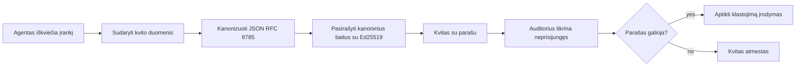
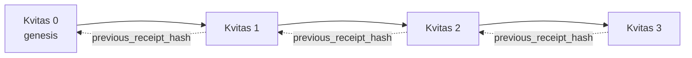

[Peržiūrėkite pamokos vaizdo įrašą: AI agentų apsauga naudojant kriptografinius kvitus](https://youtu.be/PLACEHOLDER_VIDEO_ID)

> _(Pamokos vaizdo įrašą ir miniatiūrą po sujungimo pridės Microsoft turinio komanda, atitinkančią 14/15 pamokos modelį.)_

# AI agentų apsauga naudojant kriptografinius kvitus

## Įvadas

Šioje pamokoje aptarsime:

- Kodėl audito takai AI agentams yra svarbūs atitikties, derinimo ir pasitikėjimo požiūriu.
- Kas yra kriptografinis kvitas ir kuo jis skiriasi nuo nepasirašytos įrašo eilutės.
- Kaip sukurti pasirašytą kvitą agento įrankio iškvietimui naudojant paprastą Python.
- Kaip patikrinti kvitą neprisijungus ir aptikti klastojimą.
- Kaip sujungti kvitus grandine taip, kad kvito pašalinimas ar perrašymas sulaužytų grandinę.
- Ką kvitai įrodo ir ką jie aiškiai neįrodo.

## Mokymosi tikslai

Baigę šią pamoką, jūs mokėsite:

- Identifikuoti gedimų režimus, kurie skatina kriptografinį agento veiksmų patikimumą.
- Sukurti Ed25519 pasirašytą kvitą kanoninei JSON apkrovai.
- Nepriklausomai patikrinti kvitą, naudodami tik pasirašančiojo viešąjį raktą.
- Aptikti klastojimą pakartotinai patikrindami pakeistą kvitą.
- Sukurti kvitų grandinę su maišos priklausomu sekimu ir paaiškinti, kodėl tai svarbu.
- Atpažinti ribą tarp to, ką kvitai įrodo (priskyrimą, vientisumą, tvarką) ir ko jie neįrodo (veiksmo teisingumas, politikos tinkamumas).

## Problema: Jūsų agento audito takas

Įsivaizduokite, kad įdiegėte AI agentą Contoso Travel. Agentas skaito klientų užklausas, kviečia skrydžių API ieškoti variantų ir užsako vietas kliento vardu. Praėjusį ketvirtį agentas apdorodavo 50 000 užsakymų.

Šiandien atvyksta auditorius. Jis užduoda paprastą klausimą: „Parodykite, ką atliko jūsų agentas.“

Pateikiate savo žurnalų failus. Auditorius juos peržiūri ir dalija sudėtingesnį klausimą: „Kaip žinau, kad šie žurnalai nebuvo redaguoti?“

Tai yra audito tako problema. Dauguma agentų diegimų šiandien remiasi:

- **Programos žurnalais**: rašomi pačio agento, redaguojami bet kurio, turinčio prieigą prie failų sistemos.
- **Debesų žurnalavimo paslaugomis**: platformoje matomai apsaugotos nuo klastojimo, bet tik jei auditorius pasitiki platformos operatoriumi.
- **Duomenų bazės transakcijų žurnalais**: tinkami duomenų bazės pakeitimams, bet ne bet kokiems įrankių iškvietimams.

Nė viena iš šių parinkčių negali atsakyti auditoriaus klausimui be būtinybės pasitikėti kažkuo (jumis, jūsų debesų tiekėju, duomenų bazės tiekėju). Vidiniam naudojimui toks pasitikėjimas dažnai yra priimtinas, bet reglamentuojamoms darbų apkrovoms (finansai, sveikatos priežiūra, ES AI aktui pavaldžios sritys) taip nėra.

Kriptografiniai kvitai sprendžia šią problemą, leidžiant kiekvieną agento veiksmą nepriklausomai patikrinti. Auditorius neturi jums pasitikėti. Jam reikia tik jūsų viešojo rakto ir paties kvito.

## Kas yra kriptografinis kvitas?

Kvitas yra JSON objektas, kuris įrašo, ką agentas atliko, ir yra pasirašytas skaitmeniniu parašu.


```mermaid
flowchart LR
    A[Agentas iškviečia įrankį] --> B[Sudaryti kvito duomenis]
    B --> C[Kanonizuoti JSON RFC 8785]
    C --> E[Pasirašyti kanoninius baitus su Ed25519]
    E --> F[Kvitas su parašu]
    F --> G[Auditorius tikrina neprisijungęs]
    G --> H{Parašas galioja?}
    H -- yes --> I[Aptikti klastojimą įrodymas]
    H -- no --> J[Kvitas atmestas]
```

Minimalus kvitas atrodo taip:

```json
{
  "type": "agent.tool_call.v1",
  "agent_id": "contoso-travel-bot",
  "tool_name": "lookup_flights",
  "tool_args_hash": "sha256:a3f9c1...",
  "result_hash": "sha256:7b2e1d...",
  "policy_id": "contoso-travel-policy-v3",
  "timestamp": "2026-04-25T14:30:00Z",
  "sequence": 47,
  "previous_receipt_hash": "sha256:9d4e6a...",
  "signature": {
    "alg": "EdDSA",
    "sig": "c5af83...",
    "public_key": "8f3b2c..."
  }
}
```

Trys savybės atlieka darbą:

1. **Parašas**. Kvitas pasirašomas agento vartų Ed25519 privačiu raktu. Bet kas turintis atitinkamą viešąjį raktą gali patikrinti parašą neprisijungus. Bet koks lauko pakeitimas paneigia parašą.

2. **Kanoninė koduotė**. Prieš pasirašant kvitas serializuojamas naudojant JSON Kanonizacijos Schemos (JCS, RFC 8785) standartą. Tai užtikrina, kad dvi įgyvendinimo versijos, generuojančios tą patį logišką kvitą, duoda baitų identišką išvestį. Be kanonizavimo skirtingi JSON serializatoriai sukurtų skirtingus parašus tame pačiame turinyje.

3. **Maišų grandinimas**. `previous_receipt_hash` laukas sujungia kiekvieną kvitą su ankstesniu. Pašalinus arba pakeitus kvitą grandinė sulūžta viduryje. Klastojimas tampa matomas grandinės lygiu net jei pavieniai parašai būtų apeiti.

Šios savybės kartu suteikia tris garantijas:

- **Priskyrimą**: šis raktas pasirašė šį turinį.
- **Vientisumą**: turinys nuo pasirašymo nepasikeitė.
- **Tvarką**: šis kvitas grandinėje yra po to kvito.

## Kvito kūrimas Python'e

Kvito kūrimui nereikia specialios bibliotekos. Kriptografiniai primityvai plačiai prieinami, o logika - kelių dešimčių eilučių Python kalba.

Praktiniai pratimai faile `code_samples/18-signed-receipts.ipynb` parodo visą procesą. Apibendrinimas:

```python
import json
import hashlib
import base64
from nacl import signing
from jcs import canonicalize  # RFC 8785 kanoninis JSON

def b64url_nopad(data: bytes) -> str:
    return base64.urlsafe_b64encode(data).decode("ascii").rstrip("=")

def sha256_canonical(obj) -> str:
    """SHA-256 of a Python object's JCS-canonical JSON form."""
    return f"sha256:{hashlib.sha256(canonicalize(obj)).hexdigest()}"

# Sugeneruoti arba įkelti parašo raktą (produkcijoje laikyti raktų saugykloje)
signing_key = signing.SigningKey.generate()
verify_key = signing_key.verify_key

# Sudaryti kvito duomenų paketą (dar be parašo)
tool_args = {"origin": "SYD", "destination": "LAX"}
tool_result = [{"flight": "QF11", "price": 1850, "stops": 0}]

payload = {
    "type": "agent.tool_call.v1",
    "agent_id": "contoso-travel-bot",
    "tool_name": "lookup_flights",
    "tool_args_hash": sha256_canonical(tool_args),
    "result_hash": sha256_canonical(tool_result),
    "policy_id": "contoso-travel-policy-v3",
    "timestamp": "2026-04-25T14:30:00Z",
    "sequence": 0,
    "previous_receipt_hash": None,
}

# Kanonizuoti ir pasirašyti JCS baitus tiesiogiai. Viduje naudojami PureEdDSA maišos.
canonical_bytes = canonicalize(payload)
signature_bytes = signing_key.sign(canonical_bytes).signature

# Pridėti struktūruotą parašo objektą.
receipt = {
    **payload,
    "signature": {
        "alg": "EdDSA",
        "sig": b64url_nopad(signature_bytes),
        "public_key": b64url_nopad(bytes(verify_key)),
    },
}
```

Tai visa pasirašymo grandinė. Praktiniuose užsiėmimuose atskirai išsamiai pereinama per kiekvieną žingsnį.

## Kvito patikra ir klastojimo aptikimas

Patikra - tai atvirkštinė operacija:

```python
import base64
import hashlib
from nacl import signing
from nacl.exceptions import BadSignatureError
from jcs import canonicalize

def b64url_decode(s: str) -> bytes:
    padding = "=" * ((4 - len(s) % 4) % 4)
    return base64.urlsafe_b64decode(s + padding)

def verify_receipt(receipt: dict) -> bool:
    # Parašas yra struktūruotas objektas: {"alg", "sig", "public_key"}.
    sig_obj = receipt.get("signature")
    if not sig_obj or sig_obj.get("alg") != "EdDSA":
        return False

    # Atstatykite faktinį pasirašytą turinį (viską, išskyrus parašą).
    payload = {k: v for k, v in receipt.items() if k != "signature"}

    canonical_bytes = canonicalize(payload)

    try:
        verify_key = signing.VerifyKey(b64url_decode(sig_obj["public_key"]))
        verify_key.verify(canonical_bytes, b64url_decode(sig_obj["sig"]))
        return True
    except BadSignatureError:
        return False
```

Ši funkcija ima kvitą ir grąžina `True`, jei parašas yra teisingas, `False` - jei ne. Nereikia jokių tinklo užklausų, paslaugų priklausomybės ar pasitikėjimo tretiesiems asmenims.

Norėdami pamatyti klastojimo aptikimo veikimą, praktiniame faile demonstruojama:

1. Sukurti galiojantį kvitą ir patvirtinti jo teisingumą.
2. Pakeisti vieną baitą `tool_args_hash` lauke.
3. Pakartotinai vykdyti patikrinimą ir pastebėti, kad jis nepavyksta.

Tai praktinis įrodymas, kad kvitai yra atsparūs klastojimui: bet koks pakeitimas, net ir menkiausias, sulaužo parašą.

## Kvito grandinavimas kelių žingsnių agentams

Vienas pasirašytas kvitas saugo vieną veiksmą. Kvito grandinė saugo veiksmų seką.


```mermaid
flowchart LR
    R0[Kvitas 0<br/>genesis] --> R1[Kvitas 1]
    R1 --> R2[Kvitas 2]
    R2 --> R3[Kvitas 3]
    R1 -. previous_receipt_hash .-> R0
    R2 -. previous_receipt_hash .-> R1
    R3 -. previous_receipt_hash .-> R2
```

Kiekvienas kvitas įrašo ankstesnio kvito maišą. Norint tyliai pašalinti antrąjį kvitą, užpuolikas turėtų arba:

- Pakeisti trečio kvito `previous_receipt_hash` lauką (sulaužytų trečio kvito parašą), ARBA
- Suklastoti naują parašą pakeistame trečiame kvite (reikalautų agento privataus rakto).

Jei privatus raktas saugomas aparatinėje rakto saugykloje, o viešasis raktas skelbiamas su kiekvienu kvitu, nė vienas iš šių atakų nėra įmanomas be aptikimo.

Praktiniame faile demonstruojama:

1. Sukurti trijų kvitų grandinę.
2. Patikrinti, kad kiekvieno kvito `previous_receipt_hash` sutampa su ankstesnio kvito maišu.
3. Klastoti vieną kvitą viduryje ir matyti, kaip grandinė lūžta būtent tame taške.

Taip sukuriamas audito takas, kurį išorinis auditorius gali patikrinti neprisirišdamas prie jūsų.

## Ką kvitai įrodo (ir ką ne)

Tai svarbiausia šios pamokos dalis. Kviti yra galingi, tačiau jų galia yra ribota.

**Kvitai įrodo tris dalykus:**

1. **Priskyrimą**: konkretus raktas pasirašė konkretų turinį.
2. **Vientisumą**: turinys nuo pasirašymo nepasikeitė.
3. **Tvarką**: šis kvitas seka po to kvito maišų grandinėje.

**Kvitai NEĮRODO:**

1. **Teisingumo**: kad agento veiksmas buvo teisingas. Kvitas gali būti pasirašytas už neteisingą sprendimą taip pat lengvai kaip ir už teisingą.
2. **Politikos laikymosi**: kad `policy_id` nurodyta politika buvo tikrai įvertinta arba kad ji būtų leidusi šį veiksmą, jei būtų tikrinta. Kvitas įrašo, kas buvo teigiama, o ne kas buvo įgyvendinta.
3. **Tapatybės už rakto ribų**: kvitas sako „šis raktas pasirašė šį turinį“, bet nesako „šis žmogus autorizavo šį veiksmą.“ Rakto priskyrimas žmogui ar organizacijai reikalauja papildomos tapatybės infrastruktūros (katalogo, viešųjų raktų registro ir kt.).
4. **Įvesties tikrumo**: jeigu agentas gauna pakeistą užklausimą ir veikia pagal jį, kvitas įrašo veiksmą tiksliai. Kvitai yra po įvesties validacijos, o ne jos pakaitalas.

Ši riba svarbi dėl dviejų priežasčių:

- Ji parodo, kam kvitai yra naudingi: leidžia audituoti agento elgesį ir aptikti klastojimą net tarp organizacijų.
- Ji nurodo, kokių papildomų sluoksnių vis dar reikia: įvesties validacija (Pamoka 6), politikos vykdymas (trumpai apžvelgta žemiau) ir tapatybės infrastruktūra (iš pamokos ribų).

Dažna klaida manyti, kad „turime kvitus“ reiškia „turime valdymą“. Ne. Kviti yra pagrindas. Valdymas – tai sistema, kurią statote viršuje.

## Įrodymas, kad žmogus patvirtino tikslų veiksmą

Punktas 3 verta atskiros dalies: veiksmo kvitas sako „šis raktas pasirašė šį turinį“, bet niekada „žmogus autorizavo šį veiksmą“. Aukštos rizikos veiksmams (grąžinimams, ištrynimams, laidų pervedimams) valdymo sistemos vis dažniau reikalauja būtent tokio trūkstamo teiginio, ir tai galima sukurti naudojant tuos pačius primityvus, kuriuos jau pritaikėte šioje pamokoje.

Tolimesnis praktinis failas `code_samples/human-authorization-receipts.ipynb` prideda antrą kvito tipą, `human.approval.v1`, tokiu pačiu voku kaip ir pamokos kvitai (tipuotas apkrovos objektas, pasirašytas Ed25519 kanoninių JCS baitų formatu, su `signature` objektu už pasirašytų baitų ribų). Pavadintas patvirtintojas pasirašo **visą kanoninį veiksmą ir jo santrauką** prieš vykdymą; agento veiksmų kvitas neša **tą patį veiksmų santrauką** ir `parent_approval_ref`, tai yra patvirtinimo `receipt_hash`, tas pats principas kaip `previous_receipt_hash` grandinėje, kurią sukūrėte aukščiau. Viena funkcija `verify_chain` patikrina abu šiuos artefaktus pagal **atskirus fiksuotų raktų registrus** (patvirtintojų raktus prieš agentų raktus), todėl kodo kelias yra bendras, bet įgaliojimų niekada neliečia.

Ši savybė, išdėstyta atidžiai: *žmogus patvirtino būtent šį veiksmą, o agentas iš tiesų vykdė tik tą patvirtintą veiksmą.* Praktinio failo atsisakymų patikros mechanizmai paverčia šią savybę realia, o ne tik deklaratyvia:

- tradicinis rinkinys: klastojimas, sumaišytas tarpininkas, pakartotinis paleidimas, suklastoti raktai iš abiejų pusių, neteisinga įvestis;
- **pasenusi įgaliojimo teisė**: parašas vis dar patikrinamas, bet atmestas, nes pasikeitė politikos versija, patvirtintojo raktas buvo pašalintas iš fiksuoto registro arba patvirtinimas pasibaigė prieš vykdymą;
- **santraukos pakeitimas**: galiojantis pasirašytas veiksmo kvitas, nurodantis į *tikrą* patvirtinimą, kuris susieja *kitokį* kanoninį veiksmą.

Kiekvienas neatitikimas grąžina skirtingą klaidos priežastį, tad auditorius gali atskirti, ar įgaliojimas paseno, ar vykdytas veiksmas pasikeitė. Pamokoje mokoma taisyklė: pasirašytas patvirtinimas nėra pats įgaliojimas. Įgaliojimas egzistuoja tik jei abu kvitai vis dar susieja tą patį kanoninį veiksmą vykdymo metu. Žmogaus patvirtinimo kvitas yra šios pamokos edukacinė kompozicija, o ne `draft-farley-acta-signed-receipts` apibrėžtas kvito tipas.

## Gamybos nuorodos

Python kodas šioje pamokoje yra sąmoningai minimalus, kad galėtumėte perskaityti kiekvieną eilutę ir tiksliai suprasti, kas vyksta. Gamyboje turite dvi galimybes:

1. **Kurti tiesiogiai ant kriptografinių primityvų.** 50 eilučių, kurias matėte aukščiau, pakanka daugeliui naudojimo atvejų. PyNaCl (Ed25519) ir `jcs` paketas (kanoninis JSON) yra gerai prižiūrimos ir audituotos bibliotekos.

2. **Naudoti gamybai skirtą kvitų biblioteką.** Keli atviri projektai įgyvendina tą patį modelį su papildomomis funkcijomis (raktų rotacija, paketinis tikrinimas, JWK rinkinio platinimas, integracija su politikos varikliais):
   - Pasirašymo grandinė naudoja JCS ir parašo teritorijos konvencijas nepriklausomame IETF interneto brėžinyje ([`draft-farley-acta-signed-receipts`](https://datatracker.ietf.org/doc/draft-farley-acta-signed-receipts/), 02 versija). Šios pamokos paprastas edukacinis kvitas skiriasi nuo brėžinio `{payload, signature}` voko ir nėra pateikiamas kaip atitikties įgyvendinimas. Brėžinyje skelbiama bendra atitikties testų serija ([agent-governance-testvectors](https://github.com/ScopeBlind/agent-governance-testvectors)) implementacijoms, siekiančioms jo formatą.
   - Microsoft Agent Governance Toolkit suderina kvitus su Cedar pagrindu sukurtais politikos sprendimais; pavyzdį žr. vadove 33 šiame saugykloje.
   - `protect-mcp` (npm) ir `@veritasacta/verify` (npm) paketai teikia Node įrankius kvitų pasirašymui ir neprisijungus tikrinimui, skirti bet kurį MCP serverį apgaubti su aptikimo audito taku, įskaitant paklaidinimą laukiant patvirtinimo, kai pristabdyta veiksmo funkcija išleidžia patvirtinimo kvitą, susietą su veiksmo santrauka (darbalaukio sraute palaikoma WebAuthn), tas pats patvirtinimo kvito modelis kaip žmogaus autorizavimo faile aukščiau.
   - **[nobulex](https://github.com/arian-gogani/nobulex)** Python SDK (`pip install nobulex`) teikia tą patį Ed25519 + JCS pasirašymo modelį Python kalboje su LangChain ir CrewAI integracijomis, įskaitant paskelbtus kryžminės validacijos testų vektorius ir atitikties žemėlapį, prisidėtą per [OWASP PR #2210](https://github.com/OWASP/CheatSheetSeries/pull/2210).

Sprendimas tarp savo kodavimo ir bibliotekos naudojimo yra panašus į sprendimą tarp savarankiško JWT bibliotekos rašymo ir patikrintos naudojimo: abu variantai yra pagrįsti; biblioteka taupo laiką ir mažina audito plotą; savarankiškas kelias priverčia suprasti kiekvieną primityvą. Ši pamoka moko savarankiško kelio, kad turėtumėte pagrindą abiems pasirinkimams.

## Žinių patikrinimas

Patikrinkite savo supratimą prieš pereidami prie praktikos užduoties.

**1. Kvitas yra pasirašytas agento privačiu Ed25519 raktu. Auditorius turi tik viešąjį raktą. Ar auditorius gali patikrinti kvitą neprisijungęs?**

<details>
<summary>Atsakymas</summary>

Taip. Ed25519 patikra reikalauja tik viešojo rakto ir pasirašytų baitų. Nėra tinklo užklausų, nėra priklausomybės nuo paslaugos. Tai savybė, padaranti kvitus naudingus oro tarpuose, daugiainstituciniuose ar žemo pasitikėjimo audito scenarijuose.
</details>

**2. Užpuolikas pakeičia kvito `policy_id` lauką, teigdamas, kad jį valdė liberalesnė politika. Parašas buvo darytas ant originalios apkrovos. Kas nutinka patikrinimo metu?**

<details>
<summary>Atsakymas</summary>


Patvirtinimas nepavyksta. Parašas buvo apskaičiuotas virš originalaus pateikimo kanoninių baitų; bet koks lauko keitimas keičia tuos baitus, todėl parašas tampa negaliojantis. Užpuolikui reikėtų privatio rakto, kad sukurtų naują galiojantį parašą, kurio jis neturi.
</details>

**3. Kodėl kvite yra `tool_args_hash` ir `result_hash`, o ne žaliaviniai argumentai ir rezultatas?**

<details>
<summary>Atsakymas</summary>

Dvi priežastys. Pirma, kvitas gali būti archyvuojamas arba perduodamas aplinkose, kur žaliavinės informacijos nutekėjimas (asmens duomenys, verslo informacija) yra problema. Maišos leidžia kvitui būti mažam ir informacijai likti privati; auditorius patvirtina, kad maiša atitinka atskirai saugomą tikrojo turinio kopiją. Antra, maišos turi fiksuotą dydį; kvitas su maišomis yra riboto dydžio, nepriklausomai nuo įėjimų ir išėjimų apimties.
</details>

**4. Laukas `previous_receipt_hash` sujungia kiekvieną kvitą su jo pirmtaku. Jei užpuolikas tyliai ištrina vieną kvitą grandinės viduryje, kas tampa negaliojančiu?**

<details>
<summary>Atsakymas</summary>

Kiekvienas kvitas, kuris seka po ištrinto. Jų `previous_receipt_hash` laukai nebeatitinka tikros grandinės (nes kvitas, į kurį jie nurodė, nebeegzistuoja arba grandinė dabar rodo į kitą pirmtaką). Norėdamas paslėpti ištrynimą, užpuolikas turėtų perrašyti kiekvieną vėlesnį kvitą, kas reikalauja privataus rakto.
</details>

**5. Kvitas patikrinamas be klaidų. Ar tai įrodo, kad agento veiksmas buvo teisingas, pagrįstas ar atitinkantis politiką?**

<details>
<summary>Atsakymas</summary>

Ne. Galiojantis kvitas įrodo tris dalykus: atskaitomybę (ši raktas pasirašė šį turinį), vientisumą (turinys nebuvo pakeistas) ir seką (šis kvitas sekė po kito). Jis NEĮRODO, kad veiksmas buvo teisingas, kad `policy_id` įvardyta politika buvo tikrai įvertinta arba kad agentas laikėsi visų taisyklių. Kvito dėka agento veiksmai yra audituojami, bet neatsako už teisingumą. Tai svarbiausia šios pamokos riba.
</details>

## Praktinė užduotis

Atidarykite `code_samples/18-signed-receipts.ipynb` ir užbaikite visas keturias dalis:

1. **1 skiltis**: Pasirašykite pirmą kvitą ir patikrinkite jį.
2. **2 skiltis**: Pakeiskite kvitą ir stebėkite patvirtinimo nesėkmę.
3. **3 skiltis**: Sukurkite trijų kvitų grandinę ir patikrinkite grandinės vientisumą.
4. **4 skiltis**: Taikykite šabloną agentui, sukurtiems naudojant Microsoft Agent Framework: supakuokite įrankio kvietimą į kvitų pasirašymą, po to patikrinkite kvitą atskirai.

**Išplėstinis iššūkis 1:** pridėkite papildomą savo pasirinktą lauką kvito schemoje (pavyzdžiui, užklausos ID stebėjimui), atnaujinkite kanoninę pasirašymo logiką įtraukdami jį ir patvirtinkite, kad kvitas vis dar gali būti patikrintas. Tada pakeiskite lauką po pasirašymo ir patvirtinkite, kad patikra nepavyksta. Tai privers jus suprasti, kaip kiekvienas kanoninės koduotės baitas prisideda prie parašo.

**Išplėstinis iššūkis 2:** SHA-256 maišykite du savo kvitus kartu (sujunkite jų kanoninius baitus deterministine tvarka) ir įterpkite gautą maišą kaip naują lauką trečiajame kvite prieš jį pasirašant. Patikrinkite, kad visi trys kvitai vis dar gali būti tikrinami. Jūs ką tik sukūrėte vieno žingsnio įtraukimo įrodymą: kas laikys trečią kvitą, gali įrodyti, kad pirmieji du egzistavo pasirašymo metu, neatskleisdamas jų turinio. Tai šablonas, kurį naudoja pasirinktinio atskleidimo kvitai mastu (Merkle įsipareigojimai, RFC 6962).

## Išvada

Kriptografiniai kvitai suteikia DI agentams auditavimo pėdsaką, kuris yra:

- **Nepriklausomai patikrinamas**: bet kuri šalis su viešuoju raktu gali patikrinti, be jokios paslaugos priklausomybės.
- **Pakeitimams jautrus**: bet koks pakeitimas invaliduoja parašą.
- **Perkeliama**: kvitas yra mažas JSON failas; jį galima archyvuoti, perduoti ir tikrinti bet kur.
- **Atitinkantis standartus**: paremtas Ed25519 (RFC 8032), JCS (RFC 8785) ir SHA-256, visomis plačiai pritaikytomis prietaisomis.

Jie nėra įėjimų patvirtinimo, politikos vykdymo ar tapatybės infrastruktūros pakaitalas. Jie yra šių sluoksnių fundamentas. Kai įdiegi agentus reguliuojamuose darbiniuose procesuose, daugorganizių darbo eigoje ar bet kur, kur ateities auditoriui negalima tikėti, kvitai yra kaip padaryti audito pėdsaką sąžiningu.

Svarbiausia išvada: kvitai įrodo, kas ką sakė ir kada. Jie neįrodo, kad pasakyta buvo tiesa ar teisinga. Laikykite šį skirtumą aiškiai. Tai skirtumas tarp sąžiningos kilmės sistemos ir klaidinančios.

## Produkcijos kontrolinis sąrašas

Kai būsite pasirengę pereiti nuo pamokos prie kvitu pasirašytų agentų diegimo realiame aplinkoje:

- [ ] **Perkelkite pasirašymo raktą nuo programuotojo kompiuterio.** Naudokite Azure Key Vault, AWS KMS arba aparatūros saugumo modulį. Privatus raktas, pasirašantis jūsų kvitus, neturi būti saugomas šaltinio valdyme ar paprastoje teksto formoje aplikacijos įrenginiuose.
- [ ] **Publikuokite viešąjį patvirtinimo raktą.** Auditoriams jo reikia tikrinimui neprisijungus. Standartas yra JWK rinkinys žinomu URL (RFC 7517), pvz., `https://your-org.example.com/.well-known/agent-keys.json`.
- [ ] **Išoriniu būdu įtvirtinkite grandinę.** Periodiškai įrašykite naujausio grandinės galvos maišą į skaidrumo žurnalą (Sigstore Rekor, RFC 3161 laiko žyma ar antra vidaus sistema), kad išorinis dalyvis galėtų patvirtinti „ši grandinė egzistavo tuo metu“.
- [ ] **Saugojimo vietoje užtikrinkite nekeičiamos saugojimą.** Papildomas tik įrašymas (Azure Storage su nekeičiamos politikomis, AWS S3 Object Lock) apsaugo vidinius naudotojus nuo istorijos perpildymo saugyklos lygyje.
- [ ] **Nuspręskite apie išlaikymą.** Daugelis reglamentų reikalauja daugiamečio saugojimo. Planuokite kvitų augimą (kiekvienas kvitas ~500 baitų; agentas, darantis 10 tūkst. kvietimų per dieną, pagamina ~1.8 GB per metus).
- [ ] **Dokumentuokite, ką kvitai neapima.** Kvitai įrodo priskyrimą, vientisumą ir seką. Jūsų darbo eiga turi aiškiai nurodyti, kokie papildomi valdikliai (įėjimų patikra, politikos vykdymas, dažnio ribojimas, tapatybės infrastruktūra) yra kartu su kvitais jūsų valdymo požiūryje.

### Turite daugiau klausimų apie AI agentų apsaugą?

Prisijunkite prie [Microsoft Foundry Discord](https://aka.ms/ai-agents/discord), susitikite su kitais mokiniais, dalyvaukite konsultacijose ir gaukite atsakymus į savo klausimus apie AI agentus.

## Dar daugiau už šią pamoką

Ši pamoka apima vieno kvito pasirašymą ir maišinių grandinių sekas. Tos pačios prietaisų kombinacijos sudaro kelis pažangesnius šablonus, kuriuos galite sutikti tobulėjant jūsų valdymo klausimams:

- **Pasirinktinio atskleidimo kvitai.** Kai kvito laukai nepriklausomai įsipareigojami (RFC 6962 tipo Merkle medis), galite atskleisti konkrečius laukus tam tikriems auditoriams ir įrodyti, kad likę nepasikeitė, jų neatskleisdami. Naudinga, kai tas pats kvitas turi patenkinti tiek išsamų auditą (kuris nori pilnumo), tiek duomenų minimalizavimo reglamentus, pvz., GDPR (kur auditorius turi matyti tik būtiniausią).
- **Kvitų anuliavimas.** Jei pasirašymo raktas kompromituotas, reikia galimybės pažymėti visus tuo raktu pasirašytus kvitus kaip nepatikimus nuo tam tikro laiko. Standartiniai šablonai: trumpalaikiai pasirašymo raktai su publikuojamu anuliavimo sąrašu arba skaidrumo žurnalas su anuliavimo įrašais.
- **Dvipusiai / daliniai pasirašymo kvitai.** Kai kurios įgyvendinimo versijos skiria pasirašytą pateikimą į priešvykdymo (`authorization_*`) ir posvykdymo (`result_*`) dalis su nepriklausomais parašais, naudinga, kai autorizacijos sprendimą ir stebėtą rezultatą kuria skirtingi veikėjai arba skirtingu laiku. Tai gali būti papildoma virš šios pamokos mokomo formato.
- **Pateikimo kompozicija.** Kvitas užantspauduos bet kokius baitus, kurie įdėti į `result_hash`. Realūs pateikimai dažnai yra turtingesni nei vieno įrankio kvietimo rezultatas: priešsprendiminiai motyvai (modelio prognozė, svarstyti variantai, įrodymai ir jų pilnumas, rizikų pozicija, atskaitomybės grandinė, prieigos sprendimas) gali būti pateikimo viduje, užantspauduoti vienu kvitu. Tai palaiko minimalų kvito formatą, leidžiantį pateikimo schemoms evoliucionuoti pagal domeną.
- **Tarpimplementacionis atitikimas.** Keli nepriklausomi to paties kvito formato įgyvendinimai (Python, TypeScript, Rust, Go) lygina rezultatus su bendrais testiniais vektoriais. Jei kuriate savo įgyvendinimą, jo tikrinimas su publikuotais vektoriais patvirtina tinkamumą protokolui.
- **Po-kvantinė migracija.** Ed25519 šiandien plačiai naudojamas, bet nėra kvantinį saugumo turintis. Kvito formatas yra algoritmiškai lankstus: laukas `signature.alg` gali turėti `ML-DSA-65` (NIST po-kvantinės parašo standarto) reikšmę, kai reikia pereiti. Planuokite pereinamuosius laikotarpius su dvigubu kvitų pasirašymu.

## Papildomi ištekliai

- <a href="https://datatracker.ietf.org/doc/draft-farley-acta-signed-receipts/" target="_blank">IETF Internet-Draft: Pasirašytos sprendimų kvitai mašinų prieigos valdymui</a>
- <a href="https://learn.microsoft.com/azure/ai-studio/responsible-use-of-ai-overview" target="_blank">Atsakingo DI apžvalga (Azure DI)</a>
- <a href="https://datatracker.ietf.org/doc/html/rfc8032" target="_blank">RFC 8032: Edwards kreivės skaitmeninio parašo algoritmas (EdDSA)</a>
- <a href="https://datatracker.ietf.org/doc/html/rfc8785" target="_blank">RFC 8785: JSON kanonizavimo schema (JCS)</a>
- <a href="https://datatracker.ietf.org/doc/html/rfc6962" target="_blank">RFC 6962: Sertifikatų skaidrumas</a> (Merkle medžio konstruktas, naudojamas pasirinktinio atskleidimo kvituose)
- <a href="https://github.com/microsoft/agent-governance-toolkit/blob/main/docs/tutorials/33-offline-verifiable-receipts.md" target="_blank">Microsoft agentų valdymo įrankių rinkinys, pamoka 33: neprisijungus patikrinami sprendimų kvitai</a>
- <a href="https://github.com/ScopeBlind/agent-governance-testvectors" target="_blank">Tarpimplementacinio atitikimo testiniai vektoriai</a> naudojamam kvitų formatui (Apache-2.0)
- <a href="https://pynacl.readthedocs.io/" target="_blank">PyNaCl dokumentacija</a> (Ed25519 Python kalboje)

## Ankstesnė pamoka

[Vietinių DI agentų kūrimas](../17-creating-local-ai-agents/README.md)

---

<!-- CO-OP TRANSLATOR DISCLAIMER START -->
**Atsakomybės apribojimas**:
Šis dokumentas buvo išverstas naudojant dirbtinio intelekto vertimo paslaugą [Co-op Translator](https://github.com/Azure/co-op-translator). Nors siekiame tikslumo, prašome atkreipti dėmesį, kad automatiniai vertimai gali turėti klaidų ar netikslumų. Originalus dokumentas jo gimtąja kalba laikomas autoritetingu šaltiniu. Svarbiai informacijai rekomenduojama naudoti profesionalų žmogiškąjį vertimą. Mes neatsakome už jokius nesusipratimus ar neteisingą interpretaciją, kilusią naudojantis šiuo vertimu.
<!-- CO-OP TRANSLATOR DISCLAIMER END -->