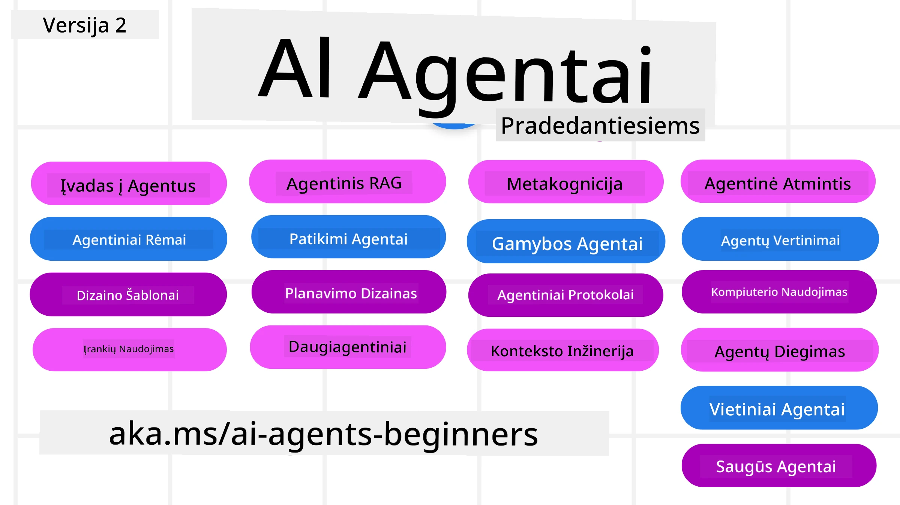

# AI Agentai Pradedantiesiems - Kursas



## Kursas, apimantis viską, ką reikia žinoti, kad pradėtumėte kurti AI Agentus

[](https://github.com/microsoft/ai-agents-for-beginners/blob/master/LICENSE?WT.mc_id=academic-105485-koreyst)
[](https://GitHub.com/microsoft/ai-agents-for-beginners/graphs/contributors/?WT.mc_id=academic-105485-koreyst)
[](https://GitHub.com/microsoft/ai-agents-for-beginners/issues/?WT.mc_id=academic-105485-koreyst)
[](https://GitHub.com/microsoft/ai-agents-for-beginners/pulls/?WT.mc_id=academic-105485-koreyst)
[](http://makeapullrequest.com?WT.mc_id=academic-105485-koreyst)

### 🌐 Daugiakalbė Parama

#### Palaikoma per GitHub Action (Automatizuota ir visada atnaujinta)

<!-- CO-OP TRANSLATOR LANGUAGES TABLE START -->
[Arabų](../ar/README.md) | [Bengalų](../bn/README.md) | [Bulgarų](../bg/README.md) | [Birmos (Myanmar)](../my/README.md) | [Kinų (Supaprastinta)](../zh-CN/README.md) | [Kinų (Tradicinė, Honkongas)](../zh-HK/README.md) | [Kinų (Tradicinė, Makao)](../zh-MO/README.md) | [Kinų (Tradicinė, Taivanas)](../zh-TW/README.md) | [Kroatų](../hr/README.md) | [Čekų](../cs/README.md) | [Danų](../da/README.md) | [Olandų](../nl/README.md) | [Estų](../et/README.md) | [Suomių](../fi/README.md) | [Prancūzų](../fr/README.md) | [Vokiečių](../de/README.md) | [Graikų](../el/README.md) | [Hebrajų](../he/README.md) | [Hindi](../hi/README.md) | [Vengrų](../hu/README.md) | [Indoneziečių](../id/README.md) | [Italų](../it/README.md) | [Japonų](../ja/README.md) | [Kannadų](../kn/README.md) | [Korėjiečių](../ko/README.md) | [Lietuvių](./README.md) | [Malajų](../ms/README.md) | [Malajalų](../ml/README.md) | [Marati](../mr/README.md) | [Nepalų](../ne/README.md) | [Nigerijos pidžinas](../pcm/README.md) | [Norvegų](../no/README.md) | [Persų (Farsi)](../fa/README.md) | [Lenkų](../pl/README.md) | [Portugalų (Brazilija)](../pt-BR/README.md) | [Portugalų (Portugalija)](../pt-PT/README.md) | [Pandžabi (Gurmuki)](../pa/README.md) | [Rumunų](../ro/README.md) | [Rusų](../ru/README.md) | [Serbų (Kirilica)](../sr/README.md) | [Slovakų](../sk/README.md) | [Slovėnų](../sl/README.md) | [Ispanų](../es/README.md) | [Svahelio](../sw/README.md) | [Švedų](../sv/README.md) | [Tagalogų (Filipinų)](../tl/README.md) | [Tamilų](../ta/README.md) | [Telugų](../te/README.md) | [Tajų](../th/README.md) | [Turkų](../tr/README.md) | [Ukrainiečių](../uk/README.md) | [Urdu](../ur/README.md) | [Vietnamiečių](../vi/README.md)

> **Verčiau Klonuoti Vietoje?**
>
> Ši saugykla apima 50+ kalbų vertimus, kurie žymiai padidina atsisiuntimo dydį. Norėdami klonuoti be vertimų, naudokite selektyvų atsisiuntimą (sparse checkout):
>
> **Bash / macOS / Linux:**
> ```bash
> git clone --filter=blob:none --sparse https://github.com/microsoft/ai-agents-for-beginners.git
> cd ai-agents-for-beginners
> git sparse-checkout set --no-cone '/*' '!translations' '!translated_images'
> ```
>
> **CMD (Windows):**
> ```cmd
> git clone --filter=blob:none --sparse https://github.com/microsoft/ai-agents-for-beginners.git
> cd ai-agents-for-beginners
> git sparse-checkout set --no-cone "/*" "!translations" "!translated_images"
> ```
>
> Tai suteiks viską, ko reikia kursui užbaigti su daug greitesniu atsisiuntimu.
<!-- CO-OP TRANSLATOR LANGUAGES TABLE END -->

**Jei norite, kad būtų palaikoma daugiau papildomų vertimų kalbų, jos išvardytos [čia](https://github.com/Azure/co-op-translator/blob/main/getting_started/supported-languages.md)**

[](https://GitHub.com/microsoft/ai-agents-for-beginners/watchers/?WT.mc_id=academic-105485-koreyst)
[](https://GitHub.com/microsoft/ai-agents-for-beginners/network/?WT.mc_id=academic-105485-koreyst)
[](https://GitHub.com/microsoft/ai-agents-for-beginners/stargazers/?WT.mc_id=academic-105485-koreyst)

[](https://discord.gg/nTYy5BXMWG)


## 🌱 Pradžia

Šiame kurse yra pamokos, apimančios pagrindus apie AI Agentų kūrimą. Kiekviena pamoka apima savo temą, todėl pradėkite nuo bet kurios patinkančios!

Šiame kurse yra daugiakalbė parama. Peržiūrėkite mūsų [pasiekiamas kalbas čia](../..). 

Jei tai jūsų pirmas kartas dirbant su Generatyviais AI modeliais, peržiūrėkite mūsų [Generatyvus AI Pradedantiesiems](https://aka.ms/genai-beginners) kursą, kuriame yra 21 pamoka apie darbą su GenAI.

Neužmirškite [pažymėti (🌟) šios saugyklos žvaigždute](https://docs.github.com/en/get-started/exploring-projects-on-github/saving-repositories-with-stars?WT.mc_id=academic-105485-koreyst) ir [padaryti šaką (fork) šios saugyklos](https://github.com/microsoft/ai-agents-for-beginners/fork), kad galėtumėte paleisti kodą.

### Susipažinkite su kitais besimokančiais, gaukite atsakymus į savo klausimus

Jei užstrigsite arba turėsite klausimų apie AI Agentų kūrimą, prisijunkite prie mūsų skirto Discord kanalo [Microsoft Foundry Discord](https://aka.ms/ai-agents/discord).

### Ko jums reikia 

Kiekviena šio kurso pamoka apima kodo pavyzdžius, kuriuos rasite code_samples aplanke. Galite [padaryti šaką (fork) šios saugyklos](https://github.com/microsoft/ai-agents-for-beginners/fork), kad sukurtumėte savo kopiją.  

Šių pavyzdžių kodas naudoja Microsoft Agent Framework su Azure AI Foundry Agent Service V2:

- [Microsoft Foundry](https://aka.ms/ai-agents-beginners/ai-foundry) - Reikalinga Azure paskyra

Šiame kurse naudojamos šios Microsoft AI Agentų karkaso technologijos ir paslaugos:

- [Microsoft Agent Framework (MAF)](https://aka.ms/ai-agents-beginners/agent-framewrok)
- [Azure AI Foundry Agent Service V2](https://aka.ms/ai-agents-beginners/ai-agent-service)


Daugiau informacijos, kaip paleisti šio kurso kodą, rasite [Kurso Paruošimas](./00-course-setup/README.md).

## 🙏 Norite padėti?

Turite pasiūlymų arba radote rašybos ar kodo klaidų? [Pateikite problemą](https://github.com/microsoft/ai-agents-for-beginners/issues?WT.mc_id=academic-105485-koreyst) arba [Sukurkite pull request](https://github.com/microsoft/ai-agents-for-beginners/pulls?WT.mc_id=academic-105485-koreyst)


## 📂 Kiekviena pamoka apima

- Rašytinę pamoką README faile ir trumpą vaizdo įrašą
- Python kodo pavyzdžius, naudojančius Microsoft Agent Framework su Azure AI Foundry
- Nuorodas į papildomus išteklius tęsti mokymąsi


## 🗃️ Pamokos

| **Pamoka**                                | **Tekstas ir Kodas**                              | **Vaizdo įrašas**                                         | **Papildomas Mokymasis**                                                                |
|-------------------------------------------|--------------------------------------------------|-----------------------------------------------------------|-----------------------------------------------------------------------------------------|
| Įvadas į AI Agentus ir jų panaudojimą     | [Nuoroda](./01-intro-to-ai-agents/README.md)    | [Vaizdo įrašas](https://youtu.be/3zgm60bXmQk?si=z8QygFvYQv-9WtO1) | [Nuoroda](https://aka.ms/ai-agents-beginners/collection?WT.mc_id=academic-105485-koreyst) |
| AI Agentinių Karkasų Tyrinėjimas          | [Nuoroda](./02-explore-agentic-frameworks/README.md) | [Vaizdo įrašas](https://youtu.be/ODwF-EZo_O8?si=Vawth4hzVaHv-u0H) | [Nuoroda](https://aka.ms/ai-agents-beginners/collection?WT.mc_id=academic-105485-koreyst) |
| AI Agentinio Dizaino Šablonų Suvokimas    | [Nuoroda](./03-agentic-design-patterns/README.md) | [Vaizdo įrašas](https://youtu.be/m9lM8qqoOEA?si=BIzHwzstTPL8o9GF) | [Nuoroda](https://aka.ms/ai-agents-beginners/collection?WT.mc_id=academic-105485-koreyst) |
| Įrankių Naudojimo Dizaino Šablonas        | [Nuoroda](./04-tool-use/README.md)                | [Vaizdo įrašas](https://youtu.be/vieRiPRx-gI?si=2z6O2Xu2cu_Jz46N) | [Nuoroda](https://aka.ms/ai-agents-beginners/collection?WT.mc_id=academic-105485-koreyst) |
| Agentinis RAG                             | [Nuoroda](./05-agentic-rag/README.md)             | [Vaizdo įrašas](https://youtu.be/WcjAARvdL7I?si=gKPWsQpKiIlDH9A3) | [Nuoroda](https://aka.ms/ai-agents-beginners/collection?WT.mc_id=academic-105485-koreyst) |
| Patikimų AI Agentų Kūrimas                | [Nuoroda](./06-building-trustworthy-agents/README.md) | [Vaizdo įrašas](https://youtu.be/iZKkMEGBCUQ?si=jZjpiMnGFOE9L8OK ) | [Nuoroda](https://aka.ms/ai-agents-beginners/collection?WT.mc_id=academic-105485-koreyst) |
| Planavimo Dizaino Šablonas                 | [Nuoroda](./07-planning-design/README.md)         | [Vaizdo įrašas](https://youtu.be/kPfJ2BrBCMY?si=6SC_iv_E5-mzucnC) | [Nuoroda](https://aka.ms/ai-agents-beginners/collection?WT.mc_id=academic-105485-koreyst) |
| Daugiagentinis Dizaino Šablonas            | [Nuoroda](./08-multi-agent/README.md)             | [Vaizdo įrašas](https://youtu.be/V6HpE9hZEx0?si=rMgDhEu7wXo2uo6g) | [Nuoroda](https://aka.ms/ai-agents-beginners/collection?WT.mc_id=academic-105485-koreyst) |
| Metakognicijos Dizaino Šablonas            | [Nuoroda](./09-metacognition/README.md)           | [Vaizdo įrašas](https://youtu.be/His9R6gw6Ec?si=8gck6vvdSNCt6OcF) | [Nuoroda](https://aka.ms/ai-agents-beginners/collection?WT.mc_id=academic-105485-koreyst) |
| AI agentai gamyboje                      | [Link](./10-ai-agents-production/README.md)        | [Video](https://youtu.be/l4TP6IyJxmQ?si=31dnhexRo6yLRJDl)  | [Link](https://aka.ms/ai-agents-beginners/collection?WT.mc_id=academic-105485-koreyst) |
| Agentinių protokolų naudojimas (MCP, A2A ir NLWeb) | [Link](./11-agentic-protocols/README.md)           | [Video](https://youtu.be/X-Dh9R3Opn8)                                 | [Link](https://aka.ms/ai-agents-beginners/collection?WT.mc_id=academic-105485-koreyst) |
| Konteksto inžinerija AI agentams            | [Link](./12-context-engineering/README.md)         | [Video](https://youtu.be/F5zqRV7gEag)                                 | [Link](https://aka.ms/ai-agents-beginners/collection?WT.mc_id=academic-105485-koreyst) |
| Agentinių atminties valdymas                      | [Link](./13-agent-memory/README.md)     |      [Video](https://youtu.be/QrYbHesIxpw?si=vZkVwKrQ4ieCcIPx)                                                      |                                                                                        |
| Microsoft Agent Framework tyrinėjimas                         | [Link](./14-microsoft-agent-framework/README.md)                            |                                                            |                                                                                        |
| Kompiuterio naudojimo agentų kūrimas (CUA)           | Netrukus                            |                                                            |                                                                                        |
| Mąstančių agentų diegimas                    | Netrukus                            |                                                            |                                                                                        |
| Vietinių AI agentų kūrimas                     | Netrukus                               |                                                            |                                                                                        |
| AI agentų apsauga                           | Netrukus                               |                                                            |                                                                                        |

## 🎒 Kiti kursai

Mūsų komanda rengia ir kitus kursus! Pažiūrėkite:

<!-- CO-OP TRANSLATOR OTHER COURSES START -->
### LangChain
[](https://aka.ms/langchain4j-for-beginners)
[](https://aka.ms/langchainjs-for-beginners?WT.mc_id=m365-94501-dwahlin)
[](https://github.com/microsoft/langchain-for-beginners?WT.mc_id=m365-94501-dwahlin)
---

### Azure / Edge / MCP / Agentai
[](https://github.com/microsoft/AZD-for-beginners?WT.mc_id=academic-105485-koreyst)
[](https://github.com/microsoft/edgeai-for-beginners?WT.mc_id=academic-105485-koreyst)
[](https://github.com/microsoft/mcp-for-beginners?WT.mc_id=academic-105485-koreyst)
[](https://github.com/microsoft/ai-agents-for-beginners?WT.mc_id=academic-105485-koreyst)

---
 
### Generatyvios AI serija
[](https://github.com/microsoft/generative-ai-for-beginners?WT.mc_id=academic-105485-koreyst)
[-9333EA?style=for-the-badge&labelColor=E5E7EB&color=9333EA)](https://github.com/microsoft/Generative-AI-for-beginners-dotnet?WT.mc_id=academic-105485-koreyst)
[-C084FC?style=for-the-badge&labelColor=E5E7EB&color=C084FC)](https://github.com/microsoft/generative-ai-for-beginners-java?WT.mc_id=academic-105485-koreyst)
[-E879F9?style=for-the-badge&labelColor=E5E7EB&color=E879F9)](https://github.com/microsoft/generative-ai-with-javascript?WT.mc_id=academic-105485-koreyst)

---
 
### Pagrindinis mokymasis
[](https://aka.ms/ml-beginners?WT.mc_id=academic-105485-koreyst)
[](https://aka.ms/datascience-beginners?WT.mc_id=academic-105485-koreyst)
[](https://aka.ms/ai-beginners?WT.mc_id=academic-105485-koreyst)
[](https://github.com/microsoft/Security-101?WT.mc_id=academic-96948-sayoung)
[](https://aka.ms/webdev-beginners?WT.mc_id=academic-105485-koreyst)
[](https://aka.ms/iot-beginners?WT.mc_id=academic-105485-koreyst)
[](https://github.com/microsoft/xr-development-for-beginners?WT.mc_id=academic-105485-koreyst)

---
 
### Copilot serija
[](https://aka.ms/GitHubCopilotAI?WT.mc_id=academic-105485-koreyst)
[](https://github.com/microsoft/mastering-github-copilot-for-dotnet-csharp-developers?WT.mc_id=academic-105485-koreyst)
[](https://github.com/microsoft/CopilotAdventures?WT.mc_id=academic-105485-koreyst)
<!-- CO-OP TRANSLATOR OTHER COURSES END -->

## 🌟 Bendruomenės padėka

Dėkojame [Shivam Goyal](https://www.linkedin.com/in/shivam2003/) už svarbių kodo pavyzdžių, demonstruojančių agentinį RAG, pateikimą.

## Dalyvavimas

Šis projektas laukia indėlių ir pasiūlymų. Daugumai indėlių reikia sutikti su
Indėlio licencijos sutartimi (CLA), deklaruojančia, kad turite teisę ir iš tikrųjų suteikiate mums
teisę naudoti jūsų indėlį. Daugiau informacijos rasite <https://cla.opensource.microsoft.com>.

Atliekant PR (pull request) CLA robotas automatiškai nustatys, ar turite pateikti
CLA ir pažymės PR tinkamai (pvz., statuso patikrinimas, komentaras). Vykdykite roboto nurodymus.
Tai reikės padaryti tik kartą visuose repozitorijuose, naudojančiuose mūsų CLA.

Šis projektas priėmė [Microsoft atvirojo kodo elgesio kodeksą](https://opensource.microsoft.com/codeofconduct/).
Daugiau informacijos rasite [Elgesio kodekso DUK](https://opensource.microsoft.com/codeofconduct/faq/) arba
kreipkitės el. paštu [opencode@microsoft.com](mailto:opencode@microsoft.com) dėl papildomų klausimų ar komentarų.

## Prekių ženklai

Šiame projekte gali būti naudoti prekių ženklai arba logotipai susiję su projektais, produktais ar paslaugomis. Leidžiama naudoti Microsoft
prekių ženklus ar logotipus tik pagal [Microsoft prekių ženklų ir prekės ženklo gairių](https://www.microsoft.com/legal/intellectualproperty/trademarks/usage/general) taisykles.
Microsoft prekių ženklų ar logotipų naudojimas modifikuotose projekto versijose neturi sukelti painiavos ar reikšti Microsoft rėmimą.
Trečiųjų šalių prekių ženklų arba logotipų naudojimas yra privaloma laikytis tų trečiųjų šalių politikų.

## Pagalbos gavimas

Jeigu susiduriate su sunkumais arba turite klausimų apie AI programų kūrimą, prisijunkite prie:

[](https://aka.ms/foundry/discord)

Jei turite atsiliepimų apie produktą arba aptikote klaidų kūrimo metu, apsilankykite:

[](https://aka.ms/foundry/forum)

---

<!-- CO-OP TRANSLATOR DISCLAIMER START -->
**Atsakomybės apribojimas**:
Šis dokumentas buvo išverstas naudojant dirbtinio intelekto vertimo paslaugą [Co-op Translator](https://github.com/Azure/co-op-translator). Nors stengiamės užtikrinti tikslumą, prašome atsižvelgti, kad automatiniai vertimai gali turėti klaidų ar netikslumų. Originalus dokumentas jo gimtąja kalba turi būti laikomas autoritetingu šaltiniu. Svarbiai informacijai rekomenduojama naudoti profesionalų žmogišką vertimą. Mes neatsakome už jokius nesusipratimus ar neteisingus aiškinimus, kylančius dėl šio vertimo naudojimo.
<!-- CO-OP TRANSLATOR DISCLAIMER END -->