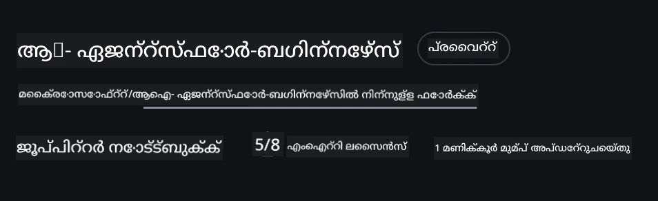

# കോഴ്സ് സെറ്റ്‌അപ്പ്

## പരിചയം

ഈ പാഠത്തിൽ ഈ കോഴ്സിന്റെ കോഡ് സാംപിളുകൾ എങ്ങനെ റൺ ചെയ്യാമെന്ന് വിശദീകരിക്കും.

## മറ്റ് പഠിക്കാരോടൊപ്പം ചേരുക സഹായം നേടുക

നിങ്ങളുടെ റിപ്പോസിറ്ററി ക്ലോൺ ചെയ്യാൻ തുടങ്ങുന്നതിന് മുൻപ്, സെറ്റ്‌അപ്പും കോഴ്സ് സംബന്ധിച്ച ചോദ്യം-പ്രശ്നങ്ങളും അറിയാനും മറ്റ് പഠിക്കാരുമായി ബന്ധപ്പെടാനും [AI Agents For Beginners Discord ചാനലിൽ](https://aka.ms/ai-agents/discord) ചേർക്കുക.

## ഈ റിപ്പോസിറ്ററി ക്ലോൺ ചെയ്യുക അല്ലെങ്കിൽ ഫോർക്ക് ചെയ്യുക

തുടങ്ങാൻ, ദയവായി GitHub റിപ്പോസിറ്ററി ക്ലോൺ ചെയ്യുക അല്ലെങ്കിൽ ഫോർക്ക് ചെയ്യുക. ഇതിലൂടെ കോഴ്സ് മെറ്റീരിയലിന്റെ നിങ്ങളുടെ സ്വന്തം പതിപ്പ് ഉണ്ടാകും, അതിനാൽ നിങ്ങൾക്ക് കോഡ് റൺ ചെയ്യാനും, ടെസ്റ്റ് ചെയ്യാനും, തപ്പുകൾ പരിഹരിക്കാനുമാകും!

ഇത് ചെയ്യാൻ <a href="https://github.com/microsoft/ai-agents-for-beginners/fork" target="_blank">റിപോ ഫോർക്ക് ചെയ്യുക</a> ലിങ്കിൽ ക്ലിക്ക് ചെയ്യുക

ഇപ്പോൾ നിങ്ങൾക്ക് ഈ കോഴ്സ് ഇനിപ്പറയുന്ന ലിങ്കിൽ നിങ്ങളുടെ സ്വന്തം ഫോർക്ക് ചെയ്ത പതിപ്പ് ഉണ്ടായിരിക്കണം:



### ഷാലോ ക്ലോൺ (വർക്ക്‌ഷോപ്പ് / കോഡ്സ്പേസുകൾക്ക് ശുപാർശ ചെയ്യപ്പെടുന്നു)

  > പൂർണ്ണ റിപ്പോസിറ്ററി (~3 GB ചുറ്റും) പൂര്‍ത്തിയായ ചരിത്രവും എല്ലാ ഫയലുകളും ഡൗൺലോഡ് ചെയ്യുമ്പോൾ വലിയതായിരിക്കും. നിങ്ങൾ വെറും വർക്ക്‌ഷോപ്പിൽ പങ്കെടുക്കുകയാണെങ്കിൽ അല്ലെങ്കിൽ കുറച്ചു ലെസൺ ഫോൾഡറുകൾ മാത്രം വേണമെന്ന് ആഗ്രഹിക്കുന്നുവെങ്കിൽ, ഷാലോ ക്ലോൺ (അഥവാ സ്പാർസ് ക്ലോൺ) ചരിത്രം കുറച്ച് കുറയ്ക്കിയും ചില ബ്ളോബുകൾ ഒഴിവാക്കിയും ഡൗൺലോഡ് കുറക്കുന്നു.

#### ക്വിക്ക് ഷാലോ ക്ലോൺ — കുറഞ്ഞ ചരിത്രം, എല്ലാ ഫയലുകളും

താഴെയുള്ള കമാൻഡുകളിൽ `<your-username>` എന്നതു നിങ്ങളുടെ ഫോർക്ക് URL (അല്ലെങ്കിൽ എളുപ്പമുള്ള ദിശയിൽ upstream URL) ഉപയോഗിച്ച് മാറ്റുക.

പുതുതലമേറ്റുള്ള കമിറ്റ്സ് മാത്രം (സ്മാൾ ഡൗൺലോഡ്) ക്ലോൺ ചെയ്യാൻ:

```bash|powershell
git clone --depth 1 https://github.com/<your-username>/ai-agents-for-beginners.git
```

ഒരു പ്രത്യേക ബ്രാഞ്ച് ക്ലോൺ ചെയ്യാൻ:

```bash|powershell
git clone --depth 1 --branch <branch-name> https://github.com/<your-username>/ai-agents-for-beginners.git
```

#### ഭാഗിക (സ്പാർസ്) ക്ലോൺ — കുറഞ്ഞ ബ്ളോബുകൾ + തിരഞ്ഞെടുക്കപ്പെട്ട ഫോൾഡറുകൾ മാത്രം

ഇത് ഭാഗിക ക്ലോൺ, സ്പാർസ്-ചെകൗട്ട് ഉപയോഗിക്കുന്നു (Git 2.25+ വേണം, പുതിയ Git വേർഷൻ ശുപാർശ ചെയ്തതാണ്):

```bash|powershell
git clone --depth 1 --filter=blob:none --sparse https://github.com/<your-username>/ai-agents-for-beginners.git
```

റിപോ ഫോൾഡറിൽനിന്ന് പ്രവേശിക്കുക:

```bash|powershell
cd ai-agents-for-beginners
```

ആവശ്യമായ ഫോൾഡറുകൾ നിർദ്ദിഷ്ടമാക്കുക (താഴെയുള്ള ഉദാഹരണം രണ്ട് ഫോൾഡറുകളാണ്):

```bash|powershell
git sparse-checkout set 00-course-setup 01-intro-to-ai-agents
```

ക്ലോൺ ചെയ്ത് ഫയലുകൾ പരിശോദിച്ച ശേഷം, ഫയലുകൾ മാത്രം വേണ്ടപക്ഷം Git ചരിത്രം ഒഴിവാക്കാൻ (ഡിസ് സ്‌പേസ് വന്ധിക്കാൻ), റെപ്പോ മെറ്റഡേറ്റ ഡിലീറ്റ് ചെയ്യുക (💀 മടക്കം ഇല്ലാത്ത നടപടി — Git ഫംഗ്ഷണാലിറ്റി മുഴുവൻ നഷ്ടപ്പെടും: കമിറ്റുകൾ, പുൾസ്, പുഷ്‌സ് അല്ലെങ്കിൽ ചരിത്രം ലഭ്യമല്ല).

```bash
# zsh/bash
rm -rf .git
```

```powershell
# പവർഷെൽ
Remove-Item -Recurse -Force .git
```

#### GitHub Codespaces ഉപയോഗിക്കൽ (ലോകൽ വലിയ ഡൗൺലോഡുകൾ ഒഴിവാക്കാൻ ശുപാർശ ചെയ്യപ്പെടുന്നു)

- ഈ റിപ്പോയ്ക്ക് പുതിയ ഒരു കോഡ്സ്പെയ്‌സ് GitHub UI വഴി സൃഷ്ടിക്കുക [GitHub UI](https://github.com/codespaces) നിന്നും.  

- പുതിയ കോഡ്സ്പെയ്‌സ് ടെർമിനലിൽ, മുകളിലുള്ള ഷാലോ/സ്പാർസ് ക്ലോൺ കമാൻഡുകൾ റൺ ചെയ്ത് അതിൽ ഫയലുകൾ മാത്രം ഇറക്കുക.
- ഐച്ഛികം: കോഡ്സ്പെയ്സുകളിൽ ക്ലോൺ ചെയ്തശേഷം .git ഫയൽ നീക്കംചെയ്യേണ്ടേ നിർദ്ദിഷ്ട സ്ഥലത്ത് അധിക ഡിസ്ക് സ്ഥലം മടങ്ങാൻ.
- ശ്രദ്ധിക്കുക: കോഡ്സ്പെയ്‌സ് നേരിട്ട് തുറക്കുമ്പോൾ (ക്ലോൺ ചെയാതെ), ഡെവ്‌കന്റെയ്‌നർ പരിസ്ഥിതി സജ്ജമാക്കും, എന്നിട്ടും നിങ്ങൾക്ക് ആവശ്യമുള്ളതിലധികം പ്രോവിഷൻ ചെയ്യാം. പുതിയ കോഡ്സ്പെയ്‌സിൽ ഷാലോ ക്ലോൺ ചെയ്യുന്നത് ഡിസ്ക് ഉപയോഗം നിയന്ത്രിക്കാൻ സഹായിക്കും.

#### നിർദ്ദേശങ്ങൾ

- എപ്പോഴും കോഡ് എഡിറ്റ്/കമിറ്റ് ചെയ്യാൻ പോകുമ്പോൾ ഫോർക്കിന്റെ URL ഉപയോഗിക്കുക.
- മൊത്തം കഴിയുക കൂടുതൽ ചരിത്രം/ഫയലുകൾ വേണം എങ്കിൽ, ഫച്ച് ചെയ്യുക അല്ലെങ്കിൽ സ്പാർസ്-ചെകൗട്ട് കൂട്ടി ഫയലുകൾ ഉൾപ്പെടുത്തുക.

## കോഡ് റൺ ചെയ്യൽ

ഈ കോഴ്‌സ് ഹാൻഡ്സ് ഓൺ അനുഭവത്തിനായി Jupyter നോട്ട്‌ബുക്കുകളുടെ ഒരു സീരീസ് നൽകുന്നു.

കോഡ് സാമ്പിളുകൾ **Microsoft Agent Framework (MAF)** ഉപയോഗിക്കുന്നു, `AzureAIProjectAgentProvider`, **Azure AI Agent Service V2** (Responses API) വഴി **Microsoft Foundry** കണക്റ്റ് ചെയ്യുന്നു.

എല്ലാ Python നോട്ട്‌ബുക്കുകളും `*-python-agent-framework.ipynb` എന്ന് ലേബൽ ചെയ്‌തിരിക്കുന്നു.

## ആവശ്യമുള്ളവ

- Python 3.12+
  - **കുറിപ്പ്**: Python3.12 ഇൻസ്റ്റാൾ ചെയ്തിട്ടില്ലെങ്കിൽ, അത് ഇൻസ്റ്റാൾ ചെയ്യുക. പിന്നിട് python3.12 ഉപയോഗിച്ച് venv സൃഷ്ടിക്കുക, ശരിയായ വേർഷനുകൾ requirements.txt ൽ നിന്ന് ഇൻസ്റ്റാൾ ചെയ്യാൻ.

    >ഉദാഹരണം

    Python venv ഡയറക്ടറി സൃഷ്ടിക്കുക:

    ```bash|powershell
    python -m venv venv
    ```

    പിന്നീട് venv പരിസ്ഥിതി സജീവമാക്കുക:

    ```bash
    # zsh/bash
    source venv/bin/activate
    ```
  
    ```dos
    # Command Prompt for Windows
    venv\Scripts\activate
    ```

- .NET 10+: .NET ഉപയോഗിച്ച് സാമ്പിൾ കോഡുകൾക്കായി [.NET 10 SDK](https://dotnet.microsoft.com/download/dotnet/10.0) അല്ലെങ്കിൽ അതിനുശേഷം വേർഷൻ ഇൻസ്റ്റാൾ ചെയ്യുക. പിന്നീട് ഇൻസ്റ്റാൾ ചെയ്ത .NET SDK വേർഷൻ പരിശോധിക്കുക:

    ```bash|powershell
    dotnet --list-sdks
    ```

- **Azure CLI** — എൻറെ ഓതെന്റിക്കേഷനായി. [aka.ms/installazurecli](https://aka.ms/installazurecli) ൽ നിന്നു ഇൻസ്റ്റാൾ ചെയ്യുക.
- **Azure Subscription** — Microsoft Foundry, Azure AI Agent Service ഉപയോഗിക്കാൻ വേണ്ടിയാണ്.
- **Microsoft Foundry Project** — വിനിയോഗിച്ച മോഡൽ ഉള്ള ഒരു പ്രോജക്റ്റ് (ഉദാഹരണമായി `gpt-4o`). കാണുക [പടി 1](../../../00-course-setup) താഴെ.

ഈ റിപ്പോസിറ്ററിയുടെ റൂട്ട് ഡയറക്ടറിയിൽ `requirements.txt` ഫയൽ ഉൾപ്പെടുത്തിയിട്ടുണ്ട്, അതിൽ കോഡ് സാംപിളുകൾ റൺ ചെയ്യാൻ ആവശ്യമായ Python പാക്കേജുകൾ ചേർത്ത് ഉണ്ട്.

ടെർമിനലിൽ താഴെയുള്ള കമാൻഡ് എക്സിക്യൂട്ട് ചെയ്ത് അവ ഇൻസ്റ്റാൾ ചെയ്യാം:

```bash|powershell
pip install -r requirements.txt
```

വിവാദങ്ങളും പ്രശ്നങ്ങളും ഒഴിവാക്കാൻ Python പ്രതിസന്ധി പരിസ്ഥിതി സൃഷ്ടിക്കുക ഞങ്ങൾ ശുപാർശ ചെയ്യുന്നു.

## VSCode സജ്ജീകരിക്കുക

നിങ്ങൾക്കിടയിൽ ശരിയായ Python വേർഷൻ VSCode-യിൽ ഉപയോഗിക്കുന്നതായി ഉറപ്പാക്കുക.


## Microsoft Foundry, Azure AI Agent Service സജ്ജീകരിക്കുക

### പടി 1: Microsoft Foundry പ്രോജക്റ്റ് സൃഷ്ടിക്കുക

നോട്ട്‌ബുക്കുകൾ റൺ ചെയ്യാനായി നിങ്ങൾക്ക് Azure AI Foundry **ഹബ്** ഒപ്പം **പ്രോജക്റ്റ്** വേണം, വിനിയോഗിച്ച മോഡൽ വഴിയും.

1. [ai.azure.com](https://ai.azure.com) സന്ദർശിച്ച് നിങ്ങളുടെ Azure അക്കൗണ്ടിൽ സൈൻ ഇൻ ചെയ്യുക.
2. ഒരു **ഹബ്** സൃഷ്ടിക്കുക (അല്ലെങ്കില് നിലവിലുള്ളത് ഉപയോഗിക്കാം). കാണുക: [Hub resources overview](https://learn.microsoft.com/azure/ai-foundry/concepts/ai-resources).
3. ഹബിൽ, ഒരു **പ്രോജക്റ്റ്** സൃഷ്ടിക്കുക.
4. **Models + Endpoints** → **Deploy model** വഴി ഒരു മോഡൽ (ഉദാഹരണം: `gpt-4o`) വിന്യസിക്കുക.

### പടി 2: നിങ്ങളുടെ പ്രോജക്റ്റ് എൻഡ്‌പോയിന്റും മോഡൽ വിന്യാസ നാമവും കണ്ടെത്തുക

Microsoft Foundry പോർട്ടലിൽ നിന്നും:

- **Project Endpoint** — **Overview** പേജിൽ പോയി എൻഡ്‌പോയിന്റ് URL കോപ്പി ചെയ്യുക.


- **Model Deployment Name** — **Models + Endpoints** ൽ പോയി വിന്യസിച്ച മോഡൽ തെരഞ്ഞെടുക്കുക, **Deployment name** (ഉദാ: `gpt-4o`) നോക്കുക.

### പടി 3: Azure-യിൽ `az login` വഴി സൈൻ ഇൻ ചെയ്യുക

എല്ലാ നോട്ട്‌ബുക്കുകളും ഓതെന്റിക്കേഷനായി **`AzureCliCredential`** ഉപയോഗിക്കുന്നു — എളുപ്പത്തിൽ API കീകൾ മാനേജ് ചെയ്യേണ്ടതില്ല. Azure CLI വഴി സൈൻ ഇൻ ചെയ്യേണ്ടതുണ്ട്.

1. **Azure CLI ഇൻസ്റ്റാൾ ചെയ്യുക**, ഇല്ലെങ്കിൽ: [aka.ms/installazurecli](https://aka.ms/installazurecli)

2. **സൈൻ ഇൻ ചെയ്യുക**:

    ```bash|powershell
    az login
    ```

    അല്ലെങ്കിൽ, ബ്രൗസറില്ലാത്ത റിമോട്ട് / കൊഡ്സ്പെയ്‌സ് പരിസ്ഥിതിയിലുള്ളപ്പോൾ:

    ```bash|powershell
    az login --use-device-code
    ```

3. **സബ്സ്ക്രിപ്ഷൻ തിരഞ്ഞെടുക്കുക** (പ്രോംപ്റ്റ് വന്നാൽ) — നിങ്ങളുടെ Foundry പ്രോജക്റ്റ് ഉള്ള സബ്സ്ക്രിപ്ഷൻ തിരഞ്ഞെടുക്കുക.

4. **സൈൻ ഇൻ സ്ഥിരീകരിക്കുക**:

    ```bash|powershell
    az account show
    ```

> **az login എന്തുകൊണ്ട്?**: നോട്ട്‌ബുക്കുകൾ `AzureCliCredential` (azure-identity പാക്കേജിൽ നിന്നുള്ള) ഉപയോഗിച്ച് ഓതെന്റിക്കേറ്റ് ചെയ്യുന്നു — ഇതാണ് നിങ്ങളുടെ Azure CLI സെഷൻ ക്രെഡൻഷ്യൽ ലഭ്യമാക്കുന്നത്, API കീകൾ അല്ലെങ്കിൽ രഹസ്യങ്ങൾ `.env` ഫയലിൽ ആവശ്യമില്ല. ഇത് ഒരു [സുരക്ഷിത മികച്ച പരിശീലനം](https://learn.microsoft.com/azure/developer/ai/keyless-connections) ആണ്.

### പടി 4: നിങ്ങളുടെ `.env` ഫയൽ സൃഷ്ടിക്കുക

ഉദാഹരണ ഫയൽ കൈമാറ്റുക:

```bash
# zsh/bash
cp .env.example .env
```

```powershell
# പവർഷെൽ
Copy-Item .env.example .env
```

`.env` തുറന്ന് ഈ രണ്ട് മൂല്യങ്ങൾ പൂരിപ്പിക്കുക:

```env
AZURE_AI_PROJECT_ENDPOINT=https://<your-project>.services.ai.azure.com/api/projects/<your-project-id>
AZURE_AI_MODEL_DEPLOYMENT_NAME=gpt-4o
```

| വയറിയബിൾ | എവിടെ കണ്ടെത്താം |
|----------|-----------------|
| `AZURE_AI_PROJECT_ENDPOINT` | Foundry പോർട്ടൽ → നിങ്ങളുടെ പ്രോജക്റ്റ് → **Overview** പേജ് |
| `AZURE_AI_MODEL_DEPLOYMENT_NAME` | Foundry പോർട്ടൽ → **Models + Endpoints** → വിന്യസിച്ച മോഡൽ നാമം |

പല ലെസണുകൾക്കും ഇതു മതിയാകും! നോട്ട്‌ബുക്കുകൾ നിങ്ങളുടെ `az login` സെഷൻ വഴി ഓതെന്റിക്കേറ്റ് ചെയ്യുന്നതാണ്.

### പടി 5: Python നിർബന്ധങ്ങൾ ഇൻസ്റ്റാൾ ചെയ്യുക

```bash|powershell
pip install -r requirements.txt
```

മുന്‍പ് സൃഷ്ടിച്ച virtual environment-ൽ ഇത് റൺ ചെയ്യാമെന്ന് ഞങ്ങൾ ശുപാർശ ചെയ്യുന്നു.

## പാഠം 5 (Agentic RAG) വേണ്ടി അധിക സജ്ജീകരണങ്ങൾ

പാഠം 5 ൽ **Azure AI Search** റിട്ട്രീവൽ-ഓഗ്മെന്റഡ് ജനറേഷൻ‌ക്കായി ഉപയോഗിക്കുന്നു. അത് റൺ ചെയ്യാൻ ഉദ്ദേശിക്കുന്നെങ്കിൽ, ഈ വയറിയബിളുകൾ നിങ്ങളുടെ `.env` ഫയലിൽ ചേർക്കുക:

| വയറിയബിൾ | എവിടെ കണ്ടെത്താം |
|----------|-----------------|
| `AZURE_SEARCH_SERVICE_ENDPOINT` | Azure പോർട്ടൽ → നിങ്ങളുടെ **Azure AI Search** റിസോഴ്‌സ് → **Overview** → URL |
| `AZURE_SEARCH_API_KEY` | Azure പോർട്ടൽ → നിങ്ങളുടെ **Azure AI Search** റിസോഴ്‌സ് → **Settings** → **Keys** → പ്രധാന അഡ്മിൻ കീ |

## പാഠം 6, 8 (GitHub Models) വേണ്ടി അധിക സജ്ജീകരണങ്ങൾ

പാഠം 6, 8 ചില നോട്ട്‌ബുക്കുകളിൽ **Azure AI Foundry** പകരം **GitHub Models** ഉപയോഗിച്ചിരിക്കുന്നു. ആ സാമ്പിളുകൾ റൺ ചെയ്യാൻ ആഗ്രഹിക്കുന്നുവെങ്കിൽ ഈ വയറിയബിളുകൾ `.env` ല് ചേർക്കുക:

| വയറിയബിൾ | എവിടെ കണ്ടെത്താം |
|----------|-----------------|
| `GITHUB_TOKEN` | GitHub → **Settings** → **Developer settings** → **Personal access tokens** |
| `GITHUB_ENDPOINT` | дефോൾട്ട് മൂല്യം: `https://models.inference.ai.azure.com` |
| `GITHUB_MODEL_ID` | ഉപയോഗിക്കാൻ മോഡൽ നാമം (ഉദാ: `gpt-4o-mini`) |

## പാഠം 8 (Bing Grounding Workflow) വേണ്ടി അധിക സജ്ജീകരണങ്ങൾ

പാഠം 8 ൽ ഉള്ള ഓപ്ഷണൽ കൺഡീഷണൽ വർക്ക്‌ഫ്ലോ നോട്ട്‌ബുക്ക് Bing grounding Azure AI Foundry ద్వారా ഉപയോഗിക്കുന്നു. ആ സാമ്പിൾ പ്രവർത്തിപ്പിക്കാൻ താഴെയുള്ള വയറിയബിൾ `.env` ഫയലിൽ ചേർക്കുക:

| വയറിയബിൾ | എവിടെ കണ്ടെത്താം |
|----------|-----------------|
| `BING_CONNECTION_ID` | Azure AI Foundry പോർട്ടൽ → നിങ്ങളുടെ പ്രോജക്റ്റ് → **Management** → **Connected resources** → നിങ്ങളുടെ Bing കണക്ഷൻ → കണക്ഷൻ ID കോപ്പി ചെയ്യുക |

## പ്രശ്നപരിഹാരം

### macOS-ൽ SSL സർട്ടിഫിക്കേറ്റ് പരിശോധിക്കൽ പിഴവുകൾ

macOS-യിൽ തൽരൂപമായ ഒരു പിഴവ് അനുഭവപ്പെടുമ്പോൾ:

```plaintext
ssl.SSLCertVerificationError: [SSL: CERTIFICATE_VERIFY_FAILED] certificate verify failed: self-signed certificate in certificate chain
```

ഈ പ്രശ്നം Python-ന് macOS-ൽ ഉള്ള ഒരു അറിയപ്പെടുന്ന പ്രശ്നമാണ്,<System SSL സർട്ടിഫിക്കറ്റുകൾ സ്വയമേവ വിശ്വസനീയമാകാറില്ല>. ഇത് പരിഹരിക്കുന്നതിന് താഴെ പറയുന്ന പരിഹാരങ്ങൾ ശ്രമിക്കുക:

**ഓപ്ഷൻ 1: Python-ന്റെ ഇൻസ്റ്റാൾ സർട്ടിഫിക്കറ്റുകൾ സ്ക്രിപ്റ്റ് ഓടിക്കുക (ശുപാർശ ചെയ്‌തിരിക്കുന്നു)**

```bash
# നിങ്ങളുടെ ഇൻസ്റ്റാൾ ചെയ്ത പൈത്തൺ പതിപ്പായ 3.XX (ഉദാഹരണത്തിന്, 3.12 അല്ലെങ്കിൽ 3.13) ഇതിലേക്ക് മാറ്റുക:
/Applications/Python\ 3.XX/Install\ Certificates.command
```

**ഓപ്ഷൻ 2: നിങ്ങളുടെ നോട്ട്‌ബുക്കിൽ `connection_verify=False` ഉപയോഗിക്കുക (GitHub Models നോട്ട്‌ബുക്കുകൾക്ക് മാത്രം)**

പാഠം 6 (06-building-trustworthy-agents/code_samples/06-system-message-framework.ipynb) നോട്ട്‌ബുക്കിൽ ഇതിനു വേണ്ട ഒരു കമന്റ് ചെയ്ത കോഡ് പ്രതിവിധി ഉണ്ട്. ക്ലയന്റ് സൃഷ്ടിക്കുമ്പോൾ `connection_verify=False` അൺകമ്മെന്റ് ചെയ്യുക:

```python
client = ChatCompletionsClient(
    endpoint=endpoint,
    credential=AzureKeyCredential(token),
    connection_verify=False,  # സർട്ടിഫിക്കറ്റ് പിശക് സംഭവിച്ചാൽ SSL പരിശോധന അപ്രാപ്യമാക്കുക
)
```

> **⚠️ മുന്നറിയിപ്പ്:** SSL പരിശോധന (ഇ.വി., `connection_verify=False`) ഒഴിവാക്കുന്നത് സുരക്ഷ കുറയ്ക്കുന്നു. ഇത് വികസന പരിസ്ഥിതികളിൽ താൽക്കാലികമായ പരിഹാരമായി മാത്രമേ ഉപയോഗിക്കാവൂ, പ്രൊഡക്ഷനിൽ ഒരിക്കലും ഉപയോഗിക്കരുത്.

**ഓപ്ഷൻ 3: `truststore` ഇൻസ്റ്റാൾ ചെയ്ത് ഉപയോഗിക്കുക**

```bash
pip install truststore
```

തുടർന്ന്, നോട്ട്‌ബുക്കിന്റെ മുകളിൽ അല്ലെങ്കിൽ സ്ക്രിപ്റ്റ് ആരംഭത്തിൽ താഴെ ചേർക്കുക, നെറ്റ്‌വർക്ക് കോളുകൾ ചെയ്യുന്നതിന് മുൻപായി:

```python
import truststore
truststore.inject_into_ssl()
```

## എവിടെയോ കുടുങ്ങിയോ?

ഈ സജ്ജീകരണം പ്രവർത്തിക്കാൻ പ്രശ്നമുണ്ടെങ്കിൽ, ഞങ്ങളുടെ <a href="https://discord.gg/kzRShWzttr" target="_blank">Azure AI Community Discord</a> ലേക്ക് ചേരുക അല്ലെങ്കിൽ <a href="https://github.com/microsoft/ai-agents-for-beginners/issues?WT.mc_id=academic-105485-koreyst" target="_blank">ഇഷ്യു സൃഷ്ടിക്കുക</a>.

## അടുത്ത പാഠം

ഈ കോഴ്സ് കോഡ് ഓടിക്കാൻ നിങ്ങൾ ഇപ്പോൾ സജ്ജമാണ്. AI ഏജന്റുകളുടെ ലോകത്തെ കുറിച്ച് കൂടുതൽ പഠിക്കാൻ സന്തോഷം നേരൂ!

[AI ഏജന്റുകൾക്കും ഏജന്റ് ഉപയോഗ കേസ് പരിചയപ്പെടുക](../01-intro-to-ai-agents/README.md)

---

<!-- CO-OP TRANSLATOR DISCLAIMER START -->
**നിരസനം**:  
ഈ ازدിസ്റ്റ്‌മെന്റി AI പരിഭാഷ സേവനം [Co-op Translator](https://github.com/Azure/co-op-translator) ഉപയോഗിച്ച് പരിഭാഷചെയ്തിരിക്കുന്നു. നാം ശരിയായ പരിഭാഷ ഉറപ്പാക്കാൻ പരിശ്രമിച്ചിരുന്നുവെങ്കിലും, ഓട്ടോമേറ്റഡ് പരിഭാഷകളിൽ പിഴവുകളും പ്രാളഭ്യങ്ങളും ഉണ്ടാകാമെന്നുള്ള കാര്യം ദയവായി മനസിലാക്കുക. മാതൃഭാഷയിലുള്ള സ原文യാണ് വിശ്വസനീയമായ ഉറവിടം എന്ന് കണക്കാക്കാവുന്നതാണ്. നിർണായകമായ വിവരങ്ങൾക്ക്, പ്രൊഫഷണൽ മനുഷ്യ പരിഭാഷ ശിപാർശ ചെയ്യപ്പെടുന്നു. ഈ പരിഭാഷ ഉപയോഗിച്ച് ഉണ്ടാകാവുന്ന ഏതെങ്കിലും തെറ്റിദ്ധാരണകൾക്ക് ഞങ്ങൾ ഉത്തരവാദിത്തം വഹിക്കുന്നില്ല.
<!-- CO-OP TRANSLATOR DISCLAIMER END -->