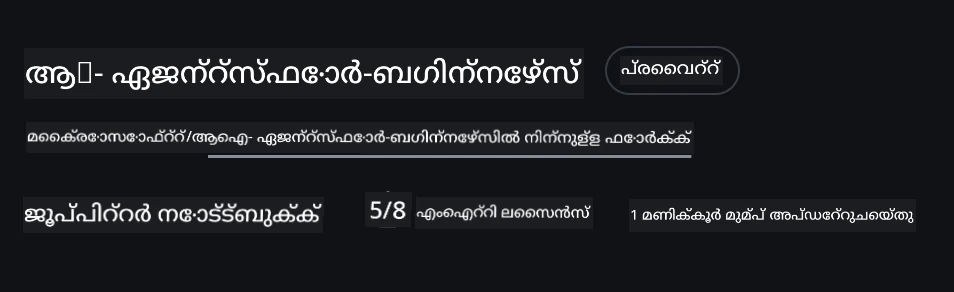
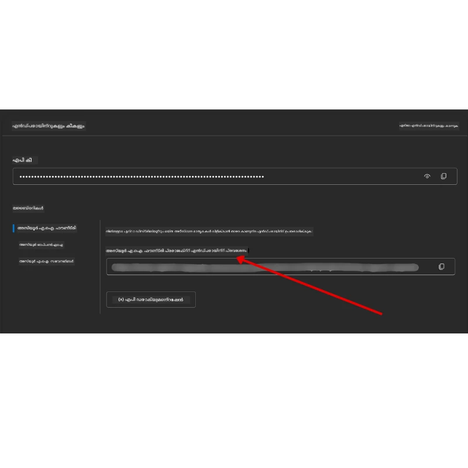

# കോഴ്സ് സജ്ജീകരണം

## പരിചയം

ഈ പാഠഭാഗം ഈ കോഴ്‌സിന്റെ കോഡ് സാമ്പിളുകൾ എങ്ങനെ പ്രവർത്തിപ്പിക്കാമെന്ന് പ്രതീക്ഷിക്കുന്നു.

## മറ്റ് പഠനക്കാരുമായി ചേരുക, സഹായം ലഭിക്കുക

നിങ്ങളുടെ റിപ്പോ ക്ലോൺ ചെയ്യാൻ തുടങ്ങുന്നതിന് മുമ്പ്, സജ്ജീകരണത്തിനോ കോഴ്‌സുമായി ബന്ധപ്പെട്ട ചോദ്യങ്ങളോ അല്ലെങ്കിൽ മറ്റ് പഠനക്കാരുമായി ബന്ധപ്പെടാനോ [AI Agents For Beginners Discord ചാനലിൽ](https://aka.ms/ai-agents/discord) ചേർന്നു സഹായം നേടുക.

## ഈ റിപ്പോ ക്ലോൺ ചെയ്യുക അല്ലെങ്കിൽ ഫോർക്കുചെയ്യുക

തുടക്കം കുറിക്കാൻ, ദയവായി GitHub റിപ്പോസിറ്ററി ക്ലോൺ ചെയ്യുക അല്ലെങ്കിൽ ഫോർക്കുചെയ്യുക. ഇത് കോഴ്‌സിന്റെ ഉള്ളടക്കത്തിന്റെ നിങ്ങളുടെ സ്വന്തം പതിപ്പ് സൃഷ്ടിക്കും, അതുവഴി നിങ്ങൾ കോഡ് ഓടിക്കാനും, പരിശോധിക്കാനും, തിരുത്താനും കഴിയും!

ഇത് <a href="https://github.com/microsoft/ai-agents-for-beginners/fork" target="_blank">ഫോർക്കുചെയ്യാൻ</a> ലിങ്കിൽ ക്ലിക്ക് ചെയ്യുന്നതിലൂടെ ചെയ്യാം

ഇനി നിങ്ങൾക്ക് ഈ കോഴ്‌സിന്റെ ഫോർക്കുചെയ്‌ത പതിപ്പ് താഴെയുള്ള ലിങ്കിൽ ലഭ്യമാകും:



### ഷാലോ ക്ലോൺ (വർക്ക്ഷോപ്പ് / Codespaces-കൾക്ക് ശിപാർശ ചെയ്യുന്നു)

  > പൂർണ്ണ റിപ്പോസിറ്ററി ഭാരം കൂടുതൽ (~3 GB) ആകാം, പൂർണ്ണ ചരിത്രവും എല്ലാ ഫയലുകളും ഡൗൺലോഡ് ചെയ്താൽ. നിങ്ങൾ വെറും വർക്ക്ഷോപ്പ് പങ്കെടുക്കുന്നെങ്കിൽ അല്ലെങ്കിൽ കുറെയ്‌ത് പാഠഭാഗ ഫോള്ഡറുകൾ മാത്രം വേണമെങ്കിൽ, ഷാലോ ക്ലോൺ (അഥവാ സ്പാർസ് ക്ലോൺ) കുറഞ്ഞ ഡേറ്റ ഡൗൺലോഡ് ചെയ്യും.

#### ക്വിക് ഷാലോ ക്ലോൺ — കുറഞ്ഞ ചരിത്രം, എല്ലാ ഫയലുകളും

താഴെയുള്ള കമാൻഡുകളിൽ `<your-username>` നിങ്ങളുടെ ഫോർക്ക് URL (അഥവാ നിങ്ങൾക്ക് ഇഷ്ടമുള്ള upstream URL) ആയി മാറ്റുക.

ഏറ്റവും പുതിയ കമിറ്റ് ചരിത്രം മാത്രം ക്ലോൺ ചെയ്യാൻ (ചെറിയ ഡൗൺലോഡ്):

```bash
git clone --depth 1 https://github.com/<your-username>/ai-agents-for-beginners.git
```

പ്രത്യേക ബ്രാഞ്ച് ക്ലോൺ ചെയ്യാൻ:

```bash
git clone --depth 1 --branch <branch-name> https://github.com/<your-username>/ai-agents-for-beginners.git
```

#### പാർഷ്യൽ (സ്പാർസ്) ക്ലോൺ — കുറഞ്ഞ ബ്‌ലോബുകൾ + തിരഞ്ഞെടുക്കപ്പെട്ട ഫോള്ഡറുകൾ മാത്രം

ഇത് പാർഷ്യൽ ക്ലോൺ, സ്പാർസ്-ചെക്ക്ഔട്ട് എന്നിവ ഉപയോഗിക്കുന്നു (Git 2.25+ ആവശ്യമാണ്, പാർഷ്യൽ ക്ലോൺ സപ്പോർട്ടുള്ള സമകാലീന Git ശുപാർശ ചെയ്യുന്നു):

```bash
git clone --depth 1 --filter=blob:none --sparse https://github.com/<your-username>/ai-agents-for-beginners.git
```

റിപ്പോ ഫോളഡറിൽ പ്രവേശിക്കുക:

```bash
cd ai-agents-for-beginners
```

ശേഷം നിങ്ങൾക്ക് ആവശ്യമുള്ള ഫോൾഡറുകൾ_specify_ചെയ്യുക (താഴെ ഉദാഹരണത്തിൽ രണ്ട് ഫോള്ഡറുകൾ കാണിക്കുന്നു):

```bash
git sparse-checkout set 00-course-setup 01-intro-to-ai-agents
```

ക്ലോൺ ചെയ്ത് ഫയലുകൾ പരിശോധിച്ചതിനു ശേഷം, നിങ്ങൾക്ക് ഫയലുകൾ മാത്രം വേണമെങ്കിൽ, സ്ഥലം മുക്തമാക്കാൻ (.git ഇല്ലാതാക്കുക) ദയവായി റിപ്പോയുടെ മെറ്റഡാറ്റ ഡിലീറ്റ് ചെയ്യുക (💀മാറ്റം തിരികെവരാത്തത് — git പ്രവർത്തനം മുഴുവൻ നഷ്ടപ്പെടും):

```bash
# zsh/bash
rm -rf .git
```

```powershell
# പവർഷെൽ
Remove-Item -Recurse -Force .git
```

#### GitHub Codespaces ഉപയോഗിച്ച് (നിങ്ങളുടെ ലൊക്കൽ വലിയ ഡൗൺലോഡ് ഒഴിവാക്കാനായി ശിപാർശ)

- ഈ റിപ്പോയ്ക്കായി പുതിയ Codespace സൃഷ്ടിക്കുക [GitHub UI](https://github.com/codespaces) വഴി.  

- പുതുതായി സൃഷ്ടിച്ച Codespace ടെർമിനലിൽ, മുകളിൽ നൽകിയ ഷാലോ/സ്പാർസ് ക്ലോൺ കമാൻഡുകളിൽ ഒരൊന്ന് ഓടിക്കുക, നിങ്ങൾക്ക് വേണ്ടിട്ടുള്ള പാഠഭാഗ ഫോള്ഡറുകൾ മാത്രമേ Codespace വർക്‌സ്പേസ്‌ൽ എത്തുകയുള്ളൂ.
- ഓപ്ഷണൽ: Codespaces-ൽ ക്ലോൺ ചെയ്തതിനുശേഷം, അധിക സ്ഥലം മുക്തമാക്കാൻ .git നീക്കം ചെയ്യാം (മുകളിൽ നൽകിയ നീക്കം കമാൻഡുകൾ കാണുക).
- എന്നാൽ, നിങ്ങൾക്ക് റിപ്പോ നേരിട്ട് Codespaces-ൽ തുറക്കാൻ ഇഷ്ടമാണെങ്കിൽ (കൂടി ഒരു ക്ലോൺ കൂടാതെ), Codespaces ഡെവ്‌കടെയ്‌നർ പരിസ്ഥിതി സൃഷ്ടിക്കുകയും നിങ്ങൾക്ക് വേണ്ടതിൽ കൂടുതൽ പ്രൊവിഷൻ ചെയ്യുകയും ചെയ്യാമെന്നാണ് ശ്രദ്ധിക്കുക.

#### ചില ടിപ്സ്

- എപ്പോൾ വേണമെന്നും എഡിറ്റ് / കമിറ്റ് ചെയ്യാനാൽ ക്ലോൺ URL നിങ്ങളുടെ ഫോർക്കായി മാറ്റുക.
- അനന്തരത്തിൽ കൂടുതൽ ചരിത്രമോ ഫയലുകളോ ആവശ്യമെങ്കിൽ, അവ ഫെച്ച് ചെയ്യാനും സ്പാർസ്-ചെക്ക്ഔട്ട് ക്രമീകരിച്ച് കൂടുതൽ ഫോള്ഡറുകൾ ഉൾപ്പെടുത്താനുമാകും.

## കോഡ് ഓടിക്കൽ

ഈ കോഴ്‌സിൽ Jupyter നോട്ട്‌ബുക്കുകൾ ഒരു ശ്രേണി നൽകുന്നു, അവ പ്രവർത്തിപ്പിച്ച് AI ഏജന്റുകൾ നിർമ്മിക്കുന്നതിനുള്ള പ്രായോഗിക പരിചയം നേടാം.

കോഡ് സാമ്പിളുകൾ **Microsoft Agent Framework (MAF)** ഉപയോഗിക്കുന്നു, അതിന്റെ `FoundryChatClient` **Microsoft Foundry Agent Service V2** (Responses API) വഴി **Microsoft Foundry**-യുമായി ബന്ധിപ്പിക്കുന്നു.

എല്ലാ Python നോട്ട്‌ബുക്കുകളും `*-python-agent-framework.ipynb` ആയി ടാഗ് ചെയ്‌തിരിക്കുന്നു.

## ആവശ്യകതകൾ

- Python 3.12+
  - **കർണാമൂലം**: Python3.12 ഇൻസ്റ്റാൾ ചെയ്തിട്ടില്ലെങ്കിൽ, അത് ഇൻസ്റ്റാൾ ചെയ്യുക. ശേഷം python3.12 ഉപയോഗിച്ച് വേഞ്ച് (venv) സൃഷ്ടിച്ച് രീതിയ്ക്ക് ആവശ്യമായ പാക്കേജുകൾ requirements.txt-ൽ നിന്ന് ശരിയായി ഇൻസ്റ്റാൾ ചെയ്യുന്നതു ഉറപ്പാക്കുക.
  
    >ഉദാഹരണം

    Python വേഞ്ച് ഡയറക്ടറി സൃഷ്ടിക്കുക:

    ```bash
    python -m venv venv
    ```

    ശേഷം താഴെക്കൊടുത്ത മുറുക്കുന്നത് വേഞ്ച് എൻവയരൺമെന്റ് ആക്റ്റിവേറ്റ് ചെയ്യുക:

    ```bash
    # zsh/bash
    source venv/bin/activate
    ```
  
    ```dos
    # Command Prompt for Windows
    venv\Scripts\activate
    ```

- .NET 10+: .NET ഉപയോഗിച്ച സാമ്പിൾ കോഡുകൾക്കായി [.NET 10 SDK](https://dotnet.microsoft.com/download/dotnet/10.0) അല്ലെങ്കിൽ അതിന്റെ പകർപ്പ് ഇൻസ്റ്റാൾ ചെയ്യുക. തുടർന്ന് ഇൻസ്റ്റാൾ ചെയ്ത .NET SDK പതിപ്പ് പരിശോധിക്കുക:

    ```bash
    dotnet --list-sdks
    ```

- **Azure CLI** — അളക്കുന്ന प्रमाणത്തിനു അനിവാര്യമാണ്. [aka.ms/installazurecli](https://aka.ms/installazurecli) ഇൽ നിന്ന് ഇൻസ്റ്റാൾ ചെയ്യുക.
- **Azure Subscription** — Microsoft Foundry, Microsoft Foundry Agent Service ലഭിക്കാൻ.
- **Microsoft Foundry Project** — ഡിപ്പ്ലോയുചെയ്‌ത മോഡലുള്ള ഒരു പ്രോജക്റ്റ് (ഉദാഹരണം: `gpt-5-mini`). താഴെ [Step 1](#ഘട്ടം-1-microsoft-foundry-project-സൃഷ്ടിക്കുക) കാണുക.

ഈ റിപ്പോസിറ്ററി റൂട്ട്-ൽ `requirements.txt` ഫയൽ ഉൾപ്പെടുത്തിയിട്ടുണ്ട്, കോഡ് സാമ്പിളുകൾ പ്രവർത്തിപ്പിക്കാൻ ആവശ്യമായ Python പാക്കേജുകൾ എല്ലാം ഇതിനുള്ളിൽ ഉണ്ട്.

റിപ്പോസിറ്ററി റൂട്ട്-ൽ ടെർമിനലിൽ താഴെയുള്ള കമാൻഡ് കൗണ്ട് നടത്തികൊണ്ട് അവരുടെ ഇൻസ്റ്റാൾ ചെയ്യാം:

```bash
pip install -r requirements.txt
```

ഒഴിവാക്കാൻ Python വേർച്വൽ എൻവയോൺമെന്റ് സൃഷ്ടിക്കാനും അവിടെ പ്രവർത്തിക്കാനും ശിപാർശ ചെയ്യുന്നു.

## VSCode സജ്ജീകരിക്കുക

VSCode-യിൽ ശരിയായ Python പതിപ്പ് ഉപയോഗിക്കുന്നുണ്ടെന്ന് ഉറപ്പാക്കുക.


## Microsoft Foundry, Microsoft Foundry Agent Service സജ്ജീകരിക്കുക

### ഘട്ടം 1: Microsoft Foundry Project സൃഷ്ടിക്കുക

നോട്ട്‌ബുക്കുകൾ ഓടിക്കാൻ ഒരു Microsoft Foundry **ഹബ്** ഉം **പ്രോജക്റ്റും** ഡിപ്പ്ലോയുചെയ്‌ത മോഡലോടുകൂടി വേണം.

1. [ai.azure.com](https://ai.azure.com) സന്ദർശിച്ച് നിങ്ങളുടെ അസ്യൂർ അക്കൗണ്ട് ഉപയോഗിച്ച് സൈൻ ഇൻ ചെയ്യുക.
2. ഒരു **ഹബ്** സൃഷ്ടിക്കുക (അല്ലെങ്കിൽ നിലവിലുള്ളത് ഉപയോഗിക്കുക). കാണുക: [Hub resources overview](https://learn.microsoft.com/azure/ai-foundry/concepts/ai-resources).
3. ഹബിൻ‌റുള്ളിൽ ഒരു **പ്രോജക്റ്റ്** സൃഷ്ടിക്കുക.
4. **Models + Endpoints** → **Deploy model** വഴി ഒരു മോഡൽ (ഉദാഹരണത്തിന് `gpt-5-mini`) ഡിപ്പ്ലോയുചെയ്യുക.

### ഘട്ടം 2: നിങ്ങളുടെ പ്രോജക്റ്റ് എൻഡ്പോയിന്റും മോഡൽ ഡിപ്പ്ലോയ്മെന്റ് നാമവും നേടുക

Microsoft Foundry പോർട്ടലിൽ നിന്നുള്ള നിങ്ങളുടെ പ്രോജക്റ്റിൽ നിന്ന്:

- **പ്രോജക്റ്റ് എൻഡ്പോയിന്റ്** — **Overview** പേജ് സന്ദർശിച്ച് എൻഡ്പോയിന്റ് URL പകർത്തുക.



- **മോഡൽ ഡിപ്പ്ലോയ്മെന്റ് നാമം** — **Models + Endpoints** ൽ പോയി, ഡിപ്പ്ലോയുചെയ്‌ത മോഡൽ തെരഞ്ഞെടുക്കുക, **Deployment name** (ഉദാഹരണം `gpt-5-mini`) നോട്ട് ചെയ്യുക.

### ഘട്ടം 3: `az login` ഉപയോഗിച്ച് അഴ്ചു് സൈൻ ഇൻ ചെയ്യുക

Jupyter നോട്ട്‌ബുക്കുകൾ കൂടുതലും നിങ്ങൾക്ക് API കികൾ ആവശ്യമില്ലാതെ Azure CLI സൈൻ ഇൻ ( `AzureCliCredential` അല്ലെങ്കിൽ `DefaultAzureCredential`-ലൂടെ) ഉപയോഗിച്ച് പ്രാമാണീകരിക്കുന്നു — ചില പാഠങ്ങൾക്കും ഇഷ്ടാനുസൃത ഏർപ്പാടുകൾക്കും API കികൾ ആവശ്യവും, അതിനാൽ ഓരോ പാഠത്തിന്റെയും മുൻ‌ഗാമി അവശ്യമുള്ള ചുറ്റുപാടുകൾ പരിശോധിക്കുക. ഇതിനായി നിങ്ങൾ Azure CLI വഴി സൈൻ ഇൻ ചെയ്യേണ്ടതുണ്ട്.

1. **Azure CLI ഇൻസ്റ്റാൾ ചെയ്യുക**: [aka.ms/installazurecli](https://aka.ms/installazurecli)

2. **സൈൻ ഇൻ ചെയ്യുക**:

    ```bash
    az login
    ```

    അല്ലെങ്കിൽ ബ്രൗസർ ഇല്ലാത്ത റിമോട്ട്/Codespace പരിസ്ഥിതിയിൽ നിൽക്കുമ്പോൾ:

    ```bash
    az login --use-device-code
    ```

3. **നിങ്ങളുടെ subscription** ആവശ്യപ്പെട്ടാൽ തിരഞ്ഞെടുക്കുക — നിങ്ങളുടെ Foundry പ്രോജക്റ്റ് ഉൾപ്പെടുന്നതാണ് തിരയുക.

4. **സെൽഫ് വേരിഫൈ ചെയ്യുക**:

    ```bash
    az account show
    ```

> **എന്തുകൊണ്ട് `az login`?** നോട്ട്‌ബുക്കുകൾ `AzureCliCredential` (അല്ലെങ്കിൽ `DefaultAzureCredential`, Azure CLI സൈൻ ഇൻ ഉപയോഗിക്കുന്നു) ഉപയോഗിച്ച് പ്രാമാണീകരിക്കുന്നു. അതായത്, നിങ്ങളുടെ Azure CLI സെഷൻ ക്രെഡൻഷ്യലുകൾ നൽകുന്നു — നിങ്ങൾ `env` ഫയലിൽ API കികൾ ഇല്ലാതെ. ഇത് [സുരക്ഷിതമായ ഉത്തമപ്രവർത്തനം](https://learn.microsoft.com/azure/developer/ai/keyless-connections) ആണ്.

### ഘട്ടം 4: നിങ്ങളുടെ `.env` ഫയൽ സൃഷ്ടിക്കുക

ഉദാഹരണ ഫയൽ പകർത്തുക:

```bash
# zsh/bash
cp .env.example .env
```

```powershell
# പവർഷെൽ
Copy-Item .env.example .env
```

`.env` തുറന്ന് താഴെയുള്ള രണ്ട് മൂല്യങ്ങൾ പൂരിപ്പിക്കുക:

```env
AZURE_AI_PROJECT_ENDPOINT=https://<your-project>.services.ai.azure.com/api/projects/<your-project-id>
AZURE_AI_MODEL_DEPLOYMENT_NAME=gpt-5-mini
```

| വേരിയബിൾ | കണ്ടെത്താനിടം |
|----------|-----------------|
| `AZURE_AI_PROJECT_ENDPOINT` | Foundry പോർട്ടൽ → നിങ്ങളുടെ പ്രോജക്റ്റ് → **Overview** പേജ് |
| `AZURE_AI_MODEL_DEPLOYMENT_NAME` | Foundry പോർട്ടൽ → **Models + Endpoints** → നിങ്ങളുടെ ഡിപ്പ്ലോയുചെയ്‌ത മോഡലിന്റെ പേര് |

മിക്ക പാഠഭാഗങ്ങൾക്കുമായി ഇതാണ് ആവശ്യമായതെല്ലാം! നോട്ട്‌ബുക്കുകൾ നിങ്ങളുടെ `az login` സെഷൻ വഴി സ്വയം പ്രവർത്തിക്കും.

### ഘട്ടം 5: Python ആശ്രിതങ്ങൾ ഇൻസ്റ്റാൾ ചെയ്യുക

```bash
pip install -r requirements.txt
```

മുമ്പ് സൃഷ്ടിച്ച വെർച്വൽ എൻവയറന്മെന്റിനുളളിൽ ഇത് നിർവ്വാഹിക്കുക എന്ന് ശിപാർശ ചെയ്യുന്നു.

## ഐച്ഛിക സജ്ജീകരണം: Azure AI Search (പാഠം 5, 16)

പാഠം 5 (Agentic RAG) & പാഠം 16 നോട്ട്‌ബുക്കുകൾ ഒരു **in-memory knowledge base** తో ഉടനെ പ്രവർത്തിക്കുന്നു — അധിക Azure റിസോഴ്സുകൾ ആവശ്യമില്ല. നിങ്ങൾക്ക് യാഥാർത്ഥ്യമാക്കാൻ ആഗ്രഹമുള്ള പക്ഷം സത്യമായ **Azure AI Search** ഇൻഡക്സ് ഉപയോഗിക്കാം, പക്ഷേ പാഠം 16 നോട്ട്‌ബുക്ക് നിലവിൽ **key-based authentication** മാത്രം പിന്തുണയ്ക്കുന്നു: **`AZURE_SEARCH_SERVICE_ENDPOINT`** ഉം **`AZURE_SEARCH_API_KEY`** ഉം സജ്ജമാക്കിയാൽ മാത്രമേ അത് Azure AI Search-ളേക്കായി മാറൂ. ഈ കോഴ്സ് മുഴുവൻ `az login` പ്രക്രിയ പോലെ keyless authentication (Microsoft Entra ID RBAC) ആണ് ശിപാർശ ചെയ്യുന്നത്.

താഴെ നൽകിയ RBAC ഘട്ടങ്ങൾ ഈ സജ്ജീകരണ ഗൈഡ് സാമ്പിളുകൾക്കും നിങ്ങളുടെ കോഡിനും ബാധകമാണ്. പാഠം 16 നോട്ട്‌ബുക്കിൽ keyless authentication സജ്ജമാക്കുന്നില്ല; അത് ഇനിയും എൻഡ്പോയിന്റും അഡ്മിൻ കീയും ഉൾപ്പെടുന്ന key-based auth മാത്രം സ്വീകരിക്കുന്നു.

1. നിങ്ങളുടെ search സർവീസിൽ **role-based access** സജ്ജമാക്കുക:

    ```bash
    az search service update --name <service-name> --resource-group <resource-group> --auth-options aadOrApiKey
    ```

2. നിങ്ങളെ ആവശ്യമായ റോളുകൾക്ക് നിയമിക്കുക (indexes സൃഷ്ടിക്കുക/ലോഡ് ചെയ്യുക, ക്വേരി നടത്തുക):

    ```bash
    az role assignment create --assignee <your-user-or-principal-id> --role "Search Service Contributor" --scope $(az search service show -g <resource-group> -n <service-name> --query id -o tsv)
    az role assignment create --assignee <your-user-or-principal-id> --role "Search Index Data Contributor" --scope $(az search service show -g <resource-group> -n <service-name> --query id -o tsv)
    ```

3. നിങ്ങളുടെ `.env` ഫയലിൽ എൻഡ്പോയിന്റ് ചേർക്കുക:

| വേരിയബിൾ | കണ്ടെത്താനിടം |
|----------|-----------------|
| `AZURE_SEARCH_SERVICE_ENDPOINT` | Azure പോർട്ടൽ → നിങ്ങളുടെ **Azure AI Search** റിസോഴ്സ് → **Overview** → URL |
| `AZURE_SEARCH_API_KEY` | (lesson 16-ൽ മാത്രം ഉപയോഗിക്കുന്ന) Azure ഓൺ ഏഐ സെർച്ച് സജീവമാക്കാൻ ആവശ്യമാണ്. Azure പോർട്ടൽ → **Settings** → **Keys** → പ്രൈമറി അഡ്മിൻ കീ |

> **എന്തുകൊണ്ട് keyless?** അഡ്മിൻ കീകൾ നിങ്ങളുടെ serives-ൽ പൂർണ്ണ എഴുത്ത് ആക്‌സസ് നൽകുന്നതായതിനാൽ `.env` ഫയലിലൂടെ ലീക്ക് ആകാനിടയുണ്ട്. RBAC ഉപയോഗിച്ച് നിങ്ങൾ `az login` വഴിയുള്ള ഇന്ത്യന്‍റ സ്ത്രീപ്പെടുത്തൽ നടത്തുന്നു — കോഴ്‌സ് നോട്ട്‌ബുക്കുകൾ ചെയ്യുന്നത് പോലെ (AzureCliCredential / DefaultAzureCredential). [നിരപ്പ് അനുസരിച്ചുള്ള Azure AI Search-ലേക്ക് കണെക്‌ട് ചെയ്യുക](https://learn.microsoft.com/azure/search/search-security-rbac).

പൂർണ്ണ ഇൻഡക്സ് സൃഷ്ടി സാമ്പിളുകൾക്കായി [Azure AI Search സജ്ജീകരണ ഗൈഡ്](./AzureSearch.md) കാണുക, Python, .NET ശൈലിയിൽ.

## Azure OpenAI നേരിട്ട് വിളിക്കുന്ന പാഠങ്ങൾക്കായുള്ള അധിക സജ്ജീകരണം (പാഠം 6, 8)

പാഠം 6, 8-ൽ ചില നോട്ട്‌ബുക്കുകൾ **Azure OpenAI** (Responses API ഉപയോഗിച്ച്) നേരിട്ട് വിളിക്കുന്നു, Microsoft Foundry പ്രോജക്റ്റ് വഴി പോയില്ല. മുൻപ് GitHub Models ഉപയോഗിച്ചിരുന്നു പക്ഷേ അതിന്റെ പിന്തുണ അവസാനിച്ചിട്ടുണ്ട്. ഈ വേരിയബിൾകൾ `.env`-ൽ ചേർക്കുക:

| വേരിയബിൾ | കണ്ടെത്താനിടം |
|----------|-----------------|
| `AZURE_OPENAI_ENDPOINT` | Azure പോർട്ടൽ → നിങ്ങളുടെ **Azure OpenAI** റിസോഴ്സ് → **Keys and Endpoint** → എൻഡ്പോയിന്റ് (ഉദാ: `https://<your-resource>.openai.azure.com`) |
| `AZURE_OPENAI_DEPLOYMENT` | ഡിപ്പ്ലോയുചെയ്‌ത മോഡലിന്റെ പേര് (ഉദാ: `gpt-5-mini`), Responses API-നു പിന്തുണയുള്ളത് |
| `AZURE_OPENAI_API_KEY` | ഐച്ഛികം — `az login` / Entra ID അല്ലാതെ key-based auth-თვის മാത്രം |

> Responses API സ്ഥിരമായ `/openai/v1/` എൻഡ്പോയിന്റ് ഉപയോഗിക്കുന്നു, അതിനാൽ `api-version` വേണ്ടിവരുന്നില്ല. keyless Entra ID authentication-നായി `az login` ഉപയോഗിച്ച് സൈം ഇൻ ചെയ്യുക.

## പ്രാതിനിധ്യദായകം: MiniMax (OpenAI-സമ്മതമായ)

[MiniMax](https://platform.minimaxi.com/) സാന്ദ്ര വിഭവങ്ങൾ (204K ടോക്കൺ വരെ) OpenAI-സമ്മതമായ API വഴി നൽകുന്നു. Microsoft Agent Framework-ന്റെ `OpenAIChatClient` ഏത് OpenAI-സമ്മതമായ എൻഡ്പോയിന്റിനോടും ജോലി ചെയ്യുന്നതുകൊണ്ട്, പാഠങ്ങൾ `OpenAIChatClient` ഉപയോഗിക്കുന്നിടങ്ങളിൽ MiniMax ഉപയോഗിക്കാം.

`.env`-ൽ ഈ വേരിയബിൾകൾ ചേർക്കുക:

| വേരിയബിൾ | കണ്ടെത്താനിടം |
|----------|-----------------|
| `MINIMAX_API_KEY` | [MiniMax Platform](https://platform.minimaxi.com/) → API കികൾ |
| `MINIMAX_BASE_URL` | `https://api.minimax.io/v1` (പൂർവ്വ നിശ്ചിതം) |
| `MINIMAX_MODEL_ID` | ഉപയോഗിക്കുന്ന മോഡലിന്റെ പേര് (ഉദാ: `MiniMax-M3`) |

**ഉദാഹരണ മോഡലുകൾ**: `MiniMax-M3` (ശുപാർശ), `MiniMax-M2.7`, `MiniMax-M2.7-highspeed` (വേഗത്തിലുള്ള പ്രതികരണങ്ങൾ). മോഡൽ നാമങ്ങളും ലഭ്യതയും കാലക്രമേണ മാറാം, അക്കൗണ്ടിന്റെ അനുസരണത്തിന് വിധേയമാണ്.

`OpenAIChatClient` ഉപയോഗിക്കുന്ന കോഡ് സാമ്പിളുകൾ (ഉദാ: പാഠം 14 ഹോട്ടൽ ബുക്കിംഗ് വർക്ക്‌ഫ്ലോ) `MINIMAX_API_KEY` സജ്ജമാക്കിയാൽ സ്വയം നിങ്ങളുടെ MiniMax കോൺഫിഗറേഷൻ കണ്ടെത്തുകയും ഉപയോഗിക്കുകയും ചെയ്യും.


## ബദൽ പ്രദാതാവ്: Foundry Local (മോഡലുകൾ ഒൻ-ഡിവൈസിൽ ഓടിക്കുക)

[Foundry Local](https://foundrylocal.ai) ഒരു ലഘുവായ റൺടൈമാണ്, ഇത് നിങ്ങൾക്കു സ്വന്തം യന്ത്രത്തിൽ **മുഴുവൻതും** ഡൗൺലോഡ് ചെയ്യുകയും, മാനേജുചെയ്യുകയും, OpenAI-ഉള്ള യോഗ്യമായ API മുഖേന ഭാഷാ മോഡലുകൾ സേർവ് ചെയ്യുകയും ചെയ്യുന്നു — ക്ലൗഡ് ആവശ്യമില്ല.

Microsoft Agent Framework ന്റെ `OpenAIChatClient` OpenAI-ഉള്ള ഏത് ഉടമസ്ഥതയുള്ള എൻഡ്പോയിന്റിനോടും പ്രവർത്തിക്കുന്നതുകൊണ്ട്, Foundry Local ആഴൂർ OpenAI-യ്ക്ക് ഒരു ലൊക്കൽ ബദലായി ഉപയോഗിക്കാം.

**1. Foundry Local ഇൻസ്റ്റാൾ ചെയ്യുക**

```bash
# വിൻഡോസ്സ്
winget install Microsoft.FoundryLocal

# മാക്ക് ഓ എസ്
brew install foundrylocal
```

**2. മോഡൽ ഡൗൺലോഡ് ചെയ്ത് ഓടിക്കുക** (ഇത് ലൊക്കൽ സർവീസ് തുടങ്ങുകയും ചെയ്യും):

```bash
foundry model list          # ലഭ്യമായ മോഡലുകൾ കാണുക
foundry model run phi-4-mini
```

**3. ലൊക്കൽ എൻഡ്പോയിന്റ് കണ്ടെത്താൻ ഉപയോഗിക്കുന്ന Python SDK ഇൻസ്റ്റാൾ ചെയ്യുക:**

```bash
pip install foundry-local-sdk
```

**4. Microsoft Agent Framework നിങ്ങളുടെ ലൊക്കൽ മോഡലിലേക്ക് പോയിന്റ് ചെയ്യുക:**

```python
from foundry_local import FoundryLocalManager
from agent_framework.openai import OpenAIChatClient

# അവതരണത്തിന്റെ മാതൃക ഓൺലൈൻ ഡൗൺലോഡ് ചെയ്ത്, പിന്നീട് സേർവ് ചെയ്ത്, പിന്നീട് എൻഡ്പോയിന്റ്/പോർട്ട് കണ്ടെത്തുന്നു.
manager = FoundryLocalManager("phi-4-mini")

chat_client = OpenAIChatClient(
    base_url=manager.endpoint,      # ഉദാഹരണം http://localhost:<port>/v1
    api_key=manager.api_key,        # ഫൗണ്ട്രി ലോക്കൽക്ക് എല്ലായ്പ്പോഴും "ആവശ്യക്കാരിയല്ല" ആണ്.
    model_id=manager.get_model_info("phi-4-mini").id,
)

agent = chat_client.as_agent(
    name="LocalAgent",
    instructions="You are a helpful assistant running fully on-device.",
)
```

> **കുറിപ്പ്:** Foundry Local OpenAI-യുമായി അനുയോജ്യമായ **ചാറ്റ് കോംപ്ലീഷൻസ്** എൻഡ്പോയിന്റ് എക്സ്‌പോസ് ചെയ്യുന്നു. ഇത് ലൊക്കൽ വികസനത്തിനും ഓഫ്‌ലൈൻ സംഘട്ടനത്തിനും ഉപയോഗിക്കുക. മുഴുവൻ **റിസ്‌പോൺസസ് API** ഫീച്ചർ സെറ്റിനായി (സ്റ്റേറ്റ്‌ഫ്ൾ സംഭാഷണങ്ങൾ മുതലായവ), Azure OpenAI അല്ലെങ്കിൽ Microsoft Foundry പദ്ധതി ഉപയോഗിക്കുക.

## പാഠം 8 (Bing Grounding Workflow)യുടെ അധിക ക്രമീകരണം

പാഠം 8 ലെ കണ്ടീഷണൽ വർക്ക്‌ഫ്ലോ നോട്ട്‌ബുക്കിൽ Microsoft Foundry വഴി **Bing grounding** ഉപയോഗിക്കുന്നു. ആ സാമ്പിൾ റൺ ചെയ്യാൻ ഉദ്ദേശിക്കുന്നുവെങ്കിൽ, നിങ്ങളുടെ `.env` ഫയലിൽ ഈ വെേരിയബിൾ ചേർക്കുക:

| മാറിയേക്കാവുന്ന വേരിയബിൾ | എവിടെ കണ്ടെത്താം |
|----------|-----------------|
| `BING_CONNECTION_ID` | Microsoft Foundry പോർട്ടൽ → നിങ്ങളുടെ പ്രോജക്ട് → **Management** → **Connected resources** → നിങ്ങളുടെ Bing കണക്ഷൻ → കണക്ഷൻ ഐഡി കോപ്പി ചെയ്യുക |

## പ്രശ്നപരിഹാരങ്ങൾ

### macOS-ൽ SSL സർട്ടിഫിക്കറ്റ് പരിശ്രമിച്ചപ്പോൾ സംഭവിക്കുന്ന പിശകുകൾ

നിങ്ങൾ macOS-ൽ ആണെങ്കിൽ ഇത്തരത്തിലുള്ള പിശക് കാണാമെന്നു:

```plaintext
ssl.SSLCertVerificationError: [SSL: CERTIFICATE_VERIFY_FAILED] certificate verify failed: self-signed certificate in certificate chain
```

ഇത് macOS ലെ Python-ന്റെ അറിയപ്പെടുന്ന പ്രശ്നമാണ്, ഇവിടെ സിസ്റ്റം SSL സർട്ടിഫിക്കറ്റുകൾ സ്വയം വിശ്വസിക്കപ്പെടുന്നില്ല. തുടർന്ന് പരിഹാരങ്ങൾ പരീക്ഷിക്കുക:

**ഓപ്ഷൻ 1: Python-ന്റെ ഇൻസ്റ്റാൾ സർട്ടിഫിക്കറ്റ് സ്ക്രിപ്റ്റ് നടത്തുക (ശുപാർശചെയ്യുന്നു)**

```bash
# നിങ്ങളുടെ ഇൻസ്റ്റാൾ ചെയ്ത പൈത്തൺ വേർഷൻ (ഉദാഹരണത്തിന്, 3.12 അല്ലെങ്കിൽ 3.13) ഉപയോഗിച്ച് 3.XX മാറ്റുക:
/Applications/Python\ 3.XX/Install\ Certificates.command
```

**ഓപ്ഷൻ 2: നിങ്ങളുടെ നോട്ട്‌‌ബുക്കിൽ `connection_verify=False` ഉപയോഗിക്കുക (GitHub മോഡലുകൾ മാത്രം)**

പാഠം 6 ലെ നോട്ട്‌ബുക്ക് (`06-building-trustworthy-agents/code_samples/06-system-message-framework.ipynb`)ൽ ഇതിനായുള്ള നിർദ്ദേശങ്ങളോടെ ഒരു കണ്ടിത്തിരുത്തൽ ഇതിനകം ഉൾപ്പെടുത്തിയിട്ടുണ്ട്. സർട്ടിഫിക്കറ്റ് പിശകുകൾ നേരിടുമ്പോൾ `connection_verify=False` അൺകമന്റ് ചെയ്യുക:

```python
client = ChatCompletionsClient(
    endpoint=endpoint,
    credential=AzureKeyCredential(token),
    connection_verify=False,  # സര്‍ട്ടിഫിക്കറ്റ് പിശകുകള്‍ ഉണ്ടാകുന്നതായി കാണുമ്പോള്‍ SSL സ്ഥിരീകരണം അപാരഗമാക്കുക
)
```

> **⚠️ ജാഗ്രത:** SSL സ്ഥിരീകരണം നോക്കാത്തതുകൊണ്ട് (`connection_verify=False`) സുരക്ഷ കുറയും. ഇത് വികസന പരിസരങ്ങളിലെ താൽക്കാലിക പരിഹാരമായി മാത്രം ഉപയോഗിക്കുക. പ്രൊഡക്ഷൻ ലെവലിൽ कभी ഉപയോഗിക്കരുത്.

**ഓപ്ഷൻ 3: `truststore` ഇൻസ്റ്റാൾ ചെയ്ത് ഉപയോഗിക്കുക**

```bash
pip install truststore
```

പിന്നീടുള്ള നെറ്റ്വർക്കുമായി ബന്ധപ്പെട്ട കോൾസ് തുടങ്ങുന്നതിന് മുൻപ് നിങ്ങളുടെ നോട്ട്‌ബുക്ക് അല്ലെങ്കിൽ സ്ക്രിപ്റ്റിന്റെ മുകളില്‍ താഴെ ചേർക്കുക:

```python
import truststore
truststore.inject_into_ssl()
```

## എവിടെയെങ്കില്‍ കുടുങ്ങിയിട്ടുണ്ടോ?

ഈ ക്രമീകരണം ഓടിക്കാന്‍ ഏതെങ്കിലുമെങ്കിലും പ്രശ്നമുണ്ടെങ്കിൽ, ഞങ്ങളുടെ <a href="https://discord.gg/kzRShWzttr" target="_blank">Azure AI Community Discord</a> -ലേക്കോ <a href="https://github.com/microsoft/ai-agents-for-beginners/issues?WT.mc_id=academic-105485-koreyst" target="_blank">പ്രശ്നം സൃഷ്ടിക്കാനും</a> സ്വാഗതം.

## അടുത്ത പാഠം

നിങ്ങൾ ഈ കോഴ്‌സിന്റെ കോഡ് ഓടിക്കാൻ തയ്യാറായി. AI ഏജന്റുകളുടെ ലോകത്തെക്കുറിച്ച് കൂടുതൽ പഠിക്കുന്നതിന് സന്തോഷം!

[AI ഏജന്റുകളുടെ പരിചയം ഒപ്പം ഏജന്റ് ഉപയോക്തൃ കേസുകൾ](../01-intro-to-ai-agents/README.md)

---

<!-- CO-OP TRANSLATOR DISCLAIMER START -->
**അറിയിപ്പ്**:
ഈ രേഖ AI പരിഭാഷാ സേവനം [Co-op Translator](https://github.com/Azure/co-op-translator) ഉപയോഗിച്ച് പരിഭാഷപ്പെടുത്തിയതാണ്. ഞങ്ങൾ കൃത്യതയ്ക്കായി ശ്രമിക്കുന്നുവെങ്കിലും, ഓട്ടോമേറ്റഡ് പരിഭാഷകളിൽ പിഴവുകൾ അല്ലെങ്കിൽ തെറ്റായ വിവരങ്ങൾ ഉണ്ടാകാൻ സാധ്യതയുണ്ട്. അതിന്റെ സ്വാഭാവിക ഭാഷയിലുള്ള അസൽ രേഖയാണ് പ്രാമാണികമായ ഉറവിടമായി പരിഗണിക്കേണ്ടത്. നിർണായകമായ വിവരങ്ങൾക്ക്, പ്രൊഫഷണൽ മനുഷ്യ പരിഭാഷ ശുപാർശ ചെയ്യുന്നു. ഈ പരിഭാഷ ഉപയോഗിച്ച് ഉണ്ടാകുന്ന തെറ്റിദ്ധാരണകൾ അല്ലെങ്കിൽ തെറ്റായ വ്യാഖ്യാനങ്ങൾക്കായി ഞങ്ങൾ ഉത്തരവാദികളല്ല.
<!-- CO-OP TRANSLATOR DISCLAIMER END -->