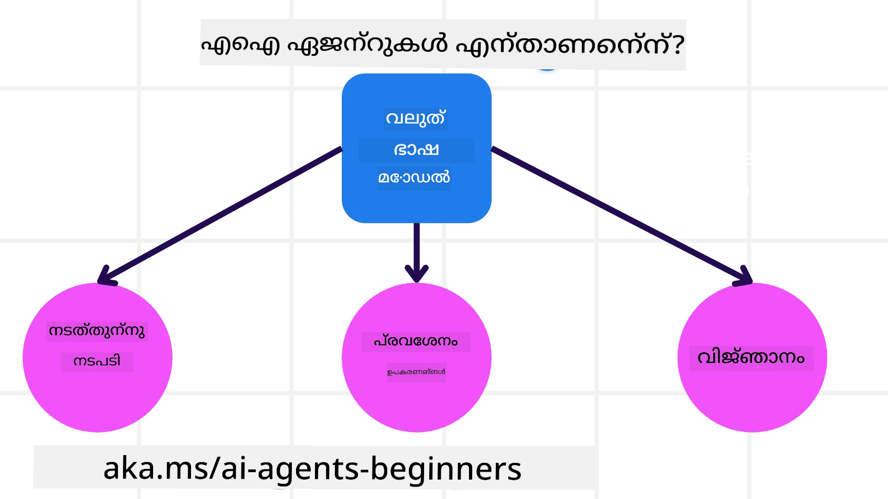
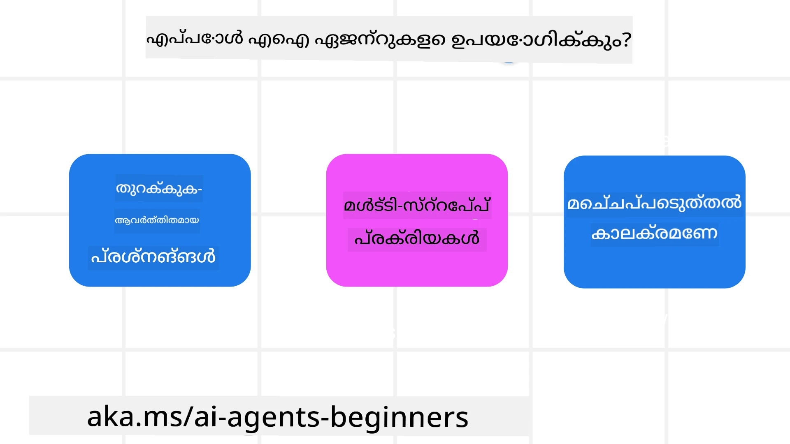

> _(ഈ പാഠത്തിന്റെ വീഡിയോ കാണാൻ മുകളിൽ ചിത്രത്തിൽ ക്ലിക്ക് ചെയ്യുക)_

# എ ഐ ഏജന്റുകളും ഏജന്റ് ഉപയോഗ കേസുകളും പരിചയം

"എ ഐ ഏജന്റുകൾ അധ്യയനാർത്ഥികൾക്കായി" കോഴ്സിലേക്കു സ്വാഗതം! ഈ കോഴ്സ് എ ഐ ഏജന്റുകൾ നിർമ്മിക്കാൻ അടിസ്ഥാന ജ്ഞാനം കൂടാതെ പ്രയോഗം കാണിക്കുന്നു.

മറ്റു വിദ്യാർഥികളെയും എ ഐ ഏജന്റ് നിർമാതാക്കളെയും കാണാനും ഈ കോರ್ಡിൻ്റെ ചോദ്യങ്ങൾ ചോദിക്കാനുമുള്ള <a href="https://discord.gg/kzRShWzttr" target="_blank">Azure AI Discord Community</a>യിൽ ചേർന്നുക.

ഈ കോഴ്സ് തുടങ്ങാൻ മുമ്പായി, എ ഐ ഏജന്റുകൾ എന്തെല്ലാമാണെന്നും, ഞങ്ങൾ നിർമ്മിക്കുന്ന അപ്ലിക്കേഷനുകളിലും പ്രവൃത്തി പ്രക്രിയകളിലും അവ എങ്ങനെ ഉപയോഗിക്കാമെന്നുതന്നെ നന്നായി മനസ്സിലാക്കുന്നു.

## പരിചయం

ഈ പാഠത്തിൽ ഉൾപ്പെടുന്നത്:

- എ ഐ ഏജന്റുകൾ എന്താണ്? ഏജന്റുകൾയുടെ വ്യത്യസ്ത തരം എന്തൊക്കെയാണ്?
- ഏത് ഉപയോഗ കേസുകൾ എ ഐ ഏജന്റുകൾക്കായി മികച്ചതാണ്? അവ എങ്ങനെ സഹായിക്കുമ?
- ഏജന്റിക് സൊല്യൂഷനുകൾ രൂപകൽപ്പന ചെയ്യുമ്പോൾ ചില അടിസ്ഥാന ഘടകങ്ങൾ എന്തെല്ലാമാണ്?

## പഠന ലക്ഷ്യങ്ങൾ
ഈ പാഠം പൂർത്തിയാക്കിയ ശേഷം, നിങ്ങൾക്ക് സാധിക്കേണ്ടത്:

- എ ഐ ഏജന്റ് ആശയങ്ങൾ മനസ്സിലാക്കുക, അവ മറ്റു എ ഐ പരിഹാരങ്ങളിൽ നിന്നുള്ള വ്യത്യാസങ്ങൾ കണ്ടെത്തുക.
- എ ഐ ഏജന്റുകൾ ഏറ്റവും ഫലപ്രദമായി പ്രയോഗിക്കുക.
- ഉപയോക്താക്കൾക്കും ഉപഭോക്താക്കൾക്കുമുള്ള വേണ്ടി ഏജന്റിക് സൊല്യൂഷനുകൾ ഫലപ്രദമായി രൂപകൽപ്പന ചെയ്യുക.

## എ ഐ ഏജന്റുകൾ നിർവ്വചിക്കലും ഏജന്റ് തരം

### എ ഐ ഏജന്റുകൾ എന്താണ്?

എ ഐ ഏജന്റുകൾ **സിസ്റ്റങ്ങൾ** ആകുന്നു, വലിയ ഭാഷാ മാതൃകകൾ (LLMs) **പ്രവർത്തികൾ നടത്താൻ** അവരുടെ കഴിവുകൾ വിപുലീകരിച്ച് LLMs-ക്ക് **ഉപകരണങ്ങളിലേക്കുള്ള ആക്‌സസ്** നൽകുകയും **ജ്ഞാനം** നൽകിയിരിക്കുമാണ്.

ഈ നിർവ്വചനത്തെ ചെറിയ ഭാഗങ്ങളായി വിഭജിക്കാം:

- **സിസ്റ്റം** - ഏജന്റുകൾ വെറും ഒരു ഘടകമല്ല, മറിച്ച് ഒന്നിലധികം ഘടകങ്ങളടങ്ങിയ സിസ്റ്റമായാണ് കാണേണ്ടത്. പ്രാഥമികത്തിൽ, എ ഐ ഏജന്റിന്റെ ഘടകങ്ങൾ:
  - **പരിസ്ഥിതി** - എ ഐ ഏജന്റ് പ്രവർത്തിക്കുന്ന നിശ്ചിത അന്തർഗതം. ഉദാഹരണത്തിന്, യാത്രാപദ്ധതി എ ഐ ഏജന്റുണ്ടെങ്കിൽ, ആ അന്തർഗതം യാത്ര ബുക്കിംഗ് സിസ്റ്റമായിരിക്കും, ഏജന്റ് ടാസ്‌കുകൾ പൂർത്തിയാക്കാൻ ഉപയോഗിക്കുന്നത്.
  - **സെൻസറുകൾ** - പരിസ്ഥിതിക്ക് വിവരങ്ങൾ ഉണ്ട്, പ്രതികരണവും നൽകുന്നു. എ ഐ ഏജന്റുകൾ ഈ വിവരങ്ങൾ ശേഖരിച്ചു നിലവിലെ പരിസ്ഥിതി നില വിശകലനം ചെയ്യാൻ സെൻസറുകൾ ഉപയോഗിക്കുന്നു. ട്രാവൽ ബുക്കിംഗ് ഏജന്റെ ഉദാഹരണത്തിൽ, ഹോട്ടൽ ലഭ്യതയോ ഫ്ലൈറ്റ് വിലയോ പോലുള്ള വിവരങ്ങൾ യാത്ര ബുക്കിംഗ് സിസ്റ്റം നൽകുന്നു.
  - **ആക്‌ട്യുവേറ്ററുകൾ** - ഏജന്റ് പരിസ്ഥിതിയുടെ നിലവിലെ സ്ഥിതി ലഭിച്ചപ്പോൾ, ആ ടാസ്‌കിനു അനുയോജ്യമായ പ്രവർത്തി കണ്ടെത്തി പരിസ്ഥിതി മാറ്റാൻ നടപടി എടുക്കുന്നു. ട്രാവൽ ബുക്കിംഗ് ഏജന്റിനു, ഉപയോക്താവിനു ലഭ്യമായ ഒരു മുറി ബുക്ക് ചെയ്യുമെന്ന് തീരുമാനിക്കാം.

**വലിയ ഭാഷാ മാതൃകകൾ** - LLM-കളുടെ സൃഷ്ടിക്ക് മുമ്പും ഏജന്റുകളുടെ ആശയം ഉണ്ടായിരുന്നുവെങ്കിലും, LLM ഉപയോഗിച്ച് എ ഐ ഏജന്റുകൾ നിർമ്മിക്കുന്നതിന്റെ നേട്ടം മനുഷ്യഭാഷയും ഡാറ്റയും വ്യാഖ്യാനിക്കാൻ കഴിയുന്നതാണ്. ഈ കഴിവ് പരിസ്ഥിതിയിലെ വിവരങ്ങൾ വ്യാഖ്യാനിച്ച്, പരിസ്ഥിതി മാറ്റുന്നതിനുള്ള പദ്ധതി രൂപീകരിക്കാൻ LLMക്ക് സഹായിക്കുന്നു.

**പ്രവർത്തികൾ നടത്തുക** - എ ഐ ഏജന്റ് സിസ്റ്റങ്ങൾക്കു പുറത്തെ, LLMകൾ സാധാരണയായി ഉള്ളടക്കം സൃഷ്ടിക്കുന്നതിലേക്കോ ഉപയോക്താവിന്റെ പ്രോംപ്റ്റ് അടിസ്ഥാനമാക്കിയുള്ള വിവരലഭ്യത്തിനിരുന്നാണ് പരിമിതമായിരിക്കുന്നത്. എ ഐ ഏജന്റ് സിസ്റ്റങ്ങളിൽ, LLM ഉപയോക്താവിന്റെ അഭ്യർത്ഥന വ്യാഖ്യാനിച്ച്, പരിസ്ഥിതിയിലെ ലഭ്യമായ ടൂളുകൾ ഉപയോഗിച്ച് ടാസ്‌കുകൾ പൂർത്തിയാക്കാൻ കഴിയും.

**ഉപകരണങ്ങളിലേക്കുള്ള ആക്‌സസ്** - വഴിയിൽ LLM ഉപയോഗിക്കാവുന്ന ഉപകരണങ്ങൾ എവിടെയാണ് എന്ന് നിർണ്ണയിക്കുന്നത് 1) അവ പ്രവർത്തിക്കുന്ന പരിസ്ഥിതിയും 2) എ ഐ ഏജന്റ് വികസിപ്പിക്കുന്നവന്റെയും മേൽ ആശ്രിതമാണ്. ട്രാവൽ ഏജന്റിന്റെ ഉദാഹരണത്തിൽ, ഏജന്റിന്റെ ടൂളുകൾ ബുക്കിങ് സിസ്റ്റത്തിലെ പ്രവർത്തനങ്ങളാൽ പരിമിതപ്പെടുത്താവുന്നതാണ്, അല്ലെങ്കിൽ ഡെവലപ്പർ ഏജന്റിന്റെ ടൂൾ ആക്‌സസ് വിമാനങ്ങളിലേയ്ക്ക് മാത്രം നിയന്ത്രിക്കാം.

**സ്മൃതി + ജ്ഞാനം** - ഉപയോക്താവും ഏജന്റും തമ്മിലുള്ള സംഭാഷണাংশത്തിൽ ചെറിയകാലത്തെ സ്മൃതി സൂക്ഷിക്കാം. നേരത്തെ പരിസ്ഥിതിയുടെ വിവരങ്ങളുപരി, എ ഐ ഏജന്റുകൾ മറ്റ് സിസ്റ്റങ്ങൾ, സേവനങ്ങൾ, ഉപകരണങ്ങൾ, മറ്റ് ഏജന്റുകൾ എന്നിവയിൽനിന്നും ജ്ഞാനം നേടാൻ കഴിയും. ട്രാവൽ ഏജന്റിന്റെ ഉദാഹരണത്തിൽ, ഉപഭോക്താവിന്റെ യാത്രാ ഇഷ്ടങ്ങൾ അടങ്ങിയ ജ്ഞാനം കസ്റ്റമർ ഡാറ്റാബെയ്‌സിൽ നിന്നുമാകാം.

### വിവിധത്തരം ഏജന്റുകൾ

എ ഐ ഏജന്റുകളുടെ പൊതുവായ നിർവ്വചനമറിയുമ്പോൾ, ചില പ്രത്യേക ഏജന്റ് തരം കാണാം, അവ ഒരു ട്രാവൽ ബുക്കിംഗ് ഏജന്റിൽ എങ്ങനെ പ്രയോഗിക്കാമെന്ന് ചിന്തിക്കാം.

| **ഏജന്റ് തരം**                  | **വിവരണം**                                                                                                                         | **ഉദാഹരണം**                                                                                                                                                                                                            |
| ------------------------------- | ----------------------------------------------------------------------------------------------------------------------------------- | ------------------------------------------------------------------------------------------------------------------------------------------------------------------------------------------------------------------------- |
| **സിംപിൾ റഫ്ലക്സ് ഏജന്റുകൾ**    | മുൻകൂട്ടി നിർവ്വചിച്ച നിയമങ്ങൾ അടിസ്ഥാനമാക്കി തൽക്ഷണ പ്രവർത്തനങ്ങൾ നടത്തുന്നു.                                                     | ട്രാവൽ ഏജന്റ് ഇമെയിലിന്റെ സാങ്കേതികം വ്യാഖ്യാനിച്ച് യാത്രാ പരാതി കസ്റ്റമർ സർവീസിലേക്കു ഫോർവേഡ് ചെയ്യുന്നു.                                                                                                                |
| **മോഡൽ-ബേസ് റഫ്ലക്സ് ഏജന്റുകൾ** | ലോകത്തിന്റെ ഒരു മോഡലും മോഡലിലുള്ള മാറ്റങ്ങളും അടിസ്ഥാനമാക്കി പ്രവർത്തനങ്ങൾ നടത്തുന്നു.                                                 | ചെറിയ വില മാറ്റങ്ങൾ ഉണ്ടായ റൂട്ടുകൾ മുൻഗണന നൽകി ട്രാവൽ ഏജന്റ് യാത്രാ വഴികൾ തിരഞ്ഞെടുക്കുന്നു.                                                                                                                                      |
| **ഗോൾ-ബേസ് ഏജന്റുകൾ**          | ഒരു ലക്ഷ്യം കൈവരിക്കാൻ പദ്ധതികൾ രൂപപ്പെടുത്തി ലക്ഷ്യം വ്യാഖ്യാനിച്ച് പ്രവർത്തനങ്ങൾ നിർദ്ദേശിക്കുന്നു.                                      | യാത്രാ ഏജന്റ് പ്രస్తుత സ്ഥലം മുതൽ ലക്ഷ്യമിടുന്ന സ്ഥലത്തേക്ക് യാത്ര നടത്താൻ ആവശ്യമായ കാര്യങ്ങൾ (കാർ, പബ്ലിക് ട്രാൻസിറ്റ്, ഫ്ലൈറ്റുകൾ) തീരുമാനിച്ച് യാത്ര ബുക്ക് ചെയ്യുന്നു.                                                                 |
| **യൂട്ടിലിറ്റി-ബേസ് ഏജന്റുകൾ**    | മുൻഗണനകളും സംവരണങ്ങളും സംഖ്യാ തലം വിലയിരുത്തി ലക്ഷ്യാന്വേഷണം നിർണ്ണയിക്കുന്നു.                                                | ട്രാവൽ ഏജന്റ് യാത്ര ബുക്കിംഗ് സമയത്ത് സൗകര്യം, ചെലവ് എന്നിവയിൽ ബന്ധം വിലയിരുത്തി പരമാവധി പ്രയോജനം പ്രാപിക്കുന്നു.                                                                                                            |
| **ലേണിംഗ് ഏജന്റുകൾ**           | പ്രതികരണം സ്വീകരിച്ച് ഫീഡ്ബാക്ക് അടിസ്ഥാനമാക്കി പ്രവർത്തനങ്ങൾ ക്രമീകരിച്ച് സമയം കൊണ്ടും മെച്ചപ്പെടുന്നു.                                | യാത്രാ ഏജന്റ് യാത്ര കഴിഞ്ഞ ഉപഭോക്തൃ ഫീഡ്ബാക്ക് ഉപയോഗിച്ച് ഭാവിയായ ബുക്കിംഗുകളിൽ മാറ്റങ്ങൾ വരുത്തുന്നു.                                                                                                                                   |
| **ഹിെരാര്‍ക്കിക്കൽ ഏജന്റുകൾ**      | ഒന്നിലധികം ഏജന്റുകൾ ഉപദ്രവ നിലയിൽ വേർതിരിച്ച്, മുകളിൽനിന്നുള്ള ഏജന്റ് താൽപര്യത്തോടു കൂടെ താഴെനിന്നുള്ള ഏജന്റുകൾ കൂട്ടായി പ്രവർത്തിക്കുന്നു. | യാത്രാ ഏജന്റ് ഒരു യാത്രക്ക് വേണ്ടിയുള്ള ടാസ്‌ക് ഉപടാസ്‌കുകളാക്കി (ഉദാഹരണത്തിന്, പ്രത്യേക ബുക്കിംഗ് റദ്ദാക്കൽ) താഴ്ന്ന നിലയിലെ ഏജന്റുകൾക്ക് നൽകുകയും അവ പൂർത്തിയാക്കി മുകളിൽനിന്നുള്ള ഏജന്റിന് റിപ്പോർട്ട് ചെയ്യുകയും ചെയ്യുന്നു.          |
| **മൾട്ടി-ഏജന്റ് സിസ്റ്റങ്ങൾ (MAS)** | ഏജന്റുകൾ സ്വതന്ത്രമായി, സഹകരിച്ചോ മത്സരിച്ചോ, ടാസ്‌കുകൾ പൂർത്തിയാക്കുന്നു.                                                       | സഹകരണം: ഹോട്ടലുകൾ, ഫ്ലൈറ്റുകൾ, വിനോദസഞ്ചാര സേവനങ്ങൾ വേർതിരിച്ച് ബുക്കിംഗ് ചെയ്‌തു. മത്സരം: ഹോട്ടൽ ബുക്കിംഗ് കാലണ്ടറിൽ ഒന്നിച്ച് പങ്കുവെച്ച് മത്സരിക്കുന്ന ഏജന്റുകൾ ഉപഭോക്താക്കളെ ഹോട്ടലിൽ ബുക്ക് ചെയ്യുന്നു.                   |

## എപ്പോഴാണ് എ ഐ ഏജന്റുകൾ ഉപയോഗിക്കുന്നത്

മുകളിൽ ട്രാവൽ ഏജന്റ് ഉപയോഗിച്ച് പല തരം ഏജന്റുകൾ യാത്ര ബുക്കിംഗിൽ എങ്ങനെ പ്രയോഗിക്കാമെന്ന് വിശദീകരിച്ചു. ഈ അപ്ലിക്കേഷൻ മുഴുവൻ കോഴ്സിലൂടെയും തുടരും.

എ ഐ ഏജന്റുകൾ ഉപയോഗിക്കുന്നത് സ ചിരത്തിൽ ഏറ്റവും അനുയോജ്യമായ ഉപയോഗ കേസുകളുടെ തരം:

- **തുറന്ന പൂർത്തീകരണ പ്രശ്‌നങ്ങൾ** - ഇല്ലാതെ പ്രീകോഡുചെയ്ത് പ്രവൃത്തിപുരോഗതിയെക്കുറിച്ചുള്ള ചുവടുവയ്പുകളെന്നാണ് LLM നിർണ്ണയിക്കുന്നത്.
- **മൾട്ടി-സ്റ്റെപ്പ് പ്രോസസ്സുകൾ** - സിംഗിൾ ടേൺ ഡാറ്റ റിട്രീവലിന്റെ പകരമായി ഏജന്റ് പല ഘട്ടങ്ങളിൽ ഉപകരണങ്ങൾ അല്ലെങ്കിൽ വിവരങ്ങൾ ഉപയോഗിക്കേണ്ട ഘടിപ്പുകൾ.
- **സമയംകൊണ്ട് മെച്ചപ്പെടുത്തൽ** - ഏജന്റ് പരിസ്ഥിതിയോ ഉപയോക്താക്കളിലോ നിന്നുളള ഫീഡ്ബാക്ക് സ്വീകരിച്ചുകൊണ്ട് മെച്ചപ്പെട്ട പ്രയോജനം നൽകാൻ സമയത്തെ തുടർന്ന് മെച്ചപ്പെടുന്നു.

കൂടുതൽ കരുതലുകൾ വിശ്വസനീയമായ എ ഐ ഏജന്റുകൾ എന്ന പാഠത്തിൽ കൈകാര്യം ചെയ്യുന്നു.

## ഏജന്റിക് സൊല്യൂഷനുകളുടെ അടിസ്ഥാനങ്ങൾ

### ഏജന്റ് വികസനം

എ ഐ ഏജന്റ് സിസ്റ്റം രൂപകൽപ്പന ചെയ്യുമ്പോൾ ആദ്യഘട്ടം ഉപകരണങ്ങൾ, പ്രവർത്തികൾ, പെരുമാറ്റങ്ങൾ നിർണ്ണയിക്കുകയാണ്. ഈ കോഴ്സിൽ, നാം **Azure AI Agent Service** ഉപയോഗിച്ച് ഏജന്റുകൾ നിർവചിക്കാനാണ് ശ്രദ്ധ കേന്ദ്രീകരിക്കുന്നത്. ഇതിന് ലഭ്യമായ ചില ഫീച്ചറുകൾ:

- OpenAI, Mistral, Llama പോലുള്ള തുറന്ന മാതൃകകൾ തിരഞ്ഞെടുക്കൽ
- Tripadvisor പോലുള്ള പ്രൊവൈഡർമാരുടെ ലൈസൻസ് ഡാറ്റ ഉപയോഗം
- സ്റ്റാൻഡേർഡൈസ്ഡ് OpenAPI 3.0 ടൂളുകളുടെ പ്രയോഗം

### ഏജന്റിക് മാതൃകകൾ

LLM-കളുമായി സംവാദം പ്രോംപ്റ്റുകൾ വഴി നടക്കുന്നു. എ ഐ ഏജന്റുകളുടെ അർദ്ധസ്വയംഭരണ സ്വഭാവത്താൽ, പരിസ്ഥിതി മാറിയപ്പോൾ LLM-നെ വീണ്ടും മാനുവലായി പ്രോംപ് ചെയ്യേണ്ടി വരാനാവശ്യമായിരിക്കാം. നാം **ഏജന്റിക് മാതൃകകൾ** ഉപയോഗിക്കുന്നു, ഇത് LLM പലഘട്ടങ്ങളിലായി കാര്യക്ഷമമായി പ്രോംപ്റ്റ് ചെയ്യാൻ സഹായിക്കുന്നു.

ഈ കോഴ്സ് പ്രസക്തമായ ചില പ്രശസ്ത ഏജന്റിക് മാതൃകകളിലേക്ക് വിഭജിച്ചിരിക്കുന്നു.

### ഏജന്റിക് ഫ്രെയിംവർക്ക്

ഏജന്റിക് മാതൃകകൾ കോഡിലൂടെ നടപ്പിലാക്കാൻ ഡെവലപ്പർമാർക്ക് അനുവദിക്കുന്ന ഉപകരണങ്ങളാണ് ഏജന്റിക് ഫ്രെയിംവർക്ക്. മികച്ചക AI ഏജന്റ് സഹകരണത്തിനും നിരീക്ഷണത്തിനും പ്രശ്നപരിഹാരത്തിനും ഇവ സഹായകമായ ടെംപ്ലേറ്റുകൾ, പ്ലഗിനുകൾ, ടൂളുകൾ എന്നിവയെല്ലാം നൽകുന്നു.

ഈ കോഴ്സിൽ, നാം ഉൽപ്പാദന സജ്ജമായ എ ഐ ഏജന്റുകൾ നിർമ്മിക്കാൻ മൈക്രോസോഫ്റ്റ് ഏജന്റ് ഫ്രെയിംവർക്ക് (MAF) പരിചയപ്പെടും.

## സാമ്പിൾ കോഡുകൾ

- Python: [Agent Framework](./code_samples/01-python-agent-framework.ipynb)
- .NET: [Agent Framework](./code_samples/01-dotnet-agent-framework.md)

## എ ഐ ഏജന്റുകളെക്കുറിച്ച് കൂടുതൽ ചോദ്യങ്ങളുണ്ടോ?

മറ്റു വിദ്യാർത്ഥികളെയും കാണാനും ഓഫീസ് മണിക്കൂറിൽ പങ്കെടുക്കാനും നിങ്ങൾക്കുള്ള ചോദ്യങ്ങൾ ചോദിക്കാനും [Microsoft Foundry Discord](https://aka.ms/ai-agents/discord) ചേരുക.

## മുമ്പത്തെ പാഠം

[Course Setup](../00-course-setup/README.md)

## അടുത്ത പാഠം

[Exploring Agentic Frameworks](../02-explore-agentic-frameworks/README.md)

---

<!-- CO-OP TRANSLATOR DISCLAIMER START -->
**അകത്ത് അറിയിപ്പ്**:  
ഈ രേഖ [Co-op Translator](https://github.com/Azure/co-op-translator) എന്ന എഐ തർജ്ജമാ സേവനം ഉപയോഗിച്ച് തർജ്ജമ ചെയ്തതാണ്. ശരിയായ പകർപ്പ് നൽകാൻ ഞങ്ങൾ പരിശ്രമിക്കുന്നെങ്കിലും, സ്വയമേവനാക്കി വന്നവിൽ ചില തെറ്റുകളും അസാധുതകളും കാണപ്പെടാവുന്നതാണ്. ഉള്ളടക്കത്തിന്റെ സത്യസന്ധമായ ഉറവിടം ആ പദത്തിന്‍റെ മൊഴിയിലായ ഡോക്യുമെന്റായിരുന്നു. പ്രധാന വിവരങ്ങൾക്കായി വൃത്തിപരമായ മനുഷ്യൻ്റെ തർജ്ജമ നിർബന്ധമാണ്. ഈ തർജ്ജമ ഉപയോഗിക്കുന്നതിൽ പ്രത്യക്ഷപ്പെടുന്ന തെറ്റായ ധാരണകൾക്കോ വ്യാഖ്യാനത്തിലുള്ള പിഴവുകൾക്കോ ഞങ്ങൾ ഉത്തരവാദികളല്ല.
<!-- CO-OP TRANSLATOR DISCLAIMER END -->