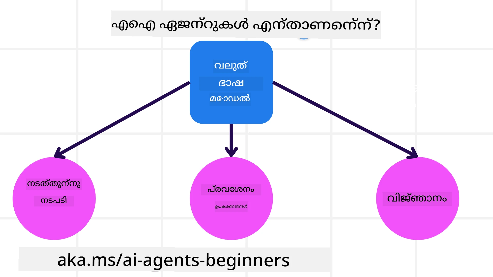
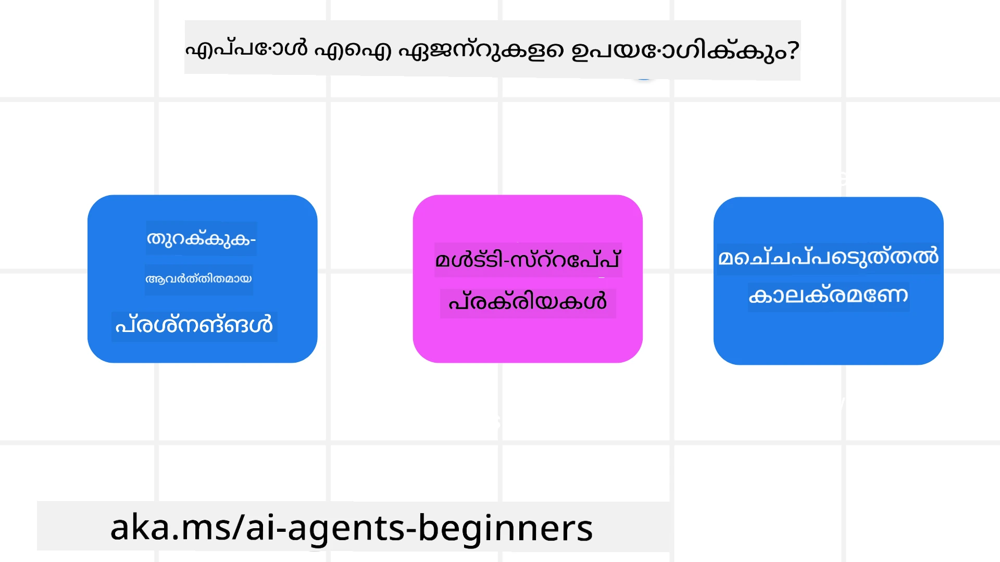

> _(ഈ പാഠത്തിനുള്ള വീഡിയൊ കാണാൻ മുകളിൽ ചിത്രം ക്ലിക്ക് ചെയ്യുക)_

# AI ഏജന്റുകൾക്കും ഏജന്റുകൾ ഉപയോഗിക്കാനുള്ള സാഹചര്യങ്ങൾക്കും പരിചയം

**ആരംഭകർക്കുള്ള AI ഏജന്റുകൾ** കോഴ്സിലേക്ക് സ്വാഗതം! ഈ കോഴ്സ് നിങ്ങളെ അടിസ്ഥാനപരമായ അറിവിലേക്കും — യഥാർത്ഥ പ്രവർത്തനത്തിൽ ഉപയോഗിക്കാവുന്ന കോഡിലേക്കും — കൊണ്ടുവരുന്നു, അങ്ങനെയാണ് നിങ്ങൾ കൊള്ളാത്തതിന്റേതായി AI ഏജന്റുകൾ നിർമ്മിക്കാനാരംഭിക്കാൻ.

<a href="https://discord.gg/kzRShWzttr" target="_blank">Azure AI Discord Community</a>ൽ വന്ന് പറയൂ ഹായ് — പഠിക്കുന്നവരും AI നിർമ്മാതാക്കളും ചോദിച്ചുള്ള സംശയങ്ങൾ സന്തോഷത്തോടെ മറുപടി നൽകാൻ സജ്ജമാണെന്നും.

നിർമ്മാണത്തിലേക്ക് ചാടുന്നതിന് മുമ്പ്, AI ഏജന്റ് എന്നത് എന്താണെന്ന്, എപ്പോഴാണ് അതിനെ ഉപയോഗിക്കുന്നത് യുക്തമെന്നോ കാര്യമായുള്ള വിവരം ഞങ്ങൾക്കുണ്ടെന്നു ഉറപ്പാക്കാം.

---

## പരിചയം

ഈ പാഠത്തിൽ ഉൾക്കൊള്ളുന്നത്:

- AI ഏജന്റുകൾ എന്താണെന്നും അവയുടെ വ്യത്യസ്ത തരംകളും
- ഏജന്റുകളെ ഏറ്റവും അനുയോജ്യമായ ടാസ്കുകൾ ഏതെന്നുള്ളതും
- ഏജന്റിക് പരിഹാരം രൂപകല്‍പന ചെയ്യുമ്പോൾ ഉപയോഗിക്കുന്ന പ്രധാന ഘടകങ്ങൾ

## പഠന ലക്ഷ്യങ്ങൾ

ഈ പാഠം പിന്നീടു വരെ നമേറ്റം നേടേണ്ടത്:

- AI ഏജന്റ് എന്താണെന്നും സാധാരണ AI പരിഹാരത്തിൽ നിന്നും എങ്ങനെ വ്യത്യാസപ്പെടുന്നതാണെന്ന് വിശദീകരിക്കാൻ
- AI ഏജന്റ് ഉപയോഗിക്കേണ്ടപ്പോൾ (ഉപയോഗിക്കേണ്ടാത്തപ്പോൾ) അറിയാൻ
- യഥാർത്ഥ ലോക പ്രശ്നത്തിന് അടിസ്ഥാനമായ ഏജന്റിക് പരിഹാര രൂപകല്‍പന തയ്യാറാക്കാൻ

---

## AI ഏജന്റുകളെ നിർവചിക്കൽ, AI ഏജന്റുകളുടെ തരംകൾ

### AI ഏജന്റുകൾ എന്താണ്?

ഇതാണ് എളുപ്പത്തിൽ മനസ്സിലാക്കാനുള്ള ഒരു രീതിയ്‌:

> **AI ഏജന്റുകൾ വലിയ ഭാഷാ മോഡലുകൾ (LLMs) യഥാർത്ഥത്തിൽ *ഒരുപാട് കാര്യങ്ങൾ ചെയ്യാൻ* അനുവദിക്കുന്ന സിസ്റ്റങ്ങളാണ് — അവയ്ക്ക് ഉപകരണങ്ങളും അറിവും കൊടുത്ത് ലോകത്ത് പ്രവർത്തിക്കാൻ, പ്രോംപ്റ്റുകൾക്ക് മറുപടി നൽകുന്നതിൽ മാത്രമല്ല.**

ഇതു നാം കുറെ വിശദീകരിക്കാം:

- **സിസ്റ്റം** — AI ഏജന്റ് ഒരു വസ്തുവല്ല. ഇത് ഒന്നിച്ചും പ്രവർത്തിക്കുന്ന ഭാഗങ്ങളുടെയും സമാഹാരമാണ്. ഓരോ ഏജന്റിനും മൂന്നു ഭാഗങ്ങൾ ഉണ്ടാകുന്നു:
  - **പരിസ്ഥിതി** — ഏജന്റ് പ്രവർത്തിക്കുന്ന സ്ഥലം. ഒരു യാത്ര ബുക്ക് ചെയ്യുന്ന ഏജന്റിന്, അത് ബുക്കിംഗ് പ്ലാറ്റ്ഫോം തന്നെയാണ്.
  - **സെൻസറുകൾ** — ഏജന്റ് പരിസ്ഥിതിയുടെ നിലവിലെ അവസ്ഥ എന്താണെന്ന് വായിക്കുന്നവിധം. നമ്മുടെ യാത്ര ഏജന്റ് ഹോട്ടൽ ലഭ്യതയും ഫ്ലൈറ്റ് വിലകളും പരിശോധിക്കാം.
  - **ആക്ടിയേറ്ററുകൾ** — ഏജന്റ് പ്രവർത്തനം സ്വീകരിക്കുന്ന വിധം. യാത്ര ഏജന്റ് ഒരു മുറി ബുക്ക് ചെയ്യാം, ഒരു സ്ഥിരീകരണം അയയ്ക്കാം, അല്ലെങ്കിൽ റിസർവേഷൻ റദ്ദാക്കാം.

- **വലിയ ഭാഷാ മോഡലുകൾ** — ഏജന്റുകൾ LLMs മുമ്പേ ഉണ്ടായിരുന്നു, പക്ഷേ LLMs ആണ് ആധുനിക ഏജന്റുകളെ അത്ര ശക്തിയുള്ളതാക്കുന്നത്. അവ പ്രകൃതിദത്ത ഭാഷ മനസ്സിലാക്കുകയും, പ്രസക്തി വിലയിരുത്തുകയും, അബ്ദുധായ ഉപയോക്തൃ അഭ്യർത്ഥന ഒരു യാഥാർത്ഥ്യപരമായ പദ്ധതിയാക്കി മാറ്റുകയും ചെയ്യുന്നു.

- **പ്രവർത്തനങ്ങൾ നടത്തുക** — ഏജന്റ് സിസ്റ്റം ഇല്ലാതെ, LLM് വെറും വാചകം സൃഷ്ടിക്കുന്നു. ഏജന്റ് സിസ്റ്റത്തിനുള്ളിൽ, LLM യഥാർത്ഥമായി രേഖാപരിച്ഛേദങ്ങൾ നടത്താൻ സാധിക്കും — ഡാറ്റാബേസ് തിരയൽ, API വിളിക്കൽ, സന്ദേശം അയയ്ക്കൽ.

- **ഉപകരണങ്ങൾ ഉപയോഗിക്കുക** — ഏജന്റ് ഉപയോഗിക്കാവുന്ന ഉപകരണങ്ങൾ അവ പണി ചെയ്യുന്ന പരിസ്ഥിതിയിൽ (1) ആശ്രയിക്കുന്നു, (2) വികസിപ്പിപ്പിക്കുന്നവർ നൽകുന്നവ. ഒരു യാത്ര ഏജന്റ് ഫ്ലൈറ്റുകൾ തിരയാനുളള കഴിവുണ്ടാകാം, പക്ഷേ ഉപയോക്തൃ രേഖകൾ തിരുത്താനല്ല — എല്ലാം നിങ്ങൾ ഇന്സ്ട്രുമെന്റ് ചെയ്യുന്ന കാര്യമാണ്.

- **മെമ്മറി + അറിവ്** — ഏജന്റുകൾക്ക് ചെറുകാല മെമ്മറി (നിലവിലെ സംഭാഷണം) , ദീർഘകാല മെമ്മറി (ഉപയോക്തൃ ഡാറ്റാബേസ്, മുൻ ഇൻടറാക്ഷനുകൾ) ഉണ്ടായിരിക്കും. യാത്രാ ഏജന്റ് നിങ്ങൾക്ക് ജനാലക്കിടയിലുള്ള സീറ്റ് ഇഷ്ടമാണെന്ന് "മറന്നുവെച്ചിരിക്കാം".

---

### വ്യത്യസ്ത തരം AI ഏജന്റുകൾ

എല്ലാ ഏജന്റുകളും ഒരുപോലെ നിർമ്മിച്ചിട്ടില്ല. പ്രധാന തരംപറഞ്ഞു താഴെ തന്നെയുണ്ട്, ഒരു യാത്ര ബുക്കിങ് ഏജന്റ് ഉദാഹരണമായി ഉപയോഗിച്ചുകൊണ്ട്:

| **ഏജന്റ് തരം** | **അവ എന്ത് ചെയ്യുന്നു** | **യാത്രാ ഏജന്റ് ഉദാഹരണം** |
|---|---|---|
| **സിംപിൾ ರിഫ്ലെക്സ് ഏജന്റുകൾ** | കടുത്ത-കൂടിയ规则 അനുസരിക്കുന്നു — മെമ്മറി ഇല്ല, പദ്ധതികൽപ്പന ഇല്ല. | പരാതി ഇമെയിൽ കാണുമ്പോൾ → ഉപയോക്തൃ მომსახურതയിലേക്ക് അയക്കുന്നു. അതുതാന്ന്. |
| **മോഡൽ-ബേസ്‌ഡ് ರിഫ്ലെക്സ് ഏജന്റുകൾ** | ലോകത്തെ ഒരു ആന്തരിക മോഡൽ നിലനിർത്തുന്നു, അനുസരിച്ച് പുതുക്കുന്നു. | ചരിത്ര ഫ്ലൈറ്റ് വിലകൾ പറ്റി നിരീക്ഷിക്കുന്നു, അതീക്ഷണമായ വില കൂടുന്നതിൽ ശ്രദ്ധ നൽകുന്നു. |
| **ഗോൾ-ബേസ്‌ഡ് ഏജന്റുകൾ** | ഒരു ലക്ഷ്യം മനസ്സിൽ വച്ചു അത് എങ്ങനെ സാദ്ധ്യമാക്കാമെന്ന് ഘട്ടം ഘട്ടമായി കണ്ടെത്തുന്നു. | നിലവിലുള്ള സ്ഥലം നിന്നു ലക്ഷ്യസ്ഥാനത്തേക്ക് മുഴുവൻ യാത്ര (ഫ്ലൈറ്റ്, കാർ, ഹോട്ടൽ) ബുക്ക് ചെയ്യുന്നു. |
| **Utility-Based Agents** | ഒരു പരിഹാരമല്ല—മറ്റുക്കാൾത്തിനെ താരതമ്യപ്പെടുത്തി ഏറ്റവും നല്ല പരിഹാരം കണ്ടെത്തുന്നു. | ചെലവ് മുൻനിർത്തിയും സൗകര്യം മുൻനിർത്തിയും നിങ്ങളുടെ ഇഷ്ടാനുസരണം ഏറ്റവും നല്ല യാത്ര കണ്ടെത്തുന്നു. |
| **Learning Agents** | പ്രതികരണങ്ങളിൽ നിന്നും പഠിച്ച് സമയം കൂടിയായപ്പോൾ മെച്ചപ്പെടുന്നു. | യാത്ര കഴിഞ്ഞ് സേർവേ ഫലം അടിസ്ഥാനമാക്കി ഭാവിയിലെ ബുക്കിംഗ് നിർദ്ദേശങ്ങൾ ക്രമീകരിക്കുന്നു. |
| **Hierarchical Agents** | ഒരു മുകളില്‍ ഏജന്റ് ജോലി ഉപചെയ്യലുകളായി വിഭജിച്ച് താഴ്ന്ന തല ഏജന്റുകൾക്ക് ഏൽപ്പിക്കുന്നു. | "യാത്ര റദ്ദാക്കുക" എന്ന അഭ്യർത്ഥനം തുറം: ഫ്ലൈറ്റ് റദ്ദാക്കൽ, ഹോട്ടൽ റദ്ദാക്കൽ, കാർ റental റദ്ദാക്കൽ — എല്ലാവരും ഉപഏജന്റുകൾ കൈകാര്യം ചെയ്യുന്നു. |
| **Multi-Agent Systems (MAS)** | നിരവധി സ്വതന്ത്ര ഏജന്റുകൾ ഒന്നിച്ച് പ്രവർത്തിക്കുന്നു (അല്ലെങ്കിൽ മത്സരം നടത്തുന്നു). | സഹകരണ: വ്യത്യസ്ത ഏജന്റുകൾ ഹോട്ടലുകൾ, ഫ്ലൈറ്റുകൾ, വിനോദം കൈകാര്യം ചെയ്യുന്നു. മത്സരം: വിവിധ ഏജന്റുകൾ ഹോട്ടൽ മുറികൾ മികച്ച വിലയ്ക്ക് നിറയ്ക്കാൻ മത്സരം നടത്തുന്നു. |

---

## എപ്പോഴായി AI ഏജന്റുകൾ ഉപയോഗിക്കുക

AI ഏജന്റ് ഉപയോഗിക്കാമെന്ന് ഉള്ളത് അവിടെ എപ്പോഴും *ഉപയോഗിക്കുക* എന്നില്ല. താഴെ പറയുന്ന സാഹചര്യങ്ങളിൽ ഏജന്റുകൾ ശരിക്കും പ്രാപ്തരായിരിക്കും:

- **തുറந்த-അവസാനിപ്പിക്കാത്ത പ്രശ്നങ്ങൾ** — പ്രശ്നം പരിഹരിക്കാൻ വേണ്ട ഘട്ടങ്ങൾ മുൻപ് പ്രോഗ്രാം ചെയ്യാനാകാത്തപ്പോൾ. LLM വഴിയൊരുക്കും വേണം.
- **ബഹുസ്ഥായി പ്രക്രിയകൾ** — ഒരിക്കൽ കണ്ടുപിടിക്കൽ അല്ലെങ്കിൽ സൃഷ്ടി മാത്രം അല്ല, ഉപകരണങ്ങൾ പല ഘട്ടങ്ങളിൽ ഉപയോഗിക്കേണ്ട ടാസ്കുകൾ.
- **കാലക്രമേണ മെച്ചപ്പെടുത്തൽ** — ഉപയോക്തൃ ഫീഡ്ബാക്ക് അല്ലെങ്കിൽ പരിസ്ഥിതി സൂചനകൾ അധിഷ്ഠിതമായി സിസ്റ്റം മenten smarter ആകണം എങ്കിൽ.

**Building Trustworthy AI Agents** പാഠത്തിൽ ഈ കോഴ്സിൽ പിന്നീടും എപ്പോഴാണ് (മറ്റനുകൂറും) AI ഏജന്റുകൾ ഉപയോഗിക്കേണ്ടതില്ല എന്നത് വിശദമായി പഠിക്കും.

---

## ഏജന്റിക് പരിഹാരങ്ങളുടെ അടിസ്ഥാനങ്ങൾ

### ഏജന്റ് വികസനം

ഏജന്റ് നിർമ്മിക്കുമ്പോൾ ആദ്യം ചെയ്യേണ്ടത് അത് എന്ത് ചെയ്യുന്നുവെന്ന് നിശ്ചയിക്കുക — അതിന്റെ ഉപകരണങ്ങളും പ്രവർത്തനങ്ങളും പെരുമാറ്റങ്ങളും.

ഈ കോഴ്സിൽ, പ്രധാന പ്ലാറ്റ്ഫോമായും **Microsoft Foundry Agent Service** ഉപയോഗിക്കുന്നു. ഇത് പിന്തുണയ്ക്കുന്നു:

- OpenAI, Mistral, Meta (Llama) പോലുള്ള പ്രൊവൈഡർമാരുടെ മോഡലുകൾ
- Tripadvisor പോലുള്ള പ്രൊവൈഡർമാരിൽ നിന്നുള്ള ലൈസൻസുള്ള ഡാറ്റ
- സ്റ്റാൻഡേർഡ്ഡ് ഓപ്പൺ API 3.0 ഉപകരണ നിർവചനങ്ങൾ

### ഏജന്റിക് തൊഴിലാളികൾ

നിങ്ങൾ LLMs-നൊപ്പം പ്രോംപ്റ്റുകൾ വഴിയാണ് ആശയവിനിമയം നടത്തുന്നത്. ഏജന്റുകളിൽ, എല്ലാ പ്രോംപ്റ്റും മനുഷ്യമനസ്സാക്ഷയോടെ എഴുതാൻ സാധിക്കാറില്ല — ഏജന്റ് പല ഘട്ടങ്ങളിലും പ്രവർത്തിക്കേണ്ടി വരും. അപ്പോൾ **ഏജന്റിക് തൊഴിലാളികൾ** സഹായിക്കുന്നു. അവ LLM-കളുടെ പ്രോംപ്റ്റിങ്ങിനും ഓർക്കസ്ട്രേഷനും പലതവണ ഉപയോഗിക്കാവുന്ന തന്ത്രങ്ങൾ നൽകുന്നു, കൂടുതൽ വിശ്വസനീയമായും സ്‌കേലബിൾമായും.

ഈ കോഴ്സിന്റെ ഘടന ഏറ്റവും സാധാരണവും പ്രയോജനപ്രദവുമായ ഏജന്റിക് തൊഴിലാളികളെ അടിസ്ഥാനമാക്കിയുള്ളതാണ്.

### ഏജന്റിക് ഫ്രെയിംവർക്ക്കൾ

ഏജന്റുകൾ നിർമ്മിക്കാൻ വികസിപ്പിച്ചവർക്കായുള്ള ഒരുക്കം, ഉപകരണങ്ങൾ, അടിസ്ഥാന സൗകര്യങ്ങൾ നൽകുന്ന സിസ്റ്റങ്ങൾ ആണ് ഏജന്റിക് ഫ്രെയിംവർക്കുകൾ. ഇവ ഉപയോഗിച്ചാൽ എളുപ്പപ്പെടും:

- ഉപകരണങ്ങളും ശേഷികളും ബന്ധിപ്പിക്കുക
- ഏജന്റ് എന്ത് ചെയ്യുന്നു കാണുക (പിഴവുണ്ടായാൽ ഡീബഗ് ചെയ്യുക)
- ബഹുഏജന്റുകൾ തമ്മിൽ സഹകരിക്കുക

ഈ കോഴ്സിൽ, **Microsoft Agent Framework (MAF)** ഉപയോഗിച്ച് പ്രൊഡക്ഷൻ തയ്യാറായ ഏജന്റുകൾ നിർമ്മിക്കാൻ ശ്രദ്ധ ചെലുത്തുന്നു.

---

## കോഡ് സാമ്പിളുകൾ

കാഴ്ച തയ്യാറായി കാണാൻ? ഈ പാഠത്തിന്‍റെ കോഡ് സാമ്പിളുകൾ ഇവിടെ:

- 🐍 Python: [Agent Framework](./code_samples/01-python-agent-framework.ipynb)
- 🔷 .NET: [Agent Framework](./code_samples/01-dotnet-agent-framework.md)

---

## സംശയങ്ങളുണ്ടോ?

മറ്റ് പഠനാർത്ഥികളുമായി ബന്ധപ്പെടാനും, ഓഫീസ് മണിക്കൂറുകൾ ഹാജരാകാനും, AI ഏജന്റുകൾക്കുള്ള നിങ്ങളുടെ സംശയങ്ങൾക്ക് സമുദായത്തിലൂടെ ഉത്തരം ലഭിക്കാൻ [Microsoft Foundry Discord](https://discord.com/invite/ATgtXmAS5D) ചേർക്കുക.

---

## മുമ്പത്തെ പാഠം

[കורס് ക്രമീകരണം](../00-course-setup/README.md)

## തുടര്‍ന്നുള്ള പാഠം

[ഏജന്റിക് ഫ്രെയിംവർക്ക് സർക്കാർ കണ്ടെത്തൽ](../02-explore-agentic-frameworks/README.md)

---

<!-- CO-OP TRANSLATOR DISCLAIMER START -->
**അറിയിപ്പ്**:
ഈ രേഖ AI പരിഭാഷാ സേവനം [Co-op Translator](https://github.com/Azure/co-op-translator) ഉപയോഗിച്ച് പരിഭാഷപ്പെടുത്തിയതാണ്. ഞങ്ങൾ കൃത്യതയ്ക്കായി ശ്രമിക്കുന്നുവെങ്കിലും, ഓട്ടോമേറ്റഡ് പരിഭാഷകളിൽ പിഴവുകൾ അല്ലെങ്കിൽ തെറ്റായ വിവരങ്ങൾ ഉണ്ടാകാൻ സാധ്യതയുണ്ട്. അതിന്റെ സ്വാഭാവിക ഭാഷയിലുള്ള അസൽ രേഖയാണ് പ്രാമാണികമായ ഉറവിടമായി പരിഗണിക്കേണ്ടത്. നിർണായകമായ വിവരങ്ങൾക്ക്, പ്രൊഫഷണൽ മനുഷ്യ പരിഭാഷ ശുപാർശ ചെയ്യുന്നു. ഈ പരിഭാഷ ഉപയോഗിച്ച് ഉണ്ടാകുന്ന തെറ്റിദ്ധാരണകൾ അല്ലെങ്കിൽ തെറ്റായ വ്യാഖ്യാനങ്ങൾക്കായി ഞങ്ങൾ ഉത്തരവാദികളല്ല.
<!-- CO-OP TRANSLATOR DISCLAIMER END -->