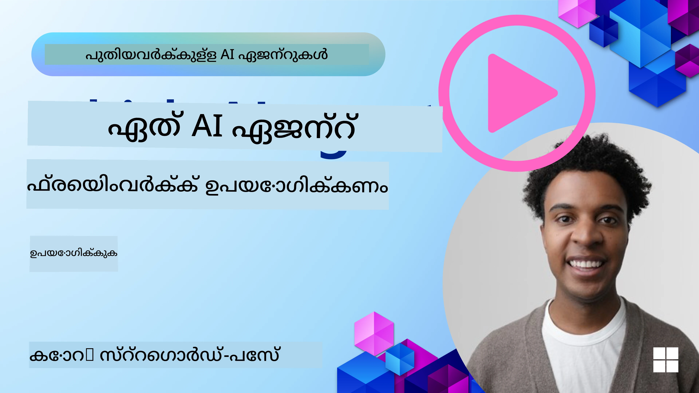

[](https://youtu.be/ODwF-EZo_O8?si=1xoy_B9RNQfrYdF7)

> _(ഈ പാഠത്തിന്റെ വീഡിയോ കാണാൻ മേൽ ചിത്രം ക്ലിക്കുചെയ്യുക)_

# AI ഏജന്റ് ഫ്രെയിംവർക്കുകൾ പരിശോധിക്കുക

AI ഏജന്റ് ഫ്രെയിംവർക്കുകൾ AI ഏജന്റുകൾ സൃഷ്ടിക്കുന്നത്, വിനിയോഗം ചെയ്യുന്നതും നിയന്ത്രിക്കുന്നതും എളുപ്പമാക്കാൻ രൂപകല്‍പ്പന ചെയ്ത സോഫ്റ്റ്‌വെയർ പ്ലാറ്റ്ഫോമുകളാണ്. ഈ ഫ്രെയിംവർക്കുകൾ വികസിപ്പകർക്ക് മുൻകൂറുള്ള ഘടകങ്ങൾ, സമാനർത്ഥങ്ങൾ, ഉപകരണമാർ ചേർത്ത് സങ്കീർണമായ AI സിസ്റ്റങ്ങൾ വികസിപ്പിക്കാനുള്ള പ്രക്രിയ ലളിതമാക്കുന്നു.

ഈ ഫ്രെയിംവർക്കുകൾ വികസിപ്പകർക്ക് അവരുടെ അപ്ലിക്കേഷനുകളുടെ പ്രത്യേകതകളിൽ ശ്രദ്ധ കേന്ദ്രീകരിക്കാനും AI ഏജന്റ് വികസനത്തിലെ പൊതുവായ വെല്ലുവിളികൾക്കായുള്ള മാനക രീതി നൽകാനും സഹായിക്കുന്നു. ഇത് സ്കെയിലബിലിറ്റി, ആക്‌സസിബിലിറ്റി, ക്ഷമത എന്നിവ വർദ്ധിപ്പിക്കുന്നു.

## പരിചയം

ഈ പാഠത്തിൽ ചർച്ച ചെയ്യുക:

- AI ഏജന്റ് ഫ്രെയിംവർക്കുകൾ എന്താണ്, അവ വികസിപ്പകർക്ക് എന്ത് സാധ്യമാക്കുന്നു?
- ടീമുകൾ എങ്ങനെ ദ്രുതഗതിയിലുള്ള പ്രോട്ടോടൈപ്പ് നിർമ്മാണം, പുനരാവർത്തനം, ഏജന്റിന്റെ കഴിവുകൾ മെച്ചപ്പെടുത്തൽ തുടങ്ങിയവ നടത്താം?
- Microsoft സൃഷ്ടിച്ച ഫ്രെയിംവർക്കുകൾ, ഉപകരണങ്ങൾ (<a href="https://aka.ms/ai-agents-beginners/ai-agent-service" target="_blank">Microsoft Foundry Agent Service</a> ഉം <a href="https://learn.microsoft.com/azure/ai-services/openai/how-to/responses" target="_blank">Microsoft Agent Framework</a> ഉം) തമ്മിലുള്ള വ്യത്യാസങ്ങൾ എന്തെല്ലാം?
- നിലവിലുള്ള Azure സമ്പ്രദായ ഉപകരണങ്ങൾ നേരിട്ട് ഇണചേര്ക്കാമോ, അല്ലെങ്കിൽ സ്വതന്ത്ര പരിഹാരങ്ങൾ ആവശ്യമാണോ?
- Microsoft Foundry Agent Service എന്താണെന്നും അതു എങ്ങനെ സഹായിക്കുന്നു?

## പഠനലക്ഷ്യങ്ങൾ

ഈ പാഠത്തിന്റെ ലക്ഷ്യം നിങ്ങളെ സഹായിക്കുക:

- AI ഏജന്റ് ഫ്രെയിംവർക്കുകളുടെ AI വികസനത്തിലെ പങ്ക്.
- ബുദ്ധിമുട്ടമുള്ള ഏജന്റുകൾ നിർമ്മിക്കാൻ എങ്ങനെ AI ഏജന്റ് ഫ്രെയിംവർക്കുകൾ പ്രയോജനപ്പെടുത്താം.
- AI ഏജന്റ് ഫ്രെയിംവർക്കുകൾ സജ്ജമാക്കുന്ന പ്രധാന കഴിവുകൾ.
- Microsoft Agent Framework ഉം Microsoft Foundry Agent Service ഉം തമ്മിലുള്ള വ്യത്യാസങ്ങൾ.

## AI ഏजന്റ് ഫ്രെയിംവർക്കുകൾ എന്തുള്ളൂ, അവ വികസിപ്പകർക്ക് എന്ത് ചെയ്യാൻ സഹായിക്കുന്നു?

പരമ്പരാഗത AI ഫ്രെയിംവർക്കുകൾ നിങ്ങളുടെ ആപ്ലിക്കേഷനുകളിൽ AI ഉൾപ്പെടുത്താൻ സഹായിക്കുകയും അങ്ങനെ ആ ആപ്ലിക്കേഷനുകൾ മികച്ചതാക്കാനും സഹായിക്കുന്നു:

- **വ്യക്തിഗതമായി മാറ്റുന്നത്**: AI ഉപയോക്തൃ പെരുമാറ്റവും ഇഷ്ടങ്ങളും വിശകലനം ചെയ്തു വ്യക്തിഗത ശുപാർശകൾ, ഉള്ളടക്കം, അനുഭവങ്ങൾ നൽകാൻ കഴിയും.
ഉദാഹരണം: Netflix പോലുള്ള സ്ട്രീമിംഗ് സേവനങ്ങൾ ദൃശ്യമേഖലയുടെ ചരിത്രം അടിസ്ഥാനമാക്കി സിനിമകളും ഷോകളും ശുപാർശ ചെയ്യുന്നു, ഉപയോക്തൃ പങ്കാളിത്തം വളർത്തുന്നു.
- **ഓട്ടോമേഷൻ, കാര്യക്ഷമത**: AI ആവർത്തിക്കുന്ന പ്രവൃത്തികൾ ഓട്ടോമേഷൻ ചെയ്ത് പ്രവൃത്തി താളുകൾ ലളിതമാക്കുകയും പ്രവർത്തനക്ഷമത വർദ്ധിപ്പിക്കുകയും ചെയ്യുന്നു.
ഉദാഹരണം: ഉപഭോക്തൃ സേവന ആപ്ലിക്കേഷനുകളിൽ AI അധിഷ്ഠിത ചാറ്റ്ബോട്ടുകൾ സാധാരണ ചോദിച്ച ചോദ്യങ്ങൾ കൈകാര്യം ചെയ്ത് മനുഷ്യ ഏജന്റുകൾക്കു സങ്കീർണ വിഷയങ്ങൾക്കായി സമയം വിടുന്നു.
- **മികച്ച ഉപയോക്തൃ അനുഭവം**: ശബ്ദ തിരിച്ചറിയൽ, പ്രകൃതി ഭാഷ പ്രോസസിംഗും പ്രവചിത എഴുത്തും പോലുള്ള ബുദ്ധിമുട്ടുള്ള സവിശേഷതകൾ നൽകി ഉയർന്ന ഉപയോക്തൃ അനുഭവം നൽകുന്നു.
ഉദാഹരണം: Siri, Google Assistant പോലുള്ള വിർച്വൽ അസിസ്റ്റൻറുകൾ ശബ്ദ കമാൻഡുകൾ മനസിലാക്കി മറുപടി നല്കുന്നു, ഉപയോക്താക്കൾക്ക് അവരുടെ ഉപകരണങ്ങൾ എളുപ്പത്തിൽ നിയന്ത്രിക്കാൻ സഹായിക്കുന്നു.

### എല്ലാം മനസ്സിലായി, എങ്കിലും AI ഏജന്റ് ഫ്രെയിംവർക്ക് എന്തിനാണു ആവശ്യം?

AI ഏജന്റ് ഫ്രെയിംവർക്ക് കൃത്യമായ AI ഫ്രെയിംവർക്കുകളേക്കാൾ കൂടുതൽ പ്രതിനിധാനം ചെയ്യുന്നു. ഉപയോക്താക്കൾക്കും മറ്റ് ഏജന്റുകൾക്കും പരിസ്ഥിതിക്കും വ്യാപകമായും ഇടപെടാൻ കഴിയുന്ന ബുദ്ധിമുട്ടുള്ള ഏജന്റുകൾ സൃഷ്ടിക്കാനുള്ള രൂപകല്‍പ്പനയാണ് ഇവയ്ക്കുള്ളത്. ഈ ഏജന്റുകൾ സ്വയം നിയന്ത്രണം കാണിക്കുകയും, തീരുമാനം എടുക്കുകയും, സാഹചര്യങ്ങൾ അനുസരിച്ച് ത образом മാറുകയും ചെയ്യുന്നു. AI ഏജന്റ് ഫ്രെയിംവർക്കുകൾ സഹായിക്കുന്ന ചില പ്രധാന കഴിവുകൾ ഇതാണ്:

- **ഏജന്റ് സഹകരണവും ഏകോപനവും**: ബഹുവിധ AI ഏജന്റുകൾ തമ്മിൽ സഹകരിച്ച്, ആശയവിനിമയം നടത്തി സങ്കീർണ ജോലികൾ പരിഹരിക്കാൻ സഹായിക്കുന്നു.
- **പ്രവൃത്തി ഓട്ടോമേഷൻ, മാനേജ്‌മെന്റ്**: ബഹു-പടി പ്രവൃത്തി താളുകൾ, ജോലികൾ വിനിയോഗം, ഡൈനാമിക് മാനേജ്മെന്റ് എന്നിവ ഓട്ടോമേറ്റ് ചെയ്യാനുള്ള സംവിധാനങ്ങൾ നൽകുന്നു.
- **സന്ദർഭ മാതൃക മനസ്സിലാക്കൽ, സാന്ദർഭ്യമായി മാറൽ**: ഏജന്റുകൾക്ക് ഉത്തരവാദിത്വം വെച്ച സാഹചര്യവും കാലാവസ്ഥയും മനസ്സിലാക്കി യथാർത്ഥ സമയ വിവരങ്ങളുടെ അടിസ്ഥാനത്തിൽ തീരുമാനങ്ങൾ എടുക്കാൻ കഴിയും.

ഒരു പ്രസ്താവനയിൽ, ഏജന്റുകൾ നിങ്ങൾക്ക് കൂടുതൽ ചെയ്യാൻ, ഓട്ടോമേഷൻ പുതിയ തലത്തിലേക്ക് കൊണ്ടുപോകാൻ, പരിസ്ഥിതിയിൽ നിന്നും പഠിച്ച് രൂപീകരിക്കുന്ന കൂടുതൽ ബുദ്ധിമുട്ടുള്ള സിസ്റ്റങ്ങൾ സൃഷ്ടിക്കാൻ സഹായിക്കുന്നു.

## എങ്ങനെ ദ്രുതഗതിയിലുള്ള പ്രോട്ടോടൈപ്പ്, പുനരാവർത്തനം, ഏജന്റിന്റെ കഴിവുകൾ മെച്ചപ്പെടുത്താം?

ഈ രംഗം വയറ്ച്ചയായി മാറുന്നു, പക്ഷെ പല AI ഏജന്റ് ഫ്രെയിംവർക്കുകളിലും ചില സാധാരണ ഘടകങ്ങൾ ഉണ്ട്: ഘടകങ്ങൾ, സഹകരണ ഉപകരണങ്ങൾ, യഥാർത്ഥകാല പഠനം. ഇവയെ കുറിച്ച് കൂടി നോക്കാം:

- **ഘടകങ്ങൾ ഉപയോഗിക്കുക**: AI SDKകൾ AI, മെമ്മറി കണക്ടറുകൾ, ഫംഗ്ഷൻ കോൾ, പ്രോംപ്‌റ്റ് ടെംപ്ലേറ്റുകൾ എന്നിവ മുൻകൂട്ടിയാണ് നൽകുന്നത്.
- **സഹകരണ ഉപകരണങ്ങൾ പ്രയോജനപ്പെടുത്തുക**: പ്രത്യേക പങ്കുകളും ജോലികളും ഉള്ള ഏജന്റുകൾ രൂപകല്പന ചെയ്ത്, കൂട്ടായ പ്രവർത്തനം പരീക്ഷിച്ച് മെച്ചപ്പെടുത്തുക.
- **യഥാർത്ഥ സമയത്തിൽ പഠിക്കുക**: ഇടപെടലിൽ നിന്നുള്ള പ്രതികരണങ്ങൾ വഴി ഏജന്റുകൾ പഠിക്കാനും പെരുമാറ്റം മാറ്റാനും അതിനു അനുയോജ്യമായ ഫീഡ്ബാക്ക് ലൂപ്പുകൾ നടപ്പിലാക്കുക.

### ഘടകങ്ങൾ ഉപയോഗിക്കൽ

Microsoft Agent Framework പോലുള്ള SDKകൾ മുൻകൂട്ടി AI കണക്ടറുകൾ, ടൂൾ നിർവചനങ്ങൾ, ഏജന്റ് മാനേജ്മെന്റ് ഘടകങ്ങൾ നൽകുന്നു.

**ടീമുകൾ എങ്ങനെ ഉപയോഗിക്കും**: ടീം അംഗങ്ങൾ ഈ ഘടകങ്ങൾ വേഗത്തിൽ ചേർത്ത് ഫംഗ്ഷനൽ പ്രോട്ടോടൈപ്പ് സൃഷ്ടിക്കാവുന്നതാണ്, അതിവേഗം പരീക്ഷണം നടത്താനും പുനരാവർത്തനം നടത്താനും സഹായിക്കുന്നു.

**പ്രവൃത്തി രീതിയിൽ**: ഉപയോക്തൃ ഇൻപുട്ടിൽ നിന്ന് വിവരങ്ങൾ പാഴ്‌സ് ചെയ്യുന്നതിനുള്ള മുൻകൂട്ടി ഘടകം, ഡാറ്റാ സൂക്ഷിക്കാനും തിരികെ കണ്ടെത്താനും മെമ്മറി ഘടകം, ഉപയോക്താക്കളുമായി ഇടപെടാനുള്ള പ്രോംപ്‌റ് ജനറേറ്റർ തുടങ്ങിയ ഘടകങ്ങൾ നിർമ്മിക്കേണ്ടതില്ലാതെ ഉപയോഗിക്കാം.

**ഉദാഹരണ കോഡ്**: Microsoft Agent Framework `FoundryChatClient` ഉപയോഗിച്ച് ഉപയോക്തൃ ഇൻപുട്ടിൽ ടൂൾ കോൾകൊണ്ട് പ്രതികരിക്കുന്ന മോഡൽ ഉണ്ടാക്കുന്നതിനെക്കുറിച്ചുള്ള ഉദാഹരണം:

``` python
# മൈക്രോസോഫ്റ്റ് ഏജന്റ് ഫ്രയിംവർക്ക് പൈത്തൺ ഉദാഹരണം

import asyncio
import os

from agent_framework import tool
from agent_framework.foundry import FoundryChatClient
from azure.identity import AzureCliCredential


# യാത്ര ബുക്ക് ചെയ്യാനുള്ള സാമ്പിൾ ടൂൾ ഫങ്ഷൻ നിർവചിക്കുക
@tool(approval_mode="never_require")
def book_flight(date: str, location: str) -> str:
    """Book travel given location and date."""
    return f"Travel was booked to {location} on {date}"


async def main():
    provider = FoundryChatClient(
        project_endpoint=os.environ["AZURE_AI_PROJECT_ENDPOINT"],
        model=os.environ["AZURE_AI_MODEL_DEPLOYMENT_NAME"],
        credential=AzureCliCredential(),
    )
    agent = provider.as_agent(
        name="travel_agent",
        instructions="Help the user book travel. Use the book_flight tool when ready.",
        tools=[book_flight],
    )

    response = await agent.run("I'd like to go to New York on January 1, 2025")
    print(response)
    # ഉദാഹരണ ഔട്ട്പുട്ട്: 2025 ജനുവരി 1-ന് ന്യൂയോർക്ക്‌ വേണ്ടി നിങ്ങളുടെ വിമാന യാത്ര വിജയകരമായി ബുക്ക് ചെയ്തു. സുരക്ഷിത യാത്രകൾ! ✈️🗽


if __name__ == "__main__":
    asyncio.run(main())
```

ഈ ഉദാഹരണത്തിൽ കാണുന്നത് ഉപയോക്തൃ ഇൻപുട്ടിൽ നിന്നും പ്രധാന വിവരങ്ങൾ (origin, destination, date) എങ്ങനെ പാഴ്‌സ് ചെയ്യാമെന്ന് ആണ്. ഈ ഘടകഘടിതമായ സമീപനം ഉയർന്നതല ലോഗിക്കിൽ ശ്രദ്ധ കേന്ദ്രീകരിക്കാനാകും.

### സഹകരണ ഉപകരണങ്ങൾ പ്രയോജനപ്പെടുത്തുക

Microsoft Agent Framework പോലുള്ള ഫ്രെയിംവർക്കുകൾ ബഹു ഏജന്റുകൾ തമ്മിലുള്ള സഹകരണ സൗകര്യം നൽകുന്നു.

**ടീമുകൾ എങ്ങനെ ഉപയോഗിക്കും**: പ്രത്യേക ഫങ്ഷൻ, ടാസ്കുകളുള്ള ഏജന്റുകൾ രൂപകൽപ്പന ചെയ്ത് കൂട്ടായ പ്രവർത്തനങ്ങൾ പരിശോധിക്കുകയും മെച്ചപ്പെടുത്തുകയും ചെയ്യും.

**പ്രവൃത്തി രീതിയിൽ**: ഡാറ്റാ റിട്രീവൽ, വിശകലനം, തീരുമാനമെടുക്കൽ എന്നിവയ്ക്കായി പ്രത്യേക ഏജന്റുകൾ അടങ്ങിയ ടീം രൂപീകരിക്കാം. ഇവ തമ്മിൽ ആശയവിനിമയം നടത്തി ഒരു പൊതുവഴിയിൽ ലക്ഷ്യങ്ങൾ പൂർത്തിയാക്കും.

**ഉദാഹരണ കോഡ് (Microsoft Agent Framework)**:

```python
# മൈക്രോസോഫ്റ്റ് ഏജന്റ് ഫ്രെയിംവർക്കിന്റെ സഹായത്തോടെ ഒരുമിച്ച് പ്രവർത്തിക്കുന്ന ബഹള ഏജന്റ്‌സ് സൃഷ്ടിക്കുന്നു

import os
from agent_framework.foundry import FoundryChatClient
from azure.identity import AzureCliCredential

provider = FoundryChatClient(
    project_endpoint=os.environ["AZURE_AI_PROJECT_ENDPOINT"],
    model=os.environ["AZURE_AI_MODEL_DEPLOYMENT_NAME"],
    credential=AzureCliCredential(),
)

# ഡാറ്റ റിട്രീവൽ ഏജന്റ്
agent_retrieve = provider.as_agent(
    name="dataretrieval",
    instructions="Retrieve relevant data using available tools.",
    tools=[retrieve_tool],
)

# ഡാറ്റ വിശകലന ഏജന്റ്
agent_analyze = provider.as_agent(
    name="dataanalysis",
    instructions="Analyze the retrieved data and provide insights.",
    tools=[analyze_tool],
)

# ഒരു ടാസ്കിൽ ഏജന്റുകളെ അനുക്രമമായി പ്രവർത്തിപ്പിക്കുക
retrieval_result = await agent_retrieve.run("Retrieve sales data for Q4")
analysis_result = await agent_analyze.run(f"Analyze this data: {retrieval_result}")
print(analysis_result)
```

മുൻഗാമി കാണിച്ച കോഡിൽ, ഡാറ്റ വിശകലനം ചേരുന്ന ബഹുദ്ദേശ ഏജന്റ് പ്രവർത്തന ടാസ്‌ക്ക് തിരഞ്ഞെടുത്തിരിക്കുന്നു. പ്രത്യേക പങ്കുള്ള ഏജന്റുകൾ രൂപീകരിച്ച് ഇവയുടെ സഹകരണം ആർജ്ജിത ഫലം നൽകുന്നതാണ്.

### യഥാർത്ഥ സമയ പഠനം

ആധുനിക ഫ്രെയിംവർക്കുകൾ യഥാർത്ഥ സമയം സന്ദർഭം മനസിലാക്കലും അനുസരണയും നൽകുന്നു.

**ടീമുകൾ എങ്ങനെ ഉപയോഗിക്കും**: ഇടപെടലുകളിൽ നിന്നുള്ള ഫീഡ്ബാക്ക് വഴി ഏജന്റുകൾ നിരന്തരം പഠിക്കുകയും പെരുമാറ്റം മാറ്റുകയും ചെയ്യുന്ന ഫീഡ്ബാക്ക് ലൂപ്പുകൾ നടപ്പിലാക്കാം.

**പ്രവൃത്തി രീതിയിൽ**: ഉപയോക്തൃ ഫീഡ്ബാക്ക്, പരിസ്ഥിതി ഡാറ്റ, ജോലിയുടെ ഫലം എന്നിവ വിശകലനം ചെയ്ത് അധികൃതരുടെ അറിവും തീരുമാനമെടുക്കൽ ആൽഗോരിതങ്ങൾ അപ്ഡേറ്റ് ചെയ്ത് പ്രവർത്തനക്ഷമത മെച്ചപ്പെടുത്തുന്നു. ഇത്തരത്തിലുള്ള ആവർത്തന പഠന പ്രക്രിയ ഏജന്റുകൾ മാറ്റങ്ങളിലേക്ക് തയ്യാറാക്കുകയും ഉപയോക്തൃ ഇഷ്ടാനുസൃതമാക്കുകയും ചെയ്യുന്നു, അപ്പോൾ സിസ്റ്റം മൊത്തത്തിലുള്ള ഫലപ്രാപ്തി വർദ്ധിക്കുന്നു.

## Microsoft Agent Framework ഉം Microsoft Foundry Agent Service ഉം തമ്മിലുള്ള വ്യത്യാസങ്ങൾ എന്ത്?

ഈ സമീപനങ്ങൾ തമ്മിൽ താരതമ്യം ചെയ്‌താൽ, രൂപകൽപ്പന, കഴിവുകൾ, ലക്ഷ്യമിട്ട ഉപയോഗ മേഖലയിലുള്ള ചില പ്രധാന വ്യത്യാസങ്ങൾ കാണാം:

## Microsoft Agent Framework (MAF)

Microsoft Agent Framework `FoundryChatClient` ഉപയോഗിച്ച് AI ഏജന്റുകൾ നിർമ്മിക്കാനായി സൂരിയ SDK ആണ്. Azure OpenAI മോഡലുകളുമായി ടൂൾ കോൾ, സംഭാഷണ മാനേജ്മെന്റ്, Azure തിരിച്ചറിയലുകൾ വഴി സംരംഭനിര CSIകക്ഷമ സുരക്ഷ എന്നിവ ഉൾക്കൊള്ളുന്നു.

**ഉപയോഗ മേഖലകൾ**: ടൂൾ ഉപയോഗം, ബഹു-പടി പ്രവൃത്തി താളുകൾ, സംരംഭ സംയോജനം തുടങ്ങി പ്രൊഡക്ഷൻ- റെഡി AI ഏജന്റുകൾ നിർമ്മിക്കുമ്പോൾ.

Microsoft Agent Framework പ്രധാന ആശയങ്ങൾ:

- **ഏജന്റുകൾ**: `FoundryChatClient` ഉപയോഗിച്ച് ഏജന്റുകൾ നിർമ്മിക്കാം; പേരു, നിർദ്ദേശങ്ങൾ, ഉപകരണങ്ങൾ നൽകി ക്രമീകരിക്കും. ഏജന്റ് ചെയ്യുക:
  - **ഉപയോക്തൃ സന്ദേശങ്ങൾ പ്രോസസ്സ് ചെയ്ത്** Azure OpenAI മോഡലുകൾ ഉപയോഗിച്ച് മറുപടി സൃഷ്ടിക്കുക.
  - **സംഭാഷണ സന്ദർഭം അടിസ്ഥാനമാക്കി ടൂൾ സ്വയം വിളിക്കുക**.
  - **അനేక ഇടപെടലുകൾക്കിടയിൽ സംഭാഷണ നില നിലനിർത്തുക**.

  ഏജന്റ് സ്രഷ്ടിക്കുന്നത് കാണിക്കുന്ന കോഡ്:

    ```python
    import os
    from agent_framework.foundry import FoundryChatClient
    from azure.identity import AzureCliCredential

    provider = FoundryChatClient(
        project_endpoint=os.environ["AZURE_AI_PROJECT_ENDPOINT"],
        model=os.environ["AZURE_AI_MODEL_DEPLOYMENT_NAME"],
        credential=AzureCliCredential(),
    )
    agent = provider.as_agent(
        name="my_agent",
        instructions="You are a helpful assistant.",
    )

    response = await agent.run("Hello, World!")
    print(response)
    ```

- **ടൂളുകൾ**: പ്രവർത്തനങ്ങളുടെ ഓട്ടോ-വിളവിനായി Python ഫംഗ്ഷൻ ആവശ്യമുള്ള ടൂളുകൾ നിർവചിക്കാം, ഏജന്റ് സൃഷ്ടിക്കുമ്പോൾ രജിസ്റ്റർ ചെയ്യും:

    ```python
    def get_weather(location: str) -> str:
        """Get the current weather for a location."""
        return f"The weather in {location} is sunny, 72\u00b0F."

    agent = provider.as_agent(
        name="weather_agent",
        instructions="Help users check the weather.",
        tools=[get_weather],
    )
    ```

- **ബഹു-ഏജന്റ് ഏകോപനം**: വ്യത്യസ്ത പ്രത്യേകതകളുള്ള ബഹുഏജന്റുകൾ സൃഷ്ടിക്കുകയും അവയുടെ പ്രവർത്തനം ഏകോപിപ്പിക്കുകയും ചെയ്യാം:

    ```python
    planner = provider.as_agent(
        name="planner",
        instructions="Break down complex tasks into steps.",
    )

    executor = provider.as_agent(
        name="executor",
        instructions="Execute the planned steps using available tools.",
        tools=[execute_tool],
    )

    plan = await planner.run("Plan a trip to Paris")
    result = await executor.run(f"Execute this plan: {plan}")
    ```

- **Azure തിരിച്ചറിയൽ സംയോജനങ്ങൾ**: `AzureCliCredential` (അല്ലെങ്കിൽ `DefaultAzureCredential`) ഉപയോഗിച്ച് സുരക്ഷിത ക്യില്ലസുന്ദരമായ പ്രാമാണികത, API കീകൾ കൈകാര്യം ചെയ്യേണ്ടതില്ല.

## Microsoft Foundry Agent Service

Microsoft Ignite 2024 ൽ അവതരിപ്പിച്ച Microsoft Foundry Agent Service പുതിയ ഒരു സേവനമാണ്. ഇത് Llama 3, Mistral, Cohere പോലെയുള്ള തുറന്ന സ്രോതസ്സുള്ള LLMകളും നേരിട്ട് വിളിക്കാനുള്ള സൗകര്യം നൽകിയ മോഡലുകൾ ഉപയോഗിച്ച് AI ഏജന്റുകൾ വികസിപ്പിക്കാനും വിനിയോഗിക്കാനും അനുവദിക്കുന്നു.

Microsoft Foundry Agent Service ശക്തമായ സംരംഭ സുരക്ഷയും ഡാറ്റ സംഭരണ സംവിധാനവും നൽകുന്നു, ഇതു സംരംഭ അപ്ലിക്കേഷനുകൾക്കു അനുയോജ്യമാണ്.

Microsoft Agent Framework-ഉം Microsoft Foundry Agent Service-ഉം ചേർന്ന് ഏജന്റുകൾ നിർമ്മിച്ച് വിനിയോഗിക്കാം.

ഇപ്പോൾ ഈ സേവനം পাব്ലിക്കൽ പ്രിവ്യുവിലാണ്, Python, C#-ൽ ഏജന്റുകൾ നിർമ്മിക്കുന്നത് പിന്തുണയ്ക്കുന്നു.

Microsoft Foundry Agent Service Python SDK ഉപയോഗിച്ച് ഉപയോക്തൃ നിർവ്വചിത ടൂൾ ഉള്ള ഏജന്റ് സൃഷ്ടിക്കുന്നത്:

```python
import asyncio
from azure.identity import DefaultAzureCredential
from azure.ai.projects import AIProjectClient

# ടൂൾ ഫംഗ്ഷനുകൾ നിർവചിക്കുക
def get_specials() -> str:
    """Provides a list of specials from the menu."""
    return """
    Special Soup: Clam Chowder
    Special Salad: Cobb Salad
    Special Drink: Chai Tea
    """

def get_item_price(menu_item: str) -> str:
    """Provides the price of the requested menu item."""
    return "$9.99"


async def main() -> None:
    credential = DefaultAzureCredential()
    project_client = AIProjectClient.from_connection_string(
        credential=credential,
        conn_str="your-connection-string",
    )

    agent = project_client.agents.create_agent(
        model="gpt-4o-mini",
        name="Host",
        instructions="Answer questions about the menu.",
        tools=[get_specials, get_item_price],
    )

    thread = project_client.agents.create_thread()

    user_inputs = [
        "Hello",
        "What is the special soup?",
        "How much does that cost?",
        "Thank you",
    ]

    for user_input in user_inputs:
        print(f"# User: '{user_input}'")
        message = project_client.agents.create_message(
            thread_id=thread.id,
            role="user",
            content=user_input,
        )
        run = project_client.agents.create_and_process_run(
            thread_id=thread.id, agent_id=agent.id
        )
        messages = project_client.agents.list_messages(thread_id=thread.id)
        print(f"# Agent: {messages.data[0].content[0].text.value}")


if __name__ == "__main__":
    asyncio.run(main())
```

### പ്രധാന ആശയങ്ങൾ

Microsoft Foundry Agent Service പ്രധാന ആശയങ്ങൾ:

- **ഏജന്റ്**: Microsoft Foundry-യുമായി സംയോജിതമാണ്. AI ഏജന്റ് "സ്മാർട്ട്" മൈക്രോസർവീസായി പ്രവർത്തിച്ചു ചോദ്യങ്ങൾക്ക് ഉത്തരം നൽകും (RAG), പ്രവർത്തനങ്ങൾ നിർവഹിക്കും, പ്രവൃത്തി താളുകൾ സ്വയം ഓട്ടോമേറ്റ് ചെയ്യും. സൃഷ്ടി പ്രാരഭിച്ച് ജനിതക AI മോഡലുകളുടെ ശക്തി ഉപകരണങ്ങളുമായി ചേർത്ത് യഥാർത്ഥ ഡാറ്റാ സ്രോതസ്സുകളിൽ ആക്‌സസ് ചെയ്യാനും ഇടപെടാനും കഴിയും. ഉദാഹരണ ഏജന്റ്:

    ```python
    agent = project_client.agents.create_agent(
        model="gpt-4o-mini",
        name="my-agent",
        instructions="You are helpful agent",
        tools=code_interpreter.definitions,
        tool_resources=code_interpreter.resources,
    )
    ```

    ഈ ഉദാഹരണത്തിൽ, മോഡൽ `gpt-4o-mini`, പേര് `my-agent`, നിർദ്ദേശം `You are helpful agent` എന്നിവയോടുകൂടിയ ഏജന്റ് സൃഷ്ടിക്കപ്പെട്ടു. കോഡ് വ്യാഖ്യാനം നടത്താനുള്ള ഉപകരണങ്ങളും സ്രോതസ്സും ഏജന്റിന് നൽകിയിട്ടുണ്ട്.

- **ത്രെഡ്, സന്ദേശങ്ങൾ**: ത്രെഡ് ഒരു സംഭാഷണ എന്ന് ഏജന്റും ഉപയോക്താവും തമ്മിലുള്ള ഇടപെടലാണ്. ത്രെഡുകൾ സംഭാഷണ പുരോഗതി പിന്തുടരാനും സാന്റർഭ്യ വിവരങ്ങൾ സൂക്ഷിക്കാനും ഇടപെടലിന്റെ നില നിയന്ത്രിക്കാനും ഉപയോഗിക്കും. ത്രെഡിന്റെ ഉദാഹരണം:

    ```python
    thread = project_client.agents.create_thread()
    message = project_client.agents.create_message(
        thread_id=thread.id,
        role="user",
        content="Could you please create a bar chart for the operating profit using the following data and provide the file to me? Company A: $1.2 million, Company B: $2.5 million, Company C: $3.0 million, Company D: $1.8 million",
    )
    
    # ഏജന്റിനെ ത്രെഡ് üzerinde ജോലി ചെയ്യാന്‍ ആവശ്യപ്പെടുക
    run = project_client.agents.create_and_process_run(thread_id=thread.id, agent_id=agent.id)
    
    # ഏജന്റിന്റെ പ്രതികരണം കാണാന്‍ എല്ലാ സന്ദേശങ്ങളും എടുത്ത് രേഖപ്പെടുത്തുക
    messages = project_client.agents.list_messages(thread_id=thread.id)
    print(f"Messages: {messages}")
    ```

    മുൻഗാമി കോഡിൽ ത്രെഡ് സൃഷ്ടിച്ചു, പിന്നീട് സന്ദേശം അയച്ചു. `create_and_process_run` വിളിച്ച് ഏജന്റിനുള്ളിൽ പ്രവർത്തനം നടത്താൻ ആവശ്യപ്പെട്ടു. സന്ദേശങ്ങൾ എടുക്കുകയും ഏജന്റിന്റെ മറുപടി രേഖപ്പെടുത്തുകയും ചെയ്തു. സന്ദേശങ്ങൾ സംഭാഷണ പുരോഗതി സൂചിപ്പിക്കുന്നു. സന്ദേശങ്ങൾ വിവിധ വിഭാഗങ്ങളായിരിക്കും (പഠനം, ചിത്രം, ഫയൽ തുടങ്ങിയവ) - ഉദാഹരണത്തിന്, ഏജന്റിന്റെ പ്രവർത്തനം ചിത്രമായോ എഴുത്തായോ ഫലമായി വന്ന olabilir. ഒരു ഡെവലപ്പറായി ഇത് മറുപടികൾ കൂടുതൽ പ്രോസസ് ചെയ്യാനും ഉപയോക്താക്കൾക്ക് കാണിക്കാനും ഉപയോഗിക്കും.

- **Microsoft Agent Framework ഓടെയുള്ള സംയോജനം**: Microsoft Foundry Agent Service Microsoft Agent Framework-നൊപ്പം സുലഭമായി പ്രവർത്തിക്കുന്നു, അതായത് `FoundryChatClient` ഉപയോഗിച്ച് ഏജന്റുകൾ നിർമ്മിച്ചു പ്രൊഡക്ഷൻ സാഹചര്യങ്ങൾക്ക് സേവനത്തിലേക്ക് വിനിയോഗിക്കാം.

**ഉപയോഗ മേഖലകൾ**: സുരക്ഷിതം, സ്കെയിലബിൾ, নমനീയ AI ഏജന്റ് വിനിയോഗം ആവശ്യമായ സംരംഭ അപ്ലിക്കേഷനുകൾക്ക്.

## ഇവ രണ്ടും തമ്മിലുള്ള വ്യത്യാസങ്ങൾ എന്തെല്ലാം?
 
പകൽ തോന്നാമെങ്കിലും രൂപകൽപ്പന, കഴിവുകൾ, ലക്ഷ്യ ഉപയോഗങ്ങൾ എന്നിവയിൽ പ്രധാന വ്യത്യാസങ്ങൾ ഉണ്ട്:
 
- **Microsoft Agent Framework (MAF)**: AI ഏജന്റുകൾ സൃഷ്ടിക്കാനായി നിർമ്മിച്ച പ്രൊഡക്ഷൻ റെഡി SDK. ടൂൾ കോൾ, സംഭാഷണ മാനേജ്മെന്റ്, Azure തിരിച്ചറിയൽ സംയോജനം എന്നിവയ്ക്ക് streamlined API.
- **Microsoft Foundry Agent Service**: Microsoft Foundry-യിൽ ഏജന്റുകൾക്കായി പ്ലാറ്റ്ഫോം സേവനം. Azure OpenAI, Azure AI Search, Bing Search, കോഡ് പ്രവർത്തനം തുടങ്ങിയ സേവനങ്ങളോടുള്ള അകമ്പഴരി ബന്ധം.
 
ഇപ്പോഴും തിരച്ചിൽ നിർണ്ണയിക്കാൻ ബുദ്ധിമുട്ടുണ്ടോ?

### ഉപയോഗമേഖലകൾ
 
സാധാരണ ഉപയോഗമേഖലകൾ പരിശോധിച്ചു സഹായിക്കാം:
 
> Q: ഞാൻ പ്രൊഡക്ഷൻ AI ഏജന്റ് അപ്ലിക്കേഷനുകൾ വേഗം ആരംഭിക്കാൻ ആഗ്രഹിക്കുന്നു
>

>A: Microsoft Agent Framework മികച്ച தேர்வு. `FoundryChatClient` വഴി ലളിതമായ പൈതനിക് API നല്‍കി കിടിലൻ ഏജന്റുകൾ ടൂളുകളും നിർദ്ദേശങ്ങളുമടങ്ങി കുറച്ച് പദങ്ങളിൽ നിർമ്മിക്കാം.

>Q: എന്റർപ്രൈസ് റെഡി വിനിയോഗം ആക്‌സെർസുകളും കോഡ് പ്രവർത്തനങ്ങളും ആവശ്യമാണ്
>
> A: Microsoft Foundry Agent Service ഏറ്റവും അനുയോജ്യം. ധാരാളം മോഡലുകൾ, Azure AI Search, Bing Search, Azure Functions എന്നിവയ്ക്കായുള്ള ഇൻബിൽറ്റ് കണക്റ്റിവിറ്റി. Foundry പോർട്ടലിൽ ഏജന്റുകൾ സൃഷ്ടിച്ച് വലിയ തോതിൽ വിനിയോഗിക്കാൻ സൗകര്യം.
 
> Q: ഞാൻ ഇപ്പോഴും സംശയത്തിലാണ്, ഒന്ന് മാത്രം പറയുന്നു
>
> A: Microsoft Agent Framework-ഉം ഉപയോഗിച്ച് ഏജന്റുകൾ നിർമ്മിച്ച് തുടക്കം കുറിച്ചു, പിന്നീട് പ്രൊഡക്ഷൻ വിനിയോഗത്തിനായി Microsoft Foundry Agent Service ഉപയോഗിക്കുക. ഇതു വേഗമായി ലോഗിക്ക് പുനരാവർത്തനം ചെയ്യാനും സംരംഭ വിശദീകരണത്തിലേക്ക് വഴിതെളിയ്ക്കാനും സഹായിക്കും.
 
പ്രധാന വ്യത്യാസങ്ങൾ ഒരു പട്ടികയിൽ സംഗ്രഹിക്കുന്നു:

| Framework | ദർശനം | പ്രധാന ആശയങ്ങൾ | ഉപയോഗ മേഖലകൾ |
| --- | --- | --- | --- |
| Microsoft Agent Framework | ടൂൾ കോൾ ഉള്ള streamlined ഏജന്റ് SDK | ഏജന്റുകൾ, ടൂളുകൾ, Azure തിരിച്ചറിയൽ | AI ഏജന്റുകൾ നിർമ്മിക്കൽ, ടൂൾ ഉപയോഗം, ബഹു-പടി പ്രവൃത്തി താളുകൾ |
| Microsoft Foundry Agent Service | নমനീയ മോഡലുകൾ, സംരംഭ സുരക്ഷ, കോഡ് പ്രവർത്തനം, ടൂൾ കോൾ | ഘടകീയത, സഹകരണം, പ്രക്രിയ ഏകോപനം | സുരക്ഷിതം, സ്കെയിലബിൾ, নমനീയ AI ഏജന്റ് വിനിയോഗം |

## നിലവിലുള്ള Azure സമ്പ്രദായ ഉപകരണങ്ങൾ നേരിട്ട് ഇണചേര്ക്കാമോ, അല്ലെങ്കിൽ സ്വതന്ത്ര പരിഹാരങ്ങൾ ആവശ്യമാണോ?


ഉത്തരം അതിലൂടെ ആണ്, നിങ്ങളുടെ നിലവിലുള്ള Azure പരിസ്ഥിതി ഉപകരണങ്ങൾ പ്രത്യേകിച്ച് Microsoft Foundry Agent Service നൊപ്പം നേരിട്ട് സംയോജിപ്പിക്കാൻ കഴിയും, അത് മറ്റുള്ള Azure സേവനങ്ങളുമായി ബാക്കിയായി പരിരക്ഷിക്കപ്പെടാൻ നിർമ്മിച്ചിരിക്കുന്നു. നിയതമാകാൻ ഉദാഹരണമായി Bing, Azure AI Search, Azure Functions സംയോജിപ്പിക്കാം. Microsoft Foundry നൊപ്പം അതിഥീവിദ്യയാകുന്നതും ഉണ്ട്.

Microsoft Agent Framework എന്നത് Azure സേവനങ്ങളുമായി `FoundryChatClient`-ഉം Azure ഐഡന്റിറ്റി കൂടാതെ സംയോജിപ്പിക്കുന്നു, ഇത് നിങ്ങളുടെ ഏജന്റ് ഉപകരണങ്ങളിൽനിന്ന് നേരിട്ട് Azure സേവനങ്ങളെ വിളിക്കാനാകും.

## സാമ്പിൾ കോഡുകൾ

- പൈതൺ: [Agent Framework (Microsoft Foundry)](./code_samples/02-python-agent-framework.ipynb)
- പൈതൺ: [Agent Framework (Azure OpenAI Responses API)](./code_samples/02-python-agent-framework-azure-openai.ipynb)
- .NET: [Agent Framework](./code_samples/02-dotnet-agent-framework.md)

## AI ഏജന്റ് ഫ്രെയിംവർക്കുകളെ കുറിച്ച് കൂടുതൽ ചോദ്യങ്ങളുണ്ടോ?

[Microsoft Foundry Discord](https://discord.com/invite/ATgtXmAS5D)ൽ ചേരുക, മറ്റ് പഠനക്കാരെ കാണാനും, ഓഫീസ് മണിക്കൂറുകളിലേക്കു പോകാനും, നിങ്ങളുടെ AI ഏജന്റ് ചോദ്യങ്ങൾക്കു മറുപടി ലഭിക്കാനും.

## റഫറൻസുകൾ

- <a href="https://techcommunity.microsoft.com/blog/azure-ai-services-blog/introducing-azure-ai-agent-service/4298357" target="_blank">Azure Agent Service</a>
- <a href="https://learn.microsoft.com/azure/ai-services/openai/how-to/responses" target="_blank">Microsoft Agent Framework - Azure OpenAI Responses</a>
- <a href="https://learn.microsoft.com/azure/ai-services/agents/overview" target="_blank">Microsoft Foundry Agent Service</a>

## മുൻപത്തെ പാഠം

[AI ഏജന്റുകളുടെയും ഏജന്റ് ഉപയോഗ കേസുകളുടെയും പരിചയം](../01-intro-to-ai-agents/README.md)

## അടുത്ത പാഠം

[എജൻസിക് ഡിസൈൻ പാറ്റേണുകൾ മനസ്സിലാക്കൽ](../03-agentic-design-patterns/README.md)

---

<!-- CO-OP TRANSLATOR DISCLAIMER START -->
**അറിയിപ്പ്**:
ഈ രേഖ AI പരിഭാഷാ സേവനം [Co-op Translator](https://github.com/Azure/co-op-translator) ഉപയോഗിച്ച് പരിഭാഷപ്പെടുത്തിയതാണ്. ഞങ്ങൾ കൃത്യതയ്ക്കായി ശ്രമിക്കുന്നുവെങ്കിലും, ഓട്ടോമേറ്റഡ് പരിഭാഷകളിൽ പിഴവുകൾ അല്ലെങ്കിൽ തെറ്റായ വിവരങ്ങൾ ഉണ്ടാകാൻ സാധ്യതയുണ്ട്. അതിന്റെ സ്വാഭാവിക ഭാഷയിലുള്ള അസൽ രേഖയാണ് പ്രാമാണികമായ ഉറവിടമായി പരിഗണിക്കേണ്ടത്. നിർണായകമായ വിവരങ്ങൾക്ക്, പ്രൊഫഷണൽ മനുഷ്യ പരിഭാഷ ശുപാർശ ചെയ്യുന്നു. ഈ പരിഭാഷ ഉപയോഗിച്ച് ഉണ്ടാകുന്ന തെറ്റിദ്ധാരണകൾ അല്ലെങ്കിൽ തെറ്റായ വ്യാഖ്യാനങ്ങൾക്കായി ഞങ്ങൾ ഉത്തരവാദികളല്ല.
<!-- CO-OP TRANSLATOR DISCLAIMER END -->