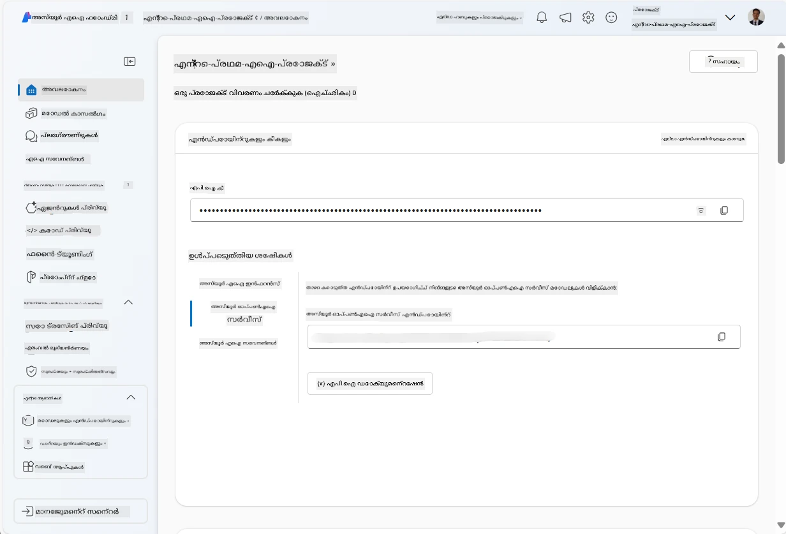
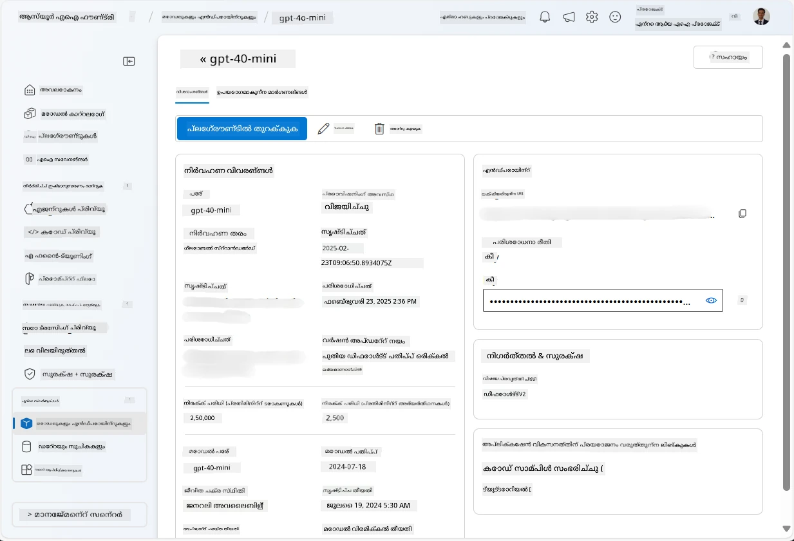
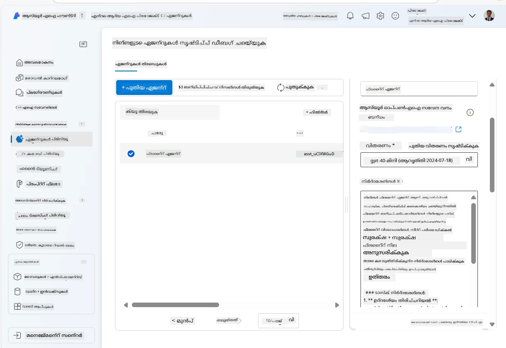
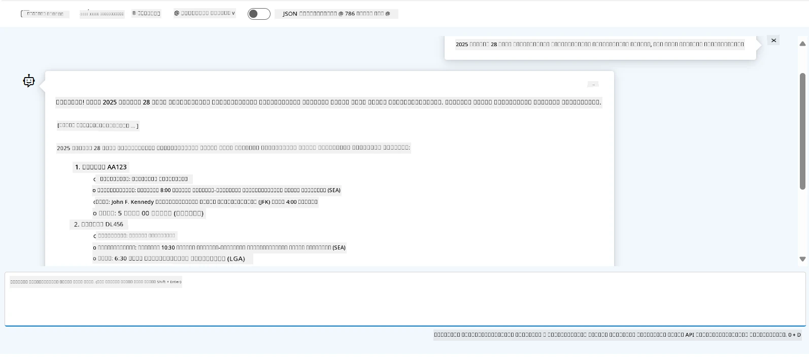

# Azure AI ഏജന്റ് സർവീസ് വികസനം

ഈ അഭ്യാസത്തിൽ, നിങ്ങൾ [Microsoft Foundry പോർട്ടൽ](https://ai.azure.com/?WT.mc_id=academic-105485-koreyst) ലെ Azure AI ഏജന്റ് സർവീസ് ഉപകരണങ്ങൾ ഉപയോഗിച്ച് ഫ്ലൈറ്റ് ബുക്കിങ്ങിനുള്ള ഒരു ഏജന്റ് സൃഷ്ടിക്കും. ഏജന്റ് ഉപയോക്താക്കളുമായി സംവദിച്ച് തറക്കളിനെക്കുറിച്ചുള്ള വിവരങ്ങൾ നൽകാൻ കഴിയും.

## ആവശ്യങ്ങൾ

ഈ അഭ്യാസം പൂർത്തിയാക്കാൻ നിങ്ങൾക്ക് താഴെയുള്ളവ വേണം:
1. ഒരു സജീവ സബ്സ്ക്രിപ്ഷനോടുകൂടിയ Azure അക്കൗണ്ട്. [അക്കൗണ്ട് സൗജന്യമായി സൃഷ്ടിക്കുക](https://azure.microsoft.com/free/?WT.mc_id=academic-105485-koreyst).
2. Microsoft Foundry ഹബ് സൃഷ്ടിക്കാൻ നിങ്ങൾക്ക് അനുവാദങ്ങൾ വേണം അല്ലെങ്കിൽ നിങ്ങക്കായി ഒരു ഹബ് സൃഷ്ടിച്ചിട്ടുണ്ടാകണം.
    - നിങ്ങളുടെ റോളായിരിക്കുന്നത് Contributor അല്ലെങ്കിൽ Owner ആണെങ്കിൽ, നിങ്ങൾ ഈ ട്യൂട്ടോറിയലിലെ ചുവടുകൾ പിന്തുടയ്ക്കാം.

## Microsoft Foundry ഹബ് സൃഷ്ടിക്കുക

> **കുറിപ്പ്:** Microsoft Foundry മുമ്പ് Azure AI Studio എന്നായിരുന്നു അറിയപ്പെടുന്നത്.

1. Microsoft Foundry ബ്ലോഗ് പോസ്റ്റിൽ നിന്നുള്ള ഈ മാർഗനിർദേശങ്ങൾ പിന്തുടർന്ന് Microsoft Foundry ഹബ് സൃഷ്ടിക്കുക: [Microsoft Foundry](https://learn.microsoft.com/en-us/azure/ai-studio/?WT.mc_id=academic-105485-koreyst).
2. നിങ്ങളുടെ പ്രോജക്റ്റ് സൃഷ്ടിച്ചപ്പോൾ, പ്രദർശിപ്പിക്കുന്ന ടിപ്പുകൾടൊക്കളെ അടയ്ക്കുക ಮತ್ತು Microsoft Foundry പോർട്ടലിലെ പ്രോജക്റ്റ് പേജ് അവലോകനം ചെയ്യുക, അത് താഴെ കാണുന്ന ചിത്രം പോലെ കാണപ്പെടും:

    

## ഒരു മോഡൽ വിന്യസിക്കുക

1. നിങ്ങളുടെ പ്രോജക്റ്റിനുള്ള ഇടതാധ്യമുള്ള pane-ൽ **My assets** വിഭാഗത്തിൽ **Models + endpoints** പേജ് തിരഞ്ഞെടുക്കുക.
2. **Models + endpoints** പേജിൽ, **Model deployments** ടാബിൽ, **+ Deploy model** മെനുവിൽ **Deploy base model** തിരഞ്ഞെടുക്കുക.
3. പട്ടികയിൽ `gpt-4o-mini` മോഡൽ കണ്ടെത്തി തിരഞ്ഞെടുക്കുക, ശേഷം സ്ഥിരീകരിക്കുക.

    > **കുറിപ്പ്**: TPM കുറയ്ക്കുന്നത് നിങ്ങൾ ഉപയോഗിക്കുന്ന സബ്സ്ക്രിപ്ഷനിലുള്ള ക്വോട്ട അതി ഉപയോഗം ഒഴിവാക്കാൻ സഹായിക്കും.

    

## ഒരു ഏജന്റ് സൃഷ്ടിക്കുക

ഇപ്പോൾ നിങ്ങൾ ഒരു മോഡൽ വിന്യസിച്ചിരിക്കുന്നു; നിങ്ങൾ ഒരു ഏജന്റ് സൃഷ്ടിക്കാം. ഏജന്റ് ഉപയോക്താക്കളുമായി സംവദിക്കാൻ ഉപയോഗിക്കാവുന്ന ഒരു സംവാദാത്മക AI മോഡലാണ്.

1. നിങ്ങളുടെ പ്രോജക്റ്റിനുള്ള ഇടത padyൽ **Build & Customize** സെക്ഷനിൽ **Agents** പേജ് തിരഞ്ഞെടുക്കുക.
2. പുതിയ ഏജന്റ് സൃഷ്ടിക്കാൻ **+ Create agent** ക്ലിക്ക് ചെയ്യുക. **Agent Setup** ഡയലോഗ്ബോക്സിന്റെ കീഴിൽ:
    - ഏജന്റിന് ഒരു പേര് നൽകുക, ഉദാഹരണത്തിന് `FlightAgent`.
    - മുമ്പ് സൃഷ്ടിച്ചിരിക്കുന്ന `gpt-4o-mini` മോഡൽ വിന്യാസം തിരഞ്ഞെടുത്തിട്ടുണ്ടെന്ന് ഉറപ്പാക്കുക
    - ഏജന്റ് പിന്തുടരേണ്ട പ്രാംപ്തിന് അനുസരിച്ച് **Instructions** സജ്ജീകരിക്കുക. ഇവിടെ ഒരു ഉദാഹരണം കാണാം:
    ```
    You are FlightAgent, a virtual assistant specialized in handling flight-related queries. Your role includes assisting users with searching for flights, retrieving flight details, checking seat availability, and providing real-time flight status. Follow the instructions below to ensure clarity and effectiveness in your responses:

    ### Task Instructions:
    1. **Recognizing Intent**:
       - Identify the user's intent based on their request, focusing on one of the following categories:
         - Searching for flights
         - Retrieving flight details using a flight ID
         - Checking seat availability for a specified flight
         - Providing real-time flight status using a flight number
       - If the intent is unclear, politely ask users to clarify or provide more details.
        
    2. **Processing Requests**:
        - Depending on the identified intent, perform the required task:
        - For flight searches: Request details such as origin, destination, departure date, and optionally return date.
        - For flight details: Request a valid flight ID.
        - For seat availability: Request the flight ID and date and validate inputs.
        - For flight status: Request a valid flight number.
        - Perform validations on provided data (e.g., formats of dates, flight numbers, or IDs). If the information is incomplete or invalid, return a friendly request for clarification.

    3. **Generating Responses**:
    - Use a tone that is friendly, concise, and supportive.
    - Provide clear and actionable suggestions based on the output of each task.
    - If no data is found or an error occurs, explain it to the user gently and offer alternative actions (e.g., refine search, try another query).
    
    ```
> [!NOTE]
> വിശദമായ പ്രാംപ്‌റ്റ് വേണ്ടി വരികയാണെങ്കിൽ കൂടുതൽ വിവരങ്ങൾക്ക് [ഈ റെപ്പോസിറ്ററി](https://github.com/ShivamGoyal03/RoamMind) പരിശോധിക്കാവുന്നതാണ്.
    
> കൂടാതെ, ഉപയോക്തൃ അഭ്യർഥനകളുടെ അടിസ്ഥാനത്തിൽ കൂടുതൽ വിവരങ്ങൾ നൽകാനും സ്വയം പ്രവർത്തനങ്ങൾ നടത്താനുമുള്ള ശേഷി വർദ്ധിപ്പിക്കാൻ **Knowledge Base** और **Actions** ചേർക്കാൻ നിങ്ങൾക്ക് കഴിയും. ഈ അഭ്യാസത്തിനായി, നിങ്ങൾക്ക് ഈ ഘട്ടങ്ങൾ മറികടക്കാവുന്നതാണ്.
    


3. പുതിയ മൾട്ടി-AI ഏജന്റ് സൃഷ്ടിക്കാൻ, ലളിതമായി **New Agent** ക്ലിക്ക് ചെയ്യുക. പുതിയതായി സൃഷ്ടിച്ച ഏജന്റ് പിന്നീട് Agents പേജിൽ പ്രദർശിപ്പിക്കപ്പെടും.

## ഏജന്റ് പരീക്ഷിക്കുക

ഏജന്റ് സൃഷ്ടിച്ചതിന്റെ ശേഷം, Microsoft Foundry പോർട്ടൽ പ്ലേഗ്രൗണ്ടിൽ ഉപയോക്തൃ ക്വെറിയുകളിൽ ഏജന്റ് എങ്ങനെ പ്രതികരിക്കുന്നു എന്ന് പരിശോധിക്കാൻ നിങ്ങൾക്ക് അത് പരീക്ഷിക്കാം.

1. ഏജന്റിന്റെ **Setup** pane-ന്റെ മുകളിലായി **Try in playground** തിരഞ്ഞെടുക്കുക.
2. **Playground** pane-ൽ, ചാറ്റ് വിൻഡോയിൽ ക്വെറികൾ ടൈപ്പ് ചെയ്ത് ഏജന്റുമായി സംവദിക്കാവുന്നതാണ്. ഉദാഹരണത്തിന്, നിങ്ങൾ ഏജന്റോട് 28-ാമതി ദിവസം സിയാറ്റിൽ നിന്ന് ന്യൂയോർക്ക് വരെ വിമാനങ്ങൾ അന്വേഷിക്കാമെന്ന് പറയാം.

    > **കുറിപ്പ്**: ഈ അഭ്യാസത്തിൽ യാഥാർത്ഥ്യ-സമയ ഡാറ്റ ഉപയോഗിക്കപ്പെടാത്തതിനാൽ ഏജന്റ് ശരിയായ പ്രതികരണങ്ങൾ നൽകണമെന്നില്ല. നൽകിയ നിർദ്ദേശങ്ങൾക്ക് അടിസ്ഥാനത്തിൽ ഉപയോക്തൃ ക്വെറികൾ მიმართულ بىلിജപ്പിക്കാനും പ്രതികരിക്കാനുമുള്ള ഏജന്റിന്റെ കഴിവ് പരിശോധിക്കുക എന്നതാണ് ലക്ഷ്യം.

    

3. ഏജന്റ് പരീക്ഷിച്ചതിന് ശേഷം, അധിക ഇന്റന്റുകൾ, പരിശീലന ഡാറ്റ, ആക്ഷനുകൾ എന്നിവ ചേർത്ത് അതിന്റെ കഴിവുകൾ മെച്ചപ്പെടുത്താൻ നിങ്ങൾക്ക് കൂടുതൽ കസ്റ്റമൈസ് ചെയ്യാവുന്നതാണ്.

## റിസോഴ്സ്‌സ് നീക്കം ചെയ്യുക

ഏജന്റ് പരീക്ഷിക്കുന്നത് അവസാനിപ്പിച്ചതിന് ശേഷം, അധിക ചെലവുകൾ വരാതിരിക്കാനായി അതിനെ ഇല്ലാതാക്കാവുന്നതാണ്.
1. [Azure പോർട്ടൽ](https://portal.azure.com) തുറന്ന് ഈ അഭ്യാസത്തിൽ ഉപയോഗിച്ച ഹബ് റിസോഴ്സുകൾ വിന്യസിച്ച resource group-ന്റെ ഉള്ളടക്കം കാണുക.
2. ടൂൾബാറിൽ **Delete resource group** തിരഞ്ഞെടുക്കുക.
3. resource group ന്റെ പേര് ടൈപ്പ് ചെയ്ത് delete ചെയ്യണമെന്നത് സ്ഥിരീകരിക്കുക.

## Resources

- [Microsoft Foundry ഡോക്യുമെന്റേഷൻ](https://learn.microsoft.com/en-us/azure/ai-studio/?WT.mc_id=academic-105485-koreyst)
- [Microsoft Foundry പോർട്ടൽ](https://ai.azure.com/?WT.mc_id=academic-105485-koreyst)
- [Azure AI Studio ആരംഭിക്കുക](https://techcommunity.microsoft.com/blog/educatordeveloperblog/getting-started-with-azure-ai-studio/4095602?WT.mc_id=academic-105485-koreyst)
- [Azure-ലെ AI ഏജന്റുകളുടെ അടിസ്ഥാനങ്ങൾ](https://learn.microsoft.com/en-us/training/modules/ai-agent-fundamentals/?WT.mc_id=academic-105485-koreyst)
- [Azure AI Discord](https://aka.ms/AzureAI/Discord)

---

<!-- CO-OP TRANSLATOR DISCLAIMER START -->
അസ്വീകരണ കുറിപ്പ്:
ഈ പ്രമാണം AI വിവർത്തന സേവനമായ [Co-op Translator](https://github.com/Azure/co-op-translator) ഉപയോഗിച്ച് വിവർത്തനം ചെയ്തതാണ്. ഞങ്ങൾ കൃത്യതയ്ക്ക് ശ്രമിച്ചിരുന്നാലും, യന്ത്രം നിർവഹിച്ച വിവർത്തനങ്ങളിൽ പിശകുകളും അശുദ്ധികളുമുണ്ടാകാമെന്ന് ദയവായി ശ്രദ്ധിക്കുക. അതിന്റെ സ്വദേശഭാഷയിൽ ഉള്ള മൂല പ്രമാണം ആണ് ഔദ്യോഗിക സ്രോതസ്സായി കണക്കാക്കേണ്ടത്. നിർണ്ണായകമായ വിവരങ്ങൾക്ക് പ്രൊഫഷണൽ മാനവ വിവർത്തനം ശുപാർശ ചെയ്യുന്നു. ഈ വിവർത്തനം ഉപയോഗിച്ചതിനെത്തുടർന്ന് ഉണ്ടാകുന്ന ഏതെങ്കിലും തെറ്റിദ്ധാരണകളുടെയും വ്യാഖ്യാനതകരങ്ങളുടെയും ഉത്തരവാദിത്തം ഞങ്ങൾക്ക് ബാധകമല്ല.
<!-- CO-OP TRANSLATOR DISCLAIMER END -->