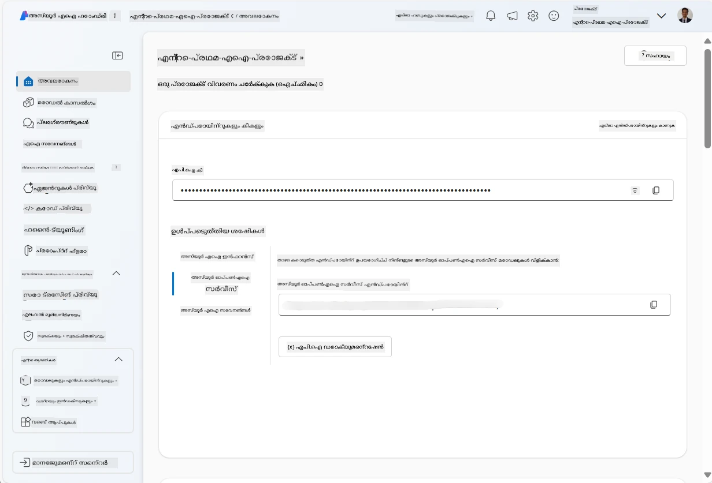
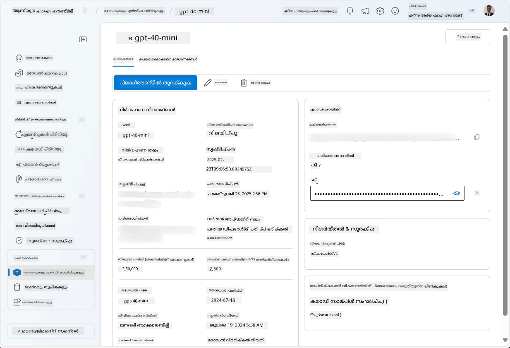
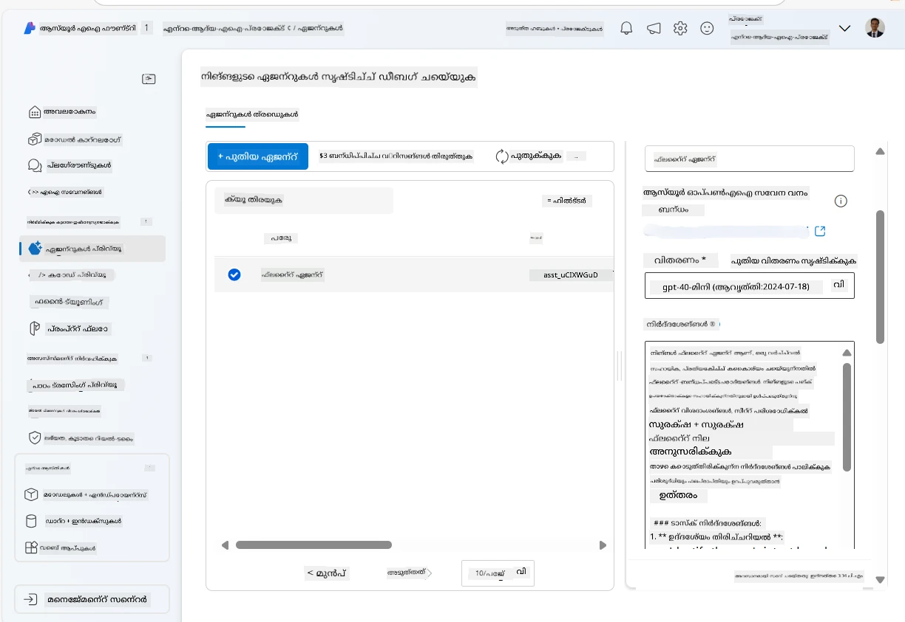
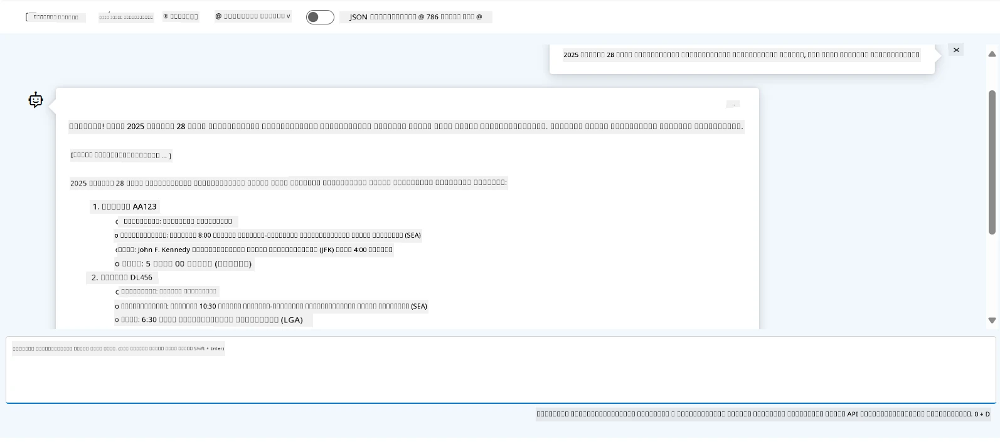

# Microsoft Foundry ഏജന്റ് സർവീസ് വികസനം

ഈ പരിശീലനത്തിൽ, നിങ്ങൾ [Microsoft Foundry പോർട്ടൽ](https://ai.azure.com/?WT.mc_id=academic-105485-koreyst) ൽ Microsoft Foundry ഏജന്റ് സർവീസ് ഉപകരണങ്ങൾ ഉപയോഗിച്ച് ഫ്‌ലൈറ്റ് ബുക്കിംഗിന് ഏജന്റ് സൃഷ്ടിക്കും. ഈ ഏജენტი ഉപയോക്താക്കളുമായി സംവദിച്ച് ഫ്‌ലൈറ്റുകളെക്കുറിച്ച് വിവരങ്ങൾ നൽകാൻ കഴിയും.

## മുൻപരിചയങ്ങൾ

ഈ പരിശീലനം പൂർത്തിയാക്കാൻ, നിങ്ങൾക്ക് താഴെ പറയുന്നവ വേണം:
1. സജീവ സബ്സ്ക്രിപ്ഷൻ ഉള്ള ഒരു Azure അക്കൗണ്ട്. [അക്കൗണ്ട് സൗജന്യമായി സൃഷ്ടിക്കുക](https://azure.microsoft.com/free/?WT.mc_id=academic-105485-koreyst).
2. Microsoft Foundry ഹബ് സൃഷ്ടിക്കാനുള്ള അനുവാദങ്ങൾ അല്ലെങ്കിൽ നിങ്ങക്കായി സൃഷ്ടിച്ചുകിട്ടിയവ.
    - നിങ്ങളുടെ റോളുകൾ Contributor അല്ലെങ്കിൽ Owner ആണെങ്കിൽ, ഈ ട്യൂട്ടോരിയലിൽ ഉണ്ടാകുന്ന ഘട്ടങ്ങൾ നിങ്ങൾക്ക് പിന്തുടരാം.

## Microsoft Foundry ഹബ് സൃഷ്ടിക്കുക

> **കുറിപ്പ്:** Microsoft Foundry മുൻപ് Azure AI സ്റ്റുഡിയോ എന്നായിരുന്നു അറിയപ്പെടുന്നത്.

1. Microsoft Foundry ഹബ് സൃഷ്ടിക്കാനുള്ള നിർദ്ദേശങ്ങൾക്കായി [Microsoft Foundry](https://learn.microsoft.com/en-us/azure/ai-studio/?WT.mc_id=academic-105485-koreyst) ബ്ലോഗ് പോസ്റ്റ് പിന്തുടരുക.
2. നിങ്ങളുടെ പ്രോജക്ട് സൃഷ്ടിച്ചപ്പോൾ, പ്രദർശിപ്പിച്ചിരിക്കുന്ന ടിപ്‌സ് അടയ്ക്കുകയും Microsoft Foundry പോർട്ടലിലെ പ്രോജക്റ്റ് പേജ് പരിശോധിക്കുകയും ചെയ്യുക, ഇത് താഴെ കാണുന്ന ചിത്രം പോലെ ആയിരിക്കണം:

    

## മോഡൽ ഡിപ്ലോയ് ചെയ്യുക

1. നിങ്ങളുടെ പ്രോജക്ടിന്റെ ഇടത് പാനലിൽ, **My assets** വിഭാഗത്തിൽ, **Models + endpoints** പേജ് തിരഞ്ഞെടുക്കുക.
2. **Models + endpoints** പേജിൽ, **Model deployments** ടാബിൽ, **+ Deploy model** മെനുവിൽ, **Deploy base model** തിരഞ്ഞെടുക്കുക.
3. പട്ടികയിൽ `gpt-4o-mini` മോഡൽ തിരയുക, ശേഷം അത് തിരഞ്ഞെടുക്കുകയും സ്ഥിരീകരിക്കുകയും ചെയ്യുക.

    > **കുറിപ്പ്**: TPM കുറയ്ക്കുന്നത് നിങ്ങൾ ഉപയോഗിക്കുന്ന സബ്സ്ക്രിപ്ഷനിലെ ലഭ്യമായ ക്വോട്ടയുടെ അധിക ഉപയോഗം ഒഴിവാക്കാൻ സഹായിക്കുന്നു.

    

## ഏജന്റ് സൃഷ്ടിക്കുക

ഇപ്പോൾ നിങ്ങൾ മോഡൽ ഡിപ്ലോയ് ചെയ്ത 있으므로, ഏജന്റ് സൃഷ്ടിക്കാൻ കഴിയും. ഏജന്റ് എന്നത് ഉപയോക്താക്കളുമായി സംവദിക്കാൻ ഉപയോഗിക്കുന്ന ഒരു സംവാദാത്മക AI മോഡലാണ്.

1. നിങ്ങളുടെ പ്രോജക്ടിന്റെ ഇടത് പാനലിൽ, **Build & Customize** വിഭാഗത്തിൽ, **Agents** പേജ് തിരഞ്ഞെടുക്കുക.
2. **+ Create agent** ക്ലിക്കുചെയ്ത് പുതിയ ഏജന്റ് സൃഷ്ടിക്കുക. **Agent Setup** ഡയലോഗ് ബോക്സിൽ:
    - ഏജന്റിനായി `FlightAgent` പോലൊരു പേര് നൽകുക.
    - മുമ്പ് സൃഷ്ടിച്ച `gpt-4o-mini` മോഡൽ ഡിപ്ലോയ്‌മെന്റ് തിരഞ്ഞെടുക്കിയിട്ടുണ്ടെന്ന് ഉറപ്പാക്കുക.
    - ഏജന്റ് അനുസരിപ്പിക്കേണ്ട പ്രമ്പ്റ്റ് അനുസരിച്ച് **Instructions** സജ്ജമാക്കുക. ഉദാഹരണമായി താഴെ കാണുക:
    ```
    You are FlightAgent, a virtual assistant specialized in handling flight-related queries. Your role includes assisting users with searching for flights, retrieving flight details, checking seat availability, and providing real-time flight status. Follow the instructions below to ensure clarity and effectiveness in your responses:

    ### Task Instructions:
    1. **Recognizing Intent**:
       - Identify the user's intent based on their request, focusing on one of the following categories:
         - Searching for flights
         - Retrieving flight details using a flight ID
         - Checking seat availability for a specified flight
         - Providing real-time flight status using a flight number
       - If the intent is unclear, politely ask users to clarify or provide more details.
        
    2. **Processing Requests**:
        - Depending on the identified intent, perform the required task:
        - For flight searches: Request details such as origin, destination, departure date, and optionally return date.
        - For flight details: Request a valid flight ID.
        - For seat availability: Request the flight ID and date and validate inputs.
        - For flight status: Request a valid flight number.
        - Perform validations on provided data (e.g., formats of dates, flight numbers, or IDs). If the information is incomplete or invalid, return a friendly request for clarification.

    3. **Generating Responses**:
    - Use a tone that is friendly, concise, and supportive.
    - Provide clear and actionable suggestions based on the output of each task.
    - If no data is found or an error occurs, explain it to the user gently and offer alternative actions (e.g., refine search, try another query).
    
    ```
> [!NOTE]
> വിശദമായ പ്രമ്പ്റ്റിനായി, [ഈ റിപ്പോസിറ്ററി](https://github.com/ShivamGoyal03/RoamMind) പരിശോധിക്കാവുന്നതാണ്.
    
> കൂടാതെ, ഏജന്റിന്റെ ശേഷികളെ മെച്ചപ്പെടുത്താൻ **Knowledge Base**യും **Actions**ഉം ചേർക്കാവുന്നതാണ്, ഇത് ഉപയോക്തൃ അഭ്യർത്ഥനകളെ അടിസ്ഥാനമാക്കി കൂടുതൽ വിവരങ്ങൾ നൽകാനും ഓട്ടോമേറ്റഡ് ടാസ്കുകൾ അടക്കാനും സഹായിക്കുന്നു. ഈ പരിശീലനത്തിനായി, ഈ ഘട്ടങ്ങൾ ഒഴിവാക്കാം.
    


3. പുതിയ മൾട്ടി-AI ഏജന്റ് സൃഷ്ടിക്കാൻ, **New Agent** ക്ലിക്ക് ചെയ്യുക. പുതിയ സൃഷ്ടിച്ച ഏജന്റ് Agents പേജിൽ പ്രദർശിപ്പിക്കപ്പെടും.


## ഏജന്റ് പരിശോധന

ഏജന്റ് സൃഷ്ടിച്ചതിനുശേഷം, Microsoft Foundry പോർട്ടൽ പ്ലേഗ്രൗണ്ടിൽ ഉപയോക്തൃ ചോദ്യങ്ങൾക്ക് ഏജന്റ് എങ്ങനെ പ്രതികരിക്കുന്നു എന്ന് പരിശോധിക്കാം.

1. ഏജന്റിന്റെ **Setup** പാനലിന്റെ മുകളിൽ, **Try in playground** തിരഞ്ഞെടുക്കുക.
2. **Playground** പാനലിൽ, ചാറ്റ് വിൻഡോയിൽ ചോദ്യങ്ങൾ ടൈപ്പുചെയ്യുമ്പോൾ ഏജന്റുമായി സംവദിക്കാം. ഉദാഹരണത്തിന്, സെയ്റ്റിലിൽ നിന്നു ന്യു യോർക്ക് 28-ാം തീയതി നടത്താനുളളഫ്ലൈറ്റുകൾ തേടാൻ ഏജന്റിൽ ചോദിക്കാം.

    > **കുറിപ്പ്**: ഈ പരിശീലനത്തിൽ യാഥാർത്ഥ്യ സമയത്തിലെ ഡാറ്റ ഉപയോഗിക്കാത്തതിനാൽ ഏജന്റ് കൃത്യമായ മറുപടികൾ നൽകിയേക്കാൻ സാധ്യത കുറഞ്ഞതാണ്. നൽകപ്പെട്ട നിർദ്ദേശങ്ങൾ അടിസ്ഥാനമാക്കി ഉപയോക്തൃ ചോദ്യങ്ങൾ എങ്ങനെ മനസ്സിലാക്കി ഉത്തരം നൽകുന്നു എന്നത് പരിശോധിക്കുന്നതാണ് ഉദ്ദേശം.

    

3. ഏജന്റ് പരിശോധനയ്ക്കുശേഷം, അതിന്റെ ശേഷികൾ മെച്ചപ്പെടുത്താൻ കൂടുതല്‍ ഇൻ്റന്റുകൾ, പരിശീലന ഡാറ്റ, ആക്ഷനുകൾ എന്നിവ ചേർക്കാം.

## വിഭവങ്ങൾ ഒഴിവാക്കുക

ഏജന്റ് പരിശോദനം പൂർത്തിയാക്കിയതിനു ശേഷം, അധിക ചെലവുകൾ ഉണ്ടാകാതിരിക്കാൻ അത് ഡിലീറ്റ് ചെയ്യാം.
1. [Azure പോർട്ടൽ](https://portal.azure.com) തുറന്ന്, ഈ പരിശീലനത്തിൽ ഉപയോഗിച്ച ഹബ് വിഭവങ്ങൾ ഡിപ്ലോയ് ചെയ്ത റിസോഴ്‌സ് ഗ്രൂപ്പ് ഉള്ളടക്കം കാണുക.
2. ടൂൾബാറിൽ നിന്നും **Delete resource group** തിരഞ്ഞെടുക്കുക.
3. റിസോഴ്‌സ് ഗ്രൂപ്പ് നാമം നൽകുകയും അത് ഡിലീറ്റ് ചെയ്യാൻ ആഗ്രഹിക്കുന്നുവെന്ന് സ്ഥിരീകരിക്കുകയും ചെയ്യുക.

## വിഭവങ്ങൾ

- [Microsoft Foundry ഡോക്യുമെന്റേഷൻ](https://learn.microsoft.com/en-us/azure/ai-studio/?WT.mc_id=academic-105485-koreyst)
- [Microsoft Foundry പോർട്ടൽ](https://ai.azure.com/?WT.mc_id=academic-105485-koreyst)
- [Microsoft Foundry ആരംഭിക്കുന്നത്](https://techcommunity.microsoft.com/blog/educatordeveloperblog/getting-started-with-azure-ai-studio/4095602?WT.mc_id=academic-105485-koreyst)
- [Azure ലിലെ AI ഏജന്റുകളുടെ അടിസ്ഥാന വിദ്യകൾ](https://learn.microsoft.com/en-us/training/modules/ai-agent-fundamentals/?WT.mc_id=academic-105485-koreyst)
- [Azure AI Discord](https://aka.ms/AzureAI/Discord)

---

<!-- CO-OP TRANSLATOR DISCLAIMER START -->
**അറിയിപ്പ്**:
ഈ രേഖ AI പരിഭാഷാ സേവനം [Co-op Translator](https://github.com/Azure/co-op-translator) ഉപയോഗിച്ച് പരിഭാഷപ്പെടുത്തിയതാണ്. ഞങ്ങൾ കൃത്യതയ്ക്കായി ശ്രമിക്കുന്നുവെങ്കിലും, ഓട്ടോമേറ്റഡ് പരിഭാഷകളിൽ പിഴവുകൾ അല്ലെങ്കിൽ തെറ്റായ വിവരങ്ങൾ ഉണ്ടാകാൻ സാധ്യതയുണ്ട്. അതിന്റെ സ്വാഭാവിക ഭാഷയിലുള്ള അസൽ രേഖയാണ് പ്രാമാണികമായ ഉറവിടമായി പരിഗണിക്കേണ്ടത്. നിർണായകമായ വിവരങ്ങൾക്ക്, പ്രൊഫഷണൽ മനുഷ്യ പരിഭാഷ ശുപാർശ ചെയ്യുന്നു. ഈ പരിഭാഷ ഉപയോഗിച്ച് ഉണ്ടാകുന്ന തെറ്റിദ്ധാരണകൾ അല്ലെങ്കിൽ തെറ്റായ വ്യാഖ്യാനങ്ങൾക്കായി ഞങ്ങൾ ഉത്തരവാദികളല്ല.
<!-- CO-OP TRANSLATOR DISCLAIMER END -->