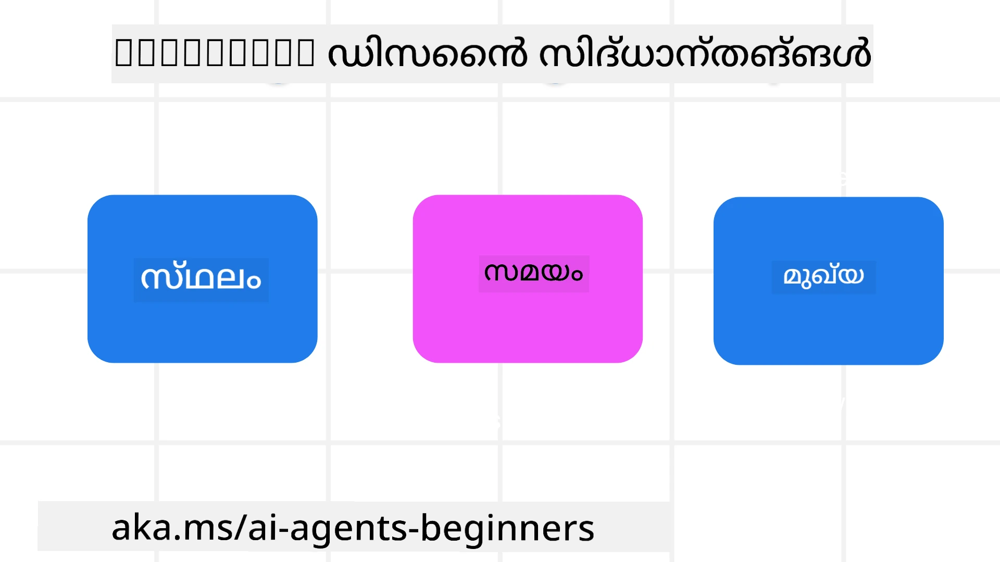

> _(ഈ പാഠത്തിന്റെ വീഡിയോ കാണാൻ മുകളിൽ ഉള്ള ചിത്രം ക്ലിക്കുചെയ്യുക)_
# AI ഏജന്റിക് ഡിസൈൻ സിദ്ധാന്തങ്ങൾ

## പരിചയം

AI ഏജന്റിക് സിസ്റ്റങ്ങൾ നിർമ്മിക്കാനുള്ള ചിന്തന രീതികളുണ്ട്. ജനറേറ്റീവ് AI ഡിസൈനിൽ അസ്പഷ്ടത ഒരു സവിശേഷതയാണ്, തകരാറല്ല, അതിനാൽ എഞ്ചിനീയർമാർക്ക് എവിടെ നിന്നും ആരംഭിക്കുമെന്നത് ചിലപ്പോൾ മനസിലാക്കാൻ ബുദ്ധിമുട്ടാണ്. ഉപയോക്തൃകക്ഷികമായ ഏജന്റിക് സിസ്റ്റങ്ങൾ നിർമ്മിക്കാൻ ഡെവലപ്പർമാർക്ക് സഹായം നല്കുന്ന മനുഷ്യകേന്ദ്രമായ UX ഡിസൈൻ സിദ്ധാന്തങ്ങൾ ഞങ്ങൾ സൃഷ്ടിച്ചു. ഈ ഡിസൈൻ സിദ്ധാന്തങ്ങൾ നിർദ്ദേശാത്മക മെಟ್ಟർകെട്ടായിരിക്കാൻ വേണ്ടതല്ല, പകരം, ഏജന്റ് അനുഭവങ്ങൾ നിർവചിച്ച് നിർമ്മിക്കുന്ന ടീമുകൾക്ക് ഒരു ആരംഭബിന്ദുവാണ്.

സാധാരണയായി, ഏജന്റുകൾ:

- മനുഷ്യ ശേഷികളെ വിപുലമാക്കുകയും സ്കെയിൽ ചെയ്യുകയും ചെയ്യണം (വിയേകലാപം, പ്രശ്നപരിഹാരം, ഓട്ടോമേഷൻ മുതലായവ)
- അറിവിലെ പൂജ്യങ്ങൾ പൂരിപ്പിക്കണം (അറിവ് മേഖലകളിൽ എക്‌സ്‌പർട്ട് ആക്കുക, ഭാഷാനുവാദം, മുതലായവ)
- വ്യക്തികൾ ഇഷ്ടപ്പെടുന്ന രീതിയിൽ സഹകരണം ആസൂത്രണം ചെയ്യുകയും പിന്തുണയ്ക്കുകയും ചെയ്യണം
- നമ്മെ മെച്ചപ്പെട്ട വ്യക്തികളാക്കണം (ഉദാ: ജീവിത കോച്ച്/ടാസ്ക് മാസ്റ്റർ, മാനസിക നിയന്ത്രണം, മാനസിക ശ്രദ്ധാ നിപുണതകൾ പഠിപ്പിക്കൽ, പ്രതിരോധശക്തി നിർമ്മാണം, മുതലായവ)

## ഈ പാഠത്തിൽ ഉൾപ്പെടുന്നത്

- ഏജന്റിക് ഡിസൈൻ സിദ്ധാന്തങ്ങൾ എന്തൊക്കെയാണ്
- ഈ ഡിസൈൻ സിദ്ധാന്തങ്ങൾ നടപ്പിലാക്കുമ്പോൾ പാലിക്കേണ്ട മറ്റുനിലവാരങ്ങളൊക്കെ
- ഇതുപയോഗിച്ച് ഉദാഹരണ പ്രയോഗങ്ങൾ

## പഠനലക്ഷ്യങ്ങൾ

ഈ പാഠം പൂർത്തിയാക്കിയ ശേഷം, നിങ്ങൾക്ക് കഴിയും:

1. ഏജന്റിക് ഡിസൈൻ സിദ്ധാന്തങ്ങൾ എന്താണെന്ന് വിശദീകരിക്കുക
2. സിദ്ധാന്തങ്ങൾ ഉപയോഗിക്കുന്നതിന് മാർഗ്ഗനിർദ്ദേശങ്ങൾ വിശദീകരിക്കുക
3. ഏജന്റിക് ഡിസൈൻ സിദ്ധാന്തങ്ങൾ ഉപയോഗിച്ച് ഏജന്റ് നിർമ്മിക്കാൻ മനസ്സിലാക്കുക

## ഏജന്റിക് ഡിസൈൻ സിദ്ധാന്തങ്ങൾ

### ഏജന്റ് (സ്ഥലം)

ഏജന്റ് പ്രവർത്തിക്കുന്ന പരിസ്ഥിതിയാണ് ഇത്. ശാരീരിക, ഡിജിറ്റൽ ലോകങ്ങളിൽ ഏജന്റുകൾ എങ്ങനെ രൂപകൽപന ചെയ്യണമെന്ന് ഈ സിദ്ധാന്തങ്ങൾ സഹായിക്കുന്നു.

- **കണക്ട് ചെയ്യുക, തകർത്ത് വിടുക അല്ല** – ആളുകളെ മറ്റുള്ളവരുമായി, സംഭവങ്ങളുമായി, പ്രയോഗയോഗ്യമായ അറിവുമായി ബന്ധിപ്പിക്കാൻ സഹായിക്കുക, സഹകരണംക്കും ബന്ധത്തിനും പ്രോത്സാഹനം നൽകുക.
- ഏജന്റുകൾ സംഭവങ്ങൾ, അറിവ്, ആളുകൾ തമ്മിൽ ബന്ധിപ്പിക്കുന്നു.
- ഏജന്റുകൾ ആളുകളെ അടുത്തേക്ക് കൊണ്ടുവരുന്നു. അവർ ആളുകളെ മാറ്റിസ്ഥാപിക്കാൻ അല്ല, താഴ്ത്താൻ അല്ല, രൂപകൽപന ചെയ്യപ്പെട്ടിട്ടില്ല.
- **സൗകര്യപ്രദവും ചിലപ്പോൾ കാണാതെയും** – ഏജന്റ് പ്രധാനമായും പിന്ഭാഗത്തിൽ പ്രവർത്തിക്കുന്നു, പ്രസക്തമായപ്പോൾ മാത്രമേ ഇടപെടുകയുള്ളൂ.
  - ഏജന്റ് അംഗത്വമുള്ള ഉപയോക്താക്കൾക്ക് എളുപ്പത്തിൽ ഏത് ഉപകരണത്തിലും/പ്ലാറ്റ്ഫോമിലുമെത്തുക സാദ്ധ്യമാണ്.
  - ഏജന്റ് ധ്വനി, വോയ്സ്, ടെക്‌സ്‌റ് എന്നിവയുമായി സഹകരിക്കുന്ന മൾട്ടിമോഡൽ ഇൻപുട്ടുകളും ഔട്ട്പുട്ടും പിന്തുണയ്ക്കുന്നു.
  - ഉപയോക്താവിന്റെ ആവശ്യങ്ങൾ അനുസരിച്ച്, മുൻനിരയും പിന്ഭാഗവും, പ്രൊആക്ടീവ് മോടുകളും ഡയറാക്ട് മോടുകളും തമ്മിൽ എളുപ്പം മാറുന്നു.
  - ഏജന്റ് കാഴ്ചക്കാരനെ കാണാതിരിക്കാം, എന്നാൽ പിന്ഭാഗ പ്രോസസ് പാതയും മറ്റൊരു ഏജന്റിനേയും സഹകരണവും വ്യക്തവും ഉപയോക്താവിന്റെ നിയന്ത്രണത്തിലുള്ളതും ആണ്.

### ഏജന്റ് (സമയം)

ഏജന്റ് എപ്പോഴും എങ്ങനെ പ്രവർത്തിക്കുന്നു എന്നതാണ് ഇത്. കഴിഞ്ഞകാലം, ഇപ്പോഴത്തെ സമയം, ഭാവി കാലം എന്നിവയ്ക്ക് ഇടയിൽ ഏജന്റുകളുടെ ആശയവിനിമയം എങ്ങിനെയാണ് എന്നതാണ് സിദ്ധാന്തങ്ങൾ.

- **കഴിഞ്ഞകാലം**: ചരിത്രം പ്രതിഫലിപ്പിക്കുന്നു, അവസ്ഥാനവും സാന്ദർഭ്യവും ഉൾപ്പെടെ.
  - സംഭവഘടകങ്ങൾ, ആളുകൾ, അവസ്ഥകൾ പുറത്ത് നിന്ന് കൂടുതൽ സമൃദ്ധമായ ചരിത്ര ഡാറ്റ വിശകലനത്തിൽ આધാരമാക്കി ഏജന്റ് ഉയർന്ന പ്രാസംഗിക ഫലങ്ങൾ നൽകുന്നു.
  - കഴിഞ്ഞ സംഭവങ്ങളിൽ നിന്നുള്ള ബന്ധങ്ങൾ സൃഷ്ടിക്കുകയും ഓർമ്മയിൽ ആലോചിച്ച് നിലവിലെ സാഹചര്യങ്ങളിൽ ഇടപെടുകയും ചെയ്യുന്നു.
- **ഇപ്പോൾ**: അറിയിച്ചു തന്നേക്കാൾ വളഞ്ഞ മടക്കി.
  - ഏജന്റ് ആളുകളുമായുള്ള സമഗ്രമായ ആശയവിനിമയ രീതി കാണിക്കുന്നു. ഒരു സംഭവം സംഭവിക്കുമ്പോൾ, സ്റ്റാറ്റിക് നോട്ടിഫിക്കേഷനും മറ്റു ശീലംനിർമ്മിതഫോമാറ്റുകളും തെറ്റി നീങ്ങുന്നു. ഉപയോക്താവിന്റെ ശ്രദ്ധയ്ക്ക് യോജിച്ച സമയത്ത് വീണ്ടെടുക്കലുകൾ, ഗൈഡുകൾ നിയമിക്കും.
  - പരിസര സാഹചര്യവും സാമൂഹ്യ സാംസ്കാരിക മാറ്റങ്ങളും ഉപയോക്തൃ ഉദ്ദേശ്യവും അടിസ്ഥാനമാക്കി വിവരങ്ങൾ നൽകുന്നു.
  - പ്രതിസന്ധികളെ കണക്കിലെടുത്ത്, ഇടക്കിടെ വളർന്നു നീളുന്ന ഉൾക്കാഴ്ച നൽകുന്നു.
- **ഭാവി**: ഒത്തുചേരുകയും വളരുകയും ചെയ്യുന്നു.
  - വിവിധ ഉപകരണങ്ങൾ, പ്ലാറ്റ്ഫോമുകൾ, മോഡാലിറ്റികൾ അനുസരിച്ച് ക്രമീകരിക്കുന്നു.
  - ഉപയോക്തൃ പെരുമാറ്റം, ആക്സസ് ആവശ്യങ്ങൾ അനുസരിച്ചും വ്യക്തിഗതമാക്കി തീർക്കാൻ കഴിയുന്നുണ്ട്.
  - തുടർച്ചയായ ഉപയോക്തൃ ഇടപെടലിലൂടെ രൂപപ്പെടുന്നു, വികസിക്കുന്നു.

### ഏജന്റ് (കോർ)

ഏജന്റിന്റെ ഡിസൈൻ കോർ ഭാഗത്തിലെ പ്രധാന ഘടകങ്ങൾ.

- **അസാധ്യത സ്വീകരിക്കുക, എന്നാൽ വിശ്വാസം സ്ഥാപിക്കുക**.
  - ഏജന്റ് അസാധ്യത ചിലത് പ്രതീക്ഷിക്കപ്പെടുന്നതാണ്. അസാധ്യത ഏജന്റ് ഡിസൈനിന്റെ മുഖ്യ ഘടകമാണ്.
  - വിശ്വാസവും അനിമിഷ്യവുമാണ് ഏജന്റ് ഡിസൈൻ അടിസ്ഥാന ഘടകങ്ങൾ.
  - അല്ലെങ്കിൽ ഏജന്റ് ഓൺ/ഓഫ് ആക്കുന്നത് മനുഷ്യർ നിയന്ത്രിച്ച് ഏജന്റ് നില എപ്പോഴും വ്യക്തമായി കാണുന്നു.

## ഈ സിദ്ധാന്തങ്ങൾ നടപ്പിലാക്കാനുള്ള മാർഗ്ഗനിർദ്ദേശങ്ങൾ

മുൻപ് പറഞ്ഞ സിദ്ധാന്തങ്ങൾ ഉപയോഗിക്കുമ്പോൾ താഴെ പറയുന്ന മാർഗ്ഗനിർദ്ദേശങ്ങൾ പാലിക്കുക:

1. **ത.Transparent**: AI ഉൾപ്പെട്ടിരിക്കുന്നുവെന്ന്, എങ്ങനെ പ്രവർത്തിക്കുന്നുവെന്ന് (മുൻ നടപടികൾ ഉൾപ്പെടെ) ഉപയോക്താവിന് അറിയിക്കുക, പ്രതികരണം നൽകാനും സിസ്റ്റം മാറ്റാനും എളുപ്പമാക്കുക.
2. **നിയന്ത്രണം**: ഉപയോക്താവ് ഇഷ്ടാനുസരിച്ച് ക്രമീകരിക്കാനും മുൻഗണനകൾ വ്യക്തമാക്കാനും വ്യക്തിപരമാക്കാനും, സിസ്റ്റവും അതിന്റെ ഘടകങ്ങളും (മറക്കൽ കഴിവ് ഉൾപ്പെടെ) നിയന്ത്രിക്കാനും അനുവദിക്കുക.
3. **ശ്രമം**: ഉപകരണങ്ങളിലും ഏത് എൻഡ് പോയിന്റുകളിലും സ്ഥിരതയുള്ള, മൾട്ടിമോഡൽ അനുഭവങ്ങൾ ലക്ഷ്യമിടുക. സാധ്യമായിടത്ത് പരിചിത UI/UX ഘടകങ്ങൾ ഉപയോഗിക്കുക (ഉദാ: വോയ്സ് ഇൻററാക്ഷനായി മൈക്രോഫോൺ ഐക്കൺ) ഉപഭോക്താവിന്റെ ബുദ്ധിമുട്ട് കുറയ്ക്കാൻ ശ്രമിക്കുക (എളുപ്പത്തിൽ മറുപടികൾ, കാഴ്ചാമാധ്യമങ്ങൾ, ‘കൂടുതൽ പഠിക്കുക’ ഉള്ളടക്കം).

## ഈ സിദ്ധാന്തങ്ങളും മാർഗ്ഗനിർദ്ദേശങ്ങളും ഉപയോഗിച്ച് ഒരു ട്രാവൽ ഏജന്റ് എങ്ങനെ രൂപകൽപന ചെയ്യാം

നിങ്ങൾ ഒരു ട്രാവൽ ഏജന്റ് രൂപകൽപന ചെയ്യുകയാണെന്നു ധരിപ്പിക്കൂ, ഇത് സിദ്ധാന്തങ്ങളും മാർഗ്ഗനിർദ്ദേശങ്ങളും എങ്ങനെ ഉപയോഗിക്കാമെന്നതാണ്:

1. **Transparency** – ഉപയോക്താവിന് ട്രാവൽ ഏജന്റ് AI മാനദണ്ഡത്തിലാണെന്ന് അറിയിക്കുക. എങ്ങനെ തുടക്കം കുറിക്കാമെന്ന് ചില അടിസ്ഥാന നിർദ്ദേശങ്ങൾ നൽകുക (ഉദാ: “ഹെലോ” സന്ദേശം, സാമ്പിൾ പ്രോംപ്റ്റുകൾ). ഇത് പ്രോഡക്ട് പേജിൽ വ്യക്തമായി രേഖപ്പെടുത്തുക. ഉപയോക്താവ് മുമ്പ് ചോദിച്ച പ്രോംപ്റ്റുകളുടെ ലിസ്റ്റ് കാണിക്കുക. പ്രതികരണം നൽകാനുള്ള മാർഗ്ഗങ്ങൾ വ്യക്തമാക്കുക (തംസ് അപ്പ്/ഡൗൺ, Send Feedback ബട്ടൺ മുതലായവ). ഏജന്റിന് ഉപയോഗനിർബന്ധങ്ങൾ/വിഷയപരിമിതികൾ ഉണ്ടെങ്കിൽ വ്യക്തമാക്കുക.
2. **നിയന്ത്രണം** – ഏജന്റ് സൃഷ്ടിച്ചതിന് ശേഷം ഉപയോക്താവ് എങ്ങനെ ക്രമീകരിക്കാമെന്ന് വ്യക്തമാക്കുക, ഉദാഹരണത്തിന് സിസ്റ്റം പ്രോംപ്റ്റ് ഒക്കെ. ഏജന്റിനെ വരുമാനപരമായി എത്രത്തോളം വിശദീകരിക്കാമെന്നത്, എഴുതുന്ന ശൈലി, ഏജന്റ് പറയാൻ പാടില്ലാത്ത കാര്യങ്ങൾ എന്നിവ തിരഞ്ഞെടുക്കാൻ അനുവദിക്കുക. ബന്ധപ്പെട്ട ഫയലുകൾ, ഡാറ്റ, പ്രോംപ്റ്റുകൾ, പഴയ സംഭാഷണങ്ങൾ കാണാനും മായ്ച്ചേ автом предут.
3. **ശ്രമം** – ഷെയർ പ്രോംപ്റ്റ്, ഫയലോ ഫോട്ടോയോ ചേർക്കൽ, ഏതെങ്കിലും ആളെ ടാഗ് ചെയ്യൽ തുടങ്ങിയ ഐക്കണുകൾ കൃത്യവും തിരിച്ചറിയാവുന്നതുമായ പ്രത്യേകതയുള്ളതാക്കുക. ഫയൽ അപ്‌ലോഡ്/പങ്കിടലിനായി പേਪਰ്ക്ലിപ്പ് ഐക്കൺ, ഗ്രാഫിക്സ് അപ്‌ലോഡിനായി ഇമേജ് ഐക്കൺ ഉപയോഗിക്കുക.

## സാമ്പിൾ കോഡുകൾ

- Python: [Agent Framework](./code_samples/03-python-agent-framework.ipynb)
- .NET: [Agent Framework](./code_samples/03-dotnet-agent-framework.md)

## AI ഏജന്റിക് ഡിസൈൻ പാറ്റേൺസ് സംബന്ധിച്ച് കൂടുതൽ ചോദിക്കേണ്ടതുണ്ടോ?

[Microsoft Foundry Discord](https://aka.ms/ai-agents/discord) ൽ ചേരൂ, മറ്റ് പഠനാർഥികളുമായി ചേരൂ, ഓഫീസ്സ് മണിക്കൂറുകളിൽ പങ്കെടുക്കൂ, AI ഏജന്റുകളുടെ ചോദ്യങ്ങൾക്ക് ഉത്തരങ്ങൾ ലഭിക്കൂ.

## അധിക റിസോഴ്‌സുകൾ

- <a href="https://openai.com" target="_blank">പ്രവർത്തന മാർഗ്ഗങ്ങൾ: ഏജന്റിക് AI സിസ്റ്റങ്ങൾ നിയന്ത്രിക്കാൻ | OpenAI</a>
- <a href="https://microsoft.com" target="_blank">HAX ടൂൾകിറ്റ് പ്രോജക്ട് - Microsoft Research</a>
- <a href="https://responsibleaitoolbox.ai" target="_blank">റിസ്പോൺസിബിൾ AI ടൂൾബോക്സ്</a>

## മുൻ പാഠം

[Exploring Agentic Frameworks](../02-explore-agentic-frameworks/README.md)

## അടുത്ത പാഠം

[Tool Use Design Pattern](../04-tool-use/README.md)

---

<!-- CO-OP TRANSLATOR DISCLAIMER START -->
**ഡിസ്ഇസ്‌ലെമർ**:  
ഈ ഡോക്യുമെന്റ് AI ഭാഷാന്തര സേവനമായ [Co-op Translator](https://github.com/Azure/co-op-translator) ഉപയോഗിച്ച് ഭാഷാന്തരപ്പെടുത്തി. ഞങ്ങൾ കൃത്യതയ്ക്കായി പരിശ്രമിച്ചിട്ടും, സ്വയംചാലിതമായ വിവർത്തനങ്ങളിൽ പിശകുകൾ അല്ലെങ്കിൽ അകൃത്യങ്ങൾ ഉണ്ടായിരിക്കാൻ സാധ്യതയ 있다는 점 ശ്രദ്ധിക്കുക. യഥാർത്ഥ ഭാഷയിൽ ഉള്ള ഡോക്യുമെന്റ് ഹേതുവായ ഉറവിടമായി കണക്കാക്കേണ്ടതാണ്. നിർണായക വിവരങ്ങൾക്ക് പ്രോഫഷണൽ മനുഷ്യവിവർത്തനം നിർദ്ദേശിക്കുന്നു. ഈ വിവർത്തനത്തിന്റെ ഉപയോഗത്തിൽ നിന്നുണ്ടാകുന്ന ഏതെങ്കിലും തെറ്റിദ്ധാരണകൾക്കോ തെറ്റായ അർത്ഥമായിരിക്കും വരുത്തിയിട്ടുണ്ടെങ്കിൽ അതിന് ഞങ്ങൾ ബാധ്യതയുണ്ടാകാറില്ല.
<!-- CO-OP TRANSLATOR DISCLAIMER END -->