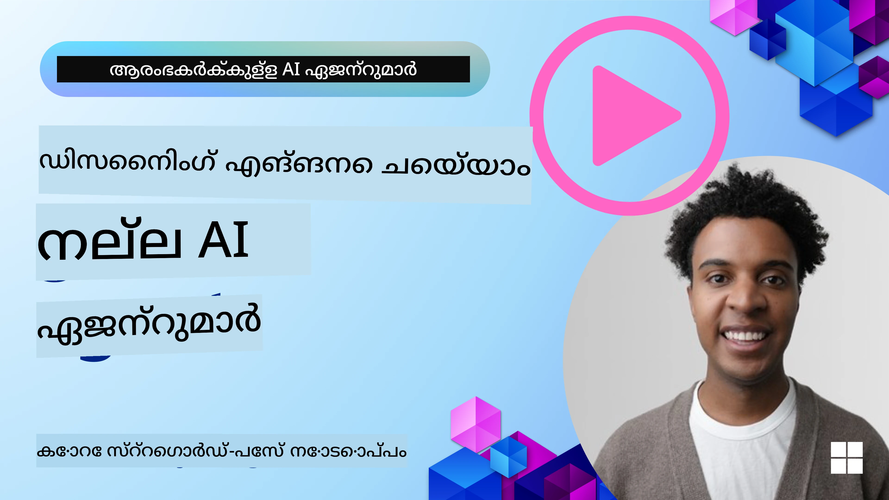
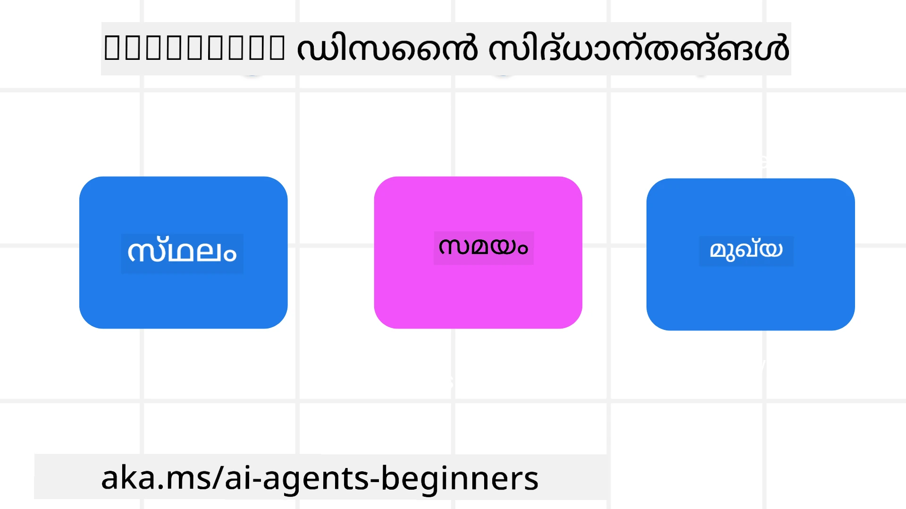

> _(ഈ പാഠത്തിന്റെ വീഡിയോ കാണാൻ മുകളിൽ ചിത്രത്തിൽ ക്ലിക് ചെയ്യുക)_
# AI ഏജന്റിക് ഡിസൈൻ സിദ്ധാന്തങ്ങൾ

## പരിചയം

AI ഏജന്റിക് സിസ്റ്റങ്ങൾ നിർമ്മിക്കുന്നതിനെക്കുറിച്ചു ചിന്തിക്കുന്നതിന്റെ നിരവധി രീതികൾ ഉണ്ട്. ജനിതക AI ഡിസൈനിൽ അനിശ്ചിതത്വം ഒരു സവിശേഷതയായിരിക്കെയാണ്, ഒരു പിഴവല്ല, അതിനാൽ എഞ്ചിനിയർമാർക്ക് എവിടെയാണ് തുടങ്ങേണ്ടതെന്ന് കണ്ടെത്താൻ ചിലപ്പോഴ бывает ബുദ്ധിമുട്ട്. ഞങ്ങൾ വികസനക്കാർക്ക് അവരുടെ ബിസിനസ്സ് ആവശ്യങ്ങൾ പരിഹരിക്കാൻ ഉപയോക്തൃ കേന്ദ്രമായ ഏജന്റിക് സിസ്റ്റങ്ങൾ നിർമ്മിക്കാൻ സഹായിക്കുന്ന മനുഷ്യകേന്ദ്രിത UX ഡിസൈൻ സിദ്ധാന്തങ്ങൾ സൃഷ്ടിച്ചിരിക്കുന്നു. ഈ ഡിസൈൻ സിദ്ധാന്തങ്ങൾ നിർദ്ദേശിച്ചിരിക്കുന്ന ആർക്കിടെക്ചർ അല്ല, എന്നാൽ ഏജന്റ് അനുഭവങ്ങൾ നിർവ്വചിക്കുന്നതും നിർമ്മിക്കുന്നതിനും സംഘങ്ങൾ ആരംഭിക്കാവുന്ന ഒരു പ്രാരംഭ ബിന്ദു ആണ്.

സാധാരണയായി, ഏജന്റുകൾ:

- മനുഷ്യ ശേഷികളെ വിപുലീകരിക്കുകയും വ്യാപിപ്പിക്കുകയും ചെയ്യണം (ബ്രെയ്ൻസ്റ്റോമിംഗ്, പ്രശ്ന പരിഹാരം, ഓട്ടോമേഷൻ തുടങ്ങിയവ)
- അറിവിലെ പോരായ്മകൾ പൂരിപ്പിക്കുക (ജ്ഞാന മേഖലയെപ്പറ്റി എനിക്ക് അപ്-ടു-സ്പീഡ് ആക്കുക, വിവർത്തനം തുടങ്ങിയവ)
- വ്യക്തിത്വങ്ങൾക്ക് ഇഷ്ടമുള്ള രീതിയിൽ മറ്റുള്ളവരുമായി സഹകരണം ഉപകാരം ചെയ്യുകയും പിന്തുണയ്ക്കുകയും ചെയ്യുക
- നമ്മെ നമ്മുടെ മെച്ചപ്പെട്ട പതிப்பുകളാക്കുക (ഉദാ: ജീവിത കോച്ച്/ടാസ്‌ക് മാസ്റ്റർ, എമോഷണൽ റെഗുലേഷൻ, മൈൻഡ്‌ഫുൾനസ് സ്കിലുകൾ പഠിപ്പിക്കൽ, മനശ്രംഖല ബലപ്പെടുത്തൽ തുടങ്ങിയവ)

## ഈ പാഠം ഉൾകൊള്ളുന്നത്

- ഏജന്റിക് ഡിസൈൻ സിദ്ധാന്തങ്ങൾ എന്തൊക്കെയാണ്
- ഈ ഡിസൈൻ സിദ്ധാന്തങ്ങൾ നടപ്പിലാക്കുമ്പോൾ പാലിക്കേണ്ട ചില മാർഗ്ഗരേഖകൾ
- ഡിസൈൻ സിദ്ധാന്തങ്ങൾ ഉപയോഗിച്ച് ചില ഉദാഹരണമെന്തൊക്കെയാണ്

## പഠന ലക്ഷ്യങ്ങൾ

ഈ പാഠം പൂർത്തിയാക്കിയ ശേഷം, നിങ്ങൾ കഴിയും:

1. ഏജന്റിക് ഡിസൈൻ സിദ്ധാന്തങ്ങൾ എന്താണെന്ന് വിശദമാക്കുക
2. ഏജന്റിക് ഡിസൈൻ സിദ്ധാന്തങ്ങൾ ഉപയോഗിക്കുന്നതിനുള്ള മാർഗ്ഗരേഖകൾ വിശദമാക്കുക
3. ഏജന്റിക് ഡിസൈൻ സിദ്ധാന്തങ്ങൾ ഉപയോഗിച്ച് ഏജന്റ് നിർമ്മിക്കുന്നവിധം മനസ്സിലാക്കുക

## ഏജന്റിക് ഡിസൈൻ സിദ്ധാന്തങ്ങൾ

### ഏജന്റ് (സ്പേസ്)

ഏജന്റ് പ്രവർത്തിക്കുന്ന പരിസ്ഥിതിയാണ് ഇത്. എൻജിനിയർമാർ ഭൗതികവും ഡിജിറ്റലും ലോകങ്ങളിലും ഏജന്റുകൾ എങ്ങനെ രൂപകൽപ്പന ചെയ്‌യണമെന്നു അറിയാനുള്ള സിദ്ധാന്തങ്ങൾ.

- **ചേർത്ത് കൂട്ടുന്നത്, ഇടിഞ്ഞ് ചേർക്കുക അല്ല** – സഹകരണത്തിലും ബന്ധത്തിലും ആളുകളെ മറ്റുള്ളവരുമായി, സംഭവങ്ങളുമായി, പ്രവർത്തനക്ഷമമായ വിജ്ഞാനവുമായി ബന്ധിപ്പിക്കാൻ സഹായിക്കുക.
- ഏജന്റുകൾ സംഭവങ്ങൾ, അറിവ്, ആളുകൾ തമ്മിൽ ബന്ധിപ്പിക്കുന്നു.
- ആളുകളെ അടുത്തേക്ക് കൊണ്ടുവരാൻ ഏജന്റുകൾ സഹായിക്കുന്നു. മനുഷ്യരെ മാറ്റിവയ്ക്കാനോ അപവധിയാക്കാനോ അവരുടെ രൂപകൽപ്പന അല്ല.
- **സൗകര്യപ്രദമായി ലഭ്യമായ എന്നാൽ ചിലപ്പോൾ അദൃശ്യമായ** – ഏജന്റ് പ്രധാനമായും പശ്ചാത്തലത്തിൽ പ്രവർത്തിക്കുകയും പ്രാസക്തവും യോഗ്യവുമായപ്പോൾ ഞങ്ങളോട് നുഡ്ജ് ചെയ്യുന്നു.
  - ഏജന്റ് അംഗീകൃത ഉപയോക്താക്കൾക്ക് ഏതെങ്കിലും ഉപകരണം അല്ലെങ്കിൽ പ്ലാറ്റ്ഫോമിൽ എളുപ്പത്തിൽ കണ്ടെത്താനും ഉപയോഗിക്കാനുമാണ്.
  - ഏജന്റ് മൾട്ടിമോഡൽ ഇൻപുട്ടുകളും ഔട്ട്പുട്ടുകളും പിന്തുണയ്ക്കുന്നു (ശബ്ദം, സ്വരം, ടെക്സ്റ്റ് എന്നിവ).
  - ഉപയോക്തൃ ആവശ്യങ്ങൾ മനസ്സിലാക്കി മുന്നോട്ടും பின்னോട്ടും, പ്രോരാക്റ്റീവ് സജീവവും പ്രതികാരാത്മകവുമായ ഇടകളിൽ seamless ആയി മാറും.
  - അദൃശ്യ രൂപത്തിൽ പ്രവർത്തിച്ചാലും, പക്ഷേ പശ്ചാത്തല പ്രക്രിയയുടെ പാതയും മറ്റുള്ള ഏജന്റുകളുമായി സഹകരണവും ഉപയോക്താവിനുള്ളിൽ ഭേദഗതി ചെയ്യുകയും കാണുകയും ചെയ്യാവുന്നതാണ്.

### ഏജന്റ് (സമയം)

ഏജന്റ് സമയം ഉൾപ്പെടുത്തി എങ്ങനെ പ്രവർത്തിക്കുന്നു. കഴിഞ്ഞകാലം, ഇപ്പോൾ, ഭാവി എന്നിവയിലേക്ക് ആഭിമുഖീകരിച്ച് എങ്ങനെ ഏജന്റുകൾ രൂപകൽപ്പന ചെയ്യാമെന്നെ സംബന്ധിച്ച സിദ്ധാന്തങ്ങൾ.

- **കാലം**: ചരിത്രം, സ്ഥിതി, প্রসംഗം എന്നീ ഘടകങ്ങളെ അടിസ്ഥാനമാക്കി പ്രതിഫലിപ്പിക്കൽ.
  - ഏജന്റ് സംഭവവും ആളുകളും സംസ്ഥാനങ്ങളും മാത്രം അല്ലാതെ സമ്പന്നമായ ചരിത്ര വിവരങ്ങളും വിശകലനം ചെയ്ത് കൂടുതൽ പ്രസക്തമായ ഫലം നൽകും.
  - ഏജന്റ് കഴിഞ്ഞ സംഭവങ്ങളിൽ നിന്ന് ബന്ധങ്ങൾ സൃഷ്ടിക്കുകയും സജീവമായി ഓർമ്മ പ്രതിഫലിപ്പിച്ച് നിലവിലെ സാഹചര്യങ്ങളിൽ പ്രവേശിക്കും.
- **ഇപ്പോൾ**: അറിയിക്കലിനേക്കാൾ നുഡ്ജ് ചെയ്യുക.
  - ഏജന്റ് ആളുകളുമായി സമഗ്രമായ ആശയവിനിമയ രീതിയെ പ്രതിനിധീകരിക്കുന്നു. ഒരു സംഭവം നടക്കുമ്പോൾ, ആജന്റ് സ്റ്റാറ്റിക് അലർട്ട് അല്ലെങ്കിൽ മറ്റ് സ്റ്റാറ്റിക് ഔദ്യോഗികതയേക്കാൾ മുകളിൽ പോകുന്നു. ഉപയോക്താവിന്റെ ശ്രദ്ധ യുക്തമായ സമയത്ത് നൽകാൻ പ്രേരണകൾ സൃഷ്ടിച്ചോ അതിന്റെ പ്രശ്നസംവിധാനങ്ങൾ എളുപ്പമാക്കുകയോ ചെയ്യാൻ കഴിയും.
  - ഏജന്റ് പ്രവൃത്തികൾ സാഹചര്യപരമായ സാഹചര്യവും സാമൂഹിക സംസ്കാര മാറ്റങ്ങളും ഉൾകൊള്ളിച്ചുള്ള വിവരങ്ങൾ നൽകുന്നു, ഉപയോക്തൃ ഉദ്ദേശ്യത്തിന് കൃത്യമായി അനുയോജ്യമായിരിക്കും.
  - ഏജന്റുമായി ഇടപെടൽ ക്രമേണ വികസിക്കുന്നതും സങ്കീർണതയിൽ വളരുന്നതും ആയിരിക്കും, ഇതിലൂടെ ഉപയോക്താക്കളെ ദീർഘകാലത്തേക്ക് സଶക്തമാക്കും.
- **ഭാവി**: പൊരുത്തപ്പെടുത്തൽ, വളർച്ച.
  - ഏജന്റ് വ്യത്യസ്ത ഉപകരണങ്ങളും പ്ലാറ്റ്ഫോംസും modalidad കളും അനുസരിച്ച് പൊരുത്തപ്പെടും.
  - ഉപയോക്തൃ പെരുമാറ്റം, പ്രവേശനക്ഷമതാ ആവശ്യങ്ങൾ അനുസരിച്ച് ഏജന്റ് പൊരുത്തപ്പെടുകയും സ്വതന്ത്രമായി ഇഷ്‌ടാനുസൃതമാക്കാവുന്നതായിരിക്കും.
  - ഉപയോക്തൃ ഇടപെടലിന്റെ തുടർച്ചയായി രൂപപ്പെടുത്തിയെടുക്കുകയും വികസിക്കുകയും ചെയ്യുന്നു.

### ഏജന്റ് (കോർ)

ഏജന്റിന്റെ രൂപകൽപ്പനയുടെ മധ്യഭാഗത്തെ പ്രധാന ഘടകങ്ങൾ.

- **അനിശ്ചിതത്വം സ്വീകരിക്കുക, എന്നാൽ വിശ്വാസം സ്ഥാപിക്കുക**.
  - ഏജന്റിന്റെ ഒരു അളവിലെ അനിശ്ചിതത്വം പ്രതീക്ഷിക്കപ്പെടുന്നു. അനിശ്ചിതത്വം ഏജന്റ് ഡിസൈൻ的重要ഘടകമാണ്.
  - വിശ്വാസവും പാരദർശकतയും ഏജന്റ് ഡിസൈന്റിന്റെ അടിസ്ഥാന ഘടകങ്ങളാണ്.
  - ഏജന്റ് ഓണോ ഓഫ് ആണോ എന്ന് നിയന്ത്രണം മനുഷ്യര്ക്കുള്ളതായിരിക്കും, ഏജന്റ് നില എല്ലാ സമയവും വ്യക്തമായി കാണാതിരിക്കും.

## ഈ സിദ്ധാന്തങ്ങൾ നടപ്പാക്കാനുള്ള മാർഗ്ഗരേഖകൾ

മുമ്പത്തെ ഡിസൈൻ സിദ്ധാന്തങ്ങൾ ഉപയോഗിക്കുമ്പോൾ, താഴെ പറയുന്ന മാർഗ്ഗരേഖകൾ പാലിക്കുക:

1. **പാരദർശകത**: AI ഉൾപ്പെടുന്നതും എങ്ങനെ പ്രവർത്തിക്കുന്നതും (കഴിഞ്ഞ പ്രവർത്തനങ്ങൾ ഉൾപ്പെടെ), ഫീഡ് ബാക്ക് നൽകലും സിസ്റ്റം മാറ്റുന്നതും ഉപയോക്താവിന് അറിയിക്കുക.
2. **നിയന്ത്രണം**: ഉപയോക്താവിന് ഇഷ്ടാനുസൃതമാക്കാനും, മുൻഗണനകൾ നിർദ്ദേശിക്കാനുമുള്ള ശേഷി നൽകുക, സിസ്റ്റവും അതിന്റെ സ്വഭാവവശങ്ങളുമെല്ലാം നിയന്ത്രിക്കാനും (പറഞ്ഞുവെക്കാനുള്ള ശേഷിയും ഉൾപ്പെടെ).
3. **സ്ഥിരത**: ഉപകരണങ്ങളിലും എൻഡ്പോയിന്റുകളിലും ഒരു പോലെ മൾട്ടി-മോഡൽ അനുഭവങ്ങൾ ലക്ഷ്യമിടുക. സാധാരണ UI/UX ഘടകങ്ങൾ (ഉദാ: ശബ്ദ ആശയവിനിമയത്തിനുള്ള മൈക്രൊഫോൺ ചിഹ്നം) ഉപയോഗിച്ച് ഉപഭോക്താവിന്റെ മനസ്സിന് എളുപ്പമാക്കുക (ഉദാ: ചുരുക്കപ്പെട്ട പ്രതികരണങ്ങൾ, ദൃശ്യ സഹായങ്ങൾ, ‘കൂടുതൽ പഠിക്കുക’ മുതലായ ഉള്ളടക്കം).

## ഈ സിദ്ധാന്തങ്ങളും മാർഗ്ഗരേഖകളും ഉപയോഗിച്ച് യാത്ര ഏജന്റിനെ രൂപകൽപ്പന ചെയ്യുന്നതെങ്ങനെ

നിങ്ങൾ ഒരു യാത്ര ഏജന്റിനെ രൂപകൽപ്പന ചെയ്യുകയാണെന്ന് ചിന്തിക്കുക, ഡിസൈൻ സിദ്ധാന്തങ്ങളും മാർഗ്ഗരേഖകളും എങ്ങനെ ഉപയോഗിക്കാമെന്നതാണ്:

1. **പാരദർശകത** – യാത്ര ഏജന്റ് AI വഴി പ്രവർത്തിക്കുന്ന ഏജന്റാണ് എന്ന് ഉപയോക്താവിന് അറിയിക്കുക. എങ്ങനെ തുടങ്ങാമെന്ന് കുറച്ച് അടിസ്ഥാന നിർദ്ദേശങ്ങൾ നൽകുക (ഉദാ: “ഹെലോ” സന്ദേശം, സാമ്പിൾ പ്രോമ്പ്റ്റുകൾ). ഇത് ഉത്പന്ന പേജിൽ ക്ലിയർ ആയി രേഖപ്പെടുത്തുക. ഉപയോക്താവ് മുമ്പ് ചോദിച്ച പ്രോമ്പ്റ്റുകളുടെ പട്ടിക പ്രദർശിപ്പിക്കുക. ഫീഡ്‌ബാക്ക് നൽകുന്നത് എങ്ങനെ എന്നതിനെ കുറിച്ച് വ്യക്തമായി വ്യക്തമാക്കുക (തുമ്പ്സ് അപ്, ഡൗൺ ബട്ടൺ, ഫീഡ്‌ബാക്ക് അയക്കൽ ബട്ടൺ മുതലായവ). ഏജന്റിന് ഉൽപ്പാദനമായ ഉപയോഗം അല്ലെങ്കിൽ വിഷയം സംബന്ധിച്ച നിയന്ത്രണങ്ങളുണ്ടോയെന്ന് സുതാര്യമായി വ്യക്തമാക്കി.
2. **നിയന്ത്രണം** – ഏജന്റിലെ സിസ്റ്റം പ്രോമ്പ്റ്റ് തുടങ്ങിയവ ഉപയോഗിച്ച് എങ്ങനെയാണ് ഉപയോക്താവ് ഏജന്റ് മാറ്റം വരുത്താമെന്ന് വ്യക്തമായി ഉറപ്പിക്കുക. ഏജന്റ് എത്ര സംസാരിക്കണം, എഴുത്ത് ശൈലി എന്തായിരിക്കും, ഏജന്റ് എന്തെന്തു വിഷയങ്ങളിൽ സംസാരിക്കരുതെന്ന് ഉപയോക്താവിന് തിരഞ്ഞെടുക്കാൻ അവസരം നൽകുക. ഉപയോക്താവ് ബന്ധപ്പെട്ട ഫയലുകളും ഡാറ്റയും, പ്രോമ്പ്റ്റുകളും പഴയ ചാറ്റ് സംഭാഷണങ്ങളും കാണുകയും ഇല്ലാതാക്കുകയും ചെയ്യാനുള്ള സൗകര്യം നൽകുക.
3. **സ്ഥിരത** – ഷെയർ പ്രോമ്പ്റ്റ്, ഫയൽ അല്ലെങ്കിൽ ചിത്രം ചേർക്കൽ, ടാഗ് ചെയ്യൽ എന്നീ ഐക്കണുകൾ പതിവും പരിചിതവുമുള്ളവയാവാൻ ശ്രദ്ധിക്കുക. ഫയൽ അപ്‌ലോഡ്/പങ്കിടുന്നതിന് പേപ്പർക്ലിപ്പിന്റെ ഐക്കൺ ഉപയോഗിക്കുക, ഗ്രാഫികളിനായി ചിത്ര ഐക്കൺ ഉപയോഗിക്കുക.

## സാമ്പിൾ കോഡുകൾ

- Python: [Agent Framework](./code_samples/03-python-agent-framework.ipynb)
- .NET: [Agent Framework](./code_samples/03-dotnet-agent-framework.md)

## AI ഏജന്റിക് ഡിസൈൻ മാതൃകകളെക്കുറിച്ച് കൂടുതൽ ചോദ്യങ്ങളുണ്ടോ?

മറ്റു പഠിതാക്കളെ കാണാനും ഓഫീസ് മണിക്കൂറുകളിൽ പങ്കെടുക്കാനും നിങ്ങളുടെ AI ഏജന്റ് ചോദ്യങ്ങൾക്ക് ഉത്തരങ്ങൾ പ്രാപ്തമാക്കാനായി [Microsoft Foundry Discord](https://discord.com/invite/ATgtXmAS5D) ൽ ചേർക്കുക.

## അധിക മാർഗ്ഗസൂചനകൾ

- <a href="https://openai.com" target="_blank">ഏജന്റിക് AI സിസ്റ്റങ്ങൾ നിയന്ത്രിക്കുന്നതിനുള്ള പ്രവർത്തനങ്ങൾ | OpenAI</a>
- <a href="https://microsoft.com" target="_blank">HAX Toolkit പ്രോജക്ട് - Microsoft Research</a>
- <a href="https://responsibleaitoolbox.ai" target="_blank">Responsible AI Toolbox</a>

## മുൻപത്തെ പാഠം

[ഏജന്റിക് ഫ്രെയിംവർക്കുകൾ അന്വേഷണം](../02-explore-agentic-frameworks/README.md)

## അത്ഭുതം പാഠം

[ടൂൾ ഉപയോഗ ഡിസൈൻ മാതൃക](../04-tool-use/README.md)

---

<!-- CO-OP TRANSLATOR DISCLAIMER START -->
**അറിയിപ്പ്**:
ഈ രേഖ AI പരിഭാഷാ സേവനം [Co-op Translator](https://github.com/Azure/co-op-translator) ഉപയോഗിച്ച് പരിഭാഷപ്പെടുത്തിയതാണ്. ഞങ്ങൾ കൃത്യതയ്ക്കായി ശ്രമിക്കുന്നുവെങ്കിലും, ഓട്ടോമേറ്റഡ് പരിഭാഷകളിൽ പിഴവുകൾ അല്ലെങ്കിൽ തെറ്റായ വിവരങ്ങൾ ഉണ്ടാകാൻ സാധ്യതയുണ്ട്. അതിന്റെ സ്വാഭാവിക ഭാഷയിലുള്ള അസൽ രേഖയാണ് പ്രാമാണികമായ ഉറവിടമായി പരിഗണിക്കേണ്ടത്. നിർണായകമായ വിവരങ്ങൾക്ക്, പ്രൊഫഷണൽ മനുഷ്യ പരിഭാഷ ശുപാർശ ചെയ്യുന്നു. ഈ പരിഭാഷ ഉപയോഗിച്ച് ഉണ്ടാകുന്ന തെറ്റിദ്ധാരണകൾ അല്ലെങ്കിൽ തെറ്റായ വ്യാഖ്യാനങ്ങൾക്കായി ഞങ്ങൾ ഉത്തരവാദികളല്ല.
<!-- CO-OP TRANSLATOR DISCLAIMER END -->