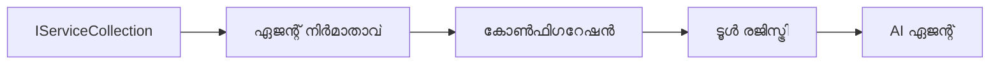

# 🎨 Azure OpenAI (Responses API) ഉപയോഗിച്ച് ഏജൻസിക് ഡിസൈൻ പാറ്റേണുകൾ (.NET)

## 📋 പഠന ലക്ഷ്യങ്ങൾ

ഈ ഉദാഹരണം .NET ൽ Microsoft Agent Framework ഉപയോഗിച്ച് Azure OpenAI (Responses API) സംയോജനം ഉപയോഗിച്ച് ബുദ്ധിമുട്ടുള്ള ഏജന്റുകൾ നിർമ്മിക്കുന്നതിനുള്ള എന്റർപ്രൈസ്-ഗ്രേഡ് ഡിസൈൻ പാറ്റേണുകൾ കാണിക്കുന്നു. ഏജന്റ്സ് പ്രൊഡക്ഷൻ-സജ്ജവും സംരക്ഷിക്കാവുന്നതുമായതും സ്കെയിലബിളായതുമായതാക്കുന്ന പ്രൊഫഷണൽ പാറ്റേണുകളും ആർക്കിടെക്ചറൽ സമീപനങ്ങളും നിങ്ങൾ പഠിക്കും.

### എന്റർപ്രൈസ് ഡിസൈൻ പാറ്റേണുകൾ

- 🏭 **Factory Pattern**: ഡിപ്പൻഡൻസി ഇൻജക്ഷനോടുകൂടിയ സ്റ്റാൻഡേർഡ് ഏജന്റ് സൃഷ്ടി
- 🔧 **Builder Pattern**: ഫ്ലുവന്റ് ഏജന്റ് കോൺഫിഗറേഷൻയും സെറ്റപ്പും
- 🧵 **Thread-Safe Patterns**: സമാന്തര സംഭാഷണ മാനേജ്മെന്റ്
- 📋 **Repository Pattern**: ക്രമീകരിച്ച ടൂൾസ് এবং ശേഷിമാറ്റം മാനേജ്മെന്റ്

## 🎯 .NET-പ്രതിഷ്ഠിത ആർക്കിടെക്ചറൽ ഗുണങ്ങൾ

### എന്റർപ്രൈസ് സവിശേഷതകൾ

- **ശക്തമായ ടൈപ്പിംഗ്**: കമ്പൈൽ സമയ സ്ഥിരീകരണവും IntelliSense പിന്തുണയും
- **Dependency Injection**: ഉൾക_knfhട്ട DI കൺടെയിനർ സംയോജനം
- **Configuration Management**: IConfiguration, Options പാറ്റേണുകൾ
- **Async/Await**: മുൻനിര അസിങ്ക്രൺ പ്രോഗ്രാമിങ് പിന്തുണ

### പ്രൊഡക്ഷൻ-സജ്ജമായ പാറ്റേണുകൾ

- **Logging Integration**: ILogger, ഘടനാപരമായ ലോഗിംഗ്
- **Health Checks**: ഉൾക_knfhട്ട മോണിറ്ററിങ്, ഡയഗ്നോസ്റ്റെക്സ്
- **Configuration Validation**: ഡാറ്റ അനോട്ടേഷനുകളോടു ചേർന്ന ശക്തമായ ടൈപ്പിംഗ്
- **Error Handling**: ഘടനാപരമായ എക്സ്പ്ഷൻ മാനേജ്മെന്റ്

## 🔧 സാങ്കേതിക ആർക്കിടെക്ചർ

### കോർ .NET ഘടകങ്ങൾ

- **Microsoft.Extensions.AI**: ഏകീകൃത AI സേവന പശ്ചാത്തലങ്ങൾ
- **Microsoft.Agents.AI**: എന്റർപ്രൈസ് ഏജന്റ് ഓർക്കസ്ട്രേഷൻ ഫ്രെയിംവർക്കുകൾ
- **Azure OpenAI (Responses API)**: ഹൈ-പരഫോർമൻസ് API ക്ലയന്റ് പാറ്റേണുകൾ
- **Configuration System**: appsettings.json, പരിസ്ഥിതി സംയോജനം

### ഡിസൈൻ പാറ്റേൺ സംവരണ നിർവഹണം



## 🏗️ പ്രദർശിപ്പിച്ച എന്റർപ്രൈസ് പാറ്റേണുകൾ

### 1. **സൃഷ്ടിച്ച പാറ്റേണുകൾ**

- **Agent Factory**: ഏകഗമമായ കോൺഫിഗറേഷനോടുകൂടിയ കേന്ദ്രകൃത ഏജന്റ് സൃഷ്ടി
- **Builder Pattern**: സങ്കീർണ്ണ ഏജന്റ് കോൺഫിഗറേഷനിൽ ഫ്ലുവന്റ് API
- **Singleton Pattern**: പങ്കിട്ട റിസോഴ്‌സുകളും കോൺഫിഗറേഷനും
- **Dependency Injection**: സ്വതന്ത്ര കപ്പളിങ്, ടെസ്റ്റബിലിറ്റി

### 2. **വ്യവഹാര പാറ്റേണുകൾ**

- **Strategy Pattern**: വിനിമയ സാധ്യമായ ടൂൾ പ്രവർത്തന തന്ത്രങ്ങൾ
- **Command Pattern**: പുനഃസ്ഥാപനത്തോടെ ഏജന്റ് പ്രവർത്തനങ്ങളുടെ ഇൻക്യാപ്സുലേഷൻ
- **Observer Pattern**: ഇവന്റ്-റൈബ്രൻ ഏജന്റ് ലൈഞ്ചു മാനേജ്മെന്റ്
- **Template Method**: സ്റ്റാൻഡേർഡ് ഏജന്റ് പ്രവർത്തന പ്രവാഹങ്ങൾ

### 3. **ഘടനാപരമായ പാറ്റേണുകൾ**

- **Adapter Pattern**: Azure OpenAI (Responses API) സംയോജനം ലെയർ
- **Decorator Pattern**: ഏജന്റ് ശേഷി വർധിപ്പിക്കൽ
- **Facade Pattern**: ലളിതമായ ഏജന്റ് ഇന്ററാക്ഷൻ ഇന്റർഫേസുകൾ
- **Proxy Pattern**: lazy ലോഡിങ്ങും പേഴ്‌ഫോമൻസ് കാഷിംഗും

## 📚 .NET ഡിസൈൻ സ 원sധനങ്ങൾ

### SOLID സ 원sധനങ്ങൾ

- **Single Responsibility**: ഓരോ ഘടകത്തിനും വ്യക്തമായ ലക്ഷ്യം
- **Open/Closed**: മാറ്റം കൂടാതെ വ്യുലപ്പെടുത്താവുന്നത്
- **Liskov Substitution**: ഇന്റർഫേസ് അടിസ്ഥാനമുള്ള ടൂൾ ഉറവിടങ്ങൾ
- **Interface Segregation**: ശ്രദ്ധിച്ച, സഗ്ഗ്രഹിച്ച ഇന്റർഫേസുകൾ
- **Dependency Inversion**: ദ്രാവകം അല്ലാതെയുള്ള ആശ്രയം

### ശുചിത്വ ആർക്കിടെക്ചർ

- **Domain Layer**: കോർ ഏജന്റ് ടൂൾ അവര്ത്ഥനകൾ
- **Application Layer**: ഏജന്റ് ഓർക്കസ്ട്രേഷൻ Workflowകൾ
- **Infrastructure Layer**: Azure OpenAI (Responses API) സംയോജനം, ബാഹ്യ സേവനങ്ങൾ
- **Presentation Layer**: ഉപയോക്തൃ ഇടപാട്, പ്രതികരണം ഫോർമാറ്റിംഗ്

## 🔒 എന്റർപ്രൈസ് പരിഗണനകൾ

### സുരക്ഷ

- **ക്രെഡൻഷ്യൽ മാനേജ്മെന്റ്**: IConfiguration ഉപയോഗിച്ച് സുരക്ഷിത API കീ കൈകാര്യം
- **ഇൻപുട്ട് പൂർത്തിയാക്കൽ**: ശക്തമായ ടൈപ്പിംഗ്, ഡാറ്റ അനോട്ടേഷൻ പരിശോധന
- **ഔട്ട്പുട്ട് ശുദ്ധീകരണം**: സുരക്ഷിത പ്രതികരണ പ്രോസസ്സിങ്, ഫിൽറ്ററിങ്
- **ഓഡിറ്റ് ലോഗിംഗ്**: സമഗ്രമായ പ്രവർത്തന ട്രാക്കിംഗ്

### പ്രകടനം

- **Async Patterns**: തടസ്സമില്ലാത്ത I/O പ്രവർത്തനങ്ങൾ
- **Connection Pooling**: കാര്യക്ഷമ HTTP ക്ലയന്റ് മാനേജ്മെന്റ്
- **Caching**: മെച്ചപ്പെട്ട പ്രകടനത്തിന് പ്രതികരണം കാഷിംഗ്
- **Resource Management**: ശരിയായ നശീകരണവും ക്ലീനപ്പും

### സ്കെയിലബിലിറ്റി

- **Thread Safety**: സമാന്തര ഏജന്റ് എക്സിക്യൂഷൻ പിന്തുണ
- **Resource Pooling**: കാര്യക്ഷമ റിസോഴ്‌സ് ഉപയോഗം
- **Load Management**: നിരക്ക് നിയന്ത്രണവും ബാക്ക്പ്രഷറും കൈകാര്യം ചെയ്യൽ
- **Monitoring**: പ്രകടന മെട്രിക്സും ഹെൽത്ത് ചെക്കുകളും

## 🚀 ഉത്പന്ന വിന്യാസം

- **Configuration Management**: പരിസ്ഥിതി-നിര്ദിഷ്ട ക്രമീകരണങ്ങൾ
- **Logging Strategy**: ഘടനാപരമായ ലോഗിംഗ്, കോറിലേഷൻ ഐഡികൾ
- **Error Handling**: ആഗോള എക്സ്പ്ഷൻ മാനേജ്മെന്റ്, ശരിയായ പുനരധിവാസം
- **Monitoring**: അപ്ലിക്കേഷൻ ഇൻസൈറ്റ്‌സ്, പ്രകടന കൗണ്ടറുകൾ
- **Testing**: യൂണിറ്റ് ടെസ്റ്റുകൾ, ഇന്റഗ്രേഷൻ ടെസ്റ്റുകൾ, ലോഡ് ടെസ്റ്റിംഗ് പാറ്റേണുകൾ

.NET ഉപയോഗിച്ച് എന്റർപ്രൈസ്-ഗ്രേഡ് ബുദ്ധിമുട്ടുള്ള ഏജന്റുകൾ നിർമ്മിക്കുവാൻ തയ്യാറായി? ശക്തമായ ഒരു ആർക്കിടെക്ചർ തയ്യാറാക്കാം! 🏢✨

## 🚀 തുടങ്ങാം

### മുൻപുള്ള ആവശ്യങ്ങൾ

- [.NET 10 SDK](https://dotnet.microsoft.com/download/dotnet/10.0) അല്ലെങ്കിൽ അതിനു മുകളിൽ
- Azure OpenAI റിസോഴ്‌സ് ഉള്ള [Azure subscription](https://azure.microsoft.com/free/) കൂടാതെ മodel ഡിപ്ലോയ്മെന്റ്
- [Azure CLI](https://learn.microsoft.com/cli/azure/install-azure-cli) — `az login` ഉപയോഗിച്ച് സൈൻ ഇൻ ചെയ്യുക

### ആവശ്യമായ പരിസ്ഥിതി വേരിയബിളുകൾ

```bash
# zsh/bash
export AZURE_OPENAI_ENDPOINT=https://<your-resource>.openai.azure.com
export AZURE_OPENAI_DEPLOYMENT=gpt-4o-mini
# അത് ശേഷം AzureCliCredential ടോക്കൺ നേടാൻ സൈൻ ഇൻ ചെയ്യുക
az login
```

```powershell
# പവർഷെൽ
$env:AZURE_OPENAI_ENDPOINT = "https://<your-resource>.openai.azure.com"
$env:AZURE_OPENAI_DEPLOYMENT = "gpt-4o-mini"
# തുടർന്ന് സൈൻ ഇൻ ചെയ്യുക, അതിനാൽ AzureCliCredential ടോക്കൺ ലഭിക്കാനും കഴിയാം
az login
```

### സാമ്പിൾ കോഡ്

ഈ കോഡ് ഉദാഹരണം പ്രവർത്തിപ്പിക്കാൻ,

```bash
# zsh/bash
chmod +x ./03-dotnet-agent-framework.cs
./03-dotnet-agent-framework.cs
```

അല്ലെങ്കിൽ dotnet CLI ഉപയോഗിച്ച്:

```bash
dotnet run ./03-dotnet-agent-framework.cs
```

പൂർണ കോഡ് കാണാൻ [`03-dotnet-agent-framework.cs`](../../../../03-agentic-design-patterns/code_samples/03-dotnet-agent-framework.cs) കാണുക.

```csharp
#!/usr/bin/dotnet run

#:package Microsoft.Extensions.AI@10.*
#:package Microsoft.Agents.AI.OpenAI@1.*-*
#:package Azure.AI.OpenAI@2.1.0
#:package Azure.Identity@1.13.1

using System.ComponentModel;

using Microsoft.Agents.AI;
using Microsoft.Extensions.AI;

using Azure.AI.OpenAI;
using Azure.Identity;

// Tool Function: Random Destination Generator
// This static method will be available to the agent as a callable tool
// The [Description] attribute helps the AI understand when to use this function
// This demonstrates how to create custom tools for AI agents
[Description("Provides a random vacation destination.")]
static string GetRandomDestination()
{
    // List of popular vacation destinations around the world
    // The agent will randomly select from these options
    var destinations = new List<string>
    {
        "Paris, France",
        "Tokyo, Japan",
        "New York City, USA",
        "Sydney, Australia",
        "Rome, Italy",
        "Barcelona, Spain",
        "Cape Town, South Africa",
        "Rio de Janeiro, Brazil",
        "Bangkok, Thailand",
        "Vancouver, Canada"
    };

    // Generate random index and return selected destination
    // Uses System.Random for simple random selection
    var random = new Random();
    int index = random.Next(destinations.Count);
    return destinations[index];
}

// Azure OpenAI with the Responses API (stable v1 endpoint). Sign in with `az login`.
var azureEndpoint = Environment.GetEnvironmentVariable("AZURE_OPENAI_ENDPOINT")
    ?? throw new InvalidOperationException("AZURE_OPENAI_ENDPOINT is not set.");
var deployment = Environment.GetEnvironmentVariable("AZURE_OPENAI_DEPLOYMENT") ?? "gpt-4o-mini";

var azureClient = new AzureOpenAIClient(new Uri(azureEndpoint), new AzureCliCredential());

// Define Agent Identity and Comprehensive Instructions
// Agent name for identification and logging purposes
var AGENT_NAME = "TravelAgent";

// Detailed instructions that define the agent's personality, capabilities, and behavior
// This system prompt shapes how the agent responds and interacts with users
var AGENT_INSTRUCTIONS = """
You are a helpful AI Agent that can help plan vacations for customers.

Important: When users specify a destination, always plan for that location. Only suggest random destinations when the user hasn't specified a preference.

When the conversation begins, introduce yourself with this message:
"Hello! I'm your TravelAgent assistant. I can help plan vacations and suggest interesting destinations for you. Here are some things you can ask me:
1. Plan a day trip to a specific location
2. Suggest a random vacation destination
3. Find destinations with specific features (beaches, mountains, historical sites, etc.)
4. Plan an alternative trip if you don't like my first suggestion

What kind of trip would you like me to help you plan today?"

Always prioritize user preferences. If they mention a specific destination like "Bali" or "Paris," focus your planning on that location rather than suggesting alternatives.
""";

// Create AI Agent with Advanced Travel Planning Capabilities
// Get the Responses client for the deployment and create the AI agent
// Configure agent with name, detailed instructions, and available tools
// This demonstrates the .NET agent creation pattern with full configuration
AIAgent agent = azureClient
    .GetOpenAIResponseClient(deployment)
    .CreateAIAgent(
        name: AGENT_NAME,
        instructions: AGENT_INSTRUCTIONS,
        tools: [AIFunctionFactory.Create(GetRandomDestination)]
    );

// Create New Conversation Thread for Context Management
// Initialize a new conversation thread to maintain context across multiple interactions
// Threads enable the agent to remember previous exchanges and maintain conversational state
// This is essential for multi-turn conversations and contextual understanding
AgentThread thread = agent.GetNewThread();

// Execute Agent: First Travel Planning Request
// Run the agent with an initial request that will likely trigger the random destination tool
// The agent will analyze the request, use the GetRandomDestination tool, and create an itinerary
// Using the thread parameter maintains conversation context for subsequent interactions
await foreach (var update in agent.RunStreamingAsync("Plan me a day trip", thread))
{
    await Task.Delay(10);
    Console.Write(update);
}

Console.WriteLine();

// Execute Agent: Follow-up Request with Context Awareness
// Demonstrate contextual conversation by referencing the previous response
// The agent remembers the previous destination suggestion and will provide an alternative
// This showcases the power of conversation threads and contextual understanding in .NET agents
await foreach (var update in agent.RunStreamingAsync("I don't like that destination. Plan me another vacation.", thread))
{
    await Task.Delay(10);
    Console.Write(update);
}
```

---

<!-- CO-OP TRANSLATOR DISCLAIMER START -->
**അറിയിപ്പ്**:
ഈ രേഖ AI പരിഭാഷാ സേവനം [Co-op Translator](https://github.com/Azure/co-op-translator) ഉപയോഗിച്ച് പരിഭാഷപ്പെടുത്തിയതാണ്. ഞങ്ങൾ കൃത്യതയ്ക്കായി ശ്രമിക്കുന്നുവെങ്കിലും, ഓട്ടോമേറ്റഡ് പരിഭാഷകളിൽ പിഴവുകൾ അല്ലെങ്കിൽ തെറ്റായ വിവരങ്ങൾ ഉണ്ടാകാൻ സാധ്യതയുണ്ട്. അതിന്റെ സ്വാഭാവിക ഭാഷയിലുള്ള അസൽ രേഖയാണ് പ്രാമാണികമായ ഉറവിടമായി പരിഗണിക്കേണ്ടത്. നിർണായകമായ വിവരങ്ങൾക്ക്, പ്രൊഫഷണൽ മനുഷ്യ പരിഭാഷ ശുപാർശ ചെയ്യുന്നു. ഈ പരിഭാഷ ഉപയോഗിച്ച് ഉണ്ടാകുന്ന തെറ്റിദ്ധാരണകൾ അല്ലെങ്കിൽ തെറ്റായ വ്യാഖ്യാനങ്ങൾക്കായി ഞങ്ങൾ ഉത്തരവാദികളല്ല.
<!-- CO-OP TRANSLATOR DISCLAIMER END -->