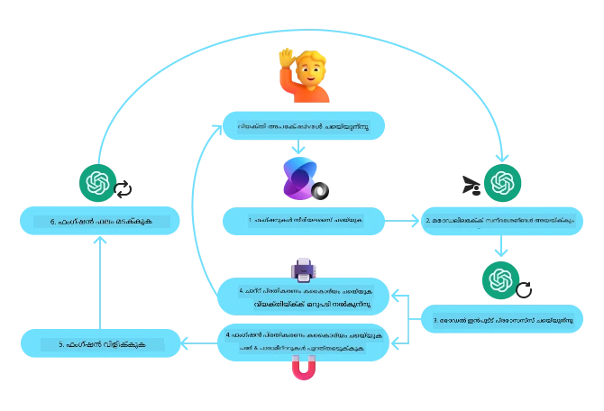
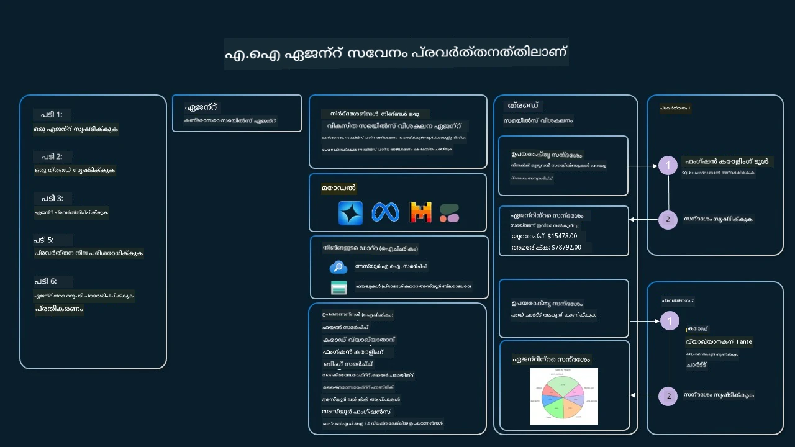

[](https://youtu.be/vieRiPRx-gI?si=cEZ8ApnT6Sus9rhn)

> _(മുകളിലുള്ള ചിത്രം ക്ലിക്കുചെയ്ത് ഈ പാഠത്തിന്റെ വീഡിയോ കാണുക)_

# ഉപകരണ ഉപയോഗ ഡിസൈൻ മാതൃക

ഉപകരണങ്ങൾ (tools) രസകരമാണ് കാരണം അവ AI ഏജന്റുകൾക്ക് കൂടുതലായി കഴിവുകൾ നൽകുന്നു. ഏജന്റിന് നിർവഹിക്കാൻ കഴിയുന്ന ക്രിയകളുടെ ഒരു പരിമിതമായ സെറ്റ് ഉള്ളതിനുപകരം, ഒരു ഉപകരണം ചേർത്ത്, ഏജന്റ് ഇപ്പോൾ കൂടുതല്‍ വിപുലമായ ക്രിയകൾ നിർവഹിക്കാൻ കഴിയുന്നതാണ്. ഈ അധ്യായത്തിൽ, നാം Tool Use Design Pattern (ഉപകരണ ഉപയോഗ ഡിസൈൻ മാതൃക) പരിശോധിക്കും, അത് ഏങ്ങനെയാണ് AI ഏജന്റുകൾക്ക് നിശ്ചിത ലക്ഷ്യങ്ങൾ നേടാനായി പ്രത്യേക ഉപകരണങ്ങൾ ഉപയോഗിക്കാൻ സഹായിക്കുന്നതെന്ന് വിവരിക്കുന്നു.

## ആമുഖം

ഈ പാഠത്തിൽ, നമുക്ക് താഴെ പറയുന്ന ചോദ്യങ്ങൾക്ക് ഉത്തരം നോക്കാനാണ്:

- ഉപകരണ ഉപയോഗ ഡിസൈൻ മാതൃക എന്താണ്?
- ഇത് എവിടിനെ പ്രയോഗിക്കാവുന്നതാണ്?
- മാതൃക നടപ്പിലാക്കുന്നതിനായി ആവശ്യമായ ഘടകങ്ങൾ/ബിൽഡിംഗ് ബ്ലോകുകൾ എന്തൊക്കെയാണ്?
- വിശ്വസനീയമായ AI ഏജന്റുകൾ നിർമ്മിക്കാൻ Tool Use Design Pattern ഉപയോഗിക്കുമ്പോൾ有哪些 പ്രത്യേക പരിഗണനകൾ?

## അധ്യയന ലക്ഷ്യങ്ങൾ

ഈ പാഠം പൂർണമാക്കിയശേഷം, നിങ്ങൾ കഴിയേണം:

- Tool Use Design Pattern-നെ അതിന്റേത് ലക്ഷ്യവും നിർവചിക്കാൻ.
- ഏതു ഉപയോഗസംഭവങ്ങളിൽ Tool Use Design Pattern പ്രയോഗിക്കാവുന്നതാണെന്ന് തിരിച്ചറിയാൻ.
- മാതൃക നടപ്പിലാക്കാൻ ആവശ്യമായ പ്രധാന ഘടകങ്ങൾ മനസ്സിലാക്കാൻ.
- ഈ ഡിസൈൻ മാതൃക ഉപയോഗിക്കുന്ന AI ഏജന്റുകൾക്ക് വിശ്വാസ്യത ഉറപ്പാക്കുന്നതിന് പരിഗണിക്കേണ്ട കാര്യങ്ങൾ തിരിച്ചറിഞ്ഞു നൽകാൻ.

## ഉപകരണ ഉപയോഗ ഡിസൈൻ മാതൃക എന്താണ്?

**Tool Use Design Pattern** LLM-ുമാർക്ക് (വലിയ ഭാഷാ മോഡലുകൾ) പുറത്തുള്ള ഉപകരണങ്ങളുമായി ഇടപെടാൻ കഴിവ് നൽകുകയും, നിശ്ചിത ലക്ഷ്യങ്ങൾ കൈവരിക്കാൻ സഹായിക്കുകയും ചെയ്യുന്നതിലാണ് കേന്ദ്രീകരിക്കുന്നത്. ഉപകരണങ്ങൾ എന്നാണ് പറയുന്നത് എജന്റ് പ്രവർത്തനങ്ങൾ നിർവഹിക്കാൻ ലഭ്യമാകുന്ന കോഡ്. ഒരു ഉപകരണം കാൽക്കുലേറ്റർ പോലെയുള്ള ലളിതമായ ഫംഗ്ഷൻ ആകാം, അല്ലെങ്കിൽ സ്റ്റോക്ക് വില തിരയൽ അല്ലെങ്കിൽ കാലാവസ്ഥാ പ്രവചനം പോലുള്ള മൂന്നാംപാര്‍ടീ സേവനത്തിലേക്കുള്ള API കോളായിരിക്കും. AI ഏജന്റുകളുടെ സന്നിവേശത്തിൽ, ഉപകരണങ്ങൾ **മോഡൽ-ജനിത ഫംഗ്ഷൻ കോൾകൾ**ക്ക് പ്രതികരിച്ച് ഏജന്റുകൾ നിർവഹിക്കുന്നതിനായി രൂപകൽപ്പന ചെയ്‌തിരിക്കുന്നു.

## ഇത് എവിടെയാണ് പ്രയോഗിക്കാവുന്നത്?

AI ഏജന്റുകൾ തൊഴിൽ പൂര്‍ത്തീകരിക്കാൻ, വിവരങ്ങൾ വീണ്ടെടുക്കാൻ, അല്ലെങ്കിൽ നിർണയങ്ങളെടുക്കാൻ ഉപകരണങ്ങൾ ഉപയോഗിക്കാം. പുറം സിസ്റ്റങ്ങളുമായുള്ള ഡൈനാമിക് ഇടപെടൽ ആവശ്യമായ സാഹചരികളിൽ, ഡാറ്റാബേസുകൾ, വെബ് സേവനങ്ങൾ, അല്ലെങ്കിൽ കോഡ് വ്യാഖ്യാതാക്കൾ പോലുള്ള സംവിധാനങ്ങളുമായിഗതി ആവശ്യപ്പെട്ടാൽ Tool Use Design Pattern ഉപയോഗിക്കപ്പെടുന്നു. ഇത് നിരവധി വിവിധ ഉപയോഗസംഭവങ്ങൾക്ക് പ്രയോജനപ്രദമാണ്, ഉൾപ്പെടുന്നത്:

- **ഡൈനാമിക് വിവര വീണ്ടെടുപ്പ്:** ഏജന്റുകൾ പുറം APIകൾ അല്ലെങ്കിൽ ഡാറ്റാബേസുകൾ ക്വെറി ചെയ്ത് പുതുപ്പിച്ചിട്ടുള്ള ഡാറ്റ കൊണ്ടുവരാൻ കഴിയും (ഉദാഹരണം: ഡാറ്റാ വിശകലനത്തിന് SQLite ഡാറ്റാബേസ് ക്വെറി ചെയ്യുക, സ്റ്റോക്ക് വിലകൾ അല്ലെങ്കിൽ കാലാവസ്ഥാ വിവരം നേടുക).
- **കോഡ് നിർവഹണവും വ്യാഖ്യാനവുമ്:** ഗണിത പ്രശ്നങ്ങൾ പരിഹരിക്കാൻ, റിപോർട്ടുകൾ സൃഷ്‌ടിക്കാൻ, അല്ലെങ്കിൽ അനുകരണങ്ങൾ നടത്താൻ ഏജന്റുകൾ കോഡ് അല്ലെങ്കിൽ സ്‌ക്രിപ്റ്റുകൾ 실행പരിചയപ്പെടുത്താം.
- **വർക്ക്ഫ്ലോ ഓട്ടോമാഷൻ:** ടാസ്ക് ഷെഡ്യൂളറുകൾ, ഇമെയിൽ സേവനങ്ങൾ, അല്ലെങ്കിൽ ഡാറ്റാ പൈപ്പ്ലൈനുകൾ പോലുള്ള ഉപകരണങ്ങൾ ഇന്റഗ്രേറ്റ് ചെയ്ത് ആവർത്തനമോ മൾട്ടി-സ്റ്റെപ് ജോലികൾ ഓട്ടോമേറ്റുചെയ്യൽ.
- **കസ്റ്റമർ സപ്പോർട്ട്:** ഏജന്റുകൾ CRM സിസ്റ്റങ്ങൾ, ടിക്കറ്റിംഗ് പ്ലാറ്റ്ഫോംകൾ, അല്ലെങ്കിൽ നോളജ് ബേസുകൾക്കൊപ്പം സംവദിച്ച് ഉപയോക്തൃ ചോദ്യങ്ങൾ പരിഹരിക്കാൻ കഴിയും.
- **ടെക്സ്റ്റ് സൃഷ്ടിയും എഡിറ്റിംഗും:** грамർ ചെക്കറുകൾ, ടെക്സ്റ്റ് സംഗ്രഹകർ, അല്ലെങ്കിൽ ഉള്ളടക്ക സുരക്ഷ മൂല്യനിർണ്ണായകർ പോലുള്ള ഉപകരണങ്ങൾ ഉപയോഗിച്ചു ഉള്ളടക്ക സൃഷ്ടിയിൽ സഹായം നൽകൽ.

## ഉപകരണ ഉപയോഗ ഡിസൈൻ മാതൃക നടപ്പിലാക്കാൻ ആവശ്യമായ ഘടകങ്ങൾ/ബിൽഡിംഗ് ബ്ലോകുകൾ എന്തൊക്കെയാണ്?

ഈ ബിൽഡിംഗ് ബ്ലോകുകൾ AI ഏജന്റിന് വ്യത്യസ്ത ജോലികൾ നിർവഹിക്കാൻ അനുവദിക്കുന്നു. Tool Use Design Pattern നടപ്പിലാക്കാൻ ആവശ്യമായ പ്രധാന ഘടകങ്ങൾ നോക്കാം:

- **Function/Tool Schemas**: ലഭ്യമായ ഉപകരണങ്ങളുടെ വിശദമായ നിർവചനങ്ങൾ, ഫംഗ്ഷൻ നാമം, ഉദ്ദേശ്യം, ആവശ്യമായ പാരാമീറ്ററുകൾ, പ്രവഹികാവശ്യമായ ഔട്ട്പുട്ടുകൾ എന്നിവ അടങ്ങിയിരിക്കും. ഈ സ്കീമകൾ LLM-ന് ലഭ്യമായ ഉപകരണങ്ങൾ എന്തൊക്കെയാണെന്നും സാധുാശനമായ അഭ്യർത്ഥനകൾ എങ്ങനെ നിർമിക്കാമെന്നുമറിയാൻ സഹായിക്കുന്നു.

- **Function Execution Logic**: ഉപകരണങ്ങൾ 언제 ആചരിക്കാമെന്ന് നിർണ്ണയിക്കുന്ന നിയമങ്ങളും അത്തരം.Invocation-ഉം, പ്ലാനർ മൊഡ്യൂളുകൾ, റൂട്ടിങ് സംവിധാനങ്ങൾ, അതവ വികസിതമായ നിബന്ധനാത്മക ഫ്ലോകൾ ഉൾപ്പെടാം, ഉപകരണ ഉപയോഗത്തെ ഡൈനാമിക്കായി നിർണ്ണയിക്കുന്നു.

- **Message Handling System**: ഉപയോക്തൃ ഇൻപുട്ടുകൾ, LLM പ്രതികരണങ്ങൾ, ഉപകരണ കോൾകൾ, ഉപകരണ ഔട്ട്‌പുട്ടുകൾ എന്നിവയുടെ സംഭാഷണ പ്രവാഹം നിയന്ത്രിക്കുന്ന ഘടകങ്ങൾ.

- **Tool Integration Framework**: ഏജന്റിനെ വിവിധ ഉപകരണങ്ങളുമായി ബന്ധിപ്പിക്കുന്ന ഇൻഫ്രാസ്ട്രക്ചർ, അവ ലളിതമായ ഫംഗ്ഷനുകളായിരിക്കാം അല്ലെങ്കിൽ സങ്കീർണ്ണമായ പുറം സേവനങ്ങളായിരിക്കാം.

- **Error Handling & Validation**: ഉപകരണങ്ങൾ നിർവഹിക്കുന്നതിൽ പരാജയങ്ങൾ കൈകാര്യം ചെയ്യുന്നതിനുള്ള സംവിധാനം, പാരാമീറ്ററുകൾ സാധുവാകുന്നതായി പരിശോധന നടത്തൽ, അപ്രതീക്ഷിത പ്രതികരണങ്ങൾ കൈകാര്യം ചെയ്‌തു.

- **State Management**: സംഭാഷണ കോൺടെക്സ്റ്റ്, മുമ്പത്തെ ഉപകരണ ഇടപെടലുകൾ, സ്ഥിരതയുള്ള ഡാറ്റ എന്നിവ ട്രാക്ക് ചെയ്യുക, മൾട്ടി-ടേൺ ഇടപെടലുകളിൽ സുസ്ഥിരത ഉറപ്പാക്കാൻ.

ഇനി Function/Tool Calling-നെ കൂടുതൽ വിശദമായി നോക്കാം.
 
### Function/Tool Calling

ഫംഗ്ഷൻ കോൾ ചെയ്യൽ വലിയ ഭാഷാ മോഡലുകൾക്ക് (LLMs) ഉപകരണങ്ങളുമായി ഇടപെടാൻ സാധ്യമാക്കുന്ന പ്രധാന മാർഗ്ഗമാണ്. 'Function'യും 'Tool'ഉം പരസ്പരം ഉപയോഗിച്ചാണ് പലപ്പോഴും കാണുന്നത് കാരണം 'functions' (പുനരുപയോഗയോഗ്യമായ കോഡിന്റെ ബ്ലോക്കുകൾ) એ એജന്റുകൾ നിർവഹിക്കാൻ ഉപയോഗിക്കുന്ന 'tools' ആകുന്നു. ഒരു ഫംഗ്ഷന്റെ കോഡ് വിളിക്കപ്പെട്ടേണം എങ്കിൽ, ഒരു LLM-ന് ഉപയോക്താവിന്റെ അഭ്യർത്ഥന ഫംഗ്ഷൻ വിവരണവുമായി താരതമ്യം ചെയ്യേണ്ടതുണ്ട്. ഇതിനു വേണ്ടിയാണ് ലഭ്യമായ എല്ലാ ഫംഗ്ഷനുകളുടെയും വിവരണങ്ങളടങ്ങിയ ഒരു സ്കീമ LLM-നെ അയയ്ക്കുന്നത്. LLM പിന്നീട് ആ ജോലി માટે ഏറ്റവും അനുയോജ്യമായ ഫംഗ്ഷൻ തിരഞ്ഞെടുക്കുകയും അതിന്റെ നാമവും ആഗ്യുമെന്റുകളും മടങ്ങി നൽകുകയും ചെയ്യുന്നു. തിരഞ്ഞെടുത്ത ഫംഗ്ഷൻ വിളിക്കപ്പെടുന്നു, അതിന്റെ പ്രതികരണം LLM-ന് മടക്കി അയയ്ക്കപ്പെടുന്നു, അത് ഉപയോഗിച്ച് ഉപയോക്താവിന്റെ അഭ്യർത്ഥനയ്ക്ക് മറുപടി നൽകുന്നതിന് LLM ഉപയോഗിക്കുന്നു.

ഡവലപ്പർമാർക്ക് ഏജന്റുകൾക്കായി ഫംഗ്ഷൻ കോൾ ചെയ്യൽ നടപ്പിലാക്കാൻ, നിങ്ങൾക്ക് ആവശ്യമാണ്:

1. ഫംഗ്ഷൻ കോൾ ചെയ്യൽ പിന്തുണക്കുന്ന ഒരു LLM മോഡൽ
2. ഫംഗ്ഷൻ വിവരണങ്ങളടങ്ങിയ ഒരു സ്കീമ
3. വിവരണപ്പെട്ട ഓരോ ഫംഗ്ഷനിനും വേണ്ട കോഡ്

നഗരത്തിനുള്ള നിലവിലെ സമയം കണ്ടെത്താനുള്ള ഉദാഹരണം ഉപയോഗിച്ച് വിശദീകരിക്കാം:

1. **ഫംഗ്ഷൻ കോൾ ചെയ്യൽ പിന്തുണക്കുന്ന ഒരു LLM പ്രാരംഭീകരിക്കുക:**

    എല്ലായ്‌പ്പോഴും എല്ലാ മോഡലുകളുമല്ല ഫംഗ്ഷൻ കോൾ ചെയ്യലിന് പിന്തുണ നൽകുന്നത്, അതിനാൽ നിങ്ങൾ ഉപയോഗിക്കുന്ന LLM ഇത് പിന്തുണയ്ക്കുന്നുണ്ടോ എന്ന് പരിശോധിക്കുന്നത് പ്രധാനമാണ്.     <a href="https://learn.microsoft.com/azure/ai-services/openai/how-to/function-calling" target="_blank">Azure OpenAI</a> ഫംഗ്ഷൻ കോൾ ചെയ്യൽ പിന്തുണയ്ക്കുന്നു. നാം Azure OpenAI ക്ലയന്റ് ആരംഭിക്കാനായി തുടങ്ങാം. 

    ```python
    # Azure OpenAI ക്ലയന്റ് ആരംഭിക്കുക
    client = AzureOpenAI(
        azure_endpoint = os.getenv("AZURE_AI_PROJECT_ENDPOINT"), 
        api_key=os.getenv("AZURE_OPENAI_API_KEY"),  
        api_version="2024-05-01-preview"
    )
    ```

1. **ഒരു Function Schema സൃഷ്ടിക്കുക**:

    അടുത്തതായി നാം ഫംഗ്ഷന്റെ പേര്, ഫംഗ്ഷൻ എന്ത് ചെയ്യുന്നുവെന്ന് ഉള്ള വിവരണം, ഫംഗ്ഷൻ പാരാമീറ്ററുകളുടെ നാമങ്ങളും വിവരണങ്ങളും അടങ്ങുന്ന JSON സ്കീമ നിർവചിക്കും.
    തുടർന്ന് ഈ സ്കീമയും മുൻപ് സൃഷ്ടിച്ച ക്ലയന്റിനെയും കൂടെ ഉപയോക്താവിന്റെ അഭ്യർഥനയോടെ (സാൻ ഫ്രാൻസിസ്കോയിൽ സമയം കണ്ടെത്തുക എന്നാ അഭ്യർഥന) LLM-ലേക്ക് അയക്കും. പ്രധാനമായി ശ്രദ്ധിക്കേണ്ടത് ഒരു **tool call** ആണ് മടങ്ങി വരുന്നത്, ചോദ്യത്തിന്‍റെ അന്തിമ ഉത്തരം **ഇല്ല**. മുൻപായി പറഞ്ഞതുപോലെ, LLM എന്ത് ജോലി ചെയ്യാൻ ഏത് ഫംഗ്ഷൻ തിരഞ്ഞെടുക്കുകയെന്നും, ആ ഫംഗ്ഷനിലേക്ക് ഏത് arguments കടത്തപ്പെടുമെന്ന് തിരിച്ചറിയും.

    ```python
    # മോഡൽ വായിക്കാൻ വേണ്ടി ഫംഗ്ഷന്റെ വിവരണം
    tools = [
        {
            "type": "function",
            "function": {
                "name": "get_current_time",
                "description": "Get the current time in a given location",
                "parameters": {
                    "type": "object",
                    "properties": {
                        "location": {
                            "type": "string",
                            "description": "The city name, e.g. San Francisco",
                        },
                    },
                    "required": ["location"],
                },
            }
        }
    ]
    ```
   
    ```python
  
    # ആദ്യ ഉപയോക്തൃ സന്ദേശം
    messages = [{"role": "user", "content": "What's the current time in San Francisco"}] 
  
    # ആദ്യ API വിളി: മോഡലിനെ ഫംഗ്ഷൻ ഉപയോഗിക്കാൻ ചോദിക്കുക
      response = client.chat.completions.create(
          model=deployment_name,
          messages=messages,
          tools=tools,
          tool_choice="auto",
      )
  
      # മോഡലിന്റെ പ്രതികരണം പ്രക്രിയിക്കുക
      response_message = response.choices[0].message
      messages.append(response_message)
  
      print("Model's response:")  

      print(response_message)
  
    ```

    ```bash
    Model's response:
    ChatCompletionMessage(content=None, role='assistant', function_call=None, tool_calls=[ChatCompletionMessageToolCall(id='call_pOsKdUlqvdyttYB67MOj434b', function=Function(arguments='{"location":"San Francisco"}', name='get_current_time'), type='function')])
    ```
  
1. **ജോലിക്ക് ആവശ്യമായ ഫംഗ്ഷൻ കോഡ്:**

    ഇപ്പോൾ LLM ഏത് ഫംഗ്ഷൻ ഓടിക്കണമെന്ന് തിരഞ്ഞെടുക്കാൻ കഴിഞ്ഞു, ആ ജോലി നിർവഹിക്കുന്ന കോഡ് നടപ്പിലാക്കുകയും നിർവഹിക്കുകയും ചെയ്യേണ്ടതാണ്.
    നാം Python-ൽ നിലവിലെ സമയം നേടാനുള്ള കോഡ് നടപ്പിലാക്കാം. കൂടാതെ response_message-ൽ നിന്നുള്ള പേര് এবং arguments കണ്ടെടുത്ത് അന്തിമ ഫലം എങ്ങനെ കിട്ടാക്കോളുകൾ എഴുതാമെന്ന തേടൽ കോഡ് എഴുതേണ്ടതുണ്ടാകും.

    ```python
      def get_current_time(location):
        """Get the current time for a given location"""
        print(f"get_current_time called with location: {location}")  
        location_lower = location.lower()
        
        for key, timezone in TIMEZONE_DATA.items():
            if key in location_lower:
                print(f"Timezone found for {key}")  
                current_time = datetime.now(ZoneInfo(timezone)).strftime("%I:%M %p")
                return json.dumps({
                    "location": location,
                    "current_time": current_time
                })
      
        print(f"No timezone data found for {location_lower}")  
        return json.dumps({"location": location, "current_time": "unknown"})
    ```

     ```python
     # ഫംഗ്ഷൻ കോൾകൾ കൈകാര്യം ചെയ്യുക
      if response_message.tool_calls:
          for tool_call in response_message.tool_calls:
              if tool_call.function.name == "get_current_time":
     
                  function_args = json.loads(tool_call.function.arguments)
     
                  time_response = get_current_time(
                      location=function_args.get("location")
                  )
     
                  messages.append({
                      "tool_call_id": tool_call.id,
                      "role": "tool",
                      "name": "get_current_time",
                      "content": time_response,
                  })
      else:
          print("No tool calls were made by the model.")  
  
      # രണ്ടാം API കോൾ: മോഡലിൽ നിന്നുള്ള അന്തിമ പ്രതികരണം നേടുക
      final_response = client.chat.completions.create(
          model=deployment_name,
          messages=messages,
      )
  
      return final_response.choices[0].message.content
     ```

     ```bash
      get_current_time called with location: San Francisco
      Timezone found for san francisco
      The current time in San Francisco is 09:24 AM.
     ```

ഫംഗ്ഷൻ കോൾ ചെയ്യൽ ഏജന്റുകൾ ഉപകരണ ഉപയോഗ ഡിസൈൻത്തിന്റെ ഹൃദയത്തിലാണെങ്കിൽ, അതിനെ ആദ്യനാടകളിൽ നിന്നുതന്നെ നടപ്പിലാക്കുന്നത് ചിലപ്പോൾ പ്രയാസമേകാം.
[Lesson 2](../../../02-explore-agentic-frameworks)ൽ നാം പഠിച്ചതുപോലെ, ഏജന്റിക് ഫ്രെയിംവർകുകൾ ഉപകരണ ഉപയോഗം നടപ്പിലാക്കാനുള്ള പ്രീ-ബിൽറ്റ് ബിൽഡിംഗ് ബ്ലോകുകൾ സൌകര്യപ്രദമായി നൽകുന്നു.
 
## ഏജന്റിക് ഫ്രെയിംവർക്കുകളോടൊപ്പം ഉപകരണ ഉപയോഗ ഉദാഹരണങ്ങൾ

വിവിധ ഏജന്റിക് ഫ്രെയിംവർക്കുകൾ ഉപയോഗിച്ച് Tool Use Design Pattern നിങ്ങൾ എങ്ങനെ നടപ്പിലാക്കാമെന്ന് ചില ഉദാഹരണങ്ങൾ ചുവടെ നൽകുന്നു:

### Microsoft Agent Framework

<a href="https://learn.microsoft.com/azure/ai-services/agents/overview" target="_blank">Microsoft Agent Framework</a> AI ഏജന്റുകൾ നിർമ്മിക്കാൻ ഒരു open-source ഫ്രെയിംവർക്കാണ്. `@tool` ഡെക്കറേറ്റർ ഉപയോഗിച്ച് ഉപകരണങ്ങളെ Python ഫംഗ്ഷനുകളായി വ്യക്തമാക്കാൻ ഇത് സാദ്ധ്യമാക്കുന്നു, ഫംഗ്ഷൻ കോൾ ചെയ്യൽ പ്രക്രിയയെ ലളിതമാക്കുന്നു. ഫ്രെയിംവർക്ക് മോഡൽ와 നിങ്ങളുടെ കോഡിന്റേയും തമ്മിലുള്ള ബന്ധപ്പെട്ട ആശയവിനിമയം കൈകാര്യം ചെയ്യുന്നു. അത് `AzureAIProjectAgentProvider` പോലുള്ള മുൻ‌കൂർ-നിർമിത ഉപകരണങ്ങൾ, ഉദാഹരണത്തിന് ഫയൽ സെർച്ച്, കോഡ് ഇൻറർപ്രിറ്റർ എന്നിവയ്ക്കുള്ള ആക്സസ് നൽകുന്നു.

താഴെയുള്ള ഡയഗ്രാം Microsoft Agent Framework-ഉടെ ഫംഗ്ഷൻ കോൾ പ്രക്രിയയെ ചിത്രംവത്കരിക്കുന്നു:



Microsoft Agent Framework-ൽ, ഉപകരണങ്ങൾ ഡെക്കറേറ്റുചെയ്ത ഫംഗ്ഷനുകളായി നിർവചിക്കപ്പെടുന്നു. നാം മുമ്പ് കണ്ട `get_current_time` ഫംഗ്ഷൻ `@tool` ഡെക്കറേറ്റർ ഉപയോഗിച്ച് ഒരു ടൂളായി മാറ്റിക്കാഴ്‌ച ചെയ്യാം. ഫ്രെയിംവർക്ക് സ്വയം ഫംഗ്ഷനും അതിന്റെ പാരാമീറ്ററുകളും സീരിയലൈസ് ചെയ്ത് LLM-നെ അയയ്ക്കാനുള്ള സ്കീമ സൃഷ്ടിക്കും.

```python
from agent_framework import tool
from agent_framework.azure import AzureAIProjectAgentProvider
from azure.identity import AzureCliCredential

@tool
def get_current_time(location: str) -> str:
    """Get the current time for a given location"""
    ...

# ക്ലയന്റ് സൃഷ്ടിക്കുക
provider = AzureAIProjectAgentProvider(credential=AzureCliCredential())

# ഒരു ഏജന്റ് സൃഷ്ടിച്ച് ടൂളുപയോഗിച്ച് ഓടിക്കുക
agent = await provider.create_agent(name="TimeAgent", instructions="Use available tools to answer questions.", tools=get_current_time)
response = await agent.run("What time is it?")
```
  
### Azure AI Agent Service

<a href="https://learn.microsoft.com/azure/ai-services/agents/overview" target="_blank">Azure AI Agent Service</a> ഒരു പുതിയ ഏജന്റിക് ഫ്രെയിംവർക്ക് ആണ്, ഇത് ഡവലപ്പർമാർക്ക് സുരക്ഷിതമായി ഉയർന്ന നിലവാരമുള്ള, വിപുലീകരിക്കാൻ കഴിയുന്ന AI ഏജന്റുകൾ നിർമ്മിക്കുകയും ഡിപ്ലോയ് ചെയ്യുകയും സ്കെയിൽ ചെയ്യുകയും ചെയ്യാൻ സഹായിക്കുന്ന രീതിയിൽ രൂപകൽപ്പന ചെയ്‌തതാണ്, അടിസ്ഥാന കംപ്യൂട്ട് மற்றும் സ്റ്റോറേജ് വിഭവങ്ങൾ മാനേജ് ചെയ്യേണ്ട ആവശ്യം ഇല്ലാതെ. ഇത് പ്രത്യേകിച്ച് എന്റർപ്രൈസ് അപേക്ഷകൾക്കായി ഉപയോഗപ്രദമാണ് കാരണം ഇത് മുഴുവൻ മാനേജ് ചെയ്യുന്ന സര്‍വീസ് കൂടിയാണ്, എന്റർപ്രൈസ് ഗ്രേഡ് സുരക്ഷയോടെ.

LLM API നേരിട്ട് ഉപയോഗിച്ച് ഡെവലപ്പുചെയ്യുന്നതുമായി താരതമ്യപ്പെടുത്തുമ്പോൾ, Azure AI Agent Service ചില ഗുണങ്ങൾ നൽകുന്നു, ഉൾപ്പെടെ:

- ഓട്ടോമാറ്റിക് ടൂൾ കോളിംഗ് – ടൂൾ കോൾ പാഴ്‌സുചെയ്യേണ്ടതില്ല, ടൂൾ invoke ചെയ്യുകയും പ്രതികരണം കൈകാര്യം ചെയ്യുകയും ചെയ്യേണ്ടതില്ല; ഇവ എല്ലാം സെർവർ-സൈഡിൽ ചെയ്യപ്പെടുന്നു
- സുരക്ഷിതമായി മാനേജ്ചെയ്ത ഡാറ്റ – നിങ്ങളുടെ സംഭാഷൺ സ്റ്റേറ്റ് നിങ്ങൾ തന്നെ കൈകാര്യം ചെയ്യുന്നതിനുപകരം, ത്രെഡുകൾ (threads) ആവശ്യമായ എല്ലാ വിവരങ്ങളും 저장ിക്കുമെന്ന് ആശ്രയിക്കാവുന്നതാണ്
- പുറം-ബോക്സ് ടൂളുകൾ – Bing, Azure AI Search, Azure Functions പോലുള്ള നിങ്ങളുടെ ഡാറ്റാ സ്രോതസ്സുകളുമായി ഇടപെടാനാവുന്ന ടൂളുകൾ

Azure AI Agent Service-ൽ ലഭ്യമായ ടൂളുകൾ രണ്ട് വിഭാഗങ്ങളായി വിഭജിക്കാവുന്നതാണ്:

1. നോളജ് ടൂളുകൾ:
    - <a href="https://learn.microsoft.com/azure/ai-services/agents/how-to/tools/bing-grounding?tabs=python&pivots=overview" target="_blank">Grounding with Bing Search</a>
    - <a href="https://learn.microsoft.com/azure/ai-services/agents/how-to/tools/file-search?tabs=python&pivots=overview" target="_blank">File Search</a>
    - <a href="https://learn.microsoft.com/azure/ai-services/agents/how-to/tools/azure-ai-search?tabs=azurecli%2Cpython&pivots=overview-azure-ai-search" target="_blank">Azure AI Search</a>

2. ആക്ഷൻ ടൂളുകൾ:
    - <a href="https://learn.microsoft.com/azure/ai-services/agents/how-to/tools/function-calling?tabs=python&pivots=overview" target="_blank">Function Calling</a>
    - <a href="https://learn.microsoft.com/azure/ai-services/agents/how-to/tools/code-interpreter?tabs=python&pivots=overview" target="_blank">Code Interpreter</a>
    - <a href="https://learn.microsoft.com/azure/ai-services/agents/how-to/tools/openapi-spec?tabs=python&pivots=overview" target="_blank">OpenAPI defined tools</a>
    - <a href="https://learn.microsoft.com/azure/ai-services/agents/how-to/tools/azure-functions?pivots=overview" target="_blank">Azure Functions</a>

Agent Service നമുക്ക് ഈ ടൂളുകൾ `toolset` ആയി ഉപയോഗിക്കാൻ അനുവദിക്കുന്നു. ഇത് കൂടാതെ പ്രത്യേക സംഭാഷണത്തിന്റെ സന്ദേശങ്ങൾ ട്രാക്ക് ചെയ്യാൻ ക്രമീകരിച്ചിരിക്കുന്ന `threads` ഉപയോഗിക്കുന്നു.

നിങ്ങൾ Contoso എന്ന കമ്പനിയിലെ ഒരു സെയിൽസ് ഏജന്റ് ആണെന്ന് تصورിക്കുക. നിങ്ങൾക്കായി നിങ്ങളുടെ സെയിൽസ് ഡാറ്റയെ കുറിച്ച് ചോദ്യങ്ങൾ ഉത്തരം പറയാൻ കഴിയുന്ന ഒരു സംവാദ ഏജന്റിനെ വികസിപ്പിക്കാൻ ആഗ്രഹിക്കുന്നു.

താഴെയുള്ള ചിത്രം Azure AI Agent Service ഉപയോഗിച്ച് നിങ്ങളുടെ സെയിൽസ് ഡാറ്റ വിശകലനം ചെയ്യുന്നത് എങ്ങനെയെന്ന് ചിത്രീകരിക്കുന്നു:



സേവനത്തിനോട് ഇവയിൽ ഏതെങ്കിലും ടൂളുകൾ ഉപയോഗിക്കാൻ, നാം ഒരു ക്ലയന്റ് സൃഷ്ടിച്ച് ടൂൾ അല്ലെങ്കിൽ ടൂൾസെറ്റ് നിർവചിക്കാം. ഈ പ്രായോഗിക നടപ്പിൽ, LLM ടൂൾസെറ്റിനെ നോക്കി ഉപയോക്തൃ നിർദേശത്തിനനുസരിച്ചു ഉപയോക്താവ് നിർമ്മിച്ച `fetch_sales_data_using_sqlite_query` ഫംഗ്ഷൻ ഉപയോഗിക്കണമോ, അല്ലെങ്കിൽ മുൻകൂട്ടി ബില്ട് Code Interpreter ഉപയോഗിക്കണമോ തീരുമാനിക്കാം.

```python 
import os
from azure.ai.projects import AIProjectClient
from azure.identity import DefaultAzureCredential
from fetch_sales_data_functions import fetch_sales_data_using_sqlite_query # fetch_sales_data_functions.py ഫയലിൽ ലഭ്യമായ fetch_sales_data_using_sqlite_query ഫംഗ്ഷൻ.
from azure.ai.projects.models import ToolSet, FunctionTool, CodeInterpreterTool

project_client = AIProjectClient.from_connection_string(
    credential=DefaultAzureCredential(),
    conn_str=os.environ["PROJECT_CONNECTION_STRING"],
)

# ടൂൾസെറ്റ് ആരംഭിക്കുക
toolset = ToolSet()

# fetch_sales_data_using_sqlite_query ഫംഗ്ഷൻ ഉപയോഗിച്ച് ഫംഗ്ഷൻ വിളിക്കാനുള്ള ഏജന്റ് ആരംഭിച്ച് അത് ടൂൾസെറ്റിലേക്ക് ചേർക്കുക
fetch_data_function = FunctionTool(fetch_sales_data_using_sqlite_query)
toolset.add(fetch_data_function)

# Code Interpreter ടൂൾ ആരംഭിച്ച് അത് ടൂൾസെറ്റിലേക്ക് ചേർക്കുക
code_interpreter = code_interpreter = CodeInterpreterTool()
toolset.add(code_interpreter)

agent = project_client.agents.create_agent(
    model="gpt-4o-mini", name="my-agent", instructions="You are helpful agent", 
    toolset=toolset
)
```

## വിശ്വസനീയമായ AI ഏജന്റുകൾ നിർമ്മിക്കാൻ Tool Use Design Pattern ഉപയോഗിക്കുമ്പോൾ有哪些 പ്രത്യേക പരിഗണനകൾ?

LLM-കാർ വീണ്ടും ജനറേറ്റ് ചെയ്ത SQL-ന്റെ ഒരു പൊതുവായ ആശങ്ക സെക്യൂരിറ്റി ആണ്, പ്രത്യേകിച്ച് SQL ഇൻജക്ഷൻ അല്ലെങ്കിൽ ദുഷ്പ്രവൃത്തിപ്പൂർണ്ണമായ പ്രവർത്തനങ്ങളുടെ അപകടം, ഡാറ്റാബേസ് ഡ്രോപ്പ് ചെയ്യൽ അല്ലെങ്കിൽ മോഷ്ടിക്കൽ പോലുള്ള അപകടങ്ങൾ. ഈ ആശങ്കകൾ യാഥാർത്ഥ്യമാണ്, പക്ഷേ ഇത് ഡാറ്റാബേസ് ആക്‌സസ് പ権限 ശരിയായി കോൺഫിഗർ ചെയ്താൽ ഫലപ്രദമായി നിശ്ചിതമാക്കാവുന്നതാണ്. വളരെ ഡാറ്റാബേസുകളിൽ ഇത് ഡാറ്റാബേസ് റീഡ്-ഒൺലിയായി കോൺഫിഗർ ചെയ്യുന്നതിലൂടെ സാധിക്കുന്നു. PostgreSQL അല്ലെങ്കിൽ Azure SQL പോലെയുള്ള ഡേറ്റാബേസ് സർവീസുകൾക്ക് ആപ്പിന്റെ ഉപയോക്താവിന് റീഡ്-ഒൺലി (SELECT) റോളിനെ നിയോഗിക്കുന്നത് നല്ലതിനാണ്.

ആപ്പ് സുരക്ഷിതമായ അന്തരീക്ഷത്തിൽ ഓടിക്കുന്നത് കൂടി സംരക്ഷണം വർദ്ധിപ്പിക്കുന്നു. എന്റർപ്രൈസ് സാഹചര്യങ്ങളിൽ, ഡാറ്റ സാധാരണയായി ഓപ്പറേഷണൽ സിസ്റ്റങ്ങളിലുനിന്ന് എക്സ്ട്രാക്റ്റ് ചെയ്ത് ട്രാൻസ്ഫോം ചെയ്ത് റീഡ്-ഒൺലി ഡാറ്റാബേസ് അല്ലെങ്കിൽ ഡാറ്റാ വെർഹൗസ് നഷ്‌ടരഹിതവും ഉപയോഗയോഗ്യവുമായ സ്കീമയോടുകൂടി സൂക്ഷിക്കുന്നു. ഈ സമീപനം ഡാറ്റ സുരക്ഷിതമാക്കുന്നത്, പ്രകടനത്തിനും ആക്സസിബിലിറ്റിക്കും കഴിയാവുന്നതാക്കുന്നതും, ആപ്പിന് പരിമിതമായ റീഡ്-ഓൺലി ആക്‌സസ് നൽകുന്നതുമാണ്.

## സാമ്പിള്‍ കോഡുകൾ

- Python: [Agent Framework](./code_samples/04-python-agent-framework.ipynb)
- .NET: [Agent Framework](./code_samples/04-dotnet-agent-framework.md)

## Tool Use Design Patterns-നെക്കുറിച്ച് കൂടുതൽ സംശയങ്ങളുണ്ടോ?

മറ്റു പഠിതാക്കളെയും കാണാനും, ഓഫീസുഘണ്ടികൾക്ക് പങ്കെടുക്കാനും, നിങ്ങളുടെ AI ഏജന്റുകളുമായുള്ള ചോദ്യങ്ങൾക്ക് മറുപടി കിട്ടാനും [Microsoft Foundry Discord](https://aka.ms/ai-agents/discord) ൽ ചേരൂ.

## അധിക വിഭവങ്ങൾ

- <a href="https://microsoft.github.io/build-your-first-agent-with-azure-ai-agent-service-workshop/" target="_blank">Azure AI Agents Service Workshop</a>
- <a href="https://github.com/Azure-Samples/contoso-creative-writer/tree/main/docs/workshop" target="_blank">Contoso Creative Writer Multi-Agent Workshop</a>
- <a href="https://learn.microsoft.com/azure/ai-services/agents/overview" target="_blank">Microsoft Agent Framework Overview</a>

## 지난 പാഠം

[Understanding Agentic Design Patterns](../03-agentic-design-patterns/README.md)

## അടുത്ത പാഠം
[ഏജന്റിക് RAG](../05-agentic-rag/README.md)

---

<!-- CO-OP TRANSLATOR DISCLAIMER START -->
അസ്വീകരണ കുറിപ്പ്:
ഈ രേഖ AI വിവർത്തന സേവനമായ Co-op Translator (https://github.com/Azure/co-op-translator) ഉപയോഗിച്ച് വിവർത്തനം ചെയ്തതാണ്. നാം കൃത്യതയ്ക്കായി ശ്രമിക്കുന്നതായിരുന്നെങ്കിലും, ഓട്ടോമേറ്റഡ് വിവർത്തനങ്ങളിൽ പിഴവുകളും അശുദ്ധികളും ഉണ്ടാകാമെന്ന് ദയവായി ശ്രദ്ധിക്കുക. മൂല രേഖ അതിന്റെ മാതൃഭാഷയിലുള്ളതാണ് എന്ന് അധികാരപരമായ സ്രോതസ്സായി പരിഗണിക്കേണ്ടതാണ്. നിർണ്ണായകമായ വിവരങ്ങൾക്ക് പ്രൊഫഷണൽ മനുഷ്യ വിവർത്തനം ശുപാർശ ചെയ്യുന്നു. ഈ വിവർത്തനത്തിന്റെ ഉപയോഗത്തിൽ നിന്നുണ്ടാകുന്ന ഏതെങ്കിലും തെറ്റിദ്ധാരണകൾക്കും തെറ്റായ വ്യാഖ്യാനങ്ങൾക്കും ഞങ്ങൾക്ക് ഉത്തരവാദിത്വം ഇല്ല.
<!-- CO-OP TRANSLATOR DISCLAIMER END -->