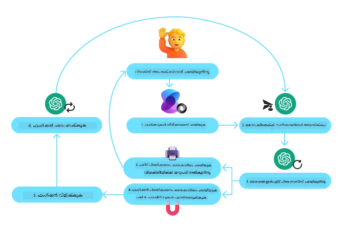
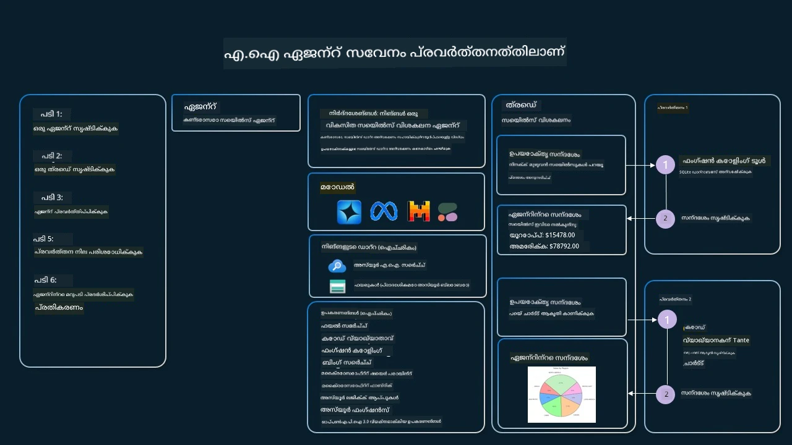

[](https://youtu.be/vieRiPRx-gI?si=cEZ8ApnT6Sus9rhn)

> _(ഈ പാഠത്തിന്റെ വീഡിയോ കാണാൻ മുകളിൽ ചിത്രത്തിൽ ക്ലിക്ക് ചെയ്യുക)_

# ടൂൾ യൂസ് ഡിസൈൻ പാറ്റേൺ

ടൂളുകൾ രസകരമാണ് കാരണം അവ AI ഏജന്റുകൾക്ക് കൂടുതൽ വൈവിധ്യമാർന്ന കഴിവുകൾ നൽകുന്നു. ഏജന്റ് നിർവഹിക്കാൻ കഴിവുള്ള പ്രവർത്തനങ്ങൾക്ക് പരിമിതമായ ഒരു സജ്ജീകരണം ഉള്ളതിനുപകരം, ഒരു ടൂൾ ചേർക്കുന്നതിലൂടെ, ഏജന്റ് ഇപ്പോൾ നിരവധി പ്രവർത്തനങ്ങൾ നിർവഹിക്കാൻ കഴിയും. ഈ അധ്യായത്തിൽ നാം ടൂൾ യൂസ് ഡിസൈൻ പാറ്റേണിനെക്കുറിച്ച് നോക്കുന്നു, ഇത് AI ഏജന്റുകൾക്ക് അവരുടെ ലക്ഷ്യങ്ങൾ കൈവരിക്കാൻ പ്രത്യേക ടൂളുകൾ ഉപയോഗിക്കാമെന്ന് വിവരണം നൽകുന്നു.

## പരിചയം

ഈ പാഠത്തിൽ നമുക്ക് താഴെ കൊടുത്തിരിക്കുന്ന ചോദ്യങ്ങൾക്കു മറുപടിയാകും അന്വേഷിക്കേണ്ടത്:

- ടൂൾ യൂസ് ഡിസൈൻ പാറ്റേൺ എന്താണ്?
- ഇത് ഏത് ഉപയോഗ സാഹചര്യങ്ങളിൽ പ്രയോഗിക്കാം?
- ടൂൾ യൂസ് ഡിസൈൻ പാറ്റേൻ നിർവഹിക്കാൻ ആവശ്യമായ ഘടകങ്ങൾ/നിർമാണഘടകങ്ങൾ എന്തെല്ലാം?
- വിശ്വസനീയമായ AI ഏജന്റുകൾ നിർമ്മിക്കാൻ ടൂൾ യൂസ് ഡിസൈൻ പാറ്റേൺ ഉപയോഗിക്കുമ്പോൾ പ്രത്യേകമായ ശ്രദ്ധിക്കേണ്ട കാര്യങ്ങൾ എന്തെല്ലാം?

## പഠന ലക്ഷ്യങ്ങൾ

ഈ പാഠം പൂർത്തിയാക്കിയശേഷം, നിങ്ങൾക്ക് ഇടക്കാലിൽ സാധിക്കൂ:

- ടൂൾ യൂസ് ഡിസൈൻ പാറ്റേൺ വിശദീകരിക്കുകയും അതിന്റെ ഉദ്ദേശ്യം വ്യക്തമാക്കുകയും ചെയ്യുക.
- ടൂൾ യൂസ് ഡിസൈൻ പാറ്റേൺ പ്രയോഗിക്കാവുന്ന ഉപയോഗ സാഹചര്യങ്ങൾ തിരിച്ചറിയുക.
- ഡിസൈൻ പാറ്റേൺ നടപ്പിലാക്കാൻ ആവശ്യമായ പ്രധാന ഘടകങ്ങൾ മനസ്സിലാക്കുക.
- ഈ ഡിസൈൻ പാറ്റേൺ ഉപയോഗിക്കുന്ന AI ഏജന്റുകളുടെ വിശ്വാസ്യത ഉറപ്പാക്കുന്നതിനുള്ള പരിഗണനകൾ തിരിച്ചറിയുക.

## ടൂൾ യൂസ് ഡിസൈൻ പാറ്റേൺ എന്തൊക്കെയാണ്?

**ടൂൾ യൂസ് ഡിസൈൻ പാറ്റേൺ** LLMകൾക്ക് പ്രത്യേക ലക്ഷ്യങ്ങൾ നേടുന്നതിനായി എക്സ്റ്റേൺ ടൂളുകളുമായി ഇടപഴകാനുള്ള കഴിവ് നൽകുന്നതിൽ കേന്ദ്രീകരിക്കുന്നു. ടൂളുകൾ എജന്റ് ഒരു പ്രവർത്തനം നിർവ്വഹിക്കാനായി എക്സിക്യൂട്ട് ചെയ്യാവുന്ന കോഡുകളാണ്. ഒരു ടൂൾ സാധാരണ ഫംഗ്‌ഷൻ പോലുമാകാം, ഉദാ. കാൽക്കുലേറ്റർ, അല്ലാതെയെങ്കിൽ സ്റ്റോക്ക് വില പരിശോധിക്കുന്നതോ കാലാവസ്ഥാ പ്രവചനം ചയ്തൊഴിക്കുന്നതോ പോലുള്ള മൂന്നാംകക്ഷി സേവനത്തിനുള്ള API കോൾ ആയിരിക്കാം. AI ഏജന്റുകളുടെ പരിസരത്ത്, ടൂളുകൾ ഏജന്റുകൾ നിർവ്വഹിക്കാൻ പാടുള്ള **മോഡൽ സൃഷ്ടിച്ച ഫംഗ്‌ഷൻ കോൾസ്**ക്ക് പ്രതികരിക്കുന്ന രീതിയിൽ രൂപകലയ്ക്കപ്പെട്ടിരിക്കുന്നു.

## ഇത് ഏത് ഉപയോഗ സാഹചര്യങ്ങളിൽ പ്രയോഗിക്കാം?

AI ഏജന്റുകൾ ടൂളുകൾ ഉപയോഗിച്ചു സങ്കീർണ്ണമായ പ്രവൃത്തികൾ പൂർത്തിയാക്കുന്നതിനോ, വിവരങ്ങൾ കണ്ടെത്തുന്നതിനോ, തീരുമാനങ്ങൾ എടുക്കുന്നതിനോ കഴിയും. ടൂൾ യൂസ് ഡിസൈൻ പാറ്റേൺ ഏറ്റവും പ്രയോജനപ്പെടുന്നത് ഡൈനാമിക് ഇൻറർ ആക്ഷനുകൾ ആവശ്യമായ സാഹചര്യങ്ങളിലാണ്, ഉദാ. ഡാറ്റാബേസുകൾ, വെബ് സേവനങ്ങൾ, അല്ലെങ്കിൽ കോഡ് വ്യാഖ്യാനകർ. ഈ കഴിവ് നിരവധി ഉപയോഗ സാഹചര്യങ്ങളിലായി പ്രയോജനപ്പെടുന്നു, അവയിൽ ചിലത്:

- **ഡൈനാമിക് വിവര ശേഖരണം:** ഏജന്റുകൾ അപ്ഡേറ്റ് ചെയ്ത ഡാറ്റ എടുക്കാൻ പുറം APIകളോ ഡാറ്റാബേസുകളോ ചോദിക്കാൻ കഴിയും (ഉദാഹരണത്തിന്, ഡാറ്റ അനാലിസിസിന് SQLite ഡാറ്റാബേസ് ചോദിക്കൽ, സ്റ്റോക്ക് വിലകളും കാലാവസ്ഥാ വിവരങ്ങളും ശേഖരിക്കൽ).
- **കോഡ് എക്സിക്യൂഷനും വ്യാഖ്യാനവും:** ഗണിതപ്രശ്നങ്ങൾ പരിഹരിക്കാൻ, റിപ്പോർട്ടുകൾ സൃഷ്ടിക്കാൻ, സിമുലേഷൻ നടത്താൻ എജന്റുകൾക്ക് കോഡ് അല്ലെങ്കിൽ സ്‌ക്രിപ്റ്റുകൾ പ്രവർത്തിപ്പിക്കാം.
- **വർക്ക്‌ഫ്ലോ ഓട്ടോമേഷൻ:** ടാസ്‌ക്ക് ഷെഡ്യൂളറുകൾ, ഇമെയിൽ സേവനങ്ങൾ, ഡാറ്റ പൈപ്പ്‌ലൈൻകൾ പോലെ ടൂളുകൾ സംയോജിപ്പിച്ച് ആവർത്തനപരമായ അല്ലെങ്കിൽ ബഹു-ഘട്ട വർക്ക്‌ഫ്ലോകൾ ഓട്ടോമേറ്റ് ചെയ്യുക.
- **കസ്റ്റമർ പിന്തുണ:** CRM സംവിധാനങ്ങൾ, ടിക്കറ്റിംഗ് പ്ലാറ്റ്ഫോമുകൾ, അറിവ് അടിസ്ഥാനങ്ങളുമായി ഏജന്റുകൾ സംവാദം നടത്താമെന്ന് ഉപഭോക്തൃ ചോദ്യങ്ങൾ പരിഹരിക്കാൻ.
- **ഉൾടക്ക സൃഷ്ടി/പരിഷ്‌ക്കരണം:** ഗൃഹപാഠങ്ങൾ ചെക്ക് ചെയ്യുന്നതും, സംഗ്രഹീകരിക്കുന്നതും, ഉള്ളടക്ക സുരക്ഷ സമൂഹീകരിക്കുന്നതും പോലുള്ള ടൂളുകൾ ഉപയോഗിച്ച് ഉള്ളടക്ക സൃഷ്ടിയിൽ സഹായം നൽകുക.

## ടൂൾ യൂസ് ഡിസൈൻ പാറ്റേൺ നടപ്പിലാക്കാൻ ആവശ്യമായ ഘടകങ്ങൾ/നിർമാണഘടകങ്ങൾ എന്തെല്ലാം?

ഈ നിർമ്മാണഘടകങ്ങൾ AI ഏജന്റിന് വിപുലമായ പ്രവർത്തനങ്ങൾ നിർവ്വഹിക്കാനാകുന്ന വിധം അനുവദിക്കുന്നു. ടൂൾ യൂസ് ഡിസൈൻ പാറ്റേൺ നടപ്പിലാക്കാൻ ആവശ്യമായ പ്രധാന ഘടകങ്ങൾ നോക്കാം:

- **ഫംഗ്‌ഷൻ/ടൂൾ സ്കീമകൾ**: ലഭ്യമായ ടൂളുകളുടെ വിശദമായ വ്യാഖ്യാനങ്ങൾ, അതിൽ ഫംഗ്‌ഷൻ പേര്, ഉദ്ദേശ്യം, ആവശ്യമായ പാരാമീറ്ററുകൾ, പ്രതീക്ഷിച്ച ഔട്ട്പുട്ടുകൾ എന്നിവ ഉൾപ്പെടുന്നു. ഈ സ്കീമകൾ LLMയ്ക്ക് ടൂളുകളുടെ ലഭ്യതയും സാധുവായ അഭ്യർത്ഥനകൾ എങ്ങനെ രൂപപ്പെടുത്താമെന്നതും മനസ്സിലാക്കാൻ സഹായിക്കുന്നു.

- **ഫംഗ്‌ഷൻ എക്സിക്യൂഷൻ ലൊജിക്**: ഉപയോക്താവിന്റെ ഉദ്ദേശ്യവും സംഭാഷണ പശ്ചാത്തലവും അടിസ്ഥാനമാക്കി ടൂളുകൾ എപ്പോഴും എങ്ങനെ പണിപ്പെടുത്തുവാനുള്ള നിയന്ത്രണം. ഇതിൽ പ്ലാനർ മോഡ്യൂളുകൾ, റൂട്ടിംഗ് യന്ത്രങ്ങൾ, അല്ലെങ്കിൽ ടൂൾ ഉപയോഗത്തെ ഡൈനാമിക് ആയി നിർണ്ണയിക്കുന്ന നിബന്ധനകളടങ്ങിയ പ്രവാഹങ്ങൾ ഉൾപ്പെടാം.

- **സന്ദേശ കൈകാര്യ സംവിധാനം**: ഉപയോക്തൃ ഇൻപുട്ടുകൾ, LLM പ്രതികരണങ്ങൾ, ടൂൾ കോൾസ്, ടൂൾ ഔട്ട്പുട്ടുകൾ എന്നിവക്കിടയിലെ സംഭാഷണ പ്രവാഹം കൈകാര്യം ചെയ്യുന്ന ഘടകങ്ങൾ.

- **ടൂൾ സംയോജന ഫ്രെയിംവർക്ക്**: എളുപ്പമുള്ള ഫംഗ്‌ഷനുകളോ, জটിലമായ ബാഹ്യ സേവനങ്ങളോ ഏജന്റിനെ കണക്ട് ചെയ്യുന്ന ഘടന.

- **പിശക് കൈകാര്യം & സാധുവാക്കൽ**: ടൂൾ നിർവ്വഹണത്തിൽ പരാജയങ്ങൾ കൈകാര്യം ചെയ്യേണ്ട സംവിധാനം, പാരാമീറ്ററുകൾ പരിശുദ്ധീകരണം, അപ്രതീക്ഷിത പ്രതികരണങ്ങൾ മാനേജുചെയ്യൽ.

- **സ്റ്റേറ്റ് മാനേജ്മെന്റ്**: സംഭാഷണ പശ്ചാത്തലം, മുൻ ടൂൾ ഇടപെടലുകൾ, സ്ഥിരതയുള്ള ഡാറ്റ എന്നിവ പിന്തുടർന്ന് മൾട്ടി-ടേൺ ഇടപെടലുകൾക്ക് താളം ഉറപ്പുവരുത്തുന്നു.

അടുത്തതായി, ഫംഗ്‌ഷൻ/ടൂൾ കോളിങ് വിശദമായി നോക്കാം.
 
### ഫംഗ്‌ഷൻ/ടൂൾ കോളിങ്

ഫംഗ്‌ഷൻ കോളിങ് LLMകൾക്ക് ടൂളുകളുമായി ഇടപഴകാൻ മുഖ്യ രീതിയാണ്. 'ഫംഗ്‌ഷൻ' എന്നും 'ടൂൾ' എന്നും പരസ്പരം ഉപയോഗിക്കുന്നത് സാധാരണമാണ്, കാരണം 'ഫംഗ്‌ഷനുകൾ' (പുനരുപയോഗ സാധ്യമായ കോഡ് ബ്ലോകുകൾ) ആയിരിക്കും ഏജന്റുകൾ ടാസ്കുകൾ നിർവ്വഹിക്കാൻ ഉപയോഗിക്കുന്ന 'ടൂളുകൾ'. ഒരു ഫംഗ്‌ഷന്റെ കോഡ് ഓർക്കാനായി, LLM ഉപഭോക്താവിന്റെ അഭ്യർത്ഥനയെ ഫംഗ്‌ഷന്റെ വിവരണത്തോട് താരതമ്യം ചെയ്യണം. ഇതിന് എല്ലാ ലഭ്യമായ ഫംഗ്‌ഷനുകളുടെ വിവരണങ്ങൾ അടങ്ങിയ ഒരു സ്കീമ LLMയ്ക്ക് അയയ്ക്കപ്പെടുന്നു. പിന്നീട് LLM ആവശ്യത്തിനുള്ള ഏറ്റവും അനുയോജ്യമായ ഫംഗ്‌ഷൻ തെരഞ്ഞെടുത്ത് അതിന്റെ പേര്, പാരാമീറ്ററുകൾ തിരിച്ചുകള് നൽകും. തിരഞ്ഞെടുത്ത ഫംഗ്‌ഷൻ ഓർക്കപ്പെടുകയും അതിന്റെ പ്രതികരണം LLMക്ക് തിരികെ അയക്കുകയും ചെയ്യുന്നു, LLM ആ വിവരങ്ങൾ ഉപയോക്തൃ അഭ്യർത്ഥനയ്ക്ക് മറുപടി നൽകുന്നതിന് ഉപയോഗിക്കും.

ഡെവലപ്പർമാർ ഫംഗ്‌ഷൻ കോളിങ് നടപ്പാക്കാൻ ആവശ്യമുള്ളത്:

1. ഫംഗ്‌ഷൻ കോളിങ് പിന്തുണയ്ക്കുന്ന ഒരു LLM മോഡൽ
2. ഫംഗ്‌ഷൻ വിവരണങ്ങൾ അടങ്ങിയ സ്കീമ
3. വിവരണപ്പെട്ട ഓരോ ഫംഗ്‌ഷന്റെയും കോഡ്

ഒരു നഗരത്തിലെ ഇപ്പോഴത്തെ സമയം കണ്ടെത്തുന്നതിന്റെ ഉദാഹരണമെടുത്ത് നോക്കാം:

1. **ഫംഗ്‌ഷൻ കോളിങ് പിന്തുണിക്കുന്ന LLM ആരംഭിക്കുക:**

    എല്ലായ്മയും മോഡലുകൾ ഫംഗ്‌ഷൻ കോളിങ് പിന്തുണയ്ക്കാറില്ല, അതുകൊണ്ട് നിങ്ങൾ ഉപയോഗിക്കുന്ന LLM ഇതു പിന്തുണയ്ക്കുന്നുവെന്ന് ഉറപ്പാക്കണം.     <a href="https://learn.microsoft.com/azure/ai-services/openai/how-to/function-calling" target="_blank">Azure OpenAI</a> ഫംഗ്‌ഷൻ കോളിങ് പിന്തുണയ്ക്കുന്നു. നാം OpenAI ക്ലയന്റ് തുടക്കം ആസൂയാക്കാം Azure OpenAI **Responses API** (സ്ഥിരമായ `/openai/v1/` എന്‍ഡ്പോയിന്റ് - `api_version` ആവശ്യമാണ്) നേരേ ഉപയോഗിച്ച്.

    ```python
    # Azure OpenAI (Responses API, v1 എന്‍ഡ്‌പോയിന്റ്)ക്കായി OpenAI ക്ലയന്റ് ആരംഭിക്കുക
    client = OpenAI(
        base_url=f"{os.environ['AZURE_OPENAI_ENDPOINT'].rstrip('/')}/openai/v1/",
        api_key=os.environ["AZURE_OPENAI_API_KEY"],
    )
    deployment_name = os.environ["AZURE_OPENAI_DEPLOYMENT"]
    ```

1. **ഫംഗ്‌ഷൻ സ്കീമ സൃഷ്ടിക്കുക**:

    ശേഷം, ഫംഗ്‌ഷൻ പേര്, ഫംഗ്‌ഷൻ ചെയ്യുന്നത് എന്തെന്ന് വിവരണം, ഫംഗ്‌ഷൻ പാരാമീറ്ററുകളുടെ പേര്, വിശകലനങ്ങളും ഉൾപ്പെടുന്ന JSON സ്കീമ നിർവ്വചിക്കും. 
    ഈ സ്കീം മുൻകൂർ സൃഷ്ടിച്ച ക്ലയന്റിനോട്‌ കൂടി ഉപയോക്താവിന്റെ സാൻ ഫ്രാൻസിസ്‌കോയിൽ സമയം പരിശോധിക്കുന്ന അഭ്യർത്ഥനയ്ക്ക് നൽകി അയക്കും. പ്രധാനമാകുന്നത് ഒരു **ടൂൾ കോൾ** ആണ് മടങ്ങിവരുന്നത്, ചോദ്യം നേരിട്ട് ഉത്തരം അല്ല. മുകളിൽ പറഞ്ഞതുപോലെ, LLM ടാസ്കിനായി തിരഞ്ഞെടുത്ത ഫംഗ്‌ഷന്റെ പേര്, അതിന് അയയ്ക്കേണ്ട പാരാമീറ്ററുകൾ മടങ്ങി നൽകുകയും ചെയ്യും.

    ```python
    # മോഡലിന് വായിക്കാൻ വേണ്ടി ഫംഗ്ഷൻ വിവരണം (Responses API ഫ്ലാറ്റ് ടൂൾ ഫോർമാറ്റ്)
    tools = [
        {
            "type": "function",
            "name": "get_current_time",
            "description": "Get the current time in a given location",
            "parameters": {
                "type": "object",
                "properties": {
                    "location": {
                        "type": "string",
                        "description": "The city name, e.g. San Francisco",
                    },
                },
                "required": ["location"],
            },
        }
    ]
    ```
   
    ```python
  
    # പ്രാരംബിക ഉപയോക്തൃ സന്ദേശം
    messages = [{"role": "user", "content": "What's the current time in San Francisco"}]

    # ആദ്യ API കോൾ: മോഡലിനെ ഫംഗ്ഷൻ ഉപയോഗിക്കാൻ ചോദിക്കുക
    response = client.responses.create(
        model=deployment_name,
        input=messages,
        tools=tools,
        tool_choice="auto",
        store=False,
    )

    # Responses API യാത്ര output-ൽ function_call ഇനങ്ങളായി tool calls തിരിച്ചറിയും.
    # അവ അടുത്ത തവണയിൽ മോഡലിന് പൂര്‍ണ സാഹചര്യമുണ്ടാകുന്നതിന് സംഭാഷണത്തിന് ചേർക്കുക.
    messages += response.output

    print("Model's response:")
    print(response.output)
  
    ```

    ```bash
    Model's response:
    [ResponseFunctionToolCall(arguments='{"location":"San Francisco"}', call_id='call_pOsKdUlqvdyttYB67MOj434b', name='get_current_time', type='function_call')]
    ```
  
1. **ടാസ്‌ക്ക് നിർവ്വഹിക്കാൻ ആവശ്യമായ ഫംഗ്‌ഷൻ കോഡ്:**

    LLM തിരഞ്ഞെടുക്കുന്ന ഫംഗ്‌ഷൻ ഓടിക്കാൻ വേണ്ടി, ടാസ്‌ക്ക് നിർവ്വഹിക്കുന്ന കോഡ് നടപ്പിലാക്കി പ്രവർത്തിപ്പിക്കണം.
    Python ഉപയോഗിച്ച് ഇപ്പോഴത്തെ സമയം കണ്ടെത്താനുള്ള കോഡ് നടപ്പിലാക്കാം. മറുപടി സന്ദേശത്തിൽ നിന്നും ഫംഗ്‌ഷൻ പേര്, പാരാമീറ്ററുകൾ എടുക്കുന്നതിന്റെ കോഡും എഴുതേണ്ടതുണ്ട്.

    ```python
      def get_current_time(location):
        """Get the current time for a given location"""
        print(f"get_current_time called with location: {location}")  
        location_lower = location.lower()
        
        for key, timezone in TIMEZONE_DATA.items():
            if key in location_lower:
                print(f"Timezone found for {key}")  
                current_time = datetime.now(ZoneInfo(timezone)).strftime("%I:%M %p")
                return json.dumps({
                    "location": location,
                    "current_time": current_time
                })
      
        print(f"No timezone data found for {location_lower}")  
        return json.dumps({"location": location, "current_time": "unknown"})
    ```

     ```python
    # ഫംഗ്‌ഷൻ കോളുകൾ കൈകാര്യം ചെയ്യുക
    tool_calls = [item for item in response.output if item.type == "function_call"]
    if tool_calls:
        for tool_call in tool_calls:
            if tool_call.name == "get_current_time":

                function_args = json.loads(tool_call.arguments)

                time_response = get_current_time(
                    location=function_args.get("location")
                )

                # ഫംഗ്‌ഷൻ_കാൾ_ഔട്ട്പുട്ട് ഐറ്റം എന്ന നിലയിൽ ടൂൾ ഫലം മടക്കുക
                messages.append({
                    "type": "function_call_output",
                    "call_id": tool_call.call_id,
                    "output": time_response,
                })
    else:
        print("No tool calls were made by the model.")

    # രണ്ടാം എപി‌ഐ കോൾ: മോഡലിൽ നിന്ന് അന്തിമ പ്രതികരണം നേടുക
    final_response = client.responses.create(
        model=deployment_name,
        input=messages,
        tools=tools,
        store=False,
    )

    return final_response.output_text
     ```

     ```bash
      get_current_time called with location: San Francisco
      Timezone found for san francisco
      The current time in San Francisco is 09:24 AM.
     ```

ഫംഗ്‌ഷൻ കോളിങ് ഏജന്റ് ടൂൾ യൂസ് ഡിസൈൻ പാറ്റേണിന്റെ ഹൃദയ ഭാഗമാണ്, എന്നാൽ അത് പൂര്‍ണമായും ആരംഭത്തിൽ നിന്ന് നിർമ്മിക്കാൻ ചിലപ്പോൾ ബുദ്ധിമുട്ട് ഉണ്ടാകാം.
നാം [Lesson 2](../../../02-explore-agentic-frameworks) കണ്ടതുപോലെ ഏജന്റിക് ഫ്രെയിംവർക്ക്‌ಗಳು ടൂൾ യൂസ് നടപ്പിലാക്കാൻ മുൻകൂർ സൃഷ്ടിച്ച ഘടകങ്ങൾ നൽകുന്നു.
 
## ഏജന്റിക് ഫ്രെയിംവർകുകൾ ഉപയോഗിച്ച് ടൂൾ യൂസ് ഉദാഹരണങ്ങൾ

വ്യത്യസ്ത ഏജന്റിക് ഫ്രെയിംവർകുകൾ ഉപയോഗിച്ച് ടൂൾ യൂസ് ഡിസൈൻ പാറ്റേൺ എങ്ങനെ നടപ്പിലാക്കാവുന്നുളള ചില ഉദാഹരണങ്ങൾ ഇതാ:

### Microsoft ഏജന്റ് ഫ്രെയിംവർക്ക്

<a href="https://learn.microsoft.com/azure/ai-services/agents/overview" target="_blank">Microsoft Agent Framework</a> AI ഏജന്റ്സ് നിർമ്മിക്കാൻ ഒരു ഓപ്പൺ സോഴ്‌സ് AI ഫ്രെയിംവർക് ആണ്. ഫംഗ്‌ഷൻ കോളിങ് ഉപയോഗിക്കുന്നത് എളുപ്പമാക്കാൻ `@tool` ഡെക്കറേറ്റർ ഉപയോഗിച്ച് ടൂളുകൾ Python ഫംഗ്‌ഷനായി നിർവ്വചിക്കാം. മോഡലും നിങ്ങളുടെ കോഡും തമ്മിലുള്ള സംവാദം ഫ്രെയിംവർക്ക് കൈകാര്യം ചെയ്യുന്നു. `FoundryChatClient` വഴി ഫയൽ സെർച്ച്, കോഡ് ഇൻറർപ്രിറ്റർ പോലുള്ള മുൻകൂർ ടെസ്റ്റ് ചെയ്ത ടൂളുകൾ ലഭ്യമാണ്.

താഴെയുള്ള ചിത്രം Microsoft Agent Framework ഉപയോഗിച്ച് ഫംഗ്‌ഷൻ കോളിങ് പ്രക്രിയ വിശദീകരിക്കുന്നു:



Microsoft Agent Framework-ൽ ടൂളുകൾ ഡെക്കറേറ്റഡ് ഫംഗ്‌ഷനുകളായി നിർവ്വചിച്ചിരിക്കുന്നു. മുമ്പ് കണ്ട `get_current_time` ഫംഗ്‌ഷനെ `@tool` ഡെക്കറേറ്റർ ഉപയോഗിച്ച് ടൂളാക്കി മാറ്റാം. ഫ്രെയിംവർക്ക് സ്വയം ഫംഗ്‌ഷനും പാരാമീറ്ററുകളും സീരിയലൈസ് ചെയ്ത് LLM അയയ്ക്കാനുള്ള സ്കീമ സൃഷ്ടിക്കും.

```python
import os
from agent_framework import tool
from agent_framework.foundry import FoundryChatClient
from azure.identity import AzureCliCredential

@tool(approval_mode="never_require")
def get_current_time(location: str) -> str:
    """Get the current time for a given location"""
    ...

# ക്ലയന്റ് സൃഷ്ടിക്കുക
provider = FoundryChatClient(
    project_endpoint=os.environ["AZURE_AI_PROJECT_ENDPOINT"],
    model=os.environ["AZURE_AI_MODEL_DEPLOYMENT_NAME"],
    credential=AzureCliCredential(),
)

# ഒരു ഏജന്റ് സൃഷ്ടിച്ച് ടൂളിനൊപ്പം പ്രവർത്തിപ്പിക്കുക
agent = provider.as_agent(name="TimeAgent", instructions="Use available tools to answer questions.", tools=get_current_time)
response = await agent.run("What time is it?")
```
  
### Microsoft Foundry Agent Service

<a href="https://learn.microsoft.com/azure/ai-services/agents/overview" target="_blank">Microsoft Foundry Agent Service</a> ഒരു പുതിയ ഏജന്റിക് ഫ്രെയിംവർക്ക് ആണ്, ഡെവലപ്പർമാർക്ക് സുരക്ഷിതമായി ഉയർന്ന നിലവാരമുള്ള AI ഏജന്റുകൾ നിർമ്മിക്കാനും വിതരണം ചെയ്‌വാനും സ്കെയിലുചെയ്യാനും സഹായിക്കുന്നു, അടിസ്ഥാനം കമ്പ്യൂട്ട് & സ്റ്റോറേജ് რესോഴ്‌സുകൾ നിയന്ത്രിക്കാത്തവരെ. പ്രത്യേകിച്ച് സംരംഭ ആപ്ലിക്കേഷനുകൾക്കായി അത്യന്തം പ്രയോജനപ്രദമാണ്, കാരണം ഇത് പൂർണ്ണമായ ഒരു മാനേജ് ചെയ്ത സർവീസ് ആണെന്നും സംരംഭ നിരോധിത സുരക്ഷയുണ്ട്.

LLM API നേരിട്ട് വികസിപ്പിക്കുന്നതിനോട് താരതമ്യേന, Microsoft Foundry Agent Service ചില പ്രധാന ഗുണങ്ങൾ നൽകുന്നു, അവ:

- ഓട്ടോമാറ്റിക് ടൂൾ കോളിങ് – ടൂൾ കോൾ പാഴ്‌സ് ചെയ്യുക, ഉപയോഗിക്കുക, പ്രതികരണം കൈകാര്യം ചെയ്യുക എന്ന ക്രമീകരണം എന്നിവർക്ക് വേണ്ട ഇല്ല; ഇവ സർവർ-സൈഡിൽ നടക്കുന്നു
- സുരക്ഷിതമായ ഡാറ്റ മാനേജ്മെന്റ് – നിങ്ങളുടെ സ്വന്തം സംഭാഷണ സ്റ്റേറ്റ് നിയന്ത്രിക്കേണ്ടതില്ല, ത്രെഡുകൾ സേവിച്ചുചേർക്കുന്നു ആവശ്യമായ എല്ലാ വിവരവും
- റെഡി-ടു-ഉസ് ടൂളുകൾ – Bing, Azure AI Search, Azure Functions പോലുള്ള ഡാറ്റാ ഉറവിടങ്ങളുമായി ഇടപഴകാനുള്ള ടൂളുകൾ

Microsoft Foundry Agent Service-ൽ ലഭ്യമായ ടൂളുകൾ രണ്ട് വിഭാഗങ്ങളായി തിരിക്കുന്നു:

1. വിജ്ഞാന ടൂളുകൾ:
    - <a href="https://learn.microsoft.com/azure/ai-services/agents/how-to/tools/bing-grounding?tabs=python&pivots=overview" target="_blank">Bing Search-നാൽ ഗ്രൗണ്ടിങ്ങ്</a>
    - <a href="https://learn.microsoft.com/azure/ai-services/agents/how-to/tools/file-search?tabs=python&pivots=overview" target="_blank">ഫയൽ സെർച്ച്</a>
    - <a href="https://learn.microsoft.com/azure/ai-services/agents/how-to/tools/azure-ai-search?tabs=azurecli%2Cpython&pivots=overview-azure-ai-search" target="_blank">Azure AI Search</a>

2. ആക്ഷൻ ടൂളുകൾ:
    - <a href="https://learn.microsoft.com/azure/ai-services/agents/how-to/tools/function-calling?tabs=python&pivots=overview" target="_blank">ഫംഗ്‌ഷൻ കോളിങ്</a>
    - <a href="https://learn.microsoft.com/azure/ai-services/agents/how-to/tools/code-interpreter?tabs=python&pivots=overview" target="_blank">കോഡ് ഇൻറർപ്രിറ്റർ</a>
    - <a href="https://learn.microsoft.com/azure/ai-services/agents/how-to/tools/openapi-spec?tabs=python&pivots=overview" target="_blank">OpenAPI നിർവ്വചിച്ച ടൂളുകൾ</a>
    - <a href="https://learn.microsoft.com/azure/ai-services/agents/how-to/tools/azure-functions?pivots=overview" target="_blank">Azure Functions</a>

ഏജന്റ് സർവീസ് ഈ ടൂളുകൾ `toolset` ആയി ചേർന്ന് ഉപയോഗിക്കാൻ അനുവദിക്കുന്നു. കൂടാതെ, പ്രത്യേക സംഭാഷണത്തിലെ സന്ദേശ ചരിത്രം പിന്തുടരുന്നതിനായി `threads` ഉപയോഗിക്കുന്നു.

നിങ്ങൾ ഒരു കമ്പനി "Contoso"യിൽ ഒരു സെയിൽസ് ഏജന്റ് എന്നാണ് കരുതുക. നിങ്ങളുടെ സെയിൽസ് ഡാറ്റ സംബന്ധിച്ച ചോദ്യങ്ങൾക്ക് മറുപടി നൽകാൻ കഴിവുള്ള ഒരു സംഭാഷണ ഏജന്റ് വികസിപ്പിക്കാൻ നിങ്ങളാഗ്രഹിക്കുന്നു.

Microsoft Foundry Agent Service ഉപയോഗിച്ച് നിങ്ങളുടെ സെയിൽസ് ഡാറ്റ വിശകലനം എങ്ങനെ ചെയ്യാമെന്ന് താഴെയുള്ള ചിത്രം വിശദീകരിക്കുന്നു:



ഈ സർവീസ് ഉപയോഗിച്ച് ടൂളുകൾ ഉപയോഗിക്കാൻ, ഒരു ക്ലയന്റ് സൃഷ്ടിച്ച് ടൂൾ അല്ലെങ്കിൽ ടൂൾസെറ്റ് നിർവ്വചിക്കാം. പ്രായോഗികമായി നടപ്പിലാക്കാൻ Python കോഡ് താഴെ കൊടുത്തിരിക്കുന്നു. LLM ടൂൾസെറ്റ് നോക്കി ഉപയോക്താവിന്റെ അഭ്യർത്ഥനയെ ആശ്രയിച്ച് ഉപയോക്താവ് നിർവ്വചിച്ച ഫംഗ്‌ഷൻ `fetch_sales_data_using_sqlite_query` ഉപയോഗിക്കണമെന്ന് അല്ലെങ്കിൽ മുൻകൂർ നിർമ്മിച്ച കോഡ് ഇൻറർപ്രിറ്റർ ഉപയോഗിക്കണമെന്ന് തീരുമാനിക്കും.

```python 
import os
from azure.ai.projects import AIProjectClient
from azure.identity import DefaultAzureCredential
from fetch_sales_data_functions import fetch_sales_data_using_sqlite_query # fetch_sales_data_functions.py ഫയലിൽ കാണുവാനാകുന്ന fetch_sales_data_using_sqlite_query ഫังก്ഷൻ.
from azure.ai.projects.models import ToolSet, FunctionTool, CodeInterpreterTool

project_client = AIProjectClient.from_connection_string(
    credential=DefaultAzureCredential(),
    conn_str=os.environ["PROJECT_CONNECTION_STRING"],
)

# ടൂള്സെറ്റ് ആരംഭിക്കുക
toolset = ToolSet()

# fetch_sales_data_using_sqlite_query ഫังก്ഷനുമായി ഫംഗ്ഷൻ വിളിക്കുന്ന ഏജന്റിനെ ആരംഭിച്ച് ടൂള്സെറ്റിൽ ചേർക്കുക
fetch_data_function = FunctionTool(fetch_sales_data_using_sqlite_query)
toolset.add(fetch_data_function)

# കോഡ് ഇൻറർപ്രിറ്റർ ടൂൾ തുടങ്ങുക, ടൂള്സെറ്റിൽ ചേർക്കുക.
code_interpreter = CodeInterpreterTool()toolset.add(code_interpreter)

agent = project_client.agents.create_agent(
    model="gpt-4o-mini", name="my-agent", instructions="You are helpful agent", 
    toolset=toolset
)
```

## വിശ്വസനീയമായ AI ഏജന്റ് നിർമ്മിക്കാൻ ടൂൾ യൂസ് ഡിസൈൻ പാറ്റേൺ ഉപയോഗിക്കുമ്പോഴുള്ള പ്രത്യേക പരിഗണനകൾ എന്തെല്ലാം?

LLMകൾ സൃഷ്ടിക്കുന്ന ഡൈനാമിക് SQL-ൽ പൊതുവായി സുരക്ഷയ്ക്ക് നിയന്ത്രണം പ്രധാനമാണ്, പ്രത്യേകിച്ച് SQL ഇൻജക്ഷൻ അല്ലെങ്കിൽ ദോഷകരമായ പ്രവർത്തനങ്ങളായ ഡാറ്റാബേസ് നശിപ്പിക്കൽ അല്ലെങ്കിൽ ഹാനി പ്രവർത്തനം നടത്താനുള്ള അപകടം. ഈ ആശങ്കകൾ യഥാർത്ഥമാണ്, പക്ഷേ ഡാറ്റാബേസ് ആക്സസ് അനുമതികൾ ശരിയായി ക്രമീകരിച്ച് ഫലപ്രദമായി നിയന്ത്രിക്കാവുന്നതാണ്. അധികം ഡാറ്റാബേസുകൾക്ക് റീഡ്-ഓൺലി ആയി ക്രമീകരിക്കുന്നതാണ് പാരമ്പര്യം. PostgreSQL അല്ലെങ്കിൽ Azure SQL പോലുള്ള ഡാറ്റാബേസ് സേവനങ്ങളിൽ, ആപ്പ് റീഡ്-ഓൺലി (SELECT) റോളിൽ നിരീക്ഷണം ഉണ്ടായിരിക്കണം.

ആപ്പ് സുരക്ഷിതമായ പരിസ്ഥിതിയിൽ പ്രവർത്തിക്കുന്നത് കൂടുതൽ സംരക്ഷണം നൽകുന്നു. സംരംഭ സാഹചര്യങ്ങളിൽ, ഓപ്പറേഷണൽ സിസ്റ്റങ്ങളിൽ നിന്നുള്ള ഡാറ്റ സാധാരണയായി റീഡ്-ഓൺലി ഡാറ്റാബേസിലേക്കോ ഡാറ്റാ വെയർഹൗസിലേക്കോ മാറ്റി മാറ്റി ഇന്കുറ്റം ലളിതമായ സ്കീമയോടെ പെരുമാറുന്നു. ഈ സമീപനം ഡാറ്റ സുരക്ഷിതവും പ്രകടനം മെച്ചപ്പെട്ടതും ആക്സസ് എളുപ്പമുള്ളതും ആക്കുന്നു, ആപ്പിന്റെ റീഡ്-ഓൺലി ആക്സസ് ഉറപ്പുണ്ടാക്കുന്നു.

## സാമ്പിൾ കോഡുകൾ

- Python: [Agent Framework](./code_samples/04-python-agent-framework.ipynb)
- .NET: [Agent Framework](./code_samples/04-dotnet-agent-framework.md)

## ടൂൾ യൂസ് ഡിസൈൻ പാറ്റേണുകൾക്കുറിച്ചുള്ള കൂടുതൽ ചോദ്യങ്ങളുണ്ടോ?

[Microsoft Foundry Discord](https://discord.com/invite/ATgtXmAS5D) ക്ലബ്ബിൽ ചേർന്നു മറ്റ് പഠനക്കാരെ കാണുക, ഓഫീസ് മണിക്കൂറുകളിൽ പങ്കെടുത്ത് നിങ്ങളുടെ AI ഏജന്റ് ചോദ്യങ്ങൾക്ക് ഉത്തരം കണ്ടെത്തുക.

## അനുബന്ധ വസ്തുക്കൾ

- <a href="https://microsoft.github.io/build-your-first-agent-with-azure-ai-agent-service-workshop/" target="_blank">Azure AI Agents Service Workshop</a>
- <a href="https://github.com/Azure-Samples/contoso-creative-writer/tree/main/docs/workshop" target="_blank">Contoso Creative Writer Multi-Agent Workshop</a>
- <a href="https://learn.microsoft.com/azure/ai-services/agents/overview" target="_blank">Microsoft Agent Framework Overview</a>


## മുമ്പത്തെ പാഠം

[എജന്റിക് ഡിസൈന്‍ പാറ്റേണുകള്‍ മനസിലാക്കല്‍](../03-agentic-design-patterns/README.md)

## അടുത്ത പാഠം

[എജന്റിക് RAG](../05-agentic-rag/README.md)

---

<!-- CO-OP TRANSLATOR DISCLAIMER START -->
**അറിയിപ്പ്**:
ഈ രേഖ AI പരിഭാഷാ സേവനം [Co-op Translator](https://github.com/Azure/co-op-translator) ഉപയോഗിച്ച് പരിഭാഷപ്പെടുത്തിയതാണ്. ഞങ്ങൾ കൃത്യതയ്ക്കായി ശ്രമിക്കുന്നുവെങ്കിലും, ഓട്ടോമേറ്റഡ് പരിഭാഷകളിൽ പിഴവുകൾ അല്ലെങ്കിൽ തെറ്റായ വിവരങ്ങൾ ഉണ്ടാകാൻ സാധ്യതയുണ്ട്. അതിന്റെ സ്വാഭാവിക ഭാഷയിലുള്ള അസൽ രേഖയാണ് പ്രാമാണികമായ ഉറവിടമായി പരിഗണിക്കേണ്ടത്. നിർണായകമായ വിവരങ്ങൾക്ക്, പ്രൊഫഷണൽ മനുഷ്യ പരിഭാഷ ശുപാർശ ചെയ്യുന്നു. ഈ പരിഭാഷ ഉപയോഗിച്ച് ഉണ്ടാകുന്ന തെറ്റിദ്ധാരണകൾ അല്ലെങ്കിൽ തെറ്റായ വ്യാഖ്യാനങ്ങൾക്കായി ഞങ്ങൾ ഉത്തരവാദികളല്ല.
<!-- CO-OP TRANSLATOR DISCLAIMER END -->