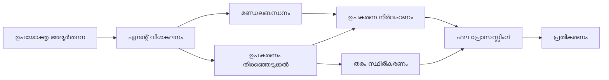

# 🛠️ Azure OpenAI (Responses API) (.NET) ഉപയോഗിച്ച് അഭ്യാസപരമായ ടൂൾ ഉപയോഗം

## 📋 പഠന ലക്ഷ്യങ്ങൾ

ഈ നോട്ട്‌ബുക്ക് Microsoft Agent Framework നെ .NET ഉപയോഗിച്ച് Azure OpenAI (Responses API) കൂടുമായി എന്റർപ്രൈസ്-ഗ്രേഡ് ടൂൾ ഇൻറഗ്രേഷൻ പാറ്റേണുകൾ അവതരിപ്പിക്കുന്നു. പലയിടത്തുള്ള പ്രത്യേക ടൂളുകൾ ഉപയോഗിച്ച് പ്രഗത്ഭമായ ഏജന്റ്മാർ നിർമ്മിക്കുന്നതും, C# ന്റെ ശക്തമായ ടൈപ്പിങ്ങും .NET ന്റെ എന്റർപ്രൈസ് സവിശേഷതകളും പ്രയോജനപ്പെടുത്തി പഠിക്കാം.

### നിങ്ങൾ കൈകാര്യം ചെയ്യാൻ പോകുന്ന അഭ്യാസപരമായ ടൂൾ കഴിവുകൾ

- 🔧 **മൾട്ടി-ടൂൾ ആർക്കിടെക്ചർ**: പല പ്രത്യേക കഴിവുകളുള്ള ഏജന്റ്മാർ നിർമ്മിക്കൽ
- 🎯 **ടൈപ്പ്-സേയ്ഫ് ടൂൾ എക്‌സിക്യൂഷൻ**: C# ന്റെ കംപൈൽ ടൈം പരിശോധന പ്രയോജനപ്പെടുത്തൽ
- 📊 **എന്റർപ്രൈസ് ടൂൾ പാറ്റേണുകൾ**: ഉൽപ്പാദനസൂചകമായ ടൂൾ ഡിസൈൻയും പിശക് കൈകാര്യംയും
- 🔗 **ടൂൾ സമാഹരണം**: സങ്കീർണ്ണ ബിസിനസ്സ് പ്രവൃത്തികൾക്കായി ടൂളുകൾ കോമ്പൈൻ ചെയ്യുക

## 🎯 .NET ടൂൾ ആർക്കിടെക്ചർ ലാഭങ്ങൾ

### എന്റർപ്രൈസ് ടൂൾ സവിശേഷതകൾ

- **കമ്പൈൽ-ടൈം പരിശോധന**: ടൂൾ പാരാമീറ്ററുകളുടെ ശരിത്വത്തിനു ശക്തമായ ടൈപ്പിംഗ് ഉറപ്പാക്കുന്നു
- **ഡിപെൻഡൻസി ഇൻജക്ഷൻ**: ടൂൾ മാനേജ്മെന്റിനായി IoC കണ്ടെയ്‌നർ ഇൻറഗ്രേഷൻ
- **അസിങ്ക്/അവെയിറ്റ് പാറ്റേണുകൾ**: ശരിയായ റിസോഴ്സ് മാനേജ്മെന്റിൽ ബാക്ക് ചെയ്തില്ലാത്ത ടൂൾ എക്‌സിക്യൂഷൻ
- **സ്ട്രക്ചേച്ചർഡ് ലോക്കിംഗ്**: ടൂൾ എക്‌സിക്യൂഷൻ നിരീക്ഷണത്തിനായി നിർമിച്ച ലോക്കിംഗ് ഇൻറഗ്രേഷൻ

### ഉൽപ്പാദന-സജ്ജമായ പാറ്റേണുകൾ

- **എക്സെപ്ഷൻ കൈകാര്യം**: ടൈപ്പുചെയ്ത എക്സെപ്ഷനുകളുള്ള സമഗ്ര പിശക് മാനേജ്മെന്റ്
- **റിസോഴ്സ് മാനേജ്മെന്റ്**: ശരിയായ ഡിസ്പോസൽ പാറ്റേണുകളും മെമ്മറി മാനേജ്മെന്റും
- **പ്രകടനം നിരീക്ഷണം**: നിർമിച്ച മെട്രിക്‌സുകളും പ്രകടന കൗണ്ടറുകളും
- **কോംഫിഗറേഷൻ മാനേജ്മെന്റ്**: പരിശോധനയുള്ള ടൈപ്പ്-സേഫ് കോൺഫിഗറേഷൻ

## 🔧 സാങ്കേതിക ആർക്കിടെക്ചർ

### കോർ .NET ടൂൾ ഘടകങ്ങൾ

- **Microsoft.Extensions.AI**: ഏകീകൃത ടൂൾ അബ്സ്ട്രാക്ഷൻ ലെയർ
- **Microsoft.Agents.AI**: എന്റർപ്രൈസ്-ഗ്രേഡ് ടൂൾ ഓർക്കസ്ട്രേഷൻ
- **Azure OpenAI (Responses API)**: ഉളളുന്ന കണക്ഷൻ പൂളിംഗ് സഹിതം ഉയർന്ന പ്രകടന API ക്ലയന്റ്

### ടൂൾ എക്‌സിക്യൂഷൻ പൈപ്പ്‌ലൈൻ



## 🛠️ ടൂൾ വിഭാഗങ്ങളും പാറ്റേണുകളും

### 1. **ഡാറ്റാ പ്രോസസ്സിംഗ് ടൂൾസ്**

- **ഇൻപുട്ട് പരിശോധന**: ഡാറ്റാ അനൊറേഷനുകളോടെ ശക്തമായ ടൈപ്പിംഗ്
- **ട്രാൻസ്ഫോം ഓപ്പറേഷനുകൾ**: ടൈപ്പ്-സേഫ് ഡാറ്റാ മാറ്റംവും ഫോർമാറ്റിംഗും
- **ബിസിനസ്സ് ലജിക്ക്**: ഡൊമെയ്ൻ-സ്പെസിഫിക് കാൽക്കുലേഷൻ ആൻഡ് അനാലിസിസ് ടൂളുകൾ
- **ഔട്ട്പുട്ട് ഫോർമാറ്റിംഗ്**: സ്ട്രക്ചേച്ചർഡ് റസ്പോൺസ് ജനറേഷൻ

### 2. **ഇൻറഗ്രേഷൻ ടൂൾസ്**

- **API കണക്ടറുകൾ**: HttpClient ഉപയോഗിച്ച് RESTful സർവീസ് ഇൻറഗ്രേഷൻ
- **ഡേറ്റാബേസ് ടൂൾസ്**: ഡേറ്റാ ആക്സസിനായി Entity Framework ഇൻറഗ്രേഷൻ
- **ഫയൽ ഓപ്പറേഷനുകൾ**: പരിശോധനയോടെ സുരക്ഷിത ഫയൽ സിസ്റ്റം ഓപ്പറേഷനുകൾ
- **കാഴ്ചപ്പാട് സേവനങ്ങൾ**: മൂന്നാം കക്ഷി സേവന ഇൻറഗ്രേഷൻ പാറ്റേണുകൾ

### 3. **ഉപകർണ ടൂൾസ്**

- **ചെറുതായും ഇടച്ചുകൊള്ളൽ**: സ്ട്രിംഗ് മാനിപ്പുലേഷൻ ആൻഡ് ഫോർമാറ്റിംഗ് യൂറ്റിലിറ്റി സ്റ്റ്റെസുകൾ
- **തിയ്യതി/സമയം ഓപ്പറേഷനുകൾ**: സാംസ്കാരികപരമായി അനുയോജ്യമായ തിയ്യതി/സമയം കണക്കുകൾ
- **ഗണിതം ടൂൾസ്**: കൃത്യതയുള്ള കണക്കുകൾക്കും സ്ഥിതിവിവര ശാസ്ത്ര പ്രവർത്തനങ്ങൾക്കും
- **പരിശോധന ടൂൾസ്**: ബിസിനസ്സ് നിയമ പരിശോധനയും ഡാറ്റാ സ്ഥിരീകരണവും

.NET ൽ ശക്തമായ, ടൈപ്പ്-സേഫ് ടൂൾ കഴിവുകളുള്ള എന്റർപ്രൈസ്-ഗ്രേഡ് ഏജന്റ്മാർ നിർമ്മിക്കാൻ തയാറാണോ? പ്രൊഫഷണൽ-ഗ്രേഡ് പരിഹാരങ്ങൾ ആർക്കിടെക്റ്റ് ചെയ്യാം! 🏢⚡

## 🚀 ആരംഭിക്കുന്നത്

### മുൻ‌അവശ്യങ്ങൾ

- [.NET 10 SDK](https://dotnet.microsoft.com/download/dotnet/10.0) അല്ലെങ്കിൽ ഉയർന്ന
- Azure OpenAI വിഭവവും മോഡൽ ഡിപ്ലോയ്മെന്റും ഉള്ള ഒരു [Azure സബ്‌സ്‌ക്രിപ്ഷൻ](https://azure.microsoft.com/free/)
- [Azure CLI](https://learn.microsoft.com/cli/azure/install-azure-cli) — `az login` ഉപയോഗിച്ച് സൈൻ ഇൻ ചെയ്യുക

### ആവശ്യമായ എൻവയിരോമെന്റ് വേരിയബിളുകൾ

```bash
# zsh/bash
export AZURE_OPENAI_ENDPOINT=https://<your-resource>.openai.azure.com
export AZURE_OPENAI_DEPLOYMENT=gpt-4o-mini
# പിന്നീട് സൈൻ ഇൻ ചെയ്യുക zodat AzureCliCredential ഒരു ടോക്കൺ നേടാൻ കഴിയും
az login
```

```powershell
# പവർഷെൽ
$env:AZURE_OPENAI_ENDPOINT = "https://<your-resource>.openai.azure.com"
$env:AZURE_OPENAI_DEPLOYMENT = "gpt-4o-mini"
# തുടർന്ന് സൈൻ ഇൻ ചെയ്യുക ഞാൻ AzureCliCredential ഒരു ടോക്കൺ ലഭ്യമാക്കാൻ കഴിയും
az login
```

### സാമ്പിൾ കോഡ്

കോഡ് ഉദാഹരണം നടത്താൻ,

```bash
# zsh/bash
chmod +x ./04-dotnet-agent-framework.cs
./04-dotnet-agent-framework.cs
```

അല്ലെങ്കിൽ dotnet CLI ഉപയോഗിച്ച്:

```bash
dotnet run ./04-dotnet-agent-framework.cs
```

പൂര്‍ണ്ണമായ കോഡ് കാണാന്‍ [`04-dotnet-agent-framework.cs`](../../../../04-tool-use/code_samples/04-dotnet-agent-framework.cs) കാണുക.

```csharp
#!/usr/bin/dotnet run

#:package Microsoft.Extensions.AI@10.*
#:package Microsoft.Agents.AI.OpenAI@1.*-*
#:package Azure.AI.OpenAI@2.1.0
#:package Azure.Identity@1.13.1

using System.ComponentModel;

using Microsoft.Agents.AI;
using Microsoft.Extensions.AI;

using Azure.AI.OpenAI;
using Azure.Identity;

// Tool Function: Random Destination Generator
// This static method will be available to the agent as a callable tool
// The [Description] attribute helps the AI understand when to use this function
// This demonstrates how to create custom tools for AI agents
[Description("Provides a random vacation destination.")]
static string GetRandomDestination()
{
    // List of popular vacation destinations around the world
    // The agent will randomly select from these options
    var destinations = new List<string>
    {
        "Paris, France",
        "Tokyo, Japan",
        "New York City, USA",
        "Sydney, Australia",
        "Rome, Italy",
        "Barcelona, Spain",
        "Cape Town, South Africa",
        "Rio de Janeiro, Brazil",
        "Bangkok, Thailand",
        "Vancouver, Canada"
    };

    // Generate random index and return selected destination
    // Uses System.Random for simple random selection
    var random = new Random();
    int index = random.Next(destinations.Count);
    return destinations[index];
}

// Azure OpenAI with the Responses API (stable v1 endpoint). Sign in with `az login`.
var azureEndpoint = Environment.GetEnvironmentVariable("AZURE_OPENAI_ENDPOINT")
    ?? throw new InvalidOperationException("AZURE_OPENAI_ENDPOINT is not set.");
var deployment = Environment.GetEnvironmentVariable("AZURE_OPENAI_DEPLOYMENT") ?? "gpt-4o-mini";

var azureClient = new AzureOpenAIClient(new Uri(azureEndpoint), new AzureCliCredential());

// Define Agent Identity and Comprehensive Instructions
// Agent name for identification and logging purposes
var AGENT_NAME = "TravelAgent";

// Detailed instructions that define the agent's personality, capabilities, and behavior
// This system prompt shapes how the agent responds and interacts with users
var AGENT_INSTRUCTIONS = """
You are a helpful AI Agent that can help plan vacations for customers.

Important: When users specify a destination, always plan for that location. Only suggest random destinations when the user hasn't specified a preference.

When the conversation begins, introduce yourself with this message:
"Hello! I'm your TravelAgent assistant. I can help plan vacations and suggest interesting destinations for you. Here are some things you can ask me:
1. Plan a day trip to a specific location
2. Suggest a random vacation destination
3. Find destinations with specific features (beaches, mountains, historical sites, etc.)
4. Plan an alternative trip if you don't like my first suggestion

What kind of trip would you like me to help you plan today?"

Always prioritize user preferences. If they mention a specific destination like "Bali" or "Paris," focus your planning on that location rather than suggesting alternatives.
""";

// Create AI Agent with Advanced Travel Planning Capabilities
// Get the Responses client for the deployment and create the AI agent
// Configure agent with name, detailed instructions, and available tools
// This demonstrates the .NET agent creation pattern with full configuration
AIAgent agent = azureClient
    .GetOpenAIResponseClient(deployment)
    .CreateAIAgent(
        name: AGENT_NAME,
        instructions: AGENT_INSTRUCTIONS,
        tools: [AIFunctionFactory.Create(GetRandomDestination)]
    );

// Create New Conversation Thread for Context Management
// Initialize a new conversation thread to maintain context across multiple interactions
// Threads enable the agent to remember previous exchanges and maintain conversational state
// This is essential for multi-turn conversations and contextual understanding
AgentThread thread = agent.GetNewThread();

// Execute Agent: First Travel Planning Request
// Run the agent with an initial request that will likely trigger the random destination tool
// The agent will analyze the request, use the GetRandomDestination tool, and create an itinerary
// Using the thread parameter maintains conversation context for subsequent interactions
await foreach (var update in agent.RunStreamingAsync("Plan me a day trip", thread))
{
    await Task.Delay(10);
    Console.Write(update);
}

Console.WriteLine();

// Execute Agent: Follow-up Request with Context Awareness
// Demonstrate contextual conversation by referencing the previous response
// The agent remembers the previous destination suggestion and will provide an alternative
// This showcases the power of conversation threads and contextual understanding in .NET agents
await foreach (var update in agent.RunStreamingAsync("I don't like that destination. Plan me another vacation.", thread))
{
    await Task.Delay(10);
    Console.Write(update);
}
```

---

<!-- CO-OP TRANSLATOR DISCLAIMER START -->
**അറിയിപ്പ്**:
ഈ രേഖ AI പരിഭാഷാ സേവനം [Co-op Translator](https://github.com/Azure/co-op-translator) ഉപയോഗിച്ച് പരിഭാഷപ്പെടുത്തിയതാണ്. ഞങ്ങൾ കൃത്യതയ്ക്കായി ശ്രമിക്കുന്നുവെങ്കിലും, ഓട്ടോമേറ്റഡ് പരിഭാഷകളിൽ പിഴവുകൾ അല്ലെങ്കിൽ തെറ്റായ വിവരങ്ങൾ ഉണ്ടാകാൻ സാധ്യതയുണ്ട്. അതിന്റെ സ്വാഭാവിക ഭാഷയിലുള്ള അസൽ രേഖയാണ് പ്രാമാണികമായ ഉറവിടമായി പരിഗണിക്കേണ്ടത്. നിർണായകമായ വിവരങ്ങൾക്ക്, പ്രൊഫഷണൽ മനുഷ്യ പരിഭാഷ ശുപാർശ ചെയ്യുന്നു. ഈ പരിഭാഷ ഉപയോഗിച്ച് ഉണ്ടാകുന്ന തെറ്റിദ്ധാരണകൾ അല്ലെങ്കിൽ തെറ്റായ വ്യാഖ്യാനങ്ങൾക്കായി ഞങ്ങൾ ഉത്തരവാദികളല്ല.
<!-- CO-OP TRANSLATOR DISCLAIMER END -->